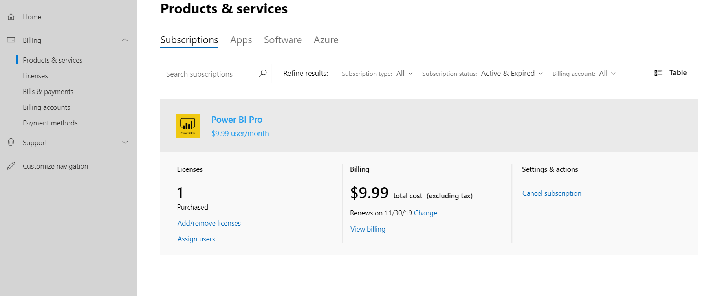

# 自助購買常見問題

> [!NOTE]
> 本文中的資訊僅適用于 Microsoft 電源平臺（Power BI、Power Apps 及 Power 自動化）訂閱。

自助購買現在可用於多個國家和地區的電源平臺。

## 一般

### Microsoft 會在自助購買電源平台產品方面宣告哪些變更？

在11月19日，我們為 IT 系統管理員提供一種方法，讓您可以透過 PowerShell 關閉以每個產品為基礎的自助購買服務。 若要瞭解如何使用它，請參閱[Use AllowSelfServicePurchase for The MSCommerce PowerShell module](allowselfservicepurchase-powershell.md)。

若要提供更多時間來準備這種變更，我們會針對所有商業性雲端客戶，更新啟動以供 Power Platform 產品的自助購買功能開始使用 Power BI。  

自2020年1月14日起，商務用電平台產品（Power BI、Power Apps 及 Power 自動化）的自助購買、訂閱及授權管理功能將可供美國的商業雲端客戶使用。 「自助購買」可讓使用者嘗試新的技術，並讓他們開發最終受益于更大組織的解決方案。 目前政府、非盈利性或教育版中的承租人不會提供此功能。 中央採購和 IT 小組透過<a href="https://go.microsoft.com/fwlink/p/?linkid=2024339" target="_blank">Microsoft 365 系統管理中心</a>，可看到透過購買及部署自助購買解決方案的所有使用者，也可以透過 PowerShell 關閉以每個產品為基礎的自助購買。

### Microsoft 為何為電源平台產品新增自助購買選項？

在當今的世界中，使用者和部門正逐漸自行尋找及購買技術解決方案。 我們已收到許多來自這些客戶的要求，以啟用電源平台產品的自助購買。 我們對此客戶的需求進行回應，同時也平衡 IT 管理員的需求，當組織內的人員採用協力廠商解決方案時，其組織中的人員不需要他們的知識，通常會失去可視性和控制權。 透過適用于電源平台產品的自助服務功能，IT 系統管理員可以完全瞭解組織內所進行的所有自助購買，而且在組織層級設定的資料控管原則，將會計入透過自助服務購買的訂閱。 系統管理員也可以透過現有的合約和定價為指派給自助購買之使用者的現有合約和定價，指派現有的授權或購買其他訂閱。 在指派這些已集中購買的授權之後，系統管理員就可以要求購買者取消其現有的訂閱。 Microsoft 正在探索為未來簡化和簡化此程式的方法。

### 自助購買可使用哪些電源平台產品？

Microsoft 已針對美國的客戶自行購買電源平臺（Power BI、Power Apps 及 Power 自動化），並在未來的幾個月內推出其他市場。 目前政府、非盈利性或教育版中的承租人不會提供此功能。

### 電源平台產品以外的服務是否會啟用自助購買？

此時，只有電源平臺系列產品會透過自助購買提供服務。

## 進行自助購買

### 客戶如何進行自助購買？

客戶可以從 Microsoft Power BI、Power App 及 Power the web to the the Power the the the Power the the the 系統會先要求客戶輸入電子郵件地址，以確保他們是現有 Azure Active Directory （AD）租使用者中的使用者。 然後使用其 Azure AD 認證，將其導向為登入。 登入後，系統會要求客戶選擇他們要購買的訂閱數目，並提供信用卡付款。 購買完成後，他們就能開始使用他們的訂閱。 購買者也可以存取<a href="https://go.microsoft.com/fwlink/p/?linkid=2024339" target="_blank">Microsoft 365 系統管理中心</a>的有限視圖，讓組織中的其他人員可以使用產品。

### 自助購買的付款選項為何？

目前，信用卡是唯一可用的支付方式。 不支援透過開具發票付款。

### 誰可以透過自助購買購買？

在受管理的 Azure AD 租使用者中，任何具有非來賓使用者帳戶的使用者都可以購買。 這項功能將不會提供給政府、非贏利或教育版的承租人。 如果這適用于您的組織，則目前不需要其他動作即可控制自助購買。

組織或市場上沒有資格進行自助購買的使用者，會看到一則訊息，詢問他們目前是否要與其 IT 系統管理員聯繫。

### 來賓使用者是否可以透過自助購買購買？

否，來賓使用者無法在其為來賓的承租人中完成自助購買。

### 使用者是否可以透過自助購買從內部部署的 Active Directory 購買？

如果使用者在合格的 Azure AD 租使用者中有使用中的使用者帳戶，他們就可以完成自助購買。

### 誰可以自行服務購買指派授權？

自助購買只能夠將授權指派給相同 Azure AD 租使用者中的使用者。 買方將可以存取<a href="https://go.microsoft.com/fwlink/p/?linkid=2024339" target="_blank">Microsoft 365 系統管理中心</a>的有限視圖，以指派授權。 他們只具有可視性，可將授權指派給他們透過自助購買購買的產品，而且他們只能夠將這些授權指派給相同 Azure AD 租使用者中的使用者。

### 自助買方如何查看和管理其購買情況？

自助購買可在<a href="https://go.microsoft.com/fwlink/p/?linkid=2024339" target="_blank">Microsoft 365 系統管理中心</a>的有限顯示中管理其購買。 「購買者」可以從內置於所有 Microsoft 365 和 Dynamics online 應用程式的應用程式啟動器中的系統**管理**磚，取得系統管理員中心的連線。 他們可以查看所進行的購買、購買相同服務的其他訂閱，並將這些訂閱的授權指派給其組織中的其他使用者。 此外，「購買者」可以查看和支付帳單、更新其支付方式，以及取消訂閱。

**針對自助伺服器購買的有限 Microsoft 365 系統管理中心進行查看：**

## 定價

### 自助購買的定價為何？

適用于自助購買之每個電源平台產品的定價，可在 Microsoft 網站上使用，而且在進行自助購買時也會顯示為結帳體驗的一部分。 這些價格可能會與組織購買合作夥伴所提供的中央購買或價格時所支付的價格不同。

### 誰負責付款？

透過自助購買方式購買訂閱的人員將會計費，並根據購買的條款和定價負責支付。

## 系統管理功能

### 管理員對自助購買有哪些功能？

系統管理員可以在<a href="https://go.microsoft.com/fwlink/p/?linkid=2024339" target="_blank">Microsoft 365 系統管理中心</a>的組織中，查看其組織中所進行的所有自助購買。 他們可以查看產品、購買購買的訂閱、到期日、訂單記錄、購買價格，以及每個自助購買的指派使用者。 在 [電源平臺系統管理中心] 中，系統管理員也可以查看自助購買容量。 根據組織的需要，系統管理員可以透過 PowerShell 關閉以每個產品為基礎的自助購買。 管理員透過自助購買或集中購買的產品，都具有相同的資料管理和存取原則。

系統管理員也可以控制組織中的使用者是否可以進行自助購買。 如需詳細資訊，請參閱[Use AllowSelfServicePurchase For MSCommerce PowerShell module](allowselfservicepurchase-powershell.md)。

### Microsoft 如何透過啟用自助購買來尊重資料控管和合規性？

系統管理員可根據其資料管理和合規性需求，控制其承租人中所啟用的服務和產品。 此外，您的組織已啟用的所有資料管理和存取原則，都將套用至自助購買的服務。

### 誰擁有從自助購買建立的產品資料？

從透過自助購買購買的產品所建立的資料，由組織擁有及控制。

### 如何集中購買透過「自助購買」所進行的購買？

系統管理員可以透過現有的合約和定價為指派給自助購買的使用者，指派現有的授權或購買其他的 Power Platform 產品（Power BI、Power App 及 Power 自動化）訂閱。 在指派這些已集中購買的授權之後，系統管理員就可以要求購買者取消其現有的訂閱。 Microsoft 正在探索為未來簡化和簡化此程式的方法。

### 系統管理員會在何處購買自助服務？

通用和計費系統管理員可以查看透過「自助購買」購買的訂閱，**以在**  >  <a href="https://go.microsoft.com/fwlink/p/?linkid=2024339" target="_blank">Microsoft 365 系統管理中心</a>購買您的**產品**，以及透過中央採購購買的所有其他訂閱。 他們可以篩選清單，只列出透過中央購買購買的訂閱，或包含透過自助購買購買的訂閱。

系統管理員可以查看產品、買方名稱、購買的訂閱、到期日、訂單記錄、購買價格，以及指派的使用者。

## 支援和訓練

### 客戶的 IT 部門或合作夥伴是否預計能夠支援透過自助購買購買的產品？

IT 部門和合作夥伴不會期望對透過自助購買購買的產品提供支援。 Microsoft 會提供自助購買服務的標準支援。

### 如果自助買方致電支援，他們是否會使用客戶的「Premier 支援」事件？

自助購買者不會使用客戶的「Premier 支援」事件來接收自助購買的支援。

### 使用者期望透過自助購買購買的產品，如何接收訓練？

Microsoft Power BI、Power App 及 Power the web for users 提供大量的使用者訓練。 產品已引導教學、檔、範例及強大的社區，以直接從其他使用者取得答案和秘訣。

### 使用者離開組織時，自助購買會發生什麼事？

有效的使用者會在訂閱期間繼續完整使用自助購買。 在買方直接取消服務，或系統管理員要求透過客戶支援取消訂閱時，訂閱仍會保持使用中狀態。 系統管理員也可以選擇將已集中購買的授權指派給已取消之訂閱的使用者。

## 協力程式

### Microsoft 合作夥伴在自助購買方面的角色為何？

委派管理許可權的合作夥伴可以在<a href="https://go.microsoft.com/fwlink/p/?linkid=2024339" target="_blank">Microsoft 365 系統管理中心</a>中查看自助購買，就像是管理員一樣。合作夥伴可協助您支援要集中使用自助購買購買的產品的組織。 此外，協力廠商可提供可擴充自助購買功能的解決方案。

## 適用國家與地區

### 我可以在哪個國家/地區購買自助服務？

您可以在下列國家和地區購買自助購買：阿富汗、芬蘭群島、阿爾巴尼亞、阿爾及利亞美洲薩摩亞，安道爾，安哥拉，Anguilla，Antarctica，安地卡及巴布達，阿根廷，亞美尼亞，Aruba，澳大利亞，奧地利，亞塞拜然，，巴林，孟加拉國，巴巴多斯，白俄羅斯，比利時，保加利亞，Bonaire，尤斯特歇斯，百慕達，不丹，玻利維亞，博茨瓦納，Saba 島，巴西，英屬印度洋領土，英屬維爾京群島，汶萊，布吉納法索，蒲隆地，維德角，柬埔寨，喀麥隆，加拿大，開曼群島，中部非洲共和國，Chad，智利，中國耶誕節島，科科斯（基基）群島，哥倫比亞，科摩羅，剛果，剛果（金），庫島，哥斯大黎加，象牙海岸，克羅地亞，克羅地亞，賽普勒斯，Curaçao，捷克共和國，丹麥，吉布地，Dominica，多明尼加共和國，厄瓜多爾，埃及，，薩爾瓦多，法屬幾內亞，厄立特里亞，愛沙尼亞，法國，法屬圭亞那，法屬玻里尼西亞，法屬南部領地，Gabon，岡比亞，格魯吉亞，德國，加納，直布羅陀，格陵蘭，希臘，格瑞那達，Guadeloupe，關島，瓜地馬拉，Guernsey，幾內亞，幾內亞比索，蓋亞納，海地，赫德島和麥克唐納群島，宏都拉斯，香港特別行政區，匈牙利，冰島，印尼，伊拉克，愛爾蘭，曼島 Man，以色列，義大利，牙買加，日本，Jersey，Kiribati，科威特，賴索托，賴比瑞亞，利比亞，牙買加，，澳門特別行政區，馬達加斯加，馬拉威，，馬來西亞，馬爾地夫，馬里，馬爾他，馬紹爾群島，馬丁尼克，茅利塔尼亞，模里西斯，Mayotte，墨西哥，Micronesia，摩爾多瓦，摩納哥，蒙古，黑山，Montserrat，摩洛哥，莫三比克，緬甸，納米比亞，Nauru，尼泊爾，荷蘭，新赫里多尼亞，紐西蘭，尼加拉瓜，尼日爾，北馬里安納群島，挪威，阿曼，新幾內亞，Palau，Niue，菲律賓，皮特凱恩，新幾內亞，波蘭，葡萄牙，菲律賓，菲律賓，皮特凱恩群島，波蘭，葡萄牙，波多黎各，卡塔爾，Réunion，羅馬尼亞，俄羅斯，盧安達，法屬 Barthélemy，聖基茨和尼維斯聖露西亞，法屬聖馬丁，聖皮爾和密克隆，聖文森特和格林納丁斯群島St.Vincent，薩摩亞群島，聖地牙哥，聖約瑟，聖多美，聖約瑟，沙烏地阿拉伯，塞內加爾，聖保羅，聖馬丁，塞拉里昂，聖保羅，，索馬里，南部，南部，南部，南部，南部，南方，南方群島，，南部蘇丹，，阿森松，特裡斯坦 da 尼亞，蘇利南，斯瓦爾巴和揚馬延，史瓦濟蘭，瑞典，瑞士，臺灣，塔吉克斯坦，坦尚尼亞，泰國，Timor-Leste，Togo，Tokelau，湯加，特立尼達和多巴哥，突尼斯，土耳其，土庫曼斯坦，土克斯及開科斯群島，Tuvalu，U.S. 外島，美國維爾京群島，烏干達，烏克蘭，阿拉伯聯合大公國，英國，美國、烏拉圭，烏茲別克斯坦，瓦努阿圖，梵蒂岡，葉門，尚比亞，