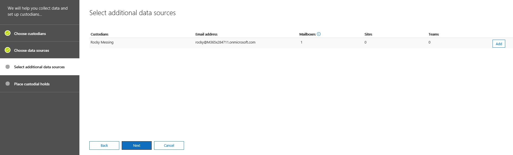

# 將保管人新增至高級 eDiscovery 案例Add custodians to an Advanced eDiscovery case

使用高級 eDiscovery 中內建的保管人管理工具，讓您的工作流程與管理保管人的工作流程一致，並識別與案例相關聯的相關 custodial 資料來源。Use the built-in custodian management tool in Advanced eDiscovery to coordinate your workflows around managing custodians and identifying relevant, custodial data sources associated with a case. 當您新增保管人時，系統會自動針對其 Exchange 信箱和 OneDrive 的商務帳戶，識別並保留其位置。When you add a custodian, the system can automatically identify and place a hold on their Exchange mailbox and OneDrive for Business account. 在調查的探索過程中，您也可以識別保管人存取或貢獻的其他資料來源（例如信箱、網站或小組）。During the discovery process of your investigation, you might also identify additional data sources (such as mailboxes, sites, or Teams) that a custodian accessed or contributed to. 在此情況下，您可以使用保管人管理工具，將這些資料來源關聯至特定的保管人。In this situation, you can use the custodian management tool to associate those data sources will a specific custodian. 在您將保管人新增至案例並與其他資料來源建立關聯之後，您可以快速保存資料並搜尋 custodial 資料。After you add custodians to a case and associate other data source with them, you can quickly preserve data and search the custodial data.

使用下列工作流程在高級 eDiscovery 案例中新增及管理保管人。Use the following workflow to add and manage custodians in Advanced eDiscovery cases. 

![[管理員管理] 索引標籤](../media/CustodianMgtPage.png)

## 開始之前Before you begin

若要將保管人新增至案例，您必須是 eDiscovery 管理員角色群組的成員。To add custodians to a case, you must be a member of the eDiscovery Manager role group. 這會為您提供必要的許可權，以將保管人新增至案例，並在 custodial 資料來源上進行保留。This will provide you with the necessary permissions to add custodians to a case and place a hold on the custodial data sources.

## 步驟1：新增可能的保管人Step 1: Add potential custodians

第一步是將保管人識別並新增至案例。The first step is to identify and add custodians to the case.

1. 在「**高級 eDiscovery**首頁」上，按一下您要新增保管人的案例。On the **Advanced eDiscovery** home page, click the case that you want to add custodians to. 
 
2. 按一下 [**保管人**] 索引標籤，然後按一下 [ **+ 新增保管人**]。Click the **Custodians** tab and then click **+ Add custodians**.

3. 尋找要新增至案例的保管人。Find the custodians to add  to the case. 輸入人員名稱的第一個部分，以顯示組織之 Azure Active Directory 中的使用者。Type the first part of a person's name to display users from your organization's Azure Active Directory. 找到正確的人員後，請按一下其名稱，將其新增至清單。When you find the correct person, click their name to add them to the list.

   
 
4. 新增所有相關保管人後，請按 **[下一步]** 以選取保管人的主要資料來源。After added all the relevant custodians, click **Next** to select the custodians' primary data sources.
  
## 步驟2：選取保管人資料來源Step 2: Select custodian data sources

在新增保管人之後，保管人工具會協助您識別每個系統管理員所擁有的主要資料來源。After adding custodians, the custodian tool will help you identify the primary data sources owned by each custodian. 這些資料位置是管理員的 Exchange 信箱和 OneDrive 帳戶。These data locations are the custodian's Exchange mailbox and OneDrive account. 

若要識別保管人資料來源：To identify custodian data sources: 

1. 若要選取所有保管人的 Exchange 信箱，請選取欄上方的 [ **exchange** ] 核取方塊。To select the Exchange mailbox for all custodians, select the **Exchange** check box at the top of the column. 然後，您可以清除任何特定保管人的核取方塊，以將信箱移除為 custodial 位置。You can then clear the check box for any specific custodian to remove a mailbox as a custodial location. 或者，您可以將**Exchange**核取方塊保留未選取的欄上方，然後選取個別保管人的核取方塊。Alternatively, you can leave the **Exchange** check box at the top of the column unselected and then select the check box for individual custodians. 
 
   ![選取 [Custodial 資料來源]](../media/AddCustodianStep2.png)
 
2. 請對保管人的 OneDrive 帳戶重複相同的工作。Repeat the same thing for the custodians' OneDrive accounts. 

    在您選取保管人資料來源之後，系統會自動嘗試識別及驗證這些資料來源，然後將這些資料來源當做與保管人相關聯的資料來源新增至案例。After you select the custodian data sources, the system automatically attempts to identify and verify these data sources, and then adds them to the case as data sources associated with the custodians.
 
4. 在案例中，按 **[下一步]** 開始將其他資料來源關聯至保管人。Click **Next** to begin associating additional data sources to the custodians in the case.

## 步驟3：將其他資料來源與保管人建立關聯Step 3: Associate additional data sources to a custodian

視您正在調查的案例而定，您可能也需要搜尋（和保留內容）365，因為系統管理員目前是管理員所存取的成員，或是管理員也存取的網站。Depending on the case you're investigating, you may also need to search (and preserve content in) mailboxes that a specific custodian may have accessed, Microsoft 365 groups that a custodian is currently a member of, or sites that a custodian has also accessed. 因此，除了您在上一個步驟中所指定的主要保管人資料來源之外，您也可以在案例中將其他 Microsoft 資料來源與系統管理員相關聯。So in addition to the primary custodian data sources that you specified in the previous step, you can also associate additional Microsoft data sources with a custodian in the case. 

若要將信箱、網站或小組對應至特定保管人，請執行下列步驟：To map mailboxes, sites, or teams to a specific custodian:

1. 在 [**選取其他資料來源**] 頁面上，針對特定保管人按一下列中的 [**新增**]。On the **Select additional data sources** page, click **Add** in the row for the specific custodian. 
  
   

2. 在飛入頁面上，您可以指定下列任何服務的資料來源：On the flyout page, you can specify a data source from any of the following services:
  
   -  **Exchange 電子郵件**-按一下 **[選擇使用者、群組或小組**]，然後再按一下 **[選擇使用者、群組或小組**]。**Exchange email** - Click **Choose users, groups, or Teams** and then click **Choose users, groups, or teams** again. 使用 [搜尋] 方塊尋找要與保管人建立關聯的信箱。Use the search box to find mailboxes to associate with the custodian. 若要指定要指派給選取的保管人的信箱，請使用搜尋方塊來尋找使用者信箱和通訊群組。To specify mailboxes to assign to the selected custodian, use the search box to find user mailboxes and distribution groups. 您也可以為 Microsoft 365 群組或 Microsoft 小組指派相關聯的信箱。You can also assign the associated mailbox for a Microsoft 365 group or a Microsoft Team. 選取 [使用者、群組、小組] 核取方塊，按一下 **[選擇**]，然後按一下 [**完成**]。Select the user, group, team check box, click **Choose**, and then click **Done**.

        > [!NOTE]
        > 當您按一下 [選擇使用者、群組或小組以指定信箱] 時，顯示的信箱選擇器會是空的。When you click Choose users, groups, or teams to specify mailboxes, the mailbox picker that's displayed is empty. 這項設計的目的是提升效能。This is by design to enhance performance. 若要將信箱新增至此清單，請在 [搜尋] 方塊中輸入名稱或別名（至少3個字元）。To add mailbox to this list, type a name or alias (a minimum of 3 characters) in the search box.
     
     - **SharePoint 網站**-按一下 **[選擇網站**]，然後按一下 **[選擇網站**]，以顯示組織中 SharePoint 網站的清單。**SharePoint sites** - Click **Choose sites** and then click **Choose sites** again to display a list of SharePoint sites in your organization. 若要建立網站與保管人的關聯，您可以在清單中選取網站，也可以輸入與 Microsoft 365 群組、Microsoft Team 或 OneDrive 帳戶相關聯的其他網站 URL 或網站。To associate a site with the custodian, you can select a site in the list or you can type the URL of a different site or a site associated with a Microsoft 365 group, Microsoft Team, or a OneDrive account.
     
     - **小組**–按一下 **[選擇小組**]，然後按一下 **[選擇小組**]，顯示保管人目前隸屬的 Microsoft 小組清單。**Teams** – Click **Choose teams** and then click **Choose teams** again to display a list of Microsoft Teams that the custodian is currently a member of. 選取您想要新增至您的管理員的團隊。Select the Teams that you would like to add to your custodian. 選取之後，系統會自動識別 & 選取相關聯的 SharePoint 網站與該 Microsoft 團隊相關聯的群組信箱。Once selected, the system will automatically identify & select the associated SharePoint site and Group Mailbox associated to that Microsoft Team. 按一下 **[選擇**]，然後按一下 [**完成**]。Click **Choose**, and then click **Done**.

       
        
      > [!NOTE]
      > 若要將其他小組與保管人建立關聯，您必須使用**Exchange mail**和**SharePoint 網站**位置，分開新增與小組相關的信箱和網站。To associate an additional team with a custodian, you have to separately add the mailbox and site associated with the team by using the **Exchange mail** and **SharePoint sites** locations.

完成建立其他資料來源與保管人的關聯之後，您可以在 [**選取其他資料來源] 頁面**上，查看與每位管理員相關聯的信箱、網站和團隊總數。After you've finished associating additional data sources with the custodians, you can view the total number of mailboxes, sites, and teams associated with each custodian on the **Select additional data sources page**. 當您完成特定保管人的相關資料來源時，在 eDiscovery 工作流程中的收集、處理及審查階段期間，將會維護和使用此關聯性。When you've finalized the relevant data sources for a specific custodian, this association will be maintained and used during the collection, processing, and review stages in eDiscovery workflow.

## 步驟4：將保管人保留在暫止狀態Step 4: Place custodians on hold

完成保管人和資料來源以新增至案例後，您可以選擇性地將部分或所有保管人置於保留狀態。After you've finalized the custodians and data sources to add to the case, you can optionally place some or all of the custodians on hold. 當您放置保管人時，所有與保管人相關的內容位置中的所有內容都會保留，直到您移除保留或從保留中釋放系統管理員為止。When you place a custodian on hold, all content in all content locations that are associated with the custodian is preserved until you remove the hold or release the custodian from the hold. 在某些情況下，您可能想要將保管人新增至案例，而不是將其保留。In some cases, you may want to add custodians to a case without placing them on hold.

若要將保管人和資料來源保持在狀態，請執行下列動作：To place the custodians and data sources on hold:

1. 在 [已**選取的保管人**] 頁面上的 [保留] 頁面上，選取欄上方的 [**保留**] 核取方塊，以將所有保管人保留。On the **Place a hold on the selected custodians** page, select the **Hold** check box at the top of the column to place all custodians on hold. 然後，您可以清除任何特定保管人的核取方塊，以從保留中移除。You can then clear the check box for any specific custodian to remove from the hold. 或者，您也可以在未選取的欄上方保留 [**保留**] 核取方塊，然後選取個別保管人的核取方塊。Alternatively, you can leave the **Hold** check box at the top of the column unselected and then select the check box for individual custodians. 
 
   

2. 確認保管人保留選項，然後按一下 [**完成**]。Verify the custodian hold selections and then click **Complete**.

如果您未在保管人上進行保留，則系統會將保管人及其相關聯的資料來源新增至案例，但這些資料來源中的內容將不會處於保留狀態。If you don't place a hold on a custodian, the custodian and their associated data sources will be added to the case but the content in those data sources won't be placed on hold.

在保管人保留後，會自動建立包含所有 custodial 來源的保管人保留原則。After a custodian is placed on hold, a custodian hold policy that contains all custodial sources will be automatically created. 若要查看這個原則：To view this policy:

1. 在案例的**首頁**上，按一下 [**保留**] 索引標籤，然後按一下 [ **CustodianHold-Guid**]，On the **Home** page of the case, click the **Holds** tab and then click **CustodianHold-Guid**,  

2. 在飛入頁面上，按一下 [**編輯保留**]，以查看置於保留狀態的所有保管人資料來源。On the flyout page, click **Edit hold** to view all the custodian data sources that are placed on hold.

