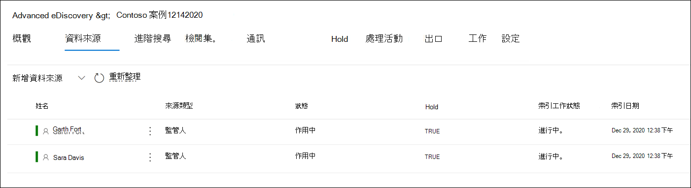

# 將保管人新增至高級 eDiscovery 案例Add custodians to an Advanced eDiscovery case

使用高級 eDiscovery 中內建的保管人管理工具，讓您的工作流程與管理保管人的工作流程一致，並識別與案例相關聯的相關 custodial 資料來源。Use the built-in custodian management tool in Advanced eDiscovery to coordinate your workflows around managing custodians and identifying relevant, custodial data sources associated with a case. 當您新增保管人時，系統會自動針對其 Exchange 信箱和 OneDrive 的商務帳戶，識別並保留其位置。When you add a custodian, the system can automatically identify and place a hold on their Exchange mailbox and OneDrive for Business account. 在調查的探索過程中，您也可能會識別其他資料來源 (例如，例如，擁有者存取或貢獻的信箱、網站或小組) 。During the discovery process of your investigation, you might also identify other data sources (such as mailboxes, sites, or Teams) that a custodian accessed or contributed to. 在此情況下，您可以使用保管人管理工具，將這些資料來源關聯至特定的保管人。In this situation, you can use the custodian management tool to associate those data sources will a specific custodian. 在您將保管人新增至案例並與其他資料來源建立關聯之後，您可以快速保存資料並搜尋 custodial 資料。After you add custodians to a case and associate other data source with them, you can quickly preserve data and search the custodial data.

您可以在高級 eDiscovery 案例中以四個步驟新增及管理保管人：You can add and manage custodians in Advanced eDiscovery cases in four steps:

1. 識別保管人。Identify the custodians.

2. 選擇 [保管人資料位置]。Choose custodian data locations.

3. 設定保留設定。Configure hold settings.

4. 請複查保管人並完成此程式。Review the custodians and complete the process.

   [ 中的 [來源] 索引標籤](../media/AeD-Sources-Tab.png#lightbox)

## 確定您具備必要的許可權Make sure you have the necessary permissions

若要將保管人新增至案例，您必須是 eDiscovery 管理員角色群組的成員。To add custodians to a case, you must be a member of the eDiscovery Manager role group. 這會為您提供必要的許可權，以將保管人新增至案例，並在 custodial 資料來源上進行保留。This provides you with the necessary permissions to add custodians to a case and place a hold on the custodial data sources. 如需詳細資訊，請參閱[指派電子文件探索權限](get-started-with-advanced-ediscovery.md#step-2-assign-ediscovery-permissions)。For more information, see [Assign eDiscovery permissions](get-started-with-advanced-ediscovery.md#step-2-assign-ediscovery-permissions).

## 步驟1：識別保管人Step 1: Identify custodians

1. 移至 [https://compliance.microsoft.com](https://compliance.microsoft.com) 並以已獲指派適當 eDiscovery 許可權的使用者帳戶登入。Go to [https://compliance.microsoft.com](https://compliance.microsoft.com) and sign in with a user account that has been assigned the appropriate eDiscovery permissions.

2. 在 Microsoft 365 規範中心的左功能窗格中，按一下 [ **全部顯示**]，然後按一下 [ **eDiscovery > Advanced**]。In the left navigation pane of the Microsoft 365 compliance center, click **Show all**, and then click **eDiscovery > Advanced**.

3. 在 [ **高級電子** 檔探索] 頁面上，按一下 [ **案例** ] 索引標籤，然後選取您要新增保管人的案例。On the **Advanced eDiscovery** page, click the **Cases** tab, and then select the case that you want to add custodians to.

4. 按一下 [**資料來源**] 索引標籤，然後按一下 [新增 **資料來源** 新增  >  **保管人**]。Click the **Data sources** tab and then click **Add data source** > **Add new custodians**.

5. 輸入人員名稱或別名的第一個部分，將組織中的一或多個使用者新增至案例。Add one or more users in your organization as custodians to the case by typing the first part of a person's name or alias. 找到正確的人員後，請選取他們的名稱以將其新增至清單。After you find the correct person, select their name to add them to the list.

## 步驟2：選擇保管人資料位置Step 2: Choose custodian data locations

選取保管人後，系統會自動嘗試識別及驗證這些使用者及其資料來源。After you select custodians, the system automatically attempts to identify and verify these users and their data sources. 將保管人新增至清單後，該工具會自動包含每個保管人的主要信箱和 OneDrive 帳戶。After adding custodians to the list, the tool automatically includes the primary mailbox and OneDrive account for each custodian. 將保管人新增至案例時，您可以選擇不要包含這些資料來源。You can choose not to include these data sources when adding custodians to the case.

除了保管人的信箱和 OneDrive 帳戶之外，您也可以將其他資料位置與保管人（如 SharePoint 網站或保管人隸屬的 Microsoft 團隊）產生關聯。In addition to a custodian's mailbox and OneDrive account, you can also associate other data locations to a custodian, such as SharePoint site or a Microsoft Team the custodian is a member of. 這可讓您保留、收集、分析及檢查與案例保管人相關之其他資料來源中的內容。This allows you to preserve, collect, analyze, and review content in other data sources associated with the custodians of the case.

若要取消選取「主要信箱」和「OneDrive 管理員的帳戶」：To deselect the primary mailbox and OneDrive account for a custodian:

1. 展開保管人，以查看已自動關聯到每個管理員的主要資料位置。Expand the custodian to view the primary data locations that have been automatically associated to each custodian.

2. 選取 [**信箱** 或 **OneDrive** 旁的 [**清除**]，以移除保管人的信箱或 OneDrive 帳戶，使其與此管理員的資料位置產生關聯。Select **Clear** next to **Mailbox** or **OneDrive** to remove a custodian's mailbox or OneDrive account from being associated as a data location for this custodian.

   

若要將其他信箱、網站、小組或 Yammer 群組與特定管理員相關聯，請執行下列動作：To associate other mailboxes, sites, Teams, or Yammer groups to a specific custodian:

1. 展開管理員以顯示下列服務，以將資料位置與保管人關聯。Expand a custodian to display the following services to associate data locations with the custodian. 按一下服務旁的 [ **編輯** ]，以新增資料位置。Click **Edit** next to a service to add a data location.

   - **Exchange**：用來將其他信箱與保管人建立關聯。**Exchange**: Use to associate other mailboxes to the custodian. 在搜尋方塊中輸入名稱或別名 (至少三個字元) 使用者信箱或通訊群組。Type into the search box the name or alias (a minimum of three characters) of user mailboxes or distribution groups. 選取要指派給保管人的信箱，然後按一下 [ **新增**]。Select the mailboxes to assign to the custodian and then click **Add**.

   - **SharePoint**：用來將 SharePoint 網站與保管人關聯。**SharePoint**: Use to associate SharePoint sites to the custodian. 在 [搜尋] 方塊中輸入 URL，以選取清單中的網站或搜尋網站。Select a site in the list or search for a site by typing a URL in the search box. 選取要指派給保管人的網站，然後按一下 [ **新增**]。Select the sites to assign to the custodian and then click **Add**.

   - **小組**：用於指派保管人目前是其成員的 Microsoft 團隊。**Teams**: Use to assign the Microsoft Teams the custodian is currently a member of. 選取要指派給保管人的團隊，然後按一下 [ **新增**]。Select the teams to assign to the custodian and then click **Add**. 在您新增小組後，系統會自動識別並找到與該小組相關聯的 SharePoint 網站和群組信箱，並將其指派給保管人。After you add a team, the system automatically identifies and locates the SharePoint site and group mailbox associated to that team and assigns them to the custodian.

   - **Yammer**：用於指派管理員目前是其成員的 Yammer 群組。**Yammer**:  Use to assign the Yammer groups the custodian is currently a member of. 選取要指派給保管人的群組，然後按一下 [ **新增**]。Select the groups to assign to the custodian and then click **Add**. 在您新增小組後，系統會自動識別並找到與該群組相關聯的 SharePoint 網站和群組信箱，並將其指派給保管人。After you add a team, the system automatically identifies and locates the SharePoint site and group mailbox associated to that group and assigns them to the custodian.

   > [!NOTE]
   > 您可以使用 **Exchange** 和 **SharePoint** 位置選擇器建立其他小組或 Yammer 群組 (，讓系統管理員不是對保管人) 的成員。You can use the **Exchange** and **SharePoint** location pickers to associate other teams or Yammer groups (that a custodian is not a member of) to a custodian. 若要這麼做，您必須新增與每個小組或 Yammer 群組相關聯的信箱和網站。To do this, you have to add both the mailbox and site associated with each team or Yammer group.

2. 您可以透過展開表格中的每個管理員，以查看指派給每位管理員的信箱、網站、小組和 Yammer 群組的總數。You can view the total number of mailboxes, sites, Teams, and Yammer groups assigned to each custodian by expanding each custodian in the table. 當您為每個系統管理員定出所指派的資料位置後，在「高級 eDiscovery」工作流程中收集、處理及檢查階段時，將會維護和使用這些關聯性。When you've finalized the assigned data locations for each custodian, these associations will be maintained and used during the collection, processing, and review stages in the Advanced eDiscovery workflow.

3. 在新增保管人並設定其資料位置之後，請按 **[下一步]** 移至 [ **保留設定** ] 頁面。After adding custodians and configuring their data locations, click **Next** to go to the **Hold settings** page.  

## 步驟3：設定保留設定Step 3: Configure hold settings

 當您完成保管人及其資料位置後，您可以將某個或所有保管人放在暫止狀態。After you've finalized the custodians and their data locations, you can place some or all of the custodians on hold. 當您放置保管人時，所有與保管人相關的內容位置中的所有內容都會保留，直到您移除保留或從保留中釋放系統管理員為止。When you place a custodian on hold, all content in all content locations that are associated with the custodian is preserved until you remove the hold or release the custodian from the hold. 在某些情況下，您可能想要將保管人新增至案例，而不是將其保留。In some cases, you may want to add custodians to a case without placing them on hold.

若要將保管人和資料來源保持在狀態，請執行下列動作：To place the custodians and data sources on hold:

1. 在 [ **保留設定** ] 頁面上，您可以選取 [ **保留** ] 欄下的核取方塊，對個別保管人套用保留。On the **Hold settings** page, you can apply a hold to individual custodians by selecting the checkbox under the **Hold** column.

   或者，您可以選取欄上方的 [ **保留** ] 核取方塊，將所有保管人置於保留狀態。Alternatively, you can place all custodians on hold by selecting the **Hold** checkbox at the top of the column.

2. 確認保管人保留選項，然後按 **[下一步]**。Verify the custodian hold selections and then click **Next**.

   > [!NOTE]
   > 如果您未在保管人上進行保留，系統會將保管人及其相關聯的資料來源新增至案例，但是會保留與案例相關聯的資料來源中的內容。If you don't place a hold on a custodian, the custodian and their associated data sources will be added to the case but the content in those data sources won't preserved by the hold that associated with the case.

## 步驟4：複查保管人並完成程式Step 4: Review the custodians and complete the process

在您實際將保管人新增至案例之前，您可以查看保管人清單、指派給他們的資料位置，以及保留設定。Before you actually add the custodians to the case, you can review the list of custodians, the data locations assigned to them, and the hold settings.

1. 請確認並審閱所有的資料來源計數，以及與表格中的每個保管人相關聯的 [保留] 設定。Verify and review all the data sources count and the hold setting associated with each custodian in the table. 如有需要，請回到 [ **識別保管人** ] 或 [ **保留設定** ] 頁面進行任何變更。If necessary, go back to the **Identify custodian** or **Hold settings** pages to make any changes.

2. 按一下 [ **提交** ]，將保管人及其資料位置新增至案例，並套用所有 custodial 保留設定。Click **Submit** to add custodians and their data locations to the case and apply all custodial hold settings.

   新的保管人會新增至案例，並顯示在 [ **資料來源** ] 索引標籤上。The new custodians are added to the case and displayed on the **Data sources** tab.

   [![[資料來源] ](../media/DataSourcesTab.png) 索引標籤上列出的保管人](../media/DataSourcesTab.png#lightbox)
