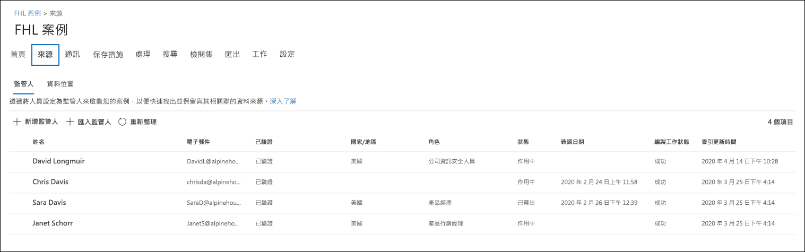
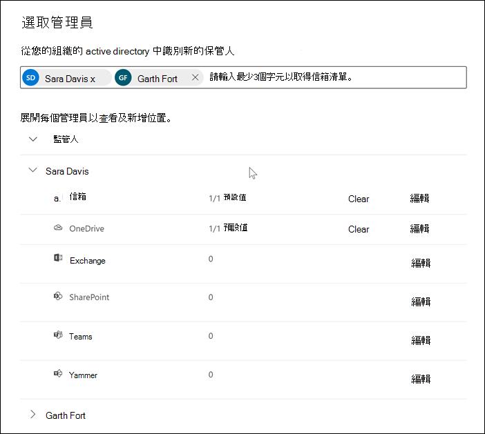

# 將保管人新增至高級 eDiscovery 案例

使用高級 eDiscovery 中內建的保管人管理工具，讓您的工作流程與管理保管人的工作流程一致，並識別與案例相關聯的相關 custodial 資料來源。 當您新增保管人時，系統會自動針對其 Exchange 信箱和 OneDrive 的商務帳戶，識別並保留其位置。 在調查的探索過程中，您也可能會識別其他資料來源 (例如，例如，擁有者存取或貢獻的信箱、網站或小組) 。 在此情況下，您可以使用保管人管理工具，將這些資料來源關聯至特定的保管人。 在您將保管人新增至案例並與其他資料來源建立關聯之後，您可以快速保存資料並搜尋 custodial 資料。

您可以在高級 eDiscovery 案例中以四個步驟新增及管理保管人：

1. 識別保管人。

2. 選擇 [保管人資料位置]。

3. 設定保留設定。

4. 請複查保管人並完成此程式。

   [ 中的 [來源] 索引標籤](../media/AeD-Sources-Tab.png#lightbox)

## 確定您具備必要的許可權

若要將保管人新增至案例，您必須是 eDiscovery 管理員角色群組的成員。 這會為您提供必要的許可權，以將保管人新增至案例，並在 custodial 資料來源上進行保留。 如需詳細資訊，請參閱[指派電子文件探索權限](get-started-with-advanced-ediscovery.md#step-2-assign-ediscovery-permissions)。

## 步驟1：識別保管人

1. 移至 [https://compliance.microsoft.com](https://compliance.microsoft.com) 並以已獲指派適當 eDiscovery 許可權的使用者帳戶登入。

2. 在 Microsoft 365 規範中心的左功能窗格中，按一下 [ **全部顯示**]，然後按一下 [ **eDiscovery > Advanced**]。

3. 在 [ **高級電子** 檔探索] 頁面上，按一下 [ **案例** ] 索引標籤，然後選取您要新增保管人的案例。

4. 按一下 [**資料來源**] 索引標籤，然後按一下 [新增 **資料來源** 新增  >  **保管人**]。

5. 輸入人員名稱或別名的第一個部分，將組織中的一或多個使用者新增至案例。 找到正確的人員後，請選取他們的名稱以將其新增至清單。

## 步驟2：選擇保管人資料位置

選取保管人後，系統會自動嘗試識別及驗證這些使用者及其資料來源。 將保管人新增至清單後，該工具會自動包含每個保管人的主要信箱和 OneDrive 帳戶。 將保管人新增至案例時，您可以選擇不要包含這些資料來源。

除了保管人的信箱和 OneDrive 帳戶之外，您也可以將其他資料位置與保管人（如 SharePoint 網站或保管人隸屬的 Microsoft 團隊）產生關聯。 這可讓您保留、收集、分析及檢查與案例保管人相關之其他資料來源中的內容。

若要取消選取「主要信箱」和「OneDrive 管理員的帳戶」：

1. 展開保管人，以查看已自動關聯到每個管理員的主要資料位置。

2. 選取 [**信箱** 或 **OneDrive** 旁的 [**清除**]，以移除保管人的信箱或 OneDrive 帳戶，使其與此管理員的資料位置產生關聯。

   

若要將其他信箱、網站、小組或 Yammer 群組與特定管理員相關聯，請執行下列動作：

1. 展開管理員以顯示下列服務，以將資料位置與保管人關聯。 按一下服務旁的 [ **編輯** ]，以新增資料位置。

   - **Exchange**：用來將其他信箱與保管人建立關聯。 在搜尋方塊中輸入名稱或別名 (至少三個字元) 使用者信箱或通訊群組。 選取要指派給保管人的信箱，然後按一下 [ **新增**]。

   - **SharePoint**：用來將 SharePoint 網站與保管人關聯。 在 [搜尋] 方塊中輸入 URL，以選取清單中的網站或搜尋網站。 選取要指派給保管人的網站，然後按一下 [ **新增**]。

   - **小組**：用於指派保管人目前是其成員的 Microsoft 團隊。 選取要指派給保管人的團隊，然後按一下 [ **新增**]。 在您新增小組後，系統會自動識別並找到與該小組相關聯的 SharePoint 網站和群組信箱，並將其指派給保管人。

   - **Yammer**：用於指派管理員目前是其成員的 Yammer 群組。 選取要指派給保管人的群組，然後按一下 [ **新增**]。 在您新增小組後，系統會自動識別並找到與該群組相關聯的 SharePoint 網站和群組信箱，並將其指派給保管人。

   > [!NOTE]
   > 您可以使用 **Exchange** 和 **SharePoint** 位置選擇器建立其他小組或 Yammer 群組 (，讓系統管理員不是對保管人) 的成員。 若要這麼做，您必須新增與每個小組或 Yammer 群組相關聯的信箱和網站。

2. 您可以透過展開表格中的每個管理員，以查看指派給每位管理員的信箱、網站、小組和 Yammer 群組的總數。 當您為每個系統管理員定出所指派的資料位置後，在「高級 eDiscovery」工作流程中收集、處理及檢查階段時，將會維護和使用這些關聯性。

3. 在新增保管人並設定其資料位置之後，請按 **[下一步]** 移至 [ **保留設定** ] 頁面。  

## 步驟3：設定保留設定

 當您完成保管人及其資料位置後，您可以將某個或所有保管人放在暫止狀態。 當您放置保管人時，所有與保管人相關的內容位置中的所有內容都會保留，直到您移除保留或從保留中釋放系統管理員為止。 在某些情況下，您可能想要將保管人新增至案例，而不是將其保留。

若要將保管人和資料來源保持在狀態，請執行下列動作：

1. 在 [ **保留設定** ] 頁面上，您可以選取 [ **保留** ] 欄下的核取方塊，對個別保管人套用保留。

   或者，您可以選取欄上方的 [ **保留** ] 核取方塊，將所有保管人置於保留狀態。

2. 確認保管人保留選項，然後按 **[下一步]**。

   > [!NOTE]
   > 如果您未在保管人上進行保留，系統會將保管人及其相關聯的資料來源新增至案例，但是會保留與案例相關聯的資料來源中的內容。

## 步驟4：複查保管人並完成程式

在您實際將保管人新增至案例之前，您可以查看保管人清單、指派給他們的資料位置，以及保留設定。

1. 請確認並審閱所有的資料來源計數，以及與表格中的每個保管人相關聯的 [保留] 設定。 如有需要，請回到 [ **識別保管人** ] 或 [ **保留設定** ] 頁面進行任何變更。

2. 按一下 [ **提交** ]，將保管人及其資料位置新增至案例，並套用所有 custodial 保留設定。

   新的保管人會新增至案例，並顯示在 [ **資料來源** ] 索引標籤上。

   [![[資料來源] ](../media/DataSourcesTab.png) 索引標籤上列出的保管人](../media/DataSourcesTab.png#lightbox)
