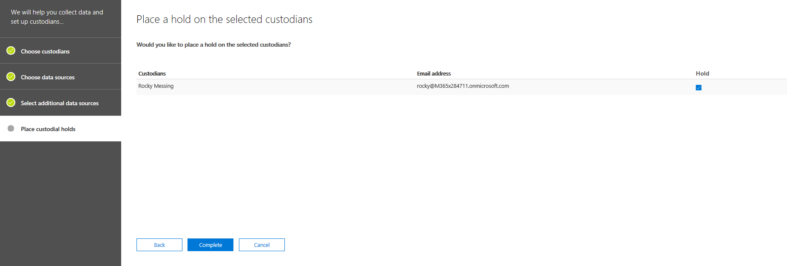

# 新增 custodians 至進階電子文件探索案例Add custodians to an Advanced eDiscovery case

使用進階電子文件中的內建 custodian 管理工具，來調整您繞管理 custodians 和識別相關、 custodial 資料來源與案例相關聯的工作流程。Use the built-in custodian management tool in Advanced eDiscovery to coordinate your workflows around managing custodians and identifying relevant, custodial data sources associated with a case. 當您新增 custodian 時，系統會自動識別並保留其 Exchange 信箱和 OneDrive 商務帳戶。When you add a custodian, the system can automatically identify and place a hold on their Exchange mailbox and OneDrive for Business account. 在您調查探索過程中，您可能也會識別其他資料來源 （例如信箱、 網站或小組） custodian 存取或參與。During the discovery process of your investigation, you might also identify additional data sources (such as mailboxes, sites, or Teams) that a custodian accessed or contributed to. 在此情況下，您可以使用 custodian 管理工具來建立關聯的資料來源將特定 custodian。In this situation, you can use the custodian management tool to associate those data sources will a specific custodian. Custodians 及新增至案例，並將其他資料來源關聯它們之後，您可以快速地保留資料並搜尋 custodial 資料。After you add custodians to a case and associate other data source with them, you can quickly preserve data and search the custodial data.

若要新增及管理 custodians 進階的 eDiscovery 案例中使用下列工作流程。Use the following workflow to add and manage custodians in Advanced eDiscovery cases. 

![Custodian 管理] 索引標籤](media/CustodianMgtPage.png)

## 開始之前Before you begin

若要新增 custodians 案例，您必須是 「 eDiscovery 管理員角色群組的成員。To add custodians to a case, you must be a member of the eDiscovery Manager role group. 這將會提供將 custodians 新增至案例及保留 custodial 資料來源上的必要權限。This will provide you with the necessary permissions to add custodians to a case and place a hold on the custodial data sources.

## 步驟 1： 新增潛在 custodiansStep 1: Add potential custodians

第一個步驟是以找出並將 custodians 新增至案例。The first step is to identify and add custodians to the case.

1. 在**進階電子文件探索**首頁上，按一下您想要新增至 custodians 的案例。On the **Advanced eDiscovery** home page, click the case that you want to add custodians to. 
 
2. 按一下 [ **Custodians** ] 索引標籤，然後按一下 [ **+ 新增 custodians**。Click the **Custodians** tab and then click **+ Add custodians**.

3. 尋找要新增至案例 custodians。Find the custodians to add  to the case. 輸入人名顯示從貴組織的 Azure Active Directory 使用者的第一個部分。Type the first part of a person's name to display users from your organization's Azure Active Directory. 當您找到正確的人員時，請按一下 [他們將它們新增至清單的名稱。When you find the correct person, click their name to add them to the list.

   
 
4. 新增所有相關的 custodians 之後，按一下 [**下一步**選取 custodians 的主要資料來源。After added all the relevant custodians, click **Next** to select the custodians' primary data sources.
  
## 步驟 2： 選取 [custodian 資料來源Step 2: Select custodian data sources

新增 custodians 之後, custodian 工具可協助您識別每個 custodian 所擁有的主要資料來源。After adding custodians, the custodian tool will help you identify the primary data sources owned by each custodian. 這些資料位置為 custodian 的 Exchange 信箱和 OneDrive 帳戶。These data locations are the custodian's Exchange mailbox and OneDrive account. 

若要找出 custodian 資料來源：To identify custodian data sources: 

1. 若要選取的 Exchange 信箱的所有 custodians，選取頂端的資料行的 [ **Exchange** ] 核取方塊。To select the Exchange mailbox for all custodians, select the **Exchange** check box at the top of the column. 您可以再清除任何特定 custodian 若要移除的信箱為 custodial 位置核取方塊。You can then clear the check box for any specific custodian to remove a mailbox as a custodial location. 或者，您可以保留在未選取的資料行的最頂端的 [ **Exchange** ] 核取方塊，然後再選取個別 custodians] 核取方塊。Alternatively, you can leave the **Exchange** check box at the top of the column unselected and then select the check box for individual custodians. 
 
   
 
2. 重複相同的 custodians 的 OneDrive 帳戶。Repeat the same thing for the custodians' OneDrive accounts. 

    選取 custodian 資料來源之後，系統會自動嘗試找出並確認這些資料來源而言，且然後將它們新增至這種情況，作為 custodians 相關聯的資料來源。After you select the custodian data sources, the system automatically attempts to identify and verify these data sources, and then adds them to the case as data sources associated with the custodians.
 
4. 按 [**下一**開始建立額外的資料來源]，以在這種情況 custodians 的關聯。Click **Next** to begin associating additional data sources to the custodians in the case.

## 步驟 3： 建立額外的資料來源]，以 custodian 的關聯Step 3: Associate additional data sources to a custodian

根據您正在調查的情況下，您也可以搜尋 （和保留內容中） 時，需要特定 custodian 可能具有存取信箱，Office 365 群組 custodian 目前的成員或 custodian 也已經存取的網站。Depending on the case you're investigating, you may also need to search (and preserve content in) mailboxes that a specific custodian may have accessed, Office 365 groups that a custodian is currently a member of, or sites that a custodian has also accessed. 讓您在上一個步驟中指定的主要 custodian 資料來源，除了可以也其他 Office 365 的資料來源關聯的情況下 custodian。So in addition to the primary custodian data sources that you specified in the previous step, you can also associate additional Office 365 data sources with a custodian in the case. 

若要將信箱、 網站或小組對應至特定 custodian:To map mailboxes, sites, or teams to a specific custodian:

1. 在 [**選取其他資料來源**] 頁面上，按一下 [**新增**資料列中的特定 custodian。On the **Select additional data sources** page, click **Add** in the row for the specific custodian. 
  
   

2. 在彈出式頁面上，您可以指定資料來源是從任何下列的 Office 365 服務：On the flyout page, you can specify a data source from any of the following Office 365 services:
  
   -  **Exchange 電子郵件**-按一下 [**選擇使用者、 群組或小組**，然後再按一下 [**選擇使用者、 群組或小組**。**Exchange email** - Click **Choose users, groups, or Teams** and then click **Choose users, groups, or teams** again. 使用 [搜尋] 方塊來尋找要與 custodian 產生關聯的信箱。Use the search box to find mailboxes to associate with the custodian. 若要指定要指派給所選 custodian 的信箱，請使用 [搜尋] 方塊來尋找使用者信箱和通訊群組。To specify mailboxes to assign to the selected custodian, use the search box to find user mailboxes and distribution groups. 您也可以指派 Office 365 群組或 Microsoft 小組相關聯的信箱。You can also assign the associated mailbox for an Office 365 group or a Microsoft Team. 選取使用者、 群組、 小組] 核取方塊，按一下 [**選擇**，然後按一下 [**完成**。Select the user, group, team check box, click **Choose**, and then click **Done**.

        > [!NOTE]
        > 當您按一下 [選擇使用者、 群組或小組來指定信箱時，會顯示信箱選擇器是空的。When you click Choose users, groups, or teams to specify mailboxes, the mailbox picker that's displayed is empty. 這項設計的目的是提升效能。This is by design to enhance performance. 若要將信箱新增至這份清單，輸入名稱或別名 （3 個字元的最少） 在 [搜尋] 方塊中。To add mailbox to this list, type a name or alias (a minimum of 3 characters) in the search box.
     
     - **SharePoint 網站**-按一下 [**選擇網站**]，然後按一下 [**選擇網站**]，以顯示您組織中的 SharePoint 網站清單。**SharePoint sites** - Click **Choose sites** and then click **Choose sites** again to display a list of SharePoint sites in your organization. 若要關聯 custodian 網站，您可以選取清單中的網站，或您可以輸入不同的站台或與 Office 365 群組、 Microsoft Team 或 OneDrive 帳戶相關聯的網站的 URL。To associate a site with the custodian, you can select a site in the list or you can type the URL of a different site or a site associated with an Office 365 group, Microsoft Team, or a OneDrive account.
     
     - **Teams** – 按一下 [**選擇小組**，然後按一下 [**選擇小組**]，以顯示 custodian 屬於目前的 Microsoft Teams 的清單。**Teams** – Click **Choose teams** and then click **Choose teams** again to display a list of Microsoft Teams that the custodian is currently a member of. 選取您想要新增至您 custodian Teams。Select the Teams that you would like to add to your custodian. 一旦選取，系統會自動識別相關聯的 SharePoint 網站和群組信箱相關聯的 Microsoft Team & 選取。Once selected, the system will automatically identify & select the associated SharePoint site and Group Mailbox associated to that Microsoft Team. 按一下 [**選擇**，然後按一下 [**完成**。Click **Choose**, and then click **Done**.

       
        
      > [!NOTE]
      > 若要建立與 custodian 關聯的其他小組，您必須分別新增信箱及使用**Exchange 郵件**與**SharePoint 網站**位置相關聯的小組網站。To associate an additional team with a custodian, you have to separately add the mailbox and site associated with the team by using the **Exchange mail** and **SharePoint sites** locations.

您已完成 custodians 與建立關聯的其他資料來源之後，您可以檢視信箱、 網站或小組上**選取 [其他資料來源] 頁面上**的每個 custodian 相關聯的總數。After you've finished associating additional data sources with the custodians, you can view the total number of mailboxes, sites, and teams associated with each custodian on the **Select additional data sources page**. 當您已完成的相關資料來源的特定 custodian 時，將會維護此關聯，而且期間收集、 處理及檢閱階段的 eDiscovery 工作流程中使用。When you've finalized the relevant data sources for a specific custodian, this association will be maintained and used during the collection, processing, and review stages in eDiscovery workflow.

## 步驟 4： 就地 custodians 上保留Step 4: Place custodians on hold

您已完成 custodians 及資料來源，以新增至案例之後，您可以選擇性地放置一些或 custodians 上的所有保留。After you've finalized the custodians and data sources to add to the case, you can optionally place some or all of the custodians on hold. 當您保留上放置 custodian 時，custodian 相關聯的所有內容位置中的所有內容會都保留直到移除保留或釋放保留中的 custodian。When you place a custodian on hold, all content in all content locations that are associated with the custodian is preserved until you remove the hold or release the custodian from the hold. 在某些情況下，您可能想要將 custodians 新增至案例中，而不將其置於保留狀態。In some cases, you may want to add custodians to a case without placing them on hold.

要放置 custodians 與資料來源上的保留：To place the custodians and data sources on hold:

1. 在 [**暫止上選取 custodians** ] 頁面上，選取要就地保留所有 custodians 欄頂端的 [**保留**] 核取方塊。On the **Place a hold on the selected custodians** page, select the **Hold** check box at the top of the column to place all custodians on hold. 您可以再清除從保留移除任何特定 custodian 核取方塊。You can then clear the check box for any specific custodian to remove from the hold. 或者，您可以保留在未選取的資料行的最頂端的 [**保留**] 核取方塊，然後再選取個別 custodians] 核取方塊。Alternatively, you can leave the **Hold** check box at the top of the column unselected and then select the check box for individual custodians. 
 
   

2. 驗證 custodian 保留選取項目，然後按一下 [**完成**]。Verify the custodian hold selections and then click **Complete**.

如果您未保留 custodian、 custodian 和其相關聯的資料來源會加入至的案例，但這些資料來源中的內容將不會置於保留。If you don't place a hold on a custodian, the custodian and their associated data sources will be added to the case but the content in those data sources won't be placed on hold.

Custodian 處於保留狀態之後，就會自動建立包含所有 custodial 來源 custodian 保留原則。After a custodian is placed on hold, a custodian hold policy that contains all custodial sources will be automatically created. 若要檢視此原則：To view this policy:

1. 在**首頁**上的情況下，按一下 [**保留**] 索引標籤，然後按一下 [ **CustodianHold Guid**On the **Home** page of the case, click the **Holds** tab and then click **CustodianHold-Guid**,  

2. 在彈出式頁面上，按一下 [**編輯保留**檢視會處於保留狀態的所有 custodian 資料來源。On the flyout page, click **Edit hold** to view all the custodian data sources that are placed on hold.

