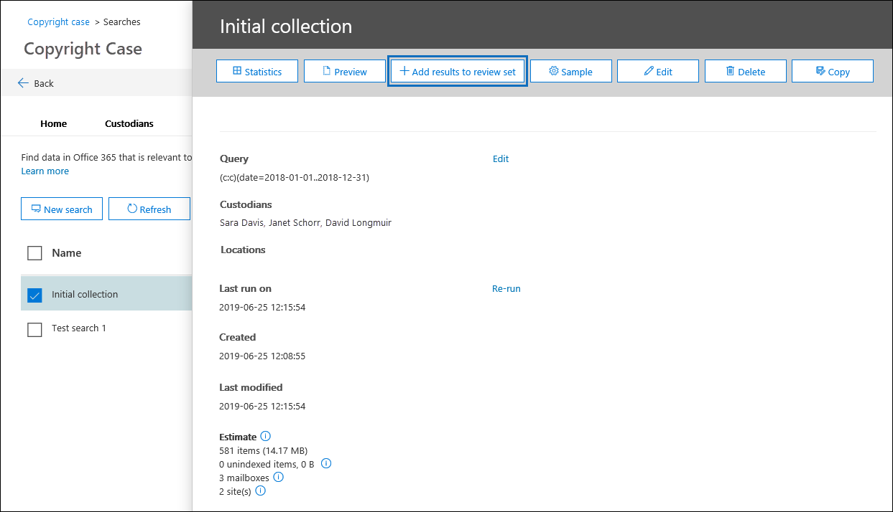

# 將搜尋結果新增至檢閱集

當您滿意的搜尋結果，且您準備好要檢閱和分析搜尋結果時，您可以將其新增到的情況下設定檢閱。 複製原始資料至檢閱設定也有助於檢閱和分析處理程序藉由提供進階的分析工具，例如佈景主題偵測近似重複偵測，和電子郵件執行緒識別碼。 您也可以新增非 Office 365 資料來源的資料，以檢閱設定，以便您可以檢閱該資料，除了您從 Office 365 收集的資料。 

當您將搜尋結果新增至檢閱設定 （請檢閱集是這種情況**檢閱設定**] 索引標籤） 時，便會發生下列情形：

- 是重新執行搜尋。 這表示實際搜尋結果複製到檢閱設定可能會不同於上次執行搜尋所傳回的估計結果。

- 在搜尋結果中的所有項目會複製從原始資料來源中的即時的 Office 365 服務，並複製到 Microsoft cloud 中的安全的 Azure 儲存體位置。

- （包括的內容和中繼資料） 的所有項目重新編製索引，以便檢閱中的所有資料都設定時，會完整搜尋案例資料的檢閱。 重新索引徹底和非常快速搜尋中的資料結果，當您在檢閱搜尋資料設定期間案例的調查。

將資料新增至檢閱設定，按一下 [**搜尋**] 索引標籤上的搜尋，然後按一下**新增結果，以檢閱設定**在彈出式頁面上。

您可以新增至現有的檢閱設定，或建立一組新檢閱。  如果新增至新的檢閱設定，指定名稱，然後按一下 [**新增]**。

將資料新增到檢閱設定是長時間執行程序。 此程序包含從原始資料來源 （例如，從信箱和站台） 的 Office 365 中收集項目，複製至 Azure 儲存體的位置 （此複製程序也稱為*擷取*），然後重新編製索引的項目。 您可以藉由監視**檢閱設定新增資料**行中的狀態，在 [**工作**] 索引標籤上，或在 [**搜尋**] 索引標籤上追蹤進度。 檢閱設定處理完成後，按一下 [**檢視設定**] 索引標籤上的情況，然後按一下 [設為開始的篩選、 檢閱、 標記，並將檢閱集中的資料匯出程序的檢閱。

## 檢閱組新增範例

如果您想要驗證的更完整之前將它們新增至檢閱搜尋結果，您可以設定而不是新增每個項目檢閱新增的搜尋結果的範例。

若要檢閱組新增範例，請按一下 [**搜尋**] 索引標籤上的搜尋，並按一下彈出式頁面上的**範例**。 在 [**取樣參數**] 頁面上，選擇下列選項之一：

- **信賴等級 %** 和**信賴區間 %** – 新增至檢閱組的項目都取決於您設定的統計參數。 如果您通常信賴等級及間隔時使用取樣結果，請將它們指定下拉式方塊中。 否則請使用預設設定。

- **隨機範例 %** – 項目新增至檢閱組根據指定的搜尋所傳回的項目總數的百分比的隨機選取範圍。

之後選取，然後設定下列其中一個先前的選項，選擇 [設定加入至範例，然後按一下 [**傳送**檢閱]。 同樣地，您可以追蹤進度在 [**工作**] 索引標籤上，或在 [**搜尋**] 索引標籤上藉由監視**檢閱設定新增資料**行中的狀態。