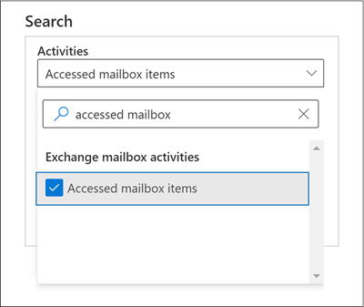

# Microsoft 365 中的進階稽核

Microsoft 365 中的[整合式稽核功能](search-the-audit-log-in-security-and-compliance.md)，可讓組織深入了解 Microsoft 365 中多種不同服務的多個類型的稽核活動。進階稽核經由增加進行調查時所需的稽核記錄保留，提供對有助於判斷危害範圍重要事件的存取，以及快速存取 Office 365 管理活動 API，來幫助組織進行鑑定及合規性調查。

> [!NOTE]
> 進階稽核可供具有 Office 365 E5 或 Microsoft 365 企業版 E5 訂閱的組織使用。此外，當進階稽核功能需要針對每位使用者進行授權時，您可以將 Microsoft 365 E5 合規性或 E5 電子文件探索和稽核附加元件授權指派給使用者，而針對稽核記錄和存取重要調查事件的長期保留也是如此。如需有關授權的詳細資訊，請參閱 [Microsoft 365 安全性與合規性的授權指南](https://docs.microsoft.com/office365/servicedescriptions/microsoft-365-service-descriptions/microsoft-365-tenantlevel-services-licensing-guidance/microsoft-365-security-compliance-licensing-guidance#advanced-audit)。

本文提供進階稽核功能的概觀。

## 長期保留稽核記錄

進階稽核會保留所有 Exchange、SharePoint 和 Azure Active Directory 稽核記錄，時間為一年。這是透過預設的稽核記錄保留原則完成，它會保留包含 **Workload** 屬性 (這指出發生活動所在的服務) 的 **Exchange** 、 **SharePoint** 或 **AzureActiveDirectory** 的值的任何稽核記錄一年。保留稽核記錄的時間越長，可協助您進行深入的鑑定或合規性調查。有關更多資訊，請在 [管理稽核記錄保留原則](audit-log-retention-policies.md#default-audit-log-retention-policy) 中查看「預設稽核記錄保留原則 一節。

我們也會發佈將稽核記錄保留 10 年的功能。保留 10 年的稽核記錄有助於支援長期執行的調查，並應對法規、法律和內部責任。

> [!NOTE]
> 保留 10 年的稽核記錄會需要額外的附加元件授權。這個新的授權將於 2021 年初提供。如需詳細資訊，請參閱本文中的[進階稽核常見問題集](#faqs-for-advanced-audit)章節。

### 稽核記錄保留原則

在其他服務中產生、未在預設稽核記錄保留原則涵蓋範圍的所有稽核記錄 (如前一節所述)，將會保留 90 天。不過，您可以建立自訂的稽核記錄保留原則，將其他稽核記錄保留更久的時間，最多可達 10 年。您可以根據下列一或多項準則，建立用來保留稽核記錄的原則：

- 發生已稽核活動的 Microsoft 365 服務。

- 特定已稽核活動。

- 執行已稽核活動的使用者。

您也可以指定要保留符合原則的稽核記錄的時間長度和優先順序層級，以便特定原則可優先於其他原則。另請注意，如果您需要為組織中的部分或所有使用者保留 Exchange、SharePoint 或 Azure Active Directory 稽核記錄少於一年 (或 10 年)，任何自訂稽核記錄保留原則都會優先於預設的稽核保留原則。如需詳細資訊，請參閱[管理稽核記錄保留原則](audit-log-retention-policies.md)。

## 存取調查重要事件

進階稽核經由提供對重要事件的存取 (例如何時存取郵件項目、何時回覆和轉寄郵件項目以及使用者何時 Exchange Online 和 SharePoint Online 中進行搜尋和搜尋哪些內容)，來幫助組織進行鑑定及合規性調查。這些重要事件可協助您調查可能的破壞，並判斷危害的範圍。[進階稽核] 提供下列重要事件：

- [MailItemsAccessed](#mailitemsaccessed)

- [Send](#send)

- [SearchQueryInitiatedExchange](#searchqueryinitiatedexchange)

- [SearchQueryInitiatedSharePoint](#searchqueryinitiatedsharepoint)

### MailItemsAccessed

MailItemsAccessed 事件是信箱稽核動作，當郵件資料受郵件通訊協定和郵件用戶端存取時，系統會觸發該事件。MailItemsAccessed 動作可幫助調查人員識別資料外洩，並判斷可能已遭入侵的郵件範圍。如果攻擊者取得電子郵件訊息，即使沒有明確訊號指出已實際讀取郵件 (也就是說，在稽核記錄中記錄了透過繫結或同步處理之類的存取類型)，將會觸發 MailItemsAccessed 動作。

MailItemsAccessed 信箱動作會取代 Exchange Online 中信箱稽核記錄的 MessageBind，並提供下列改善：

- MessageBind 僅適用于 AuditAdmin 使用者登入類型；不適用於代理人或擁有者動作。MailItemsAccessed 適用於所有登入類型。

- MessageBind 僅涵蓋透過郵件用戶端的存取。並不適用同步處理活動。MailItemsAccessed 事件會由繫結和同步處理存取類型觸發。

- 當存取相同的電子郵件訊息時，MessageBind 動作會觸發多個稽核記錄的建立，這會導致稽核的「雜訊」。相反地，MailItemsAccessed 事件會彙總在較少的稽核記錄中。

如需有關 MailItemsAccessed 活動的稽核記錄資訊，請參閱[使用進階稽核調查遭入侵帳戶](mailitemsaccessed-forensics-investigations.md)。

若要搜尋 MailItemsAccessed 稽核記錄，您可以在 Microsoft 365 合規性中心的 [稽核記錄搜尋工具](search-the-audit-log-in-security-and-compliance.md)中，在 **[Exchange 信箱活動]** 下拉式清單中搜尋 **[已存取的信箱項目]** 活動。

您也可以在 Exchange Online PowerShell 中執行 [Search-UnifiedAuditLog -Operations MailItemsAccessed](https://docs.microsoft.com/powershell/module/exchange/search-unifiedauditlog) 或 [Search-MailboxAuditLog -Operations MailItemsAccessed](https://docs.microsoft.com/powershell/module/exchange/search-mailboxauditlog) 命令。

### 傳送

Send 事件也是信箱審核動作，當使用者執行下列其中一項動作時，會觸發該事件：

- 傳送電子郵件訊息

- 回覆電子郵件訊息

- 轉寄電子郵件訊息

調查人員可以使用 Send 事件識別從遭入侵帳戶發送的電子郵件。Send 事件的稽核記錄中包含郵件的相關資訊，例如郵件傳送的時間、InternetMessage 識別碼、主旨列，以及郵件是否包含附件。這項稽核資訊可協助調查人員識別從遭入侵帳戶或攻擊者傳送的電子郵件訊息相關資訊。此外，調查人員可以使用 Microsoft 365 或電子文件探索工具來搜尋郵件 (使用主旨列或郵件識別碼)，以找出傳送郵件的收件者，以及傳送郵件的實際內容。

若要搜尋 Send 稽核記錄，您可以在 Microsoft 365 合規性中心的 [稽核記錄搜尋工具](search-the-audit-log-in-security-and-compliance.md)中，在 **[Exchange 信箱活動]** 下拉式清單中搜尋 **[傳送電子郵件]** 活動。

![在 [稽核記錄搜尋工具] 中搜尋 [傳送電子郵件] 動作](../media/AdvAudit_SentMessage.png)

您也可以在 Exchange Online PowerShell 中執行 [Search-UnifiedAuditLog -Operations Send](https://docs.microsoft.com/powershell/module/exchange/search-unifiedauditlog) 或 [Search-MailboxAuditLog -Operations Send](https://docs.microsoft.com/powershell/module/exchange/search-mailboxauditlog) 命令。

### SearchQueryInitiatedExchange

當某人在 Outlook 網頁版 (OWA) 中使用 [搜尋列] 來搜尋信箱中的項目時，就會觸發 SearchQueryInitiatedExchange 事件。調查人員可以使用 SearchQueryInitiatedExchange 事件，來判斷可能已入侵帳號的攻擊者是否已查看或嘗試存取信箱中的敏感性資訊。SearchQueryInitiatedExchange 事件的稽核記錄包含實際的搜尋查詢文字。透過查看攻擊者可能執行的搜尋查詢，調查人員可以更能瞭解搜尋的電子郵件資料意圖。

若要搜尋 SearchQueryInitiatedExchange 稽核記錄，您可以在合規性中心的 [稽核記錄搜尋工具](search-the-audit-log-in-security-and-compliance.md)中，在 **[搜尋活動]** 下拉式清單中搜尋 **[執行電子郵件搜尋]** 活動。

![在 [稽核記錄搜尋工具] 中搜尋 [執行電子郵件搜尋] 動作](../media/AdvAudit_SearchExchange.png)

您也可以在 Exchange Online PowerShell 中執行 [Search-UnifiedAuditLog -Operations SearchQueryInitiatedExchange](https://docs.microsoft.com/powershell/module/exchange/search-unifiedauditlog)。

> [!NOTE]
> 您必須在 Exchange Online PowerShell 中執行下列命令，以便在稽核記錄搜尋結果中包含 SearchQueryInitiatedExchange 事件 (由指定的 E5 使用者執行)：`Set-Mailbox <user identity> -AuditOwner @{Add="SearchQueryInitiated"}`。

### SearchQueryInitiatedSharePoint

與搜尋信箱項目類似，當某人搜尋貴組織中 SharePoint 主網站中的項目時，就會觸發 SearchQueryInitiatedSharePoint 事件。調查人員可以使用 SearchQueryInitiatedSharePoint 事件來判斷攻擊者是否嘗試在 SharePoint 中尋找 (且可能存取) 敏感性資訊。SearchQueryInitiatedSharePoint 事件的稽核記錄也包含實際的搜尋查詢文字。透過查看攻擊者可能已執行的搜尋查詢，調查人員可以更能了解他們搜尋檔案資料的意圖和範圍。

若要搜尋 SearchQueryInitiatedSharePoint 稽核記錄，您可以在合規性中心的 [稽核記錄搜尋工具](search-the-audit-log-in-security-and-compliance.md)中，在 **[搜尋活動]** 下拉式清單中搜尋 **[執行 SharePoint 搜尋]** 活動。

![在 [稽核記錄搜尋工具] 中搜尋 [執行 SharePoint 搜尋] 動作](../media/AdvAudit_SearchSharePoint.png)

您也可以在 Exchange Online PowerShell 中執行 [Search-UnifiedAuditLog -Operations SearchQueryInitiatedSharePoint](https://docs.microsoft.com/powershell/module/exchange/search-unifiedauditlog)。

> [!NOTE]
> 您必須在 Exchange Online PowerShell 中執行下列命令，以便在稽核記錄搜尋結果中包含 SearchQueryInitiatedSharePoint 事件 (由指定的 E5 使用者執行)：`Set-Mailbox <user identity> -AuditOwner @{Add="SearchQueryInitiated"}`。

## Office 365 管理活動 API 的高頻寬存取權

透過 Office 365 管理活動 API 存取稽核記錄的組織，其節流限制會處於發行者層級。這表示，針對代表多個客戶提取資料的發行者，此限制會由所有客戶所共用。

隨著進階稽核的推出，我們會將發行者層級限制移至租用戶層級限制。結果是每個組織都會獲得自己完整配置的頻寬配額，以存取其稽核資料。頻寬不是靜態、預先定義的限制，但是會以一些要素的組合模組化，其中包括組織中的基座數量，以及 E5 組織可獲得較非 E5 組織更多的頻寬。

所有組織一開始都會配置每分鐘 2,000 個要求的基準。視組織的基座數和授權訂閱而定，此限制將會動態增加。E5 組織可獲得的頻寬大約可達到非 E5 組織的兩倍。最大頻寬也會有上限，以保護服務的健康情況。

如需詳細資訊，請參閱 [Office 365 管理活動 API 參考](https://docs.microsoft.com/office/office-365-management-api/office-365-management-activity-api-reference#api-throttling)中的「API 節流」一節。

## 進階稽核的常見問題集

**每位使用者是否需要 E5 授權才能使用進階稽核？**

若要使用使用者層級的進階稽核功能，使用者必須獲指派 E5 授權。部分功能會檢查是否有適當授權，才會開放功能供使用者使用。例如，如果您正嘗試保留使用者的稽核記錄，但該使用者在 90 天內未獲指派 E5 授權，系統將會傳回錯誤訊息。

**我的組織擁有 E5 訂閱，我是否需要執行任何動作才能存取重要事件的稽核記錄？**

對於指派了適當授權的合格客戶和使用者，無需任何動作即可存取關鍵稽核事件。

**何時提供新的 10 年稽核記錄保留附加元件授權？**

新的 10 年稽核記錄保留附加元件將於 2021 年初提供給 E5 訂閱的客戶購買。

**如果我建立了 10 年稽核記錄保留原則，此功能已發發布至正式版本，但在 2021 年初所需的附加元件授權可使用之前，系統會對我組織的稽核記錄資料產生什麼影響？**

您在正式發行之後建立的 10 年稽核記錄保留原則所涵蓋的所有稽核資料，都將保留 10 年。 當 2021 年初 10 年稽核記錄保留附加元件授權可用時，您將需要為使用現有 10 年稽核記錄保留原則保留稽核資料的使用者購買附加元件授權。 此外，只要 2021 年初附加元件授權可用時，當您建立新的 10 年稽核紀錄保留原則時，系統就會強制執行適當的授權。

**Office 365 管理活動 API 的進階稽核中是否有新的事件？**

是。 只要為具有適當授權的使用者產生稽核記錄，您就可以透過 Office 365 管理活動 API 存取這些記錄。

**頻寬較高代表延遲較好或更高的 SLA 嗎？**

目前，高頻寬可提供更好的管道，特別是具有大量稽核訊號和大量消費模式的組織。 更多頻寬可以導致更好的延遲。 不過 SLA 與高頻寬無關。 標準延遲已予以記錄，且這些延遲在進階稽核推出時不會變更。
