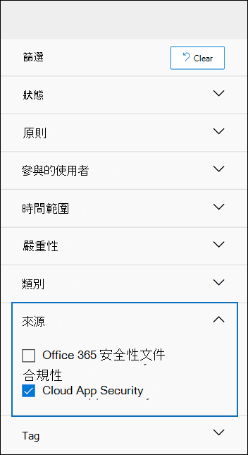

# <a name="alert-policies-in-the-security-and-compliance-center"></a><span data-ttu-id="35a19-103">安全性與合規性中心的警示原則</span><span class="sxs-lookup"><span data-stu-id="35a19-103">Alert policies in the security and compliance center</span></span>

<span data-ttu-id="35a19-104">您可以使用 Microsoft 365 安全性與合規性中心中的警示原則和警示儀表板工具，來建立警示原則，然後查看使用者執行符合警示原則條件的活動時所產生的警示。</span><span class="sxs-lookup"><span data-stu-id="35a19-104">You can use the alert policy and alert dashboard tools in the Microsoft 365 security and compliance centers to create alert policies and then view the alerts generated when users perform activities that match the conditions of an alert policy.</span></span> <span data-ttu-id="35a19-105">有幾個預設的警示原則可協助您監視活動，例如指派 Exchange Online 中的系統管理員許可權、惡意程式碼攻擊、網路釣魚活動，以及檔案刪除及外部共用的不尋常層級。</span><span class="sxs-lookup"><span data-stu-id="35a19-105">There are several default alert policies that help you monitor activities such as assigning admin privileges in Exchange Online, malware attacks, phishing campaigns, and unusual levels of file deletions and external sharing.</span></span>

<span data-ttu-id="35a19-106">警示原則可讓您分類原則所觸發的警示、將原則套用至組織中的所有使用者、設定觸發警示時的閾值等級，以及決定是否要在觸發警示時收到電子郵件通知。</span><span class="sxs-lookup"><span data-stu-id="35a19-106">Alert policies let you categorize the alerts that are triggered by a policy, apply the policy to all users in your organization, set a threshold level for when an alert is triggered, and decide whether to receive email notifications when alerts are triggered.</span></span> <span data-ttu-id="35a19-107">在 [安全性與合規性中心] 中也有一個「 **查看提醒** 」頁面，您可以在其中查看和篩選提醒、設定警示狀態，以協助您管理提醒，然後在您解決或解決基礎事件後關閉提醒。</span><span class="sxs-lookup"><span data-stu-id="35a19-107">There's also a **View alerts** page in the security and compliance center where you can view and filter alerts, set an alert status to help you manage alerts, and then dismiss alerts after you've addressed or resolved the underlying incident.</span></span>

> [!NOTE]
> <span data-ttu-id="35a19-108">使用 Microsoft 365 Enterprise、Office 365 企業版或 Office 365 US 政府 E1/F1/G1、E3/F3/G3 或 E5/G5 訂閱的組織可使用警示原則。</span><span class="sxs-lookup"><span data-stu-id="35a19-108">Alert policies are available for organizations with a Microsoft 365 Enterprise, Office 365 Enterprise, or Office 365 US Government E1/F1/G1, E3/F3/G3, or E5/G5 subscription.</span></span> <span data-ttu-id="35a19-109">只有具有 E5/G5 訂閱的組織，或是具有 E1/F1/G1 或 E3/F3/G3 訂閱的組織，以及 Microsoft Defender for Office 365 P2 或 Microsoft 365 E5 （含）電子檔探索和審核附加元件訂閱，才可使用高級功能。</span><span class="sxs-lookup"><span data-stu-id="35a19-109">Advanced functionality is only available for organizations with an E5/G5 subscription, or for organizations that have an E1/F1/G1 or E3/F3/G3 subscription and a Microsoft Defender for Office 365 P2 or a Microsoft 365 E5 Compliance or an E5 eDiscovery and Audit add-on subscription.</span></span> <span data-ttu-id="35a19-110">本主題中已反白顯示需要 E5/G5 或附加元件訂閱的功能。</span><span class="sxs-lookup"><span data-stu-id="35a19-110">The functionality that requires an E5/G5 or add-on subscription is highlighted in this topic.</span></span> <span data-ttu-id="35a19-111">另外請注意，Office 365 GCC、GCC High 及 DoD 美國政府環境中提供警示原則。</span><span class="sxs-lookup"><span data-stu-id="35a19-111">Also note that alert policies are available in Office 365 GCC, GCC High, and DoD US government environments.</span></span>

## <a name="how-alert-policies-work"></a><span data-ttu-id="35a19-112">警示原則的運作方式</span><span class="sxs-lookup"><span data-stu-id="35a19-112">How alert policies work</span></span>

<span data-ttu-id="35a19-113">以下是警示原則的運作方式，以及當使用者或系統管理員活動符合警示原則條件時所觸發之警示的快速概覽。</span><span class="sxs-lookup"><span data-stu-id="35a19-113">Here's a quick overview of how alert policies work and the alerts that are triggers when user or admin activity matches the conditions of an alert policy.</span></span>


1. <span data-ttu-id="35a19-115">您組織中的系統管理員會使用 [安全性與合規性中心] 中的 [ **警示原則** ] 頁面，來建立、設定及開啟警示原則。</span><span class="sxs-lookup"><span data-stu-id="35a19-115">An admin in your organization creates, configures, and turns on an alert policy by using the **Alert policies** page in the security and compliance center.</span></span> <span data-ttu-id="35a19-116">您也可以在安全性 & 規範中心 PowerShell 中使用 [set-protectionalert 指令程式](/powershell/module/exchange/new-protectionalert) 來建立警示原則。</span><span class="sxs-lookup"><span data-stu-id="35a19-116">You can also create alert policies by using the [New-ProtectionAlert](/powershell/module/exchange/new-protectionalert) cmdlet in Security & Compliance Center PowerShell.</span></span>

   <span data-ttu-id="35a19-117">若要建立警示原則，您必須在 [安全性與合規性中心] 中指派「管理警示」角色或「組織設定」角色。</span><span class="sxs-lookup"><span data-stu-id="35a19-117">To create alert policies, you have to be assigned the Manage Alerts role or the Organization Configuration role in the security and compliance center.</span></span>

   > [!NOTE]
   > <span data-ttu-id="35a19-118">在建立或更新警示原則之後，需要長達24小時後，才能由原則觸發警示。</span><span class="sxs-lookup"><span data-stu-id="35a19-118">It takes up to 24 hours after creating or updating an alert policy before alerts can be triggered by the policy.</span></span> <span data-ttu-id="35a19-119">這是因為原則必須同步處理至警示偵測引擎。</span><span class="sxs-lookup"><span data-stu-id="35a19-119">This is because the policy has to be synced to the alert detection engine.</span></span>

2. <span data-ttu-id="35a19-120">使用者執行符合警示原則條件的活動。</span><span class="sxs-lookup"><span data-stu-id="35a19-120">A user performs an activity that matches the conditions of an alert policy.</span></span> <span data-ttu-id="35a19-121">在惡意程式碼攻擊的情況下，傳送給組織中使用者的受感染電子郵件會觸發警示。</span><span class="sxs-lookup"><span data-stu-id="35a19-121">In the case of malware attacks, infected email messages sent to users in your organization trigger an alert.</span></span>

3. <span data-ttu-id="35a19-122">Microsoft 365 會產生警示，它會顯示在安全性 & 合規性中心的 [ **查看警示** ] 頁面上。</span><span class="sxs-lookup"><span data-stu-id="35a19-122">Microsoft 365 generates an alert that's displayed on the **View alerts** page in the Security & Compliance Center.</span></span> <span data-ttu-id="35a19-123">此外，如果已啟用警示原則的電子郵件通知，Microsoft 會傳送通知給收件者清單。</span><span class="sxs-lookup"><span data-stu-id="35a19-123">Also, if email notifications are enabled for the alert policy, Microsoft sends a notification to a list of recipients.</span></span> <span data-ttu-id="35a19-124">系統管理員或其他使用者可以在 [View alerts] 頁面上看到的警示，是由指派給使用者的角色所決定。</span><span class="sxs-lookup"><span data-stu-id="35a19-124">The alerts that an admin or other users can see that on the View alerts page is determined by the roles assigned to the user.</span></span> <span data-ttu-id="35a19-125">如需詳細資訊，請參閱 [查看提醒所需的 RBAC 許可權](#rbac-permissions-required-to-view-alerts)。</span><span class="sxs-lookup"><span data-stu-id="35a19-125">For more information, see [RBAC permissions required to view alerts](#rbac-permissions-required-to-view-alerts).</span></span>

4. <span data-ttu-id="35a19-126">系統管理員管理安全性與合規性中心中的警示。</span><span class="sxs-lookup"><span data-stu-id="35a19-126">An admin manages alerts in the security and compliance center.</span></span> <span data-ttu-id="35a19-127">管理警示包括指派提醒狀態，以協助追蹤和管理任何調查。</span><span class="sxs-lookup"><span data-stu-id="35a19-127">Managing alerts consists of assigning an alert status to help track and manage any investigation.</span></span>

## <a name="alert-policy-settings"></a><span data-ttu-id="35a19-128">警示原則設定</span><span class="sxs-lookup"><span data-stu-id="35a19-128">Alert policy settings</span></span>

<span data-ttu-id="35a19-129">警示原則包含一組規則和條件，可定義產生警示的使用者或系統管理員活動，以及在執行活動時觸發警示的使用者清單，以及定義觸發警示之前必須進行的活動次數的臨界值。</span><span class="sxs-lookup"><span data-stu-id="35a19-129">An alert policy consists of a set of rules and conditions that define the user or admin activity that generates an alert, a list of users who trigger the alert if they perform the activity, and a threshold that defines how many times the activity has to occur before an alert is triggered.</span></span> <span data-ttu-id="35a19-130">您也對原則進行分類，並指派嚴重性層級。</span><span class="sxs-lookup"><span data-stu-id="35a19-130">You also categorize the policy and assign it a severity level.</span></span> <span data-ttu-id="35a19-131">這兩項設定可協助您管理警示原則 (及原則條件符合時所觸發的警示) 因為您可以在管理原則及在安全性與規範中心中查看警示時，篩選這些設定。</span><span class="sxs-lookup"><span data-stu-id="35a19-131">These two settings help you manage alert policies (and the alerts that are triggered when the policy conditions are matched) because you can filter on these settings when managing policies and viewing alerts in the security and compliance center.</span></span> <span data-ttu-id="35a19-132">例如，您可以查看符合相同類別之條件的警示，或查看具有相同嚴重性層級的警示。</span><span class="sxs-lookup"><span data-stu-id="35a19-132">For example, you can view alerts that match the conditions from the same category or view alerts with the same severity level.</span></span>

<span data-ttu-id="35a19-133">若要查看及建立警示原則，請移至， [https://protection.office.com](https://protection.office.com) 然後選取 [ **警示** \> **警示原則**]。</span><span class="sxs-lookup"><span data-stu-id="35a19-133">To view and create alert policies, go to [https://protection.office.com](https://protection.office.com) and then select **Alerts** \> **Alert policies**.</span></span>

![在 [安全性與合規性中心] 中，選取 [警示]，然後選取 [警示原則] 以查看和建立警示原則。](../media/09ebd451-8e84-44e1-aefc-63e70bba4d97.png)

<span data-ttu-id="35a19-135">警示原則由下列設定和條件所組成。</span><span class="sxs-lookup"><span data-stu-id="35a19-135">An alert policy consists of the following settings and conditions.</span></span>

- <span data-ttu-id="35a19-136">**活動：警示是追蹤** -您可以建立原則來追蹤活動，或在某些情況下，使用一些相關的活動，例如與外部使用者共用檔案、指派存取權限，或建立匿名連結。</span><span class="sxs-lookup"><span data-stu-id="35a19-136">**Activity the alert is tracking** - You create a policy to track an activity or in some cases a few related activities, such a sharing a file with an external user by sharing it, assigning access permissions, or creating an anonymous link.</span></span> <span data-ttu-id="35a19-137">當使用者執行原則所定義的活動時，系統會根據警示閾值設定觸發警示。</span><span class="sxs-lookup"><span data-stu-id="35a19-137">When a user performs the activity defined by the policy, an alert is triggered based on the alert threshold settings.</span></span>

    > [!NOTE]
    > <span data-ttu-id="35a19-138">您可以追蹤的活動取決於組織的 Office 365 Enterprise or Office 365 US 政府方案。</span><span class="sxs-lookup"><span data-stu-id="35a19-138">The activities that you can track depend on your organization's Office 365 Enterprise or Office 365 US Government plan.</span></span> <span data-ttu-id="35a19-139">一般說來，惡意程式碼活動與網路釣魚攻擊相關的活動，需要具有 E5/G5 訂閱或 E1/F1/G1 或 E3/F3/G3 訂閱與 [Office 365](../security/office-365-security/defender-for-office-365.md) 方案2附加元件訂閱的 Defender。</span><span class="sxs-lookup"><span data-stu-id="35a19-139">In general, activities related to malware campaigns and phishing attacks require an E5/G5 subscription or an E1/F1/G1 or E3/F3/G3 subscription with an [Defender for Office 365](../security/office-365-security/defender-for-office-365.md) Plan 2 add-on subscription.</span></span>

- <span data-ttu-id="35a19-140">**活動狀況** -針對大部分活動，您可以定義必須滿足的其他條件，以觸發警示。</span><span class="sxs-lookup"><span data-stu-id="35a19-140">**Activity conditions** - For most activities, you can define additional conditions that must be met to trigger an alert.</span></span> <span data-ttu-id="35a19-141">常見的情況包括 IP 位址 (，這樣當使用者在具有特定 IP 位址或 IP 位址) 範圍的電腦上執行活動時，就會觸發警示，是否要在特定使用者或使用者執行該活動時觸發警示，以及是否要在特定的檔案名或 URL 上執行該活動。</span><span class="sxs-lookup"><span data-stu-id="35a19-141">Common conditions include IP addresses (so that an alert is triggered when the user performs the activity on a computer with a specific IP address or within an IP address range), whether an alert is triggered if a specific user or users perform that activity, and whether the activity is performed on a specific file name or URL.</span></span> <span data-ttu-id="35a19-142">您也可以設定條件，當組織中的任何使用者執行活動時，就會觸發警示。</span><span class="sxs-lookup"><span data-stu-id="35a19-142">You can also configure a condition that triggers an alert when the activity is performed by any user in your organization.</span></span> <span data-ttu-id="35a19-143">可用的條件取決於所選的活動。</span><span class="sxs-lookup"><span data-stu-id="35a19-143">The available conditions are dependent on the selected activity.</span></span>

- <span data-ttu-id="35a19-144">**觸發警示時** -您可以設定定義事件在觸發警示之前所發生頻率的設定。</span><span class="sxs-lookup"><span data-stu-id="35a19-144">**When the alert is triggered** - You can configure a setting that defines how often an activity can occur before an alert is triggered.</span></span> <span data-ttu-id="35a19-145">這可讓您設定原則，以在每次活動符合原則條件時、超過特定臨界值時，或在事件發生時，您的組織不尋常時產生警示。</span><span class="sxs-lookup"><span data-stu-id="35a19-145">This allows you to set up a policy to generate an alert every time an activity matches the policy conditions, when a certain threshold is exceeded, or when the occurrence of the activity the alert is tracking becomes unusual for your organization.</span></span>

    

    <span data-ttu-id="35a19-147">如果您根據不尋常的活動選取設定，Microsoft 會建立定義所選活動一般頻率的比較基準值。</span><span class="sxs-lookup"><span data-stu-id="35a19-147">If you select the setting based on unusual activity, Microsoft establishes a baseline value that defines the normal frequency for the selected activity.</span></span> <span data-ttu-id="35a19-148">建立此基準需要長達7天，而不會產生提醒。</span><span class="sxs-lookup"><span data-stu-id="35a19-148">It takes up to seven days to establish this baseline, during which alerts won't be generated.</span></span> <span data-ttu-id="35a19-149">建立基準之後，當警示原則追蹤的活動頻率超過基準值時，就會觸發警示。</span><span class="sxs-lookup"><span data-stu-id="35a19-149">After the baseline is established, an alert is triggered when the frequency of the activity tracked by the alert policy greatly exceeds the baseline value.</span></span> <span data-ttu-id="35a19-150">針對與審核相關的活動 (例如檔案和資料夾活動) ，您可以根據單一使用者或組織中的所有使用者建立基準。針對惡意程式碼相關的活動，您可以根據單一惡意程式碼系列、單一收件者或組織中的所有郵件，建立基準。</span><span class="sxs-lookup"><span data-stu-id="35a19-150">For auditing-related activities (such as file and folder activities), you can establish a baseline based on a single user or based on all users in your organization; for malware-related activities, you can establish a baseline based on a single malware family, a single recipient, or all messages in your organization.</span></span>

    > [!NOTE]
    > <span data-ttu-id="35a19-151">根據臨界值或非使用中活動來設定警示原則的功能，需要 E5/G5 訂閱，或具有 Microsoft Defender for Office 365 P2、Microsoft 365 E5 規範或 Microsoft 365 eDiscovery 和審核附加元件訂閱的 E1/F3 訂閱。</span><span class="sxs-lookup"><span data-stu-id="35a19-151">The ability to configure alert policies based on a threshold or based on unusual activity requires an E5/G5 subscription, or an E1/F1/G1 or E3/F3/G3 subscription with a Microsoft Defender for Office 365 P2, Microsoft 365 E5 Compliance, or Microsoft 365 eDiscovery and Audit add-on subscription.</span></span> <span data-ttu-id="35a19-152">具有 E1/F1/G1 和 E3/F3/G3 訂閱的組織，只會建立會在每次發生活動時觸發警示的警示原則。</span><span class="sxs-lookup"><span data-stu-id="35a19-152">Organizations with an E1/F1/G1 and E3/F3/G3 subscription can only create alert policies where an alert is triggered every time that an activity occurs.</span></span>

- <span data-ttu-id="35a19-153">**警示類別** -若要協助追蹤和管理原則所產生的警示，您可以將下列其中一個類別指派給原則。</span><span class="sxs-lookup"><span data-stu-id="35a19-153">**Alert category** - To help with tracking and managing the alerts generated by a policy, you can assign one of the following categories to a policy.</span></span>

  - <span data-ttu-id="35a19-154">資料外洩防護</span><span class="sxs-lookup"><span data-stu-id="35a19-154">Data loss prevention</span></span>

  - <span data-ttu-id="35a19-155">資訊控管</span><span class="sxs-lookup"><span data-stu-id="35a19-155">Information governance</span></span>

  - <span data-ttu-id="35a19-156">郵件流程</span><span class="sxs-lookup"><span data-stu-id="35a19-156">Mail flow</span></span>

  - <span data-ttu-id="35a19-157">權限</span><span class="sxs-lookup"><span data-stu-id="35a19-157">Permissions</span></span>

  - <span data-ttu-id="35a19-158">威脅管理</span><span class="sxs-lookup"><span data-stu-id="35a19-158">Threat management</span></span>

  - <span data-ttu-id="35a19-159">其他人</span><span class="sxs-lookup"><span data-stu-id="35a19-159">Others</span></span>

  <span data-ttu-id="35a19-160">當發生符合警示原則條件的活動時，所產生的警示會以此設定中所定義的類別進行標記。</span><span class="sxs-lookup"><span data-stu-id="35a19-160">When an activity occurs that matches the conditions of the alert policy, the alert that's generated is tagged with the category defined in this setting.</span></span> <span data-ttu-id="35a19-161">這可讓您在安全性與合規性中心的 [ **View alerts** ] 頁面上，追蹤和管理具有相同類別設定的提醒，因為您可以根據類別排序和篩選警示。</span><span class="sxs-lookup"><span data-stu-id="35a19-161">This allows you to track and manage alerts that have the same category setting on the **View alerts** page in the security and compliance center because you can sort and filter alerts based on category.</span></span>

- <span data-ttu-id="35a19-162">**警示嚴重性** -類似于警示類別，您可以指派嚴重性屬性 (**低**、 **中**、 **高** 或 **資訊性**) 報警原則。</span><span class="sxs-lookup"><span data-stu-id="35a19-162">**Alert severity** - Similar to the alert category, you assign a severity attribute (**Low**, **Medium**, **High**, or **Informational**) to alert policies.</span></span> <span data-ttu-id="35a19-163">就像警示類別，當發生符合警示原則條件的活動時，所產生的警示會以針對警示原則所設定的嚴重性等級進行標記。</span><span class="sxs-lookup"><span data-stu-id="35a19-163">Like the alert category, when an activity occurs that matches the conditions of the alert policy, the alert that's generated is tagged with the same severity level that's set for the alert policy.</span></span> <span data-ttu-id="35a19-164">同樣地，這可讓您在 [ **View alerts** ] 頁面上追蹤及管理具有相同嚴重性設定的警示。</span><span class="sxs-lookup"><span data-stu-id="35a19-164">Again, this allows you to track and manage alerts that have the same severity setting on the **View alerts** page.</span></span> <span data-ttu-id="35a19-165">例如，您可以篩選警示清單，只顯示 **高** 嚴重性的警示。</span><span class="sxs-lookup"><span data-stu-id="35a19-165">For example, you can filter the list of alerts so that only alerts with a **High** severity are displayed.</span></span>

    > [!TIP]
    > <span data-ttu-id="35a19-166">在設定警示原則時，請考慮將較高的嚴重性指派給可能會造成嚴重負面影響的活動，例如，在傳遞給使用者、查看機密或保密資料、與外部使用者共用資料，以及可能導致資料遺失或安全性威脅的其他活動中偵測惡意程式碼。</span><span class="sxs-lookup"><span data-stu-id="35a19-166">When setting up an alert policy, consider assigning a higher severity to activities that can result in severely negative consequences, such as detection of malware after delivery to users, viewing of sensitive or classified data, sharing data with external users, or other activities that can result in data loss or security threats.</span></span> <span data-ttu-id="35a19-167">這可協助您排定提醒優先順序和您採取的動作，以調查並解決基本原因。</span><span class="sxs-lookup"><span data-stu-id="35a19-167">This can help you prioritize alerts and the actions you take to investigate and resolve the underlying causes.</span></span>

- <span data-ttu-id="35a19-168">**電子郵件通知** -您可以設定原則，以便在觸發警示時，傳送電子郵件通知 (或未傳送) 至使用者清單。</span><span class="sxs-lookup"><span data-stu-id="35a19-168">**Email notifications** - You can set up the policy so that email notifications are sent (or not sent) to a list of users when an alert is triggered.</span></span> <span data-ttu-id="35a19-169">您也可以設定每日通知限制，這樣一來，就能達到通知數目上限之後，就不會在該天內傳送警示的通知。</span><span class="sxs-lookup"><span data-stu-id="35a19-169">You can also set a daily notification limit so that once the maximum number of notifications has been reached, no more notifications are sent for the alert during that day.</span></span> <span data-ttu-id="35a19-170">除了電子郵件通知之外，您或其他管理員也可以查看由「 **查看提醒** 」頁面上的原則所觸發的警示。</span><span class="sxs-lookup"><span data-stu-id="35a19-170">In addition to email notifications, you or other administrators can view the alerts that are triggered by a policy on the **View alerts** page.</span></span> <span data-ttu-id="35a19-171">考慮啟用特定類別或具有較高嚴重性設定之警示原則的電子郵件通知。</span><span class="sxs-lookup"><span data-stu-id="35a19-171">Consider enabling email notifications for alert policies of a specific category or that have a higher severity setting.</span></span>

## <a name="default-alert-policies"></a><span data-ttu-id="35a19-172">預設警示原則</span><span class="sxs-lookup"><span data-stu-id="35a19-172">Default alert policies</span></span>

<span data-ttu-id="35a19-173">Microsoft 提供內建的警示原則，可協助識別 Exchange 系統管理員許可權濫用、惡意程式碼活動、潛在的外部和內部威脅，以及資訊控管風險。</span><span class="sxs-lookup"><span data-stu-id="35a19-173">Microsoft provides built-in alert policies that help identify Exchange admin permissions abuse, malware activity, potential external and internal threats, and information governance risks.</span></span> <span data-ttu-id="35a19-174">在 [ **警示原則** ] 頁面上，這些內建原則的名稱是粗體，而原則類型則定義為 **System**。</span><span class="sxs-lookup"><span data-stu-id="35a19-174">On the **Alert policies** page, the names of these built-in policies are in bold and the policy type is defined as **System**.</span></span> <span data-ttu-id="35a19-175">預設會開啟這些原則。</span><span class="sxs-lookup"><span data-stu-id="35a19-175">These policies are turned on by default.</span></span> <span data-ttu-id="35a19-176">您可以 (或重新開啟這些原則) 、設定收件者清單以傳送電子郵件通知，以及設定每日通知限制。</span><span class="sxs-lookup"><span data-stu-id="35a19-176">You can turn off these policies (or back on again), set up a list of recipients to send email notifications to, and set a daily notification limit.</span></span> <span data-ttu-id="35a19-177">無法編輯這些原則的其他設定。</span><span class="sxs-lookup"><span data-stu-id="35a19-177">The other settings for these policies can't be edited.</span></span>

<span data-ttu-id="35a19-178">下表列出並說明可用的預設警示原則，以及指派每個原則的類別。</span><span class="sxs-lookup"><span data-stu-id="35a19-178">The following table lists and describes the available default alert policies and the category each policy is assigned to.</span></span> <span data-ttu-id="35a19-179">類別可用來決定使用者可在 [查看提醒] 頁面上查看的警示。</span><span class="sxs-lookup"><span data-stu-id="35a19-179">The category is used to determine which alerts a user can view on the View alerts page.</span></span> <span data-ttu-id="35a19-180">如需詳細資訊，請參閱 [查看提醒所需的 RBAC 許可權](#rbac-permissions-required-to-view-alerts)。</span><span class="sxs-lookup"><span data-stu-id="35a19-180">For more information, see [RBAC permissions required to view alerts](#rbac-permissions-required-to-view-alerts).</span></span>

<span data-ttu-id="35a19-181">此表格也指出每個 Office 365 企業版和 Office 365 美國政府方案的必要條件。</span><span class="sxs-lookup"><span data-stu-id="35a19-181">The table also indicates the Office 365 Enterprise and Office 365 US Government plan required for each one.</span></span> <span data-ttu-id="35a19-182">當您的組織除了 E1/F1/G1 或 E3/F3/G3 訂閱之外，如果您的組織具有適當的附加元件訂閱，則可以使用某些預設的警示原則。</span><span class="sxs-lookup"><span data-stu-id="35a19-182">Some default alert policies are available if your organization has the appropriate add-on subscription in addition to an E1/F1/G1 or E3/F3/G3 subscription.</span></span>

| <span data-ttu-id="35a19-183">預設警示原則</span><span class="sxs-lookup"><span data-stu-id="35a19-183">Default alert policy</span></span> | <span data-ttu-id="35a19-184">描述</span><span class="sxs-lookup"><span data-stu-id="35a19-184">Description</span></span> | <span data-ttu-id="35a19-185">類別</span><span class="sxs-lookup"><span data-stu-id="35a19-185">Category</span></span> | <span data-ttu-id="35a19-186">企業訂閱</span><span class="sxs-lookup"><span data-stu-id="35a19-186">Enterprise subscription</span></span> |
|:-----|:-----|:-----|:-----|
|<span data-ttu-id="35a19-187">**偵測到可能的惡意 URL 按一下**</span><span class="sxs-lookup"><span data-stu-id="35a19-187">**A potentially malicious URL click was detected**</span></span>|<span data-ttu-id="35a19-188">當您組織中的 [安全連結](../security/office-365-security/safe-links.md) 保護的使用者按一下惡意連結時，會產生警示。</span><span class="sxs-lookup"><span data-stu-id="35a19-188">Generates an alert when a user protected by [Safe Links](../security/office-365-security/safe-links.md) in your organization clicks a malicious link.</span></span> <span data-ttu-id="35a19-189">當 Microsoft Defender for Office 365 或使用者覆寫 [安全連結] 頁面 (時，會觸發此事件，以供您組織的 Microsoft 365 for business 安全連結原則) 使用。</span><span class="sxs-lookup"><span data-stu-id="35a19-189">This event is triggered when URL verdict changes are identified by Microsoft Defender for Office 365 or when users override the Safe Links pages (based on your organization's Microsoft 365 for business Safe Links policy).</span></span> <span data-ttu-id="35a19-190">此警示原則具有 **高** 嚴重性設定。</span><span class="sxs-lookup"><span data-stu-id="35a19-190">This alert policy has a **High** severity setting.</span></span> <span data-ttu-id="35a19-191">若為 Office 365 P2，E5，G5 客戶，此警示會自動觸發 [Office 365 中的自動調查和回應](../security/office-365-security/office-365-air.md)。</span><span class="sxs-lookup"><span data-stu-id="35a19-191">For Defender for Office 365 P2, E5, G5 customers, this alert automatically triggers [automated investigation and response in Office 365](../security/office-365-security/office-365-air.md).</span></span> <span data-ttu-id="35a19-192">如需觸發此警示之事件的詳細資訊，請參閱 [設定安全連結原則](../security/office-365-security/set-up-safe-links-policies.md)。</span><span class="sxs-lookup"><span data-stu-id="35a19-192">For more information on events that trigger this alert, see [Set up Safe Links policies](../security/office-365-security/set-up-safe-links-policies.md).</span></span>|<span data-ttu-id="35a19-193">威脅管理</span><span class="sxs-lookup"><span data-stu-id="35a19-193">Threat management</span></span>|<span data-ttu-id="35a19-194">E5/G5 或 Defender for Office 365 P2 附加元件訂閱</span><span class="sxs-lookup"><span data-stu-id="35a19-194">E5/G5 or Defender for Office 365 P2 add-on subscription</span></span>|
|<span data-ttu-id="35a19-195">**已完成系統管理員提交結果**</span><span class="sxs-lookup"><span data-stu-id="35a19-195">**Admin Submission result completed**</span></span>|<span data-ttu-id="35a19-196">當系統 [管理員提交](../security/office-365-security/admin-submission.md) 完成已送出之實體的重新掃描時產生警示。</span><span class="sxs-lookup"><span data-stu-id="35a19-196">Generates an alert when an [Admin Submission](../security/office-365-security/admin-submission.md) completes the rescan of the submitted entity.</span></span> <span data-ttu-id="35a19-197">每當系統管理員提交轉譯重新掃描結果時，就會觸發警示。</span><span class="sxs-lookup"><span data-stu-id="35a19-197">An alert will be triggered every time a rescan result is rendered from an Admin Submission.</span></span> <span data-ttu-id="35a19-198">這些提醒會提醒您 [複查先前提交的結果](https://protection.office.com/reportsubmission)、提交使用者報告的郵件以取得最新的原則檢查和重新掃描 verdicts，以及協助您判斷組織中的篩選原則是否有預期的影響。</span><span class="sxs-lookup"><span data-stu-id="35a19-198">These alerts are meant to remind you to [review the results of previous submissions](https://protection.office.com/reportsubmission), submit user reported messages to get the latest policy check and rescan verdicts, and help you determine if the filtering policies in your organization are having the intended impact.</span></span> <span data-ttu-id="35a19-199">這個原則的嚴重性設定 **低** 。</span><span class="sxs-lookup"><span data-stu-id="35a19-199">This policy has a **Low** severity setting.</span></span>|<span data-ttu-id="35a19-200">威脅管理</span><span class="sxs-lookup"><span data-stu-id="35a19-200">Threat management</span></span>|<span data-ttu-id="35a19-201">E1/F1、E3/F3 或 E5</span><span class="sxs-lookup"><span data-stu-id="35a19-201">E1/F1, E3/F3, or E5</span></span>|
|<span data-ttu-id="35a19-202">**管理員已觸發手動調查電子郵件**</span><span class="sxs-lookup"><span data-stu-id="35a19-202">**Admin triggered manual investigation of email**</span></span>|<span data-ttu-id="35a19-203">當系統管理員觸發手動調查來自威脅瀏覽器的電子郵件時產生警示。</span><span class="sxs-lookup"><span data-stu-id="35a19-203">Generates an alert when an admin triggers the manual investigation of an email from Threat Explorer.</span></span> <span data-ttu-id="35a19-204">如需詳細資訊，請參閱 [範例：安全性管理員會觸發從威脅瀏覽器進行的調查] (https://docs.microsoft.com/microsoft-365/security/office-365-security/automated-investigation-response-office#example-a-security-administrator-triggers-an-investigation-from-threat-explorer) 。</span><span class="sxs-lookup"><span data-stu-id="35a19-204">For more information, see [Example: A security administrator triggers an investigation from Threat Explorer] (https://docs.microsoft.com/microsoft-365/security/office-365-security/automated-investigation-response-office#example-a-security-administrator-triggers-an-investigation-from-threat-explorer).</span></span> <span data-ttu-id="35a19-205">此警示會通知您的組織已開始調查。</span><span class="sxs-lookup"><span data-stu-id="35a19-205">This alert notifies your organization that the investigation was started.</span></span> <span data-ttu-id="35a19-206">警示會提供觸發它之人員的相關資訊，並包含調查的連結。</span><span class="sxs-lookup"><span data-stu-id="35a19-206">The alert provides information about who triggered it and includes a link to the investigation.</span></span> <span data-ttu-id="35a19-207">這個原則有 **資訊性** 嚴重性設定。</span><span class="sxs-lookup"><span data-stu-id="35a19-207">This policy has an **Informational** severity setting.</span></span>|<span data-ttu-id="35a19-208">威脅管理</span><span class="sxs-lookup"><span data-stu-id="35a19-208">Threat management</span></span>| <span data-ttu-id="35a19-209">E5/G5 或 Microsoft Defender for Office 365 P2 附加元件訂閱</span><span class="sxs-lookup"><span data-stu-id="35a19-209">E5/G5 or Microsoft Defender for Office 365 P2 add-on subscription</span></span>| 
|<span data-ttu-id="35a19-210">**建立轉送/重新導向規則**</span><span class="sxs-lookup"><span data-stu-id="35a19-210">**Creation of forwarding/redirect rule**</span></span>|<span data-ttu-id="35a19-211">當您組織中的人員建立信箱的收件匣規則，將郵件轉寄或重新導向至另一個電子郵件帳戶時，會產生警示。</span><span class="sxs-lookup"><span data-stu-id="35a19-211">Generates an alert when someone in your organization creates an inbox rule for their mailbox that forwards or redirects messages to another email account.</span></span> <span data-ttu-id="35a19-212">這個原則只追蹤在先前稱為 Outlook Web App) 或 Exchange Online PowerShell 上，使用 Outlook 在 (網頁上建立的收件匣規則。</span><span class="sxs-lookup"><span data-stu-id="35a19-212">This policy only tracks inbox rules that are created using Outlook on the web (formerly known as Outlook Web App) or Exchange Online PowerShell.</span></span> <span data-ttu-id="35a19-213">這個原則的嚴重性設定 **低** 。</span><span class="sxs-lookup"><span data-stu-id="35a19-213">This policy has a **Low** severity setting.</span></span> <span data-ttu-id="35a19-214">如需使用收件匣規則來轉寄及重新導向 web 上 Outlook 中電子郵件的詳細資訊，請參閱 [使用 outlook 網頁版中的規則，將郵件自動轉寄至另一個帳戶](https://support.office.com/article/1433e3a0-7fb0-4999-b536-50e05cb67fed)。</span><span class="sxs-lookup"><span data-stu-id="35a19-214">For more information about using inbox rules to forward and redirect email in Outlook on the web, see [Use rules in Outlook on the web to automatically forward messages to another account](https://support.office.com/article/1433e3a0-7fb0-4999-b536-50e05cb67fed).</span></span>|<span data-ttu-id="35a19-215">威脅管理</span><span class="sxs-lookup"><span data-stu-id="35a19-215">Threat management</span></span>|<span data-ttu-id="35a19-216">E1/F1/G1、E3/F3/G3 或 E5/G5</span><span class="sxs-lookup"><span data-stu-id="35a19-216">E1/F1/G1, E3/F3/G3, or E5/G5</span></span>|
|<span data-ttu-id="35a19-217">**已啟動或匯出 eDiscovery 搜尋**</span><span class="sxs-lookup"><span data-stu-id="35a19-217">**eDiscovery search started or exported**</span></span>|<span data-ttu-id="35a19-218">當有人在安全性與合規性中心使用內容搜尋工具時產生警示。</span><span class="sxs-lookup"><span data-stu-id="35a19-218">Generates an alert when someone uses the Content search tool in the Security and compliance center.</span></span> <span data-ttu-id="35a19-219">執行下列內容搜尋活動時，會觸發警示：</span><span class="sxs-lookup"><span data-stu-id="35a19-219">An alert is triggered when the following content search activities are performed:</span></span> <br/><br/><span data-ttu-id="35a19-220">\* 已啟動內容搜尋</span><span class="sxs-lookup"><span data-stu-id="35a19-220">\* A content search is started</span></span><br/><span data-ttu-id="35a19-221">\* 匯出內容搜尋的結果</span><span class="sxs-lookup"><span data-stu-id="35a19-221">\* The results of a content search are exported</span></span><br/><span data-ttu-id="35a19-222">\* 內容搜尋報告已匯出</span><span class="sxs-lookup"><span data-stu-id="35a19-222">\* A content search report is exported</span></span><br/><br/><span data-ttu-id="35a19-223">在與 eDiscovery 案例關聯的先前內容搜尋活動執行時，也會觸發警示。</span><span class="sxs-lookup"><span data-stu-id="35a19-223">Alerts are also triggered when the previous content search activities are performed in association with an eDiscovery case.</span></span> <span data-ttu-id="35a19-224">這個原則的嚴重性設定是「 **中** 」。</span><span class="sxs-lookup"><span data-stu-id="35a19-224">This policy has a **Medium** severity setting.</span></span> <span data-ttu-id="35a19-225">如需內容搜尋活動的詳細資訊，請參閱在 [審核記錄中搜尋 eDiscovery 活動](search-for-ediscovery-activities-in-the-audit-log.md#ediscovery-activities)。</span><span class="sxs-lookup"><span data-stu-id="35a19-225">For more information about content search activities, see [Search for eDiscovery activities in the audit log](search-for-ediscovery-activities-in-the-audit-log.md#ediscovery-activities).</span></span>|<span data-ttu-id="35a19-226">威脅管理</span><span class="sxs-lookup"><span data-stu-id="35a19-226">Threat management</span></span>|<span data-ttu-id="35a19-227">E1/F1/G1、E3/F3/G3 或 E5/G5</span><span class="sxs-lookup"><span data-stu-id="35a19-227">E1/F1/G1, E3/F3/G3, or E5/G5</span></span>|
|<span data-ttu-id="35a19-228">**提升 Exchange 系統管理員許可權**</span><span class="sxs-lookup"><span data-stu-id="35a19-228">**Elevation of Exchange admin privilege**</span></span>|<span data-ttu-id="35a19-229">在您的 Exchange Online 組織中有指派系統管理許可權的人時產生警示。</span><span class="sxs-lookup"><span data-stu-id="35a19-229">Generates an alert when someone is assigned administrative permissions in your Exchange Online organization.</span></span> <span data-ttu-id="35a19-230">例如，當使用者新增至 Exchange Online 中的「組織管理」角色群組時。</span><span class="sxs-lookup"><span data-stu-id="35a19-230">For example, when a user is added to the Organization Management role group in Exchange Online.</span></span> <span data-ttu-id="35a19-231">這個原則的嚴重性設定 **低** 。</span><span class="sxs-lookup"><span data-stu-id="35a19-231">This policy has a **Low** severity setting.</span></span>|<span data-ttu-id="35a19-232">權限</span><span class="sxs-lookup"><span data-stu-id="35a19-232">Permissions</span></span>|<span data-ttu-id="35a19-233">E1/F1/G1、E3/F3/G3 或 E5/G5</span><span class="sxs-lookup"><span data-stu-id="35a19-233">E1/F1/G1, E3/F3/G3, or E5/G5</span></span>|
|<span data-ttu-id="35a19-234">**傳遞後移除包含惡意程式碼的電子郵件**</span><span class="sxs-lookup"><span data-stu-id="35a19-234">**Email messages containing malware removed after delivery**</span></span>|<span data-ttu-id="35a19-235">會在包含惡意程式碼的任何郵件傳送至組織中的信箱時產生警示。</span><span class="sxs-lookup"><span data-stu-id="35a19-235">Generates an alert when any messages containing malware are delivered to mailboxes in your organization.</span></span> <span data-ttu-id="35a19-236">如果發生此事件，Microsoft 會使用 [零小時自動清除](../security/office-365-security/zero-hour-auto-purge.md)，從 Exchange Online 信箱移除染毒郵件。</span><span class="sxs-lookup"><span data-stu-id="35a19-236">If this event occurs, Microsoft removes the infected messages from Exchange Online mailboxes using [Zero-hour auto purge](../security/office-365-security/zero-hour-auto-purge.md).</span></span> <span data-ttu-id="35a19-237">這個原則的 **資訊** 嚴重性設定會自動觸發 [Office 365 中的自動調查和回應](../security/office-365-security/office-365-air.md)。</span><span class="sxs-lookup"><span data-stu-id="35a19-237">This policy has an **Informational** severity setting and automatically triggers [automated investigation and response in Office 365](../security/office-365-security/office-365-air.md).</span></span>|<span data-ttu-id="35a19-238">威脅管理</span><span class="sxs-lookup"><span data-stu-id="35a19-238">Threat management</span></span>|<span data-ttu-id="35a19-239">E5/G5 或 Microsoft Defender for Office 365 P2 附加元件訂閱</span><span class="sxs-lookup"><span data-stu-id="35a19-239">E5/G5 or Microsoft Defender for Office 365 P2 add-on subscription</span></span>|
|<span data-ttu-id="35a19-240">**傳遞後移除包含網路釣魚 URLs 的電子郵件**</span><span class="sxs-lookup"><span data-stu-id="35a19-240">**Email messages containing phish URLs removed after delivery**</span></span>|<span data-ttu-id="35a19-241">將包含網路釣魚詐騙的郵件傳送給組織中的信箱時，會產生警示。</span><span class="sxs-lookup"><span data-stu-id="35a19-241">Generates an alert when any messages containing phish are delivered to mailboxes in your organization.</span></span> <span data-ttu-id="35a19-242">如果發生此事件，Microsoft 會使用 [零小時自動清除](../security/office-365-security/zero-hour-auto-purge.md)，從 Exchange Online 信箱移除染毒郵件。</span><span class="sxs-lookup"><span data-stu-id="35a19-242">If this event occurs, Microsoft removes the infected messages from Exchange Online mailboxes using [Zero-hour auto purge](../security/office-365-security/zero-hour-auto-purge.md).</span></span> <span data-ttu-id="35a19-243">這個原則的 **資訊** 嚴重性設定會自動觸發 [Office 365 中的自動調查和回應](../security/office-365-security/office-365-air.md)。</span><span class="sxs-lookup"><span data-stu-id="35a19-243">This policy has an **Informational** severity setting and automatically triggers [automated investigation and response in Office 365](../security/office-365-security/office-365-air.md).</span></span>|<span data-ttu-id="35a19-244">威脅管理</span><span class="sxs-lookup"><span data-stu-id="35a19-244">Threat management</span></span>|<span data-ttu-id="35a19-245">E5/G5 或 Defender for Office 365 P2 附加元件訂閱</span><span class="sxs-lookup"><span data-stu-id="35a19-245">E5/G5 or Defender for Office 365 P2 add-on subscription</span></span>|
|<span data-ttu-id="35a19-246">**使用者報告為惡意程式碼或網路釣魚網路的電子郵件**</span><span class="sxs-lookup"><span data-stu-id="35a19-246">**Email reported by user as malware or phish**</span></span>|<span data-ttu-id="35a19-247">當您組織中的使用者使用報告訊息增益集將郵件報告為網路釣魚電子郵件時，就會產生警示。</span><span class="sxs-lookup"><span data-stu-id="35a19-247">Generates an alert when users in your organization  report messages as phishing email using the Report Message add-in.</span></span> <span data-ttu-id="35a19-248">這個原則有 **資訊性** 嚴重性設定。</span><span class="sxs-lookup"><span data-stu-id="35a19-248">This policy has an **Informational** severity setting.</span></span> <span data-ttu-id="35a19-249">如需此增益集的詳細資訊，請參閱 [Use The Report Message 增益集](https://support.office.com/article/b5caa9f1-cdf3-4443-af8c-ff724ea719d2)。</span><span class="sxs-lookup"><span data-stu-id="35a19-249">For more information about this add-in, see [Use the Report Message add-in](https://support.office.com/article/b5caa9f1-cdf3-4443-af8c-ff724ea719d2).</span></span> <span data-ttu-id="35a19-250">若為 Office 365 P2，E5，G5 客戶，此警示會自動觸發 [Office 365 中的自動調查和回應](../security/office-365-security/office-365-air.md)。</span><span class="sxs-lookup"><span data-stu-id="35a19-250">For Defender for Office 365 P2, E5, G5 customers, this alert automatically triggers [automated investigation and response in Office 365](../security/office-365-security/office-365-air.md).</span></span>|<span data-ttu-id="35a19-251">威脅管理</span><span class="sxs-lookup"><span data-stu-id="35a19-251">Threat management</span></span>|<span data-ttu-id="35a19-252">E1/F1/G1、E3/F3/G3 或 E5/G5</span><span class="sxs-lookup"><span data-stu-id="35a19-252">E1/F1/G1, E3/F3/G3, or E5/G5</span></span>|
|<span data-ttu-id="35a19-253">**超過電子郵件傳送限制**</span><span class="sxs-lookup"><span data-stu-id="35a19-253">**Email sending limit exceeded**</span></span>|<span data-ttu-id="35a19-254">當您組織中的某人傳送的郵件超過輸出垃圾郵件原則所允許的郵件時，就會產生警示。</span><span class="sxs-lookup"><span data-stu-id="35a19-254">Generates an alert when someone in your organization has sent more mail than is allowed by the outbound spam policy.</span></span> <span data-ttu-id="35a19-255">這通常表示使用者傳送太多電子郵件，或可能會危及帳戶。</span><span class="sxs-lookup"><span data-stu-id="35a19-255">This is usually an indication the user is sending too much email or that the account may be compromised.</span></span> <span data-ttu-id="35a19-256">這個原則的嚴重性設定是「 **中** 」。</span><span class="sxs-lookup"><span data-stu-id="35a19-256">This policy has a **Medium** severity setting.</span></span> <span data-ttu-id="35a19-257">如果您收到此警示原則產生的警示，最好 [檢查使用者帳戶是否遭到破壞](../security/office-365-security/responding-to-a-compromised-email-account.md)。</span><span class="sxs-lookup"><span data-stu-id="35a19-257">If you get an alert generated by this alert policy, it's a good idea to [check whether the user account is compromised](../security/office-365-security/responding-to-a-compromised-email-account.md).</span></span>|<span data-ttu-id="35a19-258">威脅管理</span><span class="sxs-lookup"><span data-stu-id="35a19-258">Threat management</span></span>|<span data-ttu-id="35a19-259">E1/F1/G1、E3/F3/G3 或 E5/G5</span><span class="sxs-lookup"><span data-stu-id="35a19-259">E1/F1/G1, E3/F3/G3, or E5/G5</span></span>|
|<span data-ttu-id="35a19-260">**由於可能的網路釣魚嘗試封鎖表單**</span><span class="sxs-lookup"><span data-stu-id="35a19-260">**Form blocked due to potential phishing attempt**</span></span>|<span data-ttu-id="35a19-261">當您組織中的某人因偵測到重複的網路釣魚嘗試行為而受到限制，無法使用 Microsoft 表單共用表單及收集回應時產生警示。</span><span class="sxs-lookup"><span data-stu-id="35a19-261">Generates an alert when someone in your organization has been restricted from sharing forms and collecting responses using Microsoft Forms due to detected repeated phishing attempt behavior.</span></span> <span data-ttu-id="35a19-262">這個原則具有 **高嚴重性** 設定。</span><span class="sxs-lookup"><span data-stu-id="35a19-262">This policy has a **High severity** setting.</span></span>|<span data-ttu-id="35a19-263">威脅管理</span><span class="sxs-lookup"><span data-stu-id="35a19-263">Threat management</span></span>|<span data-ttu-id="35a19-264">E1、E3/F3 或 E5</span><span class="sxs-lookup"><span data-stu-id="35a19-264">E1, E3/F3, or E5</span></span>|
|<span data-ttu-id="35a19-265">**已標記為網路釣魚的表單並確認**</span><span class="sxs-lookup"><span data-stu-id="35a19-265">**Form flagged and confirmed as phishing**</span></span>|<span data-ttu-id="35a19-266">當您從組織內部建立的 Microsoft Forms 中的表單被識別為 Microsoft 的潛在網路釣魚時，會產生警示。</span><span class="sxs-lookup"><span data-stu-id="35a19-266">Generates an alert when a form created in Microsoft Forms from within your organization has been identified as potential phishing through Report Abuse and confirmed as phishing by Microsoft.</span></span> <span data-ttu-id="35a19-267">這個原則具有 **高** 嚴重性設定。</span><span class="sxs-lookup"><span data-stu-id="35a19-267">This policy has a **High** severity setting.</span></span>|<span data-ttu-id="35a19-268">威脅管理</span><span class="sxs-lookup"><span data-stu-id="35a19-268">Threat management</span></span>|<span data-ttu-id="35a19-269">E1、E3/F3 或 E5</span><span class="sxs-lookup"><span data-stu-id="35a19-269">E1, E3/F3, or E5</span></span>|
|<span data-ttu-id="35a19-270">**郵件已延遲**</span><span class="sxs-lookup"><span data-stu-id="35a19-270">**Messages have been delayed**</span></span>|<span data-ttu-id="35a19-271">當 Microsoft 無法使用連接器將電子郵件傳送至您的內部部署組織或夥伴伺服器時，產生警示。</span><span class="sxs-lookup"><span data-stu-id="35a19-271">Generates an alert when Microsoft can't deliver email messages to your on-premises organization or a partner server by using a connector.</span></span> <span data-ttu-id="35a19-272">發生這種情況時，郵件會在 Office 365 中排入佇列。</span><span class="sxs-lookup"><span data-stu-id="35a19-272">When this happens, the message is queued in Office 365.</span></span> <span data-ttu-id="35a19-273">當有2000封以上的郵件已排入佇列超過一小時時，就會觸發此警示。</span><span class="sxs-lookup"><span data-stu-id="35a19-273">This alert is triggered when there are 2,000 messages or more that have been queued for more than an hour.</span></span> <span data-ttu-id="35a19-274">這個原則具有 **高** 嚴重性設定。</span><span class="sxs-lookup"><span data-stu-id="35a19-274">This policy has a **High** severity setting.</span></span>|<span data-ttu-id="35a19-275">郵件流程</span><span class="sxs-lookup"><span data-stu-id="35a19-275">Mail flow</span></span>|<span data-ttu-id="35a19-276">E1/F1/G1、E3/F3/G3 或 E5/G5</span><span class="sxs-lookup"><span data-stu-id="35a19-276">E1/F1/G1, E3/F3/G3, or E5/G5</span></span>|
|<span data-ttu-id="35a19-277">**傳遞後偵測到惡意程式碼活動**</span><span class="sxs-lookup"><span data-stu-id="35a19-277">**Malware campaign detected after delivery**</span></span>|<span data-ttu-id="35a19-278">當大量包含惡意程式碼的郵件會傳遞至組織中的信箱時產生警示。</span><span class="sxs-lookup"><span data-stu-id="35a19-278">Generates an alert when an unusually large number of messages containing malware are delivered to mailboxes in your organization.</span></span> <span data-ttu-id="35a19-279">如果發生此事件，Microsoft 會從 Exchange Online 信箱移除染毒郵件。</span><span class="sxs-lookup"><span data-stu-id="35a19-279">If this event occurs, Microsoft removes the infected messages from Exchange Online mailboxes.</span></span> <span data-ttu-id="35a19-280">這個原則具有 **高** 嚴重性設定。</span><span class="sxs-lookup"><span data-stu-id="35a19-280">This policy has a **High** severity setting.</span></span>|<span data-ttu-id="35a19-281">威脅管理</span><span class="sxs-lookup"><span data-stu-id="35a19-281">Threat management</span></span>|<span data-ttu-id="35a19-282">E5/G5 或 Microsoft Defender for Office 365 P2 附加元件訂閱</span><span class="sxs-lookup"><span data-stu-id="35a19-282">E5/G5 or Microsoft Defender for Office 365 P2 add-on subscription</span></span>|
|<span data-ttu-id="35a19-283">**偵測到惡意程式碼並封鎖惡意程式碼**</span><span class="sxs-lookup"><span data-stu-id="35a19-283">**Malware campaign detected and blocked**</span></span>|<span data-ttu-id="35a19-284">當有人企圖傳送大量包含特定惡意程式碼類型的電子郵件訊息給組織中的使用者時，會產生警示。</span><span class="sxs-lookup"><span data-stu-id="35a19-284">Generates an alert when someone has attempted to send an unusually large number of email messages containing a certain type of malware to users in your organization.</span></span> <span data-ttu-id="35a19-285">如果發生此事件，受感染的郵件會受到 Microsoft 封鎖，而且不會傳送至信箱。</span><span class="sxs-lookup"><span data-stu-id="35a19-285">If this event occurs, the infected messages are blocked by Microsoft and not delivered to mailboxes.</span></span> <span data-ttu-id="35a19-286">這個原則的嚴重性設定 **低** 。</span><span class="sxs-lookup"><span data-stu-id="35a19-286">This policy has a **Low** severity setting.</span></span>|<span data-ttu-id="35a19-287">威脅管理</span><span class="sxs-lookup"><span data-stu-id="35a19-287">Threat management</span></span>|<span data-ttu-id="35a19-288">E5/G5 或 Defender for Office 365 P2 附加元件訂閱</span><span class="sxs-lookup"><span data-stu-id="35a19-288">E5/G5 or Defender for Office 365 P2 add-on subscription</span></span>|
|<span data-ttu-id="35a19-289">**在 SharePoint 和 OneDrive 中偵測到惡意軟體活動**</span><span class="sxs-lookup"><span data-stu-id="35a19-289">**Malware campaign detected in SharePoint and OneDrive**</span></span>|<span data-ttu-id="35a19-290">當位於 SharePoint 網站中的檔案或組織中的 OneDrive 帳戶中偵測到大量的惡意程式碼或病毒時，會產生警示。</span><span class="sxs-lookup"><span data-stu-id="35a19-290">Generates an alert when an unusually high volume of malware or viruses is detected in files located in SharePoint sites or OneDrive accounts in your organization.</span></span> <span data-ttu-id="35a19-291">這個原則具有 **高** 嚴重性設定。</span><span class="sxs-lookup"><span data-stu-id="35a19-291">This policy has a **High** severity setting.</span></span>|<span data-ttu-id="35a19-292">威脅管理</span><span class="sxs-lookup"><span data-stu-id="35a19-292">Threat management</span></span>|<span data-ttu-id="35a19-293">E5/G5 或 Defender for Office 365 P2 附加元件訂閱</span><span class="sxs-lookup"><span data-stu-id="35a19-293">E5/G5 or Defender for Office 365 P2 add-on subscription</span></span>|
|<span data-ttu-id="35a19-294">**因為已停用 ZAP，所以惡意程式碼不會 zapped**</span><span class="sxs-lookup"><span data-stu-id="35a19-294">**Malware not zapped because ZAP is disabled**</span></span>| <span data-ttu-id="35a19-295">會在 Microsoft 偵測到將惡意程式碼傳遞至信箱時產生警示，因為網路釣魚郵件的 Zero-Hour 自動清除功能已停用。</span><span class="sxs-lookup"><span data-stu-id="35a19-295">Generates an alert when Microsoft detects delivery of a malware message to a mailbox because Zero-Hour Auto Purge for Phish messages is disabled.</span></span> <span data-ttu-id="35a19-296">這個原則有 **資訊性** 嚴重性設定。</span><span class="sxs-lookup"><span data-stu-id="35a19-296">This policy has an **Informational** severity setting.</span></span> |<span data-ttu-id="35a19-297">威脅管理</span><span class="sxs-lookup"><span data-stu-id="35a19-297">Threat management</span></span>|<span data-ttu-id="35a19-298">E5/G5 或 Defender for Office 365 P2 附加元件訂閱</span><span class="sxs-lookup"><span data-stu-id="35a19-298">E5/G5 or Defender for Office 365 P2 add-on subscription</span></span>|
|<span data-ttu-id="35a19-299">**因為停用使用者的垃圾郵件資料夾，所以已傳遞網路釣魚**</span><span class="sxs-lookup"><span data-stu-id="35a19-299">**Phish delivered because a user's Junk Mail folder is disabled**</span></span>|<span data-ttu-id="35a19-300">會在 Microsoft 偵測到使用者的垃圾郵件資料夾被停用時產生警示，允許將高可信度的網路釣魚郵件傳遞至信箱。</span><span class="sxs-lookup"><span data-stu-id="35a19-300">Generates an alert when Microsoft detects a user’s Junk Mail folder is disabled, allowing delivery of a high confidence phishing message to a mailbox.</span></span> <span data-ttu-id="35a19-301">這個原則有 **資訊性** 嚴重性設定。</span><span class="sxs-lookup"><span data-stu-id="35a19-301">This policy has an **Informational** severity setting.</span></span>|<span data-ttu-id="35a19-302">威脅管理</span><span class="sxs-lookup"><span data-stu-id="35a19-302">Threat management</span></span>|<span data-ttu-id="35a19-303">E5/G5 或適用于 Office 365 P1 或 P2 附加元件訂閱的 Defender</span><span class="sxs-lookup"><span data-stu-id="35a19-303">E5/G5 or Defender for Office 365 P1 or P2 add-on subscription</span></span>|
|<span data-ttu-id="35a19-304">**由於 ETR 覆寫而傳送網路釣魚詐騙**</span><span class="sxs-lookup"><span data-stu-id="35a19-304">**Phish delivered due to an ETR override**</span></span>|<span data-ttu-id="35a19-305">當 Microsoft 偵測到 Exchange Transport Rule (ETR) ，允許將高可信度的網路釣魚郵件傳遞至信箱時，會產生警示。</span><span class="sxs-lookup"><span data-stu-id="35a19-305">Generates an alert when Microsoft detects an Exchange Transport Rule (ETR) that allowed delivery of a high confidence phishing message to a mailbox.</span></span> <span data-ttu-id="35a19-306">這個原則有 **資訊性** 嚴重性設定。</span><span class="sxs-lookup"><span data-stu-id="35a19-306">This policy has an **Informational** severity setting.</span></span> <span data-ttu-id="35a19-307">如需 Exchange Transport Rules)  (郵件流程規則的詳細資訊，請參閱 [mail flow rules (Transport rules) In Exchange Online](/exchange/security-and-compliance/mail-flow-rules/mail-flow-rules)。</span><span class="sxs-lookup"><span data-stu-id="35a19-307">For more information about Exchange Transport Rules (Mail flow rules), see [Mail flow rules (transport rules) in Exchange Online](/exchange/security-and-compliance/mail-flow-rules/mail-flow-rules).</span></span>|<span data-ttu-id="35a19-308">威脅管理</span><span class="sxs-lookup"><span data-stu-id="35a19-308">Threat management</span></span>|<span data-ttu-id="35a19-309">E5/G5 或適用于 Office 365 P1 或 P2 附加元件訂閱的 Defender</span><span class="sxs-lookup"><span data-stu-id="35a19-309">E5/G5 or Defender for Office 365 P1 or P2 add-on subscription</span></span>|
|<span data-ttu-id="35a19-310">**由於 IP 允許原則，網路釣魚詐騙已傳送**</span><span class="sxs-lookup"><span data-stu-id="35a19-310">**Phish delivered due to an IP allow policy**</span></span>|<span data-ttu-id="35a19-311">當 Microsoft 偵測允許將高可信度網路釣魚郵件傳遞至信箱的 IP 允許原則時，會產生警示。</span><span class="sxs-lookup"><span data-stu-id="35a19-311">Generates an alert when Microsoft detects an IP allow policy that allowed delivery of a high confidence phishing message to a mailbox.</span></span> <span data-ttu-id="35a19-312">這個原則有 **資訊性** 嚴重性設定。</span><span class="sxs-lookup"><span data-stu-id="35a19-312">This policy has an **Informational** severity setting.</span></span> <span data-ttu-id="35a19-313">如需 IP 允許原則 (連線篩選) 的詳細資訊，請參閱 [Configure the default connection filter policy-Office 365](../security/office-365-security/configure-the-connection-filter-policy.md)。</span><span class="sxs-lookup"><span data-stu-id="35a19-313">For more information about the IP allow policy (connection filtering), see [Configure the default connection filter policy - Office 365](../security/office-365-security/configure-the-connection-filter-policy.md).</span></span>|<span data-ttu-id="35a19-314">威脅管理</span><span class="sxs-lookup"><span data-stu-id="35a19-314">Threat management</span></span>|<span data-ttu-id="35a19-315">E5/G5 或適用于 Office 365 P1 或 P2 附加元件訂閱的 Defender</span><span class="sxs-lookup"><span data-stu-id="35a19-315">E5/G5 or Defender for Office 365 P1 or P2 add-on subscription</span></span>|
|<span data-ttu-id="35a19-316">**因為已停用 ZAP，所以無法 zapped 網路釣魚**</span><span class="sxs-lookup"><span data-stu-id="35a19-316">**Phish not zapped because ZAP is disabled**</span></span>| <span data-ttu-id="35a19-317">因為網路釣魚郵件的 Zero-Hour 自動清除已停用，所以 Microsoft 偵測到信箱的高可信度郵件會產生警示。</span><span class="sxs-lookup"><span data-stu-id="35a19-317">Generates an alert when Microsoft detects delivery of a high confidence phishing message to a mailbox because Zero-Hour Auto Purge for Phish messages is disabled.</span></span> <span data-ttu-id="35a19-318">這個原則有 **資訊性** 嚴重性設定。</span><span class="sxs-lookup"><span data-stu-id="35a19-318">This policy has an **Informational** severity setting.</span></span>|<span data-ttu-id="35a19-319">威脅管理</span><span class="sxs-lookup"><span data-stu-id="35a19-319">Threat management</span></span>|<span data-ttu-id="35a19-320">E5/G5 或 Defender for Office 365 P2 附加元件訂閱</span><span class="sxs-lookup"><span data-stu-id="35a19-320">E5/G5 or Defender for Office 365 P2 add-on subscription</span></span>|
|<span data-ttu-id="35a19-321">**由於租使用者或使用者覆寫1，網路釣魚詐騙已傳送**<sup></sup></span><span class="sxs-lookup"><span data-stu-id="35a19-321">**Phish delivered due to tenant or user override**<sup>1</sup></span></span>|<span data-ttu-id="35a19-322">當 Microsoft 偵測到系統管理員或使用者覆寫，允許將網路釣魚郵件傳遞至信箱時，會產生警示。</span><span class="sxs-lookup"><span data-stu-id="35a19-322">Generates an alert when Microsoft  detects an admin or user override allowed the delivery of a phishing message to a mailbox.</span></span> <span data-ttu-id="35a19-323">覆寫的範例包括允許來自特定寄件者或網域之郵件的收件匣或郵件流程規則，或是允許來自特定寄件者或網域之郵件的反垃圾郵件原則。</span><span class="sxs-lookup"><span data-stu-id="35a19-323">Examples of overrides include an inbox or mail flow rule that allows messages from a specific sender or domain, or an anti-spam policy that allows messages from specific senders or domains.</span></span> <span data-ttu-id="35a19-324">這個原則具有 **高** 嚴重性設定。</span><span class="sxs-lookup"><span data-stu-id="35a19-324">This policy has a **High** severity setting.</span></span>|<span data-ttu-id="35a19-325">威脅管理</span><span class="sxs-lookup"><span data-stu-id="35a19-325">Threat management</span></span>|<span data-ttu-id="35a19-326">E5/G5 或 Defender for Office 365 P2 附加元件訂閱</span><span class="sxs-lookup"><span data-stu-id="35a19-326">E5/G5 or Defender for Office 365 P2 add-on subscription</span></span>|
|<span data-ttu-id="35a19-327">**可疑的電子郵件轉送活動**</span><span class="sxs-lookup"><span data-stu-id="35a19-327">**Suspicious email forwarding activity**</span></span>|<span data-ttu-id="35a19-328">當您組織中的人員已將電子郵件 autoforwarded 至可疑的外部帳戶時，會產生警示。</span><span class="sxs-lookup"><span data-stu-id="35a19-328">Generates an alert when someone in your organization has autoforwarded email to a suspicious external account.</span></span> <span data-ttu-id="35a19-329">這是一種針對可能會指出帳戶已遭破壞，但不足以限制使用者之行為的早期警告。</span><span class="sxs-lookup"><span data-stu-id="35a19-329">This is an early warning for behavior that may indicate the account is compromised, but not severe enough to restrict the user.</span></span> <span data-ttu-id="35a19-330">這個原則的嚴重性設定是「 **中** 」。</span><span class="sxs-lookup"><span data-stu-id="35a19-330">This policy has a **Medium** severity setting.</span></span> <span data-ttu-id="35a19-331">雖然這種情況很少見，但由此原則產生的警示可能是反常的。</span><span class="sxs-lookup"><span data-stu-id="35a19-331">Although it's rare, an alert generated by this policy may be an anomaly.</span></span> <span data-ttu-id="35a19-332">最好 [檢查使用者帳戶是否受損](../security/office-365-security/responding-to-a-compromised-email-account.md)。</span><span class="sxs-lookup"><span data-stu-id="35a19-332">It's a good idea to [check whether the user account is compromised](../security/office-365-security/responding-to-a-compromised-email-account.md).</span></span>|<span data-ttu-id="35a19-333">威脅管理</span><span class="sxs-lookup"><span data-stu-id="35a19-333">Threat management</span></span>|<span data-ttu-id="35a19-334">E1/F1/G1、E3/F3/G3 或 E5/G5</span><span class="sxs-lookup"><span data-stu-id="35a19-334">E1/F1/G1, E3/F3/G3, or E5/G5</span></span>|
|<span data-ttu-id="35a19-335">**偵測到電子郵件傳送模式**</span><span class="sxs-lookup"><span data-stu-id="35a19-335">**Suspicious email sending patterns detected**</span></span>|<span data-ttu-id="35a19-336">當貴組織中的某人傳送了可疑的電子郵件，並有限制傳送電子郵件的風險時，會產生警示。</span><span class="sxs-lookup"><span data-stu-id="35a19-336">Generates an alert when someone in your organization has sent suspicious email and is at risk of being restricted from sending email.</span></span> <span data-ttu-id="35a19-337">這是一種針對可能表示帳戶已遭到破壞，但不足以限制使用者之行為的早期警告。</span><span class="sxs-lookup"><span data-stu-id="35a19-337">This is an early warning for behavior that may indicate that the account is compromised, but not severe enough to restrict the user.</span></span> <span data-ttu-id="35a19-338">這個原則的嚴重性設定是「 **中** 」。</span><span class="sxs-lookup"><span data-stu-id="35a19-338">This policy has a **Medium** severity setting.</span></span> <span data-ttu-id="35a19-339">雖然這種情況很少見，但由此原則產生的警示可能是反常的。</span><span class="sxs-lookup"><span data-stu-id="35a19-339">Although it's rare, an alert generated by this policy may be an anomaly.</span></span> <span data-ttu-id="35a19-340">不過，最好 [檢查使用者帳戶是否受損](../security/office-365-security/responding-to-a-compromised-email-account.md)。</span><span class="sxs-lookup"><span data-stu-id="35a19-340">However, it's a good idea to [check whether the user account is compromised](../security/office-365-security/responding-to-a-compromised-email-account.md).</span></span>|<span data-ttu-id="35a19-341">威脅管理</span><span class="sxs-lookup"><span data-stu-id="35a19-341">Threat management</span></span>|<span data-ttu-id="35a19-342">E1/F1/G1、E3/F3/G3 或 E5/G5</span><span class="sxs-lookup"><span data-stu-id="35a19-342">E1/F1/G1, E3/F3/G3, or E5/G5</span></span>  |
|<span data-ttu-id="35a19-343">**受限制的租使用者傳送電子郵件**</span><span class="sxs-lookup"><span data-stu-id="35a19-343">**Tenant restricted from sending email**</span></span>|<span data-ttu-id="35a19-344">當您組織中的大部分電子郵件流量偵測到可疑，而且 Microsoft 已限制您的組織傳送電子郵件時，會產生警示。</span><span class="sxs-lookup"><span data-stu-id="35a19-344">Generates an alert when most of the email traffic from your organization has been detected as suspicious and Microsoft has restricted your organization from sending email.</span></span> <span data-ttu-id="35a19-345">調查任何可能遭到破壞的使用者和系統管理員帳戶、新連接器或開啟的中繼，然後聯繫 Microsoft 支援部門以解除封鎖您的組織。</span><span class="sxs-lookup"><span data-stu-id="35a19-345">Investigate any potentially compromised user and admin accounts, new connectors, or open relays, and then contact Microsoft Support to unblock your organization.</span></span> <span data-ttu-id="35a19-346">這個原則具有 **高** 嚴重性設定。</span><span class="sxs-lookup"><span data-stu-id="35a19-346">This policy has a **High** severity setting.</span></span> <span data-ttu-id="35a19-347">如需有關組織遭到封鎖原因的詳細資訊，請參閱 [在 Exchange Online 中修正錯誤碼為 5.7.7 xx 的電子郵件傳遞問題](/Exchange/mail-flow-best-practices/non-delivery-reports-in-exchange-online/fix-error-code-5-7-700-through-5-7-750)。</span><span class="sxs-lookup"><span data-stu-id="35a19-347">For more information about why organizations are blocked, see [Fix email delivery issues for error code 5.7.7xx in Exchange Online](/Exchange/mail-flow-best-practices/non-delivery-reports-in-exchange-online/fix-error-code-5-7-700-through-5-7-750).</span></span>|<span data-ttu-id="35a19-348">威脅管理</span><span class="sxs-lookup"><span data-stu-id="35a19-348">Threat management</span></span>|<span data-ttu-id="35a19-349">E1/F1/G1、E3/F3/G3 或 E5/G5</span><span class="sxs-lookup"><span data-stu-id="35a19-349">E1/F1/G1, E3/F3/G3, or E5/G5</span></span>|
|<span data-ttu-id="35a19-350">**不尋常的外部使用者檔案活動**</span><span class="sxs-lookup"><span data-stu-id="35a19-350">**Unusual external user file activity**</span></span>|<span data-ttu-id="35a19-351">當您組織外部的使用者在 SharePoint 或 OneDrive 中執行大量的活動時，會產生警示。</span><span class="sxs-lookup"><span data-stu-id="35a19-351">Generates an alert when an unusually large number of activities are performed on files in SharePoint or OneDrive by users outside of your organization.</span></span> <span data-ttu-id="35a19-352">這包括存取檔、下載檔案和刪除檔案等活動。</span><span class="sxs-lookup"><span data-stu-id="35a19-352">This includes activities such as accessing files, downloading files, and deleting files.</span></span> <span data-ttu-id="35a19-353">這個原則具有 **高** 嚴重性設定。</span><span class="sxs-lookup"><span data-stu-id="35a19-353">This policy has a **High** severity setting.</span></span>|<span data-ttu-id="35a19-354">資訊控管</span><span class="sxs-lookup"><span data-stu-id="35a19-354">Information governance</span></span>|<span data-ttu-id="35a19-355">E5/G5、Microsoft Defender for Office 365 P2 或 Microsoft 365 E5 附加元件訂閱</span><span class="sxs-lookup"><span data-stu-id="35a19-355">E5/G5, Microsoft Defender for Office 365 P2, or Microsoft 365 E5 add-on subscription</span></span>|
|<span data-ttu-id="35a19-356">**外部檔案共用的數量不尋常**</span><span class="sxs-lookup"><span data-stu-id="35a19-356">**Unusual volume of external file sharing**</span></span>|<span data-ttu-id="35a19-357">當 SharePoint 或 OneDrive 中的大量檔案與組織外的使用者共用時，會產生警示。</span><span class="sxs-lookup"><span data-stu-id="35a19-357">Generates an alert when an unusually large number of files in SharePoint or OneDrive are shared with users outside of your organization.</span></span> <span data-ttu-id="35a19-358">這個原則的嚴重性設定是「 **中** 」。</span><span class="sxs-lookup"><span data-stu-id="35a19-358">This policy has a **Medium** severity setting.</span></span>|<span data-ttu-id="35a19-359">資訊控管</span><span class="sxs-lookup"><span data-stu-id="35a19-359">Information governance</span></span>|<span data-ttu-id="35a19-360">E5/G5、Office 365 P2 的 Defender 或 Microsoft 365 E5 附加元件訂閱</span><span class="sxs-lookup"><span data-stu-id="35a19-360">E5/G5, Defender for Office 365 P2, or Microsoft 365 E5 add-on subscription</span></span>|
|<span data-ttu-id="35a19-361">**刪除的檔案量不尋常**</span><span class="sxs-lookup"><span data-stu-id="35a19-361">**Unusual volume of file deletion**</span></span>|<span data-ttu-id="35a19-362">在 SharePoint 中或在短時間內 OneDrive 中刪除大量檔案時產生警示。</span><span class="sxs-lookup"><span data-stu-id="35a19-362">Generates an alert when an unusually large number of files are deleted in SharePoint or OneDrive within a short time frame.</span></span> <span data-ttu-id="35a19-363">這個原則的嚴重性設定是「 **中** 」。</span><span class="sxs-lookup"><span data-stu-id="35a19-363">This policy has a **Medium** severity setting.</span></span>|<span data-ttu-id="35a19-364">資訊控管</span><span class="sxs-lookup"><span data-stu-id="35a19-364">Information governance</span></span>|<span data-ttu-id="35a19-365">E5/G5、Office 365 P2 的 Defender 或 Microsoft 365 E5 附加元件訂閱</span><span class="sxs-lookup"><span data-stu-id="35a19-365">E5/G5, Defender for Office 365 P2, or Microsoft 365 E5 add-on subscription</span></span>|
|<span data-ttu-id="35a19-366">**舉報為網路釣魚的電子郵件不尋常**</span><span class="sxs-lookup"><span data-stu-id="35a19-366">**Unusual increase in email reported as phish**</span></span>|<span data-ttu-id="35a19-367">當您組織中的人員人數大幅增加時，使用 Outlook 中的報告郵件增益集將郵件報告為網路釣魚郵件時，會產生警示。</span><span class="sxs-lookup"><span data-stu-id="35a19-367">Generates an alert when there's a significant increase in the number of people in your organization using the Report Message add-in in Outlook to report messages as phishing mail.</span></span> <span data-ttu-id="35a19-368">這個原則具有 **高** 嚴重性設定。</span><span class="sxs-lookup"><span data-stu-id="35a19-368">This policy has a **High** severity setting.</span></span> <span data-ttu-id="35a19-369">如需此增益集的詳細資訊，請參閱 [Use The Report Message 增益集](https://support.office.com/article/b5caa9f1-cdf3-4443-af8c-ff724ea719d2)。</span><span class="sxs-lookup"><span data-stu-id="35a19-369">For more information about this add-in, see [Use the Report Message add-in](https://support.office.com/article/b5caa9f1-cdf3-4443-af8c-ff724ea719d2).</span></span>|<span data-ttu-id="35a19-370">威脅管理</span><span class="sxs-lookup"><span data-stu-id="35a19-370">Threat management</span></span>|<span data-ttu-id="35a19-371">E5/G5 或 Defender for Office 365 P2 附加元件訂閱</span><span class="sxs-lookup"><span data-stu-id="35a19-371">E5/G5 or Defender for Office 365 P2 add-on subscription</span></span>|
|<span data-ttu-id="35a19-372">**使用者模擬網路釣魚詐騙已傳遞至收件匣/資料夾**<sup>1，</sup><sup>2</sup></span><span class="sxs-lookup"><span data-stu-id="35a19-372">**User impersonation phish delivered to inbox/folder**<sup>1,</sup><sup>2</sup></span></span>|<span data-ttu-id="35a19-373">當 Microsoft 偵測到系統管理員或使用者覆寫允許將使用者類比網路釣魚郵件傳遞至收件匣 (或信箱的其他使用者可存取資料夾) 時，會產生警示。</span><span class="sxs-lookup"><span data-stu-id="35a19-373">Generates an alert when Microsoft detects that an admin or user override has allowed the delivery of a user impersonation phishing message to the inbox (or other user-accessible folder) of a mailbox.</span></span> <span data-ttu-id="35a19-374">覆寫的範例包括允許來自特定寄件者或網域之郵件的收件匣或郵件流程規則，或是允許來自特定寄件者或網域之郵件的反垃圾郵件原則。</span><span class="sxs-lookup"><span data-stu-id="35a19-374">Examples of overrides include an inbox or mail flow rule that allows messages from a specific sender or domain, or an anti-spam policy that allows messages from specific senders or domains.</span></span> <span data-ttu-id="35a19-375">這個原則的嚴重性設定是「 **中** 」。</span><span class="sxs-lookup"><span data-stu-id="35a19-375">This policy has a **Medium** severity setting.</span></span>|<span data-ttu-id="35a19-376">威脅管理</span><span class="sxs-lookup"><span data-stu-id="35a19-376">Threat management</span></span>|<span data-ttu-id="35a19-377">E5/G5 或 Defender for Office 365 P2 附加元件訂閱</span><span class="sxs-lookup"><span data-stu-id="35a19-377">E5/G5 or Defender for Office 365 P2 add-on subscription</span></span>|
|<span data-ttu-id="35a19-378">**使用者限制傳送電子郵件**</span><span class="sxs-lookup"><span data-stu-id="35a19-378">**User restricted from sending email**</span></span>|<span data-ttu-id="35a19-379">當組織中的某人限制無法傳送輸出郵件時產生警示。</span><span class="sxs-lookup"><span data-stu-id="35a19-379">Generates an alert when someone in your organization is restricted from sending outbound mail.</span></span> <span data-ttu-id="35a19-380">這通常會在帳戶遭到受損時產生，使用者會列在安全性 & 合規性中心的 [ **限制使用者** ] 頁面上。</span><span class="sxs-lookup"><span data-stu-id="35a19-380">This typically results when an account is compromised, and the user is listed on the **Restricted Users** page in the Security & Compliance Center.</span></span> <span data-ttu-id="35a19-381"> (若要存取此頁面，請移至 **威脅管理 > 複查 > 限制的使用者**) 。</span><span class="sxs-lookup"><span data-stu-id="35a19-381">(To access this page, go to **Threat management > Review > Restricted Users**).</span></span> <span data-ttu-id="35a19-382">這個原則具有 **高** 嚴重性設定。</span><span class="sxs-lookup"><span data-stu-id="35a19-382">This policy has a **High** severity setting.</span></span> <span data-ttu-id="35a19-383">如需有關限制使用者的詳細資訊，請參閱傳送 [垃圾郵件後，從封鎖清單移除使用者、網域或 IP 位址](/office365/securitycompliance/removing-user-from-restricted-users-portal-after-spam)。</span><span class="sxs-lookup"><span data-stu-id="35a19-383">For more information about restricted users, see [Removing a user, domain, or IP address from a block list after sending spam email](/office365/securitycompliance/removing-user-from-restricted-users-portal-after-spam).</span></span>|<span data-ttu-id="35a19-384">威脅管理</span><span class="sxs-lookup"><span data-stu-id="35a19-384">Threat management</span></span>|<span data-ttu-id="35a19-385">E1/F1/G1、E3/F3/G3 或 E5/G5</span><span class="sxs-lookup"><span data-stu-id="35a19-385">E1/F1/G1, E3/F3/G3, or E5/G5</span></span>|
|<span data-ttu-id="35a19-386">**使用者限制于共用表單及收集回應**</span><span class="sxs-lookup"><span data-stu-id="35a19-386">**User restricted from sharing forms and collecting responses**</span></span>|<span data-ttu-id="35a19-387">當您組織中的某人因偵測到重複的網路釣魚嘗試行為而受到限制，無法使用 Microsoft 表單共用表單及收集回應時產生警示。</span><span class="sxs-lookup"><span data-stu-id="35a19-387">Generates an alert when someone in your organization has been restricted from sharing forms and collecting responses using Microsoft Forms due to detected repeated phishing attempt behavior.</span></span> <span data-ttu-id="35a19-388">這個原則具有 **高** 嚴重性設定。</span><span class="sxs-lookup"><span data-stu-id="35a19-388">This policy has a **High** severity setting.</span></span>|<span data-ttu-id="35a19-389">威脅管理</span><span class="sxs-lookup"><span data-stu-id="35a19-389">Threat management</span></span>|<span data-ttu-id="35a19-390">E1、E3/F3 或 E5</span><span class="sxs-lookup"><span data-stu-id="35a19-390">E1, E3/F3, or E5</span></span>|
|||||

> [!NOTE]
> <span data-ttu-id="35a19-391"><sup>1</sup> 我們已根據客戶的意見反應，暫時移除此預設的警示原則。</span><span class="sxs-lookup"><span data-stu-id="35a19-391"><sup>1</sup> We've temporarily removed this default alert policy based on customer feedback.</span></span> <span data-ttu-id="35a19-392">我們正在努力改進它，並在近期將其取代為新的版本。</span><span class="sxs-lookup"><span data-stu-id="35a19-392">We're working to improve it, and will replace it with a new version in the near future.</span></span> <span data-ttu-id="35a19-393">在此之前，您可以使用下列設定來建立自訂的警示原則以取代此功能：</span><span class="sxs-lookup"><span data-stu-id="35a19-393">Until then, you can create a custom alert policy to replace this functionality by using the following settings:</span></span><br/><span data-ttu-id="35a19-394">&nbsp; \* 活動是指傳遞時偵測到的網路釣魚電子郵件</span><span class="sxs-lookup"><span data-stu-id="35a19-394">&nbsp; \* Activity is Phish email detected at time of delivery</span></span><br/><span data-ttu-id="35a19-395">&nbsp; \* 郵件並非 ZAP</span><span class="sxs-lookup"><span data-stu-id="35a19-395">&nbsp; \* Mail is not ZAP'd</span></span><br/><span data-ttu-id="35a19-396">&nbsp; \* 郵件方向為輸入</span><span class="sxs-lookup"><span data-stu-id="35a19-396">&nbsp; \* Mail direction is Inbound</span></span><br/><span data-ttu-id="35a19-397">&nbsp; \* 郵件傳遞狀態已傳遞</span><span class="sxs-lookup"><span data-stu-id="35a19-397">&nbsp; \* Mail delivery status is Delivered</span></span><br/><span data-ttu-id="35a19-398">&nbsp; \* 偵測技術是惡意 URL 保留、URL 引爆、高級網路釣魚篩選、一般網路釣魚篩選、網域模擬、使用者模擬和品牌模擬</span><span class="sxs-lookup"><span data-stu-id="35a19-398">&nbsp; \* Detection technology is Malicious URL retention, URL detonation, Advanced phish filter, General phish filter, Domain impersonation, User impersonation, and Brand impersonation</span></span><br/><br/><span data-ttu-id="35a19-399">&nbsp;&nbsp;&nbsp;如需有關 Office 365 中的反網路釣魚的詳細資訊，請參閱 [設定反網路釣魚和反網路釣魚原則](../security/office-365-security/set-up-anti-phishing-policies.md)。</span><span class="sxs-lookup"><span data-stu-id="35a19-399">&nbsp;&nbsp;&nbsp;For more information about anti-phishing in Office 365, see [Set up anti-phishing and anti-phishing policies](../security/office-365-security/set-up-anti-phishing-policies.md).</span></span><br/><br/><span data-ttu-id="35a19-400"><sup>2</sup> 若要重新建立此警示原則，請遵循上一個註腳中的指導方針，但選擇 [使用者模擬] 做為唯一的偵測技術。</span><span class="sxs-lookup"><span data-stu-id="35a19-400"><sup>2</sup> To recreate this alert policy, follow the guidance in the previous footnote, but choose User impersonation as the only Detection technology.</span></span>

<span data-ttu-id="35a19-401">某些內建原則所監控的非尋常活動，取決於與先前所述之警示閾值設定相同的處理常式。</span><span class="sxs-lookup"><span data-stu-id="35a19-401">The unusual activity monitored by some of the built-in policies is based on the same process as the alert threshold setting that was previously described.</span></span> <span data-ttu-id="35a19-402">Microsoft 會建立一個基準值，以定義「一般」活動的一般頻率。</span><span class="sxs-lookup"><span data-stu-id="35a19-402">Microsoft establishes a baseline value that defines the normal frequency for "usual" activity.</span></span> <span data-ttu-id="35a19-403">當內建警示原則追蹤的活動頻率大幅超過基準值時，就會觸發警示。</span><span class="sxs-lookup"><span data-stu-id="35a19-403">Alerts are then triggered when the frequency of activities tracked by the built-in alert policy greatly exceeds the baseline value.</span></span>

## <a name="viewing-alerts"></a><span data-ttu-id="35a19-404">查看提醒</span><span class="sxs-lookup"><span data-stu-id="35a19-404">Viewing alerts</span></span>

<span data-ttu-id="35a19-405">當組織中的使用者執行的活動符合警示原則的設定時，系統會在安全性與合規性中心的「 **查看提醒** 」頁面上產生並顯示警示。</span><span class="sxs-lookup"><span data-stu-id="35a19-405">When an activity performed by users in your organization matches the settings of an alert policy, an alert is generated and displayed on the **View alerts** page in the security and compliance center.</span></span> <span data-ttu-id="35a19-406">根據報警原則的設定，當觸發警示時，也會傳送電子郵件通知給指定的使用者清單。</span><span class="sxs-lookup"><span data-stu-id="35a19-406">Depending on the settings of an alert policy, an email notification is also sent to a list of specified users when an alert is triggered.</span></span> <span data-ttu-id="35a19-407">針對每個警示，「 **查看提醒** 」頁面上的儀表板會顯示對應之警示原則的名稱、警示原則) 中所定義之警示 (的嚴重性和類別，以及發生產生警示的活動次數。</span><span class="sxs-lookup"><span data-stu-id="35a19-407">For each alert, the dashboard on the **View alerts** page displays the name of the corresponding alert policy, the severity and category for the alert (defined in the alert policy), and the number of times an activity has occurred that resulted in the alert being generated.</span></span> <span data-ttu-id="35a19-408">這個值是以警示原則的閾值設定為基礎。</span><span class="sxs-lookup"><span data-stu-id="35a19-408">This value is based on the threshold setting of the alert policy.</span></span> <span data-ttu-id="35a19-409">儀表板也會顯示每個警示的狀態。</span><span class="sxs-lookup"><span data-stu-id="35a19-409">The dashboard also shows the status for each alert.</span></span> <span data-ttu-id="35a19-410">如需使用 status 屬性來管理提醒的詳細資訊，請參閱 [管理提醒](#managing-alerts)。</span><span class="sxs-lookup"><span data-stu-id="35a19-410">For more information about using the status property to manage alerts, see [Managing alerts](#managing-alerts).</span></span>

<span data-ttu-id="35a19-411">若要查看提醒，請移至 [https://protection.office.com](https://protection.office.com) ，然後選取 [ **提醒**] [ \> **查看提醒**]。</span><span class="sxs-lookup"><span data-stu-id="35a19-411">To view alerts, go to [https://protection.office.com](https://protection.office.com) and then select **Alerts** \> **View alerts**.</span></span>

![在 [安全性與合規性] 中，選取 [警示]，然後選取 [View 警示] 以查看警示。](../media/ec5ea59b-bf61-459f-8b65-970ab4bb8bcc.png)

<span data-ttu-id="35a19-413">您可以使用下列篩選器，在 [ **查看提醒** ] 頁面上，查看所有警示的子集。</span><span class="sxs-lookup"><span data-stu-id="35a19-413">You can use the following filters to view a subset of all the alerts on the **View alerts** page.</span></span>

- <span data-ttu-id="35a19-414">**地位。**</span><span class="sxs-lookup"><span data-stu-id="35a19-414">**Status.**</span></span> <span data-ttu-id="35a19-415">使用此篩選器顯示指派特定狀態的警示。</span><span class="sxs-lookup"><span data-stu-id="35a19-415">Use this filter to show alerts that are assigned a particular status.</span></span> <span data-ttu-id="35a19-416">預設 **狀態為 [** 作用中]。</span><span class="sxs-lookup"><span data-stu-id="35a19-416">The default status is **Active**.</span></span> <span data-ttu-id="35a19-417">您或其他管理員可以變更狀態值。</span><span class="sxs-lookup"><span data-stu-id="35a19-417">You or other administrators can change the status value.</span></span>

- <span data-ttu-id="35a19-418">**政策。**</span><span class="sxs-lookup"><span data-stu-id="35a19-418">**Policy.**</span></span> <span data-ttu-id="35a19-419">使用此篩選器顯示符合一或多個警示原則設定的警示。</span><span class="sxs-lookup"><span data-stu-id="35a19-419">Use this filter to show alerts that match the setting of one or more alert policies.</span></span> <span data-ttu-id="35a19-420">您也可以顯示所有警示原則的所有警示。</span><span class="sxs-lookup"><span data-stu-id="35a19-420">Or you can display all alerts for all alert policies.</span></span>

- <span data-ttu-id="35a19-421">**時間範圍。**</span><span class="sxs-lookup"><span data-stu-id="35a19-421">**Time range.**</span></span> <span data-ttu-id="35a19-422">使用此篩選器顯示在特定日期和時間範圍內產生的警示。</span><span class="sxs-lookup"><span data-stu-id="35a19-422">Use this filter to show alerts that were generated within a specific date and time range.</span></span>

- <span data-ttu-id="35a19-423">**嚴重性。**</span><span class="sxs-lookup"><span data-stu-id="35a19-423">**Severity.**</span></span> <span data-ttu-id="35a19-424">使用此篩選器顯示指派特定嚴重性的警示。</span><span class="sxs-lookup"><span data-stu-id="35a19-424">Use this filter to show alerts that are assigned a specific severity.</span></span>

- <span data-ttu-id="35a19-425">**類別。**</span><span class="sxs-lookup"><span data-stu-id="35a19-425">**Category.**</span></span> <span data-ttu-id="35a19-426">使用此篩選器顯示一或多個警示類別中的警示。</span><span class="sxs-lookup"><span data-stu-id="35a19-426">Use this filter to show alerts from one or more alert categories.</span></span>

- <span data-ttu-id="35a19-427">**標籤。**</span><span class="sxs-lookup"><span data-stu-id="35a19-427">**Tags.**</span></span> <span data-ttu-id="35a19-428">使用此篩選器顯示一或多個使用者標記中的警示。</span><span class="sxs-lookup"><span data-stu-id="35a19-428">Use this filter to show alerts from one or more user tags.</span></span> <span data-ttu-id="35a19-429">標記會根據出現在警示中的標籤信箱或使用者而反映。</span><span class="sxs-lookup"><span data-stu-id="35a19-429">Tags are reflected based on tagged mailboxes or users that appear in the alerts.</span></span> <span data-ttu-id="35a19-430">請參閱 [Office 356 ATP 中的使用者標記](../security/office-365-security/user-tags.md) 以深入瞭解。</span><span class="sxs-lookup"><span data-stu-id="35a19-430">See [User tags in Office 356 ATP](../security/office-365-security/user-tags.md) to learn more.</span></span>

- <span data-ttu-id="35a19-431">**源。**</span><span class="sxs-lookup"><span data-stu-id="35a19-431">**Source.**</span></span> <span data-ttu-id="35a19-432">使用此篩選器顯示由 Office 365 雲端 App 安全性原則或兩者所觸發的安全性與合規性中心或警示中的警示原則所觸發的警示。</span><span class="sxs-lookup"><span data-stu-id="35a19-432">Use this filter to show alerts triggered by alert policies in the security and compliance center or alerts triggered by Office 365 Cloud App Security policies, or both.</span></span> <span data-ttu-id="35a19-433">如需有關 Office 365 雲端 App 安全性警示的詳細資訊，請參閱 [查看 Cloud App security 警示](#viewing-cloud-app-security-alerts)。</span><span class="sxs-lookup"><span data-stu-id="35a19-433">For more information about Office 365 Cloud App Security alerts, see [Viewing Cloud App Security alerts](#viewing-cloud-app-security-alerts).</span></span>

> [!IMPORTANT]
> <span data-ttu-id="35a19-434">依使用者標記篩選和排序目前是公開預覽。</span><span class="sxs-lookup"><span data-stu-id="35a19-434">Filtering and sorting by user tags is currently in public preview.</span></span>
> <span data-ttu-id="35a19-435">在正式發行之前，可能會充分修改它。</span><span class="sxs-lookup"><span data-stu-id="35a19-435">It may be substantially modified before it's commercially released.</span></span> <span data-ttu-id="35a19-436">Microsoft 對本所提供的資訊不提供任何明示或默示的保證。</span><span class="sxs-lookup"><span data-stu-id="35a19-436">Microsoft makes no warranties, express or implied, with respect to the information provided about it.</span></span>

## <a name="alert-aggregation"></a><span data-ttu-id="35a19-437">警示匯總</span><span class="sxs-lookup"><span data-stu-id="35a19-437">Alert aggregation</span></span>

<span data-ttu-id="35a19-438">當多個符合警示原則條件的事件在一小段時間內發生時，系統會將其新增至現有的警示中（稱為 *警示匯總*）。</span><span class="sxs-lookup"><span data-stu-id="35a19-438">When multiple events that match the conditions of an alert policy occur with a short period of time, they are added to an existing alert by a process called *alert aggregation*.</span></span> <span data-ttu-id="35a19-439">當事件觸發警示時，警示會產生並顯示在 [ **查看提醒** ] 頁面上，而且會傳送通知。</span><span class="sxs-lookup"><span data-stu-id="35a19-439">When an event triggers an alert, the alert is generated and displayed on the **View alerts** page and a notification is sent.</span></span> <span data-ttu-id="35a19-440">如果相同的事件發生在匯總間隔內，則 Microsoft 365 會將新事件的詳細資料新增至現有的警示，而不是觸發新的警示。</span><span class="sxs-lookup"><span data-stu-id="35a19-440">If the same event occurs within the aggregation interval, then Microsoft 365 adds details about the new event to the existing alert instead of triggering a new alert.</span></span> <span data-ttu-id="35a19-441">警示匯總的目的是為了協助減少警示 "fatigue"，並讓您在相同事件的較少警示上進行焦點和採取動作。</span><span class="sxs-lookup"><span data-stu-id="35a19-441">The goal of alert aggregation is to help reduce alert "fatigue" and let you focus and take action on fewer alerts for the same event.</span></span>

<span data-ttu-id="35a19-442">匯總間隔的長度取決於您的 Office 365 或 Microsoft 365 訂閱。</span><span class="sxs-lookup"><span data-stu-id="35a19-442">The length of the aggregation interval depends on your Office 365 or Microsoft 365 subscription.</span></span>

|<span data-ttu-id="35a19-443">訂閱</span><span class="sxs-lookup"><span data-stu-id="35a19-443">Subscription</span></span>|<span data-ttu-id="35a19-444">匯總間隔</span><span class="sxs-lookup"><span data-stu-id="35a19-444">Aggregation interval</span></span>|
|:---------|:---------:|
|<span data-ttu-id="35a19-445">Office 365 或 Microsoft 365 E5/G5</span><span class="sxs-lookup"><span data-stu-id="35a19-445">Office 365 or Microsoft 365 E5/G5</span></span>|<span data-ttu-id="35a19-446">1 分鐘</span><span class="sxs-lookup"><span data-stu-id="35a19-446">1 minute</span></span>|
|<span data-ttu-id="35a19-447">適用於 Office 365 的 Defender 方案 2</span><span class="sxs-lookup"><span data-stu-id="35a19-447">Defender for Office 365 Plan 2</span></span> |<span data-ttu-id="35a19-448">1 分鐘</span><span class="sxs-lookup"><span data-stu-id="35a19-448">1 minute</span></span>|
|<span data-ttu-id="35a19-449">E5 合規性附加元件或 E5 探索與審核附加元件</span><span class="sxs-lookup"><span data-stu-id="35a19-449">E5 Compliance add-on or E5 Discovery and Audit add-on</span></span>|<span data-ttu-id="35a19-450">1 分鐘</span><span class="sxs-lookup"><span data-stu-id="35a19-450">1 minute</span></span>|
|<span data-ttu-id="35a19-451">Office 365 或 Microsoft 365 E1/F1/G1 或 E3/F3/G3</span><span class="sxs-lookup"><span data-stu-id="35a19-451">Office 365 or Microsoft 365 E1/F1/G1 or E3/F3/G3</span></span>|<span data-ttu-id="35a19-452">15 分鐘</span><span class="sxs-lookup"><span data-stu-id="35a19-452">15 minutes</span></span>|
|<span data-ttu-id="35a19-453">Office 365 的 Defender 方案1或 Exchange Online Protection</span><span class="sxs-lookup"><span data-stu-id="35a19-453">Defender for Office 365 Plan 1 or Exchange Online Protection</span></span>|<span data-ttu-id="35a19-454">15 分鐘</span><span class="sxs-lookup"><span data-stu-id="35a19-454">15 minutes</span></span>|
|||

<span data-ttu-id="35a19-455">當符合相同警示原則的事件出現在匯總間隔內時，後續事件的詳細資料會新增至原始警示。</span><span class="sxs-lookup"><span data-stu-id="35a19-455">When events that match the same alert policy occur within the aggregation interval, details about the subsequent event are added to the original alert.</span></span> <span data-ttu-id="35a19-456">針對所有事件，有關匯總事件的資訊會顯示在 [詳細資料] 欄位，以及事件發生的事件數與匯總間隔會顯示在 [活動/命中計數] 欄位中。</span><span class="sxs-lookup"><span data-stu-id="35a19-456">For all events, information about aggregated events is displayed in the details field and the number of times an event occurred with the aggregation interval is displayed in the activity/hit count field.</span></span> <span data-ttu-id="35a19-457">您可以透過查看 [活動] 清單，查看所有匯總事件實例的詳細資訊。</span><span class="sxs-lookup"><span data-stu-id="35a19-457">You can view more information about all aggregated events instances by viewing the activity list.</span></span>

<span data-ttu-id="35a19-458">下列螢幕擷取畫面顯示具有四個匯總事件的警示。</span><span class="sxs-lookup"><span data-stu-id="35a19-458">The following screenshot shows an alert with four aggregated events.</span></span> <span data-ttu-id="35a19-459">[活動] 清單包含與提醒相關之四封電子郵件的相關資訊。</span><span class="sxs-lookup"><span data-stu-id="35a19-459">The activity list contains information about the four email messages relevant to the alert.</span></span>


<span data-ttu-id="35a19-461">請牢記下列有關警示匯總的事項：</span><span class="sxs-lookup"><span data-stu-id="35a19-461">Keep the following things in mind about alert aggregation:</span></span>

- <span data-ttu-id="35a19-462">**已偵測到可能惡意 URL 按一下** 所觸發的警示 [預設警示原則](#default-alert-policies)不會匯總。</span><span class="sxs-lookup"><span data-stu-id="35a19-462">Alerts triggered by the **A potentially malicious URL click was detected** [default alert policy](#default-alert-policies) are not aggregated.</span></span> <span data-ttu-id="35a19-463">這是因為此原則所觸發的警示對每個使用者和電子郵件都是唯一的。</span><span class="sxs-lookup"><span data-stu-id="35a19-463">This is because alerts triggered by this policy are unique to each user and email message.</span></span>

- <span data-ttu-id="35a19-464">此時，[ **點擊計數** 警示] 屬性不會指出所有警示原則的匯總事件數目。</span><span class="sxs-lookup"><span data-stu-id="35a19-464">At this time, the **Hit count** alert property doesn't indicate the number of aggregated events for all alert policies.</span></span> <span data-ttu-id="35a19-465">針對這些警示原則所觸發的警示，您可以按一下 [ **view message list** ] 或 [在提醒上 **查看活動** ]，以查看匯總的事件。</span><span class="sxs-lookup"><span data-stu-id="35a19-465">For alerts triggered by these alert policies, you can view the aggregated events by clicking **View message list** or **View activity** on the alert.</span></span> <span data-ttu-id="35a19-466">我們正在努力讓 [ **點擊計數** 警示] 屬性中所列的匯總事件數目可用於所有的警示原則。</span><span class="sxs-lookup"><span data-stu-id="35a19-466">We're working to make the number of aggregated events listed in the **Hit count** alert property available for all alert policies.</span></span>

## <a name="rbac-permissions-required-to-view-alerts"></a><span data-ttu-id="35a19-467">查看提醒所需的 RBAC 許可權</span><span class="sxs-lookup"><span data-stu-id="35a19-467">RBAC permissions required to view alerts</span></span>

<span data-ttu-id="35a19-468">指派給組織中使用者的角色型存取控制 (RBAC) 許可權決定使用者可以在 [ **查看提醒** ] 頁面看到哪些提醒。</span><span class="sxs-lookup"><span data-stu-id="35a19-468">The Role Based Access Control (RBAC) permissions assigned to users in your organization determine which alerts a user can see on the **View alerts** page.</span></span> <span data-ttu-id="35a19-469">這是如何完成的？</span><span class="sxs-lookup"><span data-stu-id="35a19-469">How is this accomplished?</span></span> <span data-ttu-id="35a19-470">指派給使用者 (的管理角色，取決於其在安全性 & 規範中心的角色群組成員資格) 決定使用者可在 [ **查看提醒** ] 頁面上看到的警示類別。</span><span class="sxs-lookup"><span data-stu-id="35a19-470">The management roles assigned to users (based on their membership in role groups in the Security & Compliance Center) determine which alert categories a user can see on the **View alerts** page.</span></span> <span data-ttu-id="35a19-471">以下為一些範例：</span><span class="sxs-lookup"><span data-stu-id="35a19-471">Here are some examples:</span></span>

- <span data-ttu-id="35a19-472">記錄管理角色群組的成員只能查看指派 **資訊控制** 類別之警示原則所產生的警示。</span><span class="sxs-lookup"><span data-stu-id="35a19-472">Members of the Records Management role group can view only the alerts that are generated by alert policies that are assigned the **Information governance** category.</span></span>

- <span data-ttu-id="35a19-473">「合規性管理員」角色群組的成員無法查看指派 **威脅管理** 類別之警示原則所產生的警示。</span><span class="sxs-lookup"><span data-stu-id="35a19-473">Members of the Compliance Administrator  role group can't view alerts that are generated by alert policies that are assigned the **Threat management** category.</span></span>

- <span data-ttu-id="35a19-474">「EDiscovery 管理員」角色群組的成員無法查看任何警示，因為所有指派的角色都不會提供任何警示類別的「查看警示」的許可權。</span><span class="sxs-lookup"><span data-stu-id="35a19-474">Members of the eDiscovery Manager role group can't view any alerts because none of the assigned roles provide permission to view alerts from any alert category.</span></span>

<span data-ttu-id="35a19-475">這種以 RBAC 許可權為基礎的設計 () 可讓您判斷組織中特定工作角色的使用者可以查看 (和) 管理的警示。</span><span class="sxs-lookup"><span data-stu-id="35a19-475">This design (based on RBAC permissions) lets you determine which alerts can be  viewed (and managed) by users in specific job roles in your organization.</span></span>

<span data-ttu-id="35a19-476">下表列出從六個不同的警示類別中查看提醒所需的角色。</span><span class="sxs-lookup"><span data-stu-id="35a19-476">The following table lists the roles that are required to view alerts from the six different alert categories.</span></span> <span data-ttu-id="35a19-477">表格中的第一欄會列出安全性 & 合規性中心內的所有角色。</span><span class="sxs-lookup"><span data-stu-id="35a19-477">The first column in the tables lists all roles in the Security & Compliance Center.</span></span>  <span data-ttu-id="35a19-478">核取記號表示指派該角色的使用者可以從頂端列中所列的對應警示類別中，查看提醒。</span><span class="sxs-lookup"><span data-stu-id="35a19-478">A check mark indicates that a user who is assigned that role can view alerts from the corresponding alert category listed in the top row.</span></span>

<span data-ttu-id="35a19-479">若要查看指派預設警示原則的類別，請參閱 [預設警示原則](#default-alert-policies)中的表格。</span><span class="sxs-lookup"><span data-stu-id="35a19-479">To see which category a default alert policy is assigned to, see the table in [Default alert policies](#default-alert-policies).</span></span>

|<span data-ttu-id="35a19-480">角色</span><span class="sxs-lookup"><span data-stu-id="35a19-480">Role</span></span>|<span data-ttu-id="35a19-481">資訊控管</span><span class="sxs-lookup"><span data-stu-id="35a19-481">Information governance</span></span>|<span data-ttu-id="35a19-482">資料外洩防護</span><span class="sxs-lookup"><span data-stu-id="35a19-482">Data loss prevention</span></span>|<span data-ttu-id="35a19-483">郵件流程</span><span class="sxs-lookup"><span data-stu-id="35a19-483">Mail flow</span></span>|<span data-ttu-id="35a19-484">權限</span><span class="sxs-lookup"><span data-stu-id="35a19-484">Permissions</span></span>|<span data-ttu-id="35a19-485">威脅管理</span><span class="sxs-lookup"><span data-stu-id="35a19-485">Threat management</span></span>|<span data-ttu-id="35a19-486">其他人</span><span class="sxs-lookup"><span data-stu-id="35a19-486">Others</span></span>|
|:---------|:---------:|:---------:|:---------:|:---------:|:---------:|:---------:|
|<span data-ttu-id="35a19-487">稽核記錄</span><span class="sxs-lookup"><span data-stu-id="35a19-487">Audit Logs</span></span>|||||||
|<span data-ttu-id="35a19-488">案例管理</span><span class="sxs-lookup"><span data-stu-id="35a19-488">Case Management</span></span>|||||||
|<span data-ttu-id="35a19-489">合規性系統管理員</span><span class="sxs-lookup"><span data-stu-id="35a19-489">Compliance Administrator</span></span>|||||||
|<span data-ttu-id="35a19-494">合規性搜尋</span><span class="sxs-lookup"><span data-stu-id="35a19-494">Compliance Search</span></span>|||||||
|<span data-ttu-id="35a19-495">裝置管理</span><span class="sxs-lookup"><span data-stu-id="35a19-495">Device Management</span></span>|||||||
|<span data-ttu-id="35a19-496">處置管理</span><span class="sxs-lookup"><span data-stu-id="35a19-496">Disposition Management</span></span>|||||||
|<span data-ttu-id="35a19-497">DLP 合規性管理</span><span class="sxs-lookup"><span data-stu-id="35a19-497">DLP Compliance Management</span></span>|||||||
|<span data-ttu-id="35a19-499">匯出</span><span class="sxs-lookup"><span data-stu-id="35a19-499">Export</span></span>|||||||
|<span data-ttu-id="35a19-500">保留</span><span class="sxs-lookup"><span data-stu-id="35a19-500">Hold</span></span>|||||||
|<span data-ttu-id="35a19-501">管理提醒</span><span class="sxs-lookup"><span data-stu-id="35a19-501">Manage Alerts</span></span>|||||||
|<span data-ttu-id="35a19-503">組織組態</span><span class="sxs-lookup"><span data-stu-id="35a19-503">Organization Configuration</span></span>|||||||
|<span data-ttu-id="35a19-505">預覽</span><span class="sxs-lookup"><span data-stu-id="35a19-505">Preview</span></span>|||||||
|<span data-ttu-id="35a19-506">記錄管理</span><span class="sxs-lookup"><span data-stu-id="35a19-506">Record Management</span></span>|||||||
|<span data-ttu-id="35a19-508">保留管理</span><span class="sxs-lookup"><span data-stu-id="35a19-508">Retention Management</span></span>|||||||
|<span data-ttu-id="35a19-510">檢閱</span><span class="sxs-lookup"><span data-stu-id="35a19-510">Review</span></span>|||||||
|<span data-ttu-id="35a19-511">RMS 解密</span><span class="sxs-lookup"><span data-stu-id="35a19-511">RMS Decrypt</span></span>|||||||
|<span data-ttu-id="35a19-512">角色管理</span><span class="sxs-lookup"><span data-stu-id="35a19-512">Role Management</span></span>|||||||
|<span data-ttu-id="35a19-514">搜尋和清除</span><span class="sxs-lookup"><span data-stu-id="35a19-514">Search And Purge</span></span>|||||||
|<span data-ttu-id="35a19-515">安全性系統管理員</span><span class="sxs-lookup"><span data-stu-id="35a19-515">Security Administrator</span></span>|||||||
|<span data-ttu-id="35a19-520">安全性讀取者</span><span class="sxs-lookup"><span data-stu-id="35a19-520">Security Reader</span></span>||||||
|<span data-ttu-id="35a19-525">服務保證檢視</span><span class="sxs-lookup"><span data-stu-id="35a19-525">Service Assurance View</span></span>|||||||
|<span data-ttu-id="35a19-526">主管檢閱系統管理員</span><span class="sxs-lookup"><span data-stu-id="35a19-526">Supervisory Review Administrator</span></span>|||||||
|<span data-ttu-id="35a19-527">僅限檢視稽核記錄</span><span class="sxs-lookup"><span data-stu-id="35a19-527">View-Only Audit Logs</span></span>|||||||
|<span data-ttu-id="35a19-528">僅限檢視裝置管理</span><span class="sxs-lookup"><span data-stu-id="35a19-528">View-Only Device Management</span></span>|||||||
|<span data-ttu-id="35a19-529">僅限檢視 DLP 合規性管理</span><span class="sxs-lookup"><span data-stu-id="35a19-529">View-Only DLP Compliance Management</span></span>|||||||
|<span data-ttu-id="35a19-531">僅限檢視管理警示</span><span class="sxs-lookup"><span data-stu-id="35a19-531">View-Only Manage Alerts</span></span>|||||||
|<span data-ttu-id="35a19-533">僅限檢視收件者</span><span class="sxs-lookup"><span data-stu-id="35a19-533">View-Only Recipients</span></span>|||||||
|<span data-ttu-id="35a19-535">僅限檢視記錄管理</span><span class="sxs-lookup"><span data-stu-id="35a19-535">View-Only Record Management</span></span>|||||||
|<span data-ttu-id="35a19-537">僅限檢視保留管理</span><span class="sxs-lookup"><span data-stu-id="35a19-537">View-Only Retention Management</span></span>|||||||
|||||||

> [!TIP]
> <span data-ttu-id="35a19-539">若要查看指派給每個預設角色群組的角色，請在安全性 & 合規性中心內執行下列命令 PowerShell:</span><span class="sxs-lookup"><span data-stu-id="35a19-539">To view the roles that are assigned to each of the default role groups, run the following commands in Security & Compliance Center PowerShell:</span></span>
> 
> ```powershell
> $RoleGroups = Get-RoleGroup
> ```
> 
> ```powershell
> $RoleGroups | foreach {Write-Output -InputObject `r`n,$_.Name,"-----------------------"; Get-RoleGroup $_.Identity | Select-Object -ExpandProperty Roles}
> ```
> 
> <span data-ttu-id="35a19-540">您也可以在 [安全性 & 規範中心] 中查看指派給角色群組的角色。</span><span class="sxs-lookup"><span data-stu-id="35a19-540">You can also view the roles assigned to a role group in the Security & Compliance Center.</span></span> <span data-ttu-id="35a19-541">移至 [ **許可權** ] 頁面，然後選取角色群組。</span><span class="sxs-lookup"><span data-stu-id="35a19-541">Go to the **Permissions** page, and select a role group.</span></span> <span data-ttu-id="35a19-542">所指派的角色會列在飛入頁面上。</span><span class="sxs-lookup"><span data-stu-id="35a19-542">The assigned roles are listed on the flyout page.</span></span>

## <a name="managing-alerts"></a><span data-ttu-id="35a19-543">管理提醒</span><span class="sxs-lookup"><span data-stu-id="35a19-543">Managing alerts</span></span>

<span data-ttu-id="35a19-544">在安全性與合規性中心的 [ **View alerts** ] 頁面上產生並顯示警示後，您可以會審、調查及解決問題。</span><span class="sxs-lookup"><span data-stu-id="35a19-544">After alerts have been generated and displayed on the **View alerts** page in the security and compliance center, you can triage, investigate, and resolve them.</span></span> <span data-ttu-id="35a19-545">以下是您可以執行以管理提醒的一些工作。</span><span class="sxs-lookup"><span data-stu-id="35a19-545">Here are some tasks you can perform to manage alerts.</span></span>

- <span data-ttu-id="35a19-546">**指派狀態給提醒。**</span><span class="sxs-lookup"><span data-stu-id="35a19-546">**Assign a status to alerts.**</span></span> <span data-ttu-id="35a19-547">您可以將下列其中一個狀態指派給警示： **Active** (預設值) 、 **調查**、 **解決** 或 **消除**。</span><span class="sxs-lookup"><span data-stu-id="35a19-547">You can assign one of the following statuses to alerts: **Active** (the default value), **Investigating**, **Resolved**, or **Dismissed**.</span></span> <span data-ttu-id="35a19-548">然後，您可以篩選此設定以顯示相同狀態設定的警示。</span><span class="sxs-lookup"><span data-stu-id="35a19-548">Then, you can filter on this setting to display alerts with the same status setting.</span></span> <span data-ttu-id="35a19-549">此狀態設定可協助追蹤管理提醒的處理常式。</span><span class="sxs-lookup"><span data-stu-id="35a19-549">This status setting can help track the process of managing alerts.</span></span>

- <span data-ttu-id="35a19-550">**查看警示詳細資料。**</span><span class="sxs-lookup"><span data-stu-id="35a19-550">**View alert details.**</span></span> <span data-ttu-id="35a19-551">您可以選取警示以顯示飛出頁面，其中包含提醒的詳細資料。</span><span class="sxs-lookup"><span data-stu-id="35a19-551">You can select an alert to display a flyout page with details about the alert.</span></span> <span data-ttu-id="35a19-552">詳細資訊取決於對應的警示原則，但通常包含下列專案：觸發警示的實際作業名稱 (例如 Cmdlet) 、觸發警示之活動的描述、使用者 (或觸發警示的使用者清單，以及對應的警示原則) 的名稱 (及連結至) 。</span><span class="sxs-lookup"><span data-stu-id="35a19-552">The detailed information depends on the corresponding alert policy, but it typically includes the following: name of the actual operation that triggered the alert (such as a cmdlet), a description of the activity that triggered the alert, the user (or list of users) who triggered the alert, and the name (and link to) of the corresponding alert policy.</span></span>

  - <span data-ttu-id="35a19-553">觸發警示的實際作業名稱，例如 Cmdlet 或審計記錄作業。</span><span class="sxs-lookup"><span data-stu-id="35a19-553">The name of the actual operation that triggered the alert, such as a cmdlet or an audit log operation.</span></span>

  - <span data-ttu-id="35a19-554">觸發警示之活動的描述。</span><span class="sxs-lookup"><span data-stu-id="35a19-554">A description of the activity that triggered the alert.</span></span>

  - <span data-ttu-id="35a19-555">觸發警示的使用者。</span><span class="sxs-lookup"><span data-stu-id="35a19-555">The user who triggered the alert.</span></span> <span data-ttu-id="35a19-556">這只會包含在設定以追蹤單一使用者或單一活動的警示原則中。</span><span class="sxs-lookup"><span data-stu-id="35a19-556">This is included only for alert policies that are set up to track a single user or a single activity.</span></span>

  - <span data-ttu-id="35a19-557">由警示追蹤之活動的執行次數。</span><span class="sxs-lookup"><span data-stu-id="35a19-557">The number of times the activity tracked by the alert was performed.</span></span> <span data-ttu-id="35a19-558">此號碼可能不會符合「查看提醒」頁面上所列之實際相關警示的數目，因為可能會觸發其他警示。</span><span class="sxs-lookup"><span data-stu-id="35a19-558">This number may not match that actual number of related alerts listed on the View alerts page because more alerts may have been triggered.</span></span>

  - <span data-ttu-id="35a19-559">包含每個觸發警示之活動之專案的活動清單連結。</span><span class="sxs-lookup"><span data-stu-id="35a19-559">A link to an activity list that includes an item for each activity that was performed that triggered the alert.</span></span> <span data-ttu-id="35a19-560">此清單中的每個專案都會識別活動發生的時間、實際作業的名稱 (例如 "FileDeleted" ) ，以及執行該活動的使用者 (，例如檔案、eDiscovery 案例或已執行該活動的信箱) ，以及使用者電腦的 IP 位址。</span><span class="sxs-lookup"><span data-stu-id="35a19-560">Each entry in this list identifies when the activity occurred, the name of actual operation (such as "FileDeleted"), and the user who performed the activity, the object (such as a file, an eDiscovery case, or a mailbox) that the activity was performed on, and the IP address of the user's computer.</span></span> <span data-ttu-id="35a19-561">針對惡意程式碼相關的警示，此連結會連結到郵寄清單。</span><span class="sxs-lookup"><span data-stu-id="35a19-561">For malware-related alerts, this links to a message list.</span></span>

  - <span data-ttu-id="35a19-562">名稱 (，並連結至對應的警示原則) 。</span><span class="sxs-lookup"><span data-stu-id="35a19-562">The name (and link to) of the corresponding alert policy.</span></span>

- <span data-ttu-id="35a19-563">**抑制電子郵件通知。**</span><span class="sxs-lookup"><span data-stu-id="35a19-563">**Suppress email notifications.**</span></span> <span data-ttu-id="35a19-564">您可以從警示的彈出頁面上，關閉 (或隱藏) 電子郵件通知。</span><span class="sxs-lookup"><span data-stu-id="35a19-564">You can turn off (or suppress) email notifications from the flyout page for an alert.</span></span> <span data-ttu-id="35a19-565">當您抑制電子郵件通知時，當活動或符合警示原則條件的事件時，Microsoft 不會傳送通知。</span><span class="sxs-lookup"><span data-stu-id="35a19-565">When you suppress email notifications, Microsoft won't send notifications when activities or events that match the conditions of the alert policy.</span></span> <span data-ttu-id="35a19-566">但是，當使用者執行的活動符合警示原則的條件時，就會觸發警示。</span><span class="sxs-lookup"><span data-stu-id="35a19-566">But alerts will be triggered when activities performed by users match the conditions of the alert policy.</span></span> <span data-ttu-id="35a19-567">您也可以編輯警示原則，以關閉電子郵件通知。</span><span class="sxs-lookup"><span data-stu-id="35a19-567">You can also turn off email notifications by editing the alert policy.</span></span>

- <span data-ttu-id="35a19-568">**解決警示。**</span><span class="sxs-lookup"><span data-stu-id="35a19-568">**Resolve alerts.**</span></span> <span data-ttu-id="35a19-569">您可以在彈出頁面上，將警示標示為已解決，提醒 (會將警示的狀態設定為 [ **已解決** ]) 。</span><span class="sxs-lookup"><span data-stu-id="35a19-569">You can mark an alert as resolved on the flyout page for an alert (which sets the status of the alert to **Resolved**).</span></span> <span data-ttu-id="35a19-570">除非您變更篩選器，否則 [ **View alerts** ] 頁面上不會顯示已解決的警示。</span><span class="sxs-lookup"><span data-stu-id="35a19-570">Unless you change the filter, resolved alerts aren't displayed on the **View alerts** page.</span></span>

## <a name="viewing-cloud-app-security-alerts"></a><span data-ttu-id="35a19-571">查看 Cloud App Security 警示</span><span class="sxs-lookup"><span data-stu-id="35a19-571">Viewing Cloud App Security alerts</span></span>

<span data-ttu-id="35a19-572">在 [安全性與合規性中心] 中的 [ **查看提醒** ] 頁面上，Office 365 Cloud App 安全性原則所觸發的警示現在會顯示在中。</span><span class="sxs-lookup"><span data-stu-id="35a19-572">Alerts that are triggered by Office 365 Cloud App Security policies are now displayed on the **View alerts** page in the security and compliance center.</span></span> <span data-ttu-id="35a19-573">這包括由 Office 365 雲端 App 安全性中的反常偵測原則所觸發的活動原則及警示所觸發的警示。</span><span class="sxs-lookup"><span data-stu-id="35a19-573">This includes alerts that are triggered by activity policies and alerts that are triggered by anomaly detection policies in Office 365 Cloud App Security.</span></span> <span data-ttu-id="35a19-574">這表示您可以在 [安全性與合規性中心] 中查看所有警示。</span><span class="sxs-lookup"><span data-stu-id="35a19-574">This means you can view all alerts in the security and compliance center.</span></span> <span data-ttu-id="35a19-575">Office 365 雲端 App 安全性只適用于具備 Office 365 企業版 E5 或 Office 365 美國政府版 G5 訂閱的組織。</span><span class="sxs-lookup"><span data-stu-id="35a19-575">Office 365 Cloud App Security is only available for organizations with an Office 365 Enterprise E5 or Office 365 US Government G5 subscription.</span></span> <span data-ttu-id="35a19-576">如需詳細資訊，請參閱 [Cloud App Security 的概述](/cloud-app-security/what-is-cloud-app-security)。</span><span class="sxs-lookup"><span data-stu-id="35a19-576">For more information, see [Overview of Cloud App Security](/cloud-app-security/what-is-cloud-app-security).</span></span>

<span data-ttu-id="35a19-577">將 Microsoft Cloud App Security 當做 Enterprise 可移動性 + Security E5 訂閱的一部分，或作為獨立服務的組織，也可以在安全性 & 合規性中心內，查看與 Office 365 應用程式和服務相關的雲端應用程式安全性警示。</span><span class="sxs-lookup"><span data-stu-id="35a19-577">Organizations that have Microsoft Cloud App Security as part of an Enterprise Mobility + Security E5 subscription or as a standalone service can also view Cloud App Security alerts that are related to Office 365 apps and services in the Security & Compliance Center.</span></span>

<span data-ttu-id="35a19-578">若要在安全性與合規性中心僅顯示 Cloud App Security 警示，請使用 **來源** 篩選器並選取 **Cloud app security**。</span><span class="sxs-lookup"><span data-stu-id="35a19-578">To display only Cloud App Security alerts in the security and compliance center, use the **Source** filter and select **Cloud App Security**.</span></span>



<span data-ttu-id="35a19-580">類似于「安全性與合規性中心」中的警示原則所觸發的警示，您可以選取雲端應用程式安全性警示來顯示飛入頁面，並提供警示的詳細資料。</span><span class="sxs-lookup"><span data-stu-id="35a19-580">Similar to an alert triggered by an alert policy in the security and compliance center, you can select a Cloud App Security alert to display a flyout page with details about the alert.</span></span> <span data-ttu-id="35a19-581">警示包含的連結可查看詳細資料，並在雲端 App Security 入口網站中管理通知，以及與觸發警示之對應 Cloud App 安全性原則的連結。</span><span class="sxs-lookup"><span data-stu-id="35a19-581">The alert includes a link to view the details and manage the alert in the Cloud App Security portal and a link to the corresponding Cloud App Security policy that triggered the alert.</span></span> <span data-ttu-id="35a19-582">請參閱 [Cloud App Security 中的監視器警示](/cloud-app-security/monitor-alerts)。</span><span class="sxs-lookup"><span data-stu-id="35a19-582">See [Monitor alerts in Cloud App Security](/cloud-app-security/monitor-alerts).</span></span>


> [!IMPORTANT]
> <span data-ttu-id="35a19-584">變更 [安全性與合規性中心] 中 Cloud App Security alert 的狀態，不會更新 Cloud App Security 入口網站中相同警示的解決狀態。</span><span class="sxs-lookup"><span data-stu-id="35a19-584">Changing the status of a Cloud App Security alert in the security and compliance center won't update the resolution status for the same alert in the Cloud App Security portal.</span></span> <span data-ttu-id="35a19-585">例如，如果您在安全性與合規性中心將警示的狀態標示為 [ **已解決** ]，Cloud App security 入口網站中的警示狀態會保持不變。</span><span class="sxs-lookup"><span data-stu-id="35a19-585">For example, if you mark the status of the alert as **Resolved** in the security and compliance center, the status of the alert in the Cloud App Security portal is unchanged.</span></span> <span data-ttu-id="35a19-586">若要解決或關閉 Cloud App Security 警示，請在 Cloud App Security 入口網站中管理警示。</span><span class="sxs-lookup"><span data-stu-id="35a19-586">To resolve or dismiss a Cloud App Security alert, manage the alert in the Cloud App Security portal.</span></span>
