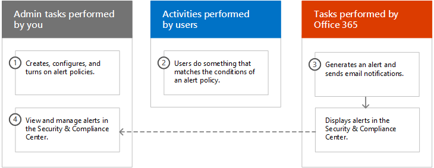

# <a name="alert-policies-in-the-security-and-compliance-center"></a>安全和合规性中心的警报策略

您可以使用 Office 365 和 Microsoft 365 安全和合规性中心中的新警报策略和警报仪表板工具创建警报策略，然后查看用户执行与警报策略条件相匹配的活动时生成的警报。 警报策略基于并扩展活动警报的功能，允许您对警报策略进行分类，将策略应用于组织中的所有用户，为触发警报时设置阈值级别，并决定是否接收电子邮件通知。 在安全和合规性中心中还有一**个"查看警报"** 页面，您可以在其中查看和筛选警报，设置警报状态以帮助您管理警报，然后在解决或解决基础事件后关闭警报。 我们还扩展了可以为其创建警报的事件类型。 例如，您可以创建警报策略来跟踪恶意软件活动和数据丢失事件。 最后，我们还包括了几个默认警报策略，可帮助您监视活动，例如在 Exchange Online 中分配管理员权限、恶意软件攻击、网络钓鱼活动以及异常级别的文件删除和外部共享。

> [!NOTE]
> 具有 Office 365 企业版或 Office 365 美国政府 E1/G1、E3/G3 或 E5/G5 订阅的组织可以使用警报策略。 高级功能仅适用于具有 E5/G5 订阅的组织，或具有 E1/G1 或 E3/G3 订阅以及 Office 365 高级威胁防护 （ATP） P2 或 Office 365 高级合规性加载项订阅的组织。 本主题将突出显示需要 E5/G5 或附加订阅的功能。 另请注意，Office 365 GCC、GCC 高和 DoD 美国政府环境中提供了警报策略。

## <a name="how-alert-policies-work"></a>警报策略的工作原理

以下是警报策略的工作原理以及当用户或管理员活动与警报策略的条件匹配时触发的警报的快速概述。



1. 组织中的管理员使用安全和合规性**中心的"警报策略"** 页创建、配置和打开警报策略。 您还可以使用"安全&合规性中心 PowerShell 中**的新保护警报**cmdlet"创建警报策略。 要创建警报策略，必须为安全和合规性中心中的"管理警报"角色或组织配置角色分配。

2. 用户执行与警报策略的条件相匹配的活动。 在恶意软件攻击的情况下，发送给组织中用户的受感染的电子邮件将触发警报。

3. Office 365 生成显示在安全和合规性**中心的"查看警报"** 页上的警报。 此外，如果为警报策略启用了电子邮件通知，Office 365 会向收件人列表发送通知。 管理员或其他用户可以看到的警报在"查看警报"页上由分配给用户的角色确定。 有关详细信息，请参阅[查看警报所需的 RBAC 权限](#rbac-permissions-required-to-view-alerts)部分。

4. 管理员在安全和合规性中心管理警报。 管理警报包括分配警报状态以帮助跟踪和管理任何调查。

## <a name="alert-policy-settings"></a>警报策略设置

警报策略由一组规则和条件组成，这些规则和条件定义生成警报的用户或管理员活动，在执行活动时触发警报的用户列表，以及定义活动在警报 i 之前发生的次数的阈值。已触发。 您还可以对策略进行分类，并为其分配严重级别。 这两个设置可帮助您管理警报策略（以及匹配策略条件时触发的警报），因为您可以在安全和合规性中心中管理策略和查看警报时对这些设置进行筛选。 例如，您可以查看与同一类别中的条件匹配的警报，或查看具有相同严重性级别的警报。

要查看和创建警报策略，请转到，[https://protection.office.com](https://protection.office.com)然后单击"**警报警报"**\>**策略。**


警报策略由以下设置和条件组成。

- **警报正在跟踪的活动**– 创建策略来跟踪活动，或者在某些情况下，创建一些相关活动，例如通过共享文件、分配访问权限或创建匿名链接与外部用户共享文件。 当用户执行策略定义的活动时，将根据警报阈值设置触发警报。

    > [!NOTE]
    > 您可以跟踪的活动取决于组织的 Office 365 企业版或 Office 365 美国政府计划。 通常，与恶意软件活动和网络钓鱼攻击相关的活动需要 E5/G5 订阅或具有[Office 365 高级威胁防护](../security/office-365-security/office-365-atp.md)计划 2 附加订阅的 E1/G1 或 E3/G3 订阅。

- **活动条件**– 对于大多数活动，您可以定义触发警报必须满足的其他条件。 常见条件包括 IP 地址（以便当用户在具有特定 IP 地址的计算机上执行活动或在 IP 地址范围内执行活动时触发警报），是否触发警报（如果特定用户或用户执行该活动），以及是否触发警报活动在特定文件名或 URL 上执行。 您还可以配置在组织中的任何用户执行活动时触发警报的条件。 可用条件取决于所选活动。

- **触发警报时，** 您可以配置一个设置，用于定义触发警报之前活动发生的频率。 这允许您设置策略，以在每次活动与策略条件匹配、超过特定阈值或警报跟踪活动发生时生成警报。

    

    如果根据异常活动选择设置，Office 365 将建立一个基线值，用于定义所选活动的正常频率。 建立此基线最多需要 7 天，在此期间不会生成警报。 建立基线后，当警报策略跟踪的活动频率大大超过基线值时，将触发警报。 对于与审核相关的活动（如文件和文件夹活动），可以基于单个用户或基于组织中的所有用户建立基线;否则，可以建立基准。对于与恶意软件相关的活动，您可以基于单个恶意软件系列、单个收件人或组织中的所有邮件建立基线。

    > [!NOTE]
    > 需要基于阈值或异常活动配置警报策略的能力需要 E5/G5 订阅，或者具有 Office 365 ATP P2 或高级合规性附加订阅的 E1/G1 或 E3/G3 订阅。 具有 E1/G1 和 E3/G3 订阅的组织只能创建警报策略，在每次发生活动时都会触发警报。

- **警报类别**– 为了帮助跟踪和管理策略生成的警报，您可以将以下类别之一分配给策略。

  - 資料管理

  - 資料外洩防護

  - 郵件流程

  - 權限

  - 威脅管理

  - 其他人

  当发生与警报策略条件匹配的活动时，生成的警报将用此设置中定义的类别进行标记。 这允许您跟踪和管理在安全和合规性**中心的"查看警报"** 页上具有相同类别设置的警报，因为您可以根据类别对警报进行排序和筛选。

- **警报严重性**– 与警报类别类似，您可以分配一个严重性属性（**低、****中、****高**或**信息）** 来警报策略。 与警报类别一样，当发生与警报策略条件匹配的活动时，生成的警报将标记为与为警报策略设置的级别相同的严重性级别。 同样，这允许您跟踪和管理**在"查看警报"** 页上具有相同严重性设置的警报。 例如，可以筛选警报列表，以便仅显示严重性**较高的**警报。

    > [!TIP]
    > 设置警报策略时，请考虑为可能导致严重负面后果的活动分配更高的严重性，例如，在交付给用户后检测恶意软件、查看敏感或机密数据、与外部用户共享数据、或其他可能导致数据丢失或安全威胁的活动。 这可以帮助您确定警报的优先级以及您为调查和解决根本原因而采取的行动。

- **电子邮件通知**– 您可以设置策略，以便在触发警报时将电子邮件通知发送到（或未发送）到用户列表。 您还可以设置每日通知限制，以便在达到最大通知数后，当天不会再发送警报通知。 除了电子邮件通知之外，您或其他管理员还可以**查看"查看警报"** 页上的策略触发的警报。 请考虑为特定类别或具有较高严重性设置的警报策略启用电子邮件通知。

## <a name="default-alert-policies"></a>默认警报策略

Office 365 提供内置警报策略，可帮助识别 Exchange 管理员权限滥用、恶意软件活动和数据治理风险。 在"**警报策略"** 页上，这些内置策略的名称以粗体显示，策略类型**定义为"系统"。** 默认情况下，这些策略处于打开状态。 您可以关闭这些策略（或重新打开），设置要发送电子邮件通知的收件人列表，并设置每日通知限制。 无法编辑这些策略的其他设置。

下表列出并描述了可用的默认警报策略，以及每个策略分配给的类别。 该类别用于确定用户可以在"查看警报"页上查看哪些警报。 有关详细信息，请参阅[查看警报所需的 RBAC 权限](#rbac-permissions-required-to-view-alerts)部分。

该表还指示每个 Office 365 企业和 Office 365 美国政府计划。 如果您的组织除了 E1/G1 或 E3/G3 订阅之外还有适当的加载项订阅，则某些默认警报策略可用。

|**默认警报策略**|**說明**|**Category**|**Office 365 企业版订阅**|
|:-----|:-----|:-----|:-----|
|**检测到潜在的恶意 URL 单击**|当受[Office 365 ATP 安全链接](../security/office-365-security/atp-safe-links.md)保护的用户单击恶意链接时生成警报。 当 Office 365 ATP 标识 URL 判定更改或用户覆盖 Office 365 ATP 安全链接页（基于组织的 Office 365 ATP 安全链接策略）时，将触发此事件。 此警报策略具有**高**严重性设置。 对于 Office 365 ATP P2、E5、G5 客户，此警报会自动触发[Office 365 自动事件响应](https://go.microsoft.com/fwlink/?linkid=2084737)。 有关触发此警报的事件的详细信息，请参阅[设置 Office 365 ATP 安全链接策略](../security/office-365-security/set-up-atp-safe-links-policies.md)。|威脅管理|E5/G5 或 Office 365 ATP P2 附加订阅|
|**创建转发/重定向规则**|当组织中有人为其邮箱创建收件箱规则，将邮件转发或重定向到另一个电子邮件帐户时，生成警报。 此策略仅跟踪使用 Web 上的 Outlook（以前称为 Outlook Web 应用）或 Exchange 在线 PowerShell 创建的收件箱规则。 此策略**具有"低**严重性"设置。 有关详细信息，使用收件箱规则在 Web 上的 Outlook 中转发和重定向电子邮件，请参阅[在 Web 上的 Outlook 中使用 Outlook 中的规则自动将邮件转发到另一个帐户。](https://support.office.com/article/1433e3a0-7fb0-4999-b536-50e05cb67fed)|威脅管理|E1/G1、E3/G3 或 E5/G5|
|**已启动或导出电子数据展示搜索**|当有人使用安全和合规性中心的内容搜索工具时，生成警报。 执行以下内容搜索活动时，将触发警报： <br/><br/>• 内容搜索已启动<br/>• 导出内容搜索的结果<br/>• 导出内容搜索报告<br/><br/>当与电子数据展示案例一起执行之前的内容搜索活动时，也会触发警报。 此策略**具有"中等**严重性"设置。 有关内容搜索活动的详细信息，请参阅在[Office 365 审核日志中搜索电子数据展示活动](search-for-ediscovery-activities-in-the-audit-log.md#ediscovery-activities)。|威脅管理|E1/G1、E3/G3 或 E5/G5|
|**提升交换管理员权限**|在 Exchange 在线组织中为某人分配管理权限时生成警报。 例如，将用户添加到 Exchange 联机中的组织管理角色组时。 此策略**具有"低**严重性"设置。|權限|E1/G1、E3/G3 或 E5/G5|
|**包含传递后删除的恶意软件的电子邮件**|当任何包含恶意软件的邮件传递到组织中的邮箱时，生成警报。 如果发生此事件，Office 365 将使用[零小时自动清除](https://docs.microsoft.com/en-us/office365/zero-hour-auto-purge)从 Exchange 联机邮箱中删除受感染的邮件。 此策略具有**信息严重**性设置，并自动触发[Office 365 自动事件响应](https://go.microsoft.com/fwlink/?linkid=2084737)。|威脅管理|E5/G5 或 Office 365 ATP P2 附加订阅|
|**包含传递后删除的仿冒 URL 的电子邮件**|当任何包含网络钓鱼的邮件传递到组织中的邮箱时，生成警报。 如果发生此事件，Office 365 将使用[零小时自动清除](https://docs.microsoft.com/en-us/office365/zero-hour-auto-purge)从 Exchange 联机邮箱中删除受感染的邮件。 此策略具有**信息严重**性设置，并自动触发[Office 365 自动事件响应](https://go.microsoft.com/fwlink/?linkid=2084737)。|威脅管理|E5/G5 或 Office 365 ATP P2 附加订阅|
|**用户报告为恶意软件或网络钓鱼的电子邮件**|当组织中的用户使用"报告邮件"外接程序将邮件报告为网络钓鱼电子邮件时，生成警报。 此策略具有**信息严重**性设置。 有关此外接程序的详细信息，请参阅[使用报表消息外接程序](https://support.office.com/article/b5caa9f1-cdf3-4443-af8c-ff724ea719d2)。 对于 Office 365 ATP P2、E5、G5 客户，此警报会自动触发[Office 365 自动事件响应](https://go.microsoft.com/fwlink/?linkid=2084737)。|威脅管理|E1/G1、E3/G3 或 E5/G5|
|**邮件已延迟**|当 Office 365 无法使用连接器将电子邮件传递到本地组织或合作伙伴服务器时，生成警报。 发生这种情况时，消息在 Office 365 中排队。 当有 2，000 条或更多的消息已排队超过一小时时，将触发此警报。 此策略**具有"高**严重性"设置。|郵件流程|E1/G1、E3/G3 或 E5/G5|
|**传递后检测到的恶意软件活动**|当包含恶意软件的邮件数量异常多地传递到组织中的邮箱时，生成警报。 如果发生这种情况，Office 365 将从 Exchange 联机邮箱中删除受感染的邮件。 此策略**具有"高**严重性"设置。|威脅管理|E5/G5 或 Office 365 ATP P2 附加订阅|
|**检测到并阻止恶意软件活动**|当有人试图向组织中的用户发送大量包含特定类型恶意软件的电子邮件时，生成警报。 如果发生此事件，Office 365 会阻止受感染的邮件，并且不会传递到邮箱。 此策略**具有"低**严重性"设置。|威脅管理|E5/G5 或 Office 365 ATP P2 附加订阅|
|**在 SharePoint 和 OneDrive 中检测到的恶意软件活动**|在位于 SharePoint 站点或组织中的 OneDrive 帐户中的文件中检测到异常大量的恶意软件或病毒时，生成警报。 此策略**具有"高**严重性"设置。|威脅管理|E5/G5 或 Office 365 ATP P2 附加订阅|
|**由于租户或用户覆盖而交付的仿冒**<sup>1</sup>|当 Office 365 检测到管理员或用户覆盖允许将网络钓鱼邮件传递到邮箱时，生成警报。 重写的示例包括允许来自特定发件人或域的邮件的收件箱或邮件流规则，或允许来自特定发件人或域的邮件的反垃圾邮件策略。 此策略**具有"高**严重性"设置。|威脅管理|E5/G5 或 Office 365 ATP P2 附加订阅|
|**检测到可疑电子邮件发送模式**|当组织中有人发送了可疑电子邮件，并且有被限制发送电子邮件的风险时，生成警报。 对于可能指示帐户已泄露，但不足以限制用户的行为，这是一个早期警告。 此策略**具有"中等**严重性"设置。 尽管这种情况很少见，但此策略生成的警报可能是异常。 但是，最好[检查用户帐户是否受到威胁。](responding-to-a-compromised-email-account.md)|威脅管理|E1/G1、E3/G3 或 E5/G5  |
|**租户限制发送电子邮件**|当组织的大部分电子邮件流量被检测为可疑，并且 Microsoft 已限制您的组织发送电子邮件时，生成警报。 调查任何可能受损的用户和管理员帐户、新连接器或打开的中继，然后联系 Microsoft 支持以解除阻止您的组织。 此策略**具有"高**严重性"设置。 有关组织被阻止的原因的详细信息，请参阅[修复电子邮件传递问题的错误代码 5.7.7xx 在 Exchange 在线](https://go.microsoft.com/fwlink/?linkid=2022138)中。|威脅管理|E1/G1、E3/G3 或 E5/G5|
|**异常外部用户文件活动**|当组织外部的用户在 SharePoint 或 OneDrive 中对文件执行异常大量的活动时，生成警报。 这包括访问文件、下载文件和删除文件等活动。 此策略**具有"高**严重性"设置。|資料管理|E5/G5、Office 365 ATP P2 或高级合规性附加订阅|
|**外部文件共享的异常量**|当 SharePoint 或 OneDrive 中的文件数量异常多时与组织外部的用户共享时，生成警报。 此策略**具有"中等**严重性"设置。|資料管理|E5/G5、Office 365 ATP P2 或高级合规性附加订阅|
|**异常文件删除量**|当 SharePoint 或 OneDrive 在短时间内删除大量异常多的文件时，生成警报。 此策略**具有"中等**严重性"设置。|資料管理|E5/G5、Office 365 ATP P2 或高级合规性附加订阅|
|**报告为网络钓鱼的电子邮件异常增加**|当组织中使用 Outlook 中的"报告邮件"加载项将邮件报告为网络钓鱼邮件的人数显著增加时，生成警报。 此策略**具有"高**严重性"设置。 有关此外接程序的详细信息，请参阅[使用报表消息外接程序](https://support.office.com/article/b5caa9f1-cdf3-4443-af8c-ff724ea719d2)。|威脅管理|E5/G5 或 Office 365 ATP P2 附加订阅|
|**用户模拟网络钓鱼发送到收件箱/文件夹**<sup>1，</sup><sup>2</sup>|当 Office 365 检测到管理员或用户覆盖允许将用户模拟网络钓鱼邮件传递到邮箱的收件箱（或其他用户可访问的文件夹）时生成警报。 重写的示例包括允许来自特定发件人或域的邮件的收件箱或邮件流规则，或允许来自特定发件人或域的邮件的反垃圾邮件策略。 此策略**具有"中等**严重性"设置。|威脅管理|E5/G5 或 Office 365 ATP P2 附加订阅|
|**用户限制发送电子邮件**|当组织中的某个人被禁止发送出站邮件时，生成警报。 这通常在帐户受到威胁时产生，并且用户列在"安全&合规性中心"**中的"受限用户"** 页上。 （要访问此页面，请访问**威胁管理>审查>受限用户**）。 此策略**具有"高**严重性"设置。 有关受限用户的详细信息，请参阅[发送垃圾邮件后从阻止列表中删除用户、域或 IP 地址。](https://docs.microsoft.com/en-us/office365/securitycompliance/removing-user-from-restricted-users-portal-after-spam)|威脅管理|E1/G1、E3/G3 或 E5/G5|
|||||

> [!NOTE]
> <sup>1</sup>我们根据客户反馈暂时删除了此默认警报策略。 我们正在努力改进它，并将在不远的将来将其替换为新版本。 在此之前，您可以创建自定义警报策略，以便使用以下设置替换此功能：<br/>&nbsp;• 活动是在交付时检测到的网络钓鱼电子邮件<br/>&nbsp;• 邮件不是 ZAP'd<br/>&nbsp;• 邮件方向为入站<br/>&nbsp;• 邮件传递状态已送达<br/>&nbsp;• 检测技术是恶意 URL 保留、URL 引爆、高级网络钓鱼过滤器、常规网络钓鱼过滤器、域模拟、用户模拟和品牌模拟<br/><br/><sup>2</sup>要重新创建此警报策略，请遵循上一个脚注中的指南，但选择"用户模拟"作为唯一的检测技术。

某些内置策略监视的异常活动基于与前面描述的警报阈值设置相同的过程。 Office 365 建立了一个基线值，用于定义"常规"活动的正常频率。 然后，当内置警报策略跟踪的活动频率大大超过基线值时，将触发警报。

## <a name="viewing-alerts"></a>查看警报

当组织中的用户执行的活动与警报策略的设置匹配时，将生成警报并显示在安全和合规性**中心的"查看警报"** 页上，具体取决于警报策略的设置、电子邮件触发警报时，通知也会发送到指定用户的列表。 对于每个警报，"**查看警报"** 页上的仪表板将显示相应的警报策略的名称、警报的严重性和类别（在警报策略中定义）以及导致警报发生的活动的次数生成。 此值基于警报策略的阈值设置。 仪表板还显示每个警报的状态。 有关使用状态属性管理警报[的详细信息，请参阅管理警报](#managing-alerts)部分。

要查看警报，请[https://protection.office.com](https://protection.office.com)转到，然后单击"**警报**\>**查看警报"。**


您可以使用以下筛选器**在"查看警报"** 页上查看所有警报的子集。

- **状态**= 使用此筛选器可显示已分配特定状态的警报。 默认状态**为"活动"。** 您或其他管理员可以更改状态值。

- **策略**- 使用此筛选器可显示与一个或多个警报策略设置相匹配的警报。 或者，您可以显示所有警报策略的所有警报。

- **时间范围**= 使用此筛选器可显示在特定日期和时间范围内生成的警报。

- **严重性**= 使用此筛选器可显示已分配特定严重性警报的警报。

- **类别**= 使用此筛选器可显示来自一个或多个警报类别的警报。

- **源**— 使用此筛选器可显示由安全和合规性中心中的警报策略触发的警报或由 Office 365 云应用安全策略触发的警报，或两者兼而有之。 有关 Office 365 云应用安全警报的详细信息，请参阅[查看云应用安全警报](#viewing-cloud-app-security-alerts)部分。

## <a name="rbac-permissions-required-to-view-alerts"></a>查看警报所需的 RBAC 权限

分配给组织中的用户的基于角色的访问控制 （RBAC） 权限确定用户可以**在"查看警报"** 页上看到哪些警报。 这是怎么实现的？ 分配给用户的管理角色（基于他们在安全&合规性中心中的角色组中的成员身份）确定用户可以**在"查看警报"** 页上看到哪些警报类别。 以下為一些範例：

- 记录管理角色组的成员只能查看由分配**数据治理**类别的警报策略生成的警报。

- 合规性管理员角色组的成员无法查看由分配**了"威胁管理"** 类别的警报策略生成的警报。

- 电子数据展示管理器角色组的成员无法查看任何警报，因为分配的角色都没有提供查看来自任何警报类别的警报的权限。

此设计（基于 RBAC 权限）允许您确定组织中特定作业角色中的用户可以查看（和管理）哪些警报。

下表列出了查看来自 6 个不同警报类别的警报所需的角色。 表中的第一列列出了安全&合规性中心中的所有角色。  复选标记表示分配该角色的用户可以查看从上行中列出的相应警报类别的警报。

要查看默认警报策略分配给哪个类别，请参阅[默认警报策略](#default-alert-policies)部分中的表。

|&nbsp;|資料管理|資料外洩防護|郵件流程|權限|威脅管理|其他人|
|:---------|:---------:|:---------:|:---------:|:---------:|:---------:|:---------:|
|稽核記錄檔|||||||
|案例管理|||||||
|合规性管理员|||||||
|合規性搜尋|||||||
|裝置管理|||||||
|处置管理|||||||
|DLP 合规性管理|||||||
|匯出|||||||
|保持|||||||
|管理提醒|||||||
|组织配置|||||||
|預覽|||||||
|记录管理|||||||
|保留管理|||||||
|檢閱|||||||
|RMS 解密|||||||
|角色管理|||||||
|搜索和清除|||||||
|安全管理员|||||||
|安全读取器||||||
|服务保障视图|||||||
|监督审查管理员|||||||
|仅查看审核日志|||||||
|仅查看设备管理|||||||
|仅限查看的 DLP 合规性管理|||||||
|仅查看管理警报|||||||
|僅限檢視收件者|||  ||||
|仅查看记录管理|||||||
|仅查看保留管理|||||||
|||||||

**提示：** 要查看分配给每个默认角色组的角色，在"安全&合规性中心 PowerShell 中运行以下命令：

```PowerShell
$RoleGroups = Get-RoleGroup
```

```PowerShell
$RoleGroups | foreach {Write-Output -InputObject `r`n,$_.Name,"-----------------------"; Get-RoleGroup $_.Identity | Select-Object -ExpandProperty Roles}
```

您还可以查看分配给安全&合规性中心中的角色组的角色。 **转到"权限"** 页，然后单击角色组。 分配的角色列在弹出窗口页上。

## <a name="managing-alerts"></a>管理警报

生成警报并将其显示在安全和合规性**中心的"视图警报"** 页上后，您可以对其进行会审、调查和解决。 以下是您可以执行的一些任务来管理警报。

- **为警报分配状态**- 您可以将以下状态之一分配给警报：**活动（** 默认值）、**调查、****已解决**或**已取消。** 然后，您可以筛选此设置以显示具有相同状态设置的警报。 此状态设置可帮助跟踪管理警报的过程。

- **查看警报详细信息**- 您可以单击警报以显示包含警报详细信息的弹出窗口页面。 详细信息取决于相应的警报策略，但它通常包括以下内容：触发警报的实际操作的名称（如 cmdlet）、触发警报的活动的说明、用户（或用户列表）触发警报的人员，以及相应警报策略的名称（和链接）。

  - 触发警报的实际操作的名称，如 cmdlet 或审核日志操作。

  - 触发警报的活动的说明。

  - 触发警报的用户。 这仅适用于设置为跟踪单个用户或单个活动的警报策略。

  - 执行警报跟踪的活动的次数。 此数字可能与"查看警报"页上列出的相关警报的实际数量不匹配，因为可能已触发其他警报。

  - 指向活动列表的链接，其中包含触发警报的每个活动的项。 此列表中的每个条目标识活动发生的时间、实际操作的名称（如"FileDeleted"）以及执行活动的用户、执行活动的对象（如文件、电子数据展示案例或邮箱）以及 IP用户计算机的地址。 对于与恶意软件相关的警报，此链接指向消息列表。

  - 相应警报策略的名称（和链接）。

- **禁止电子邮件通知**- 您可以关闭（或禁止）来自弹出窗口的电子邮件通知以接收警报。 禁止显示电子邮件通知时，Office 365 不会在与警报策略条件匹配的活动或事件时发送通知。 但是，当用户执行的活动与警报策略的条件匹配时，将触发警报。 您还可以通过编辑警报策略来关闭电子邮件通知。

- **解决警报**- 您可以在警报的弹出窗口页面上将警报标记为已解决（将警报的状态设置**为"已解决"）。** 除非更改筛选器，否则已解决的警报不会**显示在"查看警报"** 页上。

## <a name="viewing-cloud-app-security-alerts"></a>查看云应用安全警报

由 Office 365 云应用安全策略触发的警报现在显示在安全和合规性**中心的"查看警报"** 页上。 这包括由活动策略触发的警报，以及由 Office 365 云应用安全中的异常检测策略触发的警报。 这意味着您可以查看安全和合规性中心中的所有警报。 Office 365 云应用安全版仅适用于具有 Office 365 企业版 E5 或 Office 365 美国政府 G5 订阅的组织。 有关详细信息，请参阅[云应用安全概述](https://docs.microsoft.com/cloud-app-security/what-is-cloud-app-security)。

将 Microsoft 云应用安全性作为企业移动性 + 安全 E5 订阅的一部分或作为独立服务的组织还可以在安全&合规性中心查看与 Office 365 应用和服务相关的云应用安全警报。

要仅在安全和合规性中心显示云应用安全警报，请使用**源**筛选器并**选择"云应用安全"。**


与安全和合规性中心中的警报策略触发的警报类似，您可以单击云应用安全警报以显示一个弹出窗口，其中显示有关警报的详细信息。 警报包括用于查看云应用安全门户中的详细信息和管理警报的链接，以及指向触发警报的相应云应用安全策略的链接。 请参阅[在云应用安全中监视警报。](https://docs.microsoft.com/cloud-app-security/monitor-alerts)


> [!IMPORTANT]
> 更改安全和合规性中心中的云应用安全警报的状态不会更新云应用安全门户中同一警报的解析状态。 例如，如果在安全和合规性中心将警报的状态**标记为"已解决"，** 则云应用安全门户中的警报状态将保持不变。 要解决或关闭云应用安全警报，在云应用安全门户中管理该警报。
