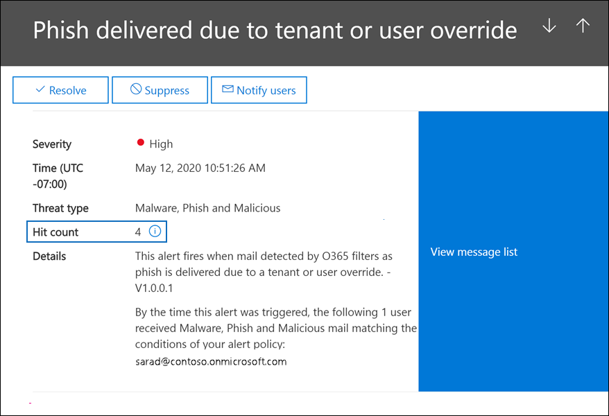

# <a name="alert-policies-in-the-microsoft-365-compliance-center"></a>Microsoft 365 合規性中心中的警示原則

您可以使用 Microsoft 365 合規性中心中的「警示原則」和「警示」儀表板工具來建立警示原則，然後查看使用者執行符合警示原則條件的活動時所產生的警示。 有幾個預設的警示原則可協助您監視活動，例如指派系統管理員許可權的 Exchange Online、惡意程式碼攻擊、網路釣魚活動，以及檔案刪除及外部共用的非尋常層級。

警示原則可讓您分類原則所觸發的警示、將原則套用至組織中的所有使用者、設定觸發警示時的閾值等級，以及決定是否要在觸發警示時收到電子郵件通知。 在 [規範中心] 也有一個 **警示** 頁面，您可以在其中查看和篩選提醒、設定警示狀態，協助您管理提醒，然後在您解決或解決基礎事件後消除警示。

> [!NOTE]
> 警示原則適用于具有 Microsoft 365 企業版、Office 365 企業版或 Office 365 美國政府 E1/F1/G1、E3/F3/G3 或 E5/G5 訂閱的組織。 只有具有 E5/G5 訂閱的組織，或具有 E1/F1/G1 或 E3/F3/G3 訂閱的組織，以及 Office 365 P2 或 Microsoft 365 E5 合規性或 E5 eDiscovery 和審核附加元件訂閱的 Microsoft Defender，才可使用高級功能。 本主題中已反白顯示需要 E5/G5 或附加元件訂閱的功能。 另外請注意，Office 365 GCC、GCC 高及 DoD 美國政府環境中提供警示原則。

## <a name="how-alert-policies-work"></a>警示原則的運作方式

以下是警示原則的運作方式，以及當使用者或系統管理員活動符合警示原則條件時所觸發之警示的快速概覽。


1. 您組織中的系統管理員會使用規範中心內的 [ **提醒原則** ] 頁面，建立、設定及開啟警示原則。 您也可以在安全性 & 規範中心 PowerShell 中使用 [set-protectionalert 指令程式](/powershell/module/exchange/new-protectionalert) 來建立警示原則。

   若要建立警示原則，您必須在規範中心內指派「管理警示」角色或「組織設定」角色。

   > [!NOTE]
   > 在建立或更新警示原則之後，需要長達24小時後，才能由原則觸發警示。 這是因為原則必須同步處理至警示偵測引擎。

2. 使用者執行符合警示原則條件的活動。 在惡意程式碼攻擊的情況下，傳送給組織中使用者的受感染電子郵件會觸發警示。

3. Microsoft 365 會產生警示，它會顯示在 Microsoft 365 合規性中心中的 [**提醒**] 頁面上。 此外，如果已啟用警示原則的電子郵件通知，Microsoft 會傳送通知給收件者清單。 系統管理員或其他使用者可以在 [提醒] 頁面上看到的警示，是由指派給使用者的角色所決定。 如需詳細資訊，請參閱 [查看提醒所需的 RBAC 許可權](#rbac-permissions-required-to-view-alerts)。

4. 系統管理員會管理規範中心內的警示。 管理警示包括指派提醒狀態，以協助追蹤和管理任何調查。

## <a name="alert-policy-settings"></a>警示原則設定

警示原則包含一組規則和條件，可定義產生警示的使用者或系統管理員活動，以及在執行活動時觸發警示的使用者清單，以及定義觸發警示之前必須進行的活動次數的臨界值。 您也對原則進行分類，並指派嚴重性層級。 這兩項設定可協助您管理警示原則 (和在符合原則條件時所觸發的警示) 因為您可以在管理原則及在規範中心中查看警示時，篩選這些設定。 例如，您可以查看符合相同類別之條件的警示，或查看具有相同嚴重性層級的警示。

**若要查看及建立警示原則：**

移至 <https://compliance.microsoft.com> ，然後選取 [**原則**] [  >  **警示**  >  **報警原則**]。 或者，您可以直接前往 <https://compliance.microsoft.com/alertpolicies> 。

![在 [規範中心] 中，選取 [原則]，然後在 [警示] 底下，選取 [警示原則] 以查看和建立警示原則。](../media/LaunchAlertPoliciesMCC.png)

警示原則由下列設定和條件所組成。

- **活動正在追蹤警示**。 您可以建立原則來追蹤活動，或在某些情況下，使用一些相關的活動，例如與外部使用者共用檔案、指派存取權限，或建立匿名連結。 當使用者執行原則所定義的活動時，系統會根據警示閾值設定觸發警示。

    > [!NOTE]
    > 您可以追蹤的活動取決於組織的 Office 365 企業版或 Office 365 美國政府計畫。 一般說來，惡意程式碼活動與網路釣魚攻擊相關的活動，需要具有 E5/G5 訂閱或 E1/F1/G1 或 E3/F3/G3 訂閱，其 Office 365 方案2附加元件訂閱的[Defender](../security/office-365-security/defender-for-office-365.md) 。

- **活動條件**。 在大部分的活動中，您可以定義必須滿足的其他條件，以觸發警示。 常見的情況包括 IP 位址 (，這樣當使用者在具有特定 IP 位址或 IP 位址) 範圍的電腦上執行活動時，就會觸發警示，是否要在特定使用者或使用者執行該活動時觸發警示，以及是否要在特定的檔案名或 URL 上執行該活動。 您也可以設定條件，當組織中的任何使用者執行活動時，就會觸發警示。 可用的條件取決於所選的活動。

- **觸發警示時**。 您可以設定定義事件在觸發提醒之前所發生頻率的設定。 這可讓您設定原則，以在每次活動符合原則條件時、超過特定臨界值時，或在事件發生時，您的組織不尋常時產生警示。

    

    如果您根據不尋常的活動選取設定，Microsoft 會建立定義所選活動一般頻率的比較基準值。 建立此基準需要長達7天，而不會產生提醒。 建立基準之後，當警示原則追蹤的活動頻率超過基準值時，就會觸發警示。 針對與審核相關的活動 (例如檔案和資料夾活動) ，您可以根據單一使用者或組織中的所有使用者建立基準。針對惡意程式碼相關的活動，您可以根據單一惡意程式碼系列、單一收件者或組織中的所有郵件，建立基準。

    > [!NOTE]
    > 根據臨界值或非使用中活動來設定警示原則的功能，需要 E5/G5 訂閱，或具有 Microsoft Defender 的 E1/F1/G1 或 E3/F3 訂閱，以供 Office 365 P2、Microsoft 365 E5 合規性或 Microsoft 365 eDiscovery 和審核附加元件訂閱。 具有 E1/F1/G1 和 E3/F3/G3 訂閱的組織，只會建立會在每次發生活動時觸發警示的警示原則。

- **警示類別**。 若要協助追蹤和管理原則所產生的警示，您可以將下列其中一個類別指派給原則。

  - 資料外洩防護

  - 資訊控管

  - 郵件流程

  - 權限

  - 威脅管理

  - 其他人

  當發生符合警示原則條件的活動時，所產生的警示會以此設定中所定義的類別進行標記。 這可讓您在「規範中心」的 [ **提醒** ] 頁面上，追蹤和管理具有相同類別設定的提醒，因為您可以根據類別排序和篩選警示。

- **警示嚴重性**。 類似于警示類別，您可以指派嚴重性屬性 (**低**、 **中**、 **高** 或 **資訊性**) 以警示原則。 就像警示類別，當發生符合警示原則條件的活動時，所產生的警示會以針對警示原則所設定的嚴重性等級進行標記。 同樣地，這可讓您在 [ **提醒** ] 頁面上追蹤及管理具有相同嚴重性設定的警示。 例如，您可以篩選警示清單，只顯示 **高** 嚴重性的警示。

    > [!TIP]
    > 在設定警示原則時，請考慮將較高的嚴重性指派給可能會造成嚴重負面影響的活動，例如，在傳遞給使用者、查看機密或保密資料、與外部使用者共用資料，以及可能導致資料遺失或安全性威脅的其他活動中偵測惡意程式碼。 這可協助您排定提醒優先順序和您採取的動作，以調查並解決基本原因。

- **電子郵件通知**。 您可以設定原則，以便在觸發警示時 (傳送電子郵件通知，或是不傳送) 傳送給使用者清單。 您也可以設定每日通知限制，這樣一來，就能達到通知數目上限之後，就不會在該天內傳送警示的通知。 除了電子郵件通知之外，您或其他管理員也可以在 [ **警示** ] 頁面上查看由原則所觸發的警示。 考慮啟用特定類別或具有較高嚴重性設定之警示原則的電子郵件通知。

## <a name="default-alert-policies"></a>預設警示原則

Microsoft 提供內建的警示原則，可協助識別 Exchange 系統管理許可權濫用、惡意程式碼活動、潛在的外部和內部威脅，以及資訊控管風險。 在 [ **警示原則** ] 頁面上，這些內建原則的名稱是粗體，而原則類型則定義為 **System**。 預設會開啟這些原則。 您可以 (或重新開啟這些原則) 、設定收件者清單以傳送電子郵件通知，以及設定每日通知限制。 無法編輯這些原則的其他設定。

下表列出並說明可用的預設警示原則，以及指派每個原則的類別。 類別可用來決定使用者可在 [提醒] 頁面上查看的警示。 如需詳細資訊，請參閱 [查看提醒所需的 RBAC 許可權](#rbac-permissions-required-to-view-alerts)。

該表也會指出 Office 365 企業版，並 Office 365 每個必要的政府方案。 當您的組織除了 E1/F1/G1 或 E3/F3/G3 訂閱之外，如果您的組織具有適當的附加元件訂閱，則可以使用某些預設的警示原則。

| 預設警示原則 | 描述 | Category | Enterprise 訂閱 |
|:-----|:-----|:-----|:-----|
|**偵測到可能的惡意 URL 按一下**|當您組織中[保管庫連結](../security/office-365-security/safe-links.md)所保護的使用者按一下惡意連結時，會產生警示。 當 Microsoft Defender 針對 Office 365，或使用者根據組織的 Microsoft 365 for business 保管庫連結原則來覆寫保管庫連結頁面 (時，就會觸發此事件。 此警示原則具有 **高** 嚴重性設定。 若為 Office 365 P2，G5，G5 客戶的 Defender，此提醒會[在 Office 365 中自動觸發自動調查和回應](../security/office-365-security/office-365-air.md)。 如需觸發此警示之事件的詳細資訊，請參閱[設定保管庫連結原則](../security/office-365-security/set-up-safe-links-policies.md)。|威脅管理|E5/G5 或 Office 365 P2 附加元件訂閱的 Defender|
|**系統管理員提交結果已完成**|當系統 [管理員提交](../security/office-365-security/admin-submission.md) 完成已送出之實體的重新掃描時產生警示。 每當系統管理員提交轉譯重新掃描結果時，就會觸發警示。 這些提醒會提醒您 [複查先前提交的結果](https://compliance.microsoft.com/reportsubmission)、提交使用者報告的郵件以取得最新的原則檢查和重新掃描 verdicts，以及協助您判斷組織中的篩選原則是否有預期的影響。 這個原則有 **資訊性** 嚴重性設定。|威脅管理|E1/F1、E3/F3 或 E5|
|**管理員已觸發手動調查電子郵件**|當系統管理員觸發手動調查來自威脅瀏覽器的電子郵件時產生警示。 如需詳細資訊，請參閱 [範例：安全性管理員會觸發來自威脅瀏覽器的調查](../security/office-365-security/automated-investigation-response-office.md#example-a-security-administrator-triggers-an-investigation-from-threat-explorer)。 此警示會通知您的組織已開始調查。 警示會提供觸發它之人員的相關資訊，並包含調查的連結。 這個原則有 **資訊性** 嚴重性設定。|威脅管理| E5/G5 或 Microsoft Defender for Office 365 P2 附加元件訂閱| 
|**建立轉寄/重新導向規則**|當您組織中的人員建立信箱的收件匣規則，將郵件轉寄或重新導向至另一個電子郵件帳戶時，會產生警示。 這個原則只追蹤使用 Outlook 網頁版 (以前稱為 Outlook Web App) 或 Exchange Online PowerShell 來建立的收件匣規則。 這個原則有 **資訊性** 嚴重性設定。 如需使用收件匣規則來轉寄及重新導向 Outlook 網頁版中電子郵件的詳細資訊，請參閱[使用 Outlook 網頁版中的規則，自動將郵件轉寄至另一個帳戶](https://support.office.com/article/1433e3a0-7fb0-4999-b536-50e05cb67fed)。|威脅管理|E1/F1/G1、E3/F3/G3 或 E5/G5|
|**電子文件探索搜尋已啟動或已匯出**|當有人在安全性與合規性中心使用內容搜尋工具時產生警示。 執行下列內容搜尋活動時，會觸發警示： <br/><br/>* 已啟動內容搜尋<br/>* 匯出內容搜尋的結果<br/>* 內容搜尋報告已匯出<br/><br/>在與 eDiscovery 案例關聯的先前內容搜尋活動執行時，也會觸發警示。 這個原則有 **資訊性** 嚴重性設定。 如需內容搜尋活動的詳細資訊，請參閱在 [審核記錄中搜尋 eDiscovery 活動](search-for-ediscovery-activities-in-the-audit-log.md#ediscovery-activities)。|威脅管理|E1/F1/G1、E3/F3/G3 或 E5/G5|
|**提升 Exchange 系統管理許可權**|當有人在您的 Exchange Online 組織中指派系統管理許可權時產生警示。 例如，當使用者新增至 Exchange Online 中的「組織管理」角色群組時。 這個原則的嚴重性設定 **低** 。|權限|E1/F1/G1、E3/F3/G3 或 E5/G5|
|**傳遞後移除包含惡意郵件的電子郵件訊息**|會在包含惡意程式碼的任何郵件傳送至組織中的信箱時產生警示。 如果發生此事件，Microsoft 會使用[零小時自動清除](../security/office-365-security/zero-hour-auto-purge.md)，從 Exchange Online 信箱中移除染毒郵件。 這個原則的 **資訊** 嚴重性設定會自動觸發 [Office 365 中的自動調查和回應](../security/office-365-security/office-365-air.md)。|威脅管理|E5/G5 或 Microsoft Defender for Office 365 P2 附加元件訂閱|
|**傳遞後移除包含網路釣魚 URL 的電子郵件訊息**|將包含網路釣魚詐騙的郵件傳送給組織中的信箱時，會產生警示。 如果發生此事件，Microsoft 會使用[零小時自動清除](../security/office-365-security/zero-hour-auto-purge.md)，從 Exchange Online 信箱中移除染毒郵件。 這個原則的 **資訊** 嚴重性設定會自動觸發 [Office 365 中的自動調查和回應](../security/office-365-security/office-365-air.md)。|威脅管理|E5/G5 或 Office 365 P2 附加元件訂閱的 Defender|
|**使用者報告為惡意郵件或網路釣魚的電子郵件**|當您組織中的使用者使用報告訊息增益集將郵件報告為網路釣魚電子郵件時，就會產生警示。 這個原則的嚴重性設定 **低** 。 如需此增益集的詳細資訊，請參閱 [Use The Report Message 增益集](https://support.office.com/article/b5caa9f1-cdf3-4443-af8c-ff724ea719d2)。 若為 Office 365 P2，G5，G5 客戶的 Defender，此提醒會[在 Office 365 中自動觸發自動調查和回應](../security/office-365-security/office-365-air.md)。|威脅管理|E1/F1/G1、E3/F3/G3 或 E5/G5|
|**超過電子郵件傳送限制**|當您組織中的某人傳送的郵件超過輸出垃圾郵件原則所允許的郵件時，就會產生警示。 這通常表示使用者傳送太多電子郵件，或可能會危及帳戶。 這個原則的嚴重性設定是「 **中** 」。 如果您收到此警示原則產生的警示，最好 [檢查使用者帳戶是否遭到破壞](../security/office-365-security/responding-to-a-compromised-email-account.md)。|威脅管理|E1/F1/G1、E3/F3/G3 或 E5/G5|
|**由於可能的網路釣魚嘗試封鎖表單**|當您組織中的某人因偵測到重複的網路釣魚嘗試行為而受到限制，無法使用 Microsoft 表單共用表單及收集回應時產生警示。 這個原則具有 **高嚴重性** 設定。|威脅管理|E1、E3/F3 或 E5|
|**已標記為網路釣魚的表單並確認**|當您從組織內部建立的 Microsoft Forms 中的表單被識別為 Microsoft 的潛在網路釣魚時，會產生警示。 這個原則具有 **高** 嚴重性設定。|威脅管理|E1、E3/F3 或 E5|
|**郵件已延遲**|當 Microsoft 無法使用連接器將電子郵件傳送至您的內部部署組織或夥伴伺服器時，產生警示。 發生這種情況時，郵件會在 Office 365 佇列中。 當有2000封以上的郵件已排入佇列超過一小時時，就會觸發此警示。 這個原則具有 **高** 嚴重性設定。|郵件流程|E1/F1/G1、E3/F3/G3 或 E5/G5|
|**傳遞後偵測到惡意程式碼活動**|當大量包含惡意程式碼的郵件會傳遞至組織中的信箱時產生警示。 如果發生此事件，Microsoft 會從 Exchange Online 信箱中移除受感染的郵件。 這個原則具有 **高** 嚴重性設定。|威脅管理|E5/G5 或 Microsoft Defender for Office 365 P2 附加元件訂閱|
|**偵測到惡意程式碼並封鎖惡意程式碼**|當有人企圖傳送大量包含特定惡意程式碼類型的電子郵件訊息給組織中的使用者時，會產生警示。 如果發生此事件，受感染的郵件會受到 Microsoft 封鎖，而且不會傳送至信箱。 這個原則的嚴重性設定 **低** 。|威脅管理|E5/G5 或 Office 365 P2 附加元件訂閱的 Defender|
|**在 SharePoint 和 OneDrive 中偵測到惡意軟體活動**|當位於 SharePoint 網站中的檔案或組織中的 OneDrive 帳戶中偵測到大量的惡意程式碼或病毒時，會產生警示。 這個原則具有 **高** 嚴重性設定。|威脅管理|E5/G5 或 Office 365 P2 附加元件訂閱的 Defender|
|**因為已停用 ZAP，所以惡意程式碼不會 zapped**| 會在 Microsoft 偵測到將惡意程式碼傳遞至信箱時產生警示，因為網路釣魚郵件的 Zero-Hour 自動清除功能已停用。 這個原則有 **資訊性** 嚴重性設定。 |威脅管理|E5/G5 或 Office 365 P2 附加元件訂閱的 Defender|
|**因為停用使用者的垃圾郵件資料夾，所以已傳遞網路釣魚**|會在 Microsoft 偵測到使用者的垃圾郵件資料夾被停用時產生警示，允許將高可信度的網路釣魚郵件傳遞至信箱。 這個原則有 **資訊性** 嚴重性設定。|威脅管理|E5/G5 或 Office 365 P1 或 P2 附加元件訂閱的 Defender|
|**由於 ETR 覆寫而傳送網路釣魚詐騙**|當 Microsoft 偵測到 Exchange 傳輸規則 (ETR) ，允許將高可信度的網路釣魚郵件傳遞至信箱時，會產生警示。 這個原則有 **資訊性** 嚴重性設定。 如需 Exchange 傳輸規則 () 郵件流程規則的相關資訊，請參閱[mail flow rules (Transport rules) in Exchange Online](/exchange/security-and-compliance/mail-flow-rules/mail-flow-rules)。|威脅管理|E5/G5 或 Office 365 P1 或 P2 附加元件訂閱的 Defender|
|**由於 IP 允許原則，網路釣魚詐騙已傳送**|當 Microsoft 偵測允許將高可信度網路釣魚郵件傳遞至信箱的 IP 允許原則時，會產生警示。 這個原則有 **資訊性** 嚴重性設定。 如需 IP 允許原則 (連線篩選) 的詳細資訊，請參閱[Configure the default connection filter policy-Office 365](../security/office-365-security/configure-the-connection-filter-policy.md)。|威脅管理|E5/G5 或 Office 365 P1 或 P2 附加元件訂閱的 Defender|
|**因為已停用 ZAP，所以無法 zapped 網路釣魚**| 因為網路釣魚郵件的 Zero-Hour 自動清除已停用，所以 Microsoft 偵測到信箱的高可信度郵件會產生警示。 這個原則有 **資訊性** 嚴重性設定。|威脅管理|E5/G5 或 Office 365 P2 附加元件訂閱的 Defender|
|**由於租使用者或使用者覆寫1，網路釣魚詐騙已傳送**<sup></sup>|當 Microsoft 偵測到系統管理員或使用者覆寫，允許將網路釣魚郵件傳遞至信箱時，會產生警示。 覆寫的範例包括允許來自特定寄件者或網域之郵件的收件匣或郵件流程規則，或是允許來自特定寄件者或網域之郵件的反垃圾郵件原則。 這個原則具有 **高** 嚴重性設定。|威脅管理|E5/G5 或 Office 365 P2 附加元件訂閱的 Defender|
|**可疑的電子郵件轉寄活動**|當您組織中的人員已將電子郵件 autoforwarded 至可疑的外部帳戶時，會產生警示。 這是一種針對可能會指出帳戶已遭破壞，但不足以限制使用者之行為的早期警告。 這個原則具有 **高** 嚴重性設定。 雖然這種情況很少見，但由此原則產生的警示可能是反常的。 最好 [檢查使用者帳戶是否受損](../security/office-365-security/responding-to-a-compromised-email-account.md)。|威脅管理|E1/F1/G1、E3/F3/G3 或 E5/G5|
|**偵測到電子郵件傳送模式**|當貴組織中的某人傳送了可疑的電子郵件，並有限制傳送電子郵件的風險時，會產生警示。 這是一種針對可能表示帳戶已遭到破壞，但不足以限制使用者之行為的早期警告。 這個原則的嚴重性設定是「 **中** 」。 雖然這種情況很少見，但由此原則產生的警示可能是反常的。 不過，最好 [檢查使用者帳戶是否受損](../security/office-365-security/responding-to-a-compromised-email-account.md)。|威脅管理|E1/F1/G1、E3/F3/G3 或 E5/G5  |
|**受限制的租使用者傳送電子郵件**|當您組織中的大部分電子郵件流量偵測到可疑，而且 Microsoft 已限制您的組織傳送電子郵件時，會產生警示。 調查任何可能遭到破壞的使用者和系統管理員帳戶、新連接器或開啟的中繼，然後聯繫 Microsoft 支援部門以解除封鎖您的組織。 這個原則具有 **高** 嚴重性設定。 如需有關組織遭到封鎖原因的詳細資訊，請參閱[修正電子郵件傳遞問題，以取得 Exchange Online 的錯誤碼 5.7.7 xx](/Exchange/mail-flow-best-practices/non-delivery-reports-in-exchange-online/fix-error-code-5-7-700-through-5-7-750)。|威脅管理|E1/F1/G1、E3/F3/G3 或 E5/G5|
|**不尋常的外部使用者檔案活動**|當您組織外部的使用者在 SharePoint 或 OneDrive 中執行大量的活動時，會產生警示。 這包括存取檔、下載檔案和刪除檔案等活動。 這個原則具有 **高** 嚴重性設定。|資訊控管|E5/G5、Microsoft Defender for Office 365 P2 或 Microsoft 365 E5 附加元件訂閱|
|**外部檔案共用的數量不尋常**|當 SharePoint 或 OneDrive 中的大量檔案與組織外的使用者共用時，會產生警示。 這個原則的嚴重性設定是「 **中** 」。|資訊控管|E5/G5、Office 365 P2 的 Defender 或 Microsoft 365 E5 附加元件訂閱|
|**刪除的檔案量不尋常**|在 SharePoint 中或在短時間內 OneDrive 中刪除大量檔案時產生警示。 這個原則的嚴重性設定是「 **中** 」。|資訊控管|E5/G5、Office 365 P2 的 Defender 或 Microsoft 365 E5 附加元件訂閱|
|**報告為網路釣魚的電子郵件異常增加**|當您組織中的人員人數大幅增加時，使用 Outlook 中的報告郵件增益集將郵件報告為網路釣魚郵件時，會產生警示。 這個原則的嚴重性設定是「 **中** 」。 如需此增益集的詳細資訊，請參閱 [Use The Report Message 增益集](https://support.office.com/article/b5caa9f1-cdf3-4443-af8c-ff724ea719d2)。|威脅管理|E5/G5 或 Office 365 P2 附加元件訂閱的 Defender|
|**使用者模擬網路釣魚詐騙已傳遞至收件匣/資料夾**<sup>1，</sup><sup>2</sup>|當 Microsoft 偵測到系統管理員或使用者覆寫允許將使用者類比網路釣魚郵件傳遞至收件匣 (或信箱的其他使用者可存取資料夾) 時，會產生警示。 覆寫的範例包括允許來自特定寄件者或網域之郵件的收件匣或郵件流程規則，或是允許來自特定寄件者或網域之郵件的反垃圾郵件原則。 這個原則的嚴重性設定是「 **中** 」。|威脅管理|E5/G5 或 Office 365 P2 附加元件訂閱的 Defender|
|**使用者限制傳送電子郵件**|當組織中的某人限制無法傳送輸出郵件時產生警示。 這通常會在帳戶遭到受損時產生，使用者會列在 Microsoft 365 合規性中心中的 [**受限制的使用者**] 頁面上。  (若要存取此頁面，請移至 **威脅管理 > 複查 > 限制的使用者**) 。 這個原則具有 **高** 嚴重性設定。 如需有關限制使用者的詳細資訊，請參閱傳送 [垃圾郵件後，從封鎖清單移除使用者、網域或 IP 位址](/office365/securitycompliance/removing-user-from-restricted-users-portal-after-spam)。|威脅管理|E1/F1/G1、E3/F3/G3 或 E5/G5|
|**使用者限制于共用表單及收集回應**|當您組織中的某人因偵測到重複的網路釣魚嘗試行為而受到限制，無法使用 Microsoft 表單共用表單及收集回應時產生警示。 這個原則具有 **高** 嚴重性設定。|威脅管理|E1、E3/F3 或 E5|
|||||

> [!NOTE]
> <sup>1</sup> 我們已根據客戶的意見反應，暫時移除此預設的警示原則。 我們正在努力改進它，並在近期將其取代為新的版本。 在此之前，您可以使用下列設定來建立自訂的警示原則以取代此功能：<br/>&nbsp; * 活動是指傳遞時偵測到的網路釣魚電子郵件<br/>&nbsp; * 郵件並非 ZAP<br/>&nbsp; * 郵件方向為輸入<br/>&nbsp; * 郵件傳遞狀態已傳遞<br/>&nbsp; * 偵測技術是惡意 URL 保留、URL 引爆、高級網路釣魚篩選、一般網路釣魚篩選、網域模擬、使用者模擬和品牌模擬<br/><br/>&nbsp;&nbsp;&nbsp;如需 Office 365 中的反網路釣魚的詳細資訊，請參閱[設定反網路釣魚和反網路釣魚原則](../security/office-365-security/set-up-anti-phishing-policies.md)。<br/><br/><sup>2</sup> 若要重新建立此警示原則，請遵循上一個註腳中的指導方針，但選擇 [使用者模擬] 做為唯一的偵測技術。

某些內建原則所監控的非尋常活動，取決於與先前所述之警示閾值設定相同的處理常式。 Microsoft 會建立一個基準值，以定義「一般」活動的一般頻率。 當內建警示原則追蹤的活動頻率大幅超過基準值時，就會觸發警示。

## <a name="viewing-alerts"></a>查看提醒

當組織中的使用者執行的活動符合警示原則的設定時，系統會產生警示，並顯示在「規範中心」的 [ **提醒** ] 頁面上。 根據報警原則的設定，當觸發警示時，也會傳送電子郵件通知給指定的使用者清單。 針對每個警示，[ **警示** ] 頁面上的儀表板會顯示對應之警示原則的名稱、警示原則) 中所定義之警示 (的嚴重性和類別，以及發生產生警示的活動次數。 這個值是以警示原則的閾值設定為基礎。 儀表板也會顯示每個警示的狀態。 如需使用 status 屬性來管理提醒的詳細資訊，請參閱 [管理提醒](#managing-alerts)。

若要查看提醒，請移至 <https://compliance.microsoft.com> 並選取 **警示**。 或者，您可以直接前往 <https://compliance.microsoft.com/compliancealerts> 。

![在 Microsoft 365 合規性中心中，選取 [警示]](../media/ViewAlertsMCC.png)

您可以使用下列篩選器，在 [ **提醒** ] 頁面上查看所有警示的子集。

- **地位。** 使用此篩選器顯示指派特定狀態的警示。 預設 **狀態為 [** 作用中]。 您或其他管理員可以變更狀態值。

- **政策。** 使用此篩選器顯示符合一或多個警示原則設定的警示。 您也可以顯示所有警示原則的所有警示。

- **時間範圍。** 使用此篩選器顯示在特定日期和時間範圍內產生的警示。

- **嚴重性。** 使用此篩選器顯示指派特定嚴重性的警示。

- **類別。** 使用此篩選器顯示一或多個警示類別中的警示。

- **標籤。** 使用此篩選器顯示一或多個使用者標記中的警示。 標記會根據出現在警示中的標籤信箱或使用者而反映。 請參閱[Office 356 ATP 中的使用者標記](../security/office-365-security/user-tags.md)以深入瞭解。

- **源。** 使用此篩選器顯示由 Office 365 雲端 App 安全性原則或兩者所觸發的「規範中心」中的警示原則或警示所觸發的警示。 如需 Office 365 雲端 App 安全性提醒的詳細資訊，請參閱[查看雲端 App 安全性警示](#viewing-cloud-app-security-alerts)。

> [!IMPORTANT]
> 依使用者標記篩選和排序目前是公開預覽。
> 在正式發行之前，可能會充分修改它。 Microsoft 對本所提供的資訊不提供任何明示或默示的保證。

## <a name="alert-aggregation"></a>警示匯總

當多個符合警示原則條件的事件在一小段時間內發生時，系統會將其新增至現有的警示中（稱為 *警示匯總*）。 當事件觸發警示時，警示會產生並顯示在 [ **提醒** ] 頁面上，而且會傳送通知。 如果相同的事件發生在匯總間隔內，則 Microsoft 365 會將新事件的詳細資料新增至現有的警示，而不會觸發新的警示。 警示匯總的目的是為了協助減少警示 "fatigue"，並讓您在相同事件的較少警示上進行焦點和採取動作。

匯總間隔的長度取決於您的 Office 365 或 Microsoft 365 訂閱。

|訂閱|匯總間隔|
|:---------|:---------:|
|Office 365 或 Microsoft 365 E5/G5|1 分鐘|
|適用於 Office 365 的 Defender 方案 2 |1 分鐘|
|E5 合規性附加元件或 E5 探索與審核附加元件|1 分鐘|
|Office 365 或 Microsoft 365 E1/F1/G1 或 E3/F3/G3|15 分鐘|
|Office 365 方案1或 Exchange Online Protection 的 Defender|15 分鐘|
|||

當符合相同警示原則的事件出現在匯總間隔內時，後續事件的詳細資料會新增至原始警示。 針對所有事件，有關匯總事件的資訊會顯示在 [詳細資料] 欄位，以及事件發生的事件數與匯總間隔會顯示在 [活動/命中計數] 欄位中。 您可以透過查看 [活動] 清單，查看所有匯總事件實例的詳細資訊。

下列螢幕擷取畫面顯示具有四個匯總事件的警示。 [活動] 清單包含與提醒相關之四封電子郵件的相關資訊。



請牢記下列有關警示匯總的事項：

- **已偵測到可能惡意 URL 按一下** 所觸發的警示 [預設警示原則](#default-alert-policies)不會匯總。 這是因為此原則所觸發的警示對每個使用者和電子郵件都是唯一的。

- 此時，[ **點擊計數** 警示] 屬性不會指出所有警示原則的匯總事件數目。 針對這些警示原則所觸發的警示，您可以按一下 [ **view message list** ] 或 [在提醒上 **查看活動** ]，以查看匯總的事件。 我們正在努力讓 [ **點擊計數** 警示] 屬性中所列的匯總事件數目可用於所有的警示原則。

## <a name="rbac-permissions-required-to-view-alerts"></a>查看提醒所需的 RBAC 許可權

指派給組織中使用者的角色型存取控制 (RBAC) 許可權決定使用者可以在 [ **提醒** ] 頁面上看到哪些提醒。 這是如何完成的？ 指派給使用者的管理角色會根據其在 Microsoft 365 合規性中心中角色群組的成員資格 () 決定使用者可在 [**提醒**] 頁面上看到的警示類別。 範例如下：

- 記錄管理角色群組的成員只能查看指派 **資訊控制** 類別之警示原則所產生的警示。

- 「合規性管理員」角色群組的成員無法查看指派 **威脅管理** 類別之警示原則所產生的警示。

- 「EDiscovery 管理員」角色群組的成員無法查看任何警示，因為所有指派的角色都不會提供任何警示類別的「查看警示」的許可權。

這種以 RBAC 許可權為基礎的設計 () 可讓您判斷組織中特定工作角色的使用者可以查看 (和) 管理的警示。

下表列出從六個不同的警示類別中查看提醒所需的角色。 表格中的第一欄會列出 Microsoft 365 合規性中心中的所有角色。  核取記號表示指派該角色的使用者可以從頂端列中所列的對應警示類別中，查看提醒。

若要查看指派預設警示原則的類別，請參閱 [預設警示原則](#default-alert-policies)中的表格。

|角色|資訊控管|資料外洩防護|郵件流程|權限|威脅管理|其他人|
|:---------|:---------:|:---------:|:---------:|:---------:|:---------:|:---------:|
|稽核記錄|||||||
|案例管理|||||||
|合規性系統管理員|||||||
|合規性搜尋|||||||
|裝置管理|||||||
|處置管理|||||||
|DLP 合規性管理|||||||
|匯出|||||||
|保留|||||||
|管理提醒|||||||
|組織組態|||||||
|預覽|||||||
|記錄管理|||||||
|保留管理|||||||
|檢閱|||||||
|RMS 解密|||||||
|角色管理|||||||
|搜尋和清除|||||||
|安全性系統管理員|||||||
|安全性讀取者||||||
|服務保證檢視|||||||
|主管檢閱系統管理員|||||||
|僅限檢視稽核記錄|||||||
|僅限檢視裝置管理|||||||
|僅限檢視 DLP 合規性管理|||||||
|僅限檢視管理警示|||||||
|僅限檢視收件者|||||||
|僅限檢視記錄管理|||||||
|僅限檢視保留管理|||||||
|||||||

> [!TIP]
> 若要查看指派給每個預設角色群組的角色，請在安全性 & 合規性中心內執行下列命令 PowerShell:
> 
> ```powershell
> $RoleGroups = Get-RoleGroup
> ```
> 
> ```powershell
> $RoleGroups | foreach {Write-Output -InputObject `r`n,$_.Name,"-----------------------"; Get-RoleGroup $_.Identity | Select-Object -ExpandProperty Roles}
> ```
>
> 您也可以在 Microsoft 365 合規性中心中查看指派給角色群組的角色。 移至 [ **許可權** ] 頁面，然後選取角色群組。 所指派的角色會列在飛入頁面上。

## <a name="managing-alerts"></a>管理提醒

在「規範中心」的 [ **提醒** ] 頁面上產生並顯示警示後，您可以進行會審、調查和解決。 以下是您可以執行以管理提醒的一些工作。

- **指派狀態給提醒。** 您可以將下列其中一個狀態指派給警示： **Active** (預設值) 、 **調查**、 **解決** 或 **消除**。 然後，您可以篩選此設定以顯示相同狀態設定的警示。 此狀態設定可協助追蹤管理提醒的處理常式。

- **查看警示詳細資料。** 您可以選取警示以顯示飛出頁面，其中包含提醒的詳細資料。 詳細資訊取決於對應的警示原則，但通常包含下列專案：

  - 觸發警示的實際作業名稱，例如 Cmdlet 或審計記錄作業。

  - 觸發警示之活動的描述。

  - 使用者 (或觸發警示的使用者清單) 。 這只會包含在設定以追蹤單一使用者或單一活動的警示原則中。

  - 由警示追蹤之活動的執行次數。 此號碼可能不會符合警示頁面上所列的實際相關警示數目，因為可能會觸發其他警示。

  - 包含每個觸發警示之活動之專案的活動清單連結。 此清單中的每個專案都會識別活動發生的時間、實際作業的名稱 (例如 "FileDeleted" ) 、執行該活動的使用者、物件 (（如檔案、eDiscovery 案例），或是執行該活動的) 信箱，以及使用者電腦的 IP 位址。 針對惡意程式碼相關的警示，此連結會連結到郵寄清單。

  - 對應之警示原則的名稱 (和 link) 。

- **抑制電子郵件通知。** 您可以從警示的彈出頁面上，關閉 (或隱藏) 電子郵件通知。 當您抑制電子郵件通知時，當活動或符合警示原則條件的事件發生時，Microsoft 不會傳送通知。 但是，當使用者執行的活動符合警示原則的條件時，就會觸發警示。 您也可以編輯警示原則，以關閉電子郵件通知。

- **解決警示。** 您可以在彈出頁面上，將警示標示為已解決，提醒 (會將警示的狀態設定為 [ **已解決** ]) 。 除非您變更篩選器，否則 [ **提醒** ] 頁面上不會顯示已解決的警示。

## <a name="viewing-cloud-app-security-alerts"></a>查看雲端 App 安全性警示

Office 365 雲端 App 安全性原則所觸發的警示現在會顯示在「規範中心」的 [**提醒**] 頁面上。 這包括由 Office 365 雲端 App 安全性中的反常偵測原則所觸發的活動原則及警示所觸發的警示。 這表示您可以在「規範中心」查看所有警示。 Office 365 雲端 App 安全性僅適用于具有 Office 365 企業版 E5 或 Office 365 美國政府版 G5 的組織。 如需詳細資訊，請參閱[雲端 App 安全性的總覽](/cloud-app-security/what-is-cloud-app-security)。

Microsoft Cloud App Security 為 Enterprise Mobility + Security E5 訂閱的一部分或獨立服務的組織，也可以查看與 Microsoft 365 合規性中心中 Microsoft 365 應用程式和服務相關的雲端 App 安全性警示。

若要在「規範中心」只顯示雲端 App 安全性警示，請使用 **來源** 篩選器，然後選取 [**雲端 App 安全性**]。


類似于「規範中心」中的警示原則所觸發的警示，您可以選取雲端 App 安全性警示來顯示飛入頁面，並提供有關警示的詳細資料。 警示包含的連結可查看詳細資料，並在雲端 App 安全性入口網站中管理警示，以及會觸發警示之對應雲端 App 安全性原則的連結。 請參閱[監視雲端 App 安全性中的警示](/cloud-app-security/monitor-alerts)。


> [!IMPORTANT]
> 變更「合規性中心」中雲端 App 安全性警示的狀態，不會更新雲端 App 安全性入口網站中相同警示的解決狀態。 例如，如果您將警示的狀態標示為 [規範中心] 中的 [**已解決**]，則雲端 App 安全性入口網站中的警示狀態是不變。 若要解決或消除雲端 App 安全性警示，請在雲端 App 安全性入口網站中管理警示。
