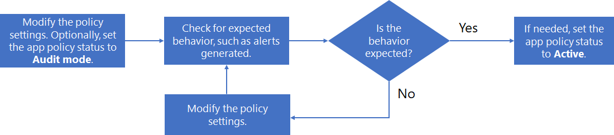

# 管理應用程式原則

>*[Microsoft 365 安全性與合規性的授權指引](https://aka.ms/ComplianceSD)。*

為了跟上組織正在使用的最新應用程式、回應新的應用程式型攻擊以及應對應用程式合規性需求的持續變更，您可能需要透過以下方式管理您的應用程式原則：

- 建立針對新應用程式的新原則
- 變更現有原則的狀態 (使用中、非使用中、稽核模式)
- 變更現有原則的條件
- 變更現有原則的動作，以自動補救警示

以下是管理現有原則的程序範例：

1. 編輯原則：

  - 變更原則的設定。
  - 如有必要，將狀態變更為 **[稽核模式]** 以進行測試。

2. 檢查預期的行為，例如產生的警示。
1. 如果這是非預期的行為，請回到步驟 1。
1. 如果這是預期的行為，請編輯該原則，並將其狀態變更為使用中 (如果需要)。

## 編輯應用程式原則設定

若要變更現有應用程式原則的設定：

- 在原則清單中選取原則，然後選取應用程式原則窗格上的 **[編輯]**。
- 在清單中選取原則的垂直省略號，然後選取 **[編輯]**。

在 **[編輯原則]** 頁面，請逐步瀏覽頁面，然後進行適當的變更：

- **描述**：變更描述，以便更容易了解此原則的用途。
- **嚴重性**
- **原則設定**： 變更要套用原則的應用程式集。 您也可以選擇使用現有條件或修改條件
- **動作**：變更由該原則產生之警示的自動補救動作。
- **狀態**：變更原則狀態。

## 刪除應用程式原則

若要刪除應用程式原則，您可以：

- 在原則清單中選取原則，然後選取應用程式原則窗格上的 **[刪除]**。
- 在清單中選取原則的垂直省略號，然後選取 **[刪除]**。

刪除應用程式原則的替代方法是將其狀態變更為非使用中。 處於非使用中後，它將不會產生警示。 例如，與其刪除具有一組對未來原則有用之特定條件的應用程式的應用程式原則，不如重命名應用程式原則，以表明其有用性並將其狀態設定為非使用中。 您可以稍後返回到該原則並針對類似應用程式修改該原則，並將其狀態設定為稽核模式或非使用中狀態。
