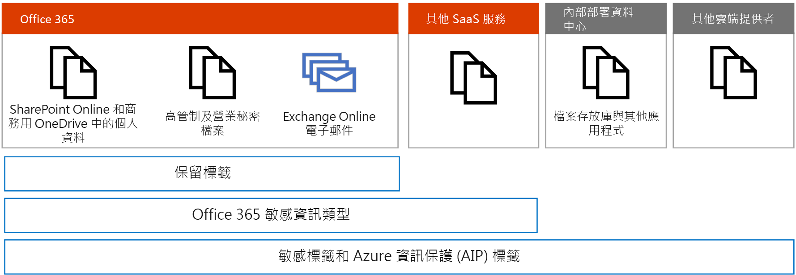
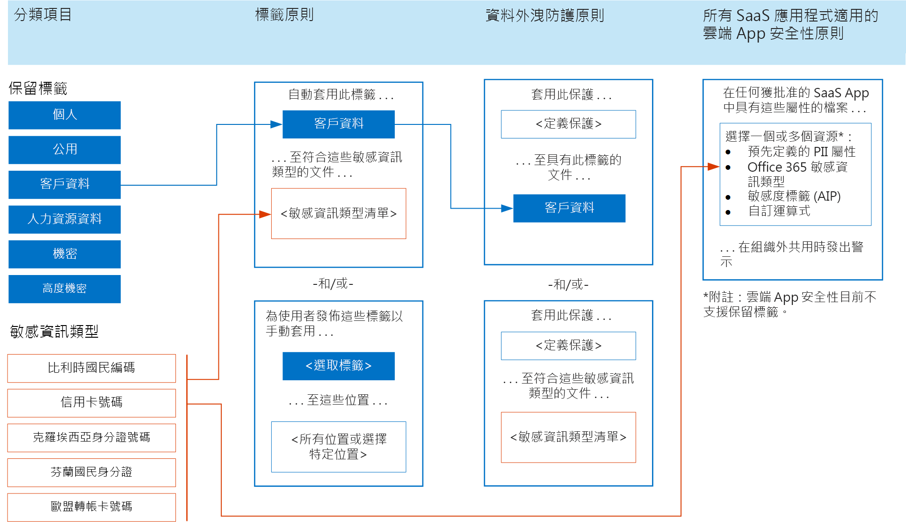
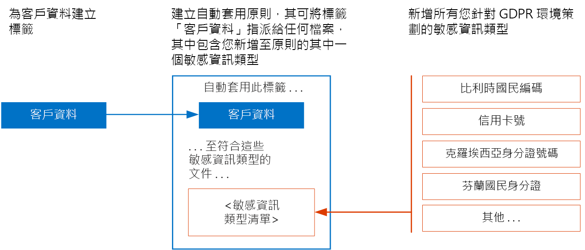

# 將標籤套用至個人資料Apply labels to personal data

 如果您使用分類標籤做為 GDPR 保護計劃的一部分，請使用本主題。Use this topic if you're using classification labels as part of your GDPR protection plan. 

如果您使用標籤來保護 Microsoft 365 中的個人資料，Microsoft 建議從使用[保留標籤](retention.md#retention-labels)開始。If you're using labels for protection of personal data in Microsoft 365, Microsoft recommends you start with [retention labels](retention.md#retention-labels). 使用保留標籤，您可以：With retention labels, you can:
- 使用「進階資料控管」，根據敏感性資訊類型或其他準則自動套用標籤。Use Advanced Data Governance to automatically apply labels based on sensitive information types or other criteria.
- 使用保留標籤搭配資料外洩防護來套用保護。Use retention labels with data loss prevention to apply protection. 
- 使用標籤搭配電子文件探索和內容搜尋。Use labels with eDiscovery and Content Search. 

雲端 App 安全性目前不支援保留標籤，但是您可以使用 Microsoft 365 敏感資訊類型搭配雲端 App 安全性，監視位於其他 SaaS 應用程式中的個人資料。Cloud App Security doesn't currently support retention labels, but you can use Microsoft 365 sensitive information types with Cloud App Security to monitor personal data that resides in other SaaS apps.

目前建議使用[敏感度標籤](sensitivity-labels.md)，將標籤套用至內部部署與其他雲端服務和提供者中的檔案。[Sensitivity labels](sensitivity-labels.md) are currently recommended for applying labels to files on premises and in other cloud services and providers. 也有對於 Microsoft 365 中需要使用 Azure 資訊保護加密進行資料保護的檔案 (例如商業秘密檔案) 所建議的事項。These are also recommended for files in Microsoft 365 that require Azure Information Protection encryption for data protection, such as trade secret files.

目前，對於 Microsoft 365 中具有、受限於 GDPR 資料的檔案，不建議使用 Azure 資訊保護來套用加密。At this time, using Azure Information Protection to apply encryption is not recommended for files in Microsoft 365 with data that is subject to the GDPR. Microsoft 365 服務目前無法讀取使用 AIP 加密的檔案。Microsoft 365 services currently cannot read into AIP-encrypted files. 因此，服務找不到這些檔案中的敏感資料。Therefore, the service can't find sensitive data in these files.

您可對 Exchange Online 中的郵件套用保留標籤，而這些標籤可搭配 Microsoft 365 資料外洩防護使用。Retention labels can be applied to mail in Exchange Online and these labels work with Microsoft 365 data loss prevention. 

在此圖例中：In the illustration:

-   將保留標籤用於個人資料，以及 SharePoint Online 和商務用 OneDrive 中高度管制的商業機密檔案。Use retention labels for personal data and for highly regulated and trade secret files in SharePoint Online and OneDrive for Business.
-   Microsoft 365 敏感資訊類型可以用於 Microsoft 365 之中，也可以搭配雲端 App 安全性，監視位於其他 SaaS 應用程式中的個人資料。Microsoft 365 sensitive information types can be used within Microsoft 365 and with Cloud App Security to monitor personal data that resides in other SaaS apps.
-   將敏感度標籤用於高度管制的商業機密檔案、Exchange Online 電子郵件、其他 SaaS 服務中的檔案、內部部署資料中心中的檔案，以及其他雲端提供者中的檔案。Use sensitivity labels for highly regulated and trade secret files, Exchange Online email, files in other SaaS services, files in on-premises datacenters, and files in other cloud providers.

## 在 Microsoft 365 間使用保留標籤和敏感性資訊類型以保護資訊Use retention labels and sensitive information types across Microsoft 365 for information protection

下圖顯示如何在標籤原則、資料外洩防護原則，以及搭配雲端 App 安全性原則使用保留標籤和敏感性資訊類型。The following illustration shows how retention labels and sensitive information types can be used in label policies, data loss prevention policies, and with Cloud App Security policies.

為了便於存取，下表會在圖例中提供相同的範例。For accessibility, the following table provides the same examples in the illustration.

<table>
<thead>
<tr class="header">
<th align="left"><strong>分類元素</strong><strong>Classification elements</strong></th>
<th align="left"><strong>標籤原則 — 2 個範例</strong><strong>Label policies — 2 examples</strong></th>
<th align="left"><strong>資料外洩防護原則 — 2 個範例</strong><strong>Data loss prevention policies — 2 examples</strong></th>
<th align="left"><strong>所有 SaaS 應用程式的雲端 App 安全性原則 — 1 個範例</strong><strong>Cloud App Security policies for all SaaS apps — 1 example</strong></th>
</tr>
</thead>
<tbody>
<tr class="odd">
<td align="left">保留標籤。Retention labels. 範例：個人、公用、客戶資料、HR 資料、機密、高度機密Examples: Personal, Public, Customer data, HR data, Confidential, Highly confidential</td>
<td align="left">
自動套用此標籤 . . .Auto apply this label . . .

客戶資料Customer data

. . . 至符合這些敏感資訊類型的文件 . . .. . . to documents that match these sensitive information types . . .

&lt;敏感資訊類型範例的清單&gt;&lt;list of example sensitive information types&gt;
</td>
<td align="left">
套用此保護 . . .Apply this protection . . .

&lt;定義保護&gt;&lt;define protection&gt;

. . . 至具有此標籤的文件 . . .. . . to documents with this label . . .

客戶資料Customer data
</td>
<td align="left">
在任何獲批准的 SaaS App 中具有這些屬性的檔案 . . .Alert when files with these attributes . . .

選擇一或多個屬性：預先定義的 PII 屬性、Microsoft 365 敏感資訊類型、敏感度標籤 (AIP)、自訂運算式Choose one or more attributes: predefined PII attribute, Microsoft 365 sensitive information type, sensitivity label (AIP), custom expression

。. 。. 。. 在組織外共用時發出警示in any sanctioned SaaS app are shared outside the organization

附註：雲端 App 安全性目前不支援保留標籤。Note: Retention labels are currently not supported in Cloud App Security.</td>
</tr>
<tr class="even">
<td align="left">敏感資訊類型範例：比利時國民編碼、信用卡號碼、克羅埃西亞身分證號碼、芬蘭國民身分證Sensitive information types. Examples: Belgium National Number, Credit Card Number, Croatia Identity Cart Number, Finland National ID</td>
<td align="left">
發佈這些使用者的這些標籤以手動套用 . . .Publish these labels for users to manually apply . . .

&lt;選取標籤&gt;&lt;select labels&gt;

. . . 至這些位置 . . .. . . to these locations . . .

&lt;所有位置或選擇特定位置&gt;&lt;all locations or choose specific locations&gt;
</td>
<td align="left">
套用此保護 . . .Apply this protection . . .

&lt;定義保護&gt;&lt;define protection&gt;

. . . 至符合這些敏感資訊類型的文件&gt;. . . to documents that match these sensitive information types&gt;
</td>
<td align="left"></td>
</tr>
</tbody>
</table>

## 指定自動套用標籤原則的優先順序Prioritize auto-apply label policies

對於受到 GDPR 約束的個人資料，Microsoft 建議利用您為環境策劃的敏感資訊類型來自動套用標籤。請務必妥善地設計並測試自動套用標籤原則，以確保發生預期的行為。For personal data that is subject to GDPR, Microsoft recommends auto-applying labels by using the sensitive information types you curated for your environment. It is important that auto-apply label policies are well designed and tested to ensure the intended behavior occurs.

建立自動套用原則的順序，以及使用者是否也套用這些標籤會影響結果。因此，請務必仔細做好推出計劃。以下是須知事項。The order that auto-apply policies are created and whether users are also applying these labels affect the result. So, it's important to carefully plan the roll-out. Here's what you need to know.

### 一次一個標籤One label at a time

您只能將一個標籤指派給一個文件。You can only assign one label to a document.

### 越舊的自動套用原則越優先採用Older auto-apply policies win

如果有多個指派自動套用標籤的項規，且內容符合多個規則的條件，則會指派最舊規則的標籤。基於這個原因，請務必審慎規劃標籤原則，然後再設定它們。如果組織要求變更標籤原則的優先順序，您需要先刪除它們，然後重新建立。If there are multiple rules that assign an auto-apply label and content meets the conditions of multiple rules, the label for the oldest rule is assigned. For this reason, it's important to plan the label policies carefully before configuring them. If an organization requires a change to the priority of the label policies, they'll need to delete and recreate them.

### 手動使用者套用標籤優先於自動套用標籤Manual user-applied labels trump auto-applied labels

手動使用者套用標籤優先於自動套用標籤。自動套用原則無法取代已由使用者套用的標籤。使用者可以取代自動套用的標籤。Manual user applied labels trump auto-applied labels. Auto-apply policies can't replace a label that is already applied by a user. Users can replace labels that are auto-applied.

### 可以更新自動指派的標籤Auto-assigned labels can be updated

更新的標籤原則或現有原則的更新，可以更新自動指派的標籤。Auto-assigned labels can be updated by either newer label policies or by updates to existing policies.

請確定實作標籤的計劃包括：Be sure your plan for implementing labels includes:

- 指定建立自動套用原則的優先順序。Prioritizing the order that auto-apply policies are created.

- 在推出標籤供使用者手動套用之前，允許有足夠的時間自動套用這些標籤。最多可能需要 7 天，標籤才會套用至符合條件的所有內容。Allowing enough time for labels to be automatically applied before rolling these out for users to manually apply. It can take up to seven days for the labels to be applied to all content that matches the conditions.

### 建立自動套用原則的優先順序範例Example priority for creating the auto-apply policies

<table>
<thead>
<tr class="header">
<th align="left"><strong>標籤</strong><strong>Labels</strong></th>
<th align="left"><strong>建立自動套用原則的優先順序</strong><strong>Priority order to create auto-apply policies</strong></th>
</tr>
</thead>
<tbody>
<tr class="odd">
<td align="left">人力資源 — 員工資料Human Resources — Employee Data</td>
<td align="left">11</td>
</tr>
<tr class="even">
<td align="left">客戶資料Customer Data</td>
<td align="left">22</td>
</tr>
<tr class="odd">
<td align="left">高度機密Highly Confidential</td>
<td align="left">33</td>
</tr>
<tr class="even">
<td align="left">人力資源 — 薪資資料Human Resources — Salary Data</td>
<td align="left">44</td>
</tr>
<tr class="odd">
<td align="left">機密Confidential</td>
<td align="left">55</td>
</tr>
<tr class="even">
<td align="left">公開Public</td>
<td align="left">66</td>
</tr>
<tr class="odd">
<td align="left">個人Personal</td>
<td align="left">沒有自動套用原則No auto-apply policy</td>
</tr>
</tbody>
</table>

## 建立標籤和自動套用標籤原則Create labels and auto-apply label policies

在安全性中心或合規性中心中建立標籤和原則。Create labels and policies in the security center or the compliance center.

<table>
<thead>
<tr class="header">
<th align="left"><strong>步驟</strong><strong>Step</strong></th>
<th align="left"><strong>描述</strong><strong>Description</strong></th>
</tr>
</thead>
<tbody>
<tr class="odd">
<td align="left">
將權限授與規範小組的成員。Give permissions to members of your compliance team.
</td>
<td align="left">
要建立標籤的合規性小組成員需有使用安全性中心和/或合規性中心的權限。請移至安全性中心或合規性中心的 [權限]，然後修改合規性系統管理員群組的成員。Members of your compliance team who will create labels need permissions to use the security center and/or the compliance center. Go to Permissions in the security center or the compliance center and modify the members of the Compliance Administrator group.

請參閱<a href="https://docs.microsoft.com/microsoft-365/security/office-365-security/grant-access-to-the-security-and-compliance-center">讓使用者能夠存取安全性中心和/或合規性中心</a>。See <a href="https://docs.microsoft.com/microsoft-365/security/office-365-security/grant-access-to-the-security-and-compliance-center">Give users access to the security center and/or the compliance center</a>.
</td>
</tr>
<tr class="even">
<td align="left">
建立保留標籤。Create retention labels.
</td>
<td align="left">移至安全性中心或合規性中心中的 [分類]，選擇 [保留] 標籤，然後建立適用於您環境的標籤。Go to Classifications in the Security center or the Compliance center, choose Retention labels, and create the labels for your environment.</td>
</tr>
<tr class="odd">
<td align="left">
建立標籤的自動套用原則。Create auto-apply policies for labels.
</td>
<td align="left">移至安全性中心或合規性中心中的 [分類]，選擇 [標籤原則]，然後建立自動套用標籤的原則。請務必依優先順序建立這些原則。Go to Classification in security center or the compliance center, choose Label policies, and create the policies for auto-applying labels. Be sure to create these policies in the prioritized order.</td>
</tr>
</tbody>
</table>

下圖顯示如何為客戶資料標籤建立自動套用標籤。The following illustration shows how to create an auto-apply label for the Customer data label.

在此圖例中：In the illustration:

- 已建立「客戶資料」標籤。The "Customer data" label is created.

- 已列出所需的敏感資訊類型範例：比利時國民編碼、信用卡號碼、克羅埃西亞身分證號碼、芬蘭國民身分證The desired sensitive information types for GDPR are listed: Belgium National Number, Credit Card Number, Croatia Identity Card Number, Finland National ID.

- 建立自動套用原則可將標籤「客戶資料」指派給任何檔案，其中包含您新增至原則的其中一個敏感資訊類型。Create an auto-apply policy assigns the label "Customer data" to any file that includes one of the sensitive information types that you add to the policy.
