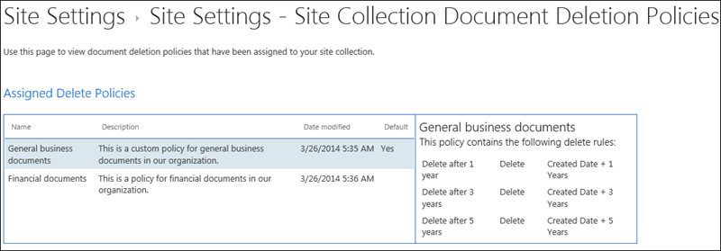

# 套用或移除網站的文件刪除原則Apply or remove a document deletion policy for a site

組織通常會受到法規遵從性、法律或其他法規的制約，這些法規要求他們在特定的一段時間內保留檔。Organizations are often subject to compliance, legal, or other regulations that require them to retain documents for a certain period of time. 但是，將文件保留超過要求時間，可能會讓組織暴露在法律風險下。However, retaining documents for longer than required can expose the organization to legal risk. 因此，您的組織可能已為網站&mdash;建立檔刪除原則例如，在建立一般商務檔後，可能需要將其刪除五年。For this reason, your organization may have created a document deletion policy for your site&mdash;for example, general business documents might be required to be deleted five years after they were created.
  
視您的組織而定，檔刪除原則可能是：Depending on your organization, a document deletion policy might be:
  
- **強制**網站擁有者無法選擇不需要的強制原則，這會自動套用至網站。**Mandatory** A site owner can't opt out of a mandatory policy, which is automatically applied to the site. 
    
- **預設值**預設原則會自動套用至網站，但網站擁有者可以：**Default** A default policy is automatically applied to a site, but a site owner can: 
    
  - 選擇另一個原則（如果有的話）。Choose another policy if available.
    
  - 若未與網站內容相關，請將原則完全取消選擇。Opt out of the policy entirely if it isn't relevant to the content in the site.
    
- **不是強制或預設**在此情況下，不會將任何原則套用至網站，網站擁有人必須採取行動才能套用。**Neither mandatory nor default** In this case, no policy is automatically applied to the site, and the site owner needs to take action to apply one. 
    
檔刪除原則可以包含一個以上的規則&mdash;。例如，一個規則可能會在建立檔一年後將其刪除一年，但另一個規則可能會指出刪除檔的最後一年修改。A document deletion policy may contain more than one rule&mdash;for example, one rule might say delete documents one year after they were created, but another rule might say delete documents one year after they were last modified. 若原則包含一個以上的規則，您可以選取最適合您網站的規則。If a policy contains more than one rule, you can select the rule that best applies to your site. 刪除規則會套用至網站中的所有文件庫。The delete rule will be applied to all libraries within the site. 在網站中，一次只能有一個原則和一個規則可供使用。Only one policy and one rule can be active in a site at one time. 與原則類似的是，規則可以設定為預設值，以便在套用原則時自動套用。Like a policy, a rule can be set as default, so that it's applied automatically when the policy is applied.
  
最後，會繼承檔刪除原則。Finally, document deletion policies are inherited. 當您為網站選取原則或規則時，所有子網站會繼承該選取範圍，雖然子網站的擁有者可以透過選取其他原則或規則來中斷繼承。When you select a policy or rule for your site, that selection is inherited by all subsites, although an owner of a subsite can break inheritance by selecting a different policy or rule. 當您選取原則或規則時，請考慮網站底下任何子網站的內容。When you select a policy or rule, consider the content of any subsites below your site.
  
## 查看網站集合中可用的檔刪除原則View the document deletion policies available in a site collection

您的組織可以指派不同的原則給不同的網站集合。Your organization may assign different policies to different site collections. 在網站集合層級，網站集合的擁有者可以查看該網站集合可使用的所有檔刪除原則。At the site collection level, an owner of a site collection can view all of the document deletion policies that are available to that site collection. 這些原則可能已提供給網站集合範本（因而由此範本所建立的所有網站集合）或此特定的網站集合。The policies may have been made available to the site collection template (and therefore all site collections created from this template) or to this specific site collection.
  
1. 在網站集合的最上層網站中，選擇右上角的 [**設定**] [齒輪圖示] [ \> **網站設定**]。In the top-level site in the site collection, in the upper-right corner, choose **Settings** [gear icon] \> **Site Settings**.
    
2. 在 [**網站集合管理** \> **檔刪除原則**] 底下。Under **Site Collection Administration** \> **Document Deletion Policies**.
    
    > [!NOTE]
    > 只有在原則指派至網站集合後，才會出現 **[文件刪除原則]** 連結。The **Document Deletion Policies** link won't appear unless policies have been assigned to the site collection. 此外，在將原則指派給網站後，連結不會立即顯示出來，當 [**檔刪除原則**] 連結出現時，它最多可能需要24小時的時間。Also, the link doesn't appear immediately after policies have been assigned to the site — it can take up to 24 hours from when the policies are assigned to when the **Document Deletion Policies** link appears. 
  
3. 您可以在此頁面上查看：On this page you can view:
    
  - 目前指派的原則及相關聯的規則。The currently assigned policies and the associated rules. 選取原則，以在右窗格中查看規則。Select a policy to view the rules in the right pane.
    
  - 預設原則（如果有的話）會在 [**預設**] 欄中顯示 **[是]** 。The default policy, if any, displays **Yes** in the **Default** column. 
    
  - 若原則指派為**強制**，郵件會顯示在清單下方。A message is displayed below the list if the policy has been assigned as **Mandatory**.
    
此清單僅供查看，供網站集合擁有人查看所有可用的原則和規則。This list is view only, for the site collection owner to see all of the available policies and rules. 若要套用原則，請參閱下一節。To apply a policy, see the next section.
  

  
## 套用或移除網站的文件刪除原則Apply or remove a document deletion policy for a site

網站擁有人或網站集合擁有者，您的組織可能已建立原則，您可以將其套用至您的網站，也可以選擇不完全使用。As a site owner or site collection owner, your organization may have created policies that you can either apply to your site or opt out of entirely.
  
1. 在右上角，選擇 [**設定**] [齒輪圖示] [ \> **網站設定**]。In the upper-right corner, choose **Settings** [gear icon] \> **Site Settings**.
    
2. 在 [**網站管理** \> **檔刪除原則**] 底下。Under **Site Administration** \> **Document Deletion Policies**.
    
    > [!NOTE]
    > 只有在原則指派至網站集合後，才會出現 **[文件刪除原則]** 連結。The **Document Deletion Policies** link won't appear unless policies have been assigned to the site collection. 此外，在將原則指派給網站後，連結不會立即顯示出來，當 [**檔刪除原則**] 連結出現時，它最多可能需要24小時的時間。Also, the link doesn't appear immediately after policies have been assigned to the site — it can take up to 24 hours from when the policies are assigned to when the **Document Deletion Policies** link appears. 
  
3. 執行下列其中一項動作：Do one of the following:
    
  - 套用**原則**選取原則\> ：在 [ \> **儲存**原則] 中選取規則。**To apply a policy** Select a policy \> select a rule in that policy \> **Save**.
    
    在網站中，一次只能有一個原則和一個規則可供使用。Only one policy and one rule can be active in a site at one time. 您的組織可能會提供數個原則和規則，以供選擇，或僅有一個原則或規則。Your organization may provide several policies and rules to choose from, or only one policy or rule.
    
    
  
  - **若要選擇不使用原則**選擇 [**自願注意：待辦事項請刪除** \> **儲存**]。**To opt out of a policy** Choose **Opt-Out: Do Note Delete** \> **Save**.
    
    網站擁有者若您決定原則不適用於網站內容，您可以退出宣告檔刪除原則。As a site owner, you can opt out of a document deletion policy if you determine that the policy isn't applicable to the content in your site. 不過，您無法選擇已標記為**強制**的原則。However, you can't opt out of a policy that has been marked as **Mandatory**.
    
    
  
## 檔刪除原則會覆寫其他原則Document deletion policies override other policies

網站可以使用其他原則來保留和刪除內容：A site may use other policies for retaining and deleting content:
  
- 網站集合的內容類型原則。Content type policies for the site collection.
    
- 清單或文件庫的資訊管理原則。Information management policies for a list or library.
    
如果您將文件刪除原則套用至已對清單或文件庫使用內容類型原則或資訊管理原則的站台，這些原則將會被忽略，而文件刪除原則會有效用。If you apply a document deletion policy to a site that already uses content type policies or information management policies for a list or library, those policies are ignored while the document deletion policy is in effect. 如果忽略其他原則，您會看到 [此網站上的內容使用檔刪除原則] 的訊息。If other policies are ignored, you'll see the message "Content on this site uses Document Deletion Policies".
  
這表示您應該規劃網站只使用結構化內容（資訊管理原則和內容類型原則）或非結構化內容（檔刪除原則）的原則，而不是兩者同時使用。This means you should plan for a site to use only policies meant for structured content (information management policies and content type policies) or unstructured content (document deletion policies), not both. 如果您退出宣告檔刪除原則，將不會顯示警告，其他類型的原則也會繼續運作。If you opt out of a document deletion policy, the warning won't be displayed and other types of policies will continue to work.
  
網站原則不會受到檔刪除原則的影響。Site policies are not affected by document deletion policies.
  
### 決定是否要忽略內容類型原則Determine if content type policies are being ignored

如果您的網站使用內容類型原則，而您現在看到此訊息，這些原則將不再有效。If your site was using content type policies and you now see this message, those policies are no longer in effect. 若要還原內容類型原則，您可以從網站移除檔刪除原則（如前文所述），如果有可用的自願退出選項。To restore the content type policies, you can remove the document deletion policy from your site, as described earlier, if there's an opt-out option available. 如果沒有任何選項可供選擇，則檔刪除原則是必要的，而且您必須與組織中的合規性監察官聯繫。If there's no option to opt out, the document deletion policy is mandatory, and you need to contact the compliance officer in your organization.
  
1. 在右上角，選擇 [**設定**] [齒輪圖示] [ \> **網站設定**]。In the upper-right corner, choose **Settings** [gear icon] \> **Site Settings**.
    
2. 在 [**網站管理** \> **內容類型原則範本**] 底下。Under **Site Administration** \> **Content Type Policy Templates**.
    
    
  
### 決定是否要忽略資訊管理原則Determine if information management policies are being ignored

如果您的網站使用資訊管理原則，而且現在看到此訊息，則這些原則將不再有效。If your site was using information management policies and you now see this message, those policies are no longer in effect. 若要還原資訊管理原則，您可以從網站移除檔刪除原則（如前文所述），如果有可用的自願退出選項。To restore the information management policies, you can remove the document deletion policy from your site, as described earlier, if there's an opt-out option available. 如果沒有任何選項可供選擇，則檔刪除原則是必要的，而且您必須與組織中的合規性監察官聯繫。If there's no option to opt out, the document deletion policy is mandatory, and you need to contact the compliance officer in your organization.
  
- 若為清單或文件庫，請在\> [**許可權與管理** \> **資訊管理原則設定**] 底下的 [功能區**庫**] \>索引標籤**庫設定** \> 。For a list or library, on the Ribbon \> **Library** tab \> **Library Settings** \> under **Permissions and Management** \> **Information Management Policy Settings**.
    
    
  
## 另請參閱See also

[文件刪除原則概觀Overview of document deletion policies](document-deletion-policies.md)
  
[建立文件刪除原則Create a document deletion policy](create-a-document-deletion-policy.md)

