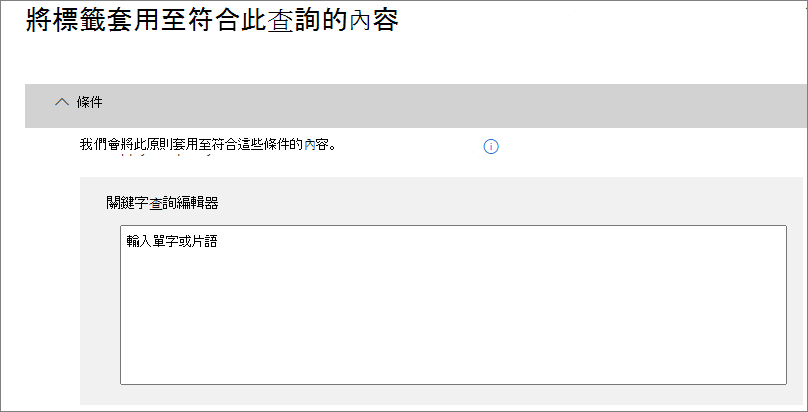

# 自動套用保留標籤來保留或刪除內容Automatically apply a retention label to retain or delete content

>*[Microsoft 365 安全性與合規性的授權指引](https://aka.ms/ComplianceSD)。**[Microsoft 365 licensing guidance for security & compliance](https://aka.ms/ComplianceSD).*

[保留標籤](retention.md) 最實用的功能之一，是將標籤自動套用至符合特定條件的內容。One of the most powerful features of [retention labels](retention.md) is the ability to apply them automatically to content that matches specified conditions. 在此情況下，貴組織中的人員不必親自套用保留標籤。In this case, people in your organization don't need to apply the retention labels. Microsoft 365 會執行這些動作。Microsoft 365 does the work for them.
  
自動套用保留標籤很強大是因為：Auto-applying retention labels are powerful because:
  
- 您不需要訓練您的使用者記下所有分類。You don't need to train your users on all of your classifications.
    
- 您不需要仰賴使用者正確地將所有內容分類。You don't need to rely on users to classify all content correctly.
    
- 使用者不再需要了解資料控管原則，他們可以專心工作。Users no longer need to know about data governance policies - they can focus on their work.
    
當該內容包含敏感資訊、關鍵字或 [可訓練分類器](classifier-getting-started-with.md) 的匹配項目時，您可以自動套用保留標籤到內容上。You can apply retention labels to content automatically when that content contains sensitive information, keywords, or a match for [trainable classifiers](classifier-getting-started-with.md).
    
根據下列條件自動套用保留標籤的程式：The processes to automatically apply a retention label based on these conditions:

使用下列指示執行兩個系統管理員步驟。Use the following instructions for the two admin steps.

> [!NOTE]
> 自動原則會使用條件的服務端標籤來自動套用保留標籤。Auto-policies use service-side labeling with conditions to automatically apply retention labels. 當您執行下列動作時，您也可以使用標籤原則以自動套用保留標籤：You can also automatically apply a retention label with a label policy when you do the following: 
>
> - 將預設保留標籤套用至 SharePoint 文件庫、資料夾或檔組，讓該容器中未標記的內容自動加上標籤Apply a default retention label to a SharePoint library, folder, or document set so that unlabeled content in that container is automatically labeled
>- 使用規則將保留標籤自動套用至電子郵件Automatically applying a retention label to email by using rules
>
> 在這些情況下，請參閱 [在應用程式中建立集套用保留標籤](create-apply-retention-labels.md)。For these scenarios, see [Create and apply retention labels in apps](create-apply-retention-labels.md).

## 開始之前Before you begin

您組織中的全域系統管理員擁有建立及管理保留標籤及其原則的完整權限。The global admin for your organization has full permissions to create and edit retention labels and their policies. 如果您未以全域系統管理員身分登入，請參閱[建立和管理保留標籤所需權限](get-started-with-retention.md#permissions-required-to-create-and-manage-retention-policies-and-retention-labels)。If you aren't signing in as a global admin, see [Permissions required to create and manage retention policies and retention labels](get-started-with-retention.md#permissions-required-to-create-and-manage-retention-policies-and-retention-labels).

## 如何自動套用保留標籤How to auto-apply a retention label

首先，建立您自己的保留標籤。First, create your retention label. 然後建立自動原則來套用該標籤。Then create an auto-policy to apply that label. 如果您已經建立保留標籤，請跳至 [建立自動原則](#step-2-create-an-auto-apply-policy)。If you have already created your retention label, skip to [creating an auto-policy](#step-2-create-an-auto-apply-policy).

瀏覽指示取決於您使用的是否是 [記錄管理](records-management.md)。Navigation instructions depend on whether you're using [records management](records-management.md) or not. 以下提供這兩個案例的指示。Instructions are provided for both scenarios.

### 步驟1: 建立保留標籤。Step 1: Create a retention label

1. 在 [Microsoft 365 合規性中心](https://compliance.microsoft.com/)，瀏覽至下列其中一個位置：In the [Microsoft 365 compliance center](https://compliance.microsoft.com/), navigate to one of the following locations:
    
    - 如果您使用記錄管理：If you are using records management:
        - [解決方案]\*\*\*\*  >  [記錄管理]\*\*\*\*  >  [檔案計劃]\*\*\*\* 索引標籤 > [+ 建立標籤]\*\*\*\*  >  [保留標籤]\*\*\*\***Solutions** > **Records management** > **File plan** tab > **+ Create a label** > **Retention label**
        
    - 如果您未使用記錄管理：If you are not using records management:
       - [解決方案]\*\*\*\*  >  [資訊控管]\*\*\*\*  >  [標籤]\*\*\*\* 索引標籤 > [+ 建立標籤]\*\*\*\***Solutions** > **Information governance** > **Labels** tab > + **Create a label**
    
    沒有立即看到您的選項？Don't immediately see your option? 先選取 [顯示全部]\*\*\*\*。First select **Show all**. 

2. 遵循精靈中的提示進行。Follow the prompts in the wizard. 如果您使用記錄管理：If you are using records management:
    
    - 如需檔案計劃描述元的詳細資訊，請參閱[使用檔案計劃管理保留標籤](file-plan-manager.md)For information about the file plan descriptors, see [Use file plan to manage retention labels](file-plan-manager.md)
    
    - 若要使用保留標籤將內容宣告為記錄，請啟用 [使用標籤以將內容分類為「記錄」]\*\*\*\* 核取方塊。To use the retention label to declare content as a record, enable the checkbox **Use label to classify content as a "Record"**.

若要編輯現有的標籤，請選取它，然後選取 [編輯標籤]\*\*\*\* 以啟動相同的精靈讓您變更標籤描述和步驟 2 的任何[合格設定](#updating-retention-labels-and-their-policies)。To edit an existing label, select it, and then select **Edit label** to start the same wizard that lets you change the label descriptions and any [eligible settings](#updating-retention-labels-and-their-policies) from step 2. 或者，選取任何一個可用的 **[編輯]** 選項，直接移至相關頁面以進行更新。Alternatively, select any of the available **Edit** options to go directly to the relevant page to make your update.

### 步驟2：建立自動套用原則Step 2: Create an auto-apply policy

當您建立自動套用原則時，會根據您指定的條件，選取要自動套用至內容的保留標籤。When you create an auto-apply policy, you select a retention label to automatically apply to content, based on the conditions that you specify.

1. 在 [Microsoft 365 合規性中心](https://compliance.microsoft.com/)，瀏覽至下列其中一個位置：In the [Microsoft 365 compliance center](https://compliance.microsoft.com/), navigate to one of the following locations:
    
    - 如果您使用記錄管理：**資訊控管**：If you are using records management: **Information governance**:
        - [解決方案]\*\*\*\*  >  [記錄管理]\*\*\*\*  >  [標籤原則]\*\*\*\* 索引標籤 > [自動套用標籤]\*\*\*\***Solutions** > **Records management** > **Label policies** tab > **Auto-apply label**
    
    - 如果您未使用記錄管理：If you are not using records management:
        - [解決方案]\*\*\*\*  >  [資訊控管]\*\*\*\*  >  [標籤原則]\*\*\*\* 索引標籤 > [自動套用標籤]\*\*\*\***Solutions** > **Information governance** > **Label policies** tab > **Auto-apply label**
    
    沒有立即看到您的選項？Don't immediately see your option? 先選取 [顯示全部]\*\*\*\*。First select **Show all**. 

2. 遵循精靈中的提示進行。Follow the prompts in the wizard.
    
    如需有關設定會自動套用保留標籤之條件的詳細資訊，請參閱此頁面上的[設定自動套用保留標籤的條件](#configuring-conditions-for-auto-apply-retention-labels)一節。For information about configuring the conditions that automatically apply the retention label, see the [Configuring conditions for auto-apply retention labels](#configuring-conditions-for-auto-apply-retention-labels) section on this page.
    
    如需保留標籤支援的位置詳細資訊，請參閱[保留標籤和位置](retention.md#retention-label-policies-and-locations)一節。For information about the locations supported by retention labels, see the [Retention labels and locations](retention.md#retention-label-policies-and-locations) section.

若要編輯現有的自動套用標籤原則，請選取它，然後選取 [編輯原則]\*\*\*\* 以啟動相同的精靈讓您變更標籤描述和步驟 2 的任何[合格設定](#updating-retention-labels-and-their-policies)。To edit an existing auto-apply label policy, select it, and then select **Edit policy** to start the same wizard that lets you change the policy description and any [eligible settings](#updating-retention-labels-and-their-policies) from step 2. 或者，選取任何一個可用的 [編輯]\*\*\*\* 選項，直接移至相關頁面以進行更新。Alternatively, select any of the available **Edit** options to go directly to the relevant page to make your update.

### 設定自動套用保留標籤的條件Configuring conditions for auto-apply retention labels

您可以在內容包含以下資訊時，自動將保留標籤套用到內容：You can apply retention labels to content automatically when that content contains:

- [特定敏感資訊類型Specific types of sensitive information](#auto-apply-labels-to-content-with-specific-types-of-sensitive-information)

- [符合您所建立查詢的特定關鍵字Specific keywords that match a query you create](#auto-apply-labels-to-content-with-keywords-or-searchable-properties)

- [可訓練分類器的符合項目A match for trainable classifiers](#auto-apply-labels-to-content-by-using-trainable-classifiers)

#### 自動將標籤套用至包含特定類型敏感資訊的內容Auto-apply labels to content with specific types of sensitive information

當您為敏感性資訊建立自動套用保留標籤時，系統會顯示與建立資料外洩防護 (DLP) 原則時相同的原則範本清單。When you create auto-apply retention labels for sensitive information, you see the same list of policy templates as when you create a data loss prevention (DLP) policy. 每個原則範本預設會尋找特定類型的敏感性資訊。Each policy template is preconfigured to look for specific types of sensitive information. 例如本文顯示的範本會尋找美國 ITIN、SSN 和護照號碼。For example, the template shown here looks for U.S. ITIN, SSN, and passport numbers. 若要深入了解 DLP，請參閱[資料外洩防護原則概觀](data-loss-prevention-policies.md)。To learn more about DLP, see [Overview of data loss prevention policies](data-loss-prevention-policies.md).
  

  
選取原則範本後，可以新增或移除任何類型的敏感資訊，且可以變更例項計數和比對精確度。此處所示的範例中，只有符合以下條件時，才會自動套用保留標籤：After you select a policy template, you can add or remove any types of sensitive information, and you can change the instance count and match accuracy. In the example shown here, a retention label will be auto-applied only when:
  
- 內容包含 1 到 9 個下列三種敏感資訊類型。您可以刪除 \*\*max \*\* (上限) 值，條件就會變成 **any** (任何)。The content contains between 1 and 9 instances of any of these three sensitive information types. You can delete the **max** value so that it changes to **any**.
    
- 系統偵測到之機密資訊類型的比對精確度 (或信賴區間) 至少會有 75。The type of sensitive information that's detected has a match accuracy (or confidence level) of at least 75. 許多機密資訊類型是與多個合作夥伴所定義；比對精確度越高的模式需要更多證據 (例如關鍵字、日期或地址)，比對精確度越低的模式則需要較少證據。Many sensitive information types are defined with multiple patterns, where a pattern with a higher match accuracy requires more evidence to be found (such as keywords, dates, or addresses), while a pattern with a lower match accuracy requires less evidence. **最小**比對精確度越低，內容就越容易與條件相符。The lower the **min** match accuracy, the easier it is for content to match the condition. 
    
如需這些選項的詳細資訊，請參閱[調整規則，讓規則更容易或更難相符](data-loss-prevention-policies.md#tuning-rules-to-make-them-easier-or-harder-to-match)。For more information on these options, see [Tuning rules to make them easier or harder to match](data-loss-prevention-policies.md#tuning-rules-to-make-them-easier-or-harder-to-match).
    

  
#### 自動將標籤套用至包含關鍵字或可搜尋屬性的內容Auto-apply labels to content with keywords or searchable properties

您可以自動將標籤套用至符合特定條件的內容。現在可用的條件支援將標籤套用至包含特定字詞、片語或可搜尋屬性的值。您可以使用 AND、OR、NOT 等搜尋運算子來精簡查詢。You can auto-apply labels to content that satisfies certain conditions. The conditions now available support applying a label to content that contains specific words, phrases, or values of searchable properties. You can refine your query by using search operators like AND, OR, and NOT.

如需查詢語法的詳細資訊，請參閱：For more information on query syntax, see:

- [關鍵字查詢語言 (KQL) 語法參考Keyword Query Language (KQL) syntax reference](https://docs.microsoft.com/sharepoint/dev/general-development/keyword-query-language-kql-syntax-reference)

查詢式標籤使用搜尋索引來識別內容。如需有效可搜尋屬性的詳細資訊，請參閱：Query-based labels use the search index to identify content. For more information on valid searchable properties, see:

- [內容搜尋的關鍵字查詢與搜尋條件Keyword queries and search conditions for Content Search](keyword-queries-and-search-conditions.md)
- [SharePoint 伺服器中的編目及受控屬性概觀Overview of crawled and managed properties in SharePoint Server](https://docs.microsoft.com/SharePoint/technical-reference/crawled-and-managed-properties-overview)

範例查詢：Examples queries:

- ExchangeExchange
    - subject:"Quarterly Financials"subject:"Quarterly Financials"
    - recipients:garthfrecipients:garthf<!--nolink-->@contoso.com@contoso.com
- SharePoint 和 OneDriveSharePoint and OneDrive
    - contenttype:contractcontenttype:contract
    - site:httpssite:https<!--nolink-->://contoso.sharepoint.com/sites/teams/procurement AND contenttype:contract://contoso.sharepoint.com/sites/teams/procurement AND contenttype:contract

#### 使用可訓練分類器自動將標籤套用至內容Auto-apply labels to content by using trainable classifiers

選擇用於可訓練分類器的選項時，可以選取其中一個內建分類器或自訂分類器。When you choose the option for a trainable classifier, you can select one of the built-in classifiers, or a custom classifier. 內建分類器包括 [履歷]\*\*\*\*、[原始程式碼]\*\*\*\*、[針對性騷擾]\*\*\*\*、[粗話]\*\*\*\* 和 [威脅]\*\*\*\*：The built-in classifiers include **Resumes**, **SourceCode**, **Targeted Harassment**, **Profanity**, and **Threat**:

> [!CAUTION]
> 我們正在淘汰 [粗穢言語]\*\*\*\* 內建分類器，因為這個分類器產生了大量的誤報。We are deprecating the **Offensive Language** built-in classifier because it has been producing a high number of false positives. 請不要使用這個內建分類器，如果您目前正在使用此分類器，請將您的商務流程移開。Don't use this built-in classifier and if you are currently using it, you should move your business processes off it. 建議您改用 [針對性騷擾]\*\*\*\*、[粗話]\*\*\*\* 和 [威脅]\*\*\*\* 內建分類器。We recommend using the **Targeted Harassment**, **Profanity**, and **Threat** built-in classifiers instead.

若要使用此選項自動套用標籤，SharePoint Online 網站和信箱必須有至少 10 MB 的資料。To automatically apply a label by using this option, SharePoint Online sites and mailboxes must have at least 10 MB of data.

如需有關可訓練分類器的詳細資訊，請參閱[開始使用可訓練分類器 (預覽)](classifier-getting-started-with.md)。For more information about trainable classifiers, see [Getting started with trainable classifiers (preview)](classifier-getting-started-with.md).

如需組態範例，請參閱[如何準備及使用內建分類器](classifier-using-a-ready-to-use-classifier.md#how-to-verify-that-a-built-in-classifier-will-meet-your-needs)。For an example configuration, see [How to prepare for and use a built-in classifier](classifier-using-a-ready-to-use-classifier.md#how-to-verify-that-a-built-in-classifier-will-meet-your-needs).

## 保留標籤要多久才會生效How long it takes for retention labels to take effect

當您自動套用保留標籤，可能需要最多 7 天，保留標籤才會套用至符合條件的所有現有內容。When you auto-apply retention labels, it can take up to seven days for the retention labels to be applied to all existing content that matches the conditions.
  

  
## 更新保留標籤及其原則Updating retention labels and their policies

當您編輯保留標籤或自動套用原則，且保留標籤已套用至內容時，除了新識別的內容以外，您更新的設定會自動套用到此內容。When you edit a retention label or auto-apply policy, and the retention label is already applied to content, your updated settings will automatically be applied to this content in addition to content that's newly identified.

在建立及儲存標籤或原則之後，部分設定無法變更，其中包括：Some settings can't be changed after the label or policy is created and saved, which include:
- 保留期間以外的保留設定，除非您已將標籤設定為根據建立時間來保留或刪除內容。The retention settings except the retention period, unless you've configured the label to retain or delete the content based on when it was created.
- 分類為記錄的選項。The option to classify as a record.

## 後續步驟Next steps

請考慮以另一種自動化形式使用保留標籤，[事件導向保留](event-driven-retention.md)。Consider using retention labels with another form of automation, [event-driven retention](event-driven-retention.md). 當您使用此設定時，保留的開始是由您識別的事件觸發。When you use this configuration, the start of retention is triggered by an event that you identify. 您可以使用自動原則或標籤原則來執行事件導向保留。You can use event-driven retention with an auto-policy or a label policy.

請參閱[管理具有保留標籤之 SharePoint 文件的生命週期](auto-apply-retention-labels-scenario.md)，以了解使用 SharePoint 中受管理屬性來自動套用保留標籤和實作事件導向保留的詳細案例。See [Manage the lifecycle of SharePoint documents with retention labels](auto-apply-retention-labels-scenario.md) for a detailed scenario about using managed properties in SharePoint to auto-apply retention labels and implement event-driven retention.