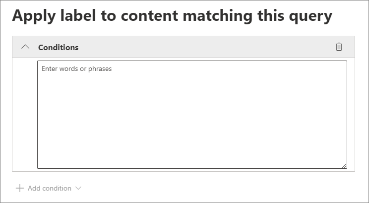

# 自動套用保留標籤來保留或刪除內容

>*[Microsoft 365 安全性與合規性的授權指引](https://aka.ms/ComplianceSD)。*

[保留標籤](retention.md) 最實用的功能之一，是將標籤自動套用至符合特定條件的內容。 在此情況下，貴組織中的人員不必親自套用保留標籤。 Microsoft 365 會執行這些動作。
  
自動套用保留標籤很強大是因為：
  
- 您不需要訓練您的使用者記下所有分類。
    
- 您不需要仰賴使用者正確地將所有內容分類。
    
- 使用者不再需要了解資料控管原則，他們可以專心工作。
    
當內容包含敏感性資訊、關鍵字或[可訓練分類器](classifier-get-started-with.md)的相符項目時，您可以自動對該內容套用保留標籤。

根據下列條件自動套用保留標籤的程式：

使用下列指示執行兩個系統管理員步驟。

> [!NOTE]
> 自動原則會使用條件的服務端標籤來自動套用保留標籤。 當您執行下列動作時，您也可以使用標籤原則以自動套用保留標籤： 
>
> - 將預設保留標籤套用至 SharePoint 文件庫、資料夾或檔組，讓該容器中未標記的內容自動加上標籤
>- 使用規則將保留標籤自動套用至電子郵件
>
> 在這些情況下，請參閱 [在應用程式中建立集套用保留標籤](create-apply-retention-labels.md)。

## 開始之前

您組織中的全域系統管理員擁有建立及管理保留標籤及其原則的完整權限。 如果您未以全域系統管理員身分登入，請參閱[建立和管理保留標籤所需權限](get-started-with-retention.md#permissions-required-to-create-and-manage-retention-policies-and-retention-labels)。

## 如何自動套用保留標籤

首先，建立您自己的保留標籤。 然後建立自動原則來套用該標籤。 如果您已經建立保留標籤，請跳至 [建立自動原則](#step-2-create-an-auto-apply-policy)。

瀏覽指示取決於您使用的是否是 [記錄管理](records-management.md)。 以下提供這兩個案例的指示。

### 步驟1: 建立保留標籤。

1. 在 [Microsoft 365 合規性中心](https://compliance.microsoft.com/)，瀏覽至下列其中一個位置：
    
    - 如果您使用記錄管理：
        - [解決方案]****  >  [記錄管理]****  >  [檔案計劃]**** 索引標籤 > [+ 建立標籤]****  >  [保留標籤]****
        
    - 如果您未使用記錄管理：
       - [解決方案]****  >  [資訊控管]****  >  [標籤]**** 索引標籤 > [+ 建立標籤]****
    
    沒有立即看到您的選項？ 先選取 [顯示全部]****。 

2. 遵循精靈中的提示進行。 如果您使用記錄管理：
    
    - 如需檔案計劃描述元的詳細資訊，請參閱[使用檔案計劃管理保留標籤](file-plan-manager.md)
    
    - 若要使用保留標籤聲明[記錄](records-management.md#records)，請啟用 **[將項目標記為記錄]** 選項。

3. 建立標籤並看到發佈標籤、自動套用標籤或僅保存標籤的選項：選取 **[自動將此標籤套用於特定類型的內容]**，然後選取 **[完成]** 以啟動 [建立自動標籤] 精靈，該精靈將直接帶您進入以下過程中的步驟 2。

若要編輯現有的標籤，請選取它，然後選取 **[編輯標籤]** 以啟動編輯保留精靈讓您變更標籤描述和步驟 2 的任何[合格設定](#updating-retention-labels-and-their-policies)。

### 步驟2：建立自動套用原則

當您建立自動套用原則時，會根據您指定的條件，選取要自動套用至內容的保留標籤。

1. 在 [Microsoft 365 合規性中心](https://compliance.microsoft.com/)，瀏覽至下列其中一個位置：
    
    - 如果您使用記錄管理：**資訊控管**：
        - **[解決方案]**  > ** [記錄管理]**  > ** [標籤原則]** 索引標籤 > **[自動套用標籤]**
    
    - 如果您未使用記錄管理：
        - **[解決方案]**  >  **[資訊控管]**  >  **[標籤原則]** 索引標籤 > **[自動套用標籤]**
    
    沒有立即看到您的選項？ 先選取 [顯示全部]****。 

2. 按照 [建立自動標籤精靈] 中的提示。
    
    如需有關設定會自動套用保留標籤之條件的詳細資訊，請參閱此頁面上的[設定自動套用保留標籤的條件](#configuring-conditions-for-auto-apply-retention-labels)一節。
    
    如需保留標籤支援的位置詳細資訊，請參閱[保留標籤和位置](retention.md#retention-label-policies-and-locations)一節。

若要編輯現有的自動套用原則，請選取該原則以啟動 [編輯保留原則] 精靈，該精靈允許您更改所選的保留標籤和步驟 2 中的任何[合格設定](#updating-retention-labels-and-their-policies)。

### 設定自動套用保留標籤的條件

您可以在內容包含以下資訊時，自動將保留標籤套用到內容：

- [特定敏感資訊類型](#auto-apply-labels-to-content-with-specific-types-of-sensitive-information)

- [符合您所建立查詢的特定關鍵字或可搜尋的屬性](#auto-apply-labels-to-content-with-keywords-or-searchable-properties)

- [可訓練分類器的符合項目](#auto-apply-labels-to-content-by-using-trainable-classifiers)

#### 自動將標籤套用至包含特定類型敏感資訊的內容

當您為敏感性資訊建立自動套用保留標籤時，系統會顯示與建立資料外洩防護 (DLP) 原則時相同的原則範本清單。 每個範本預設會尋找特定類型的敏感性資訊。 例如，此處顯示的範本從**隱私權**類別中查找美國 ITIN、SSN 和護照號碼，以及**美國個人識別資訊 (PII) 資料範本**：

了解有關敏感性資訊類型的更多資訊，請參閱[敏感性資訊類型實體定義](sensitive-information-type-entity-definitions.md)。

選取原則範本後，您可以新增或移除任何類型的機密資訊，也可以變更執行個體計數和比對精確度。 在下方顯示的示例螢幕擷取畫面中，只有在以下情况下才會自動套用保留標籤：
  
- 系統偵測到之機密資訊類型的比對精確度 (或信賴區間) 至少會有 75。 許多機密資訊類型是與多個合作夥伴所定義；比對精確度越高的模式需要更多證據 (例如關鍵字、日期或地址)，比對精確度越低的模式則需要較少證據。 **最小**比對精確度越低，內容就越容易與條件相符。

- 內容包含 1 到 9 個以下三種機密資訊類型其中之一的執行個體。 您可以删除 **to** 值，使其更改為**任何**。

有關這些選項的更多資訊，請參閱 DLP 檔案中的以下指導方針[調整規則以讓它們更容易更難符合](data-loss-prevention-policies.md#tuning-rules-to-make-them-easier-or-harder-to-match)。
    

  
#### 自動將標籤套用至包含關鍵字或可搜尋屬性的內容

您可以使用包含特定字詞、片語或可搜尋屬性的查詢，自動將標籤套用至內容。您可以使用 AND、OR 和 NOT 等搜尋運算子來精簡查詢。

如需使用關鍵字查詢語言 (KQL) 的查詢語法的詳細資訊，請參閱[關鍵字查詢語言 (KQL) 語法參考](https://docs.microsoft.com/sharepoint/dev/general-development/keyword-query-language-kql-syntax-reference)。

查詢型標籤會使用搜尋索引來識別內容。 如需有關您可使用的可搜尋屬性的詳細資訊，請參閱：

- [內容搜尋的關鍵字查詢與搜尋條件](keyword-queries-and-search-conditions.md)
- [SharePoint 伺服器中的編目及受控屬性概觀](https://docs.microsoft.com/SharePoint/technical-reference/crawled-and-managed-properties-overview)

> [!NOTE]
> 雖然 SharePoint 管理屬性支援別名，但當您設定保留標籤時，請不要使用這些別名。 一律指定受管理屬性的實際名稱，例如，"RefinableString01"。

範例查詢：

| 工作負載 | 範例 |
|:-----|:-----|
|Exchange   | `subject:"Quarterly Financials"` |
|Exchange   | `recipients:garthf@contoso.com` |
|SharePoint | `contenttype:contract` |
|SharePoint | `site:https://contoso.sharepoint.com/sites/teams/procurement AND contenttype:contract`|

#### 使用可訓練分類器自動將標籤套用至內容

選擇用於可訓練分類器的選項時，可以選取其中一個內建分類器或自訂分類器。 內建分類器包括 [履歷]****、[原始程式碼]****、[針對性騷擾]****、[粗話]**** 和 [威脅]****：

> [!CAUTION]
> 我們正在淘汰 [粗穢言語]**** 內建分類器，因為這個分類器產生了大量的誤報。 請不要使用這個內建分類器，如果您目前正在使用此分類器，請將您的商務流程移開。 建議您改用 [針對性騷擾]****、[粗話]**** 和 [威脅]**** 內建分類器。

若要使用此選項自動套用標籤，SharePoint 網站和信箱必須有至少 10 MB 的資料。

如需可訓練分類器的詳細資訊，請參閱[了解可訓練分類器 (預覽)](classifier-learn-about.md)(部分機器翻譯)。

> [!TIP]
> 如果您使用的是 Exchange 版可訓練分類器，請參閱最近發行的[如何在內容總管中重新定型分類器 (預覽)](classifier-how-to-retrain-content-explorer.md)(部分機器翻譯)。

## 保留標籤要多久才會生效

當您自動套用保留標籤，可能需要最多 7 天，保留標籤才會套用至符合條件的所有現有內容。
  

  
## 更新保留標籤及其原則

當您編輯保留標籤或自動套用原則，且保留標籤已套用至內容時，除了新識別的內容以外，您更新的設定會自動套用到此內容。

在建立及儲存標籤或原則之後，部分設定無法變更，其中包括：
- 保留期間以外的保留設定，除非您已將標籤設定為根據建立時間來保留或刪除內容。
- 將項目標記為記錄的選項。

## 後續步驟

請參閱 [使用保留標籤來管理儲存在 SharePoint 中的文件週期](auto-apply-retention-labels-scenario.md)，例如，在 SharePoint 中使用自動套用原則和受管理的屬性，以及以事件為基礎的保留原則，開始保留期間。
