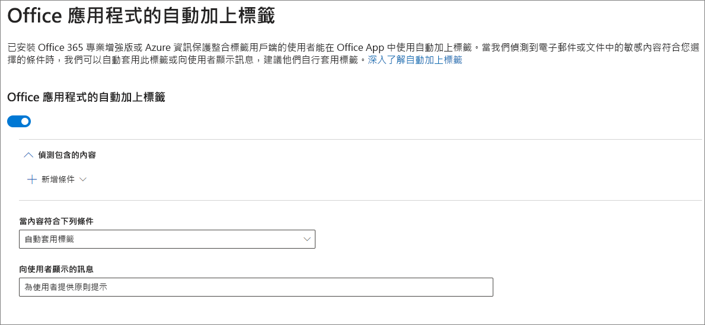

# 自動將敏感度標籤套用到內容Apply a sensitivity label to content automatically

建立敏感度標籤時，您可以自動將該標籤指派給包含敏感性資訊的內容，或者也可以提示使用者套用您建議的標籤。When you create a sensitivity label, you can automatically assign that label to content containing sensitive information, or you can prompt users to apply the label that you recommend.

自動將敏感度標籤套用到內容很重要，因為：The ability to apply sensitivity labels to content automatically is important because:

- 您不需要訓練您的使用者記下所有分類。You don't need to train your users on all of your classifications.

- 您不需要仰賴使用者正確地將所有內容分類。You don't need to rely on users to classify all content correctly.

- 使用者不再需要了解原則，而是可以專心於工作。Users no longer need to know about your policies — they can instead focus on their work.

如需授權需求的相關資訊，請參閱[敏感度標籤的訂閱和授權需求](sensitivity-labels-office-apps.md#subscription-and-licensing-requirements-for-sensitivity-labels)。For information about license requirements, see [Subscription and licensing requirements for sensitivity labels](sensitivity-labels-office-apps.md#subscription-and-licensing-requirements-for-sensitivity-labels).

當您在 Microsoft 365 合規性中心、Microsoft 365 安全性中心或是 Office 365 安全性與合規性中心底下的 [分類]\*\*\*\* >  [敏感度標籤]\*\*\*\* 建立敏感度標籤時，可以使用自動標籤設定。The auto-labeling settings are available when you create a sensitivity label in the Microsoft 365 compliance center, Microsoft 365 security center, or Office 365 Security & Compliance Center under **Classification** > **Sensitivity labels**.

## 根據條件自動套用敏感度標籤Apply a sensitivity label automatically based on conditions

敏感度標籤最實用的功能之一，是將標籤自動套用至符合特定條件的內容。One of the most powerful features of sensitivity labels is the ability to apply them automatically to content that matches certain conditions. 在此情況下，貴組織中的人員不必親自套用敏感度標籤，Office 365 會完成相關作業。In this case, people in your organization don't need to apply the sensitivity labels — Office 365 does the work for them.

您可以選擇在內容包含特定類型的敏感性資訊時，自動將敏感度標籤套用到該內容。當您設定自動套用敏感度標籤時，您會看到建立資料外洩防護 (DLP) 原則時的同一份敏感性資訊類型清單。因此，舉例來說，您可以自動將高度機密性標籤套用到包含客戶個人識別資訊 (PII) 的任何內容，例如信用卡號碼或社會安全號碼。You can choose to apply sensitivity labels to content automatically when that content contains specific types of sensitive information. When you configure a sensitivity label to be applied automatically, you see the same list of sensitive information types as when you create a data loss prevention (DLP) policy. So you can, for example, automatically apply a Highly Confidential label to any content that contains customers' personally identifiable information (PII), such as credit card numbers or social security numbers.

選擇敏感性資訊類型之後，您可以變更執行個體計數或精確度來精簡條件。After you choose your sensitive information types, you can refine your condition by changing the instance count or match accuracy. 如需詳細資訊，請參閱[調整規則，讓規則更容易或更難相符](data-loss-prevention-policies.md#tuning-rules-to-make-them-easier-or-harder-to-match)。For more information, see [Tuning rules to make them easier or harder to match](data-loss-prevention-policies.md#tuning-rules-to-make-them-easier-or-harder-to-match).

此外，您可以選擇條件是必須偵測所有敏感性資訊類型，還是只偵測其中一種。Further, you can choose whether a condition must detect all sensitive information types, or just one of them. 若要讓您的條件更靈活或更複雜，您可以新增群組，並使用群組之間的邏輯運算子。And to make your conditions more flexible or complex, you can add groups and use logical operators between the groups. 如需詳細資訊，請參閱[群組和邏輯運算子](data-loss-prevention-policies.md#grouping-and-logical-operators)。For more information, see [Grouping and logical operators](data-loss-prevention-policies.md#grouping-and-logical-operators).

自動套用敏感度標籤時，使用者會在其 Office App 中看到通知。使用者可以選擇 [確定]\*\*\*\* 來關閉通知。When a sensitivity label is automatically applied, the user sees a notification in their Office app. They can choose **OK** to dismiss the notification.

## 建議使用者套用敏感度標籤Recommend that the user apply a sensitivity label

您可以視需要建議使用者套用標籤。If you prefer, you can recommend to your users that they apply the label. 如果您使用此選項，您的使用者就可以接受分類和任何相關的保護，如果標籤不適合其文件或電子郵件，您也可以取消建議。With this option, your users can accept the classification and any associated protection, or dismiss the recommendation if the label isn't suitable for their document or email.

Word、PowerPoint 和 Excel 可支援建議標籤功能 (但必須安裝 Azure 資訊保護統一標籤用戶端)。Recommended labels are supported in Word, PowerPoint, and Excel (and require that the Azure Information Protection unified labeling client is installed).

以下是設定條件以將標籤套用為建議動作並顯示自訂原則提示的提示範例。您可以選擇要在原則提示中顯示的文字內容。Here's an example of a prompt when you configure a condition to apply a label as a recommended action, with a custom policy tip. You can choose what text is displayed in the policy tip.

## 如何套用自動或建議標籤How automatic or recommended labels are applied

- 自動套用標籤功能適用於您儲存文件時所使用的 Word、Excel 和 PowerPoint，以及傳送電子郵件時的 Outlook。Automatic labeling applies to Word, Excel, and PowerPoint when you save a document, and to Outlook when you send an email. 這些條件會偵測文件和電子郵件中本文的敏感性資訊，以及頁首及頁尾中的敏感性資訊，但不偵測電子郵件的主旨列或附件中的敏感性資訊。These conditions detect sensitive information in the body text in documents and emails, and to headers and footers — but not in the subject line or attachments of email.

- 您不能對先前手動加上標籤，或先前以較高分類自動加上標籤的文件和電子郵件進行自動分類。You can't use automatic classification for documents and emails that were previously manually labeled, or previously automatically labeled with a higher classification. 請記住，您只能將單一敏感度標籤套用至文件或電子郵件 (除了單一保留標籤)。Remember, you can only apply a single sensitivity label to a document or email (in addition to a single retention label).

- 建議的分類適用於您儲存文件時的 Word、Excel 和 PowerPoint。Recommended classification applies to Word, Excel, and PowerPoint when you save documents.

- 您無法針對先前以較高分類加上標籤的文件使用建議分類。You can't use recommended classification for documents that were previously labeled with a higher classification. 如果內容已加上較高分類的標籤，使用者將不會看到含有建議和原則提示的提示。When the content's already labeled with a higher classification, the user won't see the prompt with the recommendation and policy tip.

## 將多個條件套用到多個標籤時的評估方式How multiple conditions are evaluated when they apply to more than one label

標籤會根據您在原則中指定的標籤位置，針對評估進行排序：位於第一個位置的標籤具有最低的位置 (敏感度最低)，而位於最後一個位置的標籤具有最高的位置 (敏感度最高)。如需有關原則的詳細資訊，請參閱[標籤優先順序 (排序事項)](sensitivity-labels.md#label-priority-order-matters)。The labels are ordered for evaluation according to their position that you specify in the policy: The label positioned first has the lowest position (least sensitive) and the label positioned last has the highest position (most sensitive). For more information on priority, see [Label priority (order matters)](sensitivity-labels.md#label-priority-order-matters).

## 請勿設定將上層標籤設定為自動套用或建議選項Don't configure a parent label to be applied automatically or recommended

請記得，您無法將上層標籤 (具有子標籤的標籤) 套用至內容。Remember, you can't apply a parent label (a label with sublabels) to content. 請確定未將上層標籤設定為自動套用或建議選項，因為上層標籤無法套用到使用 Azure 資訊保護統一標籤用戶端的 Office 應用程式中的內容。Make sure that you don't configure a parent label to be auto-applied or recommended, because the parent label won't be applied to content in Office apps that use the Azure Information Protection unified labeling client. 如需上層標籤和子標籤的詳細資訊，請參閱[子標籤 (分組標籤)](sensitivity-labels.md#sublabels-grouping-labels)。For more information on parent labels and sublabels, see [Sublabels (grouping labels)](sensitivity-labels.md#sublabels-grouping-labels).
