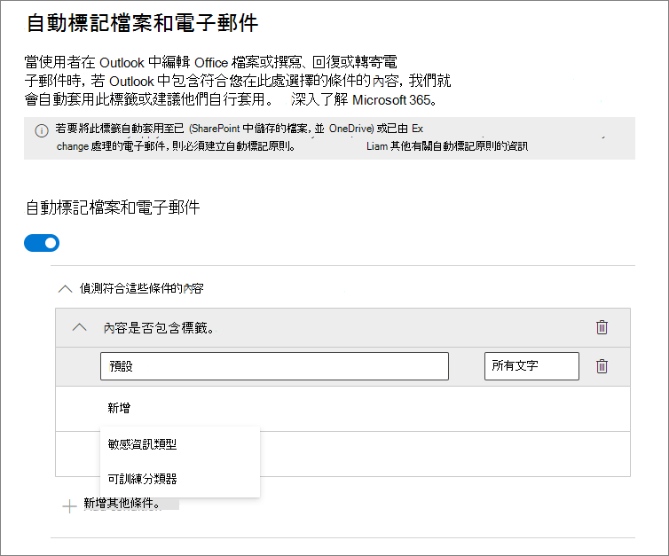
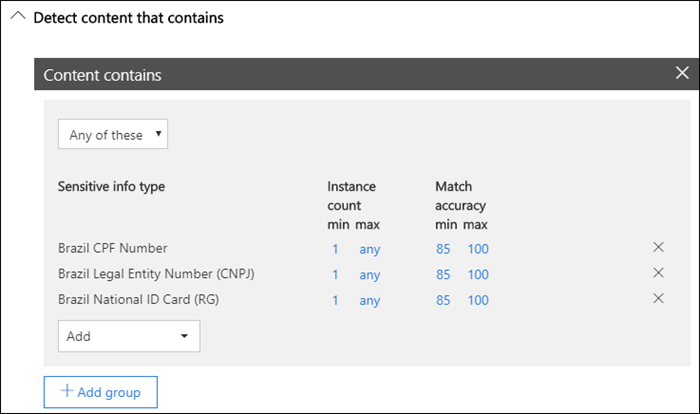
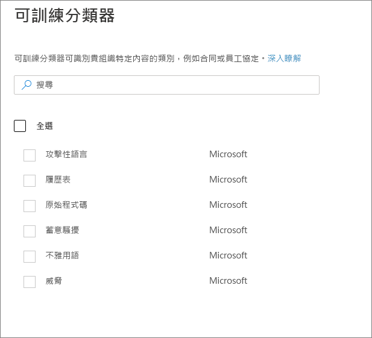
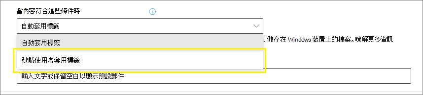
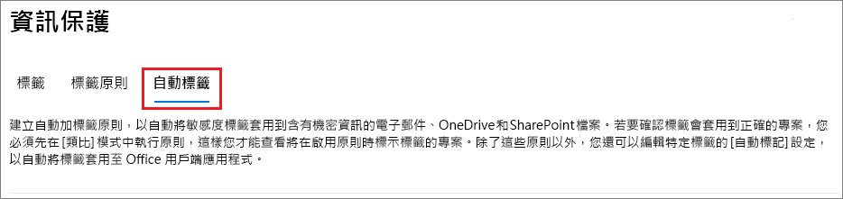

# 自動將敏感度標籤套用到內容

>*[Microsoft 365 安全性與合規性的授權指引](https://aka.ms/ComplianceSD)。*

當您建立敏感度標籤時，您可以在該標籤符合您指定的條件時，自動將其指派給內容。

自動將敏感度標籤套用到內容很重要，因為：

- 您不需要訓練您的使用者使用各個分類的時機。

- 您不需要仰賴使用者正確地將所有內容分類。

- 使用者不再需要了解原則，而是可以專心於工作。

自動套用敏感度標籤有兩種不同的方法：

- **使用者編輯文件或撰寫 (回覆或轉寄) 電子郵件時的用戶端加上標籤**：使用針對 Office 應用程式 (Word、Excel、PowerPoint 和 Outlook) 自動加上標籤所設定的標籤。 
    
    此方法支援向使用者建議標籤，以及自動加上標籤。 但是在這兩種情況下，使用者都會決定接受或拒絕標籤，以協助確保正確的內容標籤。 此用戶端加上標籤對於文件有最小延遲，因為您甚至可以在文件儲存之前套用標籤。 不過，並非所有用戶端應用程式都支援自動加上標籤。 這項功能受 Azure 資訊保護整合式標籤用戶端和[部分 Office 版本](sensitivity-labels-office-apps.md#support-for-sensitivity-label-capabilities-in-apps)的支援。 
    
    如需設定指示，請參閱在此頁面上的[如何設定適用於 Office 應用程式的自動加上標籤](#how-to-configure-auto-labeling-for-office-apps)。

- **內容已儲存 (在 SharePoint Online 或商務用 OneDrive 中) 或寄送電子郵件 (由 Exchange Online 處理) 時的服務端加上標籤**：使用自動加上標籤原則 - 目前為預覽階段。 
    
    > [!NOTE]
    > 請參閱預覽公告、[宣告 Microsoft 365 服務中使用敏感度標籤自動分類的公開預覽](https://techcommunity.microsoft.com/t5/security-privacy-and-compliance/announcing-public-preview-of-auto-classification-with/ba-p/1279961) (英文)。
    
    此方法稱為使用敏感度標籤自動分類。 您可能也聽過其稱為待用資料 (SharePoint 和 OneDrive 中的文件) 以及傳輸中資料 (由 Exchange 傳送或接收的電子郵件) 的自動加上標籤。 若是 Exchange，不會包含待用電子郵件 (信箱)。 
    
    由於此標籤是由服務套用，而不是由應用程式套用，因此您不需要擔心使用者擁有哪些應用程式及其版本。 如此一來，您就能立即在整個組織中使用這項功能，並且適用於大規模加上標籤。 自動加上標籤原則不支援建議的標籤，因為使用者不會與加上標籤程序進行互動。 相反地，系統管理員會在模擬模式中執行原則，以協助確保在實際套用標籤之前，內容正確加上標籤。
    
    如需設定指示，請參閱此頁面上的[如何設定 SharePoint、OneDrive 和 Exchange 的自動加上標籤原則](#how-to-configure-auto-labeling-policies-for-sharepoint-onedrive-and-exchange)。
    
    SharePoint 和 OneDrive 自動加上標籤專屬限制：
    - 在您的租用戶中每天 25000 個檔案的數量上限 (Word、PowerPoint 或 Excel)。
    - 所有原則之間 10 個網站集合的數量上限
    - 在您的租用戶之間 10 個原則的數量上限

    Exchange 自動加上標籤專屬限制：
    - 不同於 Office 應用程式的手動加上標籤或自動加上標籤，Office 附件也會針對您在自動加上標籤原則中指定的條件進行掃描。 有相符項目時，電子郵件會加上標籤，但是附件不會加上標籤。
    - 如果您有套用 IRM 加密的 Exchange 郵件流程規則或資料外洩防護 (DLP) 原則：當內容由這些規則或原則和自動加上標籤原則識別時，則會套用標籤。 如果該標籤套用加密，則會忽略 Exchange 郵件流程規則或 DLP 原則的 IRM 設定。 不過，如果該標籤並未套用加密，除了標籤以外，還會套用郵件流程規則或 DLP 原則的 IRM 設定。
    - 當有一個相符項目使用自動加上標籤時，具有 IRM 加密而沒有標籤的電子郵件，將會由具有任何加密設定的標籤取代。
    - 當有項目與您的自動加上標籤條件相符時，內送電子郵件會加上標籤。 不過，如果標籤針對加密進行設定，則不會套用加密。
    

## 比較 Office 應用程式的自動加上標籤與自動加上標籤原則

使用下表來協助您識別兩個互補自動加上標籤方法的行為差異：

|功能或行為|標籤設定：Office 應用程式的自動加上標籤 |原則：自動加上標籤|
|:-----|:-----|:-----|:-----|
|應用程式相依性|[是](sensitivity-labels-office-apps.md#support-for-sensitivity-label-capabilities-in-apps) |否 |
|依位置限制|否 |是 |
|條件：可訓練分類器|是 (限制預覽) |否 |
|條件：共用選項和電子郵件的其他選項|否 |是 |
|建議、原則工具提示及使用者覆寫|是 |否 |
|模擬模式|否 |是 |
|已針對條件檢查 Exchange 附件|否 | 是|
|套用視覺標記 |是 |是 (僅限電子郵件) |
|覆寫沒有標籤的已套用 IRM 加密|如果使用者只有「匯出」的最小使用權限，則為「是」。 |是 (僅限電子郵件) |
|將內送電子郵件加上標籤|否 |是 (未套用加密) |

> [!NOTE]
> 手動將內容加上標籤時，該標籤永遠不會被自動加上標籤取代。 不過，自動加上標籤原則可取代使用 Office 應用程式自動加上標籤所套用的[低優先順序標籤](sensitivity-labels.md#label-priority-order-matters)。

## 將多個條件套用到多個標籤時的評估方式

標籤會根據您在原則中指定的標籤位置，針對評估進行排序：位於第一個位置的標籤具有最低的位置 (敏感度最低)，而位於最後一個位置的標籤具有最高的位置 (敏感度最高)。如需有關原則的詳細資訊，請參閱[標籤優先順序 (排序事項)](sensitivity-labels.md#label-priority-order-matters)。

## 請勿設定將上層標籤設定為自動套用或建議選項

請記得，您無法將上層標籤 (具有子標籤的標籤) 套用至內容。 請確定未將上層標籤設定為自動套用或建議選項，因為上層標籤無法套用到使用 Azure 資訊保護統一標籤用戶端的 Office 應用程式中的內容。 如需上層標籤和子標籤的詳細資訊，請參閱[子標籤 (分組標籤)](sensitivity-labels.md#sublabels-grouping-labels)。

## 如何設定適用於 Office 應用程式的自動加上標籤

在 Windows 版 Office 應用程式中的自動標籤，是由 Azure 資訊保護整合標籤用戶端支援。 針對在 Office 應用程式中的內建標籤功能，在[某些應用程式為預覽](sensitivity-labels-office-apps.md#support-for-sensitivity-label-capabilities-in-apps)。

當您[建立或編輯敏感度標籤時，可使用適用於 Office 應用程式的自動加上標籤設定](create-sensitivity-labels.md)：

當內容包含特定類型的敏感資訊時，您可以選擇自動將敏感度標籤套用到內容。 從敏感度資訊類型或分類器清單中選擇：

> [!NOTE]
> 目前，[分類器]**** 的選項在限制預覽中，您必須將表單提交給 Microsoft，才能為您的租用戶啟用這項功能。 如需詳細資訊，請參閱[宣佈在 Office 應用程式中使用內建分類器自動加上標籤 - 限制預覽](https://techcommunity.microsoft.com/t5/security-privacy-and-compliance/announcing-automatic-labeling-in-office-apps-using-built-in/ba-p/1192889) (英文)。

自動套用此敏感度標籤時，使用者會在其 Office 應用程式中看到通知。 例如：

### 設定標籤的敏感度資訊類型

當您選取 [敏感度資訊類型]**** 選項時，會看到與在建立資料外洩防護 (DLP) 原則時相同的敏感度資訊類型清單。 例如，您可以自動將 [高度機密] 標籤套用至任何包含客戶個人身分識別資訊 (PII) 的內容，例如信用卡號碼或身分證號碼：

選取敏感度資訊類型之後，您可以變更執行個體計數或比對精確度來調整條件。 如需詳細資訊，請參閱[調整規則，讓規則更容易或更難相符](data-loss-prevention-policies.md#tuning-rules-to-make-them-easier-or-harder-to-match)。

此外，您可以選擇條件是必須偵測所有敏感性資訊類型，還是只偵測其中一種。 若要讓您的條件更靈活或更複雜，您可以新增群組，並使用群組之間的邏輯運算子。 如需詳細資訊，請參閱[群組和邏輯運算子](data-loss-prevention-policies.md#grouping-and-logical-operators)。

### 為標籤設定分類器

當您選取 [分類器]**** 選項時，請選取一或多個內建分類器：

如需這些分類器的詳細資訊，請參閱[開始使用可訓練的分類器 (預覽)](classifier-getting-started-with.md) (部分機器翻譯)。

在預覽期間，下列應用程式支援靈敏度標籤的分類器：

- 來自 [Office 測試人員](https://office.com/insider)的 Windows 版 Office 365 專業增強版傳統型應用程式：
    - Word
    - Excel
    - PowerPoint

- 當您[在 SharePoint 和 OneDrive 中的 Office 檔案啟用敏感度標籤 (公開預覽)](sensitivity-labels-sharepoint-onedrive-files.md) 時的 Office Web 應用程式：
    - Word
    - Excel
    - PowerPoint
    - Outlook

### 建議使用者在 Office 應用程式中套用敏感度標籤

您可以視需要建議使用者套用標籤。 如果您使用此選項，您的使用者就可以接受分類和任何相關的保護，或者當標籤不適合內容時，可以取消建議。

以下舉例說明當您設定條件而將套用標籤作為建議動作 (含自訂原則提示) 時，來自 Azure 資訊保護整合標籤用戶端的提示。 您可以選擇要在原則提示中顯示的文字。

### 在 Office 應用程式中套用自動或建議標籤的時機

是否會在 Office 應用程式中實作自動化的建議標籤功能，取決於您使用的是 Office 內建的標籤功能，還是 Azure 資訊保護的整合標籤用戶端。 不過，在這兩種情況下：

- 您不能對之前已手動加上標籤，或之前已自動加上較高敏感性標籤的文件和電子郵件，自動加上標籤。 請記住，您只能將單一敏感度標籤套用至文件或電子郵件 (除了單一保留標籤之外)。

- 您無法針對之前已加上較高敏感性標籤的文件或電子郵件使用建議標籤。 如果內容已加上較高敏感性標籤，使用者將不會看到含有建議和原則提示的提示。

專用於內建標籤：

- 並非所有的 Office 應用程式都支援自動化 (建議) 標籤。 如需詳細資訊，請參閱[在應用程式中支援敏感度標籤功能](sensitivity-labels-office-apps.md#support-for-sensitivity-label-capabilities-in-apps)。

- 若為電腦版 Word 中的建議標籤，系統會標示觸發了建議的敏感性內容，讓使用者可以檢閱和移除敏感性內容，而不是套用建議的敏感度標籤。

- 如需這些標籤在 Office 應用程式中的套用方式、範例螢幕擷取畫面，以及系統如何偵測到敏感性資訊的詳細資訊，請參閱[在 Office 中自動套用或建議敏感度標籤至您的檔案和電子郵件](https://support.office.com/en-us/article/automatically-apply-or-recommend-sensitivity-labels-to-your-files-and-emails-in-office-622e0d9c-f38c-470a-bcdb-9e90b24d71a1)。

專用於 Azure 資訊保護的整合標籤用戶端：

-  自動化的建議標籤功能適用於您儲存文件時所使用的 Word、Excel 和 PowerPoint，以及傳送電子郵件時的 Outlook。

- 若要讓 Outlook 支援建議標籤，您必須先設定[進階原則設定](https://docs.microsoft.com/azure/information-protection/rms-client/clientv2-admin-guide-customizations#enable-recommended-classification-in-outlook)。

- 系統可於文件和電子郵件的本文，以及頁首及頁尾中偵測到敏感性資訊，但無法在電子郵件的主旨列或附件中偵測到敏感性資訊。

## 如何設定 SharePoint、OneDrive 和 Exchange 的自動加上標籤原則
> [!NOTE]
> 自動加上標籤原則會在公開預覽階段逐漸推出給租用戶，可能有變更。

### 自動加上標籤原則的必要條件

- 必須對模擬模式開啟針對 Office 365 稽核。 如果您需要開啟稽核，或者如果您不確定稽核是否開啟，請參閱[開啟或關閉 Office 365 稽核記錄](turn-audit-log-search-on-or-off.md)。

- 若要對 SharePoint 和 OneDrive 中的檔案自動加上標籤：
    - 您必須[對 SharePoint 和 OneDrive 中的 Office 檔案啟用敏感度標籤 (公開預覽)](sensitivity-labels-sharepoint-onedrive-files.md)。
    - 當自動加上標籤原則執行時，檔案不能由其他程序或使用者開啟。

- 如果您打算使用[自訂敏感性資訊類型](custom-sensitive-info-types.md)，而不是內建的敏感性類型： 
    - 針對在自訂敏感性資訊類型儲存之後所建立的內容，會評估自訂敏感性資訊類型。 
    - 若要測試新的自訂敏感性資訊類型，請在建立您的自動加上標籤原則之前建立，然後建立含有範例資料的新文件以進行測試。

- [已建立和已發佈](create-sensitivity-labels.md) (給至少一個使用者) 一或多個敏感性標籤，您可以針對您的自動加上標籤原則進行選取。 針對這些標籤：
    - Office 應用程式中的自動加上標籤標籤設定開啟與否並不重要，因為該標籤設定是補充自動加上標籤原則，如簡介中的說明。 
    - 如果您想要用於自動加上標籤的標籤是設定為使用視覺標記 (頁首、頁尾、浮水印)，請注意，這些標籤不適用於文件。

### 了解模擬模式

模擬模式是自動加上標籤原則專屬的，並且編寫到工作流程中。 在您的原則執行至少一個模擬之前，您無法對文件和電子郵件自動加上標籤。

自動加上標籤原則的工作流程：

1. 建立及設定自動加上標籤原則

2. 在模擬模式中執行原則，並至少等待 24 小時

3. 檢閱結果，並視需要調整原則，重新執行模擬模式，並等待至少 24 小時

4. 視需要重複步驟 3

5. 在生產環境中部署

模擬的部署執行方式類似 PowerShell 的 WhatIf 參數。 您會看到結果，報告就像是自動加上標籤原則已使用您定義的規則，套用您選取的標籤。 如果需要，您可以接著調整規則的精確度，並重新執行模擬。 不過，由於 Exchange 的自動加上標籤適用於傳送和接收的電子郵件，而不是儲存在信箱中的電子郵件，因此除非您能夠傳送及接收完全相同的電子郵件訊息，否則請不要預期模擬中的電子郵件結果一致。

模擬模式也可讓您在部署之前逐漸增加自動加上標籤原則的範圍。 例如，您可能會從單一位置 (例如具有單一文件庫的 SharePoint 網站) 開始使用。 接著，使用反覆變更將範圍增加到多個網站，然後增加至其他位置 (例如 OneDrive)。

最後，您可以使用模擬模式來提供執行自動加上標籤原則所需時間的近似值，以協助您規劃並排程不使用模擬模式執行的時間。

### 建立自動加上標籤原則

1. 在 [Microsoft 365 合規性中心](https://compliance.microsoft.com/)，瀏覽至敏感度標籤：
    
    - **解決方案** > **資訊保護**
    
    如果您沒有立即看到這個選項，請先選取 [全部顯示]****。

2. 選取 [自動加上標籤 (預覽)]**** 索引標籤：
    
    

3. 選取 [+ 建立原則]****。

4. 針對 [選擇您要套用此標籤的資訊]**** 頁面：選取其中一個範本，例如 [財務]**** 或 [隱私權]****。 您可以使用 [顯示選項]**** 下拉式清單來精簡搜尋。 或者，如果範本不符合您的需求，請選取 [自訂原則]****。 選取 [下一步]****。

5. 針對 [為您的自動加上標籤原則命名]**** 頁面：提供唯一名稱，以及選擇性提供說明，以協助識別自動套用的標籤、位置和條件，以上項目可識別加上標籤的內容。

6. 針對 [選擇您要套用標籤的位置]**** 頁面：選取並指定 Exchange、SharePoint 網站和 OneDrive 的位置。 接著，選取 [下一步]****。

7. 針對 [定義原則設定]**** 頁面：保留預設值 [尋找包含的內容]**** 以定義規則，可識別在您所選取所有位置之間要加上標籤的內容。 如果您在每個位置都需要不同的規則，請選取 [進階設定]****。 接著，選取 [下一步]****。
    
    規則會使用條件，其中包括敏感性資訊類型和共用選項：
    - 針對敏感性資訊類型，您可以選取內建和自訂敏感性資訊類型。
    - 針對共用選項，您可以選擇 [僅與我組織內部的人員]**** 或 [與我組織外部的人員]****。
    
    如果您唯一的位置是 **Exchange**，或如果您選取 [進階設定]****，您還可以選取其他條件：
    - 寄件者 IP 位址為
    - 收件者網域為
    - 收件者為
    - 附件的副檔名為
    - 附件受密碼保護
    - 文件屬性為
    - 無法掃描的任何電子郵件附件內容
    - 未完成掃描的任何電子郵件附件內容

8. 針對 [設定規則來定義要對哪個內容加上標籤]**** 頁面：選取 [+ 建立規則]**** 然後選取 [下一步]****。

9. 在 [建立規則]**** 頁面上，使用敏感性資訊類型或共用選項來為您的規則命名和加以定義，然後選取 [儲存]****。
    
    敏感性資訊類型的設定選項，和您針對 Office 應用程式的自動加上標籤所選取的設定選項相同。 如需詳細資訊，請參閱[設定標籤的敏感性資訊類型](#configuring-sensitive-info-types-for-a-label)。

10. 回到 [設定規則來定義要對哪個內容加上標籤]**** 頁面：如果您需要另一個規則來識別要加上標籤的內容，請選取 [+ 建立規則]****，然後重複上一個步驟。 當您已定義所有需要的規則，並確認其狀態為開啟時，請選取 [下一步]****。

11. 針對 [選擇要自動套用的標籤]**** 頁面：選取 [+ 選擇標籤]****，從 [選擇敏感度標籤]**** 窗格中選取標籤，然後選取 [下一步]****。

12. 針對 [選擇原則的模式]**** 頁面：如果您現在已準備好在模擬模式中執行自動加上標籤原則，請選取 [測試]****。 否則，請選取 [保持關閉]****。 選取 [下一步]****。 

13. 針對 [摘要]**** 頁面：檢閱您的自動加上標籤原則設定，視需要進行任何變更，然後完成精靈。
    
    不同於 Office 應用程式的自動加上標籤，沒有個別發佈選項。 不過，發佈標籤時，自動加上標籤原則最多有 24 小時可以在您的整個組織中複寫。

現在在 [資訊保護]**** 頁面的 [自動加上標籤 (預覽)]**** 索引標籤上，您會在 [測試]**** 區段中看到您的自動加上標籤原則。 選取您的原則，以查看設定和狀態的詳細資料 (例如，仍在測試中或測試完成)。 選取 [相符項目]**** 索引標籤，以查看哪些電子郵件或文件符合您指定的規則。

您可以藉由選取頁面頂端的 [編輯]**** 選項，直接從此介面修改您的原則。

當您準備好不透過模擬來執行原則時，請選取 [開啟]**** 選項。

您也可以在您具有適當[權限](data-classification-content-explorer.md#permissions)時藉由使用[內容總管](data-classification-content-explorer.md)，查看您自動加上標籤原則的結果：
- **內容總管清單檢視器**可讓您查看檔案的標籤，但是無法查看檔案的內容。
- **內容總管內容檢視器**可讓您查看檔案的內容。

> [!TIP]
> 您也可以使用內容總管來識別具有未加上標籤文件 (包含敏感性資訊) 的位置。 使用這項資訊，請考量將這些位置新增到您的自動加上標籤原則，並納入已識別的敏感性資訊類型作為規則。

