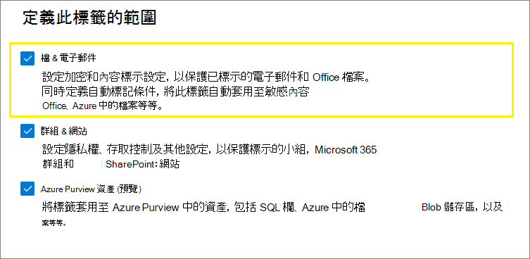
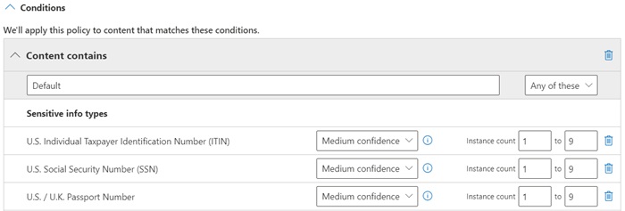
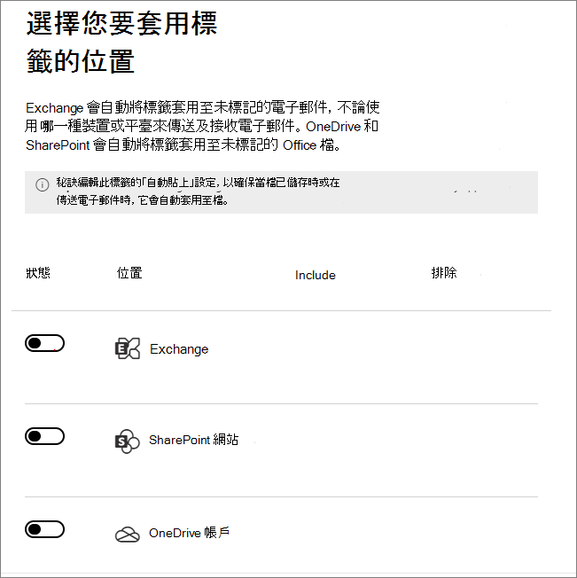
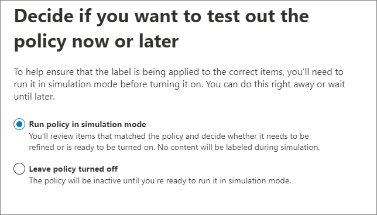
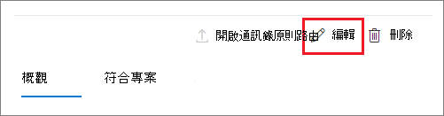

# <a name="apply-a-sensitivity-label-to-content-automatically"></a>自動將敏感度標籤套用到內容

>*[Microsoft 365 安全性與合規性的授權指引](/office365/servicedescriptions/microsoft-365-service-descriptions/microsoft-365-tenantlevel-services-licensing-guidance/microsoft-365-security-compliance-licensing-guidance)。*

> [!NOTE]
> 如需在 Azure Purview (預覽) 中自動套用敏感度標籤的相關資訊，請參閱[在 Azure Purview 中自動為您的內容加上標籤](/azure/purview/create-sensitivity-label)。

當您建立敏感度標籤時，您可以在該標籤符合您指定的條件時，自動將其指派給檔案和電子郵件。

能夠自動將敏感度標籤套用到內容很重要，因為：

- 您不需要訓練您的使用者使用各個分類的時機。

- 您不需要仰賴使用者正確地將所有內容分類。

- 使用者不再需要了解原則，而是可以專心於工作。

手動將內容套用標籤時，該標籤永遠不會被自動套用標籤取代。 不過，自動套用標籤可取代自動套用的[低優先順序標籤](sensitivity-labels.md#label-priority-order-matters)。

對 Microsoft 365 中的內容自動套用敏感度標籤有兩種不同的方法：

- **使用者編輯文件或撰寫 (回覆或轉寄) 電子郵件時的用戶端套用標籤**：使用針對檔案和電子郵件 (包括 Word、Excel、PowerPoint 和 Outlook) 自動套用標籤所設定的標籤。 
    
    此方法支援向使用者建議標籤，以及自動套用標籤。 但是在這兩種情況下，使用者都會決定接受或拒絕標籤，以協助確保正確為內容套用標籤。 此用戶端加標籤對於文件有最小延遲，因為您甚至可以在儲存文件之前套用標籤。 不過，並非所有用戶端應用程式都支援自動套用標籤。 這項功能受 Azure 資訊保護整合標籤用戶端和[部分 Office 版本](sensitivity-labels-office-apps.md#support-for-sensitivity-label-capabilities-in-apps)的支援。 
    
    如需設定指示，請參閱在此頁面上的[如何設定適用於 Office 應用程式的自動套用標籤](#how-to-configure-auto-labeling-for-office-apps)。

- **內容已儲存 (在 SharePoint 或 OneDrive 中) 或寄送電子郵件 (由 Exchange Online 處理) 時的服務端套用標籤**：使用自動套用標籤原則。 
    
    您可能也聽過此方法稱為待用資料 (SharePoint 和 OneDrive 中的文件) 以及傳輸中的資料 (由 Exchange 傳送或接收的電子郵件) 的自動套用標籤。若是 Exchange，則不會包括待用電子郵件 (信箱)。
    
    由於此標籤是由服務套用，而不是由應用程式套用，因此您不需要擔心使用者擁有哪些應用程式及其版本。 如此一來，您就能立即在整個組織中使用這項功能，並且適用於大規模套用標籤。 自動套用標籤原則不支援建議的標籤，因為使用者不會與套用標籤程序進行互動。 相反地，系統管理員會在模擬模式中執行原則，以協助確保在實際套用標籤之前，內容正確套用標籤。
    
    如需設定指示，請參閱此頁面上的[如何設定 SharePoint、OneDrive 和 Exchange 的自動套用標籤原則](#how-to-configure-auto-labeling-policies-for-sharepoint-onedrive-and-exchange)。
    
    SharePoint 和 OneDrive 自動套用標籤專屬限制：
    - 支援 Word、PowerPoint 和 Excel 等 Office 檔案。支援 Open XML 格式 (例如 .docx 和 .xlsx)，但不支援 Microsoft Office 97-2003 格式 (例如 .doc 和 .xls)。
        - 這些檔案可在建立自動套用標籤原則之前或之後，以靜止方式自動套用標籤。 如果檔案是開啟工作階段的一部分 (檔案已開啟) ，則無法自動套用標籤。
        - 目前清單項目的附件尚不受支援，且不會自動套用標籤。
    - 租用戶中每日最多有 25,000 個自動套用標籤的檔案。
    - 每個租用戶最多 10 個自動套用標籤的原則，每個最多可用於 10 個網站（SharePoint 或 OneDrive）。
    - 自動標籤原則不會造成修改時間、修改者和日期的現有值變更 (對於兩個模擬模式和套用標籤時)。
    - 當標籤套用加密時，[版權管理簽發者和版權管理擁有者](/azure/information-protection/configure-usage-rights#rights-management-issuer-and-rights-management-owner)會是上次修改檔案的帳戶。

    Exchange 自動套用標籤專屬限制：
    - 不同於 Office 應用程式的手動套用標籤或自動套用標籤，PDF 附件和 office 附件 (Word、Excel 和 PowerPoint 檔案) 也會針對您在自動套用標籤原則中指定的條件進行掃描。有相符項目時，電子郵件會套用標籤，但是附件不會。
        - 對於 PDF 檔案，如果標籤套用加密，則當您的租用戶[啟用 PDF 附件](ome-faq.yml#are-pdf-file-attachments-supported-)時，這些檔案將被加密。
        - 對於這些 Office 檔案，支援 Open XML 格式 (如 .docx 和 .xlsx)，但不支援 Microsoft Office 97-2003 格式 (如 .doc 和 .xls)。如果標籤套用加密，則這些檔案將被加密。
    - 如果您有套用 IRM 加密的 Exchange 郵件流程規則或資料外洩防護 (DLP) 原則：當內容由這些規則或原則和自動套用標籤原則識別時，則會套用標籤。 如果該標籤套用加密，則會忽略 Exchange 郵件流程規則或 DLP 原則的 IRM 設定。 不過，如果該標籤並未套用加密，除了標籤以外，還會套用郵件流程規則或 DLP 原則的 IRM 設定。
    - 當有一個相符項目使用自動套用標籤時，具有 IRM 加密而沒有標籤的電子郵件，將會由具有任何加密設定的標籤取代。
    - 當有項目與您的自動套用標籤條件相符時，內送電子郵件會套用標籤：
        - 推出：如果標籤針對 [加密](encryption-sensitivity-labels.md) 進行設定，則不會套用加密。
        - 如果標籤設定為套用 [動態標記](sensitivity-labels-office-apps.md#dynamic-markings-with-variables)，請注意，這可能導致人員名稱會在組織的外部。
    - 當標籤套用加密時，[版權管理頒發者和版權管理擁有者](/azure/information-protection/configure-usage-rights#rights-management-issuer-and-rights-management-owner)會是傳送電子郵件的人員。 目前無法為自動加密的所有內建電子郵件訊息，設定版權管理員擁有者。
    

## <a name="compare-auto-labeling-for-office-apps-with-auto-labeling-policies"></a>比較 Office 應用程式的自動套用標籤與自動套用標籤原則

使用下表來協助您識別兩個互補自動套用標籤方法的行為差異：

|功能或行為|標籤設定：檔案和電子郵件的自動套用標籤  |原則：自動套用標籤|
|:-----|:-----|:-----|
|應用程式相依性|[是](sensitivity-labels-office-apps.md#support-for-sensitivity-label-capabilities-in-apps) |否\* |
|依位置限制|否 |是 |
|條件：可訓練分類器|是 |否 |
|條件：共用選項和電子郵件的其他選項|否 |是 |
|建議、原則工具提示及使用者覆寫|是 |否 |
|模擬模式|否 |是 |
|已針對條件檢查 Exchange 附件|否 | 是|
|套用視覺標記 |是 |是 (僅限電子郵件) |
|已套用覆寫 IRM 加密但沒有標籤|如果使用者只有匯出的最小使用權限，則為是。 |是 (僅限電子郵件) |
|將內送電子郵件套用標籤|否 |是|

\* 目前並非所有地區都提供自動套用標籤功能。 如果您的租用戶無法支援這項功能，[系統管理標籤中心] 就不會顯示 [自動套用標籤] 索引標籤。

## <a name="how-multiple-conditions-are-evaluated-when-they-apply-to-more-than-one-label"></a>將多個條件套用到多個標籤時的評估方式

標籤會根據您在原則中指定的標籤位置，針對評估進行排序：位於第一個位置的標籤具有最低的位置 (敏感度最低)，而位於最後一個位置的標籤具有最高的位置 (敏感度最高)。如需有關原則的詳細資訊，請參閱[標籤優先順序 (排序事項)](sensitivity-labels.md#label-priority-order-matters)。

## <a name="dont-configure-a-parent-label-to-be-applied-automatically-or-recommended"></a>請勿設定將上層標籤設定為自動套用或建議選項

請記得，您無法將上層標籤 (具有子標籤的標籤) 套用至內容。 請確認您沒有設定在 Office 應用程式中自動套用或推薦的上層標籤，且沒有為自動標籤原則選取上層標籤。 如果這麼做，系統就不會將上層標籤套用至內容。

若要搭配子標籤使用上層標籤標籤，請務必同時發佈上層標籤和子標籤。

如需上層標籤和子標籤的詳細資訊，請參閱[子標籤 (分組標籤)](sensitivity-labels.md#sublabels-grouping-labels)。

## <a name="how-to-configure-auto-labeling-for-office-apps"></a>如何設定適用於 Office 應用程式的自動套用標籤

在 Windows 版 Office 應用程式中的自動標籤，是由 Azure 資訊保護整合標籤用戶端支援。 對於 Office 應用程式中的內建標籤，此功能 [ 對不同的應用程式，處於不同的可用性階段 ](sensitivity-labels-office-apps.md#support-for-sensitivity-label-capabilities-in-apps)。

當您[建立或編輯敏感度標籤](create-sensitivity-labels.md)時，可使用適用於 Office 應用程式的自動套用標籤設定。 請確定已針對標籤的範圍選取 **[檔案和電子郵件]**： 



當您在精靈中移動時，您會看到 [檔案和電子郵件的自動套用標籤 **]** 頁面，您可以在其中從敏感性資訊類型或可訓練分類器清單中選擇：


自動套用此敏感度標籤時，使用者會在其 Office 應用程式中看到通知。例如：


### <a name="configuring-sensitive-info-types-for-a-label"></a>設定標籤的敏感度資訊類型

當您選取 **[敏感度資訊類型]** 選項時，會看到與在建立資料外洩防護 (DLP) 原則時相同的敏感度資訊類型清單。 例如，您可以自動將 [高度機密] 標籤套用至任何包含客戶個人資訊的內容，例如信用卡號碼、社會安全碼或身分證號碼：


同樣的，當您在設定 DLP 原則時，藉由改變執行個體計數及比對精確度，您可以精簡您的條件。例如：



您可以從 DLP 檔案了解更多有關這些組態選項：[調整規則以讓它們更容易或更難符合](data-loss-prevention-policies.md#tuning-rules-to-make-them-easier-or-harder-to-match)。

同時類似於 DLP 原則設定，您可以選擇條件是必須偵測所有敏感性資訊類型，還是只偵測其中一種。 若要讓您的條件更靈活或更複雜，您可以新增 [群組，並使用群組間的邏輯運算子](data-loss-prevention-policies.md#grouping-and-logical-operators)。

### <a name="configuring-trainable-classifiers-for-a-label"></a>為標籤設定可訓練分類器

此選項目前處於預覽。 如果您使用此選項，請確定您已在您的租用戶中發佈至少另一個其他敏感性標籤，其已設定為自動加標籤和[敏感性資訊類型選項](#configuring-sensitive-info-types-for-a-label)。

當您選取 **[可訓練分類器]** 選項時，請選取一或多個 Microsoft 內建可訓練分類器。 如果您已建立自己的自訂可訓練分類器，也可以選取這些分類器：


> [!CAUTION]
> 我們正在淘汰 [粗穢言語] 內建分類器，因為這個分類器產生了大量的誤報。 請不要使用這個內建分類器，如果您目前正在使用此分類器，請將您的商務流程移開。 建議您改用 **[針對性騷擾]**、**[粗話]** 和 **[威脅]** 內建分類器。

如需這些分類器的詳細資訊，請參閱[深入了解可訓練分類器](classifier-learn-about.md)。

在此選項的預覽期間，下列應用程式支援敏感度標籤的可訓練分類器：

- 適用於 Windows 的 Microsoft 365 Apps 企業版 (之前稱為 [Office 365 專業增強版](/deployoffice/name-change))，現已在版本 2006 和更新版本中的[目前通道](/deployoffice/overview-update-channels#current-channel-overview)推出：
    - Word
    - Excel
    - PowerPoint

- 當您[在 SharePoint 和 OneDrive 中的 Office 檔案啟用敏感度標籤](sensitivity-labels-sharepoint-onedrive-files.md)時的 Office 網頁版應用程式：
    - Word
    - Excel
    - PowerPoint
    - Outlook

### <a name="recommend-that-the-user-applies-a-sensitivity-label"></a>建議使用者套用敏感度標籤

您可以視需要建議使用者套用標籤。如果您使用此選項，您的使用者就可以接受分類和任何相關的保護，或者當標籤不適合內容時，可以取消建議。


以下舉例說明當您設定條件而將套用標籤作為建議動作 (含自訂原則提示) 時，來自 Azure 資訊保護整合標籤用戶端的提示。您可以選擇要在原則提示中顯示的文字。


### <a name="when-automatic-or-recommended-labels-are-applied"></a>當套用自動或建議標籤時

是否會在 Office 應用程式中實作自動化的建議標籤功能，取決於您使用的是 Office 內建的標籤功能，還是 Azure 資訊保護的整合標籤用戶端。然而，在這兩種情况下：

- 如果文件或電子郵件之前已手動套用標籤，或之前已使用較高敏感度自動套用標籤，則無法使用自動套用標籤功能。請切記，您只能將單一敏感度標籤套用到文件或電子郵件 (單一保留標籤也是如此)。

- 您無法針對之前已加上較高敏感性標籤的文件或電子郵件使用建議標籤。如果內容已加上較高敏感性標籤，使用者將不會看到含有建議和原則提示的提示。

專用於內建標籤：

- 並非所有的 Office 應用程式都支援自動化 (建議) 標籤。 如需詳細資訊，請參閱[在應用程式中支援敏感度標籤功能](sensitivity-labels-office-apps.md#support-for-sensitivity-label-capabilities-in-apps)。

- 若為電腦版 Word 中的建議標籤，系統會標示觸發了建議的敏感性內容，讓使用者可以檢閱和移除敏感性內容，而不是套用建議的敏感度標籤。

- 如需這些標籤在 Office 應用程式中的套用方式、範例螢幕擷取畫面，以及系統如何偵測到敏感性資訊的詳細資訊，請參閱[在 Office 中自動套用或建議敏感度標籤至您的檔案和電子郵件](https://support.office.com/zh-TW/article/automatically-apply-or-recommend-sensitivity-labels-to-your-files-and-emails-in-office-622e0d9c-f38c-470a-bcdb-9e90b24d71a1)。

專用於 Azure 資訊保護的整合標籤用戶端：

-  自動化的建議標籤功能適用於您儲存文件時所使用的 Word、Excel 和 PowerPoint，以及傳送電子郵件時的 Outlook。

- 若要讓 Outlook 支援建議標籤，您必須先設定[進階原則設定](/azure/information-protection/rms-client/clientv2-admin-guide-customizations#enable-recommended-classification-in-outlook)。

- 系統可於文件和電子郵件的本文，以及頁首及頁尾中偵測到敏感性資訊，但無法在電子郵件的主旨列或附件中偵測到敏感性資訊。

## <a name="how-to-configure-auto-labeling-policies-for-sharepoint-onedrive-and-exchange"></a>如何設定 SharePoint、OneDrive 和 Exchange 的自動套用標籤原則

設定自動套用標籤原則之前，請確認您已經知道先決條件。 

### <a name="prerequisites-for-auto-labeling-policies"></a>自動套用標籤原則的必要條件

- 模擬模式：
    - 必須開啟 Microsoft 365 的稽核功能。 如果您需要開啟稽核，或者如果您不確定稽核是否開啟，請參閱[開啟或關閉稽核記錄搜尋](turn-audit-log-search-on-or-off.md)。
    - 若要在來源檢視中檢視檔案或電子郵件內容，您必須擁有 **內容總管內容檢視者** 角色。 預設的全域系統管理員沒有這個角色。 如果您沒有這個使用權限，當您從 **[相符的項目]** 索引標籤中選取項目時，就不會看到預覽窗格。

- 若要對 SharePoint 和 OneDrive 中的檔案自動套用標籤：
    - 您必須[對 SharePoint 和 OneDrive 中的 Office 檔案啟用敏感度標籤](sensitivity-labels-sharepoint-onedrive-files.md)。
    - 當自動套用標籤原則執行時，檔案不能由其他程序或使用者開啟。 簽出以編輯的檔案屬於這個類別。

- 如果您計劃使用[自訂敏感性資訊類型](sensitive-information-type-learn-about.md)，而不是內建的敏感性類型： 
    - 針對在儲存自訂敏感度資訊類型之後新增至 SharePoint 或 OneDrive 的內容，會評估該內容的自訂敏感度資訊類型。 
    - 若要測試新的自訂敏感性資訊類型，請在建立您的自動套用標籤原則之前建立，然後建立含有範例資料的新文件以進行測試。

- 一或多個敏感性標籤[已建立和已發佈](create-sensitivity-labels.md) (給至少一個使用者)，這些標籤可供您針對自動套用標籤原則選取。 針對這些標籤：
    - Office 應用程式中的自動套用標籤標籤設定開啟與否並不重要，因為該標籤設定是補充自動套用標籤原則，如簡介中的說明。
    - 如果您想要用於自動套用標籤的標籤是設定為使用視覺標記 (頁首、頁尾、浮水印)，請注意，這些標籤不適用於文件。
    - 若標籤套用 [加密](encryption-sensitivity-labels.md)：
        - 當自動套用標籤原則包括了 Microsoft Office SharePoint Online 或 Microsoft OneDrive 的位置時，此標籤必須針對 **立即指派權限** 進行設定。
        - 當自動套用標籤原則只針對 Exchange Online，此標籤可針對 **立即指派權限** 或 **讓使用者指派權限** (適用於不可轉寄或僅加密選項) 進行設定。

### <a name="learn-about-simulation-mode"></a>了解模擬模式

模擬模式是自動套用標籤原則專屬，並且編寫到工作流程中。 在您的原則執行至少一個模擬之前，您無法對文件和電子郵件自動套用標籤。

自動套用標籤原則的工作流程：

1. 建立及設定自動套用標籤原則。

2. 在模擬模式中執行原則，這可能需要 48 小時的時間才能完成。

3. 查看結果，並視需要調整您的原則。 重新執行模擬模式，並再次等待其完成。

4. 視需要重複步驟 3。

5. 在生產環境中部署。

模擬的部署執行方式類似 PowerShell 的 WhatIf 參數。 您會看到報告的結果，就像是自動套用標籤原則已使用您定義的規則套用您選取的標籤。 如果需要，您可以接著調整規則的精確度，並重新執行模擬。 不過，由於 Exchange 的自動套用標籤適用於傳送和接收的電子郵件，而不是儲存在信箱中的電子郵件，因此除非您能夠傳送及接收完全相同的電子郵件訊息，否則請不要預期模擬中的電子郵件結果會是一致的。

模擬模式也可讓您在部署之前逐漸增加自動套用標籤原則的範圍。 例如，您可能會從單一位置 (例如 SharePoint 網站) 的單一文件庫開始使用。 接著，使用反覆變更將範圍增加至多個網站，然後增加至其他位置 (例如 OneDrive)。

最後，您可以使用模擬模式來提供執行自動套用標籤原則所需時間的近似值，以協助您規劃並排程不使用模擬模式執行的時間。

### <a name="creating-an-auto-labeling-policy"></a>建立自動套用標籤原則

1. 在 [Microsoft 365 合規性中心](https://compliance.microsoft.com/)，瀏覽至敏感度標籤：
    
    - **解決方案** > **資訊保護**
    
    如果您沒有立即看到這個選項，請先選取 [全部顯示]。

2. 選取 **[自動套用標籤]** 索引標籤：
    
    
    
    > [!NOTE]
    > 如果您沒有看到 **[自動套用標籤]** 索引標籤，就代表您的區域目前無法使用此功能。

3. 選取 **+ 建立自動套用標籤原則**。 這會啟動 [新原則] 精靈：
    
    

4. 針對 **[選擇要套用此標籤的資訊]** 頁面：選取其中一個範本，例如 **財務** 或 **隱私權**。 您可以使用 **[顯示下列內容的選項]** 下拉式清單來精簡搜尋。 或者，如果範本不符合您的需求，請選取 **[自訂原則]**。 選取 [下一步]。

5. 針對 **[命名您的自動套用標籤原則]** 頁面：提供唯一名稱，以及選擇性提供說明，以協助識別自動套用的標籤、位置和可識別要套用標籤之內容的條件。

6. 針對 **[選擇要套用此標籤的資訊]** 頁面：選取並指定 Exchange、SharePoint 網站和 OneDrive 的位置。 然後選取 **[下一步]**。
    
    
    
    您必須指定個別的 SharePoint 網站和 OneDrive 帳戶。 若為 OneDrive，使用者 OneDrive 帳戶的 URL 會採用下列格式：`https://<tenant name>-my.sharepoint.com/personal/<user_name>_<tenant name>_com`
    
    例如，針對 contoso 租用戶中使用者名稱為 "rsimone" 的使用者：`https://contoso-my.sharepoint.com/personal/rsimone_contoso_onmicrosoft_com`
    
    若要驗證租用戶的語法並識別使用者的 URL，請參閱[取得組織中所有使用者的 OneDrive URL 清單](/onedrive/list-onedrive-urls) (部分機器翻譯)。

7. 針對 **設定常用或進階規則** 頁面：保留 **常用規則** 的預設以定義可識別要在您所選取所有位置之間套用標籤之內容的規則。 如果您在每個位置都需要不同的規則，請選取 **[進階規則]**。 然後選取 **[下一步]**。
    
    規則會使用條件，其中包括敏感性資訊類型和共用選項：
    - 針對敏感性資訊類型，您可以選取內建和自訂敏感性資訊類型。
    - 針對共用選項，您可以選擇 **[僅與我組織內部的人員]** 或 **[與我組織外部的人員]**。
    
    如果您唯一的位置是 **[Exchange]**，或如果您選取 **[進階規則]**，則還可以選取其他條件：
    - 寄件者 IP 位址為
    - 收件者網域為
    - 收件者為
    - 附件的副檔名為
    - 附件受密碼保護
    - 無法掃描任何電子郵件附件的內容
    - 未完成掃描任何電子郵件附件的內容

8. 根據您先前的選擇，您現在有機會使用條件和例外建立新的規則。
    
    敏感性資訊類型的設定選項，和您針對 Office 應用程式的自動套用標籤所選取的設定選項相同。 如需詳細資訊，請參閱[設定標籤的敏感性資訊類型](#configuring-sensitive-info-types-for-a-label)。
    
    當您已定義所有需要的規則，並確認其狀態為開啟時，請選取 **[下一步]** 以繼續選擇標籤以自動套用。

11. 針對 **[選擇要自動套用的標籤]** 頁面：選取 **[+ 選擇標籤]**，從 **[選擇敏感度標籤]** 窗格中選取標籤，然後選取 **[下一步]**。

12. 針對 **決定立即或稍後測試原則** 頁面：如果您已準備好立即在模擬模式中執行自動套用標籤原則，請選取 **[在模擬模式中執行原則]** 。 否則，請選取 **[將原則關閉]**。 選取 **[下一步]**: 
    
    

13. 針對 **[摘要]** 頁面：檢閱您的自動套用標籤原則設定，視需要進行任何變更，然後完成精靈。

現在，在 **[資訊保護]** > **[自動套用標籤]** 頁面，您會在 **[模擬]** 或 **[關閉]** 區段中看到自動套用標籤原則 (視您是否選擇要在模擬模式中執行) 而定。 選取您的原則，以查看設定和狀態的詳細資料 (例如，**仍在執行中的原則模擬**)。 針對模擬模式中的原則，選取 **[相符的項目]** 索引標籤，以查看哪些電子郵件或文件符合您指定的規則。

您可以直接從這個介面修改您的原則：

- 針對 **[關閉]** 區段中的原則，選取 **[編輯原則]** 按鈕。

- 針對 **[模擬]** 區段中的原則，從任一索引標籤中選取頁面頂端的 **[編輯原則]** 選項：
    
    
    
    當您準備好執行原則而不進行模擬時，請選取 **[開啟原則]** 選項。

您的自動原則會持續執行，直到刪除為止。 例如，新的和修改過的文件會包含在目前的原則設定中。

具有適當[權限](data-classification-content-explorer.md#permissions)時，您也可以藉由使用[內容總管](data-classification-content-explorer.md)，來查看自動套用標籤原則的結果：
- **內容總管清單檢視器** 可讓您查看檔案的標籤，但是無法查看檔案的內容。
- **內容總管內容檢視器** 可讓您查看檔案的內容。

> [!TIP]
> 您也可以使用內容總管來識別包含包含敏感性資訊、但尚未套用標籤的的文件位置。 利用此資訊，請考量將這些位置新增到您的自動套用標籤原則，並納入已識別的敏感性資訊類型作為規則。

### <a name="use-powershell-for-auto-labeling-policies"></a>將 PowerShell 用於自動套用標籤原則

您可以使用[安全性與合規性中心 PowerShell](/powershell/exchange/scc-powershell) 來建立及設定自動套用標籤原則。 這表示您可以完整編寫建立和維護自動套用標籤原則的指令碼，這也提供您一個更有效方式，可為 OneDrive 和 SharePoint 位置指定多個 URL。

在 PowerShell 中執行命令之前，您必須先[連線至安全性與合規性中心 PowerShell](/powershell/exchange/connect-to-scc-powershell)。

若要建立新的自動套用標籤原則： 

```powershell
New-AutoSensitivityLabelPolicy -Name <AutoLabelingPolicyName> -SharePointLocation "<SharePointSiteLocation>" -ApplySensitivityLabel <Label> -Mode TestWithoutNotifications
```
此命令會為您指定的 SharePoint 網站建立自動套用標籤原則。 若為 OneDrive 位置，請改用 *OneDriveLocation* 參數。 

若要新增其他網站至現有的自動套用標籤原則：

```powershell
$spoLocations = @("<SharePointSiteLocation1>","<SharePointSiteLocation2>")
Set-AutoSensitivityLabelPolicy -Identity <AutoLabelingPolicyName> -AddSharePointLocation $spoLocations -ApplySensitivityLabel <Label> -Mode TestWithoutNotifications
```

此命令會在變數中指定其他 SharePoint URL，然後將該變數新增至現有的自動套用標籤原則。 若要改為新增 OneDrive 位置，請使用 *AddOneDriveLocation* 參數搭配不同的變數，例如 *$OneDriveLocations*。

若要建立新的自動套用標籤原則規則：

```powershell
New-AutoSensitivityLabelRule -Policy <AutoLabelingPolicyName> -Name <AutoLabelingRuleName> -ContentContainsSensitiveInformation @{"name"= "a44669fe-0d48-453d-a9b1-2cc83f2cba77"; "mincount" = "2"} -Workload SharePoint
```

針對現有的自動套用標籤原則，此命令會建立新的原則規則，以偵測 **美國社會安全編號 (SSN)** 的敏感性資訊類型，其具有實體識別碼 a44669fe-0d48-453d-a9b1-2cc83f2cba77。 若要尋找其他敏感性資訊類型的實體識別碼，請參閱[敏感性資訊類型實體定義](sensitive-information-type-entity-definitions.md)。

如需有關支援自動套用標籤原則的 PowerShell Cmdlet 的詳細資訊、其可用參數和一些範例，請參閱下列 Cmdlet 說明：

- [Get-AutoSensitivityLabelPolicy](/powershell/module/exchange/get-autosensitivitylabelpolicy)
- [New-AutoSensitivityLabelPolicy](/powershell/module/exchange/new-autosensitivitylabelpolicy)
- [New-AutoSensitivityLabelRule](/powershell/module/exchange/new-autosensitivitylabelrule)
- [Remove-AutoSensitivityLabelPolicy](/powershell/module/exchange/remove-autosensitivitylabelpolicy)
- [Remove-AutoSensitivityLabelRule](/powershell/module/exchange/remove-autosensitivitylabelrule)
- [Set-AutoSensitivityLabelPolicy](/powershell/module/exchange/set-autosensitivitylabelpolicy)
- [Set-AutoSensitivityLabelRule](/powershell/module/exchange/set-autosensitivitylabelrule)

## <a name="tips-to-increase-labeling-reach"></a>增加套用標籤觸及率的秘訣

雖然自動套用標籤是分類、標記及保護貴組織擁有之 Office 檔案的其中一個最有效率的方法，但請檢查您是否可以使用任何其他方法來補充它，以增加套用標籤觸及率：

- 當您使用 [Microsoft Azure 資訊保護統一標籤用戶端](/azure/information-protection/rms-client/aip-clientv2)：
    
    - 對於內部部署資料存放區 (例如網路共用和 SharePoint Server 文件庫) 中的檔案：使用 [掃描器](/azure/information-protection/deploy-aip-scanner) 以探索這些檔案中的敏感性資訊，並適當地標記它們。 如果您計畫移轉或上傳這些檔案至 Microsoft 365 中的 SharePoint，請先使用掃描器標記檔案，然後再將它們移至雲端。
    
    - 如果您在使用敏感度標籤之前已使用其他套用標籤解決方案：使用 PowerShell 和 [進階設定以重複使用這些解決方案中的標籤](/azure/information-protection/rms-client/clientv2-admin-guide-customizations#migrate-labels-from-secure-islands-and-other-labeling-solutions)。

- 在提供使用者進行套用敏感度標籤的訓練之後，鼓勵 [手動套用標籤](https://support.microsoft.com/office/apply-sensitivity-labels-to-your-files-and-email-in-office-2f96e7cd-d5a4-403b-8bd7-4cc636bae0f9)。 當您確信使用者瞭解要套用哪個標籤時，請考慮將預設標籤和強制套用標籤設定為 [原則設定](sensitivity-labels.md#what-label-policies-can-do)。 

此外，請考慮在 SharePoint 中 [預設將新檔案標示為敏感性](/sharepoint/sensitive-by-default)，以防止來賓存取新增的檔案，直到至少有一個 DLP 原則掃描檔案內容。
