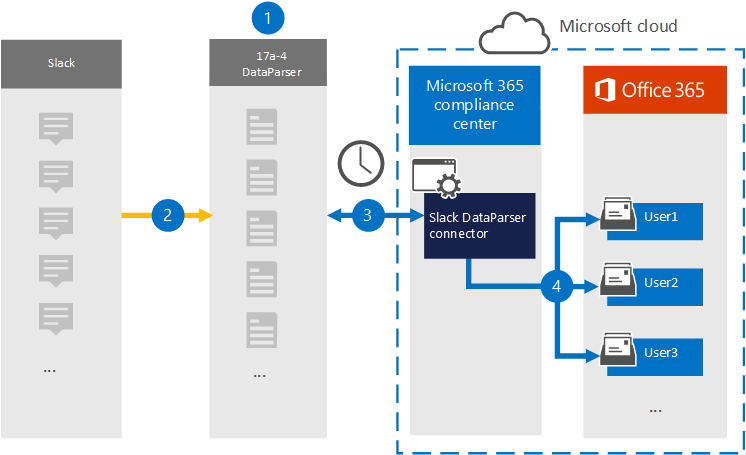

# 設定 (預覽中封存寬限資料的連接器) 

使用[DataParser 從 17a-4 LLC](https://www.17a-4.com/slack-dataparser/)匯入延後平臺中的資料，並將其封存至您 Microsoft 365 組織中的使用者信箱。 DataParser 包含的寬延時間連接器設定為從協力廠商資料來源捕獲專案，並將這些專案匯入 Microsoft 365。 [自動寬限 DataParser] 連接器會將可寬延時間的資料轉換成電子郵件格式，然後將這些專案匯入 Microsoft 365 中的使用者信箱。

將寬限資料儲存在使用者信箱之後，您可以套用 Microsoft 365 合規性功能，例如訴訟暫止、eDiscovery、保留原則和保留標籤，以及通訊法規遵從性。 使用時差連接器在 Microsoft 365 中匯入和封存資料，可協助您的組織遵守政府和法規原則。

## 封存寬限資料的概覽

下列概要說明如何使用資料連線器在 Microsoft 365 中封存時差資料。

1. 您的組織可以搭配17a-4 來設定和設定寬限 DataParser。

2. DataParser 會定期收集寬延時間專案。 DataParser 也會將郵件的內容轉換為電子郵件訊息格式。

3. 您在 Microsoft 365 合規性中心中建立的寬延時間 DataParser 連接器會連線至 DataParser，並將郵件傳輸至 Microsoft 雲端中的安全 Azure 儲存體位置。

4. 在使用者信箱中建立名為 [ **時差 DataParser** ] 的 [收件匣] 資料夾中的子資料夾，而且會將寬限專案匯入該資料夾。 連接器會使用 *Email* 屬性的值來決定要匯入專案的信箱。 每個寬限專案都包含此屬性，其是以每位參與者的電子郵件地址填入。

## 在您設定連接器之前

- 建立 Microsoft 連接器的 DataParser 帳戶。 若要這麼做，請與我們聯繫 [-4 LLC](https://www.17a-4.com/contact/)。 當您在步驟1中建立連接器時，您必須登入此帳戶。

- 在步驟1中建立時差 DataParser 連接器的使用者 (，並在步驟 3) 中完成，必須指派 Exchange Online 中的「信箱匯入匯出」角色。 在 Microsoft 365 合規性中心中的 [**資料連線器**] 頁面上新增連接器時，此角色是必要的。 根據預設，此角色不會指派給 Exchange Online 中的角色群組。 您可以將信箱匯入匯出角色新增至 Exchange Online 中的「組織管理」角色群組。 或者，您可以建立角色群組、指派信箱匯入匯出角色，然後將適當的使用者新增為成員。 如需詳細資訊，請參閱「在 Exchange Online 中管理角色群組」一文中的 [[建立角色群組](/Exchange/permissions-exo/role-groups#create-role-groups)或[修改角色](/Exchange/permissions-exo/role-groups#modify-role-groups)群組] 區段。

## 步驟1：設定時差 DataParser 連接器

第一步是存取 [Microsoft 365 合規性中心中的資料連線器] 頁面，並為寬限資料建立17a-4 連接器。

1. 移至 <https://compliance.microsoft.com> ，然後按一下 [**資料連線器**  >  **時差 DataParser**]。

2. 在 [ **時差 DataParser** 產品描述] 頁面上，按一下 [ **新增連接器**]。

3. 在 [ **服務條款** ] 頁面上，按一下 [ **接受**]。

4. 輸入識別連接器的唯一名稱，然後按 **[下一步]**。

5. 登入您的17a-4 帳戶，並完成 [寬限 DataParser 連接嚮導] 中的步驟。

## 步驟2：設定寬延時間 DataParser 連接器

使用17a-4 支援來設定寬延時間 DataParser 連接器。

## 步驟3：對應使用者

在將資料匯入 Microsoft 365 之前，寬限 DataParser 連接器會自動將使用者對應至其 Microsoft 365 電子郵件地址。

## 步驟4：監控寬限 DataParser 連接器

在您建立寬延時間 DataParser 連接器之後，您可以在 Microsoft 365 合規性中心中查看連接器狀態。

1. 移至 <https://compliance.microsoft.com> 並按一下左側導覽中的 [ **資料連線器** ]。

2. 按一下 [ **連接器** ] 索引標籤，然後選取所建立的寬延時間 DataParser 連接器，以顯示飛出頁面，該頁面包含連接器的屬性和資訊。

3. 在 [ **連接器狀態與來源**] 底下，按一下 [ **下載記錄** ] 連結，以開啟連接器的狀態記錄 (或儲存) 。 此記錄檔包含已匯入至 Microsoft 雲端的資料。

## 已知問題

此時，我們不支援匯入大於 10 MB 的附件或專案。 稍後將提供對較大專案的支援。
