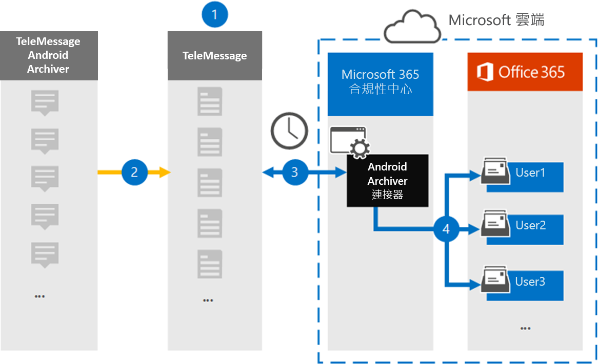

# 設定連接器以封存 Android 行動電話資料

使用 Microsoft 365 規範中心的 TeleMessage 連接器，從 Android 行動電話匯入並封存 SMS、MMS、語音通話及通話記錄。 在您設定及設定連接器之後，它每天會連線到您組織的 TeleMessage 帳戶，並將使用 TeleMessage Android 歸檔人員的員工行動通訊，匯入至 Microsoft 365 中的信箱。

當 Android 行動電話中的資料儲存在使用者信箱之後，您可以將 Microsoft 365 規範功能（例如訴訟暫止、內容搜尋）和 Microsoft 365 保留原則，套用至 Android 歸檔資料。 例如，您可以使用內容搜尋來搜尋 Android 記錄器行動通訊，或在高級 eDiscovery 案例中，將包含 Android 歸檔程式資料的信箱與保管人相關聯。 使用 Android 歸檔連接器在 Microsoft 365 中匯入和封存資料，可協助您的組織遵守政府和法規原則。

## Android mobile 資料封存簡介

下列概要說明如何使用連接器將 Microsoft 365 中的 Android mobile 資料封存。

1. 您的組織與 TeleMessage 搭配使用，以設定 Android 的歸檔連接器。 如需詳細資訊，請參閱 [Android 歸檔](https://www.telemessage.com/office365-activation-for-android-archiver/)程式。

2. 每24小時一次，來自組織的 Android 行動電話的 SMS、MMS、語音通話及通話記錄會複製到 TeleMessage 網站。

3. 您在 Microsoft 365 合規性中心建立的 Android 歸檔連接器會每天連線到 TeleMessage 網站，並將以前24小時的 Android 資料傳送至 Microsoft 雲端中的安全 Azure 儲存位置。 連接器也會將 Android 資料轉換成電子郵件格式。

4. 連接器會將行動通訊專案匯入特定使用者的信箱。 在特定使用者的信箱中建立名為 Android 建立器的新資料夾，並將這些專案匯入該資料夾。 連接器會使用 *使用者的電子郵件地址* 屬性值進行對應。 每封電子郵件都包含此內容，該屬性會填入電子郵件的每個參與者的電子郵件地址。 除了使用 *使用者之電子郵件地址* 屬性值的自動使用者對應，您也可以透過上載 CSV 對應檔來定義自訂對應。 這個對應檔案應該包含使用者的行動電話號碼，以及每位使用者對應的 Microsoft 365 信箱位址。 如果您啟用自動使用者對應，並提供自訂對應，則每個電子郵件專案連接器都會先查看自訂對應檔案。 如果找不到與使用者的行動電話號碼相對應的有效 Microsoft 365 使用者，連接器會使用該電子郵件專案的使用者電子郵件地址屬性。 如果連接器在自訂對應檔案或電子郵件專案的 [ *電子郵件地址* ] 屬性中找不到有效的 Microsoft 365 使用者，則不會匯入該專案。

## 開始之前

封存 Android 通訊資料所需的部分執行步驟是 Microsoft 365 的外部，必須先完成，您才能在規範中心建立連接器。

- [從 TeleMessage 訂購 Android 歸檔服務](https://www.telemessage.com/mobile-archiver/order-mobile-archiver-for-o365)，並取得組織的有效管理帳戶。 您必須在建立連接器時登入此帳戶。

- 在 TeleMessage 帳戶中，註冊所有需要 Android 歸檔服務的使用者。 註冊使用者時，請務必使用與 Microsoft 365 帳戶所用相同的電子郵件地址。

- 在您員工的行動電話上安裝及啟用 TeleMessage Android 歸檔應用程式。

- 在 Exchange Online 中，必須將信箱匯入匯出角色指派給建立 Android 歸檔連接器的使用者。 在 Microsoft 365 規範中心的 [ **資料連線器** ] 頁面中新增連接器時，這是必要的。 依預設，此角色不會指派給 Exchange Online 內的任何角色群組。 您可以將信箱匯入匯出角色新增至 Exchange Online 中的「組織管理」角色群組。 或者，您可以建立角色群組、指派信箱匯入匯出角色，然後將適當的使用者新增為成員。 如需詳細資訊，請參閱「管理 Exchange Online 中的角色群組」一文中的 [ [建立角色群組](https://docs.microsoft.com/Exchange/permissions-exo/role-groups#create-role-groups) 或 [修改角色群組](https://docs.microsoft.com/Exchange/permissions-exo/role-groups#modify-role-groups) ] 區段。

## 建立 Android 歸檔連接器

最後一個步驟是在 Microsoft 365 規範中心建立 Android 歸檔連接器。 連接器會使用您提供的資訊來連線至 TeleMessage 網站，並將 Android 通訊傳送至 Microsoft 365 中對應的使用者信箱方塊。

1. 移至 [https://compliance.microsoft.com](https://compliance.microsoft.com) 並按一下 [**資料連線器**  >  **Android 歸檔** 器]。

2. 在 [ **Android 歸檔** 器產品描述] 頁面上，按一下 [ **新增連接器**]。

3. 在 [ **服務條款** ] 頁面上，按一下 [ **接受**]。

4. 在 [ **登入 TeleMessage** ] 頁面的 [步驟 3] 下，于下列方塊中輸入必要的資訊，然後按 **[下一步]**。

   - 使用者 **名稱：** 您的 TeleMessage 使用者名稱。

   - **密碼：** 您的 TeleMessage 密碼。

5. 建立連接器之後，關閉快顯視窗，然後按 **[下一步**]。

6. 在 [ **使用者對應** ] 頁面上啟用 [自動使用者對應]，然後按 **[下一步]**。 如果您需要自訂對應，請上載 CSV 檔案，然後按 **[下一步]**。

7. 請複查您的設定，然後按一下 **[完成]** 以建立連接器。

8. 移至 [ **資料連線器** ] 頁面中的 [連接器] 索引標籤，以查看新連接器的匯入程式的進度。

## 已知問題

- 此時，我們不支援匯入大於 10 MB 的附件或專案。 稍後將提供對較大專案的支援。
