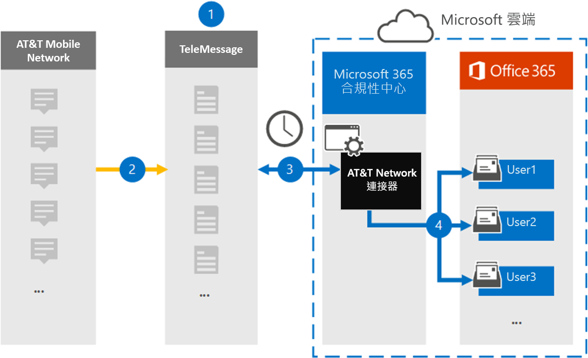

# 設定在&T SMS/MMS 資料 (預覽時進行封存的連接器) 

使用 Microsoft 365 規範中心的 TeleMessage 連接器，從&T 行動電話匯入並封存 SMS 和 MMS 資料。 在您設定及設定連接器之後，它每天會連線到您的組織&T 網路一次，並將 SMS 和 MMS 資料匯入 Microsoft 365 中的信箱。

在將 SMS 和 MMS 郵件儲存在使用者信箱之後，您可以將 Microsoft 365 規範功能（例如訴訟暫止、內容搜尋）和 Microsoft 365 保留原則套用至&T 網路資料。 例如，您可以使用內容搜尋來搜尋&T 網路資料，或在高級 eDiscovery 案例中，將包含&T 網路連接器資料的信箱與保管人建立關聯。 在 Microsoft 365 中使用 AT&T 網路連接器匯入和封存資料，可協助您的組織遵守政府和法規原則。

## 在&T 網路資料中封存的概覽

下列概要說明如何使用連接器封存 Microsoft 365 中&T 網路資料。

1. 您的組織與 TeleMessage 搭配使用，以設定&T 網路連接器。 如需詳細資訊，請參閱[&T 網路存檔](https://www.telemessage.com/office365-activation-for-atnt-network-archiver/)器。

2. 每24小時一次，來自組織之&T 網路的 SMS 和 MMS 郵件會複製到 TeleMessage 網站。

3. 您在 Microsoft 365 合規性中心建立的 AT&T 網路連接器每天會連線至 TeleMessage 網站，並將 SMS 和 MMS 郵件從過去24小時傳送至 Microsoft 雲端中的安全 Azure 存放位置。 連接器也會將 SMS 和 MMS 郵件的內容轉換成電子郵件訊息格式。

4. 連接器會將行動通訊專案匯入至特定使用者的信箱。 在使用者的信箱中會建立名稱為 **&T SMS/MMS 網路**上的新資料夾，並將這些專案匯入其中。 連接器會使用*使用者的電子郵件地址*屬性值來進行對應。 每個 SMS 和彩信都包含此內容，該屬性會填入郵件的每個參與者的電子郵件地址。
 
   除了使用*使用者之電子郵件地址*屬性值的自動使用者對應，您也可以透過上載 CSV 對應檔來定義自訂對應。 此對應檔包含組織中使用者的行動電話號碼和對應的 Microsoft 365 電子郵件地址。 如果您同時啟用自動使用者對應及自訂對應，連接器會先查看自訂對應檔案。 如果找不到與行動電話號碼對應的有效 Microsoft 365 使用者，連接器會使用嘗試匯入之專案的電子郵件地址屬性值。 如果連接器在自訂對應檔案中或電子郵件專案的電子郵件地址屬性中找不到有效的 Microsoft 365 使用者，則不會匯入該專案。

## 開始之前

在&T 網路資料上進行封存所需的許多執行步驟，都是 Microsoft 365 的外部，必須先完成，您才能在規範中心建立連接器。

- 從 TeleMessage 定購行動性[歸檔服務](https://www.telemessage.com/mobile-archiver/order-mobile-archiver-for-o365/)，並為您的組織取得有效的管理帳戶。 當您在規範中心建立連接器時，您必須登入此帳戶。

- 在&T 帳戶和計費連絡人詳細資料中取得您的，這樣您就可以在&T 上填滿 TeleMessage 上架表單並排序郵件封存服務。

- 在 TeleMessage 帳戶中，註冊所有需要&T SMS/MMS 網路封存的使用者。 註冊使用者時，請務必使用與 Microsoft 365 帳戶所用相同的電子郵件地址。

- 您的員工在&T 行動電話上必須擁有公司擁有及公司的行動電話。 在 Microsoft 365 中封存郵件無法供員工擁有，或「帶您自己的裝置 (BYOD) 裝置。

- 您的組織必須同意允許 Office 365 匯入服務存取您組織中的信箱資料。 當您建立連接器時，將需要提供此同意。 若要同意此要求，請移至[此頁面](https://login.microsoftonline.com/common/oauth2/authorize?client_id=570d0bec-d001-4c4e-985e-3ab17fdc3073&response_type=code&redirect_uri=https://portal.azure.com/&nonce=1234&prompt=admin_consent)，使用 Office 365 全域管理員的認證登入，然後接受要求。 您必須完成此步驟，才能成功建立&T 網路連接器。

- 在 Exchange Online 中，您必須將信箱匯入匯出角色指派給在&T 網路連接器上建立的使用者。 在 Microsoft 365 規範中心的 [**資料連線器**] 頁面中新增連接器時，這是必要的。 依預設，此角色不會指派給 Exchange Online 內的任何角色群組。 您可以將信箱匯入匯出角色新增至 Exchange Online 中的「組織管理」角色群組。 或者，您可以建立角色群組、指派信箱匯入匯出角色，然後將適當的使用者新增為成員。 如需詳細資訊，請參閱「管理 Exchange Online 中的角色群組」一文中的 [[建立角色群組](https://docs.microsoft.com/Exchange/permissions-exo/role-groups#create-role-groups)或[修改角色群組](https://docs.microsoft.com/Exchange/permissions-exo/role-groups#modify-role-groups)] 區段。

## 在&T 網路連接器上建立

在您完成上一節所述的必要條件之後，您可以在 Microsoft 365 規範中心內建立「&T 網路連接器」。 連接器會使用您提供的資訊來連線至 TeleMessage 網站，並將 SMS 和 MMS 郵件轉接至 Microsoft 365 中對應的使用者信箱方塊。

1. 移至 [https://compliance.microsoft.com](https://compliance.microsoft.com/) ，然後按一下 [**資料連線器**]，然後按一下 [  \  **&T 網路**]。

2. 在 [ **&T 網路產品**描述] 頁面上，按一下 [**新增連接器**]

3. 在 [**服務條款**] 頁面上，按一下 [**接受**]。

4. 在 [**登入 TeleMessage** ] 頁面的 [步驟 3] 下，于下列方塊中輸入必要的資訊，然後按 **[下一步]**。

   - 使用者**名稱：** 您的 TeleMessage 使用者名稱。

   - **密碼：** 您的 TeleMessage 密碼。

5. 建立連接器之後，您可以關閉快顯視窗，然後移至下一個頁面。

6. 在 [**使用者對應**] 頁面上，啟用自動使用者對應。 若要啟用自訂對應，請上傳包含使用者對應資訊的 CSV 檔案，然後按 **[下一步]**。

7. 提供系統管理員同意，然後按 **[下一步]**。

   若要提供系統管理員同意，您必須以 Office 365 全域管理員的認證登入，然後接受同意要求。 如果您未以全域系統管理員身分登入，您可以移至[此頁面](https://login.microsoftonline.com/common/oauth2/authorize?client_id=570d0bec-d001-4c4e-985e-3ab17fdc3073&response_type=code&redirect_uri=https://portal.azure.com/&nonce=1234&prompt=admin_consent)，並使用全域系統管理員認證登入，以接受要求。 

8. 請複查您的設定，然後按一下 **[完成]** 以建立連接器。

9. 移至「規範中心」的 [**資料連線器**] 頁面上的 [**連接器**] 索引標籤，以查看新連接器的匯入程式的處理進度。

## 已知問題

- 連接器不會匯入大於 10 MB 的任何專案。
