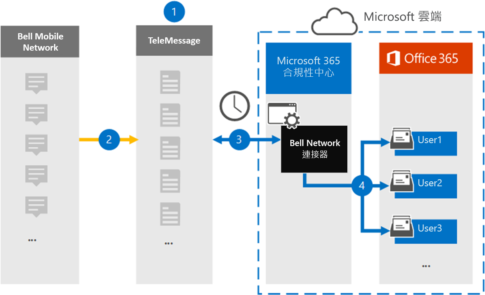

# 設定連接器以進行封存鈴聲網路資料Set up a connector to archive Bell Network data

使用 Microsoft 365 規範中心內的 TeleMessage 連接器，匯入及封存短信服務 (SMS) 和多媒體訊息服務 (MMS) 來自電鈴網路的郵件。Use a TeleMessage connector in the Microsoft 365 compliance center to import and archive Short Messaging Service (SMS) and Multimedia Messaging Service (MMS) messages from the Bell Network. 在您設定及設定連接器之後，它每天會連線到您組織的震鈴網路，並將 SMS 和 MMS 郵件匯入至 Microsoft 365 中的信箱。After you set up and configure a connector, it connects to your organization's Bell Network once every day, and imports SMS and MMS messages to mailboxes in Microsoft 365.

在將 SMS 和 MMS 郵件儲存在使用者信箱之後，您可以套用 Microsoft 365 合規性功能，例如訴訟暫止、內容搜尋，以及 Microsoft 365 保留原則，以震鈴網路資料。After the SMS and MMS messages are stored in user mailboxes, you can apply Microsoft 365 compliance features such as Litigation Hold, Content Search, and Microsoft 365 retention policies to Bell Network data. 例如，您可以使用內容搜尋來搜尋鈴聲網路 SMS/MMS，或在高級 eDiscovery 案例中，將包含電鈴網路連接器資料的信箱與保管人產生關聯。For example, you can search Bell Network SMS/MMS using Content Search or associate the mailbox that contains the Bell Network connector data with a custodian in an Advanced eDiscovery case. 使用鈴聲網路連接器匯入和封存 Microsoft 365 中的資料可協助您的組織遵守政府和法規原則。Using a Bell Network connector to import and archive data in Microsoft 365 can help your organization stay compliant with government and regulatory policies.

## 封存鈴聲網路資料的概覽Overview of archiving Bell Network data

下列概要說明如何使用連接器封存 Microsoft 365 中的震鈴網路資料。The following overview explains the process of using a connector to archive Bell Network data in Microsoft 365.

1. 您的組織與 TeleMessage 和電鈴搭配使用，以設定電鈴網路連接器。Your organization works with TeleMessage and Bell to set up a Bell Network connector. 如需詳細資訊，請參閱 [鈴聲網路存檔](https://www.telemessage.com/office365-activation-for-bell-network-archiver)器。For more information, see [Bell Network Archiver](https://www.telemessage.com/office365-activation-for-bell-network-archiver).

2. 每24小時一次，來自組織的鈴聲網路的 SMS 和 MMS 郵件會複製到 TeleMessage 網站。Once every 24 hours, SMS and MMS messages from your organization’s Bell Network are copied to the TeleMessage site.

3. 您在 Microsoft 365 合規性中心建立的電鈴網路連接器每天會連線至 TeleMessage 網站，並將 SMS 和 MMS 郵件從過去24小時傳送至 Microsoft 雲端中的安全 Azure 儲存位置。The Bell Network connector that you create in the Microsoft 365 compliance center connects to the TeleMessage site every day and transfers the SMS and MMS messages from the previous 24 hours to a secure Azure Storage location in the Microsoft Cloud. 連接器也會將 SMS 和 MMS 郵件的內容轉換成電子郵件訊息格式。The connector also converts the content of SMS and MMS messages to an email message format.

4. 連接器會將行動通訊專案匯入至特定使用者的信箱。The connector imports the mobile communication items to the mailbox of specific users. 在特定使用者的信箱中建立一個名為「 **電鈴 SMS/MMS 網路存檔** 」的新資料夾，並將這些專案匯入至該資料夾。A new folder named **Bell SMS/MMS Network Archiver** is created in a specific user's mailbox and the items are imported to it. 連接器會使用 *使用者的電子郵件地址* 屬性值來進行對應。The connector does this mapping by using the value of the *User’s Email address* property. 每個 SMS 和彩信都包含此內容，該屬性會填入郵件的每個參與者的電子郵件地址。Every SMS and MMS message contains this property, which is populated with the email address of every participant of the message.

   除了使用 *使用者之電子郵件地址* 屬性值的自動使用者對應，您也可以透過上載 CSV 對應檔來定義自訂對應。In addition to automatic user mapping using the value of the *User’s Email address* property, you can also define a custom mapping by uploading a CSV mapping file. 此對應檔包含組織中使用者的行動電話號碼和對應的 Microsoft 365 電子郵件地址。This mapping file contains the mobile phone number and corresponding Microsoft 365 email address for users in your organization. 如果您為每個電鈴網路專案啟用自動使用者對應及自訂對應，連接器會先查看自訂對應檔案。If you enable both automatic user mapping and custom mapping, for every Bell Network item the connector first looks at custom mapping file. 如果找不到對應至使用者行動電話號碼的有效 Microsoft 365 使用者，連接器會使用嘗試匯入之專案的電子郵件地址屬性值。If it doesn't find a valid Microsoft 365 user that corresponds to a user's mobile phone number, the connector will use the values in the email address property of the item it's trying to import. 如果連接器在自訂對應檔或 [電鈴網路專案] 的 [電子郵件地址] 屬性中找不到有效的 Microsoft 365 使用者，則不會匯入該專案。If the connector doesn't find a valid Microsoft 365 user in either the custom mapping file or in the email address property of the Bell Network item, the item won't be imported.

## 開始之前Before you begin

封存震鈴網路資料所需的部分執行步驟是 Microsoft 365 的外部，必須先完成，才能在規範中心建立連接器。Some of the implementation steps required to archive Bell Network data are external to Microsoft 365 and must be completed before you can create a connector in the compliance center.

- [從 TeleMessage 定購電鈴網路歸檔服務](https://www.telemessage.com/mobile-archiver/order-mobile-archiver-for-o365/)，並取得組織的有效管理帳戶。Order the [Bell Network Archiver service from TeleMessage](https://www.telemessage.com/mobile-archiver/order-mobile-archiver-for-o365/) and get a valid administration account for your organization. 當您在規範中心建立連接器時，您必須登入此帳戶。You'll need to sign into this account when you create the connector in the compliance center.

- 取得您的鈴聲網路帳戶和計費連絡人詳細資料，以便您可以填寫 TeleMessage 上架表單，並從電鈴訂購郵件封存服務。Obtain your Bell Network account and billing contact details so you can fill-out the TeleMessage onboarding forms and order the message archiving service from Bell.

- 在 TeleMessage 帳戶中，註冊所有需要震鈴 SMS/MMS 網路封存的使用者。Register all users that require Bell SMS/MMS Network archiving in the TeleMessage account. 註冊使用者時，請務必使用與 Microsoft 365 帳戶所用相同的電子郵件地址。When registering users, be sure to use the same email address that's used for their Microsoft 365 account.

- 您的員工在鈴行動網路上必須擁有公司擁有和公司的行動電話。Your employees must have corporate-owned and corporate-liable mobile phones on the Bell mobile network. 在 Microsoft 365 中封存郵件無法供員工擁有，或「帶您自己的裝置 (BYOD) 裝置。Archiving messages in Microsoft 365 isn't available for employee-owned or "Bring Your Own Devices (BYOD) devices.

- 在 Exchange Online 中，必須將信箱匯入匯出角色指派給建立電鈴網路連接器的使用者。The user who creates a Bell Network connector must be assigned the Mailbox Import Export role in Exchange Online. 在 Microsoft 365 規範中心的 [ **資料連線器** ] 頁面中新增連接器時，這是必要的。This is required to add connectors in the **Data connectors** page in the Microsoft 365 compliance center. 依預設，此角色不會指派給 Exchange Online 內的任何角色群組。By default, this role isn't assigned to any role group in Exchange Online. 您可以將信箱匯入匯出角色新增至 Exchange Online 中的「組織管理」角色群組。You can add the Mailbox Import Export role to the Organization Management role group in Exchange Online. 或者，您可以建立角色群組、指派信箱匯入匯出角色，然後將適當的使用者新增為成員。Or you can create a role group, assign the Mailbox Import Export role, and then add the appropriate users as members. 如需詳細資訊，請參閱「管理 Exchange Online 中的角色群組」一文中的 [ [建立角色群組](https://docs.microsoft.com/Exchange/permissions-exo/role-groups#create-role-groups) 或 [修改角色群組](https://docs.microsoft.com/Exchange/permissions-exo/role-groups#modify-role-groups) ] 區段。For more information, see the [Create role groups](https://docs.microsoft.com/Exchange/permissions-exo/role-groups#create-role-groups) or [Modify role groups](https://docs.microsoft.com/Exchange/permissions-exo/role-groups#modify-role-groups) sections in the article "Manage role groups in Exchange Online".

## 建立電鈴網路連接器Create a Bell Network connector

最後一個步驟是在 Microsoft 365 規範中心建立電鈴網路連接器。The last step is to create a Bell Network connector in the Microsoft 365 compliance center. 連接器會使用您提供的資訊來連線至 TeleMessage 網站，並將 SMS/MMS 郵件轉接至 Microsoft 365 中對應的使用者信箱方塊。The connector uses the information you provide to connect to the TeleMessage site and transfer SMS/ MMS messages to the corresponding user mailbox boxes in Microsoft 365.

1. 移至 [https://compliance.microsoft.com](https://compliance.microsoft.com) ，然後按一下 [**資料連線器**]  >  **鈴聲 SMS/MMS 網路** 記錄器。Go to [https://compliance.microsoft.com](https://compliance.microsoft.com) and then click **Data connectors** > **Bell SMS/MMS Network Archiver**.

2. 在 [**鈴聲網路** 產品描述] 頁面上，按一下 [**新增連接器**]On the **Bell Network** product description page, click **Add connector**

3. 在 [ **服務條款** ] 頁面上，按一下 [ **接受**]。On the **Terms of service** page, click **Accept**.

4. 在 [ **登入 TeleMessage** ] 頁面的 [步驟 3] 下，于下列方塊中輸入必要的資訊，然後按 **[下一步]**。On the **Login to TeleMessage** page, under Step 3, enter the required information in the following boxes and then click **Next**.

   - 使用者 **名稱：** 您的 TeleMessage 使用者名稱。**Username:** Your TeleMessage username.

   - **密碼：** 您的 TeleMessage 密碼。**Password:** Your TeleMessage password.

5. 建立連接器之後，您可以關閉快顯視窗，然後移至下一個頁面。After the connector is created, you can close the pop-up window and go to the next page.

6. 在 [ **使用者對應** ] 頁面上，啟用自動使用者對應。On the **User mapping** page, enable automatic user mapping. 若要啟用自訂對應，請上傳包含使用者對應資訊的 CSV 檔案，然後按 **[下一步]**。To enable custom mapping, upload a CSV file that contains the user mapping information, and then click **Next**.

7. 請複查您的設定，然後按一下 **[完成]** 以建立連接器。Review your settings, and then click **Finish** to create the connector.

8. 移至「規範中心」的 [**資料連線器**] 頁面上的 [**連接器**] 索引標籤，以查看新連接器的匯入程式的處理進度。Go to the **Connectors** tab on the **Data connectors** page in the compliance center to see the progress of the import process for the new connector.

## 已知問題Known issues

- 此時，我們不支援匯入大於 10 MB 的附件或專案。At this time, we don't support importing attachments or items that are larger than 10 MB. 稍後將提供對較大專案的支援。Support for larger items will be available at a later date.
