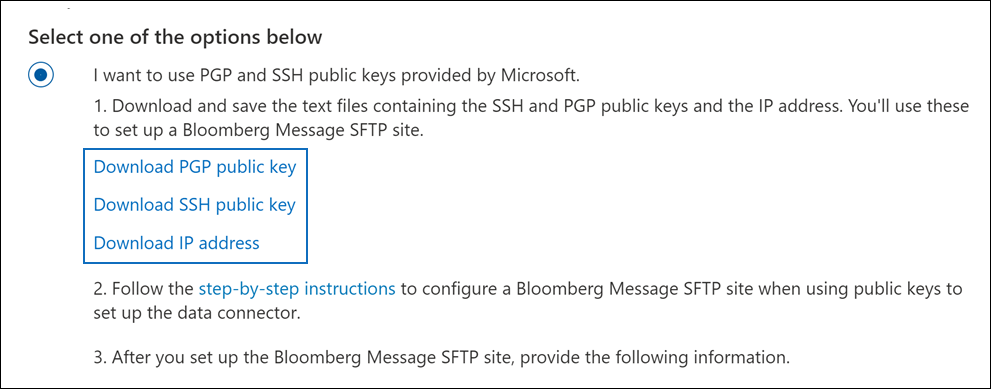

# 設定連接器以封存 Bloomberg 郵件資料Set up a connector to archive Bloomberg Message data

使用 Microsoft 365 規範中心內的資料連線器，從[Bloomberg 郵件](https://www.bloomberg.com/professional/product/collaboration/)共同作業工具匯入及封存金融服務電子郵件資料。Use a data connector in the Microsoft 365 compliance center to import and archive financial services email data from the [Bloomberg Message](https://www.bloomberg.com/professional/product/collaboration/) collaboration tool. 在您設定及設定連接器之後，它會連線到您組織的 Bloomberg secure FTP (SFTP) 網站一次，並將電子郵件專案匯入 Microsoft 365 中的信箱。After you set up and configure a connector, it connects to your organization's Bloomberg secure FTP (SFTP) site once every day, and imports email items to mailboxes in Microsoft 365.

將 Bloomberg 郵件資料儲存在使用者信箱之後，您就可以套用 Microsoft 365 合規性功能，例如訴訟資料暫止、內容搜尋、就地封存、審核、通訊相容性，以及 Microsoft 365 保留原則，以 Bloomberg 郵件資料。After Bloomberg Message data is stored in user mailboxes, you can apply Microsoft 365 compliance features such as Litigation hold, content search, In-place archiving, auditing, Communication compliance, and Microsoft 365 retention policies to Bloomberg Message data. 例如，您可以使用內容搜尋工具搜尋 Bloomberg 郵件電子郵件，或在 Advanced eDiscovery 案例中關聯包含 Bloomberg 郵件資料與保管人的信箱。For example, you can search Bloomberg Message emails using the content search tool or associate the mailbox that contains the Bloomberg Message data with a custodian in an Advanced eDiscovery case. 使用 Bloomberg 郵件連接器在 Microsoft 365 中匯入和封存資料，可協助您的組織遵守政府和法規原則。Using a Bloomberg Message connector to import and archive data in Microsoft 365 can help your organization stay compliant with government and regulatory policies.

## 封存 Bloomberg 訊息資料的概覽Overview of archiving Bloomberg Message data

下列概要說明如何使用連接器封存 Microsoft 365 中的 Bloomberg 郵件資料。The following overview explains the process of using a connector to archive Bloomberg Message data in Microsoft 365.

1. 您的組織與 Bloomberg 搭配使用，以設定 Bloomberg SFTP 網站。Your organization works with Bloomberg to set up a Bloomberg SFTP site. 您也可以使用 Bloomberg 設定 Bloomberg 郵件，將電子郵件傳送至 Bloomberg SFTP 網站。You'll also work with Bloomberg to configure Bloomberg Message to copy email messages to the Bloomberg SFTP site.

2. 每24小時一次，Bloomberg 郵件的電子郵件會複製到 Bloomberg SFTP 網站。Once every 24 hours, email messages from Bloomberg Message are copied to the Bloomberg SFTP site.

3. 您在 Microsoft 365 合規性中心內建立的 Bloomberg 郵件連接器每天會連線至 Bloomberg SFTP 網站，並將電子郵件訊息從過去24小時傳送至 Microsoft 雲端中的安全 Azure 儲存體區域。The Bloomberg Message connector that you create in the Microsoft 365 compliance center connects to the Bloomberg SFTP site every day and transfers the email messages from the previous 24 hours to a secure Azure Storage area in the Microsoft Cloud.

4. 連接器會將電子郵件專案匯入特定使用者的信箱。The connector imports the email message items to the mailbox of a specific user. 在特定使用者的信箱中建立名為 BloombergMessage 的新資料夾，並將這些專案匯入該資料夾。A new folder named BloombergMessage is created in the specific user's mailbox and the items will be imported to it.

   連接器會使用 CorporateEmailAddress 屬性的值來執行此動作。The connector does this by using the value of the CorporateEmailAddress property. 每封電子郵件都包含此內容，該屬性會填入電子郵件的每個參與者的電子郵件地址。Every email message contains this property, which is populated with the email address of every participant of the email message. 除了使用 *CorporateEmailAddress* 屬性的值進行自動使用者對應之外，您也可以透過上載 CSV 對應檔來定義自訂對應。In addition to automatic user mapping using the value of the *CorporateEmailAddress* property, you can also define a custom mapping by uploading a CSV mapping file. 此對應檔包含組織中每位使用者的 Bloomberg UUID 和對應的 Microsoft 365 信箱位址。This mapping file contains a Bloomberg UUID and the corresponding Microsoft 365 mailbox address for each user in your organization. 如果您啟用自動使用者對應，並提供自訂對應，則每個電子郵件專案連接器都會先查看自訂對應檔案。If you enable automatic user mapping and provide a custom mapping, for every email item the connector will first look at the custom-mapping file. 如果找不到有效的 Microsoft 365 使用者與使用者的 Bloomberg UUID，連接器會使用電子郵件專案的 *CorporateEmailAddress* 屬性。If it doesn't find a valid Microsoft 365 user that corresponds to a user's Bloomberg UUID, the connector uses the *CorporateEmailAddress* property of the email item. 如果連接器在自訂對應檔案或電子郵件專案的 *CorporateEmailAddress* 屬性中找不到有效的 Microsoft 365 使用者，則不會匯入該專案。If the connector doesn't find a valid Microsoft 365 user in either the custom-mapping file or the *CorporateEmailAddress* property of the email item, the item won't be imported.

## 在您設定連接器之前Before you set up a connector

封存 Bloomberg 郵件資料所需的部分執行步驟是 Microsoft 365 外部的，必須先完成，才能在規範中心建立連接器。Some of the implementation steps required to archive Bloomberg Message data are external to Microsoft 365 and must be completed before you can create the connector in the compliance center.

- 若要設定 Bloomberg 郵件連接器，您必須使用金鑰和金鑰密碼短語，以取得非常好的隱私權 (PGP) 和安全命令介面 (SSH) 。To set up a Bloomberg Message connector, you have to use keys and key passphrases for Pretty Good Privacy (PGP) and Secure Shell (SSH). 這些機碼是用來設定 Bloomberg SFTP 網站，並由連接器用來連線至 Bloomberg SFTP 網站，以將資料匯入 Microsoft 365。These keys are used to configure the Bloomberg SFTP site and used by the connector to connect to the Bloomberg SFTP site to import data to Microsoft 365. PGP 金鑰是用來設定從 Bloomberg SFTP 網站傳輸到 Microsoft 365 的資料加密。The PGP key is used to configure the encryption of data that's transferred from the Bloomberg SFTP site to Microsoft 365. SSH 金鑰用於設定安全命令介面，以在連接器連線至 Bloomberg SFTP 網站時，啟用安全的遠端登入。The SSH key is used to configure secure shell to enable a secure remote login when the connector connects to the Bloomberg SFTP site.

  當您設定連接器時，可以選擇使用 Microsoft 提供的公開金鑰和金鑰密碼，也可以使用您自己的私密金鑰和密碼。When setting up a connector, you have the option to use public keys and key passphrases provided by Microsoft or you can use your own private keys and passphrases. 建議您使用 Microsoft 提供的公用金鑰。We recommend that you use the public keys provided by Microsoft. 不過，如果您的組織已使用私密金鑰設定 Bloomberg SFTP 網站，則可以使用這些相同的私密金鑰建立連接器。However, if your organization has already configured a Bloomberg SFTP site using private keys, then you can create a connector using these same private keys.

- 訂閱 [Bloomberg Anywhere](https://www.bloomberg.com/professional/product/remote-access/?bbgsum-page=DG-WS-PROF-PROD-BBA)。Subscribe to [Bloomberg Anywhere](https://www.bloomberg.com/professional/product/remote-access/?bbgsum-page=DG-WS-PROF-PROD-BBA). 這是必要的，讓您可以登入 Bloomberg 無所不在，以存取您必須設定及設定的 Bloomberg SFTP 網站。This is required so that you can log in to Bloomberg Anywhere to access the Bloomberg SFTP site that you have to set up and configure.

- 設定 Bloomberg SFTP (安全檔案傳輸通訊協定) 網站。Set up a Bloomberg SFTP (Secure file transfer protocol) site. 使用 Bloomberg 來設定 SFTP 網站後，每日會將 Bloomberg 郵件的資料上傳到 SFTP 網站。After working with Bloomberg to set up the SFTP site, data from Bloomberg Message is uploaded to the SFTP site every day. 您在步驟2中建立的連接器會連接到此 SFTP 網站，並將電子郵件資料傳送至 Microsoft 365 信箱。The connector you create in Step 2 connects to this SFTP site and transfers the email data to Microsoft 365 mailboxes. 在傳輸過程中，SFTP 也會加密傳送至信箱的 Bloomberg 郵件資料。SFTP also encrypts the Bloomberg Message data that is sent to mailboxes during the transfer process.

  如需 Bloomberg SFTP (也稱為 *BB-SFTP*) 的詳細資訊：For information about Bloomberg SFTP (also called *BB-SFTP*):

  - 請參閱 [Bloomberg 支援部門](https://www.bloomberg.com/professional/support/documentation/)的「SFTP Connectivity 標準」檔。See the "SFTP Connectivity Standards" document at [Bloomberg Support](https://www.bloomberg.com/professional/support/documentation/).

  - 請與 [Bloomberg 客戶支援](https://service.bloomberg.com/portal/sessions/new?utm_source=bloomberg-menu&utm_medium=csc)人員聯繫。Contact [Bloomberg customer support](https://service.bloomberg.com/portal/sessions/new?utm_source=bloomberg-menu&utm_medium=csc).

- 當您使用 Bloomberg 設定 SFTP 網站後，Bloomberg 會在您回應 Bloomberg 的實施電子郵件訊息之後，為您提供一些資訊。After you work with Bloomberg to set up an SFTP site, Bloomberg will provide some information to you after you respond to the Bloomberg implementation email message. 儲存下列資訊的複本。Save a copy of the following information. 您可以使用它在步驟3中設定連接器。You use it to set up a connector in Step 3.

  - 公司的程式碼，也就是您組織的識別碼，用來登入 Bloomberg SFTP 網站。Firm code, which is an ID for your organization and is used to log in to the Bloomberg SFTP site.

  - Bloomberg SFTP 網站的密碼Password for your Bloomberg SFTP site

  - Bloomberg SFTP 網站 (的 URL，例如，sftp.bloomberg.com) 。URL for Bloomberg SFTP site (for example, sftp.bloomberg.com). 此外，Bloomberg 也可以為 Bloomberg SFTP 網站提供對應的 IP 位址，也可以用來設定連接器。In addition, Bloomberg may also provide a corresponding IP address for the Bloomberg SFTP site, which also can be used to set up the connector.

  - Bloomberg SFTP 網站的埠號碼Port number for Bloomberg SFTP site

- 在一天內，Bloomberg 郵件連接器可匯入全部200000專案。The Bloomberg Message connector can import a total of 200,000 items in a single day. 如果 SFTP 網站上的專案超過200000個，將不會將這些專案匯入至 Microsoft 365。If there are more than 200,000 items on the SFTP site, none of those items will be imported to Microsoft 365.

- 在步驟 3 (中建立 Bloomberg 郵件連接器，並在步驟 1) 中下載公開金鑰及 IP 位址的使用者，必須在 Exchange Online 中指派「信箱匯入匯出」角色。The user who creates a Bloomberg Message connector in Step 3 (and who downloads the public keys and IP address in Step 1) must be assigned the Mailbox Import Export role in Exchange Online. 在 [Microsoft 365 規範中心] 的 [**資料連線器**] 頁面中新增連接器時，這是必要的。This is required to add connectors in the **Data connectors** page in the Microsoft 365 compliance center. 依預設，此角色不會指派給 Exchange Online 內的任何角色群組。By default, this role isn't assigned to any role group in Exchange Online. 您可以將信箱匯入匯出角色新增至 Exchange Online 中的「組織管理」角色群組。You can add the Mailbox Import Export role to the Organization Management role group in Exchange Online. 或者，您可以建立角色群組、指派信箱匯入匯出角色，然後將適當的使用者新增為成員。Or you can create a role group, assign the Mailbox Import Export role, and then add the appropriate users as members. 如需詳細資訊，請參閱「在 Exchange Online 中管理角色群組」一文中的 [[建立角色群組](/Exchange/permissions-exo/role-groups#create-role-groups)或[修改角色](/Exchange/permissions-exo/role-groups#modify-role-groups)群組] 區段。For more information, see the [Create role groups](/Exchange/permissions-exo/role-groups#create-role-groups) or [Modify role groups](/Exchange/permissions-exo/role-groups#modify-role-groups) sections in the article "Manage role groups in Exchange Online".

## 使用公開金鑰設定連接器Set up a connector using public keys

本節中的步驟說明如何使用 (PGP) 和安全命令介面 (SSH) 等保密的公開金鑰，設定 Bloomberg 郵件連接器。The steps in this section show you how to set up a Bloomberg Message connector using the public keys for Pretty Good Privacy (PGP) and Secure Shell (SSH).

### 步驟1：取得 PGP 和 SSH 公開金鑰Step 1: Obtain PGP and SSH public keys

第一步是取得 PGP 和 SSH 公開金鑰的複本。The first step is to obtain a copy of the PGP and SSH public keys. 您可以在步驟2中使用這些機碼來設定 Bloomberg SFTP 網站，以允許您在步驟3中建立的連接器 () 連線到 SFTP 網站，以及將 Bloomberg 郵件電子郵件資料轉移至 Microsoft 365 信箱。You use these keys in Step 2 to configure the Bloomberg SFTP site to allow the connector (that you create in Step 3) to connect to the SFTP site and transfer the Bloomberg Message email data to Microsoft 365 mailboxes. 您也可以在此步驟中取得 IP 位址，當您設定 Bloomberg SFTP 網站時，您可以使用此位址。You also obtain an IP address in this step, which you use when configuring the Bloomberg SFTP site.

1. 移至 <https://compliance.microsoft.com> 並按一下左側導覽中的 [ **資料連線器** ]。Go to <https://compliance.microsoft.com> and click **Data connectors** in the left nav.

2. 在 [ **Bloomberg 郵件**] 底下的 [**資料連線器**] 頁面上，按一下 [ **View**]。On the **Data connectors** page under **Bloomberg Message**, click **View**.

3. 在 [ **Bloomberg 訊息** 產品描述] 頁面上，按一下 [**新增連接器**]On the **Bloomberg Message** product description page, click **Add connector**

4. 在 [ **服務條款** ] 頁面上，按一下 [ **接受**]。On the **Terms of service** page, click **Accept**.

5. 在 [ **新增內容來源的認證** ] 頁面上，按一下 [ **我想要使用 MICROSOFT 提供的 PGP 和 SSH 公開金鑰**]。On the **Add credentials for content source** page, click **I want to use PGP and SSH public keys provided by Microsoft**.

   

6. 在 [步驟 1] 下，按一下 [ **下載 SSH 金鑰**]、[ **下載 PGP 金鑰**] 和 [ **下載 IP 位址** ] 連結，將每個檔案的副本儲存到本機電腦。Under step 1, click the **Download SSH key**, **Download PGP key**, and **Download IP address** links to save a copy of each file to your local computer.

   

   這些檔案包含下列專案，可用來設定步驟2中的 Bloomberg SFTP 網站：These files contain the following items that are used to configure the Bloomberg SFTP site in Step 2:

   - PGP 公開金鑰：此機碼是用來設定從 Bloomberg SFTP 網站傳輸到 Microsoft 365 的資料加密。PGP public key: This key is used to configure the encryption of data that's transferred from the Bloomberg SFTP site to Microsoft 365.

   - SSH 公開金鑰：此機碼用於設定安全命令介面，以在連接器連線至 Bloomberg SFTP 網站時，啟用安全的遠端登入。SSH public key: This key is used to configure secure shell to enable a secure remote login when the connector connects to the Bloomberg SFTP site.

   - IP 位址： Bloomberg SFTP 網站已設定為接受來自此 IP 位址的連線要求。IP address: The Bloomberg SFTP site is configured to accept connection requests from this IP address. Bloomberg 郵件連接器會使用相同的 IP 位址連線到 SFTP 網站，並將 Bloomberg 郵件資料傳輸至 Microsoft 365。The same IP address is used by the Bloomberg Message connector to connect to the SFTP site and transfer Bloomberg Message data to Microsoft 365.

7. 按一下 [ **取消** ] 關閉嚮導。Click **Cancel** to close the wizard. 您會回到步驟3中的這個嚮導，以建立連接器。You come back to this wizard in Step 3 to create the connector.

### 步驟2：設定 Bloomberg SFTP 網站Step 2: Configure the Bloomberg SFTP site

> [!NOTE]
> 如果您的組織先前已設定 Bloomberg SFTP 網站使用 public PGP 和 SSH 金鑰封存立即 Bloomberg 資料，您就不需要設定另一個。If your organization has previously set up a Bloomberg SFTP site to archive Instant Bloomberg data using public PGP and SSH keys, you don't have to set up another one. 當您在步驟3中建立連接器時，您可以指定相同的 SFTP 網站。You can specify the same SFTP site when you create the connector in Step 3.

下一步是使用您在步驟1中取得的 PGP 和 SSH 公開金鑰及 IP 位址，為 Bloomberg SFTP 網站設定 PGP 加密和 SSH 驗證。The next step is to use the PGP and SSH public keys and the IP address that you obtained in Step 1 to configure PGP encryption and SSH authentication for the Bloomberg SFTP site. 這可讓您在步驟3中建立的 Bloomberg 郵件連接器連線至 Bloomberg SFTP 網站，並將 Bloomberg 郵件資料傳輸至 Microsoft 365。This lets the Bloomberg Message connector that you create in Step 3 connect to the Bloomberg SFTP site and transfer Bloomberg Message data to Microsoft 365. 您需要與 Bloomberg 客戶支援合作，以設定 Bloomberg SFTP 網站。You need to work with Bloomberg customer support to set up your Bloomberg SFTP site. 請與 [Bloomberg 客戶支援](https://service.bloomberg.com/portal/sessions/new?utm_source=bloomberg-menu&utm_medium=csc) 部門聯繫以取得協助。Contact [Bloomberg customer support](https://service.bloomberg.com/portal/sessions/new?utm_source=bloomberg-menu&utm_medium=csc) for assistance.

> [!IMPORTANT]
> Bloomberg 建議您將您在步驟1中下載的三個檔案附加到電子郵件訊息，並將其傳送給他們的客戶支援小組，以設定 Bloomberg SFTP 網站時使用這些檔案。Bloomberg recommends that you attach the three files that you downloaded in Step 1 to an email message and send it to their customer support team when working with them to set up your Bloomberg SFTP site.

### 步驟3：建立 Bloomberg 郵件連接器Step 3: Create a Bloomberg Message connector

最後一個步驟是在 Microsoft 365 規範中心建立 Bloomberg 郵件連接器。The last step is to create a Bloomberg Message connector in the Microsoft 365 compliance center. 連接器會使用您提供的資訊來連線至 Bloomberg SFTP 網站，並將電子郵件傳送至 Microsoft 365 中對應的使用者信箱方塊。The connector uses the information you provide to connect to the Bloomberg SFTP site and transfer email messages to the corresponding user mailbox boxes in Microsoft 365.

1. 移至 <https://compliance.microsoft.com> 並按一下左側導覽中的 [ **資料連線器** ]。Go to <https://compliance.microsoft.com> and click **Data connectors** in the left nav.

2. 在 [ **Bloomberg 郵件**] 底下的 [**資料連線器**] 頁面上，按一下 [ **View**]。On the **Data connectors** page under **Bloomberg Message**, click **View**.

3. 在 [ **Bloomberg 訊息** 產品描述] 頁面上，按一下 [**新增連接器**]On the **Bloomberg Message** product description page, click **Add connector**

4. 在 [ **服務條款** ] 頁面上，按一下 [ **接受**]。On the **Terms of service** page, click **Accept**.

5. 在 [ **新增內容來源的認證** ] 頁面上，按一下 [ **我想要使用 MICROSOFT 提供的 PGP 和 SSH 公開金鑰**]。On the **Add credentials for content source** page, click **I want to use PGP and SSH public keys provided by Microsoft**.

6. 在 [步驟 3] 底下的下列方塊中，輸入必要的資訊，然後按一下 [ **驗證** 連線]。Under Step 3, enter the required information in the following boxes and then click **Validate connection**.

      - **名稱：** 連接器的名稱。**Name:** The name for the connector. 它在您的組織中必須是唯一的。It must be unique in your organization.

      - **確認程式碼：** 組織的識別碼，用作 Bloomberg SFTP 網站的使用者名稱。**Firm code:** The ID for your organization that is used as the username for the Bloomberg SFTP site.

      - **密碼：** 組織之 Bloomberg SFTP 網站的密碼。**Password:** The password for your organization's Bloomberg SFTP site.

      - **SFTP URL:** Bloomberg SFTP 網站的 URL (例如， `sftp.bloomberg.com`) 。**SFTP URL:** The URL for the Bloomberg SFTP site (for example, `sftp.bloomberg.com`). 您也可以使用此值的 IP 位址。You can also use an IP address for this value.

      - **SFTP 埠：** Bloomberg SFTP 網站的埠號碼。**SFTP port:** The port number for the Bloomberg SFTP site. 連接器會使用此埠連接到 SFTP 網站。The connector uses this port to connect to the SFTP site.

7. 成功驗證成功後，請按 **[下一步]**。After the connection is successfully validated, click **Next**.

8. 在 [將 **Bloomberg 郵件使用者對應至 Microsoft 365 使用者**] 頁面上，啟用 [自動使用者對應]，並視需要提供自訂使用者對應。On the **Map Bloomberg Message users to Microsoft 365 users** page, enable automatic user mapping and provide custom user mapping as required.

   > [!NOTE]
   > 連接器會將訊息項目匯入特定使用者的信箱。The connector imports message items to the mailbox of a specific user. 在特定使用者的信箱中建立名為 **BloombergMessage** 的新資料夾，並將這些專案匯入該資料夾。A new folder named **BloombergMessage** is created in the specific user's mailbox and the items will be imported to it. 連接器會使用 *CorporateEmailAddress* 屬性的值。The connector does by using the value of the *CorporateEmailAddress* property. 每個聊天訊息都包含此屬性，且該屬性會填入聊天訊息每一位參與者的電子郵件地址。Every chat message contains this property, and the property is populated with the email address of every participant of the chat message. 除了使用 *CorporateEmailAddress* 屬性的值進行自動使用者對應之外，您也可以透過上載 CSV 對應檔來定義自訂對應。In addition to automatic user mapping using the value of the *CorporateEmailAddress* property, you can also define custom mapping by uploading a CSV mapping file. 對應檔案應該包含每個使用者的 Bloomberg UUID 和對應的 Microsoft 365 信箱位址。The mapping file should contain the Bloomberg UUID and corresponding Microsoft 365 mailbox address for each user. 如果您啟用自動使用者對應，並提供自訂對應，則每個訊息項目連接器會先查看自訂對應檔案。If you enable automatic user mapping and provide a custom mapping, for every message item the connector will first look at custom mapping file. 如果找不到有效的 Microsoft 365 使用者與使用者的 Bloomberg UUID 相對應，連接器會使用聊天室專案的 *CorporateEmailAddress* 屬性。If it doesn't find a valid Microsoft 365 user that corresponds to a user's Bloomberg UUID, the connector will use the *CorporateEmailAddress* property of the chat item. 如果連接器在自訂對應檔或訊息項目的 *CorporateEmailAddress* 屬性中找不到有效的 Microsoft 365 使用者，則不會匯入該專案。If the connector doesn't find a valid Microsoft 365 user in either the custom mapping file or the *CorporateEmailAddress* property of the message item, the item won't be imported.

9. 按 **[下一步]**，複查您的設定，然後按一下 **[完成]** 以建立連接器。Click **Next**, review your settings, and then click **Finish** to create the connector.

10. 移至 [ **資料連線器** ] 頁面，查看新連接器的匯入程式的進度。Go to the **Data connectors** page to see the progress of the import process for the new connector. 按一下連接線以顯示飛出頁面，該頁面包含連接器的相關資訊。Click the connector to display the flyout page, which contains information about the connector.

## 使用私密金鑰設定連接器Set up a connector using private keys

本節中的步驟說明如何使用 PGP 和 SSH 私密金鑰設定 Bloomberg 郵件連接器。The steps in this section show you how to set up a Bloomberg Message connector using PGP and SSH private keys. 此連接器設定選項適用于已使用私密金鑰設定 Bloomberg SFTP 網站的組織。This connector setup option is intended for organizations that have already configured a Bloomberg SFTP site using private keys.

### 步驟1：取得 IP 位址以設定 Bloomberg SFTP 網站Step 1: Obtain an IP address to configure the Bloomberg SFTP site

> [!NOTE]
> 如果您的組織先前已設定 Bloomberg SFTP 網站使用 PGP 和 SSH 私密金鑰封存立即 Bloomberg 資料，您就不需要設定另一個。If your organization has previously configured a Bloomberg SFTP site to archive Instant Bloomberg data using PGP and SSH private keys, you don't have to configure another one. 當您在步驟2中建立連接器時，您可以指定相同的 SFTP 網站。You can specify the same SFTP site when you create the connector in Step 2.

如果您的組織已使用 PGP 和 SSH 私密金鑰來設定 Bloomberg SFTP 網站，則必須取得 IP 位址，並提供給 Bloomberg 客戶支援人員。If your organization has used PGP and SSH private keys to set up a Bloomberg SFTP site, then you have to obtain an IP address and provide it to Bloomberg customer support. Bloomberg SFTP 網站必須設定為接受來自此 IP 位址的連線要求。The Bloomberg SFTP site must be configured to accept  connection requests from this IP address. Bloomberg 郵件連接器會使用相同的 IP 位址連線到 SFTP 網站，並將 Bloomberg 郵件資料傳輸至 Microsoft 365。The same IP address is used by the Bloomberg Message connector to connect to the SFTP site and transfer Bloomberg Message data to Microsoft 365.

若要取得 IP 位址：To obtain the IP address:

1. 移至 <https://compliance.microsoft.com> 並按一下左側導覽中的 [ **資料連線器** ]。Go to <https://compliance.microsoft.com> and click **Data connectors** in the left nav.

2. 在 [ **Bloomberg 郵件**] 底下的 [**資料連線器**] 頁面上，按一下 [ **View**]。On the **Data connectors** page under **Bloomberg Message**, click **View**.

3. 在 [ **Bloomberg 訊息** 產品描述] 頁面上，按一下 [**新增連接器**]On the **Bloomberg Message** product description page, click **Add connector**

4. 在 [ **服務條款** ] 頁面上，按一下 [ **接受**]。On the **Terms of service** page, click **Accept**.

5. 在 [ **新增內容來源的認證** ] 頁面上，按一下 [ **我想要使用 PGP 和 SSH 私密金鑰**]。On the **Add credentials for content source** page, click **I want to use PGP and SSH private keys**.

6. 在 [步驟 1] 底下，按一下 [ **下載 ip 位址** ]，將 ip 位址檔案的副本儲存到本機電腦。Under step 1, click **Download IP address** to save a copy of the IP address file to your local computer.

   

7. 按一下 [ **取消** ] 關閉嚮導。Click **Cancel** to close the wizard. 您會回到步驟2中的這個嚮導，以建立連接器。You come back to this wizard in Step 2 to create the connector.

您需要與 Bloomberg 客戶支援合作，設定 Bloomberg SFTP 網站，以接受來自此 IP 位址的連線要求。You need to work with Bloomberg customer support to configure your Bloomberg SFTP site to accept connection requests from this IP address. 請與 [Bloomberg 客戶支援](https://service.bloomberg.com/portal/sessions/new?utm_source=bloomberg-menu&utm_medium=csc) 部門聯繫以取得協助。Contact [Bloomberg customer support](https://service.bloomberg.com/portal/sessions/new?utm_source=bloomberg-menu&utm_medium=csc) for assistance.

### 步驟2：建立 Bloomberg 郵件連接器Step 2: Create a Bloomberg Message connector

設定 Bloomberg SFTP 網站後，下一步是在 Microsoft 365 規範中心建立 Bloomberg 郵件連接器。After your Bloomberg SFTP site is configured, the next step is to create a Bloomberg Message connector in the Microsoft 365 compliance center. 連接器會使用您提供的資訊來連線至 Bloomberg SFTP 網站，並將電子郵件傳送至 Microsoft 365 中對應的使用者信箱方塊。The connector uses the information you provide to connect to the Bloomberg SFTP site and transfer email messages to the corresponding user mailbox boxes in Microsoft 365. 若要完成此步驟，請務必具有您用來設定 Bloomberg SFTP 網站之相同私密金鑰和金鑰密碼的副本。To complete this step, be sure to have copies of the same private keys and key passphrases that you used to set up your Bloomberg SFTP site.

1. 移至 <https://compliance.microsoft.com> 並按一下左側導覽中的 [ **資料連線器** ]。Go to <https://compliance.microsoft.com> and click **Data connectors** in the left nav.

2. 在 [ **Bloomberg 郵件**] 底下的 [**資料連線器**] 頁面上，按一下 [ **View**]。On the **Data connectors** page under **Bloomberg Message**, click **View**.

3. 在 [ **Bloomberg 訊息** 產品描述] 頁面上，按一下 [**新增連接器**]On the **Bloomberg Message** product description page, click **Add connector**

4. 在 [ **服務條款** ] 頁面上，按一下 [ **接受**]。On the **Terms of service** page, click **Accept**.

5. 在 [ **新增內容來源的認證** ] 頁面上，按一下 [ **我想要使用 PGP 和 SSH 私密金鑰**]。On the **Add credentials for content source** page, click **I want to use PGP and SSH private keys**.

   

6. 在 [步驟 3] 底下的下列方塊中，輸入必要的資訊，然後按一下 [ **驗證** 連線]。Under Step 3, enter the required information in the following boxes and then click **Validate connection**.

      - **名稱：** 連接器的名稱。**Name:** The name for the connector. 它在您的組織中必須是唯一的。It must be unique in your organization.

      - **確認程式碼：** 組織的識別碼，用作 Bloomberg SFTP 網站的使用者名稱。**Firm code:** The ID for your organization that is used as the username for the Bloomberg SFTP site.

      - **密碼：** 組織之 Bloomberg SFTP 網站的密碼。**Password:** The password for your organization's Bloomberg SFTP site.

      - **SFTP URL:** Bloomberg SFTP 網站的 URL (例如， `sftp.bloomberg.com`) 。**SFTP URL:** The URL for the Bloomberg SFTP site (for example, `sftp.bloomberg.com`). 您也可以使用此值的 IP 位址。You can also use an IP address for this value.

      - **SFTP 埠：** Bloomberg SFTP 網站的埠號碼。**SFTP port:** The port number for the Bloomberg SFTP site. 連接器會使用此埠連接到 SFTP 網站。The connector uses this port to connect to the SFTP site.

      - **PGP 私密金鑰：** Bloomberg SFTP 網站的 PGP 私密金鑰。**PGP private key:** The PGP private key for the Bloomberg SFTP site. 請務必加入整個私密金鑰值，包括按鍵區塊的開始和結束行。Be sure to include the entire private key value, including the beginning and ending lines of the key block.

      - **PGP 金鑰複雜密碼：** PGP 私密金鑰的複雜密碼。**PGP key passphrase:** The passphrase for the PGP private key.

      - **SSH 私密金鑰：** Bloomberg SFTP 網站的 SSH 私密金鑰。**SSH private key:** The SSH private key for the Bloomberg SFTP site. 請務必加入整個私密金鑰值，包括按鍵區塊的開始和結束行。Be sure to include the entire private key value, including the beginning and ending lines of the key block.

      - **SSH 金鑰密碼短語：** SSH 私密金鑰的複雜密碼。**SSH key passphrase:** The passphrase for the SSH private key.

7. 成功驗證成功後，請按 **[下一步]**。After the connection is successfully validated, click **Next**.

8. 在 [將 **Bloomberg 郵件使用者對應至 Microsoft 365 使用者**] 頁面上，啟用 [自動使用者對應]，並視需要提供自訂使用者對應。On the **Map Bloomberg Message users to Microsoft 365 users** page, enable automatic user mapping and provide custom user mapping as required.

   > [!NOTE]
   > 連接器會將訊息項目匯入特定使用者的信箱。The connector imports message items to the mailbox of a specific user. 在特定使用者的信箱中建立名為 **BloombergMessage** 的新資料夾，並將這些專案匯入該資料夾。A new folder named **BloombergMessage** is created in the specific user's mailbox and the items will be imported to it. 連接器會使用 *CorporateEmailAddress* 屬性的值。The connector does by using the value of the *CorporateEmailAddress* property. 每個聊天訊息都包含此屬性，且該屬性會填入聊天訊息每一位參與者的電子郵件地址。Every chat message contains this property, and the property is populated with the email address of every participant of the chat message. 除了使用 *CorporateEmailAddress* 屬性的值進行自動使用者對應之外，您也可以透過上載 CSV 對應檔來定義自訂對應。In addition to automatic user mapping using the value of the *CorporateEmailAddress* property, you can also define custom mapping by uploading a CSV mapping file. 對應檔案應該包含每個使用者的 Bloomberg UUID 和對應的 Microsoft 365 信箱位址。The mapping file should contain the Bloomberg UUID and corresponding Microsoft 365 mailbox address for each user. 如果您啟用自動使用者對應，並提供自訂對應，則每個訊息項目連接器會先查看自訂對應檔案。If you enable automatic user mapping and provide a custom mapping, for every message item the connector will first look at custom mapping file. 如果找不到有效的 Microsoft 365 使用者與使用者的 Bloomberg UUID 相對應，連接器會使用聊天室專案的 *CorporateEmailAddress* 屬性。If it doesn't find a valid Microsoft 365 user that corresponds to a user's Bloomberg UUID, the connector will use the *CorporateEmailAddress* property of the chat item. 如果連接器在自訂對應檔或訊息項目的 *CorporateEmailAddress* 屬性中找不到有效的 Microsoft 365 使用者，則不會匯入該專案。If the connector doesn't find a valid Microsoft 365 user in either the custom mapping file or the *CorporateEmailAddress* property of the message item, the item won't be imported.

9. 按 **[下一步]**，複查您的設定，然後按一下 **[完成]** 以建立連接器。Click **Next**, review your settings, and then click **Finish** to create the connector.

10. 移至 [ **資料連線器** ] 頁面，查看新連接器的匯入程式的進度。Go to the **Data connectors** page to see the progress of the import process for the new connector. 按一下連接線以顯示飛出頁面，該頁面包含連接器的相關資訊。Click the connector to display the flyout page, which contains information about the connector.

## 已知問題Known issues

- Bloomberg 不支援匯入至 Microsoft 365 的郵件電子郵件的執行緒。Threading of Bloomberg Message email imported to Microsoft 365 isn't supported. 傳送給個人的個別郵件會匯入，但不會出現線上程交談中。Individual messages sent to a person are imported, but they aren't presented in a threaded conversation. Microsoft 正致力於支援 Bloomberg 郵件資料連線器的後續版本中的執行緒。Microsoft is working to support threading in later versions of the Bloomberg Message data connector.
