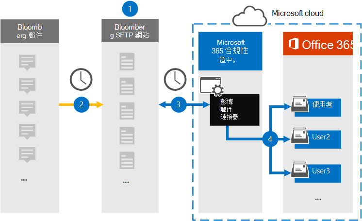

# 設定連接器以封存 Bloomberg 郵件資料Set up a connector to archive Bloomberg Message data

使用 Microsoft 365 規範中心的資料連線器，從 [Bloomberg 郵件](https://www.bloomberg.com/professional/product/collaboration/) 共同作業工具匯入及封存金融服務電子郵件資料。Use a data connector in the Microsoft 365 compliance center to import and archive financial services email data from the [Bloomberg Message](https://www.bloomberg.com/professional/product/collaboration/) collaboration tool. 在您設定及設定連接器之後，它會連線到您組織的 Bloomberg secure FTP (SFTP) 網站一次，並將電子郵件專案匯入 Microsoft 365 中的信箱。After you set up and configure a connector, it connects to your organization's Bloomberg secure FTP (SFTP) site once every day, and imports email items to mailboxes in Microsoft 365.

將 Bloomberg 郵件資料儲存在使用者信箱之後，您可以套用 Microsoft 365 合規性功能，例如訴訟暫止、內容搜尋、就地封存、審核、通訊法規遵從性，以及 Microsoft 365 保留原則，以 Bloomberg 郵件資料。After Bloomberg Message data is stored in user mailboxes, you can apply Microsoft 365 compliance features such as Litigation hold, content search, In-place archiving, auditing, Communication compliance, and Microsoft 365 retention policies to Bloomberg Message data. 例如，您可以使用內容搜尋工具搜尋 Bloomberg 郵件電子郵件，或在高級 eDiscovery 案例中關聯包含 Bloomberg 郵件資料與保管人的信箱。For example, you can search Bloomberg Message emails using the content search tool or associate the mailbox that contains the Bloomberg Message data with a custodian in an Advanced eDiscovery case. 使用 Bloomberg 郵件連接器在 Microsoft 365 中匯入和封存資料，可協助您的組織遵守政府和法規原則。Using a Bloomberg Message connector to import and archive data in Microsoft 365 can help your organization stay compliant with government and regulatory policies.

## 封存 Bloomberg 訊息資料的概覽Overview of archiving Bloomberg Message data

下列概要說明如何使用連接器封存 Microsoft 365 中的 Bloomberg 郵件資料。The following overview explains the process of using a connector to archive Bloomberg Message data in Microsoft 365.

1. 您的組織與 Bloomberg 搭配使用，以設定 Bloomberg SFTP 網站。Your organization works with Bloomberg to set up a Bloomberg SFTP site. 您也可以使用 Bloomberg 設定 Bloomberg 郵件，將電子郵件傳送至 Bloomberg SFTP 網站。You'll also work with Bloomberg to configure Bloomberg Message to copy email messages to the Bloomberg SFTP site.

2. 每24小時一次，Bloomberg 郵件的電子郵件會複製到 Bloomberg SFTP 網站。Once every 24 hours, email messages from Bloomberg Message are copied to the Bloomberg SFTP site.

3. 您在 Microsoft 365 合規性中心建立的 Bloomberg 郵件連接器每天會連線至 Bloomberg SFTP 網站，並將電子郵件訊息從過去24小時傳送至 Microsoft 雲端中的 secure Azure Storage 區域。The Bloomberg Message connector that you create in the Microsoft 365 compliance center connects to the Bloomberg SFTP site every day and transfers the email messages from the previous 24 hours to a secure Azure Storage area in the Microsoft Cloud.

4. 連接器會將電子郵件專案匯入特定使用者的信箱。The connector imports the email message items to the mailbox of a specific user. 在特定使用者的信箱中建立名為 BloombergMessage 的新資料夾，並將這些專案匯入該資料夾。A new folder named BloombergMessage is created in the specific user's mailbox and the items will be imported to it. 

   連接器會使用 CorporateEmailAddress 屬性的值來執行此動作。The connector does this by using the value of the CorporateEmailAddress property. 每封電子郵件都包含此內容，該屬性會填入電子郵件的每個參與者的電子郵件地址。Every email message contains this property, which is populated with the email address of every participant of the email message. 除了使用 *CorporateEmailAddress* 屬性的值進行自動使用者對應之外，您也可以透過上載 CSV 對應檔來定義自訂對應。In addition to automatic user mapping using the value of the *CorporateEmailAddress* property, you can also define a custom mapping by uploading a CSV mapping file. 此對應檔包含組織中每位使用者的 Bloomberg UUID 和對應的 Microsoft 365 信箱位址。This mapping file contains a Bloomberg UUID and the corresponding Microsoft 365 mailbox address for each user in your organization. 如果您啟用自動使用者對應，並提供自訂對應，則每個電子郵件專案連接器都會先查看自訂對應檔案。If you enable automatic user mapping and provide a custom mapping, for every email item the connector will first look at the custom-mapping file. 如果找不到對應至使用者 Bloomberg UUID 的有效 Microsoft 365 使用者，連接器會使用電子郵件專案的 *CorporateEmailAddress* 屬性。If it doesn't find a valid Microsoft 365 user that corresponds to a user's Bloomberg UUID, the connector uses the *CorporateEmailAddress* property of the email item. 如果連接器在自訂對應檔案或電子郵件專案的 *CorporateEmailAddress* 屬性中找不到有效的 Microsoft 365 使用者，則不會匯入該專案。If the connector doesn't find a valid Microsoft 365 user in either the custom-mapping file or the *CorporateEmailAddress* property of the email item, the item won't be imported.

## 在您開始之前Before you begin

封存 Bloomberg 郵件資料所需的部分執行步驟是 Microsoft 365 的外部，必須先完成，您才能在規範中心建立連接器。Some of the implementation steps required to archive Bloomberg Message data are external to Microsoft 365 and must be completed before you can create the connector in the compliance center.

- 您的組織必須同意允許 Office 365 匯入服務存取您組織中的信箱資料。Your organization must consent to allow the Office 365 Import service to access mailbox data in your organization. 若要同意此要求，請移至 [此頁面](https://login.microsoftonline.com/common/oauth2/authorize?client_id=570d0bec-d001-4c4e-985e-3ab17fdc3073&response_type=code&redirect_uri=https://portal.azure.com/&nonce=1234&prompt=admin_consent)，使用 Office 365 全域管理員的認證登入，然後接受要求。To consent to this request, go to [this page](https://login.microsoftonline.com/common/oauth2/authorize?client_id=570d0bec-d001-4c4e-985e-3ab17fdc3073&response_type=code&redirect_uri=https://portal.azure.com/&nonce=1234&prompt=admin_consent), sign in with the credentials of an Office 365 global admin, and then accept the request. 您必須先完成此步驟，才能在步驟3中成功建立 Bloomberg 郵件連接器。You have to complete this step before you can successfully create the Bloomberg Message connector in Step 3.

- 訂閱 [Bloomberg Anywhere](https://www.bloomberg.com/professional/product/remote-access/?bbgsum-page=DG-WS-PROF-PROD-BBA)。Subscribe to [Bloomberg Anywhere](https://www.bloomberg.com/professional/product/remote-access/?bbgsum-page=DG-WS-PROF-PROD-BBA). 這是必要的，讓您可以登入 Bloomberg 無所不在，以存取您必須設定及設定的 Bloomberg SFTP 網站。This is required so that you can log in to Bloomberg Anywhere to access the Bloomberg SFTP site that you have to set up and configure.

- 設定 Bloomberg SFTP (安全檔案傳輸通訊協定) 網站。Set up a Bloomberg SFTP (Secure file transfer protocol) site. 使用 Bloomberg 來設定 SFTP 網站後，每日會將 Bloomberg 郵件的資料上傳到 SFTP 網站。After working with Bloomberg to set up the SFTP site, data from Bloomberg Message is uploaded to the SFTP site every day. 您在步驟2中建立的連接器會連接到此 SFTP 網站，並將電子郵件資料傳送至 Microsoft 365 信箱。The connector you create in Step 2 connects to this SFTP site and transfers the email data to Microsoft 365 mailboxes. 在傳輸過程中，SFTP 也會加密傳送至信箱的 Bloomberg 郵件資料。SFTP also encrypts the Bloomberg Message data that is sent to mailboxes during the transfer process.

  如需 Bloomberg SFTP (也稱為 *BB-SFTP*) 的詳細資訊：For information about Bloomberg SFTP (also called *BB-SFTP*):

  - 請參閱 [Bloomberg 支援部門](https://www.bloomberg.com/professional/support/documentation/)的「SFTP Connectivity 標準」檔。See the "SFTP Connectivity Standards" document at [Bloomberg Support](https://www.bloomberg.com/professional/support/documentation/).

  - 請與 [Bloomberg 客戶支援](https://service.bloomberg.com/portal/sessions/new?utm_source=bloomberg-menu&utm_medium=csc)人員聯繫。Contact [Bloomberg customer support](https://service.bloomberg.com/portal/sessions/new?utm_source=bloomberg-menu&utm_medium=csc).

   > [!NOTE]
   > 如果您的組織已部署一個連接器，以封存立即 Bloomberg 資料，您不需要設定另一個 SFTP 網站。If your organization already deployed a connector to archive Instant Bloomberg data, you don't need to set up another SFTP site. 您可以使用相同的 SFTP 網站來 Bloomberg 消息連接器。You can use the same SFTP site for the Bloomberg Message connector.

- 當您使用 Bloomberg 設定 SFTP 網站後，Bloomberg 會在您回應 Bloomberg 的實施電子郵件訊息之後，為您提供一些資訊。After you work with Bloomberg to set up an SFTP site, Bloomberg will provide some information to you after you respond to the Bloomberg implementation email message. 儲存下列資訊的複本。Save a copy of the following information. 您可以使用它在步驟3中設定連接器。You use it to set up a connector in Step 3.

  - 公司的程式碼，也就是您組織的識別碼，用來登入 Bloomberg SFTP 網站。Firm code, which is an ID for your organization and is used to log in to the Bloomberg SFTP site.

  - Bloomberg SFTP 網站的密碼Password for your Bloomberg SFTP site

  - Bloomberg SFTP 網站 (的 URL，例如，sftp.bloomberg.com) 。URL for Bloomberg SFTP site (for example, sftp.bloomberg.com). 此外，Bloomberg 也可以為 Bloomberg SFTP 網站提供對應的 IP 位址，也可以用來設定連接器。In addition, Bloomberg may also provide a corresponding IP address for the Bloomberg SFTP site, which also can be used to set up the connector.

  - Bloomberg SFTP 網站的埠號碼Port number for Bloomberg SFTP site

- 在步驟 3 (中建立 Bloomberg 郵件連接器，並在步驟 1) 中下載公開金鑰及 IP 位址的使用者，必須在 Exchange Online 中指派「信箱匯入匯出」角色。The user who creates a Bloomberg Message connector in Step 3 (and who downloads the public keys and IP address in Step 1) must be assigned the Mailbox Import Export role in Exchange Online. 在 Microsoft 365 規範中心的 [ **資料連線器** ] 頁面中新增連接器時，這是必要的。This is required to add connectors in the **Data connectors** page in the Microsoft 365 compliance center. 依預設，此角色不會指派給 Exchange Online 內的任何角色群組。By default, this role isn't assigned to any role group in Exchange Online. 您可以將信箱匯入匯出角色新增至 Exchange Online 中的「組織管理」角色群組。You can add the Mailbox Import Export role to the Organization Management role group in Exchange Online. 或者，您可以建立角色群組、指派信箱匯入匯出角色，然後將適當的使用者新增為成員。Or you can create a role group, assign the Mailbox Import Export role, and then add the appropriate users as members. 如需詳細資訊，請參閱「管理 Exchange Online 中的角色群組」一文中的 [ [建立角色群組](https://docs.microsoft.com/Exchange/permissions-exo/role-groups#create-role-groups) 或 [修改角色群組](https://docs.microsoft.com/Exchange/permissions-exo/role-groups#modify-role-groups) ] 區段。For more information, see the [Create role groups](https://docs.microsoft.com/Exchange/permissions-exo/role-groups#create-role-groups) or [Modify role groups](https://docs.microsoft.com/Exchange/permissions-exo/role-groups#modify-role-groups) sections in the article "Manage role groups in Exchange Online".

## 步驟1：取得 SSH 和 PGP 公開金鑰Step 1: Obtain SSH and PGP public keys

第一步是取得公開金鑰的副本，以取得安全命令介面 (SSH) 和非常好的隱私權 (PGP) 。The first step is to obtain a copy of the public keys for Secure Shell (SSH) and Pretty Good Privacy (PGP). 您可以在步驟2中使用這些機碼來設定 Bloomberg SFTP 網站，以允許您在步驟3中建立的連接器 () 連線到 SFTP 網站，以及將 Bloomberg 郵件電子郵件資料轉移至 Microsoft 365 信箱。You use these keys in Step 2 to configure the Bloomberg SFTP site to allow the connector (that you create in Step 3) to connect to the SFTP site and transfer the Bloomberg Message email data to Microsoft 365 mailboxes. 您也可以在此步驟中取得 IP 位址，當您設定 Bloomberg SFTP 網站時，您可以使用此位址。You also obtain an IP address in this step, which you use when configuring the Bloomberg SFTP site.

1. 移至 [ https://compliance.microsoft.com\ ] (https://compliance.microsoft.com) ，然後按一下左導覽中的 [ **資料連線器** ]。Go to [https://compliance.microsoft.com\](https://compliance.microsoft.com) and click **Data connectors** in the left nav.

2. 在 [ **Bloomberg 郵件**] 底下的 [**資料連線器**] 頁面上，按一下 [ **View**]。On the **Data connectors** page under **Bloomberg Message**, click **View**.

3. 在 [ **Bloomberg 訊息**產品描述] 頁面上，按一下 [**新增連接器**]On the **Bloomberg Message** product description page, click **Add connector**

4. 在 [ **服務條款** ] 頁面上，按一下 [ **接受**]。On the **Terms of service** page, click **Accept**.

5. 在 [步驟 1] 底下的 [ **新增 BLOOMBERG SFTP 網站認證** ] 中，按一下 [ **下載 SSH 金鑰**]、[ **下載 PGP 金鑰**] 和 [ **下載 IP 位址** ] 連結，將每個檔案的副本儲存到本機電腦。On the **Add credentials for Bloomberg SFTP site** under step 1, click the **Download SSH key**, **Download PGP key**, and **Download IP address** links to save a copy of each file to your local computer. 這些檔案包含下列專案，可用來設定步驟2中的 Bloomberg SFTP 網站：These files contain the following items that are used to configure the Bloomberg SFTP site in Step 2:

   - SSH 公開金鑰：此機碼用來設定安全命令介面 (SSH) ，以在連接器連線至 Bloomberg SFTP 網站時，啟用安全的遠端登入。SSH public key: This key is used to configure Secure Shell (SSH) to enable a secure remote login when the connector connects to the Bloomberg SFTP site.

   - PGP 公開金鑰：此機碼是用來設定從 Bloomberg SFTP 網站傳輸至 Microsoft 365 的資料加密。PGP public key: This key is used to configure the encryption of data that's transferred from the Bloomberg SFTP site to Microsoft 365.

   - IP 位址： Bloomberg SFTP 網站已設定為只接受來自此 IP 位址的連線要求，該要求是由您在步驟3中建立的 Bloomberg 郵件連接器所使用。IP address: The Bloomberg SFTP site is configured to accept a connection request only from this IP address, which is used by the Bloomberg Message connector that you create in Step 3.

6. 按一下 [ **取消** ] 關閉嚮導。Click **Cancel** to close the wizard. 您會回到步驟3中的這個嚮導，以建立連接器。You come back to this wizard in Step 3 to create the connector.

## 步驟2：設定 Bloomberg SFTP 網站Step 2: Configure the Bloomberg SFTP site

> [!NOTE]
> 如先前所述，如果您的組織先前已設定 Bloomberg SFTP 網站封存立即 Bloomberg 資料，您就不需要設定另一個。As previously stated, if you're organization has previously set up a Bloomberg SFTP site to archive Instant Bloomberg data, you don't have to set up another one. 當您在步驟3中建立連接器時，您可以指定相同的 SFTP 網站。You can specify the same SFTP site when you create the connector in Step 3.

下一步是使用 SSH 和 PGP 公開金鑰和您在步驟1中取得的 IP 位址，為 Bloomberg SFTP 網站設定 SSH 驗證和 PGP 加密。The next step is to use the SSH and PGP public keys and the IP address that you obtained in Step 1 to configure SSH authentication and PGP encryption for the Bloomberg SFTP site. 這可讓您在步驟3中建立的 Bloomberg 郵件連接器連線至 Bloomberg SFTP 網站，並將 Bloomberg 郵件資料傳輸至 Microsoft 365。This lets the Bloomberg Message connector that you create in Step 3 connect to the Bloomberg SFTP site and transfer Bloomberg Message data to Microsoft 365. 您需要與 Bloomberg 客戶支援合作，以設定 Bloomberg SFTP 網站。You need to work with Bloomberg customer support to set up your Bloomberg SFTP site. 請與 [Bloomberg 客戶支援](https://service.bloomberg.com/portal/sessions/new?utm_source=bloomberg-menu&utm_medium=csc) 部門聯繫以取得協助。Contact [Bloomberg customer support](https://service.bloomberg.com/portal/sessions/new?utm_source=bloomberg-menu&utm_medium=csc) for assistance.

> [!IMPORTANT]
> Bloomberg 建議您將您在步驟1中下載的三個檔案附加到電子郵件訊息，並將其傳送給他們的客戶支援小組，以設定 Bloomberg SFTP 網站時使用這些檔案。Bloomberg recommends that you attach the three files that you downloaded in Step 1 to an email message and send it to their customer support team when working with them to set up your Bloomberg SFTP site.

## 步驟3：建立 Bloomberg 郵件連接器Step 3: Create a Bloomberg Message connector

最後一個步驟是在 Microsoft 365 規範中心建立 Bloomberg 郵件連接器。The last step is to create a Bloomberg Message connector in the Microsoft 365 compliance center. 連接器會使用您提供的資訊來連線至 Bloomberg SFTP 網站，並將電子郵件傳送至 Microsoft 365 中對應的使用者信箱方塊。The connector uses the information you provide to connect to the Bloomberg SFTP site and transfer email messages to the corresponding user mailbox boxes in Microsoft 365.

1. 移至 [https://compliance.microsoft.com](https://compliance.microsoft.com) 並按一下左側導覽中的 [ **資料連線器** ]。Go to [https://compliance.microsoft.com](https://compliance.microsoft.com) and click **Data connectors** in the left nav.

2. 在 [ **Bloomberg 郵件**] 底下的 [**資料連線器**] 頁面上，按一下 [ **View**]。On the **Data connectors** page under **Bloomberg Message**, click **View**.

3. 在 [ **Bloomberg 訊息**產品描述] 頁面上，按一下 [**新增連接器**]On the **Bloomberg Message** product description page, click **Add connector**

4. 在 [ **服務條款** ] 頁面上，按一下 [ **接受**]。On the **Terms of service** page, click **Accept**.

5. 在 [ **新增 BLOOMBERG SFTP 網站的認證** ] 頁面的 [步驟 3] 下，于下列方塊中輸入必要的資訊，然後按 **[下一步]**。On the **Add credentials for Bloomberg SFTP site** page, under Step 3, enter the required information in the following boxes and then click **Next**.

      - **確認程式碼：** 組織的識別碼，用作 Bloomberg SFTP 網站的使用者名稱。**Firm code:** The ID for your organization that is used as the username for the Bloomberg SFTP site.

      - **密碼：** 組織之 Bloomberg SFTP 網站的密碼。**Password:** The password for your organization's Bloomberg SFTP site.

      - **SFTP URL:** Bloomberg SFTP 網站的 URL (例如，sftp.bloomberg.com) 。**SFTP URL:** The URL for the Bloomberg SFTP site (for example, sftp.bloomberg.com).

      - **SFTP 埠：** Bloomberg SFTP 網站的埠號碼。**SFTP port:** The port number for the Bloomberg SFTP site. 連接器會使用此埠連接到 SFTP 網站。The connector uses this port to connect to the SFTP site.

6. 在 [ **使用者對應** ] 頁面上，啟用自動使用者對應，並視需要提供自訂使用者對應On the **User-mapping** page, enable automatic user mapping and provide custom user mapping as required

7. 按 **[下一步]**，複查您的設定，然後按一下 [準備] 以建立連接器。Click **Next**, review your settings, and then click prepare to create the connector.

8. 移至 [ **資料連線器** ] 頁面，查看新連接器的匯入程式的進度。Go to the **Data connectors** page to see the progress of the import process for the new connector.

## 已知問題Known issues

- 不支援匯入 Bloomberg 郵件電子郵件至 Microsoft 365 的執行緒。Threading of Bloomberg Message email imported to Microsoft 365 isn't supported. 傳送給個人的個別郵件會匯入，但不會出現線上程交談中。Individual messages sent to a person are imported, but they aren't presented in a threaded conversation. Microsoft 正致力於支援 Bloomberg 郵件資料連線器的後續版本中的執行緒。Microsoft is working to support threading in later versions of the Bloomberg Message data connector.
