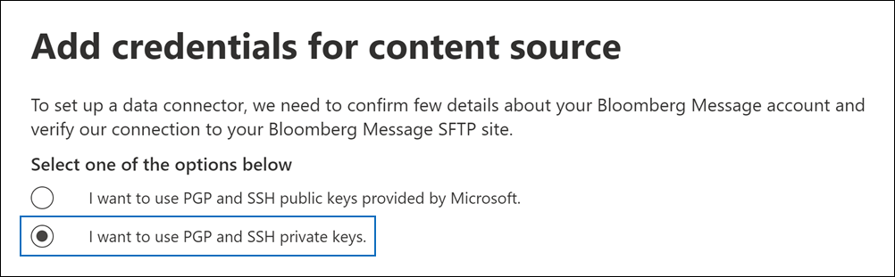

# 設定連接器以封存 Bloomberg 郵件資料

使用 Microsoft 365 規範中心內的資料連線器，從[Bloomberg 郵件](https://www.bloomberg.com/professional/product/collaboration/)共同作業工具匯入及封存金融服務電子郵件資料。 在您設定及設定連接器之後，它會連線到您組織的 Bloomberg secure FTP (SFTP) 網站一次，並將電子郵件專案匯入 Microsoft 365 中的信箱。

將 Bloomberg 郵件資料儲存在使用者信箱之後，您就可以套用 Microsoft 365 合規性功能，例如訴訟資料暫止、內容搜尋、就地封存、審核、通訊相容性，以及 Microsoft 365 保留原則，以 Bloomberg 郵件資料。 例如，您可以使用內容搜尋工具搜尋 Bloomberg 郵件電子郵件，或在 Advanced eDiscovery 案例中關聯包含 Bloomberg 郵件資料與保管人的信箱。 使用 Bloomberg 郵件連接器在 Microsoft 365 中匯入和封存資料，可協助您的組織遵守政府和法規原則。

## 封存 Bloomberg 訊息資料的概覽

下列概要說明如何使用連接器封存 Microsoft 365 中的 Bloomberg 郵件資料。

1. 您的組織與 Bloomberg 搭配使用，以設定 Bloomberg SFTP 網站。 您也可以使用 Bloomberg 設定 Bloomberg 郵件，將電子郵件傳送至 Bloomberg SFTP 網站。

2. 每24小時一次，Bloomberg 郵件的電子郵件會複製到 Bloomberg SFTP 網站。

3. 您在 Microsoft 365 合規性中心內建立的 Bloomberg 郵件連接器每天會連線至 Bloomberg SFTP 網站，並將電子郵件訊息從過去24小時傳送至 Microsoft 雲端中的安全 Azure 儲存體區域。

4. 連接器會將電子郵件專案匯入特定使用者的信箱。 在特定使用者的信箱中建立名為 BloombergMessage 的新資料夾，並將這些專案匯入該資料夾。

   連接器會使用 CorporateEmailAddress 屬性的值來執行此動作。 每封電子郵件都包含此內容，該屬性會填入電子郵件的每個參與者的電子郵件地址。 除了使用 *CorporateEmailAddress* 屬性的值進行自動使用者對應之外，您也可以透過上載 CSV 對應檔來定義自訂對應。 此對應檔包含組織中每位使用者的 Bloomberg UUID 和對應的 Microsoft 365 信箱位址。 如果您啟用自動使用者對應，並提供自訂對應，則每個電子郵件專案連接器都會先查看自訂對應檔案。 如果找不到有效的 Microsoft 365 使用者與使用者的 Bloomberg UUID，連接器會使用電子郵件專案的 *CorporateEmailAddress* 屬性。 如果連接器在自訂對應檔案或電子郵件專案的 *CorporateEmailAddress* 屬性中找不到有效的 Microsoft 365 使用者，則不會匯入該專案。

## 在您設定連接器之前

封存 Bloomberg 郵件資料所需的部分執行步驟是 Microsoft 365 外部的，必須先完成，才能在規範中心建立連接器。

- 若要設定 Bloomberg 郵件連接器，您必須使用金鑰和金鑰密碼短語，以取得非常好的隱私權 (PGP) 和安全命令介面 (SSH) 。 這些機碼是用來設定 Bloomberg SFTP 網站，並由連接器用來連線至 Bloomberg SFTP 網站，以將資料匯入 Microsoft 365。 PGP 金鑰是用來設定從 Bloomberg SFTP 網站傳輸到 Microsoft 365 的資料加密。 SSH 金鑰用於設定安全命令介面，以在連接器連線至 Bloomberg SFTP 網站時，啟用安全的遠端登入。

  當您設定連接器時，可以選擇使用 Microsoft 提供的公開金鑰和金鑰密碼，也可以使用您自己的私密金鑰和密碼。 建議您使用 Microsoft 提供的公用金鑰。 不過，如果您的組織已使用私密金鑰設定 Bloomberg SFTP 網站，則可以使用這些相同的私密金鑰建立連接器。

- 訂閱 [Bloomberg Anywhere](https://www.bloomberg.com/professional/product/remote-access/?bbgsum-page=DG-WS-PROF-PROD-BBA)。 這是必要的，讓您可以登入 Bloomberg 無所不在，以存取您必須設定及設定的 Bloomberg SFTP 網站。

- 設定 Bloomberg SFTP (安全檔案傳輸通訊協定) 網站。 使用 Bloomberg 來設定 SFTP 網站後，每日會將 Bloomberg 郵件的資料上傳到 SFTP 網站。 您在步驟2中建立的連接器會連接到此 SFTP 網站，並將電子郵件資料傳送至 Microsoft 365 信箱。 在傳輸過程中，SFTP 也會加密傳送至信箱的 Bloomberg 郵件資料。

  如需 Bloomberg SFTP (也稱為 *BB-SFTP*) 的詳細資訊：

  - 請參閱 [Bloomberg 支援部門](https://www.bloomberg.com/professional/support/documentation/)的「SFTP Connectivity 標準」檔。

  - 請與 [Bloomberg 客戶支援](https://service.bloomberg.com/portal/sessions/new?utm_source=bloomberg-menu&utm_medium=csc)人員聯繫。

- 當您使用 Bloomberg 設定 SFTP 網站後，Bloomberg 會在您回應 Bloomberg 的實施電子郵件訊息之後，為您提供一些資訊。 儲存下列資訊的複本。 您可以使用它在步驟3中設定連接器。

  - 公司的程式碼，也就是您組織的識別碼，用來登入 Bloomberg SFTP 網站。

  - Bloomberg SFTP 網站的密碼

  - Bloomberg SFTP 網站 (的 URL，例如，sftp.bloomberg.com) 。 此外，Bloomberg 也可以為 Bloomberg SFTP 網站提供對應的 IP 位址，也可以用來設定連接器。

  - Bloomberg SFTP 網站的埠號碼

- 在一天內，Bloomberg 郵件連接器可匯入全部200000專案。 如果 SFTP 網站上的專案超過200000個，將不會將這些專案匯入至 Microsoft 365。

- 在步驟 3 (中建立 Bloomberg 郵件連接器，並在步驟 1) 中下載公開金鑰及 IP 位址的使用者，必須在 Exchange Online 中指派「信箱匯入匯出」角色。 在 [Microsoft 365 規範中心] 的 [**資料連線器**] 頁面中新增連接器時，這是必要的。 依預設，此角色不會指派給 Exchange Online 內的任何角色群組。 您可以將信箱匯入匯出角色新增至 Exchange Online 中的「組織管理」角色群組。 或者，您可以建立角色群組、指派信箱匯入匯出角色，然後將適當的使用者新增為成員。 如需詳細資訊，請參閱「在 Exchange Online 中管理角色群組」一文中的 [[建立角色群組](/Exchange/permissions-exo/role-groups#create-role-groups)或[修改角色](/Exchange/permissions-exo/role-groups#modify-role-groups)群組] 區段。

## 使用公開金鑰設定連接器

本節中的步驟說明如何使用 (PGP) 和安全命令介面 (SSH) 等保密的公開金鑰，設定 Bloomberg 郵件連接器。

### 步驟1：取得 PGP 和 SSH 公開金鑰

第一步是取得 PGP 和 SSH 公開金鑰的複本。 您可以在步驟2中使用這些機碼來設定 Bloomberg SFTP 網站，以允許您在步驟3中建立的連接器 () 連線到 SFTP 網站，以及將 Bloomberg 郵件電子郵件資料轉移至 Microsoft 365 信箱。 您也可以在此步驟中取得 IP 位址，當您設定 Bloomberg SFTP 網站時，您可以使用此位址。

1. 移至 <https://compliance.microsoft.com> 並按一下左側導覽中的 [ **資料連線器** ]。

2. 在 [ **Bloomberg 郵件**] 底下的 [**資料連線器**] 頁面上，按一下 [ **View**]。

3. 在 [ **Bloomberg 訊息** 產品描述] 頁面上，按一下 [**新增連接器**]

4. 在 [ **服務條款** ] 頁面上，按一下 [ **接受**]。

5. 在 [ **新增內容來源的認證** ] 頁面上，按一下 [ **我想要使用 MICROSOFT 提供的 PGP 和 SSH 公開金鑰**]。

   

6. 在 [步驟 1] 下，按一下 [ **下載 SSH 金鑰**]、[ **下載 PGP 金鑰**] 和 [ **下載 IP 位址** ] 連結，將每個檔案的副本儲存到本機電腦。

   

   這些檔案包含下列專案，可用來設定步驟2中的 Bloomberg SFTP 網站：

   - PGP 公開金鑰：此機碼是用來設定從 Bloomberg SFTP 網站傳輸到 Microsoft 365 的資料加密。

   - SSH 公開金鑰：此機碼用於設定安全命令介面，以在連接器連線至 Bloomberg SFTP 網站時，啟用安全的遠端登入。

   - IP 位址： Bloomberg SFTP 網站已設定為接受來自此 IP 位址的連線要求。 Bloomberg 郵件連接器會使用相同的 IP 位址連線到 SFTP 網站，並將 Bloomberg 郵件資料傳輸至 Microsoft 365。

7. 按一下 [ **取消** ] 關閉嚮導。 您會回到步驟3中的這個嚮導，以建立連接器。

### 步驟2：設定 Bloomberg SFTP 網站

> [!NOTE]
> 如果您的組織先前已設定 Bloomberg SFTP 網站使用 public PGP 和 SSH 金鑰封存立即 Bloomberg 資料，您就不需要設定另一個。 當您在步驟3中建立連接器時，您可以指定相同的 SFTP 網站。

下一步是使用您在步驟1中取得的 PGP 和 SSH 公開金鑰及 IP 位址，為 Bloomberg SFTP 網站設定 PGP 加密和 SSH 驗證。 這可讓您在步驟3中建立的 Bloomberg 郵件連接器連線至 Bloomberg SFTP 網站，並將 Bloomberg 郵件資料傳輸至 Microsoft 365。 您需要與 Bloomberg 客戶支援合作，以設定 Bloomberg SFTP 網站。 請與 [Bloomberg 客戶支援](https://service.bloomberg.com/portal/sessions/new?utm_source=bloomberg-menu&utm_medium=csc) 部門聯繫以取得協助。

> [!IMPORTANT]
> Bloomberg 建議您將您在步驟1中下載的三個檔案附加到電子郵件訊息，並將其傳送給他們的客戶支援小組，以設定 Bloomberg SFTP 網站時使用這些檔案。

### 步驟3：建立 Bloomberg 郵件連接器

最後一個步驟是在 Microsoft 365 規範中心建立 Bloomberg 郵件連接器。 連接器會使用您提供的資訊來連線至 Bloomberg SFTP 網站，並將電子郵件傳送至 Microsoft 365 中對應的使用者信箱方塊。

1. 移至 <https://compliance.microsoft.com> 並按一下左側導覽中的 [ **資料連線器** ]。

2. 在 [ **Bloomberg 郵件**] 底下的 [**資料連線器**] 頁面上，按一下 [ **View**]。

3. 在 [ **Bloomberg 訊息** 產品描述] 頁面上，按一下 [**新增連接器**]

4. 在 [ **服務條款** ] 頁面上，按一下 [ **接受**]。

5. 在 [ **新增內容來源的認證** ] 頁面上，按一下 [ **我想要使用 MICROSOFT 提供的 PGP 和 SSH 公開金鑰**]。

6. 在 [步驟 3] 底下的下列方塊中，輸入必要的資訊，然後按一下 [ **驗證** 連線]。

      - **名稱：** 連接器的名稱。 它在您的組織中必須是唯一的。

      - **確認程式碼：** 組織的識別碼，用作 Bloomberg SFTP 網站的使用者名稱。

      - **密碼：** 組織之 Bloomberg SFTP 網站的密碼。

      - **SFTP URL:** Bloomberg SFTP 網站的 URL (例如， `sftp.bloomberg.com`) 。 您也可以使用此值的 IP 位址。

      - **SFTP 埠：** Bloomberg SFTP 網站的埠號碼。 連接器會使用此埠連接到 SFTP 網站。

7. 成功驗證成功後，請按 **[下一步]**。

8. 在 [將 **Bloomberg 郵件使用者對應至 Microsoft 365 使用者**] 頁面上，啟用 [自動使用者對應]，並視需要提供自訂使用者對應。

   > [!NOTE]
   > 連接器會將訊息項目匯入特定使用者的信箱。 在特定使用者的信箱中建立名為 **BloombergMessage** 的新資料夾，並將這些專案匯入該資料夾。 連接器會使用 *CorporateEmailAddress* 屬性的值。 每個聊天訊息都包含此屬性，且該屬性會填入聊天訊息每一位參與者的電子郵件地址。 除了使用 *CorporateEmailAddress* 屬性的值進行自動使用者對應之外，您也可以透過上載 CSV 對應檔來定義自訂對應。 對應檔案應該包含每個使用者的 Bloomberg UUID 和對應的 Microsoft 365 信箱位址。 如果您啟用自動使用者對應，並提供自訂對應，則每個訊息項目連接器會先查看自訂對應檔案。 如果找不到有效的 Microsoft 365 使用者與使用者的 Bloomberg UUID 相對應，連接器會使用聊天室專案的 *CorporateEmailAddress* 屬性。 如果連接器在自訂對應檔或訊息項目的 *CorporateEmailAddress* 屬性中找不到有效的 Microsoft 365 使用者，則不會匯入該專案。

9. 按 **[下一步]**，複查您的設定，然後按一下 **[完成]** 以建立連接器。

10. 移至 [ **資料連線器** ] 頁面，查看新連接器的匯入程式的進度。 按一下連接線以顯示飛出頁面，該頁面包含連接器的相關資訊。

## 使用私密金鑰設定連接器

本節中的步驟說明如何使用 PGP 和 SSH 私密金鑰設定 Bloomberg 郵件連接器。 此連接器設定選項適用于已使用私密金鑰設定 Bloomberg SFTP 網站的組織。

### 步驟1：取得 IP 位址以設定 Bloomberg SFTP 網站

> [!NOTE]
> 如果您的組織先前已設定 Bloomberg SFTP 網站使用 PGP 和 SSH 私密金鑰封存立即 Bloomberg 資料，您就不需要設定另一個。 當您在步驟2中建立連接器時，您可以指定相同的 SFTP 網站。

如果您的組織已使用 PGP 和 SSH 私密金鑰來設定 Bloomberg SFTP 網站，則必須取得 IP 位址，並提供給 Bloomberg 客戶支援人員。 Bloomberg SFTP 網站必須設定為接受來自此 IP 位址的連線要求。 Bloomberg 郵件連接器會使用相同的 IP 位址連線到 SFTP 網站，並將 Bloomberg 郵件資料傳輸至 Microsoft 365。

若要取得 IP 位址：

1. 移至 <https://compliance.microsoft.com> 並按一下左側導覽中的 [ **資料連線器** ]。

2. 在 [ **Bloomberg 郵件**] 底下的 [**資料連線器**] 頁面上，按一下 [ **View**]。

3. 在 [ **Bloomberg 訊息** 產品描述] 頁面上，按一下 [**新增連接器**]

4. 在 [ **服務條款** ] 頁面上，按一下 [ **接受**]。

5. 在 [ **新增內容來源的認證** ] 頁面上，按一下 [ **我想要使用 PGP 和 SSH 私密金鑰**]。

6. 在 [步驟 1] 底下，按一下 [ **下載 ip 位址** ]，將 ip 位址檔案的副本儲存到本機電腦。

   

7. 按一下 [ **取消** ] 關閉嚮導。 您會回到步驟2中的這個嚮導，以建立連接器。

您需要與 Bloomberg 客戶支援合作，設定 Bloomberg SFTP 網站，以接受來自此 IP 位址的連線要求。 請與 [Bloomberg 客戶支援](https://service.bloomberg.com/portal/sessions/new?utm_source=bloomberg-menu&utm_medium=csc) 部門聯繫以取得協助。

### 步驟2：建立 Bloomberg 郵件連接器

設定 Bloomberg SFTP 網站後，下一步是在 Microsoft 365 規範中心建立 Bloomberg 郵件連接器。 連接器會使用您提供的資訊來連線至 Bloomberg SFTP 網站，並將電子郵件傳送至 Microsoft 365 中對應的使用者信箱方塊。 若要完成此步驟，請務必具有您用來設定 Bloomberg SFTP 網站之相同私密金鑰和金鑰密碼的副本。

1. 移至 <https://compliance.microsoft.com> 並按一下左側導覽中的 [ **資料連線器** ]。

2. 在 [ **Bloomberg 郵件**] 底下的 [**資料連線器**] 頁面上，按一下 [ **View**]。

3. 在 [ **Bloomberg 訊息** 產品描述] 頁面上，按一下 [**新增連接器**]

4. 在 [ **服務條款** ] 頁面上，按一下 [ **接受**]。

5. 在 [ **新增內容來源的認證** ] 頁面上，按一下 [ **我想要使用 PGP 和 SSH 私密金鑰**]。

   

6. 在 [步驟 3] 底下的下列方塊中，輸入必要的資訊，然後按一下 [ **驗證** 連線]。

      - **名稱：** 連接器的名稱。 它在您的組織中必須是唯一的。

      - **確認程式碼：** 組織的識別碼，用作 Bloomberg SFTP 網站的使用者名稱。

      - **密碼：** 組織之 Bloomberg SFTP 網站的密碼。

      - **SFTP URL:** Bloomberg SFTP 網站的 URL (例如， `sftp.bloomberg.com`) 。 您也可以使用此值的 IP 位址。

      - **SFTP 埠：** Bloomberg SFTP 網站的埠號碼。 連接器會使用此埠連接到 SFTP 網站。

      - **PGP 私密金鑰：** Bloomberg SFTP 網站的 PGP 私密金鑰。 請務必加入整個私密金鑰值，包括按鍵區塊的開始和結束行。

      - **PGP 金鑰複雜密碼：** PGP 私密金鑰的複雜密碼。

      - **SSH 私密金鑰：** Bloomberg SFTP 網站的 SSH 私密金鑰。 請務必加入整個私密金鑰值，包括按鍵區塊的開始和結束行。

      - **SSH 金鑰密碼短語：** SSH 私密金鑰的複雜密碼。

7. 成功驗證成功後，請按 **[下一步]**。

8. 在 [將 **Bloomberg 郵件使用者對應至 Microsoft 365 使用者**] 頁面上，啟用 [自動使用者對應]，並視需要提供自訂使用者對應。

   > [!NOTE]
   > 連接器會將訊息項目匯入特定使用者的信箱。 在特定使用者的信箱中建立名為 **BloombergMessage** 的新資料夾，並將這些專案匯入該資料夾。 連接器會使用 *CorporateEmailAddress* 屬性的值。 每個聊天訊息都包含此屬性，且該屬性會填入聊天訊息每一位參與者的電子郵件地址。 除了使用 *CorporateEmailAddress* 屬性的值進行自動使用者對應之外，您也可以透過上載 CSV 對應檔來定義自訂對應。 對應檔案應該包含每個使用者的 Bloomberg UUID 和對應的 Microsoft 365 信箱位址。 如果您啟用自動使用者對應，並提供自訂對應，則每個訊息項目連接器會先查看自訂對應檔案。 如果找不到有效的 Microsoft 365 使用者與使用者的 Bloomberg UUID 相對應，連接器會使用聊天室專案的 *CorporateEmailAddress* 屬性。 如果連接器在自訂對應檔或訊息項目的 *CorporateEmailAddress* 屬性中找不到有效的 Microsoft 365 使用者，則不會匯入該專案。

9. 按 **[下一步]**，複查您的設定，然後按一下 **[完成]** 以建立連接器。

10. 移至 [ **資料連線器** ] 頁面，查看新連接器的匯入程式的進度。 按一下連接線以顯示飛出頁面，該頁面包含連接器的相關資訊。

## 已知問題

- Bloomberg 不支援匯入至 Microsoft 365 的郵件電子郵件的執行緒。 傳送給個人的個別郵件會匯入，但不會出現線上程交談中。 Microsoft 正致力於支援 Bloomberg 郵件資料連線器的後續版本中的執行緒。
