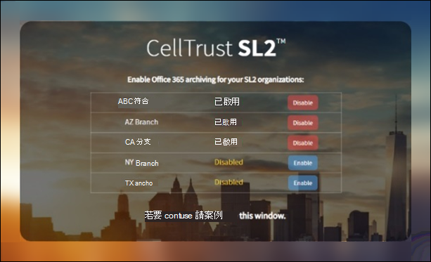

# 將資料從 CellTrust SL2 封存至 Microsoft 365Archive data from CellTrust SL2 to Microsoft 365

CellTrust SL2 會捕獲行動通訊資料，並與領先的封存技術整合，以符合 FINRA、HIPAA、FOIA 和 TCPA 等法規的電子探索需求。CellTrust SL2 captures mobile communications data and integrates with the leading archiving technologies to meet the electronic discovery requirements for regulations such as FINRA, HIPAA, FOIA, and TCPA. SL2 資料連線器會將行動通訊專案匯入 Microsoft 365。The SL2 Data Connector imports mobile communication items to Microsoft 365. 本文說明使用 CellTrust SL2 資料連線器進行封存，將 SL2 與 Microsoft 365 進行整合的處理常式。This article describes the process for integrating SL2 with Microsoft 365 by using the CellTrust SL2 Data Connector for archiving. 完成此程式假設您已訂閱 CellTrust SL2 服務，並且熟悉 SL2 架構。Completing this process assumes that you have subscribed to CellTrust SL2 service and are familiar with the SL2 architecture. 如需 SL2 的相關資訊，請參閱 <www.celltrust.com>。For information about SL2, see <www.celltrust.com>.

在 Microsoft 365 中將資料匯入至使用者信箱之後，您可以套用 Microsoft 365 合規性功能，例如訴訟暫止、eDiscovery、Microsoft 365 保留原則及通訊法規遵從性。After data is imported to user mailboxes in Microsoft 365, you can apply Microsoft 365 compliance features such as Litigation Hold, eDiscovery, Microsoft 365 retention policies, and communication compliance. 在 Microsoft 365 中使用 CellTrust SL2 資料連線器匯入和封存資料，可協助您的組織遵守政府和法規原則。Using the CellTrust SL2 Data Connector to import and archive data in Microsoft 365 can help your organization stay compliant with government and regulatory policies.

## 使用 CellTrust SL2 資料連線器封存的概覽Overview of archiving with the CellTrust SL2 Data Connector

CellTrust 的 SL2 平臺會從多個來源捕獲通訊資料。CellTrust's SL2 platform captures communication data from multiple sources. SL2 資料來源是人員對個人 (P2P) 或應用程式對人員 (A2P) 。SL2 data sources are either Person-to-Person (P2P) or Application-to-Person (A2P). 本文所述的程式僅適用于 P2P 的資料來源。The process described in this article pertains only to P2P data sources. 對於所有的 P2P 資料來源，合作中至少有一個參與方是訂閱 SL2 服務的 SL2 使用者。For all P2P data sources, at least one party in the collaboration is an SL2 user who is subscribed to the SL2 service. 下列概要說明在 Microsoft 365 中使用 CellTrust SL2 資料連線器的程式。The following overview explains the process of using the CellTrust SL2 Data Connector in Microsoft 365.

1. SL2 使用者在 Microsoft Azure 雲端中傳送和接收 SL2 服務的資料。SL2 users send and receive data to and from SL2 services in the Microsoft Azure cloud.

2. 您的組織在 CellTrust 的 SL2 雲端服務環境中有 SL2 網域。Your organization has an SL2 domain in CellTrust's SL2 Cloud Service environment. 您的網域可能會有一或多個組織單位 (Ou) 。Your domain may have one or more organizational units (OUs). SL2 雲端服務會將您的資料傳送至 Microsoft Azure 平臺中的高度安全區域，使您的資料永遠不會離開 Microsoft Azure 環境。The SL2 Cloud Service transfers your data to a highly secure area in the Microsoft Azure platform, so that your data never leaves the Microsoft Azure environment. 根據您的 SL2 方案 (Enterprise、SMB 或政府) ，您的網域是在 Microsoft Azure Global 或 Microsoft Azure 政府上主控。Depending on your SL2 plan (Enterprise, SMB, or Government), your domain is either hosted on Microsoft Azure Global or Microsoft Azure Government.

3. 在您建立 CellTrust SL2 資料連線器之後，您的網域和 Ou (不論您的 SL2 計畫) ，開始將資料傳送至 Microsoft 365。After you create the CellTrust SL2 Data Connector, your domain and OUs (regardless of your SL2 plan), begin sending data to Microsoft 365. 資料摘要的結構化是以資料來源、Ou 或網域為基礎的方式支援報告。The data feed is structured to support reporting based on data sources, OUs, or the domain by itself. 因此，您的組織只需要一個連接器，即可將所有資料來源送入 Microsoft 365。As a result, your organization needs only one connector to feed all your data sources to Microsoft 365.

4. 連接器會在每個對應的使用者下建立一個資料夾，且該資料夾具有適當的 Office 365 授權，名稱為 **CellTrust SL2**。The connector creates a folder under each mapped user with an appropriate Office 365 license titled **CellTrust SL2**. 這種對應使用電子郵件地址，將 CellTrust SL2 使用者連線至 Office 365 信箱。This mapping connects a CellTrust SL2 user to an Office 365 mailbox by using an email address. 如果 CellTrust SL2 中的使用者識別碼在 Office 365 中沒有符合，將不會封存使用者的資料。If a user ID in CellTrust SL2 has no match in Office 365, the user's data will not be archived.

## 在您設定連接器之前Before you set up a connector

- 確認您在 CellTrust SL2 雲端服務環境中有網域。Verify that you have a domain in the CellTrust SL2 cloud service environment. 如需取得實際執行或試用 SL2 網域的詳細資訊， [請與 CellTrust 聯繫](https://www.celltrust.com/contact-us/#form)。For additional information on obtaining a production or trial SL2 domain, [Contact CellTrust](https://www.celltrust.com/contact-us/#form).

- 取得認證以存取 SL2 網域的系統管理員帳戶。Obtain the credentials to access the administrator account for your SL2 domain.

- 在步驟1中建立 CellTrust SL2 資料連線器的使用者 (，並在步驟 3) 中完成，必須指派 Exchange Online 中的「信箱匯入匯出」角色。The user who creates the CellTrust SL2 data connector in Step 1 (and completes it in Step 3) must be assigned to the Mailbox Import Export role in Exchange Online. 在 Microsoft 365 合規性中心中的 [**資料連線器**] 頁面上新增連接器時，此角色是必要的。This role is required to add connectors on the **Data connectors** page in the Microsoft 365 compliance center. 根據預設，此角色不會指派給 Exchange Online 中的角色群組。By default, this role is not assigned to a role group in Exchange Online. 您可以將信箱匯入匯出角色新增至 Exchange Online 中的「組織管理」角色群組。You can add the Mailbox Import Export role to the Organization Management role group in Exchange Online. 或者，您可以建立角色群組、指派信箱匯入匯出角色，然後將適當的使用者新增為成員。Or you can create a role group, assign the Mailbox Import Export role, and then add the appropriate users as members. 如需詳細資訊，請參閱「在 Exchange Online 中管理角色群組」一文中的 [[建立角色群組](/Exchange/permissions-exo/role-groups#create-role-groups)或[修改角色](/Exchange/permissions-exo/role-groups#modify-role-groups)群組] 區段。For more information, see the [Create role groups](/Exchange/permissions-exo/role-groups#create-role-groups) or [Modify role groups](/Exchange/permissions-exo/role-groups#modify-role-groups) sections in the article "Manage role groups in Exchange Online".

## 步驟1：建立 CellTrust SL2 connectorStep 1: Create a CellTrust SL2 connector

第一步是在 Microsoft 365 合規性中心中建立資料連線器。The first step is to create a data connector in the Microsoft 365 compliance center.

1. 移至 <https://compliance.microsoft.com> 並按一下左導覽窗格上的 [ **資料連線器** ]。Go to <https://compliance.microsoft.com> and click **Data connectors** on the left navigation pane.

2. 在 [ **概覽** ] 索引標籤上，按一下 [ **篩選** ]，然後選取 [ **依 CellTrust**]，然後套用篩選器。On the **Overview** tab, click **Filter** and select **By CellTrust**, and then apply the filter.

   

3. 按一下 [ **CELLTRUST SL2 (預覽** ]) 。Click **CellTrust SL2 (preview**).

4. 在 [ **CELLTRUST SL2 (預覽**) 產品描述] 頁面上，按一下 [ **新增連接器**]。On the **CellTrust SL2 (preview**) product description page, click **Add connector**.

5. 在 [ **服務條款** ] 頁面上，按一下 [ **接受**]。On the **Terms of service** page, click **Accept**.

6. 輸入識別連接器的唯一名稱，然後按 **[下一步]**。Enter a unique name that identifies the connector and then click **Next**. 您輸入的名稱會在您建立後，識別 [ **資料連線器** ] 頁面上的連接器。The name you enter will identify the connector on the **Data connectors** page after you create it.

7. 在 [登 **入您的 CellTrust 帳戶** ] 頁面上，按一下 [登 **入 CellTrust**]。On the **Sign in to your CellTrust account** page, click **Sign into CellTrust**. 您將會重新導向至 **CellTrust 入口網站**，以在新的瀏覽器視窗中 Microsoft 365。You'll be redirected to the **CellTrust Portal for Microsoft 365** in a new browser window.

## 步驟2：選取要封存的網域或組織單位Step 2: Select the domains or OUs to archive

下一步是登入 CellTrust SL2 網域的系統管理員帳戶，然後選取要 Microsoft 365 中封存的網域和 Ou。The next step is to sign into an administrator account for your CellTrust SL2 domain and select the domains and OUs to archive in Microsoft 365.

1. 在 [CellTrust **Microsoft 365 連接器**] 頁面上，選取 SL2 雲端服務中您的環境，以顯示登入頁面。On the CellTrust **Microsoft 365 Connector** page, select your environment in the SL2 cloud service to display a sign-in page.

   一般來說，您應該會看到一個代表您環境的選項。Typically, you should see one option representing your environment. 不過，如果您在一個以上的環境中有網域，您會看到每個環境的選項。However, if you have domains in more than one environment, you will see options for each environment. 進行選取之後，您將會重新導向至 SL2 登入頁面。After you make a selection, you'll be redirected to the SL2 login page.

2. 使用您的網域或 OU 管理員帳戶認證登入。Sign in with your Domain or OU Administrator account credentials.

   如果您以 SL2 域管理員身分登入，您將會看到您的功能變數名稱和該網域中的 Ou 名稱。If you sign in as an SL2 domain administrator, you will see the name of your domain and the OUs in that domain. 如果您沒有 Ou，您只會看到您的網功能變數名稱稱。If you do not have OUs, you only see the name of your domain. 如果您以 OU 管理員身分登入，您只會看到 OU 的名稱。If you log in as OU Administrator, you only see the name of your OU.

3. 啟用您想要封存的商務單位。Enable the business units you wish to archive. 選取 [網域] 不會自動選取 Ou。Selecting the domain will not automatically select the OUs. 您必須個別啟用每個 OU 以進行封存。You must enable each OU separately to archive it.

   

4. 當您完成選取時，請關閉瀏覽器視窗，並回到 Microsoft 365 合規性中心中的 [嚮導] 頁面。When you're finished with your selections, close the browser window and return to the wizard page in Microsoft 365 compliance center. 幾秒後，嚮導會自動前進至下一步的對應使用者。After a few seconds, the wizard automatically advances to the next step of mapping users.

## 步驟3：對應使用者並完成連接器設定Step 3: Map users and complete the connector setup

最後一個步驟是將使用者對應，並完成 Microsoft 365 合規性中心中的連接器設定。The last step is to map users and complete the connector setup in the Microsoft 365 compliance center.

1. 在 [**使用者對應**] 頁面上，如果使用者的電子郵件地址在 SL2 和 Microsoft 365 中相同，請選取 [**啟用自動使用者對應**]。On the **User mapping** page, select **Enable automatic user mapping** if the email address for users is the same in both SL2 and  Microsoft 365. 否則，您應該將使用者的 SL2 位址對應至其 Microsoft 365 位址的 CSV 檔案，手動傳送使用者的電子郵件地址。Otherwise, you should manually user email addresses by uploading a CSV file that maps users' SL2 address to their Microsoft 365 address.

2. 按 **[下一步]**，複查您的設定，然後按一下 **[完成]** 以建立連接器。Click **Next**, review your settings, and then click **Finish** to create the connector.

   新的連接器會新增至 [ **資料連線器** ] 頁面上的清單中。The new connector is added to the list on the **Data connectors** page.

## 從 CellTrust 取得協助Get help from CellTrust

如需聯繫 CellTrust 的詳細資訊，請參閱 [CellTrust 客戶支援頁面](https://www.celltrust.com/contact-us/#support) ，以取得設定 CellTrust SL2 資料連線器的相關詳細資訊。See the [CellTrust Customer Support page](https://www.celltrust.com/contact-us/#support) for details about contacting CellTrust for help with setting up a CellTrust SL2 data connector.

## 其他相關資訊More information

- 網域管理員可以為網域或該網域中的任何 Ou 設定連接器。A domain administrator can set up a connector for the domain or any OUs in that domain. 如果您使用 [OU 管理員] 帳戶，您只能為該特定 OU 設定連接器。If you use the OU Administrator account, you can only set up a connector for that specific OU.

- 若要順利完成上述步驟，您必須獲指派 Microsoft 365 E5 授權，且具有適當的 Microsoft Office 系統管理員權力。To successfully complete the steps above, you must be assigned a Microsoft 365 E5 license and have the proper Microsoft Office admin rights.

- 若要測試新的連接器，請使用您的 SL2 行動應用程式或 SL2 入口網站傳送短信。To test the new connector, send a text message using your SL2 mobile app or from your SL2 portal. 移至您的 Microsoft 365 信箱，並在您的收件匣中開啟 [ **CellTrust SL2** ] 資料夾。Go to your Microsoft 365 mailbox and open the **CellTrust SL2** folder in your Inbox. 可能需要幾分鐘的時間，文字郵件才會顯示在您的信箱中。It may take a few minutes for the text messages to show up in your mailbox.

- 許多的法律和規章都需要電子通訊才能加以保留，在要求時，可將其當作證據產生。Many laws and regulations require electronic communication to be preserved in such a way that, when requested, it can be produced as evidence. 電子化探索 (eDiscovery) 是用來符合電子通訊的實際執行。Electronic Discovery (eDiscovery) is used to comply with the production of electronic communication. Enterprise資訊封存 (EIA) 解決方案的設計目的是要執行 eDiscovery，並提供保留原則管理、資料分類和內容監控等功能。Enterprise Information Archiving (EIA) solutions are designed to perform eDiscovery, and provide features such as retention policy management, data classification, and content supervision. Microsoft 365 提供長期保留解決方案，以符合影響組織的規章和標準。Microsoft 365 offers a long-term retention solution for compliance with the regulations and standards that affect your organization.

- 這份檔 *中所用的術語「* 封存」是指在 Enterprise 資訊封存 (EIA) 解決方案內使用的內容。The term *archiving* as used in this document refers to archiving in the context of use within an Enterprise Information Archiving (EIA) solution. EIA 方案具有 eDiscovery 功能，可產生法律訴訟、訴訟、審核和調查的檔。EIA solutions have eDiscovery features that produce documents for legal proceedings, litigation, audits, and investigations. 在用於災難復原和商務持續性的備份與還原內容中封存，並非本檔中的術語用途。Archiving in the context of backup and restore used for disaster recovery and business continuity isn't the intended use of the term within this document.
