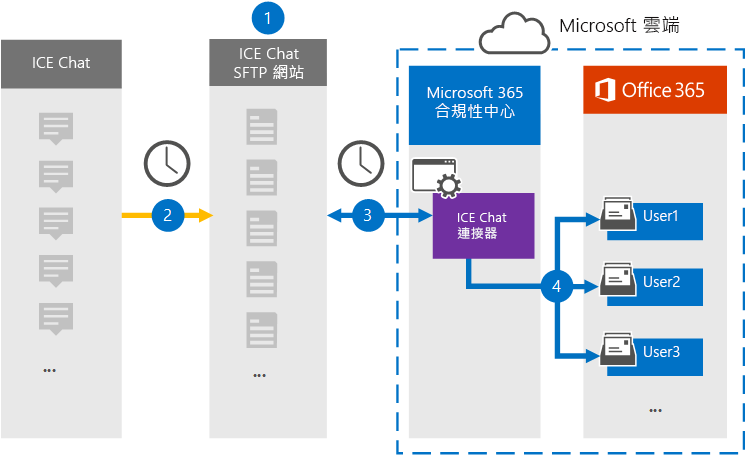

# 設定連接器以封存「 (預覽」的「冰激淩」聊天資料) 

使用 Microsoft 365 規範中心內的原生連接器，從「ICE 聊天共同作業」工具匯入及封存金融服務聊天資料。 在您設定及設定連接器之後，它會連線到您組織的冰激淩聊天安全 FTP (SFTP) 網站一次，將聊天訊息的內容轉換成電子郵件格式，然後將這些專案匯入至 Microsoft 365 中的信箱。

將「冰聊天」資料儲存在使用者信箱中之後，您可以將 Microsoft 365 規範功能（例如訴訟資料暫止、eDiscovery、封存、審核、通訊合規性及 Microsoft 365 保留原則）套用到使用中的聊天資料。 例如，您可以使用內容搜尋來搜尋 ICE 聊天訊息，或在高級 eDiscovery 案例中，將包含 ICE 聊天資料的信箱與保管人產生關聯。 在 Microsoft 365 中使用 ICE 聊天連接器匯入和封存資料，可協助您的組織遵守政府和法規原則。

## 封存的冰激淩聊天資料

下列概要說明如何使用連接器將 Microsoft 365 中的「冰激淩」聊天資料封存。

1. 您的組織可以搭配「ICE 聊天」來設定冰激淩聊天的 SFTP 網站。 您也可以使用 ICE 聊天設定冰激淩聊天，將聊天訊息複製到您的 ICE 聊天網站。

2. 每24小時一次，聊天訊息會複製到您的 ICE 聊天網站。

3. 您在 Microsoft 365 合規性中心內建立的 ICE 聊天連接器會每日連線到冰激淩聊天網站，並將聊天訊息從過去24小時傳送至 Microsoft 雲端中的安全 Azure 儲存位置。 連接器也會將聊天室 massage 的內容轉換為電子郵件訊息格式。

4. 連接器會將聊天訊息項目匯入到特定使用者的信箱。 會在使用者信箱中建立名為「 **ICE 聊天** 」的新資料夾，並將聊天訊息項目匯入該資料夾。 連接器會使用 *SenderEmail* 和 *RecipientEmail* 屬性的值。 每個聊天訊息都包含這些內容，這些屬性會填入寄件者的電子郵件地址，以及聊天訊息的每個收件者/參與者。

   除了使用 *SenderEmail* 和 *RecipientEmail* (屬性之值的自動使用者對應，也意味著該連接器會將聊天訊息匯入寄件者的信箱，並將每個收件者) 的信箱匯入，您也可以透過上載 CSV 對應檔來定義自訂使用者對應。 這個對應檔案包含組織中每位使用者的「冰激淩聊天 *ImId* 」和對應的 Microsoft 365 信箱位址。 如果您啟用自動使用者對應，並提供自訂對應檔案，則每個聊天專案連接器都會先查看自訂對應檔案。 如果找不到與使用者的「交談」 ImId 相對應的有效 Microsoft 365 使用者帳戶，連接器會使用聊天室專案的 *SenderEmail* 和 *RecipientEmail* 屬性，將專案匯入聊天參與者的信箱。 如果連接器在自訂對應檔或 *SenderEmail* 及 *RecipientEmail* 屬性中找不到有效的 Microsoft 365 使用者，則不會匯入該專案。

## 開始之前

封存「植入交談」資料所需的許多步驟都是 Microsoft 365 的外部，必須先完成，您才能在規範中心建立連接器。

- 您的組織必須同意允許 Office 365 匯入服務存取您組織中的信箱資料。 若要同意此要求，請移至 [此頁面](https://login.microsoftonline.com/common/oauth2/authorize?client_id=570d0bec-d001-4c4e-985e-3ab17fdc3073&response_type=code&redirect_uri=https://portal.azure.com/&nonce=1234&prompt=admin_consent)，使用 Office 365 全域管理員的認證登入，然後接受要求。 您必須先完成此步驟，才可在步驟3中成功建立 ICE 聊天連接器。

- 冰聊天會向客戶收取外部法規遵從性的費用。 您的組織應該聯繫「保密協定研討」銷售群組，以討論和簽署「保密協定聊天資料服務」合約，您可以在這裡取得 [https://www.theice.com/publicdocs/agreements/ICE\_Data\_Services\_Agreement.pdf](https://www.theice.com/publicdocs/agreements/ICE\_Data\_Services\_Agreement.pdf) 。 這種合約是在冰聊天和您的組織之間，不包含 Microsoft。 當您在步驟2中設定冰 Chat SFTP 網站之後，「ICE 聊天」會直接向您的組織提供 FTP 認證。 然後，當您在步驟3中設定連接器時，會將這些認證提供給 Microsoft。

- 在步驟3中建立連接器之前，您必須先設定 ICE 聊天 SFTP 網站。 在使用「ICE 聊天」設定 SFTP 網站之後，每日會將 ICE 聊天中的資料上傳到 SFTP 網站。 您在步驟3中建立的連接器會連接到此 SFTP 網站，並將聊天資料傳送至 Microsoft 365 信箱。 SFTP 也會加密在傳輸過程中傳送至信箱的 ICE 聊天資料。

- 在步驟 3 (，以及在步驟 1) 中下載公開金鑰及 IP 位址的系統管理員，必須在 Exchange Online 中指派「信箱匯入匯出」角色。 在 Microsoft 365 規範中心的 [ **資料連線器** ] 頁面上新增連接器時，此角色是必要的。 依預設，此角色不會指派給 Exchange Online 內的任何角色群組。 您可以將信箱匯入匯出角色新增至 Exchange Online 中的「組織管理」角色群組。 或者，您可以建立角色群組、指派信箱匯入匯出角色，然後將適當的使用者新增為成員。 如需詳細資訊，請參閱「管理 Exchange Online 中的角色群組」一文中的 [ [建立角色群組](https://docs.microsoft.com/Exchange/permissions-exo/role-groups#create-role-groups) 或 [修改角色群組](https://docs.microsoft.com/Exchange/permissions-exo/role-groups#modify-role-groups) ] 區段。

## 步驟1：取得 SSH 和 PGP 公開金鑰

第一步是取得公開金鑰的副本，以取得安全命令介面 (SSH) 和非常好的隱私權 (PGP) 。 您可以在步驟2中使用這些機碼，將「ICE 聊天 SFTP」網站設定為允許您在步驟3中建立的連接器 () 連線到 SFTP 網站，並將「ICE 聊天」資料轉接至 Microsoft 365 信箱。 您也會在此步驟中取得 IP 位址，當您設定 ICE 聊天 SFTP 網站時，您可以使用此位址。

1. 移至 [https://compliance.microsoft.com](https://compliance.microsoft.com) 並按一下左側導覽中的 [ **資料連線器** ]。

2. 在 [ **資料連線器] () 預覽 ** ] 頁面的 [ **冰激淩聊天**] 底下，按一下 [ **View**]。

3. 在 [ **ICE 聊天** ] 頁面上，按一下 [ **新增連接器**]。

4. 在 [ **服務條款** ] 頁面上，按一下 [ **接受**]。

5. 在 [步驟 1] 底下的 [ **新增 ICE 聊天室網站** ] 頁面上，按一下 [ **下載 SSH 金鑰**]、[ **下載 PGP 金鑰**] 和 [ **下載 IP 位址** ] 連結，將每個檔案的副本儲存到本機電腦。 這些檔案包含下列專案，可用來設定步驟2中的 ICE 聊天 SFTP 網站：

   - SSH 公開金鑰：此機碼用於設定安全的 SSH，以在連接器連線至 ICE 聊天 SFTP 網站時，啟用安全的遠端登入。

   - PGP 公開金鑰：此機碼是用來設定從「ICE 聊天 SFTP」網站傳輸到 Microsoft 365 的資料加密。

   - IP 位址：「ICE 聊天 SFTP」網站已設定為只接受來自此 IP 位址的連線要求，該要求是由您在步驟3中建立的 ICE 聊天連接器所使用。

6. 按一下 [ **取消** ] 關閉嚮導。 您會回到步驟3中的這個嚮導，以建立連接器。

## 步驟2：設定 ICE 聊天 SFTP 網站

下一步是使用 SSH 和 PGP 公開金鑰和您在步驟1中取得的 IP 位址，來設定 ICE 聊天室網站的 SSH 驗證和 PGP 加密。 這可讓您在步驟3中建立的 ICE 聊天連接器連線到「ICE 聊天 SFTP」網站，並將「ICE 聊天」資料轉接至 Microsoft 365。 您必須使用 [ICE 聊天] 客戶支援來設定您的冰激淩聊天網站。

## 步驟3：建立 ICE 聊天連接器

最後一個步驟是在 Microsoft 365 規範中心建立 ICE 聊天連接器。 連接器會使用您提供的資訊來連線至「ICE 聊天 SFTP」網站，並將聊天訊息轉接至 Microsoft 365 中對應的使用者信箱方塊。

1. 移至 [https://compliance.microsoft.com](https://compliance.microsoft.com) 並按一下左側導覽中的 [ **資料連線器** ]。

2. 在 [**冰激淩聊天**] 底下的 [**資料連線器**] 頁面上，按一下 [ **View**]。

3. 在 [ **ICE 聊天** ] 頁面上，按一下 [ **新增連接器**]。

4. 在 [ **服務條款** ] 頁面上，按一下 [ **接受**]。

5. 在 [ **新增冰聊天的認證** ] 頁面的 [步驟 3] 下，于下列方塊中輸入必要的資訊，然後按一下 [ **驗證**連線]。

   - **確認程式碼：** 您的組織的識別碼，用來做為 ICE 聊天 SFTP 網站的使用者名稱。

   - **密碼：** 您的 ICE 聊天 SFTP 網站的密碼。

   - **SFTP URL:** 「冰聊天 SFTP」網站的 URL (例如，sftp.theice.com) 。

   - **SFTP 埠：** ICE 聊天 SFTP 網站的埠號碼。 連接器會使用此埠連接到 SFTP 網站。

6. 驗證連接後，請按 **[下一步]**。

7. 在 [將 **外部使用者對應至 Microsoft 365 使用者** ] 頁面上，啟用 [自動使用者對應]，並視需要提供自訂使用者對應。 您可以在此頁面上下載使用者對應的 CSV 檔案複本。 您可以將使用者對應新增至檔案，然後將其上傳。

   > [!NOTE]
   > 如先前所述，自訂對應檔 CSV 檔案包含每個使用者的「ICE 聊天 imid」和對應的 Microsoft 365 信箱位址。 如果您啟用自動使用者對應，並提供每個聊天室專案的自訂對應，連接器會先查看自訂對應檔案。 如果找不到與使用者的冰激淩聊天 imid 相對應的有效 Microsoft 365 使用者，連接器會將該專案匯入至聊天室專案之 *SenderEmail* 和 *RecipientEmail* 屬性中所指定使用者的信箱。 如果連接器沒有透過自動或自訂使用者對應找到有效的 Microsoft 365 使用者，則不會匯入該專案。

8. 按 **[下一步]**，複查您的設定，然後按一下 **[完成]** 以建立連接器。

9. 移至 [ **資料連線器** ] 頁面，查看新連接器的匯入程式的進度。
