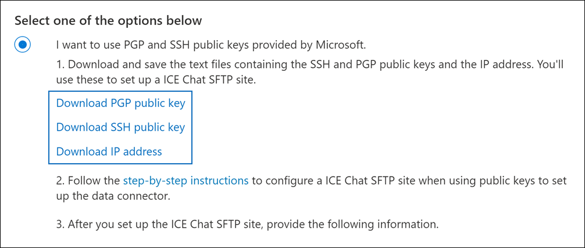

# 設定連接器以封存「我的冰激淩」聊天資料Set up a connector to archive ICE Chat data

使用 Microsoft 365 規範中心內的原生連接器，從「ICE 聊天共同作業」工具匯入及封存金融服務聊天資料。Use a native connector in the Microsoft 365 compliance center to import and archive financial services chat data from the ICE Chat collaboration tool. 在您設定及設定連接器之後，它會連線到您組織的冰激淩聊天安全 FTP (SFTP) 網站一次，將聊天訊息的內容轉換成電子郵件格式，然後將這些專案匯入 Microsoft 365 中的信箱。After you set up and configure a connector, it connects to your organization's ICE Chat secure FTP (SFTP) site once every day, converts the content of chat messages to an email message format, and then import those items to mailboxes in Microsoft 365.

將「冰聊天」資料儲存在使用者信箱中之後，您可以套用 Microsoft 365 合規性功能，例如訴訟暫止、eDiscovery、封存、審核、通訊合規性，以及 Microsoft 365 保留原則，以用於冰聊天資料。After ICE chat data is stored in user mailboxes, you can apply Microsoft 365 compliance features such as litigation hold, eDiscovery, archiving, auditing, communication compliance, and Microsoft 365 retention policies to ICE Chat data. 例如，您可以使用內容搜尋來搜尋「ice 聊天」訊息，或在 Advanced eDiscovery 案例中，將包含 ICE 聊天資料的信箱與保管人產生關聯。For example, you can search ICE Chat messages using content search or associate the mailbox that contains the ICE Chat data with a custodian in an Advanced eDiscovery case. 使用 ICE 聊天連接器在 Microsoft 365 中匯入和封存資料，可協助您的組織遵守政府和法規原則。Using an ICE Chat connector to import and archive data in Microsoft 365 can help your organization stay compliant with government and regulatory policies.

## 封存的冰激淩聊天資料Overview of archiving ICE Chat data

下列概要說明如何使用連接器封存 Microsoft 365 中的「冰交談」資料。The following overview explains the process of using a connector to archive ICE chat data in Microsoft 365.

1. 您的組織可以搭配「ICE 聊天」來設定冰激淩聊天的 SFTP 網站。Your organization works with ICE Chat to set up an ICE Chat SFTP site. 您也可以使用 ICE 聊天設定冰激淩聊天，將聊天訊息複製到您的 ICE 聊天網站。You'll also work with ICE Chat to configure ICE Chat to copy chat messages to your ICE Chat SFTP site.

2. 每24小時一次，聊天訊息會複製到您的 ICE 聊天網站。Once every 24 hours, chat messages from ICE Chat are copied to your ICE Chat SFTP site.

3. 您在 Microsoft 365 合規性中心內建立的 ice 聊天連接器會每日連線到「ice 聊天 SFTP」網站，並將聊天訊息從過去24小時內傳送至 Microsoft 雲端中的安全 Azure 儲存體位置。The ICE Chat connector that you create in the Microsoft 365 compliance center connects to the ICE Chat SFTP site every day and transfers the chat messages from the previous 24 hours to a secure Azure Storage location in the Microsoft cloud. 連接器也會將聊天室 massage 的內容轉換為電子郵件訊息格式。The connector also converts the content of a chat massage to an email message format.

4. 連接器會將聊天訊息項目匯入到特定使用者的信箱。The connector imports chat message items to the mailboxes of specific users. 會在使用者信箱中建立名為「 **ICE 聊天** 」的新資料夾，並將聊天訊息項目匯入該資料夾。A new folder named **ICE Chat** is created in the user mailboxes and the chat message items are imported to that folder. 連接器會使用 *SenderEmail* 和 *RecipientEmail* 屬性的值。The connector does by using the value of the *SenderEmail* and *RecipientEmail* properties. 每個聊天訊息都包含這些內容，這些屬性會填入寄件者的電子郵件地址，以及聊天訊息的每個收件者/參與者。Every chat message contains these properties, which are populated with email address of the sender and every recipient/participant of the chat message.

   除了使用 *SenderEmail* 和 *RecipientEmail* (屬性之值的自動使用者對應，也意味著該連接器會將聊天訊息匯入寄件者的信箱，並將每個收件者) 的信箱匯入，您也可以透過上載 CSV 對應檔來定義自訂使用者對應。In addition to automatic user mapping that uses the values of the *SenderEmail* and *RecipientEmail* property (which means that the connector imports a chat message to the sender's mailbox and the mailboxes of every recipient), you can also define custom user mapping by uploading a CSV mapping file. 這個對應檔案包含組織中每位使用者的「冰激淩聊天 *ImId* 」和對應的 Microsoft 365 信箱位址。This mapping file contains the ICE Chat *ImId* and the corresponding Microsoft 365 mailbox address for every user in your organization. 如果您啟用自動使用者對應，並提供自訂對應檔案，則每個聊天專案連接器都會先查看自訂對應檔案。If you enable automatic user mapping and provide a custom-mapping file, for every chat item the connector will first look at the custom-mapping file. 如果找不到與使用者的「交談」 ImId 相對應的有效 Microsoft 365 使用者帳戶，連接器會使用聊天室專案的 *SenderEmail* 和 *RecipientEmail* 屬性，將專案匯入聊天室參與者的信箱。If it doesn't find a valid Microsoft 365 user account that corresponds to a user's ICE Chat ImId, the connector will use the *SenderEmail* and *RecipientEmail* properties of the chat item to import the item to the mailboxes of the chat participants. 如果連接器在自訂對應檔或 *SenderEmail* 及 *RecipientEmail* 屬性中找不到有效的 Microsoft 365 使用者，則不會匯入該專案。If the connector doesn't find a valid Microsoft 365 user in either the custom-mapping file or the *SenderEmail* and *RecipientEmail* properties, the item won't be imported.

## 在您設定連接器之前Before you set up a connector

封存「交談」資料所需的部分執行步驟是 Microsoft 365 外部的，必須先完成，您才能在規範中心建立連接器。Some of the implementation steps required to archive ICE Chat data are external to Microsoft 365 and must be completed before you can create the connector in the compliance center.

- 冰聊天會向客戶收取外部法規遵從性的費用。ICE Chat charges their customers a fee for external compliance. 您的組織應該聯繫「保密協定研討」銷售群組，以討論和簽署「保密協定聊天資料服務」合約，您可以在這裡取得 [https://www.theice.com/publicdocs/agreements/ICE\_Data\_Services\_Agreement.pdf](https://www.theice.com/publicdocs/agreements/ICE\_Data\_Services\_Agreement.pdf) 。Your organization should contact the ICE Chat sales group to discuss, and to sign the ICE Chat data services agreement, which you can obtain at [https://www.theice.com/publicdocs/agreements/ICE\_Data\_Services\_Agreement.pdf](https://www.theice.com/publicdocs/agreements/ICE\_Data\_Services\_Agreement.pdf). 這種合約是在冰聊天和您的組織之間，不包含 Microsoft。This agreement is between ICE Chat and your organization and does not involve Microsoft. 當您在步驟2中設定冰 Chat SFTP 網站之後，「ICE 聊天」會直接向您的組織提供 FTP 認證。After you set up an ICE Chat SFTP site in Step 2, ICE Chat provides the FTP credentials directly to your organization. 然後，當您在步驟3中設定連接器時，會將這些認證提供給 Microsoft。Then you who would provide those credentials to Microsoft when setting up the connector in Step 3.

- 在步驟3中建立連接器之前，您必須先設定 ICE 聊天 SFTP 網站。You must set up an ICE Chat SFTP site before creating the connector in Step 3. 在使用「ICE 聊天」設定 SFTP 網站之後，每日會將 ICE 聊天中的資料上傳到 SFTP 網站。After working with ICE Chat to set up the SFTP site, data from ICE Chat is uploaded to the SFTP site every day. 您在步驟3中建立的連接器會連接到此 SFTP 網站，並將聊天資料傳送至 Microsoft 365 信箱。The connector you create in Step 3 connects to this SFTP site and transfers the chat data to Microsoft 365 mailboxes. SFTP 也會加密在傳輸過程中傳送至信箱的 ICE 聊天資料。SFTP also encrypts the ICE Chat data that's sent to mailboxes during the transfer process.

- 若要設定 ICE 聊天連接器，您必須使用金鑰和金鑰密碼短語，以取得非常好的隱私權 (PGP) 和安全命令介面 (SSH) 。To set up an ICE Chat connector, you have to use keys and key passphrases for Pretty Good Privacy (PGP) and Secure Shell (SSH). 這些機碼是用來設定冰激淩聊天 SFTP 網站，並由連接器用來連接到「ICE 聊天 SFTP」網站，將資料匯入 Microsoft 365。These keys are used to configure the ICE Chat SFTP site and used by the connector to connect to the ICE Chat SFTP site to import data to Microsoft 365. PGP 金鑰是用來設定從「ICE 聊天 SFTP」網站傳輸到 Microsoft 365 的資料加密。The PGP key is used to configure the encryption of data that's transferred from the ICE Chat SFTP site to Microsoft 365. SSH 金鑰是用來設定安全命令介面，以在連接器連線至 ICE 聊天 SFTP 網站時，啟用安全的遠端登入。The SSH key is used to configure secure shell to enable a secure remote login when the connector connects to the ICE Chat SFTP site.

  當您設定連接器時，可以選擇使用 Microsoft 提供的公開金鑰和金鑰密碼，也可以使用您自己的私密金鑰和密碼。When setting up a connector, you have the option to use public keys and key passphrases provided by Microsoft or you can use your own private keys and passphrases. 建議您使用 Microsoft 提供的公用金鑰。We recommend that you use the public keys provided by Microsoft. 不過，如果您的組織已使用私密金鑰設定了 ICE 聊天 SFTP 網站，則可以使用這些相同的私密金鑰建立連接器。However, if your organization has already configured an ICE Chat SFTP site using private keys, then you can create a connector using these same private keys.

- 「ICE 聊天連接器」可以在一天內匯入200000項總計。The ICE Chat connector can import a total of 200,000 items in a single day. 如果 SFTP 網站上的專案超過200000個，將不會將這些專案匯入至 Microsoft 365。If there are more than 200,000 items on the SFTP site, none of those items will be imported to Microsoft 365.

- 在步驟 3 (及下載步驟 1) 中的公開金鑰及 IP 位址的系統管理員，必須在 Exchange Online 中指派「信箱匯入匯出」角色。The admin who creates the ICE Chat connector in Step 3 (and who downloads the public keys and IP address in Step 1) must be assigned the Mailbox Import Export role in Exchange Online. 在 [Microsoft 365 規範中心] 的 [**資料連線器**] 頁面上新增連接器時，此角色是必要的。This role is required to add connectors on the **Data connectors** page in the Microsoft 365 compliance center. 依預設，此角色不會指派給 Exchange Online 內的任何角色群組。By default, this role isn't assigned to any role group in Exchange Online. 您可以將信箱匯入匯出角色新增至 Exchange Online 中的「組織管理」角色群組。You can add the Mailbox Import Export role to the Organization Management role group in Exchange Online. 或者，您可以建立角色群組、指派信箱匯入匯出角色，然後將適當的使用者新增為成員。Or you can create a role group, assign the Mailbox Import Export role, and then add the appropriate users as members. 如需詳細資訊，請參閱「在 Exchange Online 中管理角色群組」一文中的 [[建立角色群組](/Exchange/permissions-exo/role-groups#create-role-groups)或[修改角色](/Exchange/permissions-exo/role-groups#modify-role-groups)群組] 區段。For more information, see the [Create role groups](/Exchange/permissions-exo/role-groups#create-role-groups) or [Modify role groups](/Exchange/permissions-exo/role-groups#modify-role-groups) sections in the article "Manage role groups in Exchange Online".

## 使用公開金鑰設定連接器Set up a connector using public keys

本節中的步驟將告訴您如何使用適用于極佳隱私權 (PGP) 和安全命令介面 (SSH) 的公開金鑰來設定 ICE 聊天連接器。The steps in this section show you how to set up an ICE Chat connector using the public keys for Pretty Good Privacy (PGP) and Secure Shell (SSH).

### 步驟1：取得 PGP 和 SSH 公開金鑰Step 1: Obtain PGP and SSH public keys

第一步是取得正確隱私權的公開金鑰複本 (PGP) 和安全命令介面 (SSH) 。The first step is to obtain a copy of the public keys for Pretty Good Privacy (PGP) and Secure Shell (SSH). 您可以在步驟2中使用這些機碼，將「ice 聊天 SFTP」網站設定為允許您在步驟) 3 中建立的連接器 (，以連線到 SFTP 網站，並將「ICE 聊天」資料轉接至 Microsoft 365 信箱。You use these keys in Step 2 to configure the ICE Chat SFTP site to allow the connector (that you create in Step 3) to connect to the SFTP site and transfer the ICE Chat data to Microsoft 365 mailboxes. 您也會在此步驟中取得 IP 位址，當您設定 ICE 聊天 SFTP 網站時，您可以使用此位址。You will also obtain an IP address in this step, which you use when configuring the ICE Chat SFTP site.

1. 移至 [https://compliance.microsoft.com](https://compliance.microsoft.com) 並按一下左側導覽中的 [ **資料連線器** ]。Go to [https://compliance.microsoft.com](https://compliance.microsoft.com) and click **Data connectors** in the left nav.

2. 在 [**冰激淩聊天**] 底下的 [**資料連線器**] 頁面上，按一下 [ **View**]。On the **Data connectors** page under **ICE Chat**, click **View**.

3. 在 [ **ICE 聊天** ] 頁面上，按一下 [ **新增連接器**]。On the **ICE Chat** page, click **Add connector**.

4. 在 [ **服務條款** ] 頁面上，按一下 [ **接受**]。On the **Terms of service** page, click **Accept**.

5. 在 [ **新增內容來源的認證** ] 頁面上，按一下 [ **我想要使用 MICROSOFT 提供的 PGP 和 SSH 公開金鑰**]。On the **Add credentials for content source** page, click **I want to use PGP and SSH public keys provided by Microsoft**.

   

6. 在 [步驟 1] 下，按一下 [ **下載 SSH 金鑰**]、[ **下載 PGP 金鑰**] 和 [ **下載 IP 位址** ] 連結，將每個檔案的副本儲存到本機電腦。Under step 1, click the **Download SSH key**, **Download PGP key**, and **Download IP address** links to save a copy of each file to your local computer.

   

   這些檔案包含下列專案，可用來設定步驟2中的 ICE 聊天 SFTP 網站：These files contain the following items that are used to configure the ICE Chat SFTP site in Step 2:

   - PGP 公開金鑰：此機碼是用來設定從「ICE 聊天 SFTP」網站傳輸到 Microsoft 365 的資料加密。PGP public key: This key is used to configure the encryption of data that's transferred from the ICE Chat SFTP site to Microsoft 365.

   - SSH 公開金鑰：此機碼用於設定安全的 SSH，以在連接器連線至 ICE 聊天 SFTP 網站時，啟用安全的遠端登入。SSH public key: This key is used to configure Secure SSH to enable a secure remote login when the connector connects to the ICE Chat SFTP site.

   - IP 位址：「ICE 聊天 SFTP」網站已設定為只接受來自此 IP 位址的連線要求，該要求是由您在步驟3中建立的 ICE 聊天連接器所使用。IP address: The ICE Chat SFTP site is configured to accept a connection request only from this IP address, which is used by the ICE Chat connector that you create in Step 3.

7. 按一下 [ **取消** ] 關閉嚮導。Click **Cancel** to close the wizard. 您會回到步驟3中的這個嚮導，以建立連接器。You come back to this wizard in Step 3 to create the connector.

### 步驟2：設定 ICE 聊天 SFTP 網站Step 2: Configure the ICE Chat SFTP site

下一個步驟是使用您在步驟1中取得的 PGP 和 SSH 公開金鑰及 IP 位址，來設定用於 ICE 聊天室網站的 PGP 加密和 SSH 驗證。The next step is to use the PGP and SSH public keys and the IP address that you obtained in Step 1 to configure PGP encryption and SSH authentication for the ICE Chat SFTP site. 這可讓您在步驟3中建立的 ICE 聊天連接器連線到「ICE 聊天 SFTP」網站，並將「冰交談」資料轉接至 Microsoft 365。This lets the ICE Chat connector that you create in Step 3 connect to the ICE Chat SFTP site and transfer ICE Chat data to Microsoft 365. 您必須使用 [ICE 聊天] 客戶支援來設定您的冰激淩聊天網站。You need to work with ICE Chat customer support to set up your ICE Chat SFTP site.

### 步驟3：建立 ICE 聊天連接器Step 3: Create an ICE Chat connector

最後一個步驟是在 Microsoft 365 規範中心建立 ICE 聊天連接器。The last step is to create an ICE Chat connector in the Microsoft 365 compliance center. 連接器會使用您提供的資訊來連線至「ICE 聊天 SFTP」網站，並將交談郵件轉接至 Microsoft 365 中對應的使用者信箱方塊。The connector uses the information you provide to connect to the ICE Chat SFTP site and transfer chat messages to the corresponding user mailbox boxes in Microsoft 365.

1. 移至 [https://compliance.microsoft.com](https://compliance.microsoft.com) 並按一下左側導覽中的 [ **資料連線器** ]。Go to [https://compliance.microsoft.com](https://compliance.microsoft.com) and click **Data connectors** in the left nav.

2. 在 [**冰激淩聊天**] 底下的 [**資料連線器**] 頁面上，按一下 [ **View**]。On the **Data connectors** page under **ICE Chat**, click **View**.

3. 在 [ **ICE 聊天** ] 頁面上，按一下 [ **新增連接器**]。On the **ICE Chat** page, click **Add connector**.

4. 在 [ **服務條款** ] 頁面上，按一下 [ **接受**]。On the **Terms of service** page, click **Accept**.

5. 在 [ **新增內容來源的認證** ] 頁面上，按一下 [ **我想要使用 PGP 和 SSH 公開金鑰**]。On the **Add credentials for content source** page, click **I want to use PGP and SSH public keys**.

6. 在 [步驟 3] 底下的下列方塊中，輸入必要的資訊，然後按一下 [ **驗證** 連線]。Under Step 3, enter the required information in the following boxes and then click **Validate connection**.

   - **確認程式碼：** 您的組織的識別碼，用來做為 ICE 聊天 SFTP 網站的使用者名稱。**Firm code:** The ID for your organization, which is used as the username for the ICE Chat SFTP site.

   - **密碼：** 您的 ICE 聊天 SFTP 網站的密碼。**Password:** The password for your ICE Chat SFTP site.

   - **SFTP URL:** 「冰聊天 SFTP」網站的 URL (例如， `sftp.theice.com`) 。**SFTP URL:** The URL for the ICE Chat SFTP site (for example, `sftp.theice.com`). 您也可以使用此值的 IP 位址。You can also use an IP address for this value.

   - **SFTP 埠：** ICE 聊天 SFTP 網站的埠號碼。**SFTP port:** The port number for the ICE Chat SFTP site. 連接器會使用此埠連接到 SFTP 網站。The connector uses this port to connect to the SFTP site.

7. 成功驗證成功後，請按 **[下一步]**。After the connection is successfully validated, click **Next**.

8. 在 [將 **外部使用者對應至 Microsoft 365 使用者**] 頁面上，啟用 [自動使用者對應]，並視需要提供自訂使用者對應。On the **Map external users to Microsoft 365 users** page, enable automatic user mapping and provide custom user mapping as required. 您可以在此頁面上下載使用者對應的 CSV 檔案複本。You can download a copy of the user-mapping CSV file on this page. 您可以將使用者對應新增至檔案，然後將其上傳。You can add the user mappings to the file and then upload it.

   > [!NOTE]
   > 如先前所述，自訂對應檔 CSV 檔案包含每位使用者的「ICE 聊天 imid」和對應的 Microsoft 365 信箱位址。As previously explained, custom mapping file CSV file contains the ICE Chat imid and corresponding Microsoft 365 mailbox address for each user. 如果您啟用自動使用者對應，並提供每個聊天室專案的自訂對應，連接器會先查看自訂對應檔案。If you enable automatic user mapping and provide a custom mapping, for every chat item, the connector will first look at custom mapping file. 如果找不到與使用者的「交談」 imid 相對應的有效 Microsoft 365 使用者，連接器會將該專案匯入至聊天室專案的 *SenderEmail* 和 *RecipientEmail* 屬性中所指定之使用者的信箱。If it doesn't find a valid Microsoft 365 user that corresponds to a user's ICE Chat imid, the connector will import the item to the mailboxes for the users specified in the *SenderEmail* and *RecipientEmail* properties of the chat item. 如果連接器沒有透過自動或自訂使用者對應找到有效的 Microsoft 365 使用者，則不會匯入該專案。If the connector doesn't find a valid Microsoft 365 user by either automatic or custom user mapping, the item won't be imported.

9. 按 **[下一步]**，複查您的設定，然後按一下 **[完成]** 以建立連接器。Click **Next**, review your settings, and then click **Finish** to create the connector.

10. 移至 [ **資料連線器** ] 頁面，查看新連接器的匯入程式的進度。Go to the **Data connectors** page to see the progress of the import process for the new connector.

## 使用私密金鑰設定連接器Set up a connector using private keys

本節中的步驟說明如何使用 PGP 和 SSH 私密金鑰設定 ICE 聊天連接器。The steps in this section show you how to set up an ICE Chat connector using PGP and SSH private keys. 此連接器設定選項適用于已使用私密金鑰設定冰聊天 SFTP 網站的組織。This connector setup option is intended for organizations that have already configured an ICE Chat SFTP site using private keys.

### 步驟1：取得 IP 位址以設定 ICE 聊天 SFTP 網站Step 1: Obtain an IP address to configure the ICE Chat SFTP site

如果您的組織已使用 PGP 和 SSH 私密金鑰來設定 ICE 聊天室網站，則您必須取得 IP 位址，並提供給「ICE 聊天客戶支援」。If your organization has used PGP and SSH private keys to set up an ICE Chat SFTP site, then you have to obtain an IP address and provide it to ICE Chat customer support. 必須將「ICE 聊天 SFTP」網站設定為接受來自此 IP 位址的連線要求。The ICE Chat SFTP site must be configured to accept  connection requests from this IP address. 「ICE 聊天連接器」會使用相同的 IP 位址來連線到 SFTP 網站，並將「ICE 聊天」資料轉接至 Microsoft 365。The same IP address is used by the ICE Chat connector to connect to the SFTP site and transfer ICE Chat data to Microsoft 365.

若要取得 IP 位址：To obtain the IP address:

1. 移至 <https://compliance.microsoft.com> 並按一下左側導覽中的 [ **資料連線器** ]。Go to <https://compliance.microsoft.com> and click **Data connectors** in the left nav.

2. 在 [**冰激淩聊天**] 底下的 [**資料連線器**] 頁面上，按一下 [ **View**]。On the **Data connectors** page under **ICE Chat**, click **View**.

3. 在 [ **ICE 聊天** 產品描述] 頁面上，按一下 [**新增連接器**]On the **ICE Chat** product description page, click **Add connector**

4. 在 [ **服務條款** ] 頁面上，按一下 [ **接受**]。On the **Terms of service** page, click **Accept**.

5. 在 [ **新增內容來源的認證** ] 頁面上，按一下 [ **我想要使用 PGP 和 SSH 私密金鑰**]。On the **Add credentials for content source** page, click **I want to use PGP and SSH private keys**.

   

6. 在 [步驟 1] 底下，按一下 [ **下載 ip 位址** ]，將 ip 位址檔案的副本儲存到本機電腦。Under step 1, click **Download IP address** to save a copy of the IP address file to your local computer.

   

7. 按一下 [ **取消** ] 關閉嚮導。Click **Cancel** to close the wizard. 您會回到步驟2中的這個嚮導，以建立連接器。You come back to this wizard in Step 2 to create the connector.

您必須使用 ICE 聊天客戶支援，設定您的 ICE 聊天 SFTP 網站，以接受來自此 IP 位址的連線要求。You need to work with ICE Chat customer support to configure your ICE Chat SFTP site to accept connection requests from this IP address.

### 步驟2：建立 ICE 聊天連接器Step 2: Create an ICE Chat connector

設定您的 ICE 聊天 SFTP 網站後，下一步是在 Microsoft 365 規範中心建立 ICE 聊天連接器。After your ICE Chat SFTP site is configured, the next step is to create an ICE Chat connector in the Microsoft 365 compliance center. 連接器會使用您提供的資訊來連線至「ICE 聊天 SFTP」網站，並將電子郵件傳送至 Microsoft 365 中對應的使用者信箱方塊。The connector uses the information you provide to connect to the ICE Chat SFTP site and transfer email messages to the corresponding user mailbox boxes in Microsoft 365. 若要完成此步驟，請務必具有您用來設定您的冰激淩聊天 SFTP 網站之相同私密金鑰和金鑰密碼的副本。To complete this step, be sure to have copies of the same private keys and key passphrases that you used to set up your ICE Chat SFTP site.

1. 移至 <https://compliance.microsoft.com> 並按一下左側導覽中的 [ **資料連線器** ]。Go to <https://compliance.microsoft.com> and click **Data connectors** in the left nav.

2. 在 [**冰激淩聊天**] 底下的 [**資料連線器**] 頁面上，按一下 [ **View**]。On the **Data connectors** page under **ICE Chat**, click **View**.

3. 在 [ **ICE 聊天** 產品描述] 頁面上，按一下 [**新增連接器**]On the **ICE Chat** product description page, click **Add connector**

4. 在 [ **服務條款** ] 頁面上，按一下 [ **接受**]。On the **Terms of service** page, click **Accept**.

5. 在 [ **新增內容來源的認證** ] 頁面上，按一下 [ **我想要使用 PGP 和 SSH 私密金鑰**]。On the **Add credentials for content source** page, click **I want to use PGP and SSH private keys**.

6. 在 [步驟 3] 底下的下列方塊中，輸入必要的資訊，然後按一下 [ **驗證** 連線]。Under Step 3, enter the required information in the following boxes and then click **Validate connection**.

      - **名稱：** 連接器的名稱。**Name:** The name for the connector. 它在您的組織中必須是唯一的。It must be unique in your organization.

      - **確認程式碼：** 組織的識別碼，用來做為冰激淩的「聊天 SFTP」網站的使用者名稱。**Firm code:** The ID for your organization that is used as the username for the ICE Chat SFTP site.

      - **密碼：** 組織的冰激淩聊天網站的密碼。**Password:** The password for your organization's ICE Chat SFTP site.

      - **SFTP URL:** 「冰聊天 SFTP」網站的 URL (例如， `sftp.theice.com`) 。**SFTP URL:** The URL for the ICE Chat SFTP site (for example, `sftp.theice.com`). 您也可以使用此值的 IP 位址。You can also use an IP address for this value.

      - **SFTP 埠：** ICE 聊天 SFTP 網站的埠號碼。**SFTP port:** The port number for the ICE Chat SFTP site. 連接器會使用此埠連接到 SFTP 網站。The connector uses this port to connect to the SFTP site.

      - **PGP 私密金鑰：** 冰激淩聊天室網站的 PGP 私密金鑰。**PGP private key:** The PGP private key for the ICE Chat SFTP site. 請務必加入整個私密金鑰值，包括按鍵區塊的開始和結束行。Be sure to include the entire private key value, including the beginning and ending lines of the key block.

      - **PGP 金鑰複雜密碼：** PGP 私密金鑰的複雜密碼。**PGP key passphrase:** The passphrase for the PGP private key.

      - **SSH 私密金鑰：** ICE 聊天室網站的 SSH 私密金鑰。**SSH private key:** The SSH private key for the ICE Chat SFTP site. 請務必加入整個私密金鑰值，包括按鍵區塊的開始和結束行。Be sure to include the entire private key value, including the beginning and ending lines of the key block.

      - **SSH 金鑰密碼短語：** SSH 私密金鑰的複雜密碼。**SSH key passphrase:** The passphrase for the SSH private key.

7. 成功驗證成功後，請按 **[下一步]**。After the connection is successfully validated, click **Next**.

8. 在 [將 **ICE 聊天使用者 Microsoft 365 使用者**] 頁面上，啟用 [自動使用者對應]，並視需要提供自訂使用者對應。On the **Map ICE Chat users to Microsoft 365 users** page, enable automatic user mapping and provide custom user mapping as required.

   > [!NOTE]
   > 如先前所述，自訂對應檔 CSV 檔案包含每位使用者的「ICE 聊天 imid」和對應的 Microsoft 365 信箱位址。As previously explained, custom mapping file CSV file contains the ICE Chat imid and corresponding Microsoft 365 mailbox address for each user. 如果您啟用自動使用者對應，並提供每個聊天室專案的自訂對應，連接器會先查看自訂對應檔案。If you enable automatic user mapping and provide a custom mapping, for every chat item, the connector will first look at custom mapping file. 如果找不到與使用者的「交談」 imid 相對應的有效 Microsoft 365 使用者，連接器會將該專案匯入至聊天室專案的 *SenderEmail* 和 *RecipientEmail* 屬性中所指定之使用者的信箱。If it doesn't find a valid Microsoft 365 user that corresponds to a user's ICE Chat imid, the connector will import the item to the mailboxes for the users specified in the *SenderEmail* and *RecipientEmail* properties of the chat item. 如果連接器沒有透過自動或自訂使用者對應找到有效的 Microsoft 365 使用者，則不會匯入該專案。If the connector doesn't find a valid Microsoft 365 user by either automatic or custom user mapping, the item won't be imported.

9. 按 **[下一步]**，複查您的設定，然後按一下 **[完成]** 以建立連接器。Click **Next**, review your settings, and then click **Finish** to create the connector.

10. 移至 [ **資料連線器** ] 頁面，查看新連接器的匯入程式的進度。Go to the **Data connectors** page to see the progress of the import process for the new connector. 按一下連接線以顯示飛出頁面，該頁面包含連接器的相關資訊。Click the connector to display the flyout page, which contains information about the connector.
