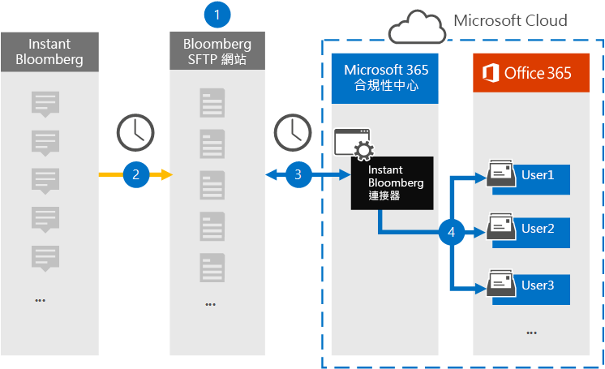

# 設定連接器來封存 Instant Bloomberg 資料Set up a connector to archive Instant Bloomberg data

使用 Microsoft 365 規範中心內的原生連接器，從 [立即 Bloomberg](https://www.bloomberg.com/professional/product/collaboration/) 共同作業工具匯入及封存金融服務聊天資料。Use a native connector in the Microsoft 365 compliance center to import and archive financial services chat data from the [Instant Bloomberg](https://www.bloomberg.com/professional/product/collaboration/) collaboration tool. 在您設定及設定連接器之後，它會連線到您組織的 Bloomberg secure FTP site (SFTP) 一天，將聊天訊息的內容轉換成電子郵件格式，然後將這些專案匯入 Microsoft 365 中的信箱。After you set up and configure a connector, it connects to your organization's Bloomberg secure FTP site (SFTP) once every day, converts the content of chat messages to an email message format, and then imports those items to mailboxes in Microsoft 365.

立即 Bloomberg 資料儲存在使用者信箱之後，您可以將 Microsoft 365 規範功能（例如訴訟暫止、內容搜尋、In-Place 封存、審核、通訊法規遵從性）和 Microsoft 365 保留原則套用至立即 Bloomberg 資料。After Instant Bloomberg data is stored in user mailboxes, you can apply Microsoft 365 compliance features such as Litigation Hold, Content Search, In-Place Archiving, Auditing, Communication compliance, and Microsoft 365 retention policies to Instant Bloomberg data. 例如，您可以使用內容搜尋來搜尋立即 Bloomberg 聊天室訊息，或將包含立即 Bloomberg 資料的信箱與高級 eDiscovery 案例中的保管人建立關聯。For example, you can search Instant Bloomberg chat messages using Content Search or associate the mailbox that contains the Instant Bloomberg data with a custodian in an Advanced eDiscovery case. 使用立即 Bloomberg 連接器匯入和封存 Microsoft 365 中的資料，可協助您的組織遵守政府和法規原則。Using an Instant Bloomberg connector to import and archive data in Microsoft 365 can help your organization stay compliant with government and regulatory policies.

## 封存立即 Bloomberg 資料一覽Overview of archiving Instant Bloomberg data

下列概要說明如何使用連接器在 Microsoft 365 中封存立即 Bloomberg 聊天室資料。The following overview explains the process of using a connector to archive Instant Bloomberg chat data in Microsoft 365. 

1. 您的組織與 Bloomberg 搭配使用，以設定 Bloomberg SFTP 網站。Your organization works with Bloomberg to set up a Bloomberg SFTP site. 您也可以使用 Bloomberg 來設定立即 Bloomberg，將聊天訊息複製到 Bloomberg SFTP 網站。You'll also work with Bloomberg to configure Instant Bloomberg to copy chat messages to your Bloomberg SFTP site.

2. 每隔24小時，便會將來自立即 Bloomberg 的聊天訊息複製到 Bloomberg SFTP 網站。Once every 24 hours, chat messages from Instant Bloomberg are copied to the Bloomberg SFTP site.

3. 您在 Microsoft 365 規範中心建立的立即 Bloomberg 連接器會連線至 Bloomberg SFTP 網站，並將前24小時的聊天訊息傳送至 Microsoft 雲端中的 secure Azure Storage 區域。The Instant Bloomberg connector that you create in the Microsoft 365 compliance center connects to the Bloomberg SFTP site every day and transfers the chat messages from the previous 24 hours to a secure Azure Storage area in the Microsoft Cloud. 連接器也會將聊天室 massage 的內容轉換為電子郵件訊息格式。The connector also converts the content of a chat massage to an email message format.

4. 連接器會將聊天訊息專案匯入特定使用者的信箱。The connector imports the chat message items to the mailbox of a specific user. 在特定使用者的信箱中建立名為 InstantBloomberg 的新資料夾，並將這些專案匯入該資料夾。A new folder named InstantBloomberg is created in the specific user's mailbox and the items will be imported to it. 連接器會使用 *CorporateEmailAddress* 屬性的值來執行此動作。The connector does this by using the value of the *CorporateEmailAddress* property. 每個聊天訊息都包含此內容，該屬性會填入聊天訊息每一位參與者的電子郵件地址。Every chat message contains this property, which is populated with the email address of every participant of the chat message. 除了使用 *CorporateEmailAddress* 屬性的值進行自動使用者對應之外，您也可以透過上載 CSV 對應檔來定義自訂對應。In addition to automatic user mapping using the value of the *CorporateEmailAddress* property, you can also define a custom mapping by uploading a CSV mapping file. 這個對應檔案應該包含每個使用者的 Bloomberg UUID 和對應的 Microsoft 365 信箱位址。This mapping file should contain a Bloomberg UUID and the corresponding Microsoft 365 mailbox address for each user. 如果您為每個聊天室專案啟用自動使用者對應並提供自訂對應，連接器會先查看自訂對應檔案。If you enable automatic user mapping and provide a custom mapping, for every chat item the connector will first look at custom-mapping file. 如果找不到對應至使用者 Bloomberg UUID 的有效 Microsoft 365 使用者，連接器會使用聊天室專案的 *CorporateEmailAddress* 屬性。If it doesn't find a valid Microsoft 365 user that corresponds to a user's Bloomberg UUID, the connector will use the *CorporateEmailAddress* property of the chat item. 如果連接器在自訂對應檔案或聊天室專案的 *CorporateEmailAddress* 屬性中找不到有效的 Microsoft 365 使用者，則不會匯入該專案。If the connector doesn't find a valid Microsoft 365 user in either the custom-mapping file or the *CorporateEmailAddress* property of the chat item, the item won't be imported.

## 開始之前Before you begin

封存立即 Bloomberg 資料所需的部分執行步驟是 Microsoft 365 的外部，必須先完成，才能在規範中心建立連接器。Some of the implementation steps required to archive Instant Bloomberg data are external to Microsoft 365 and must be completed before you can create the connector in the compliance center.

- 訂閱 [Bloomberg Anywhere](https://www.bloomberg.com/professional/product/remote-access/?bbgsum-page=DG-WS-PROF-PROD-BBA)。Subscribe to [Bloomberg Anywhere](https://www.bloomberg.com/professional/product/remote-access/?bbgsum-page=DG-WS-PROF-PROD-BBA). 這是必要的，讓您可以登入 Bloomberg 無所不在，以存取您必須設定及設定的 Bloomberg SFTP 網站。This is required so that you can log in to Bloomberg Anywhere to access the Bloomberg SFTP site that you have to set up and configure.

- 設定 Bloomberg SFTP (安全檔案傳輸通訊協定) 網站。Set up a Bloomberg SFTP (Secure file transfer protocol) site. 使用 Bloomberg 來設定 SFTP 網站之後，立即 Bloomberg 中的資料會上傳至 SFTP 網站（每天）。After working with Bloomberg to set up the SFTP site, data from Instant Bloomberg is uploaded to the SFTP site every day. 您在步驟2中建立的連接器會連接到此 SFTP 網站，並將聊天資料傳送至 Microsoft 365 信箱。The connector you create in Step 2 connects to this SFTP site and transfers the chat data to Microsoft 365 mailboxes. SFTP 也會加密在傳輸過程中傳送至信箱的立即 Bloomberg 聊天室資料。SFTP also encrypts the Instant Bloomberg chat data that is sent to mailboxes during the transfer process.

  如需 Bloomberg SFTP (也稱為 *BB-SFTP*) 的詳細資訊：For information about Bloomberg SFTP (also called *BB-SFTP*):

  - 請參閱 [Bloomberg 支援部門](https://www.bloomberg.com/professional/support/documentation/)的「SFTP Connectivity 標準」檔。See the "SFTP Connectivity Standards" document at [Bloomberg Support](https://www.bloomberg.com/professional/support/documentation/).

  - 請與 [Bloomberg 客戶支援](https://service.bloomberg.com/portal/sessions/new?utm_source=bloomberg-menu&utm_medium=csc)人員聯繫。Contact [Bloomberg customer support](https://service.bloomberg.com/portal/sessions/new?utm_source=bloomberg-menu&utm_medium=csc).

  當您使用 Bloomberg 設定 SFTP 網站後，Bloomberg 會在您回應 Bloomberg 的實施電子郵件訊息之後，為您提供一些資訊。After you work with Bloomberg to set up an SFTP site, Bloomberg will provide some information to you after you respond to the Bloomberg implementation email message. 儲存下列資訊的複本。Save a copy of the following information. 您可以使用它在步驟3中設定連接器。You use it to set up a connector in Step 3.

  - 公司的程式碼，也就是您組織的識別碼，用來登入 Bloomberg SFTP 網站。Firm code, which is an ID for your organization and is used to log in to the Bloomberg SFTP site.

  - Bloomberg SFTP 網站的密碼Password for your Bloomberg SFTP site

  - Bloomberg SFTP 網站 (的 URL 例如，sftp.bloomberg.com) URL for Bloomberg SFTP site (for example, sftp.bloomberg.com)

  - Bloomberg SFTP 網站的埠號碼Port number for Bloomberg SFTP site

- 立即 Bloomberg 連接器可以在一天內匯入200000項總計。The Instant Bloomberg connector can import a total of 200,000 items in a single day. 如果 SFTP 網站上的專案超過200000個，將不會將這些專案匯入至 Microsoft 365。If there are more than 200,000 items on the SFTP site, none of those items will be imported to Microsoft 365.

- 在步驟 3 (中建立立即 Bloomberg 連接器，並在步驟 1) 中下載公開金鑰及 IP 位址的使用者，必須在 Exchange Online 中指派「信箱匯入匯出」角色。The user who creates an Instant Bloomberg connector in Step 3 (and who downloads the public keys and IP address in Step 1) must be assigned the Mailbox Import Export role in Exchange Online. 在 Microsoft 365 規範中心的 [ **資料連線器** ] 頁面中新增連接器時，這是必要的。This is required to add connectors in the **Data connectors** page in the Microsoft 365 compliance center. 依預設，此角色不會指派給 Exchange Online 內的任何角色群組。By default, this role isn't assigned to any role group in Exchange Online. 您可以將信箱匯入匯出角色新增至 Exchange Online 中的「組織管理」角色群組。You can add the Mailbox Import Export role to the Organization Management role group in Exchange Online. 或者，您可以建立角色群組、指派信箱匯入匯出角色，然後將適當的使用者新增為成員。Or you can create a role group, assign the Mailbox Import Export role, and then add the appropriate users as members. 如需詳細資訊，請參閱「管理 Exchange Online 中的角色群組」一文中的 [ [建立角色群組](/Exchange/permissions-exo/role-groups#create-role-groups) 或 [修改角色群組](/Exchange/permissions-exo/role-groups#modify-role-groups) ] 區段。For more information, see the [Create role groups](/Exchange/permissions-exo/role-groups#create-role-groups) or [Modify role groups](/Exchange/permissions-exo/role-groups#modify-role-groups) sections in the article "Manage role groups in Exchange Online".

## 步驟1：取得 SSH 和 PGP 公開金鑰Step 1: Obtain SSH and PGP public keys

第一步是取得公開金鑰的副本，以取得安全命令介面 (SSH) 和非常好的隱私權 (PGP) 。The first step is to obtain a copy of the public keys for Secure Shell (SSH) and Pretty Good Privacy (PGP). 您可以在步驟2中使用這些機碼來設定 Bloomberg SFTP 網站，以允許您在步驟3中建立的連接器 () 連線到 SFTP 網站，並將立即 Bloomberg 聊天室資料傳送至 Microsoft 365 信箱。You use these keys in Step 2 to configure the Bloomberg SFTP site to allow the connector (that you create in Step 3) to connect to the SFTP site and transfer the Instant Bloomberg chat data to Microsoft 365 mailboxes. 您也可以在此步驟中取得 IP 位址，當您設定 Bloomberg SFTP 網站時，您可以使用此位址。You also obtain an IP address in this step, which you use when configuring the Bloomberg SFTP site.

1. 移至 <https://compliance.microsoft.com> ，然後按一下 [**資料連線器**  >  **立即 Bloomberg**]。Go to <https://compliance.microsoft.com> and then click **Data connectors** > **Instant Bloomberg**.

2. 在 [**立即 Bloomberg** 產品描述] 頁面上，按一下 [**新增連接器**]On the **Instant Bloomberg** product description page, click **Add connector**

3. 在 [ **服務條款** ] 頁面上，按一下 [ **接受**]。On the **Terms of service** page, click **Accept**.

4. 在 [步驟 1] 底下的 [ **新增 BLOOMBERG SFTP 網站認證** ] 中，按一下 [ **下載 SSH 金鑰**]、[ **下載 PGP 金鑰**] 和 [ **下載 IP 位址** ] 連結，將每個檔案的副本儲存到本機電腦。On the **Add credentials for Bloomberg SFTP site** under step 1, click the **Download SSH key**, **Download PGP key**, and **Download IP address** links to save a copy of each file to your local computer. 這些檔案包含下列專案，可用來設定步驟2中的 Bloomberg SFTP 網站：These files contain the following items that are used to configure the Bloomberg SFTP site in Step 2:

   - SSH 公開金鑰：此機碼用來設定安全命令介面 (SSH) ，以在連接器連線至 Bloomberg SFTP 網站時，啟用安全的遠端登入。SSH public key: This key is used to configure Secure Shell (SSH) to enable a secure remote login when the connector connects to the Bloomberg SFTP site.

   - PGP 公開金鑰：此機碼是用來設定從 Bloomberg SFTP 網站傳輸至 Microsoft 365 的資料加密。PGP public key: This key is used to configure the encryption of data that's transferred from the Bloomberg SFTP site to Microsoft 365.

   - IP 位址： Bloomberg SFTP 網站已設定為只接受來自此 IP 位址的連線要求，該要求是由您在步驟3中建立的立即 Bloomberg 連接器所使用。IP address: The Bloomberg SFTP site is configured to accept a connection request only from this IP address, which is used by the Instant Bloomberg connector that you create in Step 3. 

5. 按一下 [ **取消** ] 關閉嚮導。Click **Cancel** to close the wizard. 您會回到步驟3中的這個嚮導，以建立連接器。You come back to this wizard in Step 3 to create the connector.

## 步驟2：設定 Bloomberg SFTP 網站Step 2: Configure the Bloomberg SFTP site

下一步是使用 SSH 和 PGP 公開金鑰和您在步驟1中取得的 IP 位址，為 Bloomberg SFTP 網站設定 SSH 驗證和 PGP 加密。The next step is to use the SSH and PGP public keys and the IP address that you obtained in Step 1 to configure SSH authentication and PGP encryption for the Bloomberg SFTP site. 這可讓您在步驟3中建立的立即 Bloomberg 連接器連線至 Bloomberg SFTP 網站，並將立即 Bloomberg 資料傳送至 Microsoft 365。This lets the Instant Bloomberg connector that you create in Step 3 connect to the Bloomberg SFTP site and transfer Instant Bloomberg data to Microsoft 365. 您需要與 Bloomberg 客戶支援合作，以設定 Bloomberg SFTP 網站。You need to work with Bloomberg customer support to set up your Bloomberg SFTP site. 請與 [Bloomberg 客戶支援](https://service.bloomberg.com/portal/sessions/new?utm_source=bloomberg-menu&utm_medium=csc) 部門聯繫以取得協助。Contact [Bloomberg customer support](https://service.bloomberg.com/portal/sessions/new?utm_source=bloomberg-menu&utm_medium=csc) for assistance. 

> [!IMPORTANT]
> Bloomberg 建議您將您在步驟1中下載的三個檔案附加到電子郵件訊息，並將其傳送給他們的客戶支援小組，以設定 Bloomberg SFTP 網站時使用這些檔案。Bloomberg recommends that you attach the three files that you downloaded in Step 1 to an email message and send it to their customer support team when working with them to set up your Bloomberg SFTP site.

## 步驟3：建立立即 Bloomberg 連接器Step 3: Create an Instant Bloomberg connector

最後一個步驟是在 Microsoft 365 規範中心建立立即 Bloomberg 連接器。The last step is to create an Instant Bloomberg connector in the Microsoft 365 compliance center. 連接器會使用您提供的資訊來連線至 Bloomberg SFTP 網站，並將聊天訊息傳送至 Microsoft 365 中對應的使用者信箱方塊。The connector uses the information you provide to connect to the Bloomberg SFTP site and transfer chat messages to the corresponding user mailbox boxes in Microsoft 365.

1. 移至 <https://compliance.microsoft.com> ，然後按一下 [**資料連線器**  >  **立即 Bloomberg**]。Go to <https://compliance.microsoft.com> and then click **Data connectors** > **Instant Bloomberg**.

2. 在 [**立即 Bloomberg** 產品描述] 頁面上，按一下 [**新增連接器**]On the **Instant Bloomberg** product description page, click **Add connector**

3. 在 [ **服務條款** ] 頁面上，按一下 [ **接受**]。On the **Terms of service** page, click **Accept**.

4. 在 [ **新增 BLOOMBERG SFTP 網站的認證** ] 頁面的 [步驟 3] 下，于下列方塊中輸入必要的資訊，然後按 **[下一步]**。On the **Add credentials for Bloomberg SFTP site** page, under Step 3, enter the required information in the following boxes and then click **Next**.

    - **確認程式碼：** 組織的識別碼，用作 Bloomberg SFTP 網站的使用者名稱。**Firm code:** The ID for your organization that is used as the username for the Bloomberg SFTP site.

    - **密碼：** Bloomberg SFTP 網站的密碼。**Password:** Password for Bloomberg SFTP site.

    - **SFTP URL:** Bloomberg SFTP 網站 (的 URL，例如，sftp.bloomberg.com) 。**SFTP URL:** The URL for Bloomberg SFTP site (for example, sftp.bloomberg.com).

    - **SFTP 埠：** Bloomberg SFTP 網站的埠號碼。**SFTP port:** The port number for Bloomberg SFTP site. 連接器會使用此埠連接到 SFTP 網站。The connector uses this port to connect to the SFTP site.

5. 在 [**選取要匯入的資料類型**] 頁面上，選取要與 **郵件** 分開匯入的所需資料類型。On the **Select data types to import** page, select the required data types to be imported apart from **Messages**

6. 在 [ **使用者對應** ] 頁面上，啟用自動使用者對應，並視需要提供自訂使用者對應On the **User-mapping** page, enable automatic user mapping and provide custom user mapping as required

   > [!NOTE]
   > 連接器會將聊天訊息專案匯入特定使用者的信箱。The connector imports the chat message items to the mailbox of a specific user. 在特定使用者的信箱中建立名為 **InstantBloomberg** 的新資料夾，並將這些專案匯入該資料夾。A new folder named **InstantBloomberg** is created in the specific user's mailbox and the items will be imported to it. 連接器會使用 *CorporateEmailAddress* 屬性的值。The connector does by using the value of the *CorporateEmailAddress* property. 每個聊天訊息都包含此屬性，且該屬性會填入聊天訊息每一位參與者的電子郵件地址。Every chat message contains this property, and the property is populated with the email address of every participant of the chat message. 除了使用 *CorporateEmailAddress* 屬性的值進行自動使用者對應之外，您也可以透過上載 CSV 對應檔來定義自訂對應。In addition to automatic user mapping using the value of the *CorporateEmailAddress* property, you can also define custom mapping by uploading a CSV mapping file. 對應檔案應該包含每個使用者的 Bloomberg UUID 和對應的 Microsoft 365 信箱位址。The mapping file should contain the Bloomberg UUID and corresponding Microsoft 365 mailbox address for each user. 如果您為每個聊天室專案啟用自動使用者對應並提供自訂對應，連接器會先查看自訂對應檔案。If you enable automatic user mapping and provide a custom mapping, for every chat item the connector will first look at custom mapping file. 如果找不到對應至使用者 Bloomberg UUID 的有效 Microsoft 365 使用者，連接器會使用聊天室專案的 *CorporateEmailAddress* 屬性。If it doesn't find a valid Microsoft 365 user that corresponds to a user's Bloomberg UUID, the connector will use the *CorporateEmailAddress* property of the chat item. 如果連接器在自訂對應檔案或聊天室專案的 *CorporateEmailAddress* 屬性中找不到有效的 Microsoft 365 使用者，則不會匯入該專案。If the connector doesn't find a valid Microsoft 365 user in either the custom mapping file or the *CorporateEmailAddress* property of the chat item, the item won't be imported.

7. 按 **[下一步]**，複查您的設定，然後按一下 [ **準備** ] 以建立連接器。Click **Next**, review your settings, and then click **prepare** to create the connector.

8. 移至 [ **資料連線器** ] 頁面，查看新連接器的匯入程式的進度。Go to the **Data connectors** page to see the progress of the import process for the new connector.