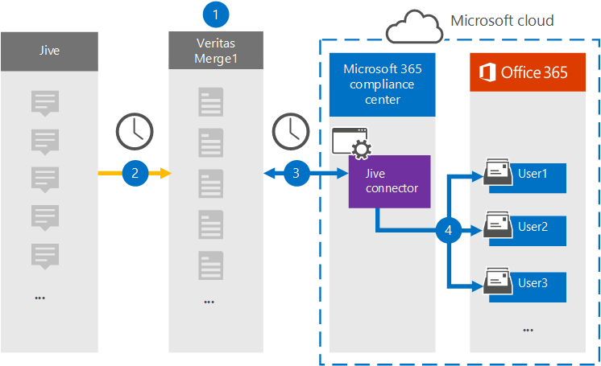

# 設定連接器以封存 Jive 資料Set up a connector to archive Jive data

在 Microsoft 365 規範中心使用 Veritas 連接器，將共同作業平臺的資料匯入和封存到您 Microsoft 365 組織中的使用者信箱。Use a Veritas connector in the Microsoft 365 compliance center to import and archive data from the collaboration platform to user mailboxes in your Microsoft 365 organization. Veritas 會提供一個[Jive](https://globanet.com/jive/)連接器，可設定為定期從協力廠商資料來源捕獲專案 () ，然後將這些專案匯入 Microsoft 365。Veritas provides a [Jive](https://globanet.com/jive/) connector that is configured to capture items from the third-party data source (on a regular basis) and then import those items to Microsoft 365. 連接器會將電子郵件、聊天及附件等內容，從使用者的 Jive 帳戶轉換為電子郵件訊息格式，然後再將這些專案匯入 Microsoft 365 中的使用者信箱。The connector converts content such as email messages, chats, and attachments from a user's Jive account to an email message format and then imports those items to the user's mailbox in Microsoft 365.

在使用者信箱中儲存 Jive 資料後，您就可以套用 Microsoft 365 合規性功能，例如訴訟暫止、eDiscovery、保留原則和保留標籤，以及通訊法規遵從性。After Jive data is stored in user mailboxes, you can apply Microsoft 365 compliance features such as Litigation Hold, eDiscovery, retention policies and retention labels, and communication compliance. 在 Microsoft 365 中使用 Jive 連接器匯入和封存資料，可協助您的組織遵守政府和法規原則。Using a Jive connector to import and archive data in Microsoft 365 can help your organization stay compliant with government and regulatory policies.

## 封存 Jive 資料的概覽Overview of archiving Jive data

下列概要說明如何使用連接器封存 Microsoft 365 中的 Jive 資料。The following overview explains the process of using a connector to archive the Jive data in Microsoft 365.

1. 您的組織與 Jive 搭配使用，以安裝及設定 Jive 網站。Your organization works with Jive to set up and configure a Jive site.

2. 每24小時一次，將 Jive 中的專案複製到 Veritas Merge1 網站。Once every 24 hours, items from Jive are copied to the Veritas Merge1 site. 連接器也會將 Jive 專案的內容轉換為電子郵件訊息格式。The connector also converts the content of Jive items to an email message format.

3. 您在 Microsoft 365 合規性中心建立的 Jive 連接器每天會連線至 Veritas Merge1 網站，並將內容傳送至 Microsoft 雲端中的安全 Azure 儲存體位置。The Jive connector that you create in the Microsoft 365 compliance center connects to the Veritas Merge1 site every day and transfers the content to a secure Azure Storage location in the Microsoft cloud.

4. 連接器會使用 [[步驟 3](#step-3-map-users-and-complete-the-connector-setup)] 中所述的自動使用者對應的 *電子郵件* 屬性值，將已轉換的專案匯入至特定使用者的信箱。The connector imports the converted items to the mailboxes of specific users by using the value of the *Email* property of the automatic user mapping as described in [Step 3](#step-3-map-users-and-complete-the-connector-setup). 在使用者信箱中建立名為 **Jive** 之 [收件匣] 資料夾中的新子資料夾，並將這些專案匯入該資料夾。A new subfolder in the Inbox folder named **Jive** is created in the user mailboxes, and the items are imported to that folder. 連接器會使用 *Email* 屬性的值來執行此動作。The connector does this by using the value of the *Email* property. 每個 Jive 專案都包含此屬性，其會填入專案的每個參與者的電子郵件地址。Every Jive item contains this property, which is populated with the email address of every participant of the item.

## 開始之前Before you begin

- 建立 Microsoft 連接器的 Veritas Merge1 帳戶。Create a Veritas Merge1 account for Microsoft connectors. 若要建立此帳戶，請與 [Veritas 客戶支援](https://www.veritas.com/content/support/)聯繫。To create this account, contact [Veritas Customer Support](https://www.veritas.com/content/support/). 當您在步驟1中建立連接器時，您會登入此帳戶。You will sign into this account when you create the connector in Step 1.

- 在步驟1中建立 Jive 連接器的使用者 (，並在步驟 3) 中完成，必須指派 Exchange Online 中的「信箱匯入匯出」角色。The user who creates the Jive connector in Step 1 (and completes it in Step 3) must be assigned to the Mailbox Import Export role in Exchange Online. 在 [Microsoft 365 規範中心] 的 [**資料連線器**] 頁面上新增連接器時，此角色是必要的。This role is required to add connectors on the **Data connectors** page in the Microsoft 365 compliance center. 根據預設，此角色不會指派給 Exchange Online 中的角色群組。By default, this role is not assigned to a role group in Exchange Online. 您可以將信箱匯入匯出角色新增至 Exchange Online 中的「組織管理」角色群組。You can add the Mailbox Import Export role to the Organization Management role group in Exchange Online. 或者，您可以建立角色群組、指派信箱匯入匯出角色，然後將適當的使用者新增為成員。Or you can create a role group, assign the Mailbox Import Export role, and then add the appropriate users as members. 如需詳細資訊，請參閱「在 Exchange Online 中管理角色群組」一文中的 [[建立角色群組](/Exchange/permissions-exo/role-groups#create-role-groups)或[修改角色](/Exchange/permissions-exo/role-groups#modify-role-groups)群組] 區段。For more information, see the [Create role groups](/Exchange/permissions-exo/role-groups#create-role-groups) or [Modify role groups](/Exchange/permissions-exo/role-groups#modify-role-groups) sections in the article "Manage role groups in Exchange Online".

## 步驟1：設定 Jive 連接器Step 1: Set up the Jive connector

第一步是存取「Microsoft 365 規範中心」中的 [**資料連線器**] 頁面，並建立用於 Jive 資料的連接器。The first step is to access to the **Data Connectors** page in the Microsoft 365 compliance center and create a connector for Jive data.

1. 移至 [https://compliance.microsoft.com](https://compliance.microsoft.com/) ，然後按一下 [**資料連線器**  >  **Jive**]。Go to [https://compliance.microsoft.com](https://compliance.microsoft.com/) and then click **Data connectors** > **Jive**.

2. 在 [ **Jive** 產品描述] 頁面上，按一下 [ **新增連接器**]。On the **Jive** product description page, click **Add connector**.

3. 在 [ **服務條款** ] 頁面上，按一下 [ **接受**]。On the **Terms of service** page, click **Accept**.

4. 輸入識別連接器的唯一名稱，然後按 **[下一步]**。Enter a unique name that identifies the connector, and then click **Next**.

5. 登入您的 Merge1 帳戶以設定連接器。Sign in to your Merge1 account to configure the connector.

## 步驟2：設定 Jive 連接器Step 2: Configure the Jive connector

第二個步驟是設定 Merge1 網站上的 Jive 連接器。The second step is to configure the Jive connector on the Merge1 site. 如需如何設定 Jive 連接器的詳細資訊，請參閱 [Merge1 Third-Party Connector User Guide](https://docs.ms.merge1.globanetportal.com/Merge1%20Third-Party%20Connectors%20Jive%20User%20Guide.pdf)。For information about how to configure the Jive connector, see [Merge1 Third-Party Connectors User Guide](https://docs.ms.merge1.globanetportal.com/Merge1%20Third-Party%20Connectors%20Jive%20User%20Guide.pdf).

按一下 **[儲存] & 完成** 之後，就會顯示「Microsoft 365 規範中心」的 [連接器] 中的 [**使用者對應**] 頁面。After you click **Save & Finish**, the **User mapping** page in the connector wizard in the Microsoft 365 compliance center is displayed.

## 步驟3：對應使用者並完成連接器設定Step 3: Map users and complete the connector setup

若要在 Microsoft 365 規範中心內，對應使用者並完成連接器設定，請執行下列步驟：To map users and complete the connector setup in the Microsoft 365 compliance center, follow the steps below:

1. 在 [將 **Jive 使用者對應至 Microsoft 365 使用者**] 頁面上，啟用 [自動使用者對應]。On the **Map Jive users to Microsoft 365 users** page, enable automatic user mapping. Jive 專案包括稱為「 *電子郵件*」的屬性，其中包含組織中使用者的電子郵件地址。The Jive items include a property called *Email*, which contains email addresses for users in your organization. 如果連接器可以將此位址與 Microsoft 365 使用者相關聯，則會將這些專案匯入該使用者的信箱。If the connector can associate this address with a Microsoft 365 user, the items are imported to that user's mailbox.

2. 按 **[下一步]**，複查您的設定，然後移至 [ **資料連線器** ] 頁面，以查看新連接器的匯入程式的進度。Click **Next**, review your settings, and go to the **Data connectors** page to see the progress of the import process for the new connector.

## 步驟4：監視 Jive 連接器Step 4: Monitor the Jive connector

在您建立 Jive 連接器之後，您可以在 [Microsoft 365 規範中心] 中查看連接器狀態。After you create the Jive connector, you can view the connector status in the Microsoft 365 compliance center.

1. 移至 [https://compliance.microsoft.com](https://compliance.microsoft.com) 並按一下左側導覽中的 [ **資料連線器** ]。Go to [https://compliance.microsoft.com](https://compliance.microsoft.com) and click **Data connectors** in the left nav.

2. 按一下 [ **連接器** ] 索引標籤，然後選取 [ **Jive** 連接器] 以顯示飛出頁面。Click the **Connectors** tab and then select the **Jive** connector to display the flyout page. 此頁面包含連接器的屬性和資訊。This page contains the properties and information about the connector.

3. 在 [ **連接器狀態與來源**] 底下，按一下 [ **下載記錄** ] 連結，以開啟連接器的狀態記錄 (或儲存) 。Under **Connector status with source**, click the **Download log** link to open (or save) the status log for the connector. 此記錄檔包含已匯入至 Microsoft 雲端之資料的相關資訊。This log contains information about the data that has been imported to the Microsoft cloud.

## 已知問題Known issues

- 此時，我們不支援匯入大於 10 MB 的附件或專案。At this time, we don't support importing attachments or items that are larger than 10 MB. 稍後將提供對較大專案的支援。Support for larger items will be available at a later date.