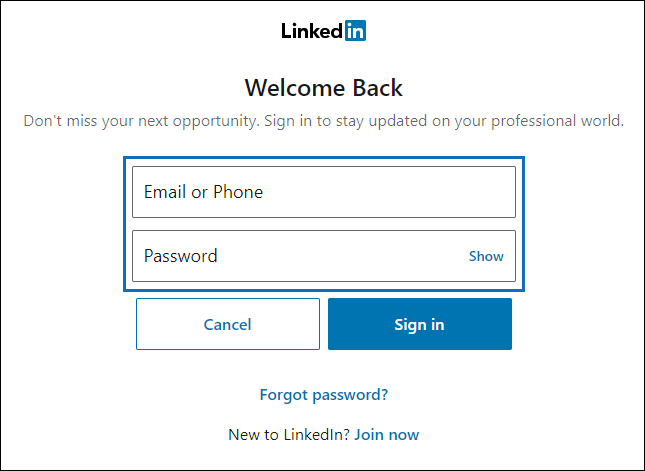

# 設定連接器來封存 LinkedIn 資料

使用 Microsoft 365 規範中心內的連接器，匯入和封存 LinkedIn 公司頁面中的資料。 在您設定及設定連接器之後，它會每隔24小時連線到特定 LinkedIn 公司] 頁面的帳戶。 連接器會將張貼到公司頁面的郵件轉換為電子郵件，然後將這些專案匯入 Microsoft 365 中的信箱。

LinkedIn 公司頁面資料儲存在信箱中之後，您可以套用 Microsoft 365 合規性功能，例如訴訟暫止、內容搜尋、In-Place 封存、審核及 Microsoft 365 保留原則，以 LinkedIn 資料。 例如，您可以使用內容搜尋來搜尋這些專案，或在 Advanced eDiscovery 案例中關聯儲存信箱與保管人。 建立連接器以匯入和封存 Microsoft 365 中的 LinkedIn 資料可協助您的組織遵守政府和法規原則。

## 在您設定連接器之前

- 建立 LinkedIn 公司頁面連接器的使用者，必須在 Exchange Online 中指派「信箱匯入匯出」角色。 在 [Microsoft 365 規範中心] 的 [**資料連線器**] 頁面中新增連接器時，這是必要的。 依預設，此角色不會指派給 Exchange Online 內的任何角色群組。 您可以將信箱匯入匯出角色新增至 Exchange Online 中的「組織管理」角色群組。 或者，您可以建立角色群組、指派信箱匯入匯出角色，然後將適當的使用者新增為成員。 如需詳細資訊，請參閱「在 Exchange Online 中管理角色群組」一文中的 [[建立角色群組](/Exchange/permissions-exo/role-groups#create-role-groups)或[修改角色](/Exchange/permissions-exo/role-groups#modify-role-groups)群組] 區段。

- 您必須擁有 LinkedIn 使用者帳戶的登入認證 (電子郵件地址或電話號碼和密碼) ，該使用者帳戶是您要封存之 LinkedIn 公司頁面的系統管理員。 當您設定連接器時，您可以使用這些認證登入 LinkedIn。

- LinkedIn 連接器可以在一天內匯入200000項總計。 如果一天內有超過200000的專案 LinkedIn，將不會將這些專案匯入 Microsoft 365。

## 建立 LinkedIn 連接器

1. 移至 <https://compliance.microsoft.com> ，然後按一下 [**資料連線器**]  >  **LinkedIn 公司頁面**。

2. 在 [ **LinkedIn 公司頁面** 產品] 頁面上，按一下 [ **新增連接器**]。

3. 在 [ **服務條款** ] 頁面上，選取 [ **接受**]。

4. 在 [ **使用 LinkedIn 登入** ] 頁面上，按一下 [以 **LinkedIn 登入**]。

   隨即會顯示 [LinkedIn 登入] 頁面。

   

5. 在 [LinkedIn 登入] 頁面上，輸入與您要封存之公司頁面相關之 LinkedIn 帳戶的電子郵件地址 (或電話號碼) 和密碼，然後按一下 [登 **入**]。

   隨即會顯示一個嚮導頁面，其中列出所有與您登入之帳戶相關聯的 LinkedIn 公司頁面。 只可為一個公司頁面設定連接器。 如果您的組織有多個 LinkedIn 公司頁面，您必須為每個頁面建立一個連接器。

   

6. 選取您要封存專案的公司頁面，然後按 **[下一步]**。

7. 在 [**選擇儲存位置**] 頁面上，按一下方塊，選取 LinkedIn 專案將匯入的 Microsoft 365 信箱的電子郵件地址，然後按 **[下一步]**。 將專案匯入此信箱中的 [收件匣] 資料夾。

8. 按 **[下一步]** 以查看連接器設定，然後按一下 **[完成]** 以完成連接器設定。

建立連接器之後，您可以回到 [ **資料連線器** ] 頁面，以查看新連接器的匯入程式的進度 (選取 [重新整理] （ **如有必要** ）以更新連接器清單) 。 [ **狀態** ] 欄中的值正 **等候開始**。 開始進行初始匯入程式需要長達24小時的時間。 在連接器第一次執行並匯入 LinkedIn 專案之後，連接器會每隔24小時執行一次，並匯入在前24小時內，在 LinkedIn 公司頁面上建立的任何新專案。

若要查看更多詳細資料，請選取 [ **資料連線器** ] 頁面上清單中的連接器以顯示飛入頁面。 在 [ **狀態**] 下，顯示的日期範圍會指出建立連接器時所選取的年齡篩選。

## 其他資訊

LinkedIn 項會匯入至 Microsoft 365 中儲存信箱收件匣的 LinkedIn 子資料夾。 它們會顯示為電子郵件訊息。