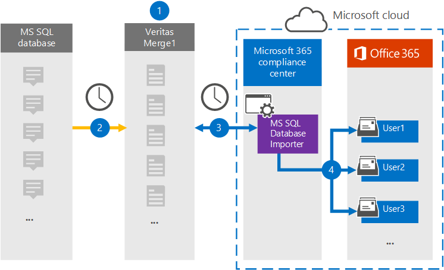

# 設定從 MS SQL Database 封存資料的連接器Set up a connector to archive data from MS SQL Database

使用 Microsoft 365 規範中心內的 Globanet 連接器，將 MS SQL Database 的資料匯入並封存至您的 Microsoft 365 組織中的使用者信箱。Use a Globanet connector in the Microsoft 365 compliance center to import and archive data from MS SQL Database to user mailboxes in your Microsoft 365 organization. Globanet 為您提供 MS SQL Database 進口商 connector，該連接器設定為從使用 XML 設定檔的資料庫捕獲專案，並將這些專案匯入至 Microsoft 365。Globanet provides you with an MS SQL Database Importer connector that's configured to capture items from a database using an XML configuration file and import those items to Microsoft 365. 連接器會將內容從 MS SQL Database 轉換成電子郵件訊息格式，然後將這些專案匯入至 Microsoft 365 中的使用者信箱。The connector converts content from MS SQL Database to an email message format and then imports those items to user mailboxes in Microsoft 365.

在使用者信箱中儲存的 MS SQL 資料庫內容之後，您可以套用 Microsoft 365 合規性功能，例如訴訟暫止、eDiscovery、保留原則及保留標籤。After content from MS SQL Database stored in user mailboxes, you can apply Microsoft 365 compliance features such as Litigation Hold, eDiscovery, retention policies and retention labels. 使用 MS SQL Database connector 匯入和封存 Microsoft 365 中的資料，可協助您的組織遵守政府和法規原則。Using an MS SQL Database connector to import and archive data in Microsoft 365 can help your organization stay compliant with government and regulatory policies.

## 封存 MS SQL 資料的概覽Overview of archiving the MS SQL data

下列概要說明如何使用連接器來封存 Microsoft 365 中的 MS SQL 資料。The following overview explains the process of using a connector to archive MS SQL data in Microsoft 365.

1. 您的組織與 MS SQL 資料庫提供者搭配使用，以安裝及設定 MS SQL 資料庫網站。Your organization works with an MS SQL Database provider to set up and configure an MS SQL Database site.

2. 每隔24小時，MS SQL 資料庫專案會複製到 Globanet Merge1 網站。Once every 24 hours, MS SQL Database items are copied to the Globanet Merge1 site. 連接器也會將此內容轉換為電子郵件訊息格式。The connector also converts this content to an email message format.

3. 您在 Microsoft 365 規範中心內建立的 MS SQL Database 進口商連接器會每天連線到 Globanet Merge1 網站，並將郵件傳輸至 Microsoft 雲端中的安全 Azure 存放位置。The MS SQL Database Importer connector that you create in the Microsoft 365 compliance center, connects to the Globanet Merge1 site every day and transfers the messages to a secure Azure Storage location in the Microsoft cloud.

4. 連接器會使用 [[步驟 3](#step-3-map-users-and-complete-the-connector-setup)] 中所述的自動使用者對應的 *電子郵件* 屬性值，將已轉換的 MS SQL 資料庫專案匯入特定使用者的信箱。The connector imports the converted MS SQL Database items to the mailboxes of specific users using the value of the *Email* property of the automatic user mapping as described in [Step 3](#step-3-map-users-and-complete-the-connector-setup). 在使用者信箱中建立名為 **MS SQL Database 進口商** 的 [收件匣] 資料夾中的子資料夾，並將這些專案匯入該資料夾。A subfolder in the Inbox folder named **MS SQL Database Importer** is created in the user mailboxes, and the items are imported to that folder. 連接器會使用 *Email* 屬性的值來決定要匯入專案的信箱。The connector determines which mailbox to import items to by using the value of the *Email* property. MS SQL 資料庫中的每個專案都包含此屬性，此內容填入專案的每個參與者的電子郵件地址。Every item from the MS SQL Database contains this property, which is populated with the email address of every participant of the item.

## 開始之前Before you begin

- 為 Microsoft connector 建立 Globanet Merge1 帳戶。Create a Globanet Merge1 account for Microsoft connectors. 若要建立帳戶，請與 [Globanet 客戶支援](https://globanet.com/contact-us/)人員聯繫。To create an account, contact [Globanet Customer Support](https://globanet.com/contact-us/). 當您在步驟1中建立連接器時，您必須登入此帳戶。You need to sign into this account when you create the connector in Step 1.

- 在步驟1中建立 MS SQL Database 進口商 connector 的使用者 (，並在步驟 3) 中完成，必須將其指派給 Exchange Online 中的信箱匯入匯出角色。The user who creates the MS SQL Database Importer connector in Step 1 (and completes it in Step 3) must be assigned to the Mailbox Import Export role in Exchange Online. 在 Microsoft 365 規範中心的 [資料連線器] 頁面上新增連接器時，此角色是必要的。This role is required to add connectors on the Data connectors page in the Microsoft 365 compliance center. 根據預設，此角色不會指派給 Exchange Online 中的任何角色群組。By default, this role is not assigned to any role group in Exchange Online. 您可以將信箱匯入匯出角色新增至 Exchange Online 中的「組織管理」角色群組。You can add the Mailbox Import Export role to the Organization Management role group in Exchange Online. 或者，您可以建立角色群組、指派信箱匯入匯出角色，然後將適當的使用者新增為成員。Or you can create a role group, assign the Mailbox Import Export role, and then add the appropriate users as members. 如需詳細資訊，請參閱「管理 Exchange Online 中的角色群組」一文中的 [ [建立角色群組](https://docs.microsoft.com/Exchange/permissions-exo/role-groups#create-role-groups) 或 [修改角色群組](https://docs.microsoft.com/Exchange/permissions-exo/role-groups#modify-role-groups) ] 區段。For more information, see the [Create role groups](https://docs.microsoft.com/Exchange/permissions-exo/role-groups#create-role-groups) or [Modify role groups](https://docs.microsoft.com/Exchange/permissions-exo/role-groups#modify-role-groups) sections in the article "Manage role groups in Exchange Online".

## 步驟1：設定 MS SQL Database 進口商 connectorStep 1: Set up the MS SQL Database Importer connector

第一步是存取 Microsoft365 規範中心內的 **資料連線器** 頁面，並為 MS SQL 資料庫建立連接器。The first step is to access to the **Data Connectors** page in the Microsoft365 compliance center and create a connector for the MS SQL Database.

1. 移至 [https://compliance.microsoft.com](https://compliance.microsoft.com) ，然後按一下 [**資料連線器**  >  **MS SQL Database 進口商**]。Go to [https://compliance.microsoft.com](https://compliance.microsoft.com) and then click **Data connectors** > **MS SQL Database Importer**.

2. 在 [ **MS SQL Database 進口商** product description] 頁面上，按一下 [ **新增連接器**]。On the **MS SQL Database Importer** product description page, click **Add new connector**.

3. 在 [ **服務條款** ] 頁面上，按一下 [ **接受**]。On the **Terms of service** page, click **Accept**.

4. 輸入識別連接器的唯一名稱，然後按 **[下一步]**。Enter a unique name that identifies the connector, and then click **Next**.

5. 登入您的 Merge1 帳戶以設定連接器。Sign in to your Merge1 account to configure the connector.

## 步驟2：設定 Globanet Merge1 site 上的 MS SQL Database 進口商 connectorStep 2: Configure the MS SQL Database Importer connector on the Globanet Merge1 site

第二個步驟是在 Merge1 網站上設定 MS SQL Database 進口商 connector。The second step is to configure the MS SQL Database Importer connector on the Merge1 site. 如需如何設定 MS SQL Database 進口商的詳細資訊，請參閱 [Merge1 Third-Party Connector User Guide](https://docs.ms.merge1.globanetportal.com/Merge1%20Third-Party%20Connectors%20MS%20SQL%20Database%20Importer%20User%20Guide%20.pdf)。For information about how to configure the MS SQL Database Importer, see [Merge1 Third-Party Connectors User Guide](https://docs.ms.merge1.globanetportal.com/Merge1%20Third-Party%20Connectors%20MS%20SQL%20Database%20Importer%20User%20Guide%20.pdf).

按一下 **[儲存] & 完成** 之後，就會顯示 Microsoft 365 規範中心內 [連接器] 嚮導中的 [ **使用者對應** ] 頁面。After you click **Save & Finish**, the **User mapping** page in the connector wizard in the Microsoft 365 compliance center is displayed.

## 步驟3：對應使用者並完成連接器設定Step 3: Map users and complete the connector setup

若要對應使用者並完成連接器設定，請遵循下列步驟：To map users and complete the connector setup, follow these steps:

1. 在 [將 **MS SQL Database 進口商使用者加入至 Microsoft 365 使用者** ] 頁面上，啟用 [自動使用者對應]。On the **Map MS SQL Database Importer users to Microsoft 365 users** page, enable automatic user mapping. MS SQL 資料庫專案包括一個稱為「 *電子郵件*」的屬性，其中包含組織中使用者的電子郵件地址。The MS SQL Database items include a property called *Email*, which contains email addresses for users in your organization. 如果連接器可以將此位址與 Microsoft 365 使用者產生關聯，這些專案就會匯入該使用者的信箱。If the connector can associate this address with a Microsoft 365 user, the items are imported to that user’s mailbox.

2. 按 **[下一步]**，複查您的設定，然後移至 [ **資料連線器** ] 頁面，以查看新連接器的匯入程式的進度。Click **Next**, review your settings, and go to the **Data connectors** page to see the progress of the import process for the new connector.

## 步驟4：監視 MS SQL Database 進口商 connectorStep 4: Monitor the MS SQL Database Importer connector

在您建立 MS SQL Database 進口商連接器之後，您可以在 Microsoft 365 規範中心中查看連接器狀態。After you create the MS SQL Database Importer connector, you can view the connector status in the Microsoft 365 compliance center.

1. 移至 <https://compliance.microsoft.com/> 並按一下左側導覽中的 [ **資料連線器** ]。Go to <https://compliance.microsoft.com/> and click **Data connectors** in the left nav.

2. 按一下 [ **連接器** ] 索引標籤，然後選取 **MS SQL Database** **進口商** connector 以顯示飛入頁面，該頁面包含連接器的屬性和資訊。Click the **Connectors** tab and then select the **MS SQL Database** **Importer** connector to display the flyout page, which contains the properties and information about the connector.

3. 在 [ **連接器狀態與來源**] 底下，按一下 [ **下載記錄** ] 連結，以開啟連接器的狀態記錄 (或儲存) 。Under **Connector status with source**, click the **Download log** link to open (or save) the status log for the connector. 此記錄檔包含已匯入至 Microsoft 雲端的資料。This log contains data that has been imported to the Microsoft cloud.

## 已知問題Known issues

- 此時，我們不支援匯入大於 10 MB 的附件或專案。At this time, we don't support importing attachments or items that are larger than 10 MB. 稍後將提供對較大專案的支援。Support for larger items will be available at a later date.
