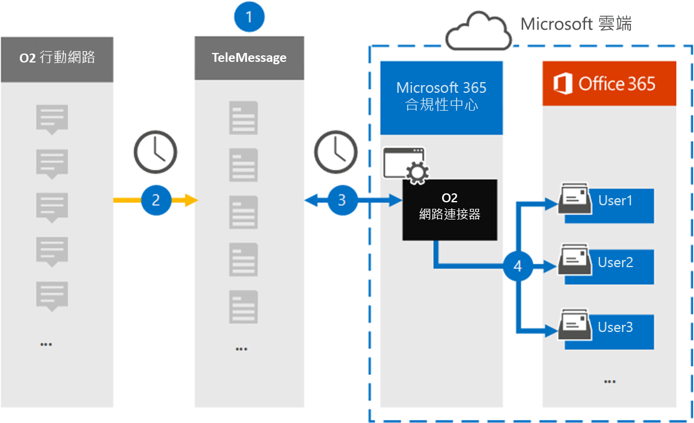

# 設定連接器以封存 O2 網路資料

使用 Microsoft 365 規範中心內的 TeleMessage 連接器，匯入及封存短消息服務 (簡訊 O2 行動網路上的) 郵件和語音通話。 在您設定及設定連接器之後，它每天會連線到您組織的 O2 網路，並匯入簡訊和語音通話給 Microsoft 365 中的信箱。

簡訊郵件和語音電話儲存在使用者信箱之後，您可以將 Microsoft 365 規範功能（例如訴訟暫止、內容搜尋）和 Microsoft 365 保留原則套用至 O2 網路資料。 例如，您可以使用內容搜尋來搜尋 O2 網路簡訊郵件和語音通話，或將包含 O2 網路資料的信箱與 Advanced eDiscovery 案例中的系統管理員相關聯。 使用 O2 網路連接器在 Microsoft 365 中匯入和封存資料，可協助您的組織遵守政府和法規原則。

## 封存 O2 網路資料的概覽

下列概要說明如何使用連接器在 Microsoft 365 中封存 O2 網路資料。

1. 您的組織與 TeleMessage 和 O2 搭配使用，以設定 O2 網路連接器。 如需詳細資訊，請參閱 [O2 網路存檔](https://www.telemessage.com/office365-activation-for-o2-network-archiver)器。

2. 每24小時一次，將組織之 O2 網路的郵件和語音通話簡訊複製到 TeleMessage 網站。

3. 您在 Microsoft 365 合規性中心建立的 O2 網路連接器每天會連線至 TeleMessage 網站，並將簡訊的郵件和語音電話從過去24小時內傳送至 Microsoft 雲端中的安全 Azure 儲存體位置。 連接器也會將簡訊郵件和語音通話的內容轉換成電子郵件訊息格式。

4. 連接器會將行動通訊專案匯入至特定使用者的信箱。 名為 **O2 簡訊和語音網路歸檔** 器的新資料夾會在特定使用者的信箱中建立，並將這些專案匯入至該資料夾。 連接器會使用 *使用者的電子郵件地址* 屬性值來進行對應。 每個簡訊郵件和語音通話都包含此內容，它會填入郵件每一位參與者的電子郵件地址。

   除了使用 *使用者之電子郵件地址* 屬性值的自動使用者對應，您也可以透過上載 CSV 對應檔來定義自訂對應。 此對應檔包含組織中使用者的行動電話號碼和對應的 Microsoft 365 電子郵件地址。 如果您為每個 O2 專案啟用自動使用者對應及自訂對應，連接器會先查看自訂對應檔案。 如果找不到有效的 Microsoft 365 使用者與使用者的行動電話號碼對應，連接器會使用嘗試匯入之專案的電子郵件地址屬性值。 如果連接器在自訂對應檔或 O2 專案的電子郵件地址屬性中找不到有效的 Microsoft 365 使用者，則不會匯入該專案。

## 開始之前

封存 O2 網路資料所需的部分執行步驟是 Microsoft 365 外部的，必須先完成，您才能在規範中心建立連接器。

- [從 TeleMessage 訂購 O2 網路歸檔服務](https://www.telemessage.com/mobile-archiver/order-mobile-archiver-for-o365/)，並取得組織的有效管理帳戶。 當您在規範中心建立連接器時，您必須登入此帳戶。

- 取得 O2 網路帳戶和計費連絡人的詳細資料，以便您可以填寫 TeleMessage 上架表單，並從 O2 訂購郵件封存服務。

- 在 TeleMessage 帳戶中，註冊所有需要 O2 簡訊和語音網路封存的使用者。 註冊使用者時，請務必使用與其 Microsoft 365 帳戶相同的電子郵件地址。

- 您的員工在 O2 行動網路上必須擁有公司擁有和公司的行動電話。 在 Microsoft 365 中封存郵件無法供員工擁有，或「 (BYOD) 裝置使用您自己的裝置。

- 在 Exchange Online 中，必須為建立 O2 網路連接器的使用者指派「信箱匯入匯出」角色。 在 [Microsoft 365 規範中心] 的 [**資料連線器**] 頁面中新增連接器時，這是必要的。 依預設，此角色不會指派給 Exchange Online 內的任何角色群組。 您可以將信箱匯入匯出角色新增至 Exchange Online 中的「組織管理」角色群組。 或者，您可以建立角色群組、指派信箱匯入匯出角色，然後將適當的使用者新增為成員。 如需詳細資訊，請參閱「在 Exchange Online 中管理角色群組」一文中的 [[建立角色群組](/Exchange/permissions-exo/role-groups#create-role-groups)或[修改角色](/Exchange/permissions-exo/role-groups#modify-role-groups)群組] 區段。

## 建立 O2 網路連接器

在您完成上一節所述的必要條件之後，您可以在 Microsoft 365 規範中心建立 O2 網路連接器。 連接器會使用您提供的資訊來連線至 TeleMessage 網站，並將簡訊郵件和語音電話轉移至 Microsoft 365 中對應的使用者信箱方塊。

1. 移至 [https://compliance.microsoft.com](https://compliance.microsoft.com/) ，然後按一下 [ **資料連線器** \> **O2 網路**]。

2. 在 [ **O2 網路** 產品描述] 頁面上，按一下 [**新增連接器**]

3. 在 [ **服務條款** ] 頁面上，按一下 [ **接受**]。

4. 在 [ **登入 TeleMessage** ] 頁面的 [步驟 3] 下，于下列方塊中輸入必要的資訊，然後按 **[下一步]**。

   - 使用者 **名稱：** 您的 TeleMessage 使用者名稱。

   - **密碼：** 您的 TeleMessage 密碼。

5. 建立連接器之後，您可以關閉快顯視窗，然後移至下一個頁面。

6. 在 [ **使用者對應** ] 頁面上啟用 [自動使用者對應]，然後按 **[下一步]**。 如果您需要自訂對應，請上載 CSV 檔案，然後按 **[下一步]**。

7. 請複查您的設定，然後按一下 **[完成]** 以建立連接器。

8. 移至 [ **資料連線器** ] 頁面中的 [連接器] 索引標籤，以查看新連接器的匯入程式的進度。

## 已知問題

- 此時，我們不支援匯入大於 10 MB 的附件或專案。 稍後將提供對較大專案的支援。