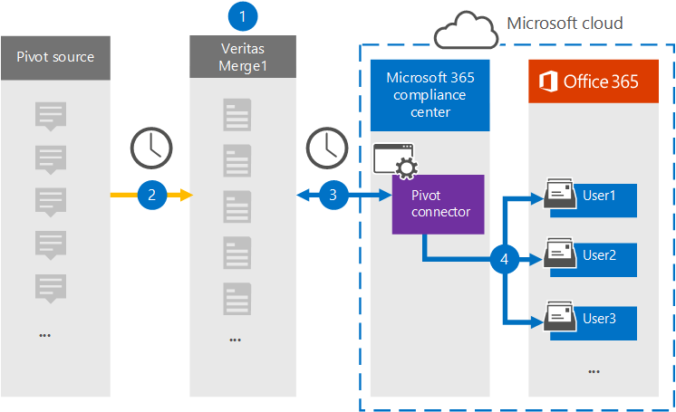

# 設定用於封存樞紐分析表的連接器Set up a connector to archive Pivot data

使用 Microsoft 365 規範中心內的 Globanet 連接器，將資料從 Pivot 平臺匯入至您的 Microsoft 365 組織中的使用者信箱。Use a Globanet connector in the Microsoft 365 compliance center to import and archive data from the Pivot platform to user mailboxes in your Microsoft 365 organization. Globanet 為您提供設定成定期從協力廠商資料來源捕獲專案 (的 [Pivot](https://globanet.com/pivot/) 連接器) ，然後將這些專案匯入至 Microsoft 365。Globanet provides you with a [Pivot](https://globanet.com/pivot/) connector that is configured to capture items from the third-party data source (on a regular basis) and then import those items to Microsoft 365. Pivot 是一種立即訊息平臺，可與金融市場參與者共同作業。Pivot is an instant messaging platform that allows collaboration with financial market participants. 連接器會將聊天訊息等專案從使用者的樞紐分析表轉換為電子郵件訊息格式，然後將這些專案匯入至 Microsoft 365 中的使用者信箱。The connector converts items such as chat messages, from a users' Pivot accounts to an email message format and then imports those items to the user mailboxes in Microsoft 365.

將樞紐分析表儲存在使用者信箱之後，您可以套用 Microsoft 365 合規性功能，例如訴訟暫止、eDiscovery、保留原則和保留標籤，以及通訊法規遵從性。After Pivot data is stored in user mailboxes, you can apply Microsoft 365 compliance features such as Litigation Hold, eDiscovery, retention policies and retention labels, and communication compliance. 使用資料透視連接器在 Microsoft 365 中匯入和封存資料，可協助您的組織遵守政府和法規原則。Using a Pivot connector to import and archive data in Microsoft 365 can help your organization stay compliant with government and regulatory policies.

## 封存樞紐分析表的概覽Overview of archiving Pivot data

下列概要說明如何使用連接器封存 Microsoft 365 中的樞紐分析表資料。The following overview explains the process of using a connector to archive the Pivot data in Microsoft 365.

1. 您的組織與 Pivot 搭配使用，以設定及設定資料透視來源網站。Your organization works with Pivot to set up and configure a Pivot source site.

2. 每隔24小時會將 Pivot 專案複製到 Globanet Merge1 網站。Once every 24 hours, Pivot items are copied to the Globanet Merge1 site. 連接器也會將資料透視專案轉換為電子郵件訊息格式。The connector also converts the Pivot items to an email message format.

3. 您在 Microsoft 365 規範中心建立的 Pivot 連接器會每天連線到 Globanet Merge1 網站，並將資料透視專案傳送至 Microsoft 雲端中的安全 Azure 存放位置。The Pivot connector that you create in the Microsoft 365 compliance center, connects to the Globanet Merge1 site every day and transfers the Pivot items to a secure Azure Storage location in the Microsoft cloud.

4. 連接器會使用 [ [步驟 3](#step-3-map-users-and-complete-the-connector-setup)] 中所述的自動使用者對應的 *電子郵件* 屬性值，將資料透視專案匯入至特定使用者的信箱。The connector imports the Pivot items to the mailboxes of specific users by using the value of the *Email* property of the automatic user mapping as described in [Step 3](#step-3-map-users-and-complete-the-connector-setup). 在使用者信箱中建立名為 **Pivot** 之 [收件匣] 資料夾中的子資料夾，而且會將這些專案匯入該資料夾。A subfolder in the Inbox folder named **Pivot** is created in the user mailboxes, and the items are imported to that folder. 連接器會使用 *Email* 屬性的值來執行此動作。The connector does this by using the value of the *Email* property. 每個 Pivot 專案都包含此屬性，其會填入專案的每個參與者的電子郵件地址。Every Pivot item contains this property, which is populated with the email address of every participant of the item.

## 在您開始之前Before you begin

- 為 Microsoft connector 建立 Globanet Merge1 帳戶。Create a Globanet Merge1 account for Microsoft connectors. 若要建立此帳戶，請與 [Globanet 客戶支援](https://globanet.com/ms-connectors-contact/)人員聯繫。To create this account, contact [Globanet Customer Support](https://globanet.com/ms-connectors-contact/). 當您在步驟1中建立連接器時，您會登入此帳戶。You will sign into this account when you create the connector in Step 1.

- 在步驟1中建立 Pivot 連接器的使用者 (，並在步驟 3) 中完成，必須將其指派給 Exchange Online 中的信箱匯入匯出角色。The user who creates the Pivot connector in Step 1 (and completes it in Step 3) must be assigned to the Mailbox Import Export role in Exchange Online. 在 Microsoft 365 規範中心的 [資料連線器] 頁面上新增連接器時，此角色是必要的。This role is required to add connectors on the Data connectors page in the Microsoft 365 compliance center. 根據預設，此角色不會指派給 Exchange Online 中的角色群組。By default, this role is not assigned to a role group in Exchange Online. 您可以將信箱匯入匯出角色新增至 Exchange Online 中的「組織管理」角色群組。You can add the Mailbox Import Export role to the Organization Management role group in Exchange Online. 或者，您可以建立角色群組、指派信箱匯入匯出角色，然後將適當的使用者新增為成員。Or you can create a role group, assign the Mailbox Import Export role, and then add the appropriate users as members. 如需詳細資訊，請參閱「管理 Exchange Online 中的角色群組」一文中的 [ [建立角色群組](https://docs.microsoft.com/Exchange/permissions-exo/role-groups#create-role-groups) 或 [修改角色群組](https://docs.microsoft.com/Exchange/permissions-exo/role-groups#modify-role-groups) ] 區段。For more information, see the [Create role groups](https://docs.microsoft.com/Exchange/permissions-exo/role-groups#create-role-groups) or [Modify role groups](https://docs.microsoft.com/Exchange/permissions-exo/role-groups#modify-role-groups) sections in the article "Manage role groups in Exchange Online".

## 步驟1：設定 Pivot connectorStep 1: Set up the Pivot connector

第一步是存取 Microsoft 規範中心的 [ **資料連線器** ] 頁面，並建立樞紐分析表的連接器。The first step is to access to the **Data Connectors** page in the Microsoft compliance center and create a connector for Pivot data.

1. 移至 [https://compliance.microsoft.com](https://compliance.microsoft.com/) ，然後按一下 [ **資料連線器] [資料**  >  **中心** ]。Go to [https://compliance.microsoft.com](https://compliance.microsoft.com/) and then click **Data connectors** > **Pivot** .

2. 在 [ **樞紐分析表** 產品描述] 頁面上，按一下 [ **新增連接器** ]。On the **Pivot** product description page, click **Add connector** .

3. 在 [ **服務條款** ] 頁面上，按一下 [ **接受** ]。On the **Terms of service** page, click **Accept** .

4. 輸入識別連接器的唯一名稱，然後按 **[下一步]** 。Enter a unique name that identifies the connector and then click **Next** .

5. 登入您的 Merge1 帳戶以設定連接器。Sign in to your Merge1 account to configure the connector.

## 步驟2：設定 Globanet Merge1 網站上的 Pivot 連接器Step 2: Configure the Pivot connector on the Globanet Merge1 site

第二個步驟是設定 Merge1 網站上的 Pivot 連接器。The second step is to configure the Pivot connector on the Merge1 site. 如需如何在 Globanet Merge1 網站上設定 Pivot connector 的詳細資訊，請參閱 [Merge1 Third-Party Connector User Guide](https://docs.ms.merge1.globanetportal.com/Merge1%20Third-Party%20Connectors%20Pivot%20User%20Guide%20.pdf)。For information about how to configure the Pivot connector on the Globanet Merge1 site, see [Merge1 Third-Party Connectors User Guide](https://docs.ms.merge1.globanetportal.com/Merge1%20Third-Party%20Connectors%20Pivot%20User%20Guide%20.pdf).

按一下 **[儲存] & 完成** 之後，就會顯示 Microsoft 365 規範中心內 [連接器] 嚮導中的 [ **使用者對應** ] 頁面。After you click **Save & Finish** , the **User mapping** page in the connector wizard in the Microsoft 365 compliance center is displayed.

## 步驟3：對應使用者並完成連接器設定Step 3: Map users and complete the connector setup

若要對應使用者，並完成 Microsoft 356 規範中心內的連接器設定，請遵循下列步驟：To map users and complete the connector setup in the Microsoft 356 compliance center, follow these steps:

1. 在 [將 **Pivot 使用者對應至 Microsoft 365 使用者** ] 頁面上，啟用自動使用者對應。On the **Map Pivot users to Microsoft 365 users** page, enable automatic user mapping. [資料透視專案] 包含稱為「 *電子郵件* 」的屬性，其中包含組織中使用者的電子郵件地址。The Pivot items include a property called *Email* , which contains email addresses for users in your organization. 如果連接器可以將此位址與 Microsoft 365 使用者產生關聯，這些專案就會匯入該使用者的信箱。If the connector can associate this address with a Microsoft 365 user, the items are imported to that user's mailbox.

2. 在 [系統 **管理員同意** ] 頁面上，按一下 [ **提供同意** ]。On the **Admin Consent** page, click **Provide Consent** . 您將會重新導向至 Microsoft 網站。You will be redirected to the Microsoft site. 按一下 [ **接受** ] 以提供同意。Click **Accept** to provide the consent.

   您的組織必須同意允許 Office 365 匯入服務存取您組織中的信箱資料。Your organization must consent to allow the Office 365 Import service to access mailbox data in your organization. 若要提供系統管理員同意，您必須使用 Microsoft 365 全域管理員的認證登入，然後接受同意要求。To provide admin consent, you must be signed in with the credentials of a Microsoft 365 global admin, and then accept the consent request. 如果您未以全域系統管理員身分登入，您可以移至 [此頁面](https://login.microsoftonline.com/common/oauth2/authorize?client_id=570d0bec-d001-4c4e-985e-3ab17fdc3073&response_type=code&redirect_uri=https://portal.azure.com/&nonce=1234&prompt=admin_consent) ，並使用全域系統管理員認證登入，以接受要求。If you aren't signed in as a global admin, you can go to [this page](https://login.microsoftonline.com/common/oauth2/authorize?client_id=570d0bec-d001-4c4e-985e-3ab17fdc3073&response_type=code&redirect_uri=https://portal.azure.com/&nonce=1234&prompt=admin_consent) and sign in using global admin credentials to accept the request.

3. 按 **[下一步]** ，複查您的設定，然後移至 [ **資料連線器** ] 頁面，以查看新連接器的匯入程式的進度。Click **Next** , review your settings, and go to the **Data connectors** page to see the progress of the import process for the new connector.

## 步驟4：監視 Pivot 連接器Step 4: Monitor the Pivot connector

在您建立 Pivot 連接器之後，您可以在 Microsoft 365 規範中心中查看連接器狀態。After you create the Pivot connector, you can view the connector status in the Microsoft 365 compliance center.

1. 移至 [https://compliance.microsoft.com](https://compliance.microsoft.com) 並按一下左側導覽中的 [ **資料連線器** ]。Go to [https://compliance.microsoft.com](https://compliance.microsoft.com) and click **Data connectors** in the left nav.

2. 按一下 [ **連接器** ] 索引標籤，然後選取 [ **樞紐分析表** 連接線] 以顯示飛出頁面。Click the **Connectors** tab and then select the **Pivot** connector to display the flyout page. 此頁面包含連接器的屬性和資訊。This page contains the properties and information about the connector.

3. 在 [ **連接器狀態與來源** ] 底下，按一下 [ **下載記錄** ] 連結，以開啟連接器的狀態記錄 (或儲存) 。Under **Connector status with source** , click the **Download log** link to open (or save) the status log for the connector. 此記錄檔包含已匯入至 Microsoft 雲端的資料。This log contains data that has been imported to the Microsoft cloud.

## 已知問題Known issues

- 此時，我們不支援匯入大於 10 MB 的附件或專案。At this time, we don't support importing attachments or items that are larger than 10 MB. 稍後將提供對較大專案的支援。Support for larger items will be available at a later date.
