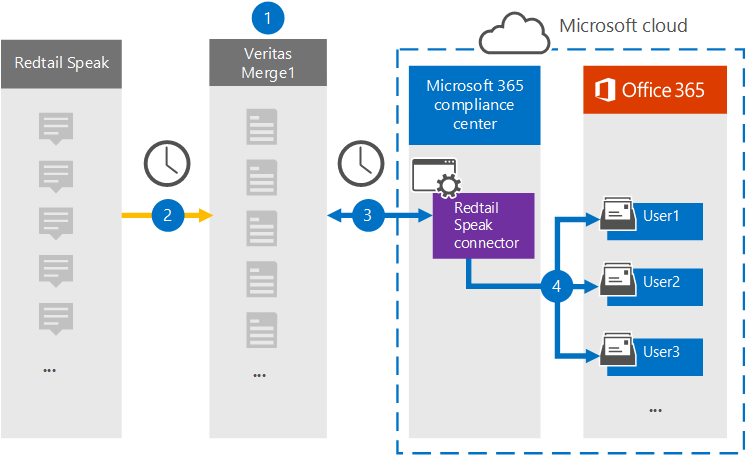

# 設定連接器以封存資料 Redtail 朗讀資料Set up a connector to archive Redtail Speak data

在 Microsoft 365 規範中心使用 Veritas connector，匯入和封存 Redtail 中的資料給您 Microsoft 365 組織中的使用者信箱。Use a Veritas connector in the Microsoft 365 compliance center to import and archive data from the Redtail Speak to user mailboxes in your Microsoft 365 organization. Veritas 為您提供 [Redtail](https://globanet.com/redtail/) 的「使用中」連接器，可將其設定為從您的組織的 SFTP 伺服器捕獲專案，而這些專案會從 Redtail 接收。Veritas provides you with a [Redtail Speak](https://globanet.com/redtail/) connector that's configured to capture items from your organization’s SFTP server where the items are received from Redtail. 連接器會將內容從 Redtail 朗讀為電子郵件訊息格式，然後將這些專案匯入至 Microsoft 365 中的使用者信箱。The connector converts the content from Redtail Speak to an email message format and then imports those items to the user's mailbox in Microsoft 365.

Redtail 說資料儲存在使用者信箱之後，您可以套用 Microsoft 365 合規性功能，例如訴訟暫止、eDiscovery、保留原則及保留標籤。After Redtail Speak data is stored in user mailboxes, you can apply Microsoft 365 compliance features such as Litigation Hold, eDiscovery, retention policies, and retention labels. 使用 Redtail 講話連接器在 Microsoft 365 中匯入和封存資料，可協助您的組織遵守政府和法規原則。Using a Redtail Speak connector to import and archive data in Microsoft 365 can help your organization stay compliant with government and regulatory policies.

## 封存 Redtail 朗讀資料Overview of archiving the Redtail Speak data

下列概要說明如何使用連接器封存 Microsoft 365 中的資料。The following overview explains the process of using a connector to archive the Redtail Speak data in Microsoft 365.

1. 您的組織可以搭配 Redtail 講話來設定和設定 SMTP 閘道，其中郵件會每日從 Redtail 轉送到您組織的 SFTP 伺服器。Your organization works with Redtail Speak to set up and configure an SMTP gateway where messages are forwarded from Redtail Speak to your organization's SFTP server on a daily basis.

2. 每24小時一次，Redtail 會將專案複製到 Veritas Merge1 網站。Once every 24 hours, the Redtail Speak items are copied to the Veritas Merge1 site. 連接器也會將 Redtail 朗讀專案轉換為電子郵件訊息格式。The connector also converts the Redtail Speak items to an email message format.

3. 您在 Microsoft 365 合規性中心建立的 [通話] 連接器每天會連線至 Veritas Merge1 網站，並將郵件傳輸至 Microsoft 雲端中的安全 Azure 儲存體位置。The Redtail Speak connector that you create in the Microsoft 365 compliance center connects to the Veritas Merge1 site every day and transfers the messages to a secure Azure Storage location in the Microsoft cloud.

4. 連接器會使用 [[步驟 3](#step-3-map-users-and-complete-the-connector-setup)] 中所述的自動使用者對應的 *電子郵件* 屬性值，將已轉換的 Redtail 朗讀專案給特定使用者的信箱。The connector imports the converted Redtail Speak items to the mailboxes of specific users using the value of the *Email* property of the automatic user mapping as described in [Step 3](#step-3-map-users-and-complete-the-connector-setup). 在使用者信箱中建立名為 **Redtail** 的 [收件匣] 資料夾中的子資料夾，並將這些專案匯入該資料夾。A subfolder in the Inbox folder named **Redtail Speak** is created in the user mailboxes, and the items are imported to that folder. 連接器會使用 *Email* 屬性的值來決定要匯入專案的信箱。The connector determines which mailbox to import items to by using the value of the *Email* property. 每個 Redtail 的「朗讀」專案都包含此內容，它會填入專案的每個參與者的電子郵件地址。Every Redtail Speak item contains this property, which is populated with the email address of every participant of the item.

## 開始之前Before you begin

- 建立 Microsoft 連接器的 Veritas Merge1 帳戶。Create a Veritas Merge1 account for Microsoft connectors. 若要建立帳戶，請與 [Veritas 客戶支援](https://www.veritas.com/content/support/)聯繫。To create an account, contact [Veritas Customer Support](https://www.veritas.com/content/support/). 當您在步驟1中建立連接器時，您必須登入此帳戶。You need to sign into this account when you create the connector in Step 1.

- 在步驟2中，您必須指定組織的 SFTP 伺服器。In Step 2, you need to specify your organization's SFTP server. 此步驟是必要的，讓 Veritas Merge1 可以聯繫它，以收集透過 SFTP 朗讀資料的 Redtail。This step is necessary so that Veritas Merge1 can contact it to collect Redtail Speak data via SFTP.

- 在步驟1中建立 Redtail 朗讀進口商 connector 的使用者 (，並在步驟 3) 中完成，必須指派 Exchange Online 中的「信箱匯入匯出」角色。The user who creates the Redtail Speak Importer connector in Step 1 (and completes it in Step 3) must be assigned to the Mailbox Import Export role in Exchange Online. 在 [Microsoft 365 規範中心] 的 [資料連線器] 頁面上新增連接器時，此角色是必要的。This role is required to add connectors on the Data connectors page in the Microsoft 365 compliance center. 預設會將此角色指派給 Exchange Online 中的任何角色群組。This role is not assigned to any role group in Exchange Online by default. 您可以將信箱匯入匯出角色新增至 Exchange Online 中的「組織管理」角色群組。You can add the Mailbox Import Export role to the Organization Management role group in Exchange Online. 或者，您可以建立角色群組、指派信箱匯入匯出角色，然後將適當的使用者新增為成員。Or you can create a role group, assign the Mailbox Import Export role, and then add the appropriate users as members. 如需詳細資訊，請參閱「在 Exchange Online 中管理角色群組」一文中的 [[建立角色群組](/Exchange/permissions-exo/role-groups#create-role-groups)或[修改角色](/Exchange/permissions-exo/role-groups#modify-role-groups)群組] 區段。For more information, see the [Create role groups](/Exchange/permissions-exo/role-groups#create-role-groups) or [Modify role groups](/Exchange/permissions-exo/role-groups#modify-role-groups) sections in the article "Manage role groups in Exchange Online".

## 步驟1：設定 Redtail 講話連接器Step 1: Set up the Redtail Speak connector

第一步是存取「Microsoft 365 規範中心」中的 [**資料連線器**] 頁面，並為 Redtail 朗讀資料建立連接器。The first step is to access to the **Data Connectors** page in the Microsoft 365 compliance center and create a connector for the Redtail Speak data.

1. 移至 [https://compliance.microsoft.com](https://compliance.microsoft.com/) 並選取 [ **資料連線器**] &gt; **Redtail 講話**。Go to [https://compliance.microsoft.com](https://compliance.microsoft.com/) and select **Data connectors** &gt; **Redtail Speak**.

2. 在 [ **Redtail 講話** 產品描述] 頁面上，選取 [ **新增連接器**]。On the **Redtail Speak** product description page, select **Add new connector**.

3. 在 [ **服務條款** ] 頁面上，選取 [ **接受**]。On the **Terms of service** page, select **Accept**.

4. 輸入識別連接器的唯一名稱，然後選取 **[下一步]**。Enter a unique name that identifies the connector, and then select **Next**.

5. 登入您的 Merge1 帳戶以設定連接器。Sign in to your Merge1 account to configure the connector.

## 步驟2：設定 Veritas Merge1 site 上的 Redtail 朗讀連接器Step 2: Configure the Redtail Speak connector on the Veritas Merge1 site

第二個步驟是設定 Merge1 網站上的 Redtail 講話連接器。The second step is to configure the Redtail Speak connector on the Merge1 site. 如需如何設定 Redtail 講話連接器的詳細資訊，請參閱 [Merge1 Third-Party 連接器 User Guide](https://docs.ms.merge1.globanetportal.com/Merge1%20Third-Party%20Connectors%20Redtail%20Speak%20User%20Guide%20.pdf)。For information about how to configure the Redtail Speak connector, see [Merge1 Third-Party Connectors User Guide](https://docs.ms.merge1.globanetportal.com/Merge1%20Third-Party%20Connectors%20Redtail%20Speak%20User%20Guide%20.pdf).

在您選取 **[儲存] & 完成** 之後，就會顯示「Microsoft 365 規範中心」的 [連接器] 中的 [**使用者對應**] 頁面。After you select **Save & Finish**, the **User mapping** page in the connector wizard in the Microsoft 365 compliance center is displayed.

## 步驟3：對應使用者並完成連接器設定Step 3: Map users and complete the connector setup

若要對應使用者並完成連接器設定，請遵循下列步驟：To map users and complete the connector setup, follow these steps:

1. 在 [**對應 Redtail 說使用者 Microsoft 365 使用者**] 頁面上，啟用 [自動使用者對應]。On the **Map Redtail Speak users to Microsoft 365 users** page, enable automatic user mapping. [Redtail 朗讀專案] 包含名為「 *電子郵件*」的屬性，其中包含組織中使用者的電子郵件地址。The Redtail Speak items include a property called *Email*, which contains email addresses for users in your organization. 如果連接器可以將此位址與 Microsoft 365 使用者相關聯，則會將這些專案匯入該使用者的信箱。If the connector can associate this address with a Microsoft 365 user, the items are imported to that user’s mailbox.

2. 選取 **[下一步]**，複查您的設定，然後移至 [ **資料連線器** ] 頁面，以查看新連接器的匯入程式的進度。Select **Next**, review your settings, and go to the **Data connectors** page to see the progress of the import process for the new connector.

## 步驟4：監控 Redtail 講話連接器Step 4: Monitor the Redtail Speak connector

在您建立 Redtail 講話連接器之後，您可以在 [Microsoft 365 規範中心] 中查看連接器狀態。After you create the Redtail Speak connector, you can view the connector status in the Microsoft 365 compliance center.

1. 移至 [https://compliance.microsoft.com](https://compliance.microsoft.com/) 並選取左側導覽中的 [ **資料連線器** ]。Go to [https://compliance.microsoft.com](https://compliance.microsoft.com/) and select **Data connectors** in the left nav.

2. 選取 [ **連接器** ] 索引標籤，然後選取 [ **Redtail 說** 連接器] 以顯示飛出頁面。Select the **Connectors** tab and then select the **Redtail Speak** connector to display the flyout page. 此頁面會顯示連接器的屬性和資訊。This page displays properties and information about the connector.

3. 在 [ **連接器狀態與來源**] 底下，選取 [ **下載記錄** ] 連結，以開啟 (或儲存) 連接器的狀態記錄檔。Under **Connector status with source**, select the **Download log** link to open (or save) the status log for the connector. 此記錄檔包含已匯入至 Microsoft 雲端的資料。This log contains data that has been imported to the Microsoft cloud.

## 已知問題Known issues

- 此時，我們不支援匯入大於 10 MB 的附件或專案。At this time, we don't support importing attachments or items that are larger than 10 MB. 稍後將提供對較大專案的支援。Support for larger items will be available at a later date.