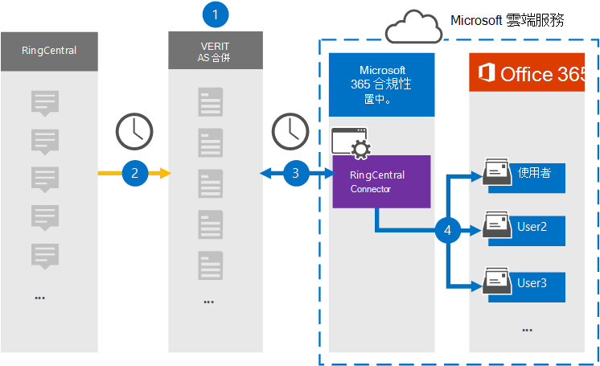

# 設定連接器以封存 RingCentral 資料 (預覽) Set up a connector to archive RingCentral data (preview)

使用 Microsoft 365 合規性中心中的 Veritas 連接器，將 RingCentral 平臺的資料匯入並封存至您 Microsoft 365 組織中的使用者信箱。Use a Veritas connector in the Microsoft 365 compliance center to import and archive data from the RingCentral platform to user mailboxes in your Microsoft 365 organization. Veritas 提供將 RingCentral 連接器設定為從協力廠商資料來源捕獲專案，並將這些專案匯入 Microsoft 365。Veritas provides the RingCentral connector that is configured to capture items from the third-party data source and import those items to Microsoft 365. 連接器會將聊天、附件、任務、記事及文章等內容，從 RingCentral 轉換為電子郵件訊息格式，然後將這些專案匯入至 Microsoft 365 中的使用者信箱。The connector converts content such as chats, attachments, tasks, notes, and posts from RingCentral to an email message format and then imports those items to the user mailboxes in Microsoft 365.

將 RingCentral 資料儲存在使用者信箱之後，您就可以套用 Microsoft 365 合規性功能，例如訴訟暫止、eDiscovery、保留原則及保留標籤。After RingCentral data is stored in user mailboxes, you can apply Microsoft 365 compliance features such as Litigation Hold, eDiscovery, retention policies and retention labels. 使用 RingCentral 連接器在 Microsoft 365 中匯入和封存資料，可協助您的組織遵守政府和法規原則。Using a RingCentral connector to import and archive data in Microsoft 365 can help your organization stay compliant with government and regulatory policies.

## 封存 RingCentral 資料一覽Overview of archiving RingCentral data

下列概要說明如何使用連接器封存 Microsoft 365 中的 RingCentral 資料。The following overview explains the process of using a connector to archive the RingCentral data in Microsoft 365.

1. 您的組織與 RingCentral 搭配使用，以設定及設定 RingCentral 網站。Your organization works with RingCentral to set up and configure a RingCentral site.

2. 每24小時一次，RingCentral 專案會複製到 Veritas Merge1 網站。Once every 24 hours, RingCentral items are copied to the Veritas Merge1 site. 連接器也會將 RingCentral 的專案轉換為電子郵件訊息格式。The connector also converts RingCentral items to an email message format.

3. 您在 Microsoft 365 合規性中心中建立的 RingCentral 連接器會每天連接至 Veritas Merge1 網站，並將 RingCentral 內容傳送至 Microsoft 雲端中的安全 Azure 儲存體位置。The RingCentral connector that you create in the Microsoft 365 compliance center, connects to the Veritas Merge1 site every day, and transfers the RingCentral content to a secure Azure Storage location in the Microsoft cloud.

4. 連接器會使用 [[步驟 3](#step-3-map-users-and-complete-the-connector-setup)] 中所述之自動使用者對應的 *電子郵件* 屬性值，將轉換後的專案匯入至特定使用者的信箱。The connector imports the converted items to the mailboxes of specific users using the value of the *Email* property of the automatic user mapping as described in [Step 3](#step-3-map-users-and-complete-the-connector-setup). 在使用者信箱中建立名為 **RingCentral** 之 [收件匣] 資料夾中的子資料夾，並將專案匯入該資料夾。A subfolder in the Inbox folder named **RingCentral** is created in the user mailboxes, and items are imported to that folder. 連接器會使用 *Email* 屬性的值來決定要匯入專案的信箱。The connector determines which mailbox to import items to by using the value of the *Email* property. 每個 RingCentral 專案都包含此屬性，它會填入專案的每個參與者的電子郵件地址。Every RingCentral item contains this property, which is populated with the email address of every participant of the item.

## 在您設定連接器之前Before you set up a connector

- 建立 Microsoft 連接器的 Merge1 帳戶。Create a Merge1 account for Microsoft connectors. 若要建立此帳戶，請與 [Veritas 客戶支援](https://www.veritas.com/form/requestacall/ms-connectors-contact)聯繫。To create this account, contact [Veritas Customer Support](https://www.veritas.com/form/requestacall/ms-connectors-contact). 當您在步驟1中建立連接器時，您必須登入此帳戶。You need to sign into this account when you create the connector in Step 1.

- 建立 RingCentral 應用程式以從您的 RingCentral 帳戶提取資料。Create a RingCentral application to fetch data from your RingCentral account. 如需建立應用程式的逐步指示，請參閱 [Merge1 Third-Party Connector User Guide](https://docs.ms.merge1.globanetportal.com/Merge1%20Third-Party%20Connectors%20RingCentral%20User%20Guide.pdf)。For step-by step instructions about creating the application, see [Merge1 Third-Party Connectors User Guide](https://docs.ms.merge1.globanetportal.com/Merge1%20Third-Party%20Connectors%20RingCentral%20User%20Guide.pdf).

- 在步驟1中建立 RingCentral 連接器的使用者 (，並在步驟 3) 中完成，必須指派 Exchange Online 中的「信箱匯入匯出」角色。The user who creates the RingCentral connector in Step 1 (and completes it in Step 3) must be assigned to the Mailbox Import Export role in Exchange Online. 在 Microsoft 365 合規性中心中的 [**資料連線器**] 頁面上新增連接器時，此角色是必要的。This role is required to add connectors on the **Data connectors** page in the Microsoft 365 compliance center. 根據預設，此角色不會指派給 Exchange Online 中的任何角色群組。By default, this role is not assigned to any role group in Exchange Online. 您可以將信箱匯入匯出角色新增至 Exchange Online 中的「組織管理」角色群組。You can add the Mailbox Import Export role to the Organization Management role group in Exchange Online. 或者，您可以建立角色群組、指派信箱匯入匯出角色，然後將適當的使用者新增為成員。Or you can create a role group, assign the Mailbox Import Export role, and then add the appropriate users as members. 如需詳細資訊，請參閱「在 Exchange Online 中管理角色群組」一文中的 [[建立角色群組](/Exchange/permissions-exo/role-groups#create-role-groups)或[修改角色](/Exchange/permissions-exo/role-groups#modify-role-groups)群組] 區段。For more information, see the [Create role groups](/Exchange/permissions-exo/role-groups#create-role-groups) or [Modify role groups](/Exchange/permissions-exo/role-groups#modify-role-groups) sections in the article "Manage role groups in Exchange Online".

## 步驟1：設定 RingCentral 連接器Step 1: Set up the RingCentral connector

第一步是存取 [Microsoft 365 合規性中心中的 **資料連線器**] 頁面，並建立 RingCentral 資料的連接器。The first step is to access to the **Data Connectors** page in the Microsoft 365 compliance center and create a connector for RingCentral data.

1. 移至 <https://compliance.microsoft.com> ，然後按一下 [**資料連線器**  >  **RingCentral**]。Go to <https://compliance.microsoft.com> and then click **Data connectors** > **RingCentral**.

2. 在 [ **RingCentral** 產品描述] 頁面上，按一下 [ **新增連接器**]。On the **RingCentral** product description page, click **Add connector**.

3. 在 [ **服務條款** ] 頁面上，按一下 [ **接受**]。On the **Terms of service** page, click **Accept**.

4. 輸入識別連接器的唯一名稱，然後按 **[下一步]**。Enter a unique name that identifies the connector, and then click **Next**.

5. 登入您的 Merge1 帳戶以設定連接器。Sign in to your Merge1 account to configure the connector.

## 步驟2：設定 Veritas Merge1 site 上的 RingCentralStep 2: Configure the RingCentral on the Veritas Merge1 site

第二個步驟是在 Veritas Merge1 網站上設定 RingCentral 連接器。The second step is to configure the RingCentral connector on the Veritas Merge1 site. 如需如何設定 RingCentral 連接器的詳細資訊，請參閱 [Merge1 Third-Party 連接器 User Guide](https://docs.ms.merge1.globanetportal.com/Merge1%20Third-Party%20Connectors%20RingCentral%20User%20Guide.pdf)。For information about how to configure the RingCentral connector, see [Merge1 Third-Party Connectors User Guide](https://docs.ms.merge1.globanetportal.com/Merge1%20Third-Party%20Connectors%20RingCentral%20User%20Guide.pdf).

按一下 **[儲存] & 完成之後，** 就會顯示 Microsoft 365 合規性中心中 [連接器] 嚮導中的 [**使用者對應**] 頁面。After you click **Save & Finish,** the **User mapping** page in the connector wizard in the Microsoft 365 compliance center is displayed.

## 步驟3：對應使用者並完成連接器設定Step 3: Map users and complete the connector setup

若要對應使用者並完成 Microsoft 365 合規性中心中的連接器設定，請遵循下列步驟：To map users and complete the connector setup in the Microsoft 365 compliance center, follow these steps:

1. 在 [將 **RingCentral 使用者對應至 Microsoft 365 使用者**] 頁面上，啟用 [自動使用者對應]。On the **Map RingCentral users to Microsoft 365 users** page, enable automatic user mapping. RingCentral 專案包括稱為「 *電子郵件*」的屬性，其中包含組織中使用者的電子郵件地址。The RingCentral items include a property called *Email*, which contains email addresses for users in your organization. 如果連接器可以將此位址與 Microsoft 365 使用者相關聯，則會將這些專案匯入該使用者的信箱。If the connector can associate this address with a Microsoft 365 user, the items are imported to that user’s mailbox.

2. 按 **[下一步]**，複查您的設定，然後移至 [ **資料連線器** ] 頁面，以查看新連接器的匯入程式的進度。Click **Next**, review your settings, and then go to the **Data connectors** page to see the progress of the import process for the new connector.

## 步驟4：監控 RingCentral 連接器Step 4: Monitor the RingCentral connector

在您建立 RingCentral 連接器之後，您可以在 Microsoft 365 合規性中心中查看連接器狀態。After you create the RingCentral connector, you can view the connector status in the Microsoft 365 compliance center.

1. 移至 <https://compliance.microsoft.com/> 並按一下左側導覽中的 [ **資料連線器** ]。Go to <https://compliance.microsoft.com/> and click **Data connectors** in the left nav.

2. 按一下 [ **連接器** ] 索引標籤，然後選取 **RingCentral** 連接器以顯示飛出頁面，該頁面包含連接器的屬性和資訊。Click the **Connectors** tab and then select the **RingCentral** connector to display the flyout page, which contains the properties and information about the connector.

3. 在 [ **連接器狀態與來源**] 底下，按一下 [ **下載記錄** ] 連結，以開啟連接器的狀態記錄 (或儲存) 。Under **Connector status with source**, click the **Download log** link to open (or save) the status log for the connector. 此記錄檔包含已匯入至 Microsoft 雲端的資料。This log contains data that has been imported to the Microsoft cloud.

## 已知問題Known issues

- 此時，我們不支援匯入大於 10 MB 的附件或專案。At this time, we don't support importing attachments or items that are larger than 10 MB. 稍後將提供對較大專案的支援。Support for larger items will be available at a later date.
