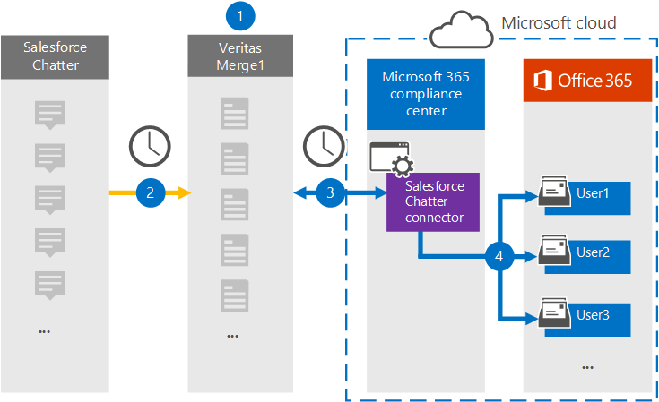

# 設定連接器以封存 Salesforce 交談資料 (預覽) Set up a connector to archive Salesforce Chatter data (preview)

使用 Microsoft 365 規範中心內的 Globanet 連接器，從 Salesforce 交談平臺匯入並封存資料至您的 Microsoft 365 組織中的使用者信箱。Use a Globanet connector in the Microsoft 365 compliance center to import and archive data from the Salesforce Chatter platform to user mailboxes in your Microsoft 365 organization. Globanet 提供 [Salesforce 交談](http://globanet.com/chatter/) 連接器，可從協力廠商資料來源捕獲專案，並將這些專案匯入至 Microsoft 365。Globanet provides a [Salesforce Chatter](http://globanet.com/chatter/) connector that captures items from the third-party data source and imports those items to Microsoft 365. 連接器會將聊天、附件和張貼等內容轉換為電子郵件訊息格式，然後將這些專案匯入至 Microsoft 365 中的使用者信箱。The connector converts the content such as chats, attachments, and posts from Salesforce Chatter to an email message format and then imports those items to the user’s mailbox in Microsoft 365.

將 Salesforce 交談資料儲存在使用者信箱之後，您可以套用 Microsoft 365 合規性功能，例如訴訟暫止、eDiscovery、保留原則和保留標籤。After Salesforce Chatter data is stored in user mailboxes, you can apply Microsoft 365 compliance features such as Litigation Hold, eDiscovery, retention policies and retention labels. 使用 Salesforce 交談連接器匯入和封存 Microsoft 365 中的資料可協助您的組織遵守政府和法規原則。Using a Salesforce Chatter connector to import and archive data in Microsoft 365 can help your organization stay compliant with government and regulatory policies.

## 封存 Salesforce 交談資料的概覽Overview of archiving Salesforce Chatter data

下列概要說明如何使用連接器封存 Microsoft 365 中的 Salesforce 交談資料。The following overview explains the process of using a connector to archive the Salesforce Chatter data in Microsoft 365.

1. 您的組織與 Salesforce 交談搭配使用，以設定和設定 Salesforce 交談網站。Your organization works with Salesforce Chatter to set up and configure a Salesforce Chatter site.

2. 每24小時一次，Salesforce 交談專案會複製到 Globanet Merge1 網站。Once every 24 hours, Salesforce Chatter items are copied to the Globanet Merge1 site. 連接器也會將交談專案 Salesforce 為電子郵件訊息格式。The connector also Salesforce Chatter items to an email message format.

3. 您在 Microsoft 365 規範中心建立的 Salesforce 交談連接器會每天連線到 Globanet Merge1 網站，並將交談內容傳送至 Microsoft 雲端中的安全 Azure 儲存位置。The Salesforce Chatter connector that you create in the Microsoft 365 compliance center, connects to the Globanet Merge1 site every day and transfers the Chatter content to a secure Azure Storage location in the Microsoft cloud.

4. 連接器會使用 [[步驟 3](#step-3-map-users-and-complete-the-connector-setup)] 中所述之自動使用者對應的 *電子郵件* 屬性值，將轉換後的專案匯入至特定使用者的信箱。The connector imports the converted items to the mailboxes of specific users using the value of the *Email* property of the automatic user mapping as described in [Step 3](#step-3-map-users-and-complete-the-connector-setup). 在使用者信箱中建立名為 [ **Salesforce 交談** ] 的 [收件匣] 資料夾中的子資料夾，並將專案匯入該資料夾。A subfolder in the Inbox folder named **Salesforce Chatter** is created in the user mailboxes, and items are imported to that folder. 連接器會使用 *Email* 屬性的值來決定要匯入專案的信箱。The connector determines which mailbox to import items to by using the value of the *Email* property. 每個交談專案都包含此屬性，它會填入專案的每個參與者的電子郵件地址。Every Chatter item contains this property, which is populated with the email address of every participant of the item.

## 開始之前Before you begin

- 建立 Microsoft 連接器的 Merge1 帳戶。Create a Merge1 account for Microsoft connectors. 若要建立帳戶，請與 [Globanet 客戶支援](https://globanet.com/contact-us/)人員聯繫。To create an account, contact [Globanet Customer Support](https://globanet.com/contact-us/). 當您在步驟1中建立連接器時，您必須登入此帳戶。You need to sign into this account when you create the connector in Step 1.

- 建立 Salesforce 應用程式，並在中取得權杖 [https://salesforce.com](https://salesforce.com) 。Create a Salesforce application and acquire a token at [https://salesforce.com](https://salesforce.com). 您必須以系統管理員身分登入 Salesforce 帳戶，並取得使用者個人 token 以匯入資料。You'll need to log into the Salesforce account as an admin and get a user personal token to import data. 此外，觸發器必須在交談網站上發佈，以捕獲更新、刪除及編輯。Also, triggers need to be published on the Chatter site to capture updates, deletes, and edits. 這些觸發器會在通道上建立文章，Merge1 將會從通道中捕獲資訊。These triggers will create a post on a channel, and Merge1 will capture the information from the channel. 如需如何建立應用程式並取得權杖的逐步指示，請參閱 [Merge1 Third-Party Connector User Guide](https://docs.ms.merge1.globanetportal.com/Merge1%20Third-Party%20Connectors%20SalesForce%20Chatter%20User%20Guide%20.pdf)。For step-by-step instructions about how to create the application and acquire the token, see [Merge1 Third-Party Connectors User Guide](https://docs.ms.merge1.globanetportal.com/Merge1%20Third-Party%20Connectors%20SalesForce%20Chatter%20User%20Guide%20.pdf).

- 在步驟1中建立 Salesforce 交談連接器的使用者 (，並在步驟 3) 中完成，必須將其指派給 Exchange Online 中的信箱匯入匯出角色。The user who creates the Salesforce Chatter connector in Step 1 (and completes it in Step 3) must be assigned to the Mailbox Import Export role in Exchange Online. 在 Microsoft 365 規範中心的 [ **資料連線器** ] 頁面上新增連接器時，此角色是必要的。This role is required to add connectors on the **Data connectors** page in the Microsoft 365 compliance center. 根據預設，此角色不會指派給 Exchange Online 中的任何角色群組。By default, this role isn’t assigned to any role group in Exchange Online. 您可以將信箱匯入匯出角色新增至 Exchange Online 中的「組織管理」角色群組。You can add the Mailbox Import Export role to the Organization Management role group in Exchange Online. 或者，您可以建立角色群組、指派信箱匯入匯出角色，然後將適當的使用者新增為成員。Or you can create a role group, assign the Mailbox Import Export role, and then add the appropriate users as members. 如需詳細資訊，請參閱「管理 Exchange Online 中的角色群組」一文中的 [ [建立角色群組](https://docs.microsoft.com/Exchange/permissions-exo/role-groups#create-role-groups) 或 [修改角色群組](https://docs.microsoft.com/Exchange/permissions-exo/role-groups#modify-role-groups) ] 區段。For more information, see the [Create role groups](https://docs.microsoft.com/Exchange/permissions-exo/role-groups#create-role-groups) or [Modify role groups](https://docs.microsoft.com/Exchange/permissions-exo/role-groups#modify-role-groups) sections in the article "Manage role groups in Exchange Online".

## 步驟1：設定 Salesforce 交談連接器Step 1: Set up the Salesforce Chatter connector

第一步是存取 Microsoft 365 規範中心內的 **資料連線器** 頁面，並建立交談資料的連接器。The first step is to access to the **Data Connectors** page in the Microsoft 365 compliance center and create a connector for Chatter data.

1. 移至 [https://compliance.microsoft.com](https://compliance.microsoft.com/) ，然後按一下 [**資料連線器**  >  **Salesforce 交談**]。Go to [https://compliance.microsoft.com](https://compliance.microsoft.com/) and then click **Data connectors** > **Salesforce Chatter**.

2. 在 [ **Salesforce 交談** 產品描述] 頁面上，按一下 [ **新增連接器**]。On the **Salesforce Chatter** product description page, click **Add connector**.

3. 在 [ **服務條款** ] 頁面上，按一下 [ **接受**]。On the **Terms of service** page, click **Accept**.

4. 輸入識別連接器的唯一名稱，然後按 **[下一步]**。Enter a unique name that identifies the connector, and then click **Next**.

5. 登入您的 Merge1 帳戶以設定連接器。Sign in to your Merge1 account to configure the connector.

## 步驟2：設定 Globanet Merge1 網站上的 Salesforce 交談Step 2: Configure the Salesforce Chatter on the Globanet Merge1 site

第二個步驟是設定 Globanet Merge1 網站上的 Salesforce 交談連接器。The second step is to configure the Salesforce Chatter connector on the Globanet Merge1 site. 如需如何設定 Salesforce 交談連接器的詳細資訊，請參閱 [Merge1 Third-Party 連接器 User Guide](https://docs.ms.merge1.globanetportal.com/Merge1%20Third-Party%20Connectors%20SalesForce%20Chatter%20User%20Guide%20.pdf)。For information about how to configure the Salesforce Chatter connector, see [Merge1 Third-Party Connectors User Guide](https://docs.ms.merge1.globanetportal.com/Merge1%20Third-Party%20Connectors%20SalesForce%20Chatter%20User%20Guide%20.pdf).

按一下 **[儲存] & 完成之後，** 就會顯示 Microsoft 365 規範中心內 [連接器] 嚮導中的 [ **使用者對應** ] 頁面。After you click **Save & Finish,** the **User mapping** page in the connector wizard in the Microsoft 365 compliance center is displayed.

## 步驟3：對應使用者並完成連接器設定Step 3: Map users and complete the connector setup

若要對應使用者，並完成 Microsoft 365 規範中心內的連接器設定，請遵循下列步驟：To map users and complete the connector setup in the Microsoft 365 compliance center, follow these steps:

1. 在 [將 **Salesforce 交談使用者對應至 Microsoft 365 使用者** ] 頁面上，啟用自動使用者對應。On the **Map Salesforce Chatter users to Microsoft 365 users** page, enable automatic user mapping. [Salesforce 交談] 專案包括稱為「 *電子郵件*」的屬性，其中包含組織中使用者的電子郵件地址。The Salesforce Chatter items include a property called *Email*, which contains email addresses for users in your organization. 如果連接器可以將此位址與 Microsoft 365 使用者產生關聯，這些專案就會匯入該使用者的信箱。If the connector can associate this address with a Microsoft 365 user, the items are imported to that user’s mailbox.

2. 按 **[下一步]**，複查您的設定，然後移至 [ **資料連線器** ] 頁面，以查看新連接器的匯入程式的進度。click **Next**, review your settings, and then go to the **Data connectors** page to see the progress of the import process for the new connector.

## 步驟4：監控 Salesforce 交談連接器Step 4: Monitor the Salesforce Chatter connector

在您建立 Salesforce 交談連接器之後，您可以在 Microsoft 365 規範中心中查看連接器狀態。After you create the Salesforce Chatter connector, you can view the connector status in the Microsoft 365 compliance center.

1. 移至 [https://compliance.microsoft.com](https://compliance.microsoft.com/) 並按一下左側導覽中的 [ **資料連線器** ]。Go to [https://compliance.microsoft.com](https://compliance.microsoft.com/) and click **Data connectors** in the left nav.

2. 按一下 [ **連接器** ] 索引標籤，然後按一下 [ **Salesforce 交談** 連接器] 以顯示飛出頁面，該頁面包含連接器的屬性和資訊。click the **Connectors** tab and then click the **Salesforce Chatter** connector to display the flyout page, which contains the properties and information about the connector.

3. 在 [ **連接器狀態與來源**] 底下，按一下 [ **下載記錄** ] 連結，以開啟連接器的狀態記錄 (或儲存) 。Under **Connector status with source**, click the **Download log** link to open (or save) the status log for the connector. 此記錄檔包含已匯入至 Microsoft 雲端的資料。This log contains data that's been imported to the Microsoft cloud.

## 已知問題Known issues

- 此時，我們不支援匯入大於 10 MB 的附件或專案。At this time, we don't support importing attachments or items that are larger than 10 MB. 稍後將提供對較大專案的支援。Support for larger items will be available at a later date.
