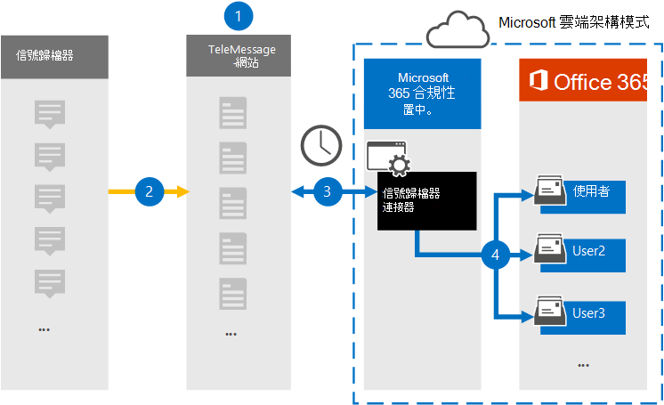

# 設定連接器以封存信號通訊資料

使用 Microsoft 365 合規性中心中的 TeleMessage 連接器，可匯入及封存信號聊天、附件、檔案及已刪除的郵件和通話。 在您設定及設定連接器之後，它會連線到您組織的 TeleMessage 帳戶，並將使用 TeleMessage 信號歸檔器的員工行動通訊，匯入至 Microsoft 365 中的信箱。

在將信號歸檔檔連接器資料儲存在使用者信箱之後，您就可以套用 Microsoft 365 合規性功能，例如訴訟暫止、內容搜尋，以及 Microsoft 365 保留原則，以通知通訊資料。 例如，您可以使用內容搜尋來搜尋信號通訊，或在 Advanced eDiscovery 案例中，將包含「傳輸」資料記錄的信箱，與系統管理員相關聯。 使用信號歸檔器連接器在 Microsoft 365 中匯入和封存資料，可協助您的組織遵守公司控管管理法規和法規原則。

## 封存信號通訊資料的概述

下列概要說明如何使用連接器來封存 Microsoft 365 中的信號通訊資料。

1. 您的組織與 TeleMessage 搭配使用，以設定信號歸檔器連接器。 如需詳細資訊，請參閱[啟用 Microsoft 365 的 TeleMessage 信號歸檔](https://www.telemessage.com/microsoft-365-activation-for-signal-archiver/)器。

2. 您的組織的信號資料會即時複製到 TeleMessage 網站。

3. 您在 Microsoft 365 合規性中心中建立的信號歸檔區連接器每天會連線至 TeleMessage 網站，並將電子郵件訊息從過去24小時內傳送至 Microsoft 雲端中的安全 Azure 儲存體區域。

4. 連接器會將行動通訊專案匯入特定使用者的信箱。 會在特定使用者的信箱中建立名為「信號」的新資料夾，並將這些專案匯入該資料夾。 連接器會使用 *使用者的電子郵件地址* 屬性值來進行對應。 每封電子郵件都包含此內容，該屬性會填入電子郵件的每個參與者的電子郵件地址。

> 除了使用 *使用者之電子郵件地址* 屬性值的自動使用者對應，您也可以透過上載 CSV 對應檔來定義自訂對應。 這個對應檔案應該包含使用者的行動電話號碼，以及每位使用者對應的 Microsoft 365 信箱位址。 如果您啟用自動使用者對應，並提供自訂對應，則每個電子郵件專案連接器都會先查看自訂對應檔案。 如果找不到有效的 Microsoft 365 使用者與使用者的行動電話號碼對應，連接器會使用該電子郵件專案的使用者電子郵件地址屬性。 如果連接器沒有在自訂對應檔案或電子郵件專案的 *使用者電子郵件地址* 屬性中找到有效的 Microsoft 365 使用者，則不會匯入該專案。

## 在您設定連接器之前

- [從 TeleMessage 排序信號歸檔服務](https://www.telemessage.com/mobile-archiver/order-mobile-archiver-for-o365/)，並取得組織的有效管理帳戶。 當您在規範中心建立連接器時，您必須登入此帳戶。

- 在 TeleMessage 帳戶中，註冊所有需要信號封存的使用者。 註冊使用者時，請務必使用與其 Microsoft 365 帳戶相同的電子郵件地址。

- 在您員工的行動電話上安裝信號歸檔器應用程式，並加以啟動。 「信號探索」應用程式可讓他們與其他信號使用者通訊和聊天。

- 在步驟3中建立信號歸檔器連接器的使用者，必須在 Exchange Online 中指派「信箱匯入匯出」角色。 在 Microsoft 365 合規性中心的 [**資料連線器**] 頁面中新增連接器時，這是必要的。 依預設，此角色不會指派給 Exchange Online 內的任何角色群組。 您可以將信箱匯入匯出角色新增至 Exchange Online 中的「組織管理」角色群組。 或者，您可以建立角色群組、指派信箱匯入匯出角色，然後將適當的使用者新增為成員。 如需詳細資訊，請參閱「在 Exchange Online 中管理角色群組」一文中的 [[建立角色群組](/Exchange/permissions-exo/role-groups#create-role-groups)或[修改角色](/Exchange/permissions-exo/role-groups#modify-role-groups)群組] 區段。

## 建立信號歸檔器連接器

在您完成上一節所述的必要條件後，您就可以在 Microsoft 365 合規性中心中建立信號歸檔器連接器。 連接器會使用您提供的資訊來連線至 TeleMessage 網站，並將信號通訊資料傳送至 Microsoft 365 中對應的使用者信箱方塊。

1. 移至 <https://compliance.microsoft.com> ，然後按一下 [**資料連線器**] [  >  **信號歸檔** 器]。

2. 在 [ **信號歸檔** 器產品描述] 頁面上，按一下 [ **新增連接器]。**

3. 在 [ **服務條款** ] 頁面上，按一下 [ **接受**]。

4. 在 [ **登入 TeleMessage** ] 頁面的 [步驟 3] 下，于下列方塊中輸入必要的資訊，然後按 **[下一步]**。

    - 使用者 **名稱：** 您的 TeleMessage 使用者名稱。

    - **密碼：** 您的 TeleMessage 密碼。

5. 建立連接器之後，您可以關閉快顯視窗，然後移至下一個頁面。

6. 在 [ **使用者對應** ] 頁面上，啟用自動使用者對應。 若要啟用自訂對應，請上傳包含使用者對應資訊的 CSV 檔案，然後按 **[下一步]**。

7. 請複查您的設定，然後按一下 **[完成]** 以建立連接器。

8. 移至 [ **資料連線器** ] 頁面中的 [連接器] 索引標籤，以查看新連接器的匯入程式的進度。

## 已知問題

- 此時，我們不支援匯入大於 10 MB 的附件或專案。 稍後將提供對較大專案的支援。
