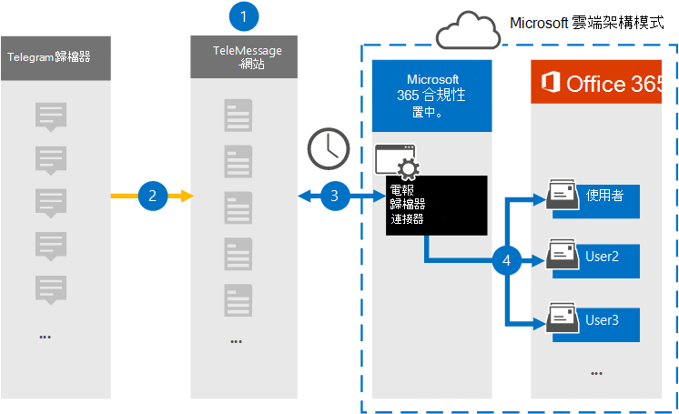

# 設定連接器以封存 Telegram 通訊資料Set up a connector to archive Telegram communications data

使用 Microsoft 365 合規性中心中的 TeleMessage 連接器，匯入及封存 Telegram 聊天室、附件、檔案及已刪除的郵件和通話。Use the TeleMessage connector in the Microsoft 365 compliance center to import and archive Telegram chats, attachments, files, and deleted messages and calls. 在您設定及設定連接器之後，它會連線到您組織的 TeleMessage 帳戶，並將使用 Telegram 歸檔人員的員工行動通訊，匯入 Microsoft 365 中的信箱。After you set up and configure a connector, it connects to your organization's TeleMessage account, and imports the mobile communication of employees using the Telegram Archiver to mailboxes in Microsoft 365.

Telegram 封存器連接器資料儲存在使用者信箱之後，您就可以套用 Microsoft 365 合規性功能，例如訴訟暫止、內容搜尋，以及 Microsoft 365 保留原則，以 Telegram 通訊資料。After Telegram Archiver connector data is stored in user mailboxes, you can apply Microsoft 365 compliance features such as Litigation Hold, Content search, and Microsoft 365 retention policies to Telegram communication data. 例如，您可以使用內容搜尋來搜尋 Telegram 通訊，或在 Advanced eDiscovery 案例中，將包含 Telegram 記錄器連接器資料的信箱與保管人產生關聯。For example, you can search Telegram communication using Content Search or associate the mailbox that contains the Telegram Archiver connector data with a custodian in an Advanced eDiscovery case. 使用 Telegram 歸檔連接器在 Microsoft 365 中匯入和封存資料，可協助您的組織遵守公司控管管理法規和法規原則。Using a Telegram Archiver connector to import and archive data in Microsoft 365 can help your organization stay compliant with corporate governance regulations and regulatory policies.

## 封存 Telegram 通訊資料的概覽Overview of archiving Telegram communications data

下列概要說明如何使用連接器封存 Microsoft 365 中的 Telegram 通訊資料。The following overview explains the process of using a connector to archive  Telegram communications data in Microsoft 365.

1. 您的組織與 TeleMessage 搭配使用，以設定 Telegram 的歸檔器連接器。Your organization works with TeleMessage to set up a Telegram Archiver connector. 如需詳細資訊，請參閱[啟用 Microsoft 365 的 TeleMessage Telegram 歸檔程式](https://www.telemessage.com/microsoft-365-activation-for-telegram-archiver/)。For more information, see [Activating the TeleMessage Telegram Archiver for Microsoft 365](https://www.telemessage.com/microsoft-365-activation-for-telegram-archiver/).

2. 您的組織的 Telegram 資料是即時複製到 TeleMessage 網站。In real time, your organization's Telegram data is copied to the TeleMessage site.

3. 您在 Microsoft 365 合規性中心中建立的 Telegram 歸檔區連接器每天都會連線到 TeleMessage 網站，並將電子郵件訊息從過去24小時內傳送至 Microsoft 雲端中的安全 Azure 儲存體區域。The Telegram Archiver connector that you create in the Microsoft 365 compliance center connects to the TeleMessage site every day and transfers the email messages from the previous 24 hours to a secure Azure Storage area in the Microsoft Cloud.

4. 連接器會將行動通訊專案匯入特定使用者的信箱。The connector imports the mobile communication items to the mailbox of a specific user. 會在特定使用者的信箱中建立名為 Telegram 的新資料夾，並將這些專案匯入該資料夾。A new folder named Telegram Archiver will be created in the specific user's mailbox and the items will be imported to it. 連接器會使用 *使用者的電子郵件地址* 屬性值來進行對應。The connector does this mapping by using the value of the *User's Email address* property. 每封電子郵件都包含此內容，該屬性會填入電子郵件的每個參與者的電子郵件地址。Every email message contains this property, which is populated with the email address of every participant of the email message.

> 除了使用 *使用者之電子郵件地址* 屬性值的自動使用者對應，您也可以透過上載 CSV 對應檔來定義自訂對應。In addition to automatic user mapping using the value of the *User's Email address* property, you can also define a custom mapping by uploading a CSV mapping file. 這個對應檔案應該包含使用者的行動電話號碼，以及每位使用者對應的 Microsoft 365 信箱位址。This mapping file should contain User's mobile Number and the corresponding Microsoft 365 mailbox address for each user. 如果您啟用自動使用者對應，並提供自訂對應，則每個電子郵件專案連接器都會先查看自訂對應檔案。If you enable automatic user mapping and provide a custom mapping, for every email item the connector will first look at custom mapping file. 如果找不到有效的 Microsoft 365 使用者與使用者的行動電話號碼對應，連接器會使用該電子郵件專案的使用者電子郵件地址屬性。If it doesn't find a valid Microsoft 365 user that corresponds to a user's mobile number, the connector will use the User ‘s email address property of the email item. 如果連接器沒有在自訂對應檔案或電子郵件專案的 *使用者電子郵件地址* 屬性中找到有效的 Microsoft 365 使用者，則不會匯入該專案。If the connector doesn't find a valid Microsoft 365 user in either the custom mapping file or the *user's email address* property of the email item, the item won't be imported.

## 在您設定連接器之前Before you set up a connector

- [從 TeleMessage 定購 Telegram 封存服務](https://www.telemessage.com/mobile-archiver/order-mobile-archiver-for-o365/)，並為您的組織取得有效的管理帳戶。Order the [Telegram archiving service from TeleMessage](https://www.telemessage.com/mobile-archiver/order-mobile-archiver-for-o365/) and get a valid administration account for your organization. 當您在規範中心建立連接器時，您必須登入此帳戶。You'll need to sign into this account when you create the connector in the compliance center.

- 在 TeleMessage 帳戶中，註冊所有需要 Telegram 封存的使用者。Register all users that require Telegram archiving in the TeleMessage account. 註冊使用者時，請務必使用與其 Microsoft 365 帳戶相同的電子郵件地址。When registering users, be sure to use the same email address that's used for their Microsoft 365 account.

- 在您員工的行動電話上安裝 Telegram 歸檔應用程式，並加以啟動。Install the Telegram Archiver app on the mobile phones of your employees and activate it. Telegram 歸檔器應用程式可讓他們與其他 Telegram 使用者通訊和聊天。The Telegram Archiver app allows them to communicate and chat with other Telegram users.

- 在步驟3中建立 Telegram 歸檔連接器的使用者，必須在 Exchange Online 中指派「信箱匯入匯出」角色。The user who creates a Telegram Archiver connector in Step 3 must be assigned the Mailbox Import Export role in Exchange Online. 在 Microsoft 365 合規性中心的 [**資料連線器**] 頁面中新增連接器時，這是必要的。This is required to add connectors in the **Data connectors** page in the Microsoft 365 compliance center. 依預設，此角色不會指派給 Exchange Online 內的任何角色群組。By default, this role isn't assigned to any role group in Exchange Online. 您可以將信箱匯入匯出角色新增至 Exchange Online 中的「組織管理」角色群組。You can add the Mailbox Import Export role to the Organization Management role group in Exchange Online. 或者，您可以建立角色群組、指派信箱匯入匯出角色，然後將適當的使用者新增為成員。Or you can create a role group, assign the Mailbox Import Export role, and then add the appropriate users as members. 如需詳細資訊，請參閱「在 Exchange Online 中管理角色群組」一文中的 [[建立角色群組](/Exchange/permissions-exo/role-groups#create-role-groups)或[修改角色](/Exchange/permissions-exo/role-groups#modify-role-groups)群組] 區段。For more information, see the [Create role groups](/Exchange/permissions-exo/role-groups#create-role-groups) or [Modify role groups](/Exchange/permissions-exo/role-groups#modify-role-groups) sections in the article "Manage role groups in Exchange Online".

## 建立 Telegram 的歸檔器連接器Create a Telegram Archiver connector

在您完成上一節所述的必要條件後，您就可以在 Microsoft 365 合規性中心中建立 Telegram 歸檔器連接器。After you've completed the prerequisites described in the previous section, you can create the Telegram Archiver connector in the Microsoft 365 compliance center. 連接器會使用您提供的資訊來連線至 TeleMessage 網站，並將 Telegram 通訊資料傳送至 Microsoft 365 中對應的使用者信箱方塊。The connector uses the information you provide to connect to the TeleMessage site and transfers Telegram communications data to the corresponding user mailbox boxes in Microsoft 365.

1. 移至 <https://compliance.microsoft.com> ，然後按一下 [ **資料連線器** ] > T **elegram 歸檔** 器。Go to <https://compliance.microsoft.com> and then click **Data connectors** > T **elegram Archiver**.

2. 在 [ **Telegram 歸檔** 器產品描述] 頁面上，按一下 [ **新增連接器**]。On the **Telegram Archiver** product description page, click **Add connector**.

3. 在 [ **服務條款** ] 頁面上，按一下 [ **接受**]。On the **Terms of service** page, click **Accept**.

4. 在 [ **登入 TeleMessage** ] 頁面的 [步驟 3] 下，于下列方塊中輸入必要的資訊，然後按 **[下一步]**。On the **Login to TeleMessage** page, under Step 3, enter the required information in the following boxes and then click **Next**.

    - 使用者 **名稱：** 您的 TeleMessage 使用者名稱。**Username:** Your TeleMessage username.

    - **密碼：** 您的 TeleMessage 密碼。**Password:** Your TeleMessage password.

5. 建立連接器之後，您可以關閉快顯視窗，然後移至下一個頁面。After the connector is created, you can close the pop-up window and go to the next page.

6. 在 [ **使用者對應** ] 頁面上，啟用自動使用者對應。On the **User mapping** page, enable automatic user mapping. 若要啟用自訂對應，請上傳包含使用者對應資訊的 CSV 檔案，然後按 **[下一步]**。To enable custom mapping, upload a CSV file that contains the user mapping information, and then click **Next**.

7. 請複查您的設定，然後按一下 **[完成]** 以建立連接器。Review your settings, and then click **Finish** to create the connector.

8. 移至 [ **資料連線器** ] 頁面中的 [連接器] 索引標籤，以查看新連接器的匯入程式的進度。Go to the Connectors tab in **Data connectors** page to see the progress of the import process for the new connector.

## 已知問題Known issues

- 此時，我們不支援匯入大於 10 MB 的附件或專案。At this time, we don't support importing attachments or items that are larger than 10 MB. 稍後將提供對較大專案的支援。Support for larger items will be available at a later date.
