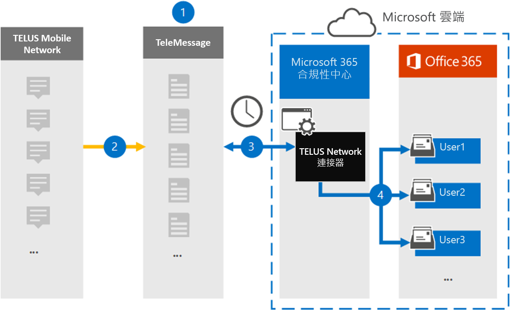

# 設定連接器以封存 TELUS 網路資料 (預覽) 

使用 Microsoft 365 規範中心內的 TeleMessage 連接器，匯入及封存短信服務 (SMS) 組織的 TELUS 網路中的資料。 在您設定及設定連接器之後，它每天會連線到您組織的 TELUS 網路，並將 SMS 資料匯入至 Microsoft 365 中的信箱。

將 SMS 郵件儲存在使用者信箱之後，您可以套用 Microsoft 365 合規性功能，例如訴訟暫止、內容搜尋，以及 Microsoft 365 保留原則，以 TELUS 資料。 例如，您可以使用內容搜尋來搜尋 TELUS SMS 訊息，或將包含 TELUS 資料的信箱與高級 eDiscovery 案例中的保管人產生關聯。 使用 TELUS 網路連接器匯入和封存 Microsoft 365 中的資料可協助您的組織遵守政府和法規原則。

## 封存 TELUS 網路資料的概覽

下列概要說明如何使用連接器封存 Microsoft 365 中的 TELUS 網路資料。

1. 您的組織與 TeleMessage 和 TELUS 搭配使用，以設定 TELUS 網路連接器。 如需詳細資訊，請參閱 [TELUS Network 存檔](https://www.telemessage.com/office365-activation-for-telus-network-archiver/)器。

2. 每24小時一次，來自組織之 TELUS 網路的 SMS 訊息會複製到 TeleMessage 網站。

3. 您在 Microsoft 365 合規性中心建立的 TELUS 網路連接器每天會連線至 TeleMessage 網站，並將 SMS 郵件從過去24小時傳送至 Microsoft 雲端中的安全 Azure 存放位置。 連接器也會將 SMS 郵件的內容轉換為電子郵件訊息格式。

4. 連接器會將行動通訊專案匯入特定使用者的信箱。 在特定使用者的信箱中建立名為 **TELUS SMS 網路存檔** 的新資料夾，並將這些專案匯入該資料夾。 連接器會使用 *使用者的電子郵件地址* 屬性值進行對應。 每個 SMS 郵件都包含此內容，該屬性會填入 SMS 訊息每個參與者的電子郵件地址。

   除了使用 *使用者的電子郵件地址* 屬性值進行自動使用者對應之外，您也可以透過上載 CSV 對應檔來執行自訂對應。 此對應檔包含組織中使用者的行動電話號碼和對應的 Microsoft 365 電子郵件地址。 如果您為每個 TELUS 專案啟用自動使用者對應及自訂對應，連接器會先查看自訂對應檔案。 如果找不到對應至使用者行動電話號碼的有效 Microsoft 365 使用者，連接器會使用嘗試匯入之專案的電子郵件地址屬性值。 如果連接器在自訂對應檔案或 TELUS 專案的電子郵件地址屬性中找不到有效的 Microsoft 365 使用者，則不會匯入該專案。

## 在您開始之前

封存 TELUS 網路資料所需的部分執行步驟是 Microsoft 365 的外部，必須先完成，您才能在規範中心建立連接器。

- [從 TeleMessage 定購 TELUS 網路歸檔服務](https://www.telemessage.com/mobile-archiver/order-mobile-archiver-for-o365)，並為您的組織取得有效的管理帳戶。 當您在規範中心建立連接器時，您必須登入此帳戶。

- 取得您的 TELUS 網路帳戶和計費連絡人詳細資料，以便您可以在 TELUS 中填寫 TeleMessage 上架表單，並訂購郵件封存服務。

- 在 TeleMessage 帳戶中，註冊所有需要 TELUS SMS 網路封存的使用者。 註冊使用者時，請務必使用與 Microsoft 365 帳戶所用相同的電子郵件地址。

- 您的員工在 theTELUS 行動網路上必須擁有公司擁有及公司的行動電話。 在 Microsoft 365 中封存郵件無法供員工擁有，也不會讓您自己的裝置 (BYOD) 裝置。

- 您的組織必須同意允許 Office 365 匯入服務存取您組織中的信箱資料。 當您建立連接器時，將需要提供此同意。 若要同意此要求，請移至 [此頁面](https://login.microsoftonline.com/common/oauth2/authorize?client_id=570d0bec-d001-4c4e-985e-3ab17fdc3073&response_type=code&redirect_uri=https://portal.azure.com/&nonce=1234&prompt=admin_consent)，使用 Microsoft 365 全域管理員的認證登入，然後接受要求。 您必須完成此步驟，才能成功建立 TELUS 網路連接器。

- 在 Exchange Online 中，必須對建立 TELUS 網路連接器的使用者指派「信箱匯入匯出」角色。 在 Microsoft 365 規範中心的 [ **資料連線器** ] 頁面中新增連接器時，這是必要的。 依預設，此角色不會指派給 Exchange Online 內的任何角色群組。 您可以將信箱匯入匯出角色新增至 Exchange Online 中的「組織管理」角色群組。 或者，您可以建立角色群組、指派信箱匯入匯出角色，然後將適當的使用者新增為成員。 如需詳細資訊，請參閱「管理 Exchange Online 中的角色群組」一文中的 [ [建立角色群組](https://docs.microsoft.com/Exchange/permissions-exo/role-groups#create-role-groups) 或 [修改角色群組](https://docs.microsoft.com/Exchange/permissions-exo/role-groups#modify-role-groups) ] 區段。

## 建立 TELUS 網路連接器

在您完成上一節所述的必要條件之後，您可以在 Microsoft 365 規範中心建立 TELUS 網路連接器。 連接器會使用您提供的資訊來連線至 TeleMessage 網站，並將 SMS 郵件轉接至 Microsoft 365 中對應的使用者信箱方塊。

1. 移至 [https://compliance.microsoft.com](https://compliance.microsoft.com/) ，然後按一下 [**資料連線器**  >  **TELUS 網路**]。

2. 在 [ **TELUS 網路**產品描述] 頁面上，按一下 [**新增連接器**]

3. 在 [ **服務條款** ] 頁面上，按一下 [ **接受**]。

4. 在 [ **登入 TeleMessage** ] 頁面的 [步驟 3] 下，于下列方塊中輸入必要的資訊，然後按 **[下一步]**。

   - 使用者**名稱：** 您的 TeleMessage 使用者名稱。

   - **密碼：** 您的 TeleMessage 密碼。

5. 建立連接器之後，您可以關閉快顯視窗，然後移至下一個頁面。

6. 在 [ **使用者對應** ] 頁面上啟用 [自動使用者對應]，然後按 **[下一步]**。 如果您需要自訂對應，請上載 CSV 檔案，然後按 **[下一步]**。

7. 提供系統管理員同意，然後按 **[下一步]**。

   若要提供系統管理員同意，您必須以 Office 365 全域管理員的認證登入，然後接受同意要求。 如果您未以全域系統管理員身分登入，您可以移至 [此頁面](https://login.microsoftonline.com/common/oauth2/authorize?client_id=570d0bec-d001-4c4e-985e-3ab17fdc3073&response_type=code&redirect_uri=https://portal.azure.com/&nonce=1234&prompt=admin_consent) ，並使用全域系統管理員認證登入，以接受要求。

8. 請複查您的設定，然後按一下 **[完成]** 以建立連接器。

9. 移至 [ **資料連線器** ] 頁面中的 [連接器] 索引標籤，以查看新連接器的匯入程式的進度。

## 已知問題

- 此時，我們不支援匯入大於 10 MB 的附件，但較大專案的支援將于之後提供。
