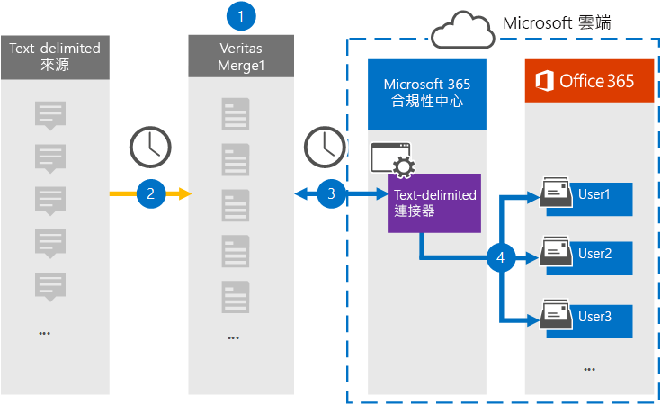

# 設定連接器以封存以文字分隔的資料Set up a connector to archive text-delimited data

在 Microsoft 365 規範中心使用 Veritas 連接器，將以文字分隔的資料匯入並封存 Microsoft 365 組織中的使用者信箱。Use a Veritas connector in the Microsoft 365 compliance center to import and archive text-delimited data to user mailboxes in your Microsoft 365 organization. Veritas 會提供以[文字分隔的連接器](https://globanet.com/text-delimited)，將其設定為定期捕獲協力廠商資料來源中的專案 () 並將這些專案匯入 Microsoft 365。Veritas provides a [text-delimited connector](https://globanet.com/text-delimited) that's configured to capture items from a third-party data source (on a regular basis) and import those items to Microsoft 365. 連接器會將內容從文字分隔的資料來源轉換為電子郵件訊息格式，然後將這些專案匯入 Microsoft 365 中的使用者信箱。The connector converts content from the text-delimited data source to an email message format and then imports those items to the user's mailbox in Microsoft 365.

將文字分隔的資料儲存在使用者信箱之後，您就可以套用 Microsoft 365 合規性功能，例如訴訟暫止、eDiscovery 及保留原則和保留標籤。After text-delimited data is stored in user mailboxes, you can apply Microsoft 365 compliance features such as Litigation Hold, eDiscovery, and retention policies and retention labels. 在 Microsoft 365 中使用以文字分隔的資料連線器，以匯入和封存資料，可協助您的組織遵守政府和法規原則。Using a text-delimited data connector to import and archive data in Microsoft 365 can help your organization stay compliant with government and regulatory policies.

## 封存以文字分隔的資料Overview of archiving the text-delimited data

下列概要說明使用連接器在 Microsoft 365 中封存以文字分隔之來源資訊的處理常式。The following overview explains the process of using a connector to archive text-delimited source information in Microsoft 365.

1. 您的組織可以搭配文字分隔的來源，設定及設定文字分隔的網站。Your organization works with the text-delimited source to set up and configure a text-delimited site.

2. 每隔24小時，就會將從文字分隔之來源的聊天訊息複製到 Veritas Merge1 網站。Once every 24 hours, chat messages from the text-delimited source are copied to the Veritas Merge1 site. 連接器也會將內容轉換成電子郵件訊息格式。The connector also converts the content to an email message format.

3. 您在 Microsoft 365 合規性中心建立的文字分隔連接器每天會連線至 Veritas Merge1 網站，並將郵件傳輸至 Microsoft 雲端中的安全 Azure 儲存體位置。The text-delimited connector that you create in the Microsoft 365 compliance center connects to the Veritas Merge1 site every day and transfers the messages to a secure Azure Storage location in the Microsoft cloud.

4. 連接器會使用 [步驟 3] 中所述之自動使用者對應的 *電子郵件* 屬性值，將已轉換的訊息項目匯入特定使用者的信箱。The connector imports the converted message items to the mailboxes of specific users using the value of the *Email* property of the automatic user mapping as described in Step 3. 在使用者信箱中，會建立名為 **文字分隔** 之收件匣資料夾中的新子資料夾，然後將訊息項目匯入該資料夾。A new subfolder in the Inbox folder named **Text- Delimited** is created in the user mailboxes, and the message items are imported to that folder. 連接器會使用 *Email* 屬性的值來決定要匯入專案的信箱。The connector determines which mailbox to import items to by using the value of the *Email* property. 每封郵件都包含此內容，該屬性會填入每位參與者的電子郵件地址。Every message contains this property, which is populated with the email address of every participant.

## 開始之前Before you begin

- 建立 Microsoft 連接器的 Veritas Merge1 帳戶。Create a Veritas Merge1 account for Microsoft connectors. 若要建立此帳戶，請與 [Veritas 客戶支援](https://globanet.com/ms-connectors-contact)聯繫。To create this account, contact [Veritas Customer Support](https://globanet.com/ms-connectors-contact). 當您在步驟1中建立連接器時，您會登入此帳戶。You will sign into this account when you create the connector in Step 1.

- 在步驟1中建立以文字分隔的連接器 (，並在步驟 3) 中完成，則必須將 Exchange Online 中的信箱匯入匯出角色指派給該使用者。The user who creates the text-delimited connector in Step 1 (and completes it in Step 3) must be assigned to the Mailbox Import Export role in Exchange Online. 在 [Microsoft 365 規範中心] 的 [**資料連線器**] 頁面上新增連接器時，此角色是必要的。This role is required to add connectors on the **Data connectors** page in the Microsoft 365 compliance center. 根據預設，此角色不會指派給 Exchange Online 中的角色群組。By default, this role is not assigned to a role group in Exchange Online. 您可以將信箱匯入匯出角色新增至 Exchange Online 中的「組織管理」角色群組。You can add the Mailbox Import Export role to the Organization Management role group in Exchange Online. 或者，您可以建立角色群組、指派信箱匯入匯出角色，然後將適當的使用者新增為成員。Or you can create a role group, assign the Mailbox Import Export role, and then add the appropriate users as members. 如需詳細資訊，請參閱「在 Exchange Online 中管理角色群組」一文中的 [[建立角色群組](/Exchange/permissions-exo/role-groups#create-role-groups)或[修改角色](/Exchange/permissions-exo/role-groups#modify-role-groups)群組] 區段。For more information, see the [Create role groups](/Exchange/permissions-exo/role-groups#create-role-groups) or [Modify role groups](/Exchange/permissions-exo/role-groups#modify-role-groups) sections in the article "Manage role groups in Exchange Online".

## 步驟1：設定以文字分隔的連接線Step 1: Set up the text-delimited connector

第一步是存取「Microsoft 365 規範中心」中的 [**資料連線器**] 頁面，並為以文字分隔的資料建立連接器。The first step is to access to the **Data Connectors** page in the Microsoft 365 compliance center and create a connector for text-delimited data.

1. 移至 [https://compliance.microsoft.com](https://compliance.microsoft.com/) ，然後按一下 [**資料連線器**]  >  **文字分隔**。Go to [https://compliance.microsoft.com](https://compliance.microsoft.com/) and then click **Data connectors** > **Text-Delimited**.

2. 在 [ **文字分隔** 的產品描述] 頁面上，按一下 [ **新增連接器**]。On the **text-delimited** product description page, click **Add connector**.

3. 在 [ **服務條款** ] 頁面上，按一下 [ **接受**]。On the **Terms of service** page, click **Accept**.

4. 輸入識別連接器的唯一名稱，然後按 **[下一步]**。Enter a unique name that identifies the connector, and then click **Next**.

5. 登入您的 Merge1 帳戶以設定連接器。Sign in to your Merge1 account to configure the connector.

## 步驟2：在 Veritas Merge1 網站上設定以文字分隔的連接器Step 2: Configure the Text-delimited connector on the Veritas Merge1 site

第二個步驟是在 Merge1 網站上設定文字分隔的連接器。The second step is to configure the text-delimited connector on the Merge1 site. 如需在 Veritas Merge1 網站上設定文字分隔連接器的詳細資訊，請參閱 [Merge1 Third-Party 連接器 User Guide](https://docs.ms.merge1.globanetportal.com/Merge1%20Third-Party%20Connectors%20text-delimited%20User%20Guide%20.pdf)。For information about configuring  the text-delimited connector on the Veritas Merge1 site, see [Merge1 Third-Party Connectors User Guide](https://docs.ms.merge1.globanetportal.com/Merge1%20Third-Party%20Connectors%20text-delimited%20User%20Guide%20.pdf).

按一下 **[儲存] & 完成** 之後，就會顯示「Microsoft 365 規範中心」的 [連接器] 中的 [**使用者對應**] 頁面。After you click **Save & Finish**, the **User mapping** page in the connector wizard in the Microsoft 365 compliance center is displayed.

## 步驟3：對應使用者並完成連接器設定Step 3: Map users and complete the connector setup

若要在 Microsoft 365 規範中心內對應使用者並完成連接器設定，請遵循下列步驟：To map users and complete the connector setup in the Microsoft 365 compliance center, follow these steps:

1. 在 [將 **外部使用者對應至 Microsoft 365 使用者**] 頁面上，啟用 [自動使用者對應]。On the **Map external users to Microsoft 365 users** page, enable automatic user mapping. 文字分隔的來源專案會包含一個名為「 *電子郵件*」的屬性，其中包含組織中使用者的電子郵件地址。The Text- Delimited source items include a property called *Email*, which contains email addresses for users in your organization. 如果連接器可以將此位址與 Microsoft 365 使用者相關聯，則會將這些專案匯入該使用者的信箱。If the connector can associate this address with a Microsoft 365 user, the items are imported to that user’s mailbox.

2. 按 **[下一步]**，複查您的設定，然後移至 [ **資料連線器** ] 頁面，以查看新連接器的匯入程式的進度。Click **Next**, review your settings, and then go to the **Data connectors** page to see the progress of the import process for the new connector.

## 步驟4：監視以文字分隔的連接線Step 4: Monitor the text-delimited connector

建立以文字分隔的連接器之後，您可以在 [Microsoft 365 規範中心] 中查看連接器狀態。After you create the Text- Delimited connector, you can view the connector status in the Microsoft 365 compliance center.

1. 移至 [https://compliance.microsoft.com](https://compliance.microsoft.com) 並按一下左側導覽中的 [ **資料連線器** ]。Go to [https://compliance.microsoft.com](https://compliance.microsoft.com) and click **Data connectors** in the left nav.

2. 按一下 [ **連接器** ] 索引標籤，然後選取以 **文字分隔** 的連接線以顯示飛出頁面。Click the **Connectors** tab and then select the **Text- Delimited** connector to display the flyout page. 此頁面包含連接器的屬性和資訊。This page contains the properties and information about the connector.

3. 在 [ **連接器狀態與來源**] 底下，按一下 [ **下載記錄** ] 連結，以開啟連接器的狀態記錄 (或儲存) 。Under **Connector status with source**, click the **Download log** link to open (or save) the status log for the connector. 此記錄檔包含已匯入至 Microsoft 雲端之資料的相關資訊。This log contains information about the data that has been imported to the Microsoft cloud.

## 已知問題Known issues

- 此時，我們不支援匯入大於 10 MB 的附件或專案。At this time, we don't support importing attachments or items that are larger than 10 MB. 稍後將提供對較大專案的支援。Support for larger items will be available at a later date.