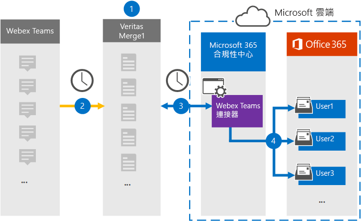

# 設定連接器以封存 Webex 小組資料Set up a connector to archive Webex Teams data

使用 Microsoft 365 規範中心內的 Globanet 連接器，將 Webex 小組的資料匯入並封存至您的 Microsoft 365 組織中的使用者信箱。Use a Globanet connector in the Microsoft 365 compliance center to import and archive data from Webex Teams to user mailboxes in your Microsoft 365 organization. Globanet 提供 [Webex 小組](https://globanet.com/webex-teams/) 連接器，設定為捕獲 Webex 小組通訊專案，並將其匯入至 Microsoft 365。Globanet provides a [Webex Teams](https://globanet.com/webex-teams/) connector that is configured to capture Webex Teams communication items and import them to Microsoft 365. 連接器會將來自 Webex 小組的內容，例如1:1 聊天、群組交談、通道交談及附件從組織的 Webex 小群組帳戶轉換成電子郵件訊息格式，然後再將這些專案匯入 Microsoft 365 中的使用者信箱。The connector converts content from Webex Teams, such as 1:1 chats, group conversations, channel conversations, and attachments from your organization's Webex Teams account, to an email message format and then imports those items to the user's mailbox in Microsoft 365.

在將 Webex 小組資料儲存在使用者信箱之後，您可以套用 Microsoft 365 合規性功能，例如訴訟暫止、eDiscovery、保留原則和保留標籤，以及通訊法規遵從性。After Webex Teams data is stored in user mailboxes, you can apply Microsoft 365 compliance features such as Litigation Hold, eDiscovery, retention policies and retention labels, and communication compliance. 使用 Webex 小組連接器來匯入和封存 Microsoft 365 中的資料，可協助您的組織遵守政府和法規原則。Using a Webex Teams connector to import and archive data in Microsoft 365 can help your organization stay compliant with government and regulatory policies.

## 封存 Webex 小組資料的概覽Overview of archiving Webex Teams data

下列概要說明如何使用連接器將 Microsoft 365 中的 Webex 小組資料封存。The following overview explains the process of using a connector to archive Webex Teams data in Microsoft 365.

1. 您的組織與 Webex 小組合作，以設定和設定 Webex 小組網站。Your organization works with Webex Teams to set up and configure a Webex Teams site.

2. 每24小時一次，Webex 團隊專案會複製到 Globanet Merge1 網站。Once every 24 hours, Webex Teams items are copied to the Globanet Merge1 site. 連接器也會將 Webex 小組專案轉換成電子郵件訊息格式。The connector also converts the Webex Teams items to an email message format.

3. 您在 Microsoft 365 規範中心建立的 Webex 小組連接器，會每天連線到 Globanet Merge1，並將 Webex 團隊專案傳送至 Microsoft 雲端中的安全 Azure 存放位置。The Webex Teams connector that you create in the Microsoft 365 compliance center, connects to the Globanet Merge1 every day, and transfers the Webex Teams items to a secure Azure Storage location in the Microsoft cloud.

4. 連接器會使用自動使用者對應的 *電子郵件* 屬性值，將專案匯入至特定使用者的信箱，如 [步驟 3](#step-3-map-users-and-complete-the-connector-setup)所述。The connector imports items to the mailboxes of specific users by using the value of the *Email* property of the automatic user mapping as described in [Step 3](#step-3-map-users-and-complete-the-connector-setup). 在使用者信箱中，會建立名為 **Webex 小組** 收件匣資料夾中的子資料夾，並將這些專案匯入該資料夾。A subfolder in the Inbox folder named **Webex Teams** is created in the user mailboxes, and the items are imported to that folder. 連接器會使用 *Email* 屬性的值來執行此動作。The connector does this by using the value of the *Email* property. 每個 Webex 團隊專案都包含此屬性，其會填入專案的每個參與者的電子郵件地址。Every Webex Teams item contains this property, which is populated with the email address of every participant of the item.

## 開始之前Before you begin

- 為 Microsoft connector 建立 Globanet Merge1 帳戶。Create a Globanet Merge1 account for Microsoft connectors. 若要這麼做，請與 [Globanet 客戶支援](https://globanet.com/ms-connectors-contact)部門聯繫。To do this, contact [Globanet Customer Support](https://globanet.com/ms-connectors-contact). 當您在步驟1中建立連接器時，您必須登入此帳戶。You need to sign into this account when you create the connector in Step 1.

- 在中建立應用程式 [https://developer.webex.com/](https://developer.webex.com) ，以從 Webex 小群組帳戶提取資料。Create an application at [https://developer.webex.com/](https://developer.webex.com) to fetch data from your Webex Teams account. 如需建立應用程式的逐步指示，請參閱[Merge1 Third-Party Connector User Guide](https://docs.ms.merge1.globanetportal.com/Merge1%20Third-Party%20Connectors%20Webex%20Teams%20User%20Guide%20.pdf) 。For step-by step instructions about creating the application, see [Merge1 Third-Party Connectors User Guide](https://docs.ms.merge1.globanetportal.com/Merge1%20Third-Party%20Connectors%20Webex%20Teams%20User%20Guide%20.pdf)

   當您建立此應用程式時，Webex 平臺會產生一組唯一的認證。When you create this application, the Webex platform generates a set of unique credentials. 當您設定全域 Merge1 網站上的 Webex 小組連接器時，會在步驟2中使用這些認證。These credentials are used in Step 2 when you configure the Webex Teams connector on the Global Merge1 site.

- 在步驟1中建立 Webex 小組連接器所 (，並在步驟 3) 中完成的使用者，必須將其指派給 Exchange Online 中的信箱匯入匯出角色。The user who creates the Webex Teams connector in Step 1 (and completes it in Step 3) must be assigned to the Mailbox Import Export role in Exchange Online. 在 Microsoft 365 規範中心的 [ **資料連線器** ] 頁面上新增連接器時，此角色是必要的。This role is required to add connectors on the **Data connectors** page in the Microsoft 365 compliance center. 根據預設，此角色不會指派給 Exchange Online 中的任何角色群組。By default, this role is not assigned to any role group in Exchange Online. 您可以將信箱匯入匯出角色新增至 Exchange Online 中的「組織管理」角色群組。You can add the Mailbox Import Export role to the Organization Management role group in Exchange Online. 或者，您可以建立角色群組、指派信箱匯入匯出角色，然後將適當的使用者新增為成員。Or you can create a role group, assign the Mailbox Import Export role, and then add the appropriate users as members. 如需詳細資訊，請參閱「管理 Exchange Online 中的角色群組」一文中的 [ [建立角色群組](https://docs.microsoft.com/Exchange/permissions-exo/role-groups#create-role-groups) 或 [修改角色群組](https://docs.microsoft.com/Exchange/permissions-exo/role-groups#modify-role-groups) ] 區段。For more information, see the [Create role groups](https://docs.microsoft.com/Exchange/permissions-exo/role-groups#create-role-groups) or [Modify role groups](https://docs.microsoft.com/Exchange/permissions-exo/role-groups#modify-role-groups) sections in the article "Manage role groups in Exchange Online".

## 步驟1：設定 Webex 小組連接器Step 1: Set up the Webex Teams connector

第一步是取得 **資料連線器** 的存取權，並設定 [Webex 小組](https://globanet.com/webex-teams/) 連接器。The first step is to gain access to the **Data Connectors** and set up the [Webex Teams](https://globanet.com/webex-teams/) connector.

1. 移至 [https://compliance.microsoft.com](https://compliance.microsoft.com/) ，然後按一下 [**資料連線器**  >  **Webex 小組**]。Go to [https://compliance.microsoft.com](https://compliance.microsoft.com/) and then click **Data connectors** > **Webex Teams**.

2. 在 [ **Webex 小組** 產品描述] 頁面上，按一下 [ **新增連接器**]。On the **Webex Teams** product description page, click **Add connector**.

3. 在 [ **服務條款** ] 頁面上，按一下 [ **接受**]。On the **Terms of service** page, click **Accept**.

4. 輸入識別連接器的唯一名稱，然後按 **[下一步]**。Enter a unique name that identifies the connector, and then click **Next**.

5. 登入您的 Merge1 帳戶以設定連接器。Sign in to your Merge1 account to configure the connector.

## 步驟2：設定 Globanet Merge1 網站上的 Webex 小組連接器Step 2: Configure the Webex Teams connector on the Globanet Merge1 site

第二個步驟是設定 Merge1 網站上的 Webex 小組連接器。The second step is to configure the Webex Teams connector on the Merge1 site. 如需如何設定 Webex 小組連接器的詳細資訊，請參閱 [Merge1 Third-Party Connector User Guide](https://docs.ms.merge1.globanetportal.com/Merge1%20Third-Party%20Connectors%20Webex%20Teams%20User%20Guide%20.pdf)。For information about how to configure the Webex Teams connector, see [Merge1 Third-Party Connectors User Guide](https://docs.ms.merge1.globanetportal.com/Merge1%20Third-Party%20Connectors%20Webex%20Teams%20User%20Guide%20.pdf).

在您按一下 **[儲存] & 完成**之後，您會回到 Microsoft 365 規範中心，移至 [連接器] 嚮導中的 [ **使用者對應** ] 頁面。After you click **Save & Finish**, you are directed back to the Microsoft 365 compliance center, to the **User mapping** page in the connector wizard.

## 步驟3：對應使用者並完成連接器設定Step 3: Map users and complete the connector setup

若要對應使用者，並完成 Microsoft 365 規範中心內的連接器設定，請遵循下列步驟：To map users and complete the connector setup in the Microsoft 365 compliance center, follow these steps:

1. 在 [將 **Webex 團隊使用者對應至 Microsoft 365 使用者** ] 頁面上，啟用自動使用者對應。On the **Map Webex Teams users to Microsoft 365 users** page, enable automatic user mapping. Webex 團隊專案包括稱為「 *電子郵件*」的屬性，其中包含組織中使用者的電子郵件地址。The Webex Teams items include a property called *Email*, which contains email addresses for users in your organization. 如果連接器可以將此位址與 Microsoft 365 使用者產生關聯，這些專案就會匯入該使用者的信箱。If the connector can associate this address with a Microsoft 365 user, the items are imported to that user’s mailbox.

2. 在 [系統 **管理員同意** ] 頁面上，按一下 [ **提供同意** ] 按鈕。On the **Admin Consent** page, click the **Provide Consent** button. 您將會重新導向至 Microsoft 網站。You will be redirected to the Microsoft site. 按一下 [ **接受** ] 以提供同意。Click **Accept** to provide the consent.
  
   您的組織必須同意允許 Office 365 匯入服務存取您組織中的信箱資料。Your organization must consent to allow the Office 365 Import service to access mailbox data in your organization. 若要提供系統管理員同意，您必須使用 Microsoft 365 全域管理員的認證登入，然後接受同意要求。To provide admin consent, you must be signed in with the credentials of a Microsoft 365 global admin, and then accept the consent request. 如果您未以全域系統管理員身分登入，您可以移至 [此頁面](https://login.microsoftonline.com/common/oauth2/authorize?client_id=570d0bec-d001-4c4e-985e-3ab17fdc3073&response_type=code&redirect_uri=https://portal.azure.com/&nonce=1234&prompt=admin_consent) ，並使用全域系統管理員認證登入，以接受要求。If you aren't signed in as a global admin, you can go to [this page](https://login.microsoftonline.com/common/oauth2/authorize?client_id=570d0bec-d001-4c4e-985e-3ab17fdc3073&response_type=code&redirect_uri=https://portal.azure.com/&nonce=1234&prompt=admin_consent) and sign in using global admin credentials to accept the request.

3. 按 **[下一步]**，複查您的設定，然後移至 [ **資料連線器** ] 頁面，以查看新連接器的匯入程式的進度。Click **Next**, review your settings, and then go to the **Data connectors** page to see the progress of the import process for the new connector.

## 步驟4：監控 Webex 小組連接器Step 4: Monitor the Webex Teams connector

在您建立 Webex 小組連接器之後，您可以在 Microsoft 365 規範中心中查看連接器狀態。After you create the Webex Teams connector, you can view the connector status in the Microsoft 365 compliance center.

1. 移至 [https://compliance.microsoft.com](https://compliance.microsoft.com) 並按一下左側導覽中的 [ **資料連線器** ]。Go to [https://compliance.microsoft.com](https://compliance.microsoft.com) and click **Data connectors** in the left nav.

2. 按一下 [ **連接器** ] 索引標籤，然後選取 [ **Webex 小組** 連接器]，以顯示 [飛出] 頁面，該頁面包含連接器的屬性和資訊。Click the **Connectors** tab and then select the **Webex Teams** connector to display the flyout page, which contains the properties and information about the connector.

3. 在 [ **連接器狀態與來源**] 底下，按一下 [ **下載記錄** ] 連結，以開啟連接器的狀態記錄 (或儲存) 。Under **Connector status with source**, click the **Download log** link to open (or save) the status log for the connector. 此記錄檔包含已匯入至 Microsoft 雲端之資料的相關資訊。This log contains information about the data that has been imported to the Microsoft cloud.

## 已知問題Known issues

- 此時，我們不支援匯入大於 10 MB 的附件或專案。At this time, we don't support importing attachments or items that are larger than 10 MB. 稍後將提供對較大專案的支援。Support for larger items will be available at a later date.
