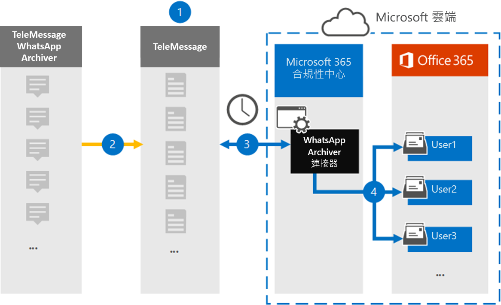

# 設定連接器以封存 WhatsApp 資料

使用 Microsoft 365 規範中心內的 TeleMessage 連接器，匯入及封存 WhatsApp 通話、聊天、附件、檔案及已刪除的郵件。 在您設定及設定連接器之後，它每天會連線到您組織的 TeleMessage 帳戶，並將使用 TeleMessage WhatsApp 電話歸檔人員或 TeleMessage WhatsApp 雲端歸檔人員的員工行動通訊，匯入 Microsoft 365 中的信箱。

將 WhatsApp 資料儲存在使用者信箱之後，您就可以套用 Microsoft 365 合規性功能，例如訴訟暫止、內容搜尋，以及 Microsoft 365 保留原則，以 WhatsApp 資料。 例如，您可以使用內容搜尋來搜尋 WhatsApp 郵件，或將包含 WhatsApp 郵件的信箱與 Advanced eDiscovery 案例中的保管人產生關聯。 使用 WhatsApp 連接器在 Microsoft 365 中匯入和封存資料，可協助您的組織遵守政府和法規原則。

## 封存 WhatsApp 資料一覽

下列概要說明如何使用連接器封存 Microsoft 365 中的 WhatsApp 資料。

1. 您的組織與 TeleMessage 搭配使用，以設定 WhatsApp 的歸檔器連接器。 如需詳細資訊，請參閱 [WhatsApp 歸檔](https://www.telemessage.com/office365-activation-for-whatsapp-archiver)器。

2. 您的組織的 WhatsApp 資料是即時複製到 TeleMessage 網站。

3. 您在 Microsoft 365 合規性中心建立的 WhatsApp 連接器每天會連線至 TeleMessage 網站，並將 WhatsApp 資料從前24小時傳輸至 Microsoft 雲端中的安全 Azure 儲存體位置。 連接器也會將內容 WhatsApp 資料轉換成電子郵件訊息格式。

4. 連接器會將 WhatsApp 資料匯入特定使用者的信箱。 在特定使用者的信箱中建立名為 **WhatsApp** 的新資料夾，並將這些專案匯入該資料夾。 連接器會使用 *使用者的電子郵件地址* 屬性值來進行對應。 每個 WhatsApp 郵件都包含此內容，該屬性會填入郵件每一位參與者的電子郵件地址。

   除了使用 *使用者的電子郵件地址* 屬性值進行自動使用者對應之外，您也可以透過上載 CSV 對應檔來執行自訂對應。 此對應檔包含組織中使用者的行動電話號碼和對應的 Microsoft 365 電子郵件地址。 如果您為每個 WhatsApp 專案啟用自動使用者對應及自訂對應，連接器會先查看自訂對應檔案。 如果找不到有效的 Microsoft 365 使用者與使用者的行動電話號碼對應，連接器會使用嘗試匯入之專案的電子郵件地址屬性值。 如果連接器在自訂對應檔或 WhatsApp 專案的 [電子郵件地址] 屬性中找不到有效的 Microsoft 365 使用者，則不會匯入該專案。

## 開始之前

封存 WhatsApp 通訊資料所需的部分執行步驟是 Microsoft 365 外部的，必須先完成，您才能在規範中心建立連接器。

- [從 TeleMessage 定購 WhatsApp 歸檔服務](https://www.telemessage.com/mobile-archiver/order-mobile-archiver-for-o365)，並為您的組織取得有效的管理帳戶。 當您在規範中心建立連接器時，您必須登入此帳戶。

- 在 TeleMessage 帳戶中，註冊所有需要 WhatsApp 封存的使用者。 註冊使用者時，請務必使用與其 Microsoft 365 帳戶相同的電子郵件地址。

- 在您員工的行動電話上安裝 TeleMessage [WhatsApp 電話的歸檔應用程式](https://www.telemessage.com/mobile-archiver/whatsapp-phone-archiver-2/)，並加以啟動。 或者，您也可以在您員工的行動電話上安裝一般 WhatsApp 或 WhatsApp 商務應用程式，並在 TeleMessage 網站上掃描 QR 碼，以啟動 WhatsApp 雲端歸檔服務。 如需詳細資訊，請參閱 [WhatsApp Cloud 存檔](https://www.telemessage.com/mobile-archiver/whatsapp-archiver/whatsapp-cloud-archiver/)器。

- 在 Exchange Online 中，必須為建立 Verizon 網路連接器的使用者指派「信箱匯入匯出」角色。 在 [Microsoft 365 規範中心] 的 [**資料連線器**] 頁面中新增連接器時，這是必要的。 依預設，此角色不會指派給 Exchange Online 內的任何角色群組。 您可以將信箱匯入匯出角色新增至 Exchange Online 中的「組織管理」角色群組。 或者，您可以建立角色群組、指派信箱匯入匯出角色，然後將適當的使用者新增為成員。 如需詳細資訊，請參閱「在 Exchange Online 中管理角色群組」一文中的 [[建立角色群組](/Exchange/permissions-exo/role-groups#create-role-groups)或[修改角色](/Exchange/permissions-exo/role-groups#modify-role-groups)群組] 區段。

## 建立 WhatsApp 的歸檔器連接器

在您完成上一節所述的必要條件後，您就可以在 Microsoft 365 規範中心建立 WhatsApp 連接器。 連接器會使用您提供的資訊來連線至 TeleMessage 網站，並將 WhatsApp 資料傳送至 Microsoft 365 中對應的使用者信箱] 方塊。

1. 移至 [https://compliance.microsoft.com](https://compliance.microsoft.com/) ，然後按一下 [**資料連線器**  >  **WhatsApp 歸檔** 器]。

2. 在 [ **WhatsApp 歸檔** 器產品描述] 頁面上，按一下 [**新增連接器**]

3. 在 [ **服務條款** ] 頁面上，按一下 [ **接受**]。

4. 在 [ **登入 TeleMessage** ] 頁面的 [步驟 3] 下，于下列方塊中輸入必要的資訊，然後按 **[下一步]**。

   - 使用者 **名稱：** 您的 TeleMessage 使用者名稱。

   - **密碼：** 您的 TeleMessage 密碼。

5. 建立連接器之後，您可以關閉快顯視窗，然後移至下一個頁面。

6. 在 [ **使用者對應** ] 頁面上啟用 [自動使用者對應]，然後按 **[下一步]**。 如果您需要自訂對應，請上載 CSV 檔案，然後按 **[下一步]**。

7. 請複查您的設定，然後按一下 **[完成]** 以建立連接器。

8. 移至 [ **資料連線器** ] 頁面中的 [連接器] 索引標籤，以查看新連接器的匯入程式的進度。

## 已知問題

- 此時，我們不支援匯入大於 10 MB 的附件或專案。 稍後將提供對較大專案的支援。
