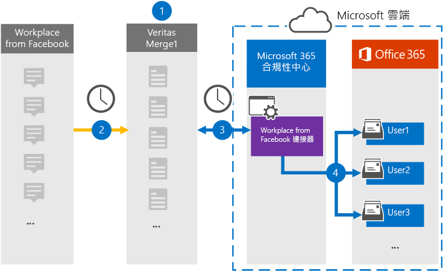

# 設定從 Facebook 資料封存工作場所的連接器

使用 Microsoft 365 規範中心內的 Globanet 連接器，從 Facebook 將工作地點的資料匯入至您的 Microsoft 365 組織中的使用者信箱。 Globanet 提供 [來自 Facebook 連接器的工作區](https://globanet.com/workplace/) ，其設定為定期捕獲協力廠商資料來源中的專案 () 並將這些專案匯入至 Microsoft 365。 連接器會將聊天、附件、帖子和影片等內容轉換成電子郵件訊息格式，然後將這些專案匯入至 Microsoft 365 中的使用者信箱。

將工作場所資料儲存在使用者信箱之後，您可以套用 Microsoft 365 合規性功能，例如訴訟暫止、eDiscovery、保留原則和保留標籤，以及通訊法規遵從性。 使用來自 Facebook connector 的工作場所，在 Microsoft 365 中匯入及封存資料，可協助您的組織遵守政府和法規原則。

## 從 Facebook 資料封存工作場所的概覽

下列概要說明如何使用連接器封存 Microsoft 365 中的工作場所資料。

1. 您的組織使用來自 Facebook 的工作區來設定及設定工作場所網站。

2. 每24小時一次，工作場所的專案會複製到 Globanet Merge1 網站。 連接器也會將這些專案的內容轉換為電子郵件訊息格式。

3. 您在 Microsoft 365 規範中心內建立的 Facebook 連接器中的工作區，會每天連線到 Globanet Merge1，並將工作區專案傳送至 Microsoft 雲端中的安全 Azure 存放位置。

4. 連接器會使用 [步驟 3] 中所述之自動使用者對應的 *電子郵件* 屬性值，將轉換後的專案匯入至特定使用者的信箱。 建立從 Facebook 中名為 **Workplace 之** [收件匣] 資料夾中的子資料夾，並將工作區專案匯入該資料夾。 連接器會使用 *Email* 屬性的值來執行此動作。 每個 Workplace 專案都包含此屬性，其是以每個聊天或張貼參與者的電子郵件地址填入。

## 開始之前

- 為 Microsoft connector 建立 Globanet Merge1 帳戶。 若要建立此帳戶，請與 [Globanet 客戶支援](https://globanet.com/ms-connectors-contact)人員聯繫。 當您在步驟1中建立連接器時，您會登入此帳戶。

- 從 APIs 建立自訂整合， https://my.workplace.com/work/admin/apps/ 以透過相容性和 eDiscovery 目的從工作場所取得資料。

   建立整合時，工作場所平臺會產生一組唯一的認證，用來產生驗證所用的權杖。 這些標記是在步驟2中從 Facebook 連接器設定向導的工作區使用。 如需如何建立應用程式的逐步指示，請參閱 [Merge1 Third-Party Connector User Guide](https://docs.ms.merge1.globanetportal.com/Merge1%20Third-Party%20Connectors%20Workplace%20from%20Facebook%20User%20Guide%20.pdf)。

- 在步驟1中從 Facebook 連接器建立工作區的使用者 (，並在步驟 3) 中完成，則必須將其指派給 Exchange Online 中的信箱匯入匯出角色。 在 Microsoft 365 規範中心的 [ **資料連線器** ] 頁面上新增連接器時，此角色是必要的。 根據預設，此角色不會指派給 Exchange Online 中的角色群組。 您可以將信箱匯入匯出角色新增至 Exchange Online 中的「組織管理」角色群組。 或者，您可以建立角色群組、指派信箱匯入匯出角色，然後將適當的使用者新增為成員。 如需詳細資訊，請參閱「管理 Exchange Online 中的角色群組」一文中的 [ [建立角色群組](/Exchange/permissions-exo/role-groups#create-role-groups) 或 [修改角色群組](/Exchange/permissions-exo/role-groups#modify-role-groups) ] 區段。

## 步驟1：從 Facebook connector 設定工作區

第一步是存取 Microsoft 365 規範中心內的 **資料連線器** 頁面，並建立工作場所資料的連接器。

1. 移至 [https://compliance.microsoft.com](https://compliance.microsoft.com/) 並按一下 Facebook 中的 [**資料連線器**]  >  **工作區**。

2. 在 [ **從 Facebook 產品的工作場所** 描述] 頁面上，按一下 [ **新增連接器**]。

3. 在 [ **服務條款** ] 頁面上，按一下 [ **接受**]。

4. 輸入識別連接器的唯一名稱，然後按 **[下一步]**。

5. 登入您的 Merge1 帳戶以設定連接器。

## 步驟2：在 Globanet Merge1 網站上設定 Facebook connector 中的工作區

第二個步驟是在 Merge1 網站上設定 Facebook connector 中的工作區。 如需如何從 Facebook 連接器設定工作場所的詳細資訊，請參閱 [Merge1 Third-Party Connector User Guide](https://docs.ms.merge1.globanetportal.com/Merge1%20Third-Party%20Connectors%20Workplace%20from%20Facebook%20User%20Guide%20.pdf)。

按一下 **[儲存] & 完成** 之後，就會顯示 Microsoft 365 規範中心內 [連接器] 嚮導中的 [ **使用者對應** ] 頁面。

## 步驟3：對應使用者並完成連接器設定

若要對應使用者，並完成 Microsoft 365 規範中心內的連接器設定，請遵循下列步驟：

1. 在 [將 **外部使用者對應至 Microsoft 365 使用者** ] 頁面上，啟用自動使用者對應。 工作場所專案包括一個稱為「 *電子郵件* 」的屬性，其中包含組織中使用者的電子郵件地址。 如果連接器可以將此位址與 Microsoft 365 使用者產生關聯，這些專案就會匯入該使用者的信箱。

2. 按 **[下一步]**，複查您的設定，然後移至 [ **資料連線器** ] 頁面，以查看新連接器的匯入程式的進度。

## 步驟4：從 Facebook connector 監控工作場所

在您從 Facebook connector 建立工作區之後，您可以在 Microsoft 365 規範中心中查看連接器狀態。

1. 移至 [https://compliance.microsoft.com](https://compliance.microsoft.com) 並按一下左側導覽中的 [ **資料連線器** ]。

2. 按一下 [ **連接器** ] 索引標籤，然後選取 [Facebook connector] **中的工作區** ，以顯示飛出頁面。 此頁面包含連接器的屬性和資訊。

3. 在 [ **連接器狀態與來源**] 底下，按一下 [ **下載記錄** ] 連結，以開啟連接器的狀態記錄 (或儲存) 。 此記錄檔包含已匯入至 Microsoft 雲端之資料的相關資訊。

## 已知問題

- 此時，我們不支援匯入大於 10 MB 的附件或專案。 稍後將提供對較大專案的支援。