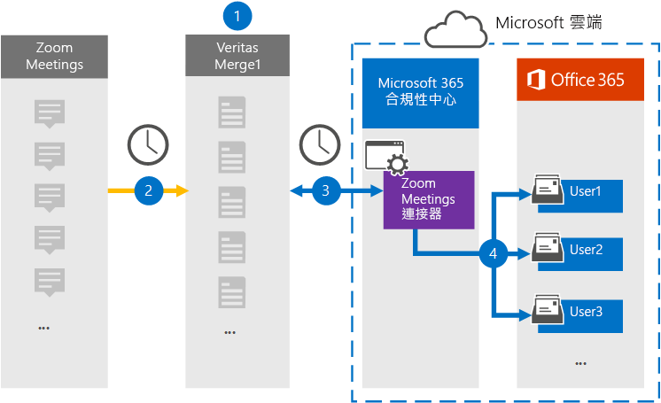

# 設定連接器以封存縮放會議資料

使用 Microsoft 365 規範中心內的 Globanet 連接器，將資料從縮放會議匯入至您的 Microsoft 365 組織中的使用者信箱。 Globanet 提供的 [縮放會議](https://globanet.com/zoom/) 連接器會設定為定期從協力廠商資料來源捕獲專案 () 並將這些專案匯入至 Microsoft 365。 連接器會將會議的內容， (包括聊天、錄製的檔案，以及從「縮放會議」帳戶) 的中繼資料轉換為電子郵件訊息格式，然後再將這些專案匯入 Microsoft 365 中的使用者信箱。

在縮放會議資料儲存在使用者信箱中之後，您可以套用 Microsoft 365 合規性功能，例如訴訟暫止、eDiscovery、保留原則和保留標籤，以及通訊法規遵從性。 在 Microsoft 365 中使用「縮放會議連接器」匯入和封存資料，可協助您的組織遵守政府和法規原則。

## 封存縮放會議資料的概述

下列概要說明如何使用連接器封存 Microsoft 365 中的「縮放會議」資料。

1. 您的組織與「縮放會議」搭配設定和設定縮放會議網站。

2. 每24小時一次，來自縮放會議的會議專案會複製到 Globanet Merge1 網站。 連接線也會將會議內容轉換為電子郵件訊息格式。

3. 您在 Microsoft 365 規範中心建立的「縮放會議」連接器，會每天連線到 Globanet Merge1，並將會議郵件傳送至 Microsoft 雲端中的安全 Azure 存放位置。

4. 連接器會使用 *電子郵件* 屬性和自動使用者對應的值，將已轉換的會議專案匯入到特定使用者的信箱，如步驟3所述。 在使用者信箱中建立名為「 **縮放會議** 」的 [收件匣] 資料夾中的新子資料夾，並將會議專案匯入該資料夾。 連接器會使用 *Email* 屬性的值來執行此動作。 每個會議專案都包含此屬性，其會填入會議每個參與者的電子郵件地址。

## 在您開始之前

- 為 Microsoft connector 建立 Globanet Merge1 帳戶。 若要建立此帳戶，請與 [Globanet 客戶支援](https://globanet.com/ms-connectors-contact)人員聯繫。 當您在步驟1中建立連接器時，您會登入此帳戶。

- 取得組織的「縮放商務」或「縮放企業」企業帳戶的使用者名稱和密碼。 當您設定縮放會議連接器時，您必須在步驟2中登入此帳戶。

- 在 [縮放 Marketplace](https://marketplace.zoom.us)中建立下列應用程式：

  - OAuth 應用程式

  - JWT 應用程式

  在您建立這些應用程式之後，縮放平臺會產生一組唯一的認證，用以產生權杖。 當連接至縮放帳戶時，會使用這些權杖來驗證連接器，並將專案複製到 Merge1 網站。 當您在步驟2中設定縮放連接器時，您將會使用這些標記。

  如需如何建立 OAuth 和 JWT 應用程式的逐步指示，請參閱 [Merge1 Third-Party 連接器 User Guide](https://docs.ms.merge1.globanetportal.com/Merge1%20Third-Party%20Connectors%20Zoom%20Meetings%20User%20Guide%20.pdf)。

- 在步驟1中建立縮放會議連接器的使用者 (，並在步驟 3) 中完成，必須將其指派給 Exchange Online 中的信箱匯入匯出角色。 在 Microsoft 365 規範中心的 [ **資料連線器** ] 頁面上新增連接器時，此角色是必要的。 根據預設，此角色不會指派給 Exchange Online 中的角色群組。 您可以將信箱匯入匯出角色新增至 Exchange Online 中的「組織管理」角色群組。 或者，您可以建立角色群組、指派信箱匯入匯出角色，然後將適當的使用者新增為成員。 如需詳細資訊，請參閱「管理 Exchange Online 中的角色群組」一文中的 [ [建立角色群組](https://docs.microsoft.com/Exchange/permissions-exo/role-groups#create-role-groups) 或 [修改角色群組](https://docs.microsoft.com/Exchange/permissions-exo/role-groups#modify-role-groups) ] 區段。

## 步驟1：設定縮放會議連接器

第一步是存取 Microsoft 365 規範中心內的 **資料連線器** ，並建立縮放會議連接器。

1. 移至 [https://compliance.microsoft.com](https://compliance.microsoft.com/) ，然後按一下 [ **資料連線線**  >  **縮放會議** ]。

2. 在 [ **縮放會議** 產品描述] 頁面上，按一下 [ **新增連接器** ]。

3. 在 [ **服務條款** ] 頁面上，按一下 [ **接受** ]。

4. 輸入識別連接器的唯一名稱，然後按 **[下一步]** 。

5. 登入您的 Merge1 帳戶以設定連接器。

## 步驟2：設定縮放會議連接器

第二個步驟是在 Merge1 網站上設定縮放會議連接器。 如需如何在 Globanet Merge1 網站上設定縮放會議連接器的詳細資訊，請參閱 [Merge1 Third-Party Connector User Guide](https://docs.ms.merge1.globanetportal.com/Merge1%20Third-Party%20Connectors%20Zoom%20Meetings%20User%20Guide%20.pdf)。

按一下 **[儲存] & 完成** 之後，就會顯示 Microsoft 365 規範中心內 [連接器] 嚮導中的 [ **使用者對應** ] 頁面。

## 步驟3：對應使用者並完成連接器設定

1. 在 [將 **外部使用者對應至 Microsoft 365 使用者** ] 頁面上，啟用自動使用者對應。

   [縮放會議專案] 包含稱為「 *電子郵件* 」的屬性，其中包含組織中使用者的電子郵件地址。 如果連接器可以將此位址與 Microsoft 365 使用者產生關聯，這些專案就會匯入到該使用者的信箱中。

2. 在 [系統 **管理員同意** ] 頁面上，按一下 [ **提供同意** ]。 您將會重新導向至 Microsoft 網站。 按一下 [ **接受** ] 以提供同意。
  
   您的組織必須同意允許 Office 365 匯入服務存取您組織中的信箱資料。 若要提供系統管理員同意，您必須使用 Microsoft 365 全域管理員的認證登入，然後接受同意要求。 如果您未以全域系統管理員身分登入，您可以移至 [此頁面](https://login.microsoftonline.com/common/oauth2/authorize?client_id=570d0bec-d001-4c4e-985e-3ab17fdc3073&response_type=code&redirect_uri=https://portal.azure.com/&nonce=1234&prompt=admin_consent) ，並使用全域系統管理員認證登入，以接受要求。

3. 按 **[下一步]** ，複查您的設定，然後移至 [ **資料連線器** ] 頁面，以查看新連接器的匯入程式的進度。

## 步驟4：監視縮放會議連接器

在您建立縮放會議連接器之後，您可以在 Microsoft 365 規範中心中查看連接器狀態。

1. 移至 [https://compliance.microsoft.com](https://compliance.microsoft.com) 並按一下左側導覽中的 [ **資料連線器** ]。

2. 按一下 [ **連接器** ] 索引標籤，然後選取 [ **縮放會議** ] 連接器以顯示飛出頁面。 此頁面包含連接器的屬性和資訊。

3. 在 [ **連接器狀態與來源** ] 底下，按一下 [ **下載記錄** ] 連結，以開啟連接器的狀態記錄 (或儲存) 。 此記錄檔包含已匯入至 Microsoft 雲端之資料的相關資訊。

## 已知問題

- 此時，我們不支援匯入大於 10 MB 的附件或專案。 稍後將提供對較大專案的支援。

- 若要使縮放會議連接器能夠運作，您必須在設定縮放會議時啟用錄製。
