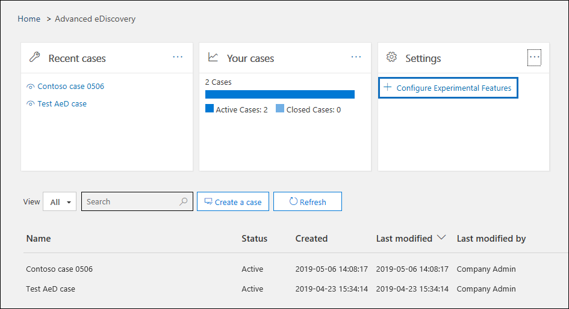

# 在高级电子数据展示中设置律师-客户权限检测

任何电子数据展示流程的审查阶段的一个主要且成本高昂的方面是检查文档是否具有特权内容。 高级电子数据展示提供基于机器学习的特权内容检测，使此过程更高效。 此功能称为*律师-客户权限检测。*

> [!NOTE]
> 您必须选择加入律师-客户权限检测模型，然后才能使用它。 有关说明，请参阅[步骤 1。](#step-1-opt-in-to-attorney-client-privilege-detection)

## 它如何運作？

启用律师-客户权限检测后，在分析审阅集中[的数据](analyzing-data-in-review-set.md)时，评审集中的所有文档将由律师-客户权限检测模型处理。 该模型查找两件事：

- 特权内容 – 模型使用机器学习来确定文档包含本质上合法内容的可能性。

- 参与者 – 作为设置律师-客户权限检测的一部分，您必须为您的组织提交律师列表。 然后，模型将文档的参与者与律师列表进行比较，以确定文档是否至少有一个律师参与者。

模型为每个文档生成以下三个属性：

- **律师客户特权分数**– 文档可能是合法的;分数的值介于**0**和**1**之间。

- **HasAttorney** = 如果律师列表中列出了文档参与者之一，则此属性设置为 true;如果其中一个文档参与者列在律师列表中，则此属性设置为**true。** 否则该值**为 false。** 如果您的组织未上载律师列表，则该值也会设置为**false。**

- **IsPrivilege** – 如果**律师客户端特权分数**的值高于阈*值，或者如果*文档有律师参与者，则此属性设置为**true;** 否则，该值设置为**false。**

这些属性（及其相应的值）将添加到审阅集中的文档的文件元数据中，如以下屏幕截图所示：

这三个属性也可在审阅集中搜索。 有关详细信息，请参阅[查询审阅集中的数据。](review-set-search.md)

## 设置律师-当事人权限检测模型

要启用律师-客户权限检测模型，您的组织必须选择加入，然后上载律师列表。

### 第 1 步：选择加入律师-客户权限检测

如前所述，律师-客户权限检测模型处于预览状态。 因此，您的组织电子数据展示管理员（电子数据展示管理器角色组中电子数据展示管理员子组的成员）必须选择加入，以使模型在高级电子数据展示案例中可用。

1. 在安全&合规中心，转到**高级电子数据>电子数据展示**。

2. 在"**高级电子数据展示"** 主页上，**在"设置"** 磁贴中，**单击"配置实验功能"。**

   

3. 在"**实验功能"** 选项卡上，**单击"管理律师-客户权限设置"。**

4. 在"**律师-客户权限**弹出窗口"页上，单击"切换"以打开该功能，然后单击"**保存"。**

### 第 2 步：上传律师列表（可选）

为了充分利用律师-客户权限检测模型并使用前面**描述的"有律师"** 或"**潜在特权"** 检测的结果，我们建议您上传为您的组织工作的律师和法律人员。 

要上传律师列表供律师-客户权限检测模型使用，请执行以下消息：

1. 创建 .csv 文件（不带标题行），并在单独的行上为每个适当的人员添加电子邮件地址。 将此文件保存到本地计算机。

2. 在"**高级电子数据展示"** 主页上，**在"设置"** 磁贴中，**单击"配置实验功能"，****然后单击"管理律师-客户权限设置"。**

   **将显示"律师-客户"权限**页，并**打开"律师-客户"权限检测**切换。

   

3. **单击"浏览"，** 然后查找并选择在步骤 1 中创建的 .csv 文件。

4. **单击"保存"** 以上载律师列表。

## 使用律师-当事人权限检测模型

按照本节中的步骤，对审阅集中的文档使用律师-客户权限检测。

### 第 1 步：使用律师-客户权限检测模型创建智能标记组

在审核过程中查看律师-客户权限检测结果的主要方法之一是使用智能标记组。 智能标记组指示律师-客户端权限检测的结果，并在智能标记组中的标记旁边排队显示结果。 这使您可以在文档审阅期间快速识别潜在的特权文档。 此外，您还可以使用智能标记组中的标记将文档标记为特权或非特权文档。 有关智能标记的详细信息，请参阅[在高级电子数据展示 中设置智能标记。](smart-tags.md)

1. 在包含您在步骤 1 中分析的文档的审阅集中，**单击"管理审阅集"，** 然后单击"**管理标记"。**
 
2. **在"标记"** 下，**单击"添加组"** 旁边的下拉，**然后单击"添加智能标记组"。**

   

3. 在"**为智能标记选择模型"** 页上，单击"选择**律师-客户权限"** 旁边的"**选择"。**

   将显示一**个名为"律师-客户特权"** 的标签组。 它包含两**个名为"正"** 和"**负"** 的子标记，它们对应于模型可能产生的结果。

   

3. 根据需要重命名标记组和标记，以便进行审阅。 例如，**您可以将"正"** 重命名**为"特权"，****将"否定"** 重命名**为"非特权"。**

### 第 2 步：分析审核集

当您分析审阅集中的文档时，律师-客户权限检测模型也将运行，相应的属性（[在"如何工作？？"](#how-does-it-work)中描述）将添加到审阅集中的每个文档中。 有关分析审阅集中的数据的详细信息，请参阅[在高级电子数据展示 中分析审阅集中的数据。](analyzing-data-in-review-set.md)

### 第 3 步：使用智能标记组查看特权内容

在分析审阅集并设置智能标记后，下一步是查看文档。 如果模型已确定文档具有潜在特权，则**标记面板**中的相应智能标记将指示律师-客户权限检测产生的以下结果：

- 如果文档的内容可能是合法的，则**标签"法律内容"** 将显示在相应的智能标记旁边（在这种情况下，这是默认**的"正"** 标记）。

- 如果文档的参与者在组织的律师列表中找到，则**标签"律师"** 将显示在相应的智能标记旁边（在这种情况下，该标记也是默认**的"正"** 标记）。

- 如果文档的内容可能具有法律性质，*并且*在律师列表中找到了参与者，则**将显示"法律内容和****律师"** 标签。 

如果模型确定文档不包含合法内容或不包含律师列表中的参与者，则标记面板中不会显示这两个标签。

例如，以下屏幕截图显示了两个文档;第一个包含具有法律性质的内容，并在律师名单中找到参与者;第二个不包含，因此不显示任何标签。

查看文档以查看文档是否包含特权内容后，可以使用相应的标记标记文档。