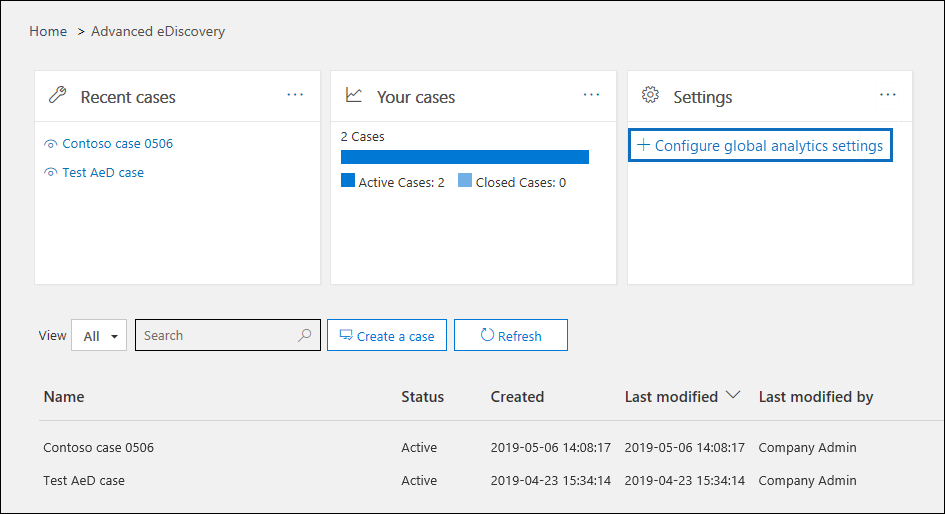
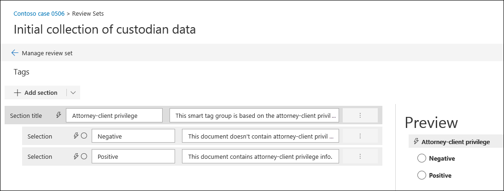

# 在 Advanced eDiscovery 中設定律師-用戶端許可權偵測

任何 eDiscovery 程式的「檢查」階段中，主要和昂貴的層面都是查看檔中的許可權內容。 Advanced eDiscovery 提供許可權內容的機器教學型偵測，使此程式更有效率。 這項功能稱為「 *律師-用戶端許可權偵測*」。

## 它如何運作？

當已啟用律師-用戶端許可權偵測時，當您分析審閱集中 [的資料](analyzing-data-in-review-set.md) 時，律師-用戶端許可權偵測模型會處理所有審閱集中的檔。 模型會尋找兩件事：

- 許可權內容–該模型使用電腦學習，判斷檔中包含法律性質內容的可能性。

- 參與者–在設定律師-用戶端許可權偵測時，您必須提交組織的律師清單。 然後，此模型會比較文件的參與者與律師清單，以判斷文件是否有至少一位律師參與者。

模型產生每個檔的下列三個屬性：

- **AttorneyClientPrivilegeScore：** 檔本質上為法律檔的可能性。分數的值介於 **0** 與 **1** 之間。

- **HasAttorney：** 如果其中一位檔參與者已列在律師清單中，則此屬性會設為 **true** ;否則值為 **false**。 如果組織未上傳律師清單，此值也會設定為 **false**。

- **IsPrivilege：** 如果 **AttorneyClientPrivilegeScore** 的值高於臨界值 *或* 檔有律師人員，則此屬性會設為 **true** 。否則，此值會設為 **false**。

這些屬性 (及其對應值) 會新增至審閱集內檔的檔案中繼資料中，如下列螢幕擷取畫面所示：

這三個屬性也可在審閱集中搜尋。 如需詳細資訊，請參閱 [查詢評審集中的資料](review-set-search.md)。

## 設定律師-用戶端許可權偵測模型

若要啟用律師-用戶端許可權偵測模型，您的組織必須將其開啟，然後上傳律師清單。

### 步驟1：開啟律師-用戶端許可權偵測

您組織中的 ediscovery 系統管理員的人員 (ediscovery 管理員角色群組中的 ediscovery 管理員子群組成員) 必須讓模型能夠在您的 Advanced eDiscovery 案例中使用。

1. 在 [安全性 & 規範中心] 中，移至 [ **eDiscovery > Advanced eDiscovery**]。

2. 在 [ **Advanced eDiscovery** ] 首頁上，按一下 [**設定**] 方塊中的 [**設定全域分析設定**]。

   

3. 在 [ **分析設定** ] 索引標籤上，選取 [ **管理律師-用戶端許可權] 設定**。

4. 在 [律師與當事人通訊保密特權]**** 飛出視窗頁面上，使用切換開關來開啟該功能，然後選取 ****[儲存]。

### 步驟2： Upload 律師清單 (選用) 

若要充分利用律師-用戶端許可權偵測模型，並使用先前所 **述的律師或** 可能的 **特權** 偵測，我們建議您針對您的組織運作的律師和法務人員，上傳電子郵件地址清單。 

若要上傳律師清單以供律師-用戶端許可權偵測模型使用：

1. 建立 .csv 檔案 (不含標題列)，並在不同行新增每個適當人員的電子郵件地址。將這個檔案儲存到您的本機電腦。

2. 在 [ **Advanced eDiscovery** ] 首頁的 [**設定**] 方塊中，選取 [**設定實驗功能**]，然後選取 [**管理律師-用戶端許可權] 設定**。

   隨即會顯示 [ **律師-用戶端許可權** ] 頁面，且已開啟「 **律師-用戶端」許可權偵測** 切換功能。

   

3. 選取 **[流覽]** ，然後尋找並選取您在步驟1中建立的 .csv 檔案。

4. 選取 [ **儲存** ] 以上傳律師清單。

## 使用律師-用戶端許可權偵測模型

請遵循本節中的步驟，針對審閱集中的檔使用律師-用戶端許可權偵測。

### 步驟1：使用律師-用戶端許可權偵測模型建立智慧標籤群組

在檢閱過程中查看律師與當事人通訊保密特權偵測結果的主要方法之一，就是使用智慧標籤群組。 智慧標籤群組會指出律師與當事人通訊保密特權偵測的結果，並在智慧標籤群組中的標籤旁邊並排顯示結果。 這可讓您在檔檢查期間快速識別可能的許可權檔。 此外，您也可以使用智慧標籤群組中的標籤，將文件標記為有通訊保密特權或沒有通訊保密特權。 如需智慧標籤的詳細資訊，請參閱[在 Advanced eDiscovery 中設定智慧標籤](smart-tags.md)。

1. 在包含您在步驟1中分析的檔的 [檢查] 集中，選取 [ **管理複查集** ]，然後選取 [ **管理標記**]。
 
2. 在 [ **標記**] 底下，選取 [ **新增群組** ] 旁邊的下拉式清單，然後選取 [ **新增智慧標籤群組**]。

   

3. 在 [**選擇智慧標籤的模型**] 頁面上，選擇 [按 **律師-用戶端許可權**] 旁的 [**選取**]。

   隨即會顯示名為「 **律師-用戶端許可權** 的標籤群組。 它包含兩個子標記，其名稱為 **正值** 和 **負值**，對應于模型所產生的可能結果。

   

3. 請視需要重新命名標記群組和標記。 例如，您可以將 **肯定** 重新命名為 **特權** ，將 **負數** 重新命名為 **無許可權**。

### 步驟2：分析複查集

當您分析審閱集中的檔時，也會執行律師-用戶端許可權偵測模型，並在 [其運作方式](#how-does-it-work) 中 (所述的對應屬性，將會新增至審閱集合中的每個檔。 如需分析「複查集」中資料的詳細資訊，請參閱[在 Advanced eDiscovery 中分析複查集中的資料](analyzing-data-in-review-set.md)。

### 步驟3：使用智慧標籤群組檢查許可權內容

分析複查集和設定智慧標籤之後，下一步是審閱檔。 如果模型決定檔有潛在的許可權，則 [ **標記] 面板** 中對應的智慧標籤會指出由律師-用戶端許可權偵測所產生的下列結果：

- 如果檔中的內容可能是合法的，則標籤的 **法律內容** 會顯示在對應的智慧標籤旁邊 (此例中的預設 **正值** 標記) 。

- 如果檔有在您組織的律師清單中找到的參與者，則標籤 **律師** 會顯示在對應的智慧標籤旁邊 (此例也是預設的 **正** 標籤) 。

- 如果檔中的內容可能是合法的 *，且* 在律師清單中找到了參與者，則會顯示 **法律內容**  和 **律師** 標籤。 

如果模型決定檔不包含擁有法律性質的內容，或是未包含律師清單中的參與者，則 [標記] 面板中不會顯示任何標籤。

例如，下列螢幕擷取畫面顯示兩份檔。 第一個會包含有法律性質的內容，且具有在律師清單中找到的參與者。 第二個包含不會顯示任何標籤，因此不會顯示任何標籤。

檢查檔是否包含許可權內容之後，您可以使用適當的標記來標記檔。
