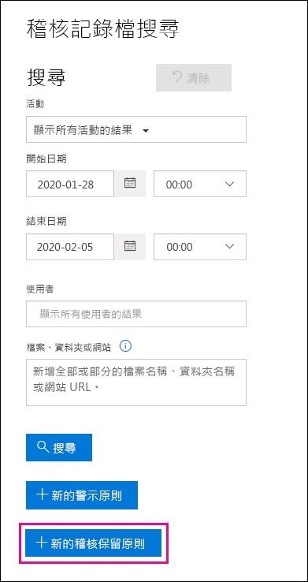
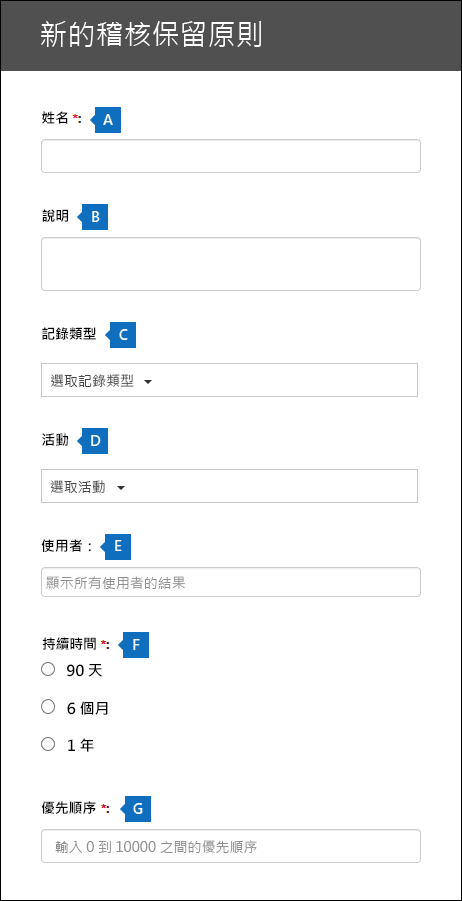

# <a name="manage-audit-log-retention-policies"></a><span data-ttu-id="46127-104">管理稽核記錄保留原則</span><span class="sxs-lookup"><span data-stu-id="46127-104">Manage audit log retention policies</span></span>

<span data-ttu-id="46127-105">您可以在安全性與合規性中心中建立及管理稽核記錄保留原則。</span><span class="sxs-lookup"><span data-stu-id="46127-105">You can create and manage audit log retention policies in the Security & Compliance Center.</span></span> <span data-ttu-id="46127-106">稽核記錄保留原則是 Microsoft 365 中新增的「進階稽核」功能的一部分。</span><span class="sxs-lookup"><span data-stu-id="46127-106">Audit log retention policies are part of the new Advanced Audit capabilities in Microsoft 365.</span></span> <span data-ttu-id="46127-107">稽核記錄保留原則可讓您指定要在組織中保留稽核記錄的時間長度。</span><span class="sxs-lookup"><span data-stu-id="46127-107">An audit log retention policy lets you specify how long to retain audit logs in your organization.</span></span> <span data-ttu-id="46127-108">您最多可以保留稽核記錄達 10 年的時間。</span><span class="sxs-lookup"><span data-stu-id="46127-108">You can retain audit logs for up to 10 years.</span></span> <span data-ttu-id="46127-109">您可以根據下列準則來建立原則：</span><span class="sxs-lookup"><span data-stu-id="46127-109">You can create policies based on the following criteria:</span></span>

- <span data-ttu-id="46127-110">一或多個 Microsoft 365 服務中的所有活動</span><span class="sxs-lookup"><span data-stu-id="46127-110">All activities in one or more Microsoft 365 services</span></span>

- <span data-ttu-id="46127-111">所有使用者或特定使用者執行的特定活動 (Microsoft 365 服務中)</span><span class="sxs-lookup"><span data-stu-id="46127-111">Specific activities (in a Microsoft 365 service) performed by all users or by specific users</span></span>

- <span data-ttu-id="46127-112">優先順序層級，指定若您在組織中有多個原則，要優先處理的原則</span><span class="sxs-lookup"><span data-stu-id="46127-112">A priority level that specifies which policy takes precedence in you have multiple policies in your organization</span></span>

## <a name="default-audit-log-retention-policy"></a><span data-ttu-id="46127-113">預設稽核記錄保留原則</span><span class="sxs-lookup"><span data-stu-id="46127-113">Default audit log retention policy</span></span>

<span data-ttu-id="46127-114">Microsoft 365 中的「進階稽核」可為所有組織提供預設的稽核記錄保留原則。</span><span class="sxs-lookup"><span data-stu-id="46127-114">Advanced Audit in Microsoft 365 provides a default audit log retention policy for all organizations.</span></span> <span data-ttu-id="46127-115">此原則會保留所有 Exchange、SharePoint 和 Azure Active Directory 稽核記錄一年。</span><span class="sxs-lookup"><span data-stu-id="46127-115">This policy retains all Exchange, SharePoint, and Azure Active Directory audit records for one year.</span></span> <span data-ttu-id="46127-116">此預設原則會保留包含 **Workload** 屬性 (這是發生活動所在的服務) 的 **AzureActiveDirectory**、**Exchange**或 **SharePoint** 值的稽核記錄。</span><span class="sxs-lookup"><span data-stu-id="46127-116">This default policy retains audit records that contain the value of **AzureActiveDirectory**, **Exchange**, or **SharePoint** for the **Workload** property (which is the service in which the activity occurred).</span></span> <span data-ttu-id="46127-117">您無法修改預設原則。</span><span class="sxs-lookup"><span data-stu-id="46127-117">The default policy can't be modified.</span></span> <span data-ttu-id="46127-118">如需預設原則中所包含每個工作負載的記錄類型的清單，請參閱本文的[詳細資訊](#more-information)一節。</span><span class="sxs-lookup"><span data-stu-id="46127-118">See the [More information](#more-information) section in this article for a list of record types for each workload that are included in the default policy.</span></span>

> [!NOTE]
> <span data-ttu-id="46127-119">預設的稽核記錄保留原則僅適用獲指派 Office 365 或 Microsoft 365 E5 授權或擁有 Microsoft 365 E5 合規性或 E5 電子文件探索和稽核附加元件授權的使用者所執行活動的稽核記錄。</span><span class="sxs-lookup"><span data-stu-id="46127-119">The default audit log retention policy only applies to audit records for activity performed by users who are assigned an Office 365 or Microsoft 365 E5 license or have a Microsoft 365 E5 Compliance or E5 eDiscovery and Audit add-on license.</span></span> <span data-ttu-id="46127-120">如果組織中有非 E5 使用者，其對應的稽核記錄則會保留 90 天。</span><span class="sxs-lookup"><span data-stu-id="46127-120">If you have non-E5 users in your organization, their corresponding audit records are retained for 90 days.</span></span>

## <a name="before-you-create-an-audit-log-retention-policy"></a><span data-ttu-id="46127-121">在建立稽核記錄保留原則之前</span><span class="sxs-lookup"><span data-stu-id="46127-121">Before you create an audit log retention policy</span></span>

- <span data-ttu-id="46127-122">您必須獲指派安全性與合規性中心中的「組織組態」角色，以才能建立或修改稽核保留原則。</span><span class="sxs-lookup"><span data-stu-id="46127-122">You have to be assigned the Organization Configuration role in the Security & Compliance Center to create or modify an audit retention policy.</span></span>

- <span data-ttu-id="46127-123">您可以在組織中有最多 50 個稽核記錄保留原則。</span><span class="sxs-lookup"><span data-stu-id="46127-123">You can have a maximum of 50 audit log retention policies in your organization.</span></span>

- <span data-ttu-id="46127-124">若要保留稽核記錄超過 90 天，產生稽核記錄的使用者必須獲指派 Office 365 E5 或 Microsoft 365 E5 授權，或擁有 365 Microsoft E5 合規性或 E5 電子化探索與稽核附加元件授權。</span><span class="sxs-lookup"><span data-stu-id="46127-124">To retain an audit log for longer than 90 days, the user who generated the audit log must be assigned an Office 365 E5 or Microsoft 365 E5 license or have a Microsoft 365 E5 Compliance or E5 eDiscovery and Audit add-on license.</span></span>

- <span data-ttu-id="46127-125">所有自訂稽核記錄保留原則 (由您的組織建立) 會優先於預設保留原則。</span><span class="sxs-lookup"><span data-stu-id="46127-125">All custom audit log retention policies (created by your organization) take priority over the default retention policy.</span></span> <span data-ttu-id="46127-126">例如，如果您為具有的保留期間少於一年的建Exchange 信箱活動立稽核記錄保留原則，則 Exchange 信箱活動的稽核記錄將會保留較自訂原則所指定更短的持續時間。</span><span class="sxs-lookup"><span data-stu-id="46127-126">For example, if you create an audit log retention policy for Exchange mailbox activity that has a retention period that's shorter than one year, audit records for Exchange mailbox activities will be retained for the shorter duration specified by the custom policy.</span></span>

## <a name="create-an-audit-log-retention-policy-in-the-compliance-center"></a><span data-ttu-id="46127-127">在合規性中心中建立稽核記錄保留原則</span><span class="sxs-lookup"><span data-stu-id="46127-127">Create an audit log retention policy in the compliance center</span></span>

1. <span data-ttu-id="46127-128">移至 [https://compliance.microsoft.com](https://compliance.microsoft.com)，並使用獲指派安全性與合規性中心中的「組織組態」角色的使用者帳戶登入。</span><span class="sxs-lookup"><span data-stu-id="46127-128">Go to [https://compliance.microsoft.com](https://compliance.microsoft.com) and sign in with user account that's assigned the Organization Configuration role in the Security & Compliance Center.</span></span>

2. <span data-ttu-id="46127-129">在 Microsoft 365 合規性中心的左窗格中，按一下 [顯示全部 **]**，然後按一下 [稽核 **]**。</span><span class="sxs-lookup"><span data-stu-id="46127-129">In the left pane of the Microsoft 365 compliance center, click **Show all**, and then click **Audit**.</span></span>

    <span data-ttu-id="46127-130">[稽核 **]** 頁面隨即顯示。</span><span class="sxs-lookup"><span data-stu-id="46127-130">The **Audit** page is displayed.</span></span>

    

3. <span data-ttu-id="46127-132">按一下 [建立稽核保留原則 **]**，然後在飛出視窗頁面中填寫下列欄位：</span><span class="sxs-lookup"><span data-stu-id="46127-132">Click **Create audit retention policy**, and then complete the following fields on the flyout page:</span></span>

    

   1. <span data-ttu-id="46127-134">**名稱：** 稽核記錄保留原則的名稱。</span><span class="sxs-lookup"><span data-stu-id="46127-134">**Name:** The name of the audit log retention policy.</span></span> <span data-ttu-id="46127-135">此名稱在組織中必須是唯一的。</span><span class="sxs-lookup"><span data-stu-id="46127-135">This name must be unique in your organization.</span></span>

   2. <span data-ttu-id="46127-136">**描述：** 選用，但對於提供原則相關資訊 (例如記錄類型或工作負載)、原則中指定的使用者和持續時間有幫助。</span><span class="sxs-lookup"><span data-stu-id="46127-136">**Description:** Optional, but helpful to provide information about the policy, such as the record type or workload, users specified in the policy, and the duration.</span></span>

   3. <span data-ttu-id="46127-137">**使用者：** 選取一或多個要套用原則的使用者。</span><span class="sxs-lookup"><span data-stu-id="46127-137">**Users:** Select one or more users to apply the policy to.</span></span> <span data-ttu-id="46127-138">如果將此方塊保留空白，則原則會套用至所有使用者。</span><span class="sxs-lookup"><span data-stu-id="46127-138">If you leave this box blank, then the policy will apply to all users.</span></span> <span data-ttu-id="46127-139">如果將 [記錄類型 **]** 保留空白，則必須選取使用者。</span><span class="sxs-lookup"><span data-stu-id="46127-139">If you leave the **Record type** blank, then you must select a user.</span></span>

   4. <span data-ttu-id="46127-140">**記錄類型：** 原則適用的稽核記錄類型。</span><span class="sxs-lookup"><span data-stu-id="46127-140">**Record type:** The audit record type the policy applies to.</span></span> <span data-ttu-id="46127-141">如果將此屬性保留空白，則必須在 [使用者 **]** 方塊中選取使用者。</span><span class="sxs-lookup"><span data-stu-id="46127-141">If you leave this property blank, you must select a user in the **Users** box.</span></span> <span data-ttu-id="46127-142">您可以選取單一記錄類型或多個記錄類型：</span><span class="sxs-lookup"><span data-stu-id="46127-142">You can select a single record type or multiple record types:</span></span>

   - <span data-ttu-id="46127-143">如果您選取單一記錄類型，則會動態顯示 [活動 **]** 欄位。</span><span class="sxs-lookup"><span data-stu-id="46127-143">If you select a single record type, the **Activities** field is dynamically displayed.</span></span> <span data-ttu-id="46127-144">您可以使用下拉式清單從選取的記錄類型中選取活動，以便套用原則。</span><span class="sxs-lookup"><span data-stu-id="46127-144">You can use the drop-down list to select activities from the selected record type to apply the policy to.</span></span> <span data-ttu-id="46127-145">如果您未選擇特定活動，則原則會套用至所選記錄類型的所有活動。</span><span class="sxs-lookup"><span data-stu-id="46127-145">If you don't choose specific activities, the policy will apply to all activities of the selected record type.</span></span>

   - <span data-ttu-id="46127-146">如果您選取多個記錄類型，就無法選取活動。</span><span class="sxs-lookup"><span data-stu-id="46127-146">If you select multiple record types, you don't have the ability to select activities.</span></span> <span data-ttu-id="46127-147">原則會套用至所選記錄類型的所有活動。</span><span class="sxs-lookup"><span data-stu-id="46127-147">The policy will apply to all activities of the selected record types.</span></span>

   5. <span data-ttu-id="46127-148">**持續時間：** 保留符合原則準則之稽核記錄的時間量。</span><span class="sxs-lookup"><span data-stu-id="46127-148">**Duration:** The amount of time to retain the audit logs that meet the criteria of the policy.</span></span>

   6. <span data-ttu-id="46127-149">**優先順序：** 此值會決定組織中稽核記錄保留原則的處理順序。</span><span class="sxs-lookup"><span data-stu-id="46127-149">**Priority:** This value determines the order in which audit log retention policies in your organization are processed.</span></span> <span data-ttu-id="46127-150">較高的值表示優先順序較高。</span><span class="sxs-lookup"><span data-stu-id="46127-150">A higher value indicates a higher priority.</span></span> <span data-ttu-id="46127-151">例如，優先順序值為 **5** 的原則會優先於優先順序值為 **0** 的原則。</span><span class="sxs-lookup"><span data-stu-id="46127-151">For example, a policy with a priority value of **5** would take priority over a policy with a priority value of **0**.</span></span> <span data-ttu-id="46127-152">如先前所述，任何自訂稽核記錄保留原則的優先順序都會高於組織的預設原則。</span><span class="sxs-lookup"><span data-stu-id="46127-152">As previously explained, any custom audit log retention policy takes priority over the default policy for your organization.</span></span>

4. <span data-ttu-id="46127-153">按一下 [儲存]\*\*\*\* 建立新的稽核記錄保留原則。</span><span class="sxs-lookup"><span data-stu-id="46127-153">Click **Save** to create the new audit log retention policy.</span></span>

<span data-ttu-id="46127-154">新的稽核保留原則會列在 [稽核保留原則 **]** 索引標籤上。</span><span class="sxs-lookup"><span data-stu-id="46127-154">The new audit retention policy is listed on the **Audit retention policies** tab.</span></span>

## <a name="create-an-audit-log-retention-policy-in-powershell"></a><span data-ttu-id="46127-155">在 PowerShell 中建立稽核記錄保留原則</span><span class="sxs-lookup"><span data-stu-id="46127-155">Create an audit log retention policy in PowerShell</span></span>

<span data-ttu-id="46127-156">您也可以使用安全性與合規性中心 PowerShell 來建立稽核記錄保留原則。</span><span class="sxs-lookup"><span data-stu-id="46127-156">You can also use Security & Compliance Center PowerShell to create audit log retention policies.</span></span>

1. <span data-ttu-id="46127-157">[連線到安全性與合規性中心 PowerShell](https://docs.microsoft.com/powershell/exchange/connect-to-scc-powershell)。</span><span class="sxs-lookup"><span data-stu-id="46127-157">[Connect to Security & Compliance Center PowerShell](https://docs.microsoft.com/powershell/exchange/connect-to-scc-powershell).</span></span>

2. <span data-ttu-id="46127-158">執行下列命令以建立稽核記錄保留原則。</span><span class="sxs-lookup"><span data-stu-id="46127-158">Run the following command to create an audit log retention policy.</span></span>

   ```powershell
   New-UnifiedAuditLogRetentionPolicy -Name "Microsoft Teams Audit Policy" -Description "One year retention policy for all Microsoft Teams activities" -RecordTypes MicrosoftTeams -RetentionDuration TenYears -Priority 100
   ```

    <span data-ttu-id="46127-159">此範例會建立名為「Microsoft Teams 稽核原則」的稽核記錄保留原則，其中具有這些設定：</span><span class="sxs-lookup"><span data-stu-id="46127-159">This example creates an audit log retention policy named "Microsoft Teams Audit Policy" with these settings:</span></span>

   - <span data-ttu-id="46127-160">原則的描述。</span><span class="sxs-lookup"><span data-stu-id="46127-160">A description of the policy.</span></span>

   - <span data-ttu-id="46127-161">保留所有 Microsoft Teams 活動 (如 *RecordType* 參數所定義)。</span><span class="sxs-lookup"><span data-stu-id="46127-161">Retains all Microsoft Teams activities (as defined by the *RecordType* parameter).</span></span>

   - <span data-ttu-id="46127-162">保留 Microsoft Teams 稽核記錄 10 年。</span><span class="sxs-lookup"><span data-stu-id="46127-162">Retains Microsoft Teams audit logs for 10 years.</span></span>

   - <span data-ttu-id="46127-163">優先順序為 100。</span><span class="sxs-lookup"><span data-stu-id="46127-163">A priority of 100.</span></span>

<span data-ttu-id="46127-164">以下是建立稽核記錄保留原則的另一個範例。</span><span class="sxs-lookup"><span data-stu-id="46127-164">Here's another example of creating an audit log retention policy.</span></span> <span data-ttu-id="46127-165">此原則會保留使用者 admin@contoso.onmicrosoft.com 的「使用者已登入」活動稽核記錄六個月。</span><span class="sxs-lookup"><span data-stu-id="46127-165">This policy retains audit logs for the "User logged in" activity for six months for the user admin@contoso.onmicrosoft.com.</span></span>

```powershell
New-UnifiedAuditLogRetentionPolicy -Name "SixMonth retention for admin logons" -RecordTypes AzureActiveDirectoryStsLogon -Operations UserLoggedIn -UserIds admin@contoso.onmicrosoft.com -RetentionDuration SixMonths -Priority 25
```

<span data-ttu-id="46127-166">如需詳細資訊，請參閱 [New-UnifiedAuditLogRetentionPolicy](https://docs.microsoft.com/powershell/module/exchange/new-unifiedauditlogretentionpolicy)。</span><span class="sxs-lookup"><span data-stu-id="46127-166">For more information, see [New-UnifiedAuditLogRetentionPolicy](https://docs.microsoft.com/powershell/module/exchange/new-unifiedauditlogretentionpolicy).</span></span>

## <a name="view-audit-log-retention-policies"></a><span data-ttu-id="46127-167">檢視稽核記錄保留原則</span><span class="sxs-lookup"><span data-stu-id="46127-167">View audit log retention policies</span></span>

<span data-ttu-id="46127-168">此時，要檢視自訂稽核記錄保留原則的唯一方法，就是在安全性與合規性中心 PowerShell 中使用 **Get-UnifiedAuditRetentionPolicy** Cmdlet。</span><span class="sxs-lookup"><span data-stu-id="46127-168">At this time, the only way to view custom audit log retention policies is to use the **Get-UnifiedAuditRetentionPolicy** cmdlet in Security & Compliance Center PowerShell.</span></span> <span data-ttu-id="46127-169">以下的範例命令可用來顯示組織中稽核記錄保留原則設定 (您在上一個步驟中所設定)。</span><span class="sxs-lookup"><span data-stu-id="46127-169">Here's a sample command to display the settings (that you configured in the previous step) for the audit log retention policies in your organization.</span></span> <span data-ttu-id="46127-170">此命令會將原則的優先順序從最高到最低排序。</span><span class="sxs-lookup"><span data-stu-id="46127-170">This command sorts the policies from the highest to lowest priority.</span></span>

```powershell
Get-UnifiedAuditLogRetentionPolicy | Sort-Object -Property Priority -Descending | FL Priority,Name,Description,RecordTypes,Operations,UserIds,RetentionDuration
```

> [!NOTE]
> <span data-ttu-id="46127-171">此時，**Get-UnifiedAuditLogRetentionPolicy** Cmdlet 不會傳回組織的預設稽核記錄原則。</span><span class="sxs-lookup"><span data-stu-id="46127-171">At this time, the **Get-UnifiedAuditLogRetentionPolicy** cmdlet doesn't return the default audit log policy for your organization.</span></span>

<span data-ttu-id="46127-172">如需詳細資訊，請參閱 [Get-UnifiedAuditLogRetentionPolicy](https://docs.microsoft.com/powershell/module/exchange/get-unifiedauditlogretentionpolicy)。</span><span class="sxs-lookup"><span data-stu-id="46127-172">For more information, see [Get-UnifiedAuditLogRetentionPolicy](https://docs.microsoft.com/powershell/module/exchange/get-unifiedauditlogretentionpolicy).</span></span>

## <a name="more-information"></a><span data-ttu-id="46127-173">詳細資訊</span><span class="sxs-lookup"><span data-stu-id="46127-173">More information</span></span>

- <span data-ttu-id="46127-174">在安全性與合規性中心 PowerShell 中使用 **Set-UnifiedAuditLogRetentionPolicy** Cmdlet 來修改現有的稽核記錄保留原則。</span><span class="sxs-lookup"><span data-stu-id="46127-174">Use the **Set-UnifiedAuditLogRetentionPolicy** cmdlet in Security & Compliance Center PowerShell to modify an existing audit log retention policy.</span></span> <span data-ttu-id="46127-175">如需詳細資訊，請參閱 [Set-UnifiedAuditLogRetentionPolicy](https://docs.microsoft.com/powershell/module/exchange/set-unifiedauditlogretentionpolicy)。</span><span class="sxs-lookup"><span data-stu-id="46127-175">For more information, see [Set-UnifiedAuditLogRetentionPolicy](https://docs.microsoft.com/powershell/module/exchange/set-unifiedauditlogretentionpolicy).</span></span>

- <span data-ttu-id="46127-176">在安全性與合規性中心 PowerShell 中使用 **Remove-UnifiedAuditLogRetentionPolicy** Cmdlet 來刪除稽核記錄保留原則。</span><span class="sxs-lookup"><span data-stu-id="46127-176">Use the **Remove-UnifiedAuditLogRetentionPolicy** cmdlet in Security & Compliance Center PowerShell to delete an audit log retention policy.</span></span> <span data-ttu-id="46127-177">移除原則可能需要多達 30 分鐘的時間。</span><span class="sxs-lookup"><span data-stu-id="46127-177">It might take up to 30 minutes for the policy to be removed.</span></span> <span data-ttu-id="46127-178">如需詳細資訊，請參閱 [Remove-UnifiedAuditLogRetentionPolicy](https://docs.microsoft.com/powershell/module/exchange/remove-unifiedauditlogretentionpolicy)。</span><span class="sxs-lookup"><span data-stu-id="46127-178">For more information, see [Remove-UnifiedAuditLogRetentionPolicy](https://docs.microsoft.com/powershell/module/exchange/remove-unifiedauditlogretentionpolicy).</span></span>

- <span data-ttu-id="46127-179">如先前所述，Azure Active Directory、Exchange 和 SharePoint 中的作業稽核記錄會保留一年。</span><span class="sxs-lookup"><span data-stu-id="46127-179">As previously stated, audit records for operations in Azure Active Directory, Exchange, and SharePoint are retained for one year.</span></span> <span data-ttu-id="46127-180">下表列出預設稽核記錄保留原則中(針對各項服務)所包含的所有記錄類型。</span><span class="sxs-lookup"><span data-stu-id="46127-180">The following table lists all the record types (for each of these services) included in the default audit log retention policy.</span></span> <span data-ttu-id="46127-181">這表示具有此記錄類型的稽核記錄將保留一年，除非特定記錄類型、作業或使用者的自訂稽核記錄保留原則具有優先順序。</span><span class="sxs-lookup"><span data-stu-id="46127-181">This means that audit logs for any operation with this record type are retained for one year unless a custom audit log retention policy takes precedence for a specific record type, operation, or user.</span></span> <span data-ttu-id="46127-182">每種記錄類型的 Enum 值 (在稽核記錄中顯示為 RecordType 屬性的值) 會顯示在括弧中。</span><span class="sxs-lookup"><span data-stu-id="46127-182">The Enum value (which is displayed as the value for the RecordType property in an audit record) for each record type is shown in parentheses.</span></span>

   |<span data-ttu-id="46127-183">AzureActiveDirectory</span><span class="sxs-lookup"><span data-stu-id="46127-183">AzureActiveDirectory</span></span> |<span data-ttu-id="46127-184">Exchange</span><span class="sxs-lookup"><span data-stu-id="46127-184">Exchange</span></span>  |<span data-ttu-id="46127-185">SharePoint</span><span class="sxs-lookup"><span data-stu-id="46127-185">SharePoint</span></span>|
   |:---------|:---------|:---------|
   |<span data-ttu-id="46127-186">AzureActiveDirectory (8)</span><span class="sxs-lookup"><span data-stu-id="46127-186">AzureActiveDirectory (8)</span></span>|<span data-ttu-id="46127-187">ExchangeAdmin (1)</span><span class="sxs-lookup"><span data-stu-id="46127-187">ExchangeAdmin (1)</span></span>|<span data-ttu-id="46127-188">ComplianceDLPSharePoint (11)</span><span class="sxs-lookup"><span data-stu-id="46127-188">ComplianceDLPSharePoint (11)</span></span>|
   |<span data-ttu-id="46127-189">AzureActiveDirectoryAccountLogon (9)</span><span class="sxs-lookup"><span data-stu-id="46127-189">AzureActiveDirectoryAccountLogon (9)</span></span>|<span data-ttu-id="46127-190">ExchangeItem (2)</span><span class="sxs-lookup"><span data-stu-id="46127-190">ExchangeItem (2)</span></span>|<span data-ttu-id="46127-191">ComplianceDLPSharePointClassification (33)</span><span class="sxs-lookup"><span data-stu-id="46127-191">ComplianceDLPSharePointClassification (33)</span></span>|
   |<span data-ttu-id="46127-192">AzureActiveDirectoryStsLogon (15)</span><span class="sxs-lookup"><span data-stu-id="46127-192">AzureActiveDirectoryStsLogon (15)</span></span>|<span data-ttu-id="46127-193">行銷活動 (62)</span><span class="sxs-lookup"><span data-stu-id="46127-193">Campaign (62)</span></span>|<span data-ttu-id="46127-194">Project (35)</span><span class="sxs-lookup"><span data-stu-id="46127-194">Project (35)</span></span>|
   ||<span data-ttu-id="46127-195">ComplianceDLPExchange (13)</span><span class="sxs-lookup"><span data-stu-id="46127-195">ComplianceDLPExchange (13)</span></span>|<span data-ttu-id="46127-196">SharePoint (4)</span><span class="sxs-lookup"><span data-stu-id="46127-196">SharePoint (4)</span></span>|
   ||<span data-ttu-id="46127-197">ComplianceSupervisionExchange (68)</span><span class="sxs-lookup"><span data-stu-id="46127-197">ComplianceSupervisionExchange (68)</span></span>|<span data-ttu-id="46127-198">SharePointCommentOperation (37)</span><span class="sxs-lookup"><span data-stu-id="46127-198">SharePointCommentOperation (37)</span></span>|
   ||<span data-ttu-id="46127-199">CustomerKeyServiceEncryption (69)</span><span class="sxs-lookup"><span data-stu-id="46127-199">CustomerKeyServiceEncryption (69)</span></span>|<span data-ttu-id="46127-200">SharePointContentTypeOperation (55)</span><span class="sxs-lookup"><span data-stu-id="46127-200">SharePointContentTypeOperation (55)</span></span>|
   ||<span data-ttu-id="46127-201">ExchangeAggregatedOperation (19)</span><span class="sxs-lookup"><span data-stu-id="46127-201">ExchangeAggregatedOperation (19)</span></span>|<span data-ttu-id="46127-202">SharePointFieldOperation (56)</span><span class="sxs-lookup"><span data-stu-id="46127-202">SharePointFieldOperation (56)</span></span>|
   ||<span data-ttu-id="46127-203">ExchangeItemAggregated (50)</span><span class="sxs-lookup"><span data-stu-id="46127-203">ExchangeItemAggregated (50)</span></span>|<span data-ttu-id="46127-204">SharePointFileOperation (6)</span><span class="sxs-lookup"><span data-stu-id="46127-204">SharePointFileOperation (6)</span></span>|
   ||<span data-ttu-id="46127-205">ExchangeItemGroup (3)</span><span class="sxs-lookup"><span data-stu-id="46127-205">ExchangeItemGroup (3)</span></span>|<span data-ttu-id="46127-206">SharePointListOperation (36)</span><span class="sxs-lookup"><span data-stu-id="46127-206">SharePointListOperation (36)</span></span>|
   ||<span data-ttu-id="46127-207">InformationBarrierPolicyApplication (53)</span><span class="sxs-lookup"><span data-stu-id="46127-207">InformationBarrierPolicyApplication (53)</span></span>|<span data-ttu-id="46127-208">SharePointSharingOperation (14)</span><span class="sxs-lookup"><span data-stu-id="46127-208">SharePointSharingOperation (14)</span></span>|
   ||||
