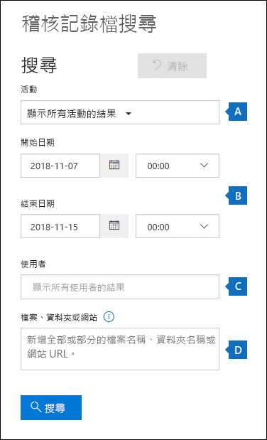

# <a name="search-the-office-365-audit-log-to-troubleshoot-common-scenarios"></a>搜索 Office 365 审核日志以排除常见方案

本文介绍如何使用 Office 365 审核日志搜索工具帮助您解决常见支持方案。 这包括使用审核日志：

- 查找用于访问受入侵帐户的计算机的 IP 地址
- 确定谁为邮箱设置电子邮件转发
- 确定用户是否在其邮箱中删除了电子邮件项目
- 确定用户是否创建了收件箱规则
- 调查组织外部用户成功登录的原因

## <a name="using-the-office-365-audit-log-search-tool"></a>使用 Office 365 审核日志搜索工具

本文中描述的每个故障排除方案都基于使用 Office 365 安全和合规性中心的审核日志搜索工具。 本节列出了搜索审核日志所需的权限，并介绍了访问和运行审核日志搜索的步骤。 每个方案部分提供有关如何配置审核日志搜索查询以及要在审核记录中与搜索条件匹配的详细信息中查找的内容的特定指导。

### <a name="permissions-required-to-use-the-audit-log-search-tool"></a>使用审核日志搜索工具所需的权限

您必须在 Exchange Online 中分配"仅查看审核日志"角色才能搜索 Office 365 审核日志。 默认情况下，这些角色分配给 Exchange 管理中心"**权限"** 页上的"合规性管理和组织管理"角色组。 Office 365 和 Microsoft 365 中的全局管理员将自动添加为 Exchange 联机中的组织管理角色组的成员。 有关详细信息，请参阅[在"联机交换"中管理角色组。](https://go.microsoft.com/fwlink/p/?LinkID=730688)

### <a name="running-audit-log-searches"></a>运行审核日志搜索

本节介绍创建和运行审核日志搜索的基础知识。 使用这些说明作为本文中每个故障排除方案的起点。 有关更详细的分步说明，请参阅[搜索审核日志](search-the-audit-log-in-security-and-compliance.md#step-1-run-an-audit-log-search)。

1. 转到[https://protection.office.com/unifiedauditlog](https://protection.office.com/unifiedauditlog)并使用工作或学校帐户登录。
    
    将显示**审核日志搜索**页。 
    
    
  
4. 您可以配置以下搜索条件。 本文中的每个故障排除方案都建议配置这些字段的特定指南。
    
    a. **活动内容：** 单击下拉列表以显示可以搜索的活动。 运行搜索后，仅显示所选活动的审核记录。 **选择"显示所有活动的结果"** 将显示满足其他搜索条件的所有活动的结果。 在某些故障排除方案中，还必须将此字段留空。
    
    b. **开始日期**和**结束日期：** 选择日期和时间范围以显示该时间段内发生的事件。 默认情况下，将选择最近七天。 日期和时间以协调世界时间 （UTC） 格式显示。 您可以指定的最大日期范围为 90 天。

    c. **用户：** 单击此框，然后选择一个或多个用户来显示搜索结果。 在此框中选择的用户执行的选定活动的审核记录将显示在结果列表中。 将此框留空以返回组织中所有用户（和服务帐户）的条目。
    
    d. **文件、文件夹或站点：** 键入部分或全部文件或文件夹名称以搜索与包含指定关键字的文件夹文件相关的活动。 还可以指定文件或文件夹的 URL。 如果使用 URL，请确保键入完整的 URL 路径，或者仅键入 URL 的一部分，则不要包含任何特殊字符或空格。 将此框留空以返回组织中所有文件和文件夹的条目。 此字段在本文中的所有故障排除方案中留空。
    
5. **单击"搜索"** 以使用搜索条件运行搜索。 
    
    搜索结果将加载，几分钟后，它们**将显示在"审核日志搜索"** 页上**的"结果"** 下。 本文中的每个部分都提供了有关在特定故障排除方案上下文中查找的事项的指导。

    有关查看、筛选或导出审核日志搜索结果的详细信息，请参阅：

    - [查看搜索结果](search-the-audit-log-in-security-and-compliance.md#step-2-view-the-search-results)
    - [筛选搜索结果](search-the-audit-log-in-security-and-compliance.md#step-3-filter-the-search-results)
    - [匯出搜尋結果](search-the-audit-log-in-security-and-compliance.md#step-4-export-the-search-results-to-a-file)

## <a name="find-the-ip-address-of-the-computer-used-to-access-a-compromised-account"></a>查找用于访问受入侵帐户的计算机的 IP 地址

大多数审核记录中都包含与任何用户执行的活动对应的 IP 地址。 有关所使用的客户端的信息也包含在审核记录中。

以下是如何为此方案配置审核日志搜索查询：

**活动内容：** 如果与您的案例相关，请选择要搜索的特定活动。 要排除受攻击的帐户的故障，请考虑**在"Exchange 邮箱活动"** 下**选择"用户登录到邮箱**活动"。 这将返回显示登录到邮箱时使用的 IP 地址的审核记录。 否则，将此字段留空以返回所有活动的审核记录。 

> [!TIP]
> 将此字段留空将返回**UserLoggedIn**活动，这是一个 Azure 活动目录活动，指示有人已登录到 Office 365 用户帐户。 在搜索结果中使用筛选来显示**用户记录记录**审核记录。

**开始日期**和**结束日期：** 选择适用于您的调查的日期范围。

**用户：** 如果您正在调查受攻击的帐户，请选择其帐户已泄露的用户。 这将返回该用户帐户执行的活动的审核记录。

**文件、文件夹或站点：** 将此字段留空。

运行搜索后，每个活动的 IP 地址将显示在搜索结果中的 IP**地址**列中。 单击搜索结果中的记录，在弹出窗口页面上查看更多详细信息。

## <a name="determine-who-set-up-email-forwarding-for-a-mailbox"></a>确定谁为邮箱设置电子邮件转发

为邮箱配置电子邮件转发时，发送到邮箱的电子邮件将转发到另一个邮箱。 消息可以转发给组织内外的用户。 在邮箱上设置电子邮件转发时，使用的基础 Exchange Online cmdlet**是"设置邮箱"。**

以下是如何为此方案配置审核日志搜索查询：

**活动内容：** 将此字段留空，以便搜索返回所有活动的审核记录。 这是返回与**Set-邮箱**cmdlet 相关的任何审核记录所必需的。

**开始日期**和**结束日期：** 选择适用于您的调查的日期范围。

**用户：** 除非您正在调查特定用户的电子邮件转发问题，否则请保留此字段为空。 这有助于您确定是否为任何用户设置了电子邮件转发。

**文件、文件夹或站点：** 将此字段留空。

运行搜索后，单击搜索结果页上**的"筛选结果"。** **在"活动"** 列标题下的框中，**键入"设置邮箱"，** 以便仅显示**与"设置邮箱**cmdlet"相关的审核记录。


此时，您必须查看每个审核记录的详细信息，以确定该活动是否与电子邮件转发相关。 单击审核记录以**显示"详细信息"** 弹出窗口，然后单击"**详细信息"。** 以下屏幕截图和说明突出显示了指示邮箱上已设置电子邮件转发的信息。


a. 在**ObjectId**字段中，将显示设置电子邮件转发的邮箱的别名。 此邮箱也显示在搜索结果**页的"项目"** 列中。

b. 在"**参数"** 字段中，值*转发SmtpAddress*表示邮箱上已设置电子邮件转发。 在此示例中，邮件被转发到电子邮件地址mike@contoso.com，该电子邮件地址位于alpinehouse.onmicrosoft.com组织之外。

c. "*传递邮件邮箱和转发"* 参数*的 True*值指示发送到sarad@alpinehouse.onmicrosoft.com的邮件副本，*并*转发到*转发Smtp地址指定的电子邮件地址*参数，在此示例中mike@contoso.com。 *如果"传递邮箱和转发"* 参数的值设置为*False，* 则电子邮件仅转发到*转发SmtpAddress*参数指定的地址。 它未传递到**ObjectId**字段中指定的邮箱。

d. **UserId**字段指示在**ObjectId**字段中指定的邮箱上设置电子邮件转发的用户。 此用户也显示在搜索结果页上的"**用户"** 列中。 在这种情况下，邮箱的所有者似乎在她的邮箱上设置了电子邮件转发。

如果您确定不应在邮箱上设置电子邮件转发，则可以通过在 Exchange Online PowerShell 中运行以下命令来删除它：

```
Set-Mailbox <mailbox alias> -ForwardingSmtpAddress $null 
```

有关与电子邮件转发相关的参数的详细信息，[请参阅"设置邮箱"](https://docs.microsoft.com/powershell/module/exchange/mailboxes/set-mailbox)一文。

## <a name="determine-if-a-user-deleted-email-items"></a>确定用户是否删除了电子邮件项目

从 2019 年 1 月开始，Microsoft 默认为所有 Office 365 和 Microsoft 组织打开邮箱审核日志记录。 这意味着邮箱所有者执行的某些操作将自动记录，并且当您在邮箱审核日志中搜索相应的邮箱审核记录时，这些操作可用。 默认情况下，在打开邮箱审核之前，您必须手动为组织中的每个用户邮箱启用它。 

默认情况下记录的邮箱操作包括邮箱所有者执行的软删除和硬删除邮箱操作。 这意味着您可以使用以下步骤在审核日志中搜索与已删除的电子邮件项目相关的事件。 有关默认情况下的邮箱审核的详细信息，请参阅[管理邮箱审核](enable-mailbox-auditing.md)。

以下是如何为此方案配置审核日志搜索查询：

**活动内容：****在"交换邮箱活动"** 下，选择以下一项或两项活动：

- **从已删除项目文件夹中删除的邮件：** 此活动对应于**SoftDelete**邮箱审核操作。 当用户通过选择项目并按**Shift_Delete**来永久删除项目时，也会记录此活动。 永久删除项目后，用户可以恢复该项目，直到已删除的项目保留期到期。

- **从邮箱清除的邮件：** 此活动对应于**硬删除**邮箱审核操作。 当用户从"可恢复项目"文件夹中清除项目时，将记录此项。 管理员可以使用安全和合规性中心中的内容搜索工具搜索和恢复已清除的项目，直到已删除的项目保留期到期或延长（如果用户的邮箱处于保留状态）。

**开始日期**和**结束日期：** 选择适用于您的调查的日期范围。

**用户：** 如果在此字段中选择用户，则审核日志搜索工具将返回您指定的用户删除的电子邮件项目的审核记录（软删除或硬删除）。 有时删除电子邮件的用户可能不是邮箱所有者。

**文件、文件夹或站点：** 将此字段留空。

运行搜索后，可以筛选搜索结果以显示软删除项目或硬删除项目的审核记录。 单击审核记录以**显示"详细信息"** 弹出窗口，然后单击"**详细信息"。** 有关已删除项目的其他信息（如主题行和删除项目时的位置）**将显示在"受影响的项目"** 字段中。 以下屏幕截图显示了软删除项目和硬删除项**中的"受影响的项目"** 字段的示例。

**软删除项的受影响项目字段示例**


**硬删除项的"受影响项"字段示例**


### <a name="recover-deleted-email-items"></a>恢复已删除的电子邮件项目

如果已删除的项目保留期尚未过期，用户可以恢复软删除的项目。 在 Exchange Online 中，默认删除的项目保留期为 14 天，但管理员可以将此设置增加到最多 30 天。 将用户指向 Web 上[Outlook 中的"恢复已删除项目"或电子邮件，](https://support.office.com/article/Recover-deleted-items-or-email-in-Outlook-Web-App-C3D8FC15-EEEF-4F1C-81DF-E27964B7EDD4)以说明有关恢复已删除项目的说明。

如前所述，如果已删除的项目保留期尚未过期或邮箱处于保留状态，管理员可能能够恢复硬删除的项目，在这种情况下，项目将保留到保留期限到期。 运行内容搜索时，"可恢复项目"文件夹中的软删除和硬删除项目如果与搜索查询匹配，则在搜索结果中返回。 有关运行内容搜索的详细信息，请参阅[Office 365 中的内容搜索。](content-search.md)

> [!TIP]
> 要搜索已删除的电子邮件项目，请搜索审核记录中"**受影响的项目"** 字段中显示的全部或部分主题行。

## <a name="determine-if-a-user-created-an-inbox-rule"></a>确定用户是否创建了收件箱规则

当用户为其 Exchange Online 邮箱创建收件箱规则时，相应的审核记录将保存到审核日志中。 有关收件箱规则的详细信息，请参阅：

- [在 Web 上的 Outlook 中使用收件箱规则](https://support.office.com/article/use-inbox-rules-in-outlook-on-the-web-8400435c-f14e-4272-9004-1548bb1848f2)
- [使用规则管理 Outlook 中的电子邮件](https://support.office.com/article/Manage-email-messages-by-using-rules-C24F5DEA-9465-4DF4-AD17-A50704D66C59)

以下是如何为此方案配置审核日志搜索查询：

**活动内容：****在"交换邮箱活动"** 下，**选择"新建收件箱规则创建/修改/启用/禁用收件箱规则"。**

**开始日期**和**结束日期：** 选择适用于您的调查的日期范围。

**用户：** 除非您正在调查特定用户，否则请保留此字段为空。 这有助于识别由任何用户设置的新收件箱规则。

**文件、文件夹或站点：** 将此字段留空。

运行搜索后，此活动的任何审核记录都将显示在搜索结果中。 单击审核记录以**显示"详细信息"** 弹出窗口，然后单击"**详细信息"。** 有关收件箱规则设置的信息**将显示在"参数"** 字段中。 以下屏幕截图和说明突出显示有关收件箱规则的信息。


a. 在**ObjectId**字段中，将显示收件箱规则的全名。 此名称包括用户邮箱的别名（例如，SaraD）和收件箱规则的名称（例如，"从管理员移动邮件"）。

b. 在"**参数"** 字段中，将显示收件箱规则的条件。 在此示例中，条件由*From*参数指定。 为*From*参数定义的值指示收件箱规则作用于admin@alpinehouse.onmicrosoft.com发送的电子邮件。 有关可用于定义收件箱规则条件的参数的完整列表，请参阅[新建收件箱规则](https://docs.microsoft.com/powershell/module/exchange/mailboxes/new-inboxrule)一文。

c. *MoveToFolder*参数指定收件箱规则的操作。 在此示例中，从admin@alpinehouse.onmicrosoft.com接收的邮件将移动到名为*AdminSearch*的文件夹。 请参阅[New-收件箱规则](https://docs.microsoft.com/powershell/module/exchange/mailboxes/new-inboxrule)一文，了解可用于定义收件箱规则操作的参数的完整列表。

d. **UserId**字段指示创建**ObjectId**字段中指定的收件箱规则的用户。 此用户也显示在搜索结果页上的"**用户"** 列中。

## <a name="investigate-why-there-was-a-successful-login-by-a-user-outside-your-organization"></a>调查组织外部用户成功登录的原因

在 Office 365 审核日志中查看审核记录时，您可能会看到指示外部用户已通过 Azure 活动目录身份验证并成功登录到组织的记录。 例如，contoso.onmicrosoft.com中的管理员可能会看到审核记录，显示来自不同 Office 365 组织（例如，fabrikam.onmicrosoft.com）的用户已成功登录到contoso.onmicrosoft.com。 同样，您可能会看到指示具有 Microsoft 帐户 （MSA） 的用户（如Outlook.com或Live.com）已成功登录到您的组织的审核记录。 在这些情况下，审核的活动是**用户登录**。 

此行为是设计使然。 Azure 活动目录 （Azure AD）是 Office 365 中的目录服务，当外部用户尝试访问 SharePoint 站点或组织中的 OneDrive 位置时，允许所谓的*传递身份验证。* 当外部用户尝试执行此操作时，系统会提示他们输入其 Office 365 凭据。 Azure AD 使用凭据对用户进行身份验证，这意味着只有 Azure AD 验证用户是否属于他们所说的身份。 审核记录中成功登录的指示是 Azure AD 验证用户的结果。 成功登录并不意味着用户能够访问任何资源或执行组织中的任何其他操作。 它仅指示用户已通过 Azure AD 身份验证。 为了使传递用户访问 SharePoint 或 OneDrive 资源，组织中的用户必须通过向外部用户发送共享邀请或匿名共享链接来显式与外部用户共享资源。 

> [!NOTE]
> Azure AD 仅允许*第一方应用程序（* 如 SharePoint Online 和一个业务版）进行传递身份验证。 其他第三方应用程序不允许使用。

下面是用户**记录**中的审核记录中相关属性的示例和说明，该事件是传递身份验证的结果。 单击审核记录以**显示"详细信息"** 弹出窗口，然后单击"**详细信息"。**


   a. 此字段指示在组织的 Azure AD 中找不到尝试访问组织中的资源的用户。

   b. 此字段显示尝试访问组织中资源的外部用户的 UPN。 此用户 ID 也标识在审核记录中**的"用户"****和"用户 Id"** 属性中。

   c. **应用程序Id**属性标识触发登录请求的应用程序。 在此审核记录中的"应用程序Id"属性中显示的 000000003-0000-0ff1-s00-ce0000000 中显示的值表示"共享点联机"。 OneDrive 商业也具有相同的应用程序 Id。

   d. 这表示传递身份验证成功。 换句话说，用户已成功通过 Azure AD 进行身份验证。 

   e. **RecordType**值**15**表示审核的活动（用户记录）是 Azure AD 中的安全令牌服务 （STS） 登录事件。

有关 UserLoggedIn 审核记录中显示的其他属性的详细信息，请参阅[Office 365 管理活动 API 架构](https://docs.microsoft.com/office/office-365-management-api/office-365-management-activity-api-schema#azure-active-directory-base-schema)中的 Azure AD 相关架构信息。

下面是两个示例方案，它们会导致用户由于传递身份验证而成功**登录**审核活动： 

  - 具有 Microsoft 帐户（如 SaraD@outlook.com）的用户已尝试访问fourthcoffee.onmicrosoft.com中的 OneDrive 企业帐户中的文档，并且其不是SaraD@outlook.com的相应来宾用户帐户。fourthcoffee.onmicrosoft.com。

  - 在 Office 365 组织中具有工作或学校帐户的用户（如 pilarp@fabrikam.onmicrosoft.com）已尝试访问contoso.onmicrosoft.com中的 SharePoint 网站，并且其不是pilarp@fabrikam.com的相应来宾用户帐户。contoso.onmicrosoft.com。


### <a name="tips-for-investigating-successful-logins-resulting-from-pass-through-authentication"></a>用于调查通过身份验证导致的成功登录的提示

- 搜索审核日志，查找在**记录在**审核记录中的用户标识的外部用户执行的活动。 在"**用户"** 框中为外部用户键入 UPN，如果与您的方案相关，请使用日期范围。 例如，可以使用以下搜索条件创建搜索：

   

    除了**用户登录**的活动外，还可能会返回其他审核记录，这些记录指示组织中的用户与外部用户共享资源，以及外部用户是否访问、修改或下载了与他们分享。

- 搜索 SharePoint 共享活动，这些活动将指示与**记录在**审核记录中的用户标识的外部用户共享文件。 有关详细信息，请参阅在[Office 365 审核日志中使用共享审核](use-sharing-auditing.md)。

- 导出包含与调查相关的记录的审核日志搜索结果，以便可以使用 Excel 搜索与外部用户相关的其他活动。 有关详细信息，请参阅[导出、配置和查看审核日志记录](export-view-audit-log-records.md)。
