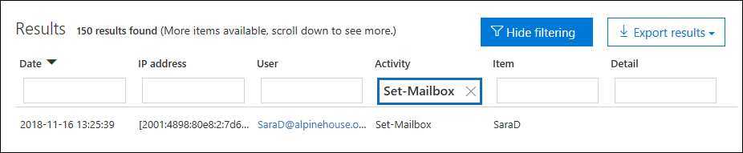
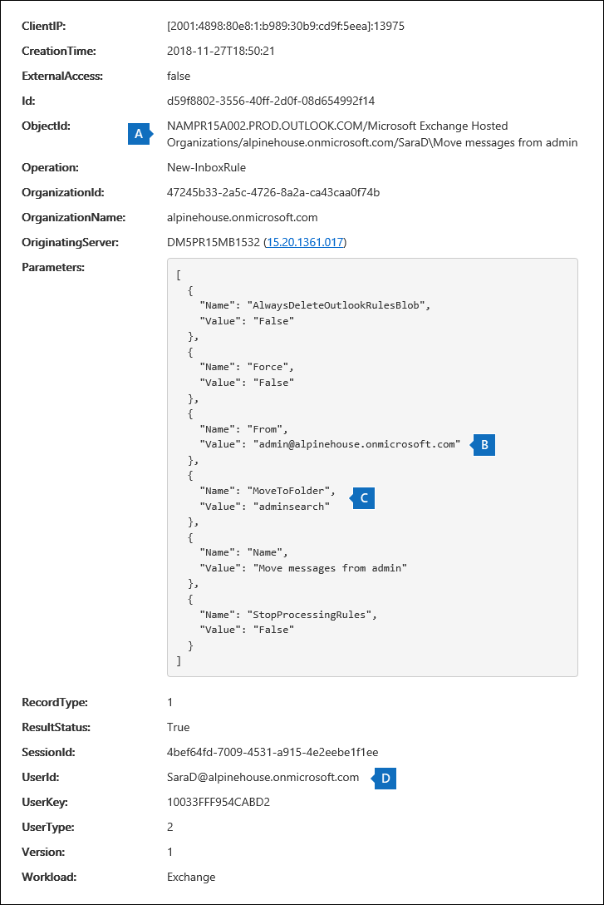

# <a name="search-the-audit-log-to-investigate-common-support-issues"></a><span data-ttu-id="65207-103">搜尋審計記錄檔，以調查常見的支援問題</span><span class="sxs-lookup"><span data-stu-id="65207-103">Search the audit log to investigate common support issues</span></span>

<span data-ttu-id="65207-104">本文說明如何使用「審核記錄搜尋」工具，協助您調查常見的支援問題。</span><span class="sxs-lookup"><span data-stu-id="65207-104">This article describes how to use the audit log search tool to help you investigate common support issues.</span></span> <span data-ttu-id="65207-105">這包括使用審核記錄來：</span><span class="sxs-lookup"><span data-stu-id="65207-105">This includes using the audit log to:</span></span>

- <span data-ttu-id="65207-106">尋找用來存取已遭破壞之帳戶之電腦的 IP 位址</span><span class="sxs-lookup"><span data-stu-id="65207-106">Find the IP address of the computer used to access a compromised account</span></span>
- <span data-ttu-id="65207-107">決定信箱的電子郵件轉發設定</span><span class="sxs-lookup"><span data-stu-id="65207-107">Determine who set up email forwarding for a mailbox</span></span>
- <span data-ttu-id="65207-108">決定使用者是否刪除其信箱中的電子郵件專案</span><span class="sxs-lookup"><span data-stu-id="65207-108">Determine if a user deleted email items in their mailbox</span></span>
- <span data-ttu-id="65207-109">決定使用者是否建立收件匣規則</span><span class="sxs-lookup"><span data-stu-id="65207-109">Determine if a user created an inbox rule</span></span>
- <span data-ttu-id="65207-110">調查組織外部使用者成功登入的原因</span><span class="sxs-lookup"><span data-stu-id="65207-110">Investigate why there was a successful login by a user outside your organization</span></span>

## <a name="using-the-audit-log-search-tool"></a><span data-ttu-id="65207-111">使用審核記錄搜尋工具</span><span class="sxs-lookup"><span data-stu-id="65207-111">Using the audit log search tool</span></span>

<span data-ttu-id="65207-112">本文中所述的每一個疑難排解案例都是以安全性 & 規範中心內的「審核記錄搜尋」工具為基礎。</span><span class="sxs-lookup"><span data-stu-id="65207-112">Each of the troubleshooting scenarios described in this article is based on using the audit log search tool in the Security & Compliance Center.</span></span> <span data-ttu-id="65207-113">本節列出搜尋審核記錄所需的許可權，並說明存取及執行審核記錄搜尋的步驟。</span><span class="sxs-lookup"><span data-stu-id="65207-113">This section lists the permissions required to search the audit log and describes the steps to access and run audit log searches.</span></span> <span data-ttu-id="65207-114">每個案例區段都會說明如何設定審核記錄搜尋查詢，以及在符合搜尋準則之審核記錄的詳細資訊中要尋找的專案。</span><span class="sxs-lookup"><span data-stu-id="65207-114">Each scenario section explains how to configure an audit log search query and what to look for in the detailed information in the audit records that match the search criteria.</span></span>

### <a name="permissions-required-to-use-the-audit-log-search-tool"></a><span data-ttu-id="65207-115">使用審核記錄搜尋工具所需的許可權</span><span class="sxs-lookup"><span data-stu-id="65207-115">Permissions required to use the audit log search tool</span></span>

<span data-ttu-id="65207-116">您必須獲指派「View-Only 審核記錄」或「審核記錄」角色在 Exchange Online 中，才可搜尋審核記錄。</span><span class="sxs-lookup"><span data-stu-id="65207-116">You must be assigned the View-Only Audit Logs or Audit Logs role in Exchange Online to search the audit log.</span></span> <span data-ttu-id="65207-117">根據預設，這些角色會在 Exchange 系統管理員中心的 [權限]\*\*\*\* 頁面上，指派給 [法務遵循管理] 和 [組織管理] 角色群組。</span><span class="sxs-lookup"><span data-stu-id="65207-117">By default, these roles are assigned to the Compliance Management and Organization Management role groups on the **Permissions** page in the Exchange admin center.</span></span> <span data-ttu-id="65207-118">Office 365 和 Microsoft 365 中的全域系統管理員會自動新增為 Exchange Online 中「組織管理」角色群組的成員。</span><span class="sxs-lookup"><span data-stu-id="65207-118">Global administrators in Office 365 and Microsoft 365 are automatically added as members of the Organization Management role group in Exchange Online.</span></span> <span data-ttu-id="65207-119">如需詳細資訊，請參閱[管理 Exchange Online 中的角色群組](https://go.microsoft.com/fwlink/p/?LinkID=730688)。</span><span class="sxs-lookup"><span data-stu-id="65207-119">For more information, see [Manage role groups in Exchange Online](https://go.microsoft.com/fwlink/p/?LinkID=730688).</span></span>

### <a name="running-audit-log-searches"></a><span data-ttu-id="65207-120">執行審核記錄搜尋</span><span class="sxs-lookup"><span data-stu-id="65207-120">Running audit log searches</span></span>

<span data-ttu-id="65207-121">本節說明建立及執行審核記錄搜尋的基本概念。</span><span class="sxs-lookup"><span data-stu-id="65207-121">This section describes the basics for creating and running audit log searches.</span></span> <span data-ttu-id="65207-122">請使用這些指示做為本文中每個疑難排解案例的開始點。</span><span class="sxs-lookup"><span data-stu-id="65207-122">Use these instructions as a starting point for each troubleshooting scenario in this article.</span></span> <span data-ttu-id="65207-123">如需詳細的逐步指示，請參閱[搜尋審核記錄](search-the-audit-log-in-security-and-compliance.md#step-1-run-an-audit-log-search)檔。</span><span class="sxs-lookup"><span data-stu-id="65207-123">For more detailed step-by-step instructions, see [Search the audit log](search-the-audit-log-in-security-and-compliance.md#step-1-run-an-audit-log-search).</span></span>

1. <span data-ttu-id="65207-124">移至[https://protection.office.com/unifiedauditlog](https://protection.office.com/unifiedauditlog)並使用您的公司或學校帳戶登入。</span><span class="sxs-lookup"><span data-stu-id="65207-124">Go to [https://protection.office.com/unifiedauditlog](https://protection.office.com/unifiedauditlog) and sign in using your work or school account.</span></span>
    
    <span data-ttu-id="65207-125">[稽核記錄搜尋]\*\*\*\* 頁面隨即顯示。</span><span class="sxs-lookup"><span data-stu-id="65207-125">The **Audit log search** page is displayed.</span></span> 
    
    ![設定準則，然後選取 [搜尋] 以執行搜尋](../media/8639d09c-2843-44e4-8b4b-9f45974ff7f1.png)
  
4. <span data-ttu-id="65207-127">您可以設定下列搜尋準則。</span><span class="sxs-lookup"><span data-stu-id="65207-127">You can configure the following search criteria.</span></span> <span data-ttu-id="65207-128">本文中的每個疑難排解案例都建議您設定這些欄位的特定指導方針。</span><span class="sxs-lookup"><span data-stu-id="65207-128">Each troubleshooting scenario in this article recommends specific guidance for configuring these fields.</span></span>
    
    <span data-ttu-id="65207-129">a.</span><span class="sxs-lookup"><span data-stu-id="65207-129">a.</span></span> <span data-ttu-id="65207-130">**活動：** 選取下拉式清單，以顯示您可以搜尋的活動。</span><span class="sxs-lookup"><span data-stu-id="65207-130">**Activities:** Select the drop-down list to display the activities that you can search for.</span></span> <span data-ttu-id="65207-131">執行搜尋後，只會顯示所選活動的審計記錄。</span><span class="sxs-lookup"><span data-stu-id="65207-131">After you run the search, only the audit records for the selected activities are displayed.</span></span> <span data-ttu-id="65207-132">選取 [**顯示所有活動的結果**]，會顯示符合其他搜尋準則之所有活動的結果。</span><span class="sxs-lookup"><span data-stu-id="65207-132">Selecting **Show results for all activities** displays results for all activities that meet the other search criteria.</span></span> <span data-ttu-id="65207-133">在某些疑難排解案例中，您也必須將此欄位保留空白。</span><span class="sxs-lookup"><span data-stu-id="65207-133">You'll also have to leave this field blank in some of the troubleshooting scenarios.</span></span>
    
    <span data-ttu-id="65207-134">b.</span><span class="sxs-lookup"><span data-stu-id="65207-134">b.</span></span> <span data-ttu-id="65207-135">**開始日期**和**結束日期：** 選取日期和時間範圍可顯示在該期間內發生的事件。</span><span class="sxs-lookup"><span data-stu-id="65207-135">**Start date** and **End date:** Select a date and time range to display the events that occurred within that period.</span></span> <span data-ttu-id="65207-136">預設會選取最後七天。</span><span class="sxs-lookup"><span data-stu-id="65207-136">The last seven days are selected by default.</span></span> <span data-ttu-id="65207-137">日期和時間以國際標準時間 (UTC) 格式表示。</span><span class="sxs-lookup"><span data-stu-id="65207-137">The date and time are presented in Coordinated Universal Time (UTC) format.</span></span> <span data-ttu-id="65207-138">您可以指定的最大日期範圍為 90 天。</span><span class="sxs-lookup"><span data-stu-id="65207-138">The maximum date range that you can specify is 90 days.</span></span>

    <span data-ttu-id="65207-139">c.</span><span class="sxs-lookup"><span data-stu-id="65207-139">c.</span></span> <span data-ttu-id="65207-140">**使用者：** 在此方塊中按一下，然後選取一或多個使用者，以顯示的搜尋結果。</span><span class="sxs-lookup"><span data-stu-id="65207-140">**Users:** Click in this box and then select one or more users to display search results for.</span></span> <span data-ttu-id="65207-141">您在此方塊中選取之使用者所執行之選取活動的審計記錄會顯示在結果清單中。</span><span class="sxs-lookup"><span data-stu-id="65207-141">Audit records for the selected activity performed by the users you select in this box are displayed in the list of results.</span></span> <span data-ttu-id="65207-142">若要傳回貴組織中所有使用者 (及服務帳戶) 的項目，請將此方塊保留空白。</span><span class="sxs-lookup"><span data-stu-id="65207-142">Leave this box blank to return entries for all users (and service accounts) in your organization.</span></span>
    
    <span data-ttu-id="65207-143">d.</span><span class="sxs-lookup"><span data-stu-id="65207-143">d.</span></span> <span data-ttu-id="65207-144">**檔、資料夾或網站：** 輸入部分或所有檔案或資料夾名稱，以搜尋與包含指定關鍵字之資料夾檔案相關的活動。</span><span class="sxs-lookup"><span data-stu-id="65207-144">**File, folder, or site:** Type some or all of a file or folder name to search for activity related to the file of folder that contains the specified keyword.</span></span> <span data-ttu-id="65207-145">您也可以指定檔案或資料夾的 URL。</span><span class="sxs-lookup"><span data-stu-id="65207-145">You can also specify a URL of a file or folder.</span></span> <span data-ttu-id="65207-146">如果您使用 URL，請確定輸入完整 URL 路徑，或者，如果您只輸入 URL 的一部分，請勿包含任何特殊字元或空格。</span><span class="sxs-lookup"><span data-stu-id="65207-146">If you use a URL, be sure the type the full URL path or if you only type a portion of the URL, don't include any special characters or spaces.</span></span> <span data-ttu-id="65207-147">若要傳回貴組織中所有檔案和資料夾的項目，請將此方塊保留空白。</span><span class="sxs-lookup"><span data-stu-id="65207-147">Leave this box blank to return entries for all files and folders in your organization.</span></span> <span data-ttu-id="65207-148">在本文的所有疑難排解案例中，此欄位會保留空白。</span><span class="sxs-lookup"><span data-stu-id="65207-148">This field is left blank in all the troubleshooting scenarios in this article.</span></span>
    
5. <span data-ttu-id="65207-149">選取 [**搜尋**]，使用您的搜尋準則執行搜尋。</span><span class="sxs-lookup"><span data-stu-id="65207-149">Select **Search** to run the search using your search criteria.</span></span> 
    
    <span data-ttu-id="65207-150">搜尋結果會經過載入，然後在 [**審計記錄檔搜尋**] 頁面的 [**結果**] 底下出現片刻之後。</span><span class="sxs-lookup"><span data-stu-id="65207-150">The search results are loaded, and after a few moments they're displayed under **Results** on the **Audit log search** page.</span></span> <span data-ttu-id="65207-151">本文中的每一節都提供在特定疑難排解案例內容中所要尋找之專案的指引。</span><span class="sxs-lookup"><span data-stu-id="65207-151">Each of the sections in this article provides guidance about things to look for in the context of the specific troubleshooting scenario.</span></span>

    <span data-ttu-id="65207-152">如需查看、篩選或匯出審計記錄搜尋結果的詳細資訊，請參閱：</span><span class="sxs-lookup"><span data-stu-id="65207-152">For more information about viewing, filtering, or exporting audit log search results, see:</span></span>

    - [<span data-ttu-id="65207-153">查看搜尋結果</span><span class="sxs-lookup"><span data-stu-id="65207-153">View search results</span></span>](search-the-audit-log-in-security-and-compliance.md#step-2-view-the-search-results)
    - [<span data-ttu-id="65207-154">篩選搜尋結果</span><span class="sxs-lookup"><span data-stu-id="65207-154">Filter search results</span></span>](search-the-audit-log-in-security-and-compliance.md#step-3-filter-the-search-results)
    - [<span data-ttu-id="65207-155">匯出搜尋結果</span><span class="sxs-lookup"><span data-stu-id="65207-155">Export search results</span></span>](search-the-audit-log-in-security-and-compliance.md#step-4-export-the-search-results-to-a-file)

## <a name="find-the-ip-address-of-the-computer-used-to-access-a-compromised-account"></a><span data-ttu-id="65207-156">尋找用來存取已遭破壞之帳戶之電腦的 IP 位址</span><span class="sxs-lookup"><span data-stu-id="65207-156">Find the IP address of the computer used to access a compromised account</span></span>

<span data-ttu-id="65207-157">與任何使用者執行的活動相對應的 IP 位址會包含在大部分的審計記錄中。</span><span class="sxs-lookup"><span data-stu-id="65207-157">The IP address corresponding to an activity performed by any user is included in most audit records.</span></span> <span data-ttu-id="65207-158">有關所使用之用戶端的資訊也會包含在審計記錄中。</span><span class="sxs-lookup"><span data-stu-id="65207-158">Information about the client used is also included in the audit record.</span></span>

<span data-ttu-id="65207-159">以下說明如何為此案例設定審核記錄搜尋查詢：</span><span class="sxs-lookup"><span data-stu-id="65207-159">Here's how to configure an audit log search query for this scenario:</span></span>

<span data-ttu-id="65207-160">**活動：** 如果與您的案例相關，請選取要搜尋的特定活動。</span><span class="sxs-lookup"><span data-stu-id="65207-160">**Activities:** If relevant to your case, select a specific activity to search for.</span></span> <span data-ttu-id="65207-161">若要疑難排解已遭破壞的帳戶，請考慮選取 [ **Exchange 信箱活動**] 底下的 [**使用者已登入信箱**活動]。</span><span class="sxs-lookup"><span data-stu-id="65207-161">For troubleshooting compromised accounts, consider selecting the **User signed in to mailbox** activity under **Exchange mailbox activities**.</span></span> <span data-ttu-id="65207-162">這會傳回審計記錄，顯示登入信箱時所使用的 IP 位址。</span><span class="sxs-lookup"><span data-stu-id="65207-162">This returns auditing records showing the IP address that was use when signing in to the mailbox.</span></span> <span data-ttu-id="65207-163">否則，請將此欄位保留空白，以傳回所有活動的審計記錄。</span><span class="sxs-lookup"><span data-stu-id="65207-163">Otherwise, leave this field blank to return audit records for all activities.</span></span> 

> [!TIP]
> <span data-ttu-id="65207-164">將此欄位保留空白將會傳回**UserLoggedIn**活動，也就是 Azure Active Directory 活動，表示某人已登入使用者帳戶。</span><span class="sxs-lookup"><span data-stu-id="65207-164">Leaving this field blank will  return **UserLoggedIn** activities, which is an Azure Active Directory activity that indicates that someone has signed in to an user account.</span></span> <span data-ttu-id="65207-165">在搜尋結果中使用篩選來顯示**UserLoggedIn**的審計記錄。</span><span class="sxs-lookup"><span data-stu-id="65207-165">Use filtering in the search results to display the **UserLoggedIn** audit records.</span></span>

<span data-ttu-id="65207-166">**開始日期**和**結束日期：** 選取適用于調查的日期範圍。</span><span class="sxs-lookup"><span data-stu-id="65207-166">**Start date** and **End date:** Select a date range that's applicable to your investigation.</span></span>

<span data-ttu-id="65207-167">**使用者：** 如果您正在調查已遭破壞的帳戶，請選取其帳戶已遭破壞的使用者。</span><span class="sxs-lookup"><span data-stu-id="65207-167">**Users:** If you're investigating a compromised account, select the user whose account was compromised.</span></span> <span data-ttu-id="65207-168">這會傳回由該使用者帳戶執行之活動的審計記錄。</span><span class="sxs-lookup"><span data-stu-id="65207-168">This returns audit records for activities performed by that user account.</span></span>

<span data-ttu-id="65207-169">**檔、資料夾或網站：** 請將此欄位保留空白。</span><span class="sxs-lookup"><span data-stu-id="65207-169">**File, folder, or site:** Leave this field blank.</span></span>

<span data-ttu-id="65207-170">執行搜尋後，每個活動的 IP 位址會顯示在搜尋結果的 [ **ip 位址**] 欄中。</span><span class="sxs-lookup"><span data-stu-id="65207-170">After you run the search, the IP address for each activity is displayed in the **IP address** column in the search results.</span></span> <span data-ttu-id="65207-171">選取搜尋結果中的記錄，以查看彈出頁面上的詳細資訊。</span><span class="sxs-lookup"><span data-stu-id="65207-171">Select the record in the search results to view more detailed information on the flyout page.</span></span>

## <a name="determine-who-set-up-email-forwarding-for-a-mailbox"></a><span data-ttu-id="65207-172">決定信箱的電子郵件轉發設定</span><span class="sxs-lookup"><span data-stu-id="65207-172">Determine who set up email forwarding for a mailbox</span></span>

<span data-ttu-id="65207-173">為信箱設定電子郵件轉寄時，傳送至信箱的電子郵件會轉送到另一個信箱。</span><span class="sxs-lookup"><span data-stu-id="65207-173">When email forwarding is configured for a mailbox, email messages that are sent to the mailbox are forwarded to another mailbox.</span></span> <span data-ttu-id="65207-174">郵件可以轉寄給組織內部或外部的使用者。</span><span class="sxs-lookup"><span data-stu-id="65207-174">Messages can be forwarded to users inside or outside of your organization.</span></span> <span data-ttu-id="65207-175">在信箱上設定電子郵件轉寄時，所使用的基礎 Exchange Online Cmdlet 會**Set-Mailbox**。</span><span class="sxs-lookup"><span data-stu-id="65207-175">When email forwarding is set up on a mailbox, the underlying Exchange Online cmdlet that's used is **Set-Mailbox**.</span></span>

<span data-ttu-id="65207-176">以下說明如何為此案例設定審核記錄搜尋查詢：</span><span class="sxs-lookup"><span data-stu-id="65207-176">Here's how to configure an audit log search query for this scenario:</span></span>

<span data-ttu-id="65207-177">**活動：** 將此欄位保留空白，讓搜尋傳回所有活動的審計記錄。</span><span class="sxs-lookup"><span data-stu-id="65207-177">**Activities:** Leave this field blank so that the search returns audit records for all activities.</span></span> <span data-ttu-id="65207-178">若要傳回與**Set-Mailbox** Cmdlet 相關的任何審計記錄，必須這麼做。</span><span class="sxs-lookup"><span data-stu-id="65207-178">This is necessary to return any audit records related to the **Set-Mailbox** cmdlet.</span></span>

<span data-ttu-id="65207-179">**開始日期**和**結束日期：** 選取適用于調查的日期範圍。</span><span class="sxs-lookup"><span data-stu-id="65207-179">**Start date** and **End date:** Select a date range that's applicable to your investigation.</span></span>

<span data-ttu-id="65207-180">**使用者：** 除非您要調查特定使用者的電子郵件轉接問題，否則請將此欄位保留空白。</span><span class="sxs-lookup"><span data-stu-id="65207-180">**Users:** Unless you're investigating an email forwarding issue for a specific user, leave this field blank.</span></span> <span data-ttu-id="65207-181">這可協助您識別是否為任何使用者設定電子郵件轉寄功能。</span><span class="sxs-lookup"><span data-stu-id="65207-181">This helps you identify if email forwarding was set up for any user.</span></span>

<span data-ttu-id="65207-182">**檔、資料夾或網站：** 請將此欄位保留空白。</span><span class="sxs-lookup"><span data-stu-id="65207-182">**File, folder, or site:** Leave this field blank.</span></span>

<span data-ttu-id="65207-183">執行搜尋之後，請選取搜尋結果頁面上的 [**篩選結果**]。</span><span class="sxs-lookup"><span data-stu-id="65207-183">After you run the search, select **Filter results** on the search results page.</span></span> <span data-ttu-id="65207-184">在 [**活動**] 欄標頭下方的方塊中，輸入**Set-Mailbox** ，只顯示與**Set-Mailbox** Cmdlet 相關的審計記錄。</span><span class="sxs-lookup"><span data-stu-id="65207-184">In the box under **Activity** column header, type **Set-Mailbox** so that only audit records related to the **Set-Mailbox** cmdlet are displayed.</span></span>



<span data-ttu-id="65207-186">此時，您必須查看每個審計記錄的詳細資料，以判斷該活動是否與電子郵件轉寄有關。</span><span class="sxs-lookup"><span data-stu-id="65207-186">At this point, you have to look at the details of each audit record to determine if the activity is related to email forwarding.</span></span> <span data-ttu-id="65207-187">選取 [審計記錄] 以顯示 [**詳細資料**] 飛出頁面，然後選取 [**詳細資訊**]。</span><span class="sxs-lookup"><span data-stu-id="65207-187">Select the audit record to display the **Details** flyout page, and then select **More information**.</span></span> <span data-ttu-id="65207-188">下列螢幕擷取畫面和描述會反白顯示指出信箱上已設定電子郵件轉寄的資訊。</span><span class="sxs-lookup"><span data-stu-id="65207-188">The following screenshot and descriptions highlight the information that indicates email forwarding was set on the mailbox.</span></span>


<span data-ttu-id="65207-190">a.</span><span class="sxs-lookup"><span data-stu-id="65207-190">a.</span></span> <span data-ttu-id="65207-191">在 [ **ObjectId** ] 欄位中，會顯示已設定電子郵件轉寄功能之信箱的別名。</span><span class="sxs-lookup"><span data-stu-id="65207-191">In the **ObjectId** field, the alias of the mailbox that email forwarding was set on is displayed.</span></span> <span data-ttu-id="65207-192">此信箱也會顯示在搜尋結果頁面的 [**專案**] 欄中。</span><span class="sxs-lookup"><span data-stu-id="65207-192">This mailbox is also displayed on the **Item** column in the search results page.</span></span>

<span data-ttu-id="65207-193">b.</span><span class="sxs-lookup"><span data-stu-id="65207-193">b.</span></span> <span data-ttu-id="65207-194">在 [**參數**] 欄位中，值*ForwardingSmtpAddress*指出信箱上已設定電子郵件轉寄功能。</span><span class="sxs-lookup"><span data-stu-id="65207-194">In the **Parameters** field, The value *ForwardingSmtpAddress* indicates that email forwarding was set on the mailbox.</span></span> <span data-ttu-id="65207-195">在此範例中，郵件會轉寄至電子郵件地址 mike@contoso.com，該位址位於 alpinehouse.onmicrosoft.com 組織外。</span><span class="sxs-lookup"><span data-stu-id="65207-195">In this example, mail is being forwarded to the email address mike@contoso.com, which is outside of the alpinehouse.onmicrosoft.com organization.</span></span>

<span data-ttu-id="65207-196">c.</span><span class="sxs-lookup"><span data-stu-id="65207-196">c.</span></span> <span data-ttu-id="65207-197">*DeliverToMailboxAndForward*參數的*True*值表示郵件副本會傳遞至 sarad@alpinehouse.onmicrosoft.com *，並*轉送到*ForwardingSmtpAddress*參數所指定的電子郵件地址，在此範例中是 mike@contoso.com。</span><span class="sxs-lookup"><span data-stu-id="65207-197">The *True* value for the *DeliverToMailboxAndForward* parameter indicates that a copy of the message is delivered to sarad@alpinehouse.onmicrosoft.com *and* is forwarded to the email address specified by the *ForwardingSmtpAddress* parameter, which in this example is mike@contoso.com.</span></span> <span data-ttu-id="65207-198">如果*DeliverToMailboxAndForward*參數的值設為*False*，則電子郵件只會轉寄給*ForwardingSmtpAddress*參數所指定的位址。</span><span class="sxs-lookup"><span data-stu-id="65207-198">If the value for the *DeliverToMailboxAndForward* parameter is set to *False*, then email is only forwarded to the address specified by the *ForwardingSmtpAddress* parameter.</span></span> <span data-ttu-id="65207-199">它不會傳送至 [ **ObjectId** ] 欄位中指定的信箱。</span><span class="sxs-lookup"><span data-stu-id="65207-199">It's not delivered to the mailbox specified in the **ObjectId** field.</span></span>

<span data-ttu-id="65207-200">d.</span><span class="sxs-lookup"><span data-stu-id="65207-200">d.</span></span> <span data-ttu-id="65207-201">[ **UserId** ] 欄位會指出在**ObjectId** ] 欄位中指定的信箱上設定電子郵件轉寄的使用者。</span><span class="sxs-lookup"><span data-stu-id="65207-201">The **UserId** field indicates the user who set email forwarding on the mailbox specified in the **ObjectId** field.</span></span> <span data-ttu-id="65207-202">此使用者也會顯示在搜尋結果頁面上的 [**使用者**] 欄中。</span><span class="sxs-lookup"><span data-stu-id="65207-202">This user is also displayed in the **User** column on the search results page.</span></span> <span data-ttu-id="65207-203">在此情況下，似乎是信箱的擁有者在信箱上設定電子郵件轉寄。</span><span class="sxs-lookup"><span data-stu-id="65207-203">In this case, it seems that the owner of the mailbox set email forwarding on her mailbox.</span></span>

<span data-ttu-id="65207-204">如果您決定不應該在信箱上設定電子郵件轉寄功能，您可以在 Exchange Online 中執行下列命令，以移除電子郵件轉接 PowerShell:</span><span class="sxs-lookup"><span data-stu-id="65207-204">If you determine that email forwarding shouldn't be set on the mailbox, you can remove it by running the following command in Exchange Online PowerShell:</span></span>

```powershell
Set-Mailbox <mailbox alias> -ForwardingSmtpAddress $null 
```

<span data-ttu-id="65207-205">如需與電子郵件轉寄相關之參數的詳細資訊，請參閱[Set-Mailbox](https://docs.microsoft.com/powershell/module/exchange/mailboxes/set-mailbox)文章。</span><span class="sxs-lookup"><span data-stu-id="65207-205">For more information about the parameters related to email forwarding, see the [Set-Mailbox](https://docs.microsoft.com/powershell/module/exchange/mailboxes/set-mailbox) article.</span></span>

## <a name="determine-if-a-user-deleted-email-items"></a><span data-ttu-id="65207-206">決定使用者是否刪除電子郵件專案</span><span class="sxs-lookup"><span data-stu-id="65207-206">Determine if a user deleted email items</span></span>

<span data-ttu-id="65207-207">從2019年1月開始，Microsoft 預設會針對所有 Office 365 和 Microsoft 組織開啟信箱審核記錄。</span><span class="sxs-lookup"><span data-stu-id="65207-207">Starting in January 2019, Microsoft is turning on mailbox audit logging by default for all Office 365 and Microsoft organizations.</span></span> <span data-ttu-id="65207-208">這表示會自動記錄信箱擁有者執行的某些動作，當您在信箱審核記錄檔中搜尋時，會提供對應的信箱審計記錄。</span><span class="sxs-lookup"><span data-stu-id="65207-208">This means that certain actions performed by mailbox owners are automatically logged, and the corresponding mailbox audit records are available when you search for them in the mailbox audit log.</span></span> <span data-ttu-id="65207-209">在信箱審核預設為開啟狀態之前，您必須針對組織中的每個使用者信箱手動啟用它。</span><span class="sxs-lookup"><span data-stu-id="65207-209">Before mailbox auditing was turned on by default, you had to manually enable it for every user mailbox in your organization.</span></span> 

<span data-ttu-id="65207-210">預設會記錄的信箱動作包括信箱擁有者執行的 SoftDelete 和 HardDelete 信箱動作。</span><span class="sxs-lookup"><span data-stu-id="65207-210">The mailbox actions logged by default include the SoftDelete and HardDelete mailbox actions performed by mailbox owners.</span></span> <span data-ttu-id="65207-211">這表示您可以使用下列步驟，在審計記錄檔中搜尋與已刪除之電子郵件專案相關的事件。</span><span class="sxs-lookup"><span data-stu-id="65207-211">This means you can use the following steps to search the audit log for events related to deleted email items.</span></span> <span data-ttu-id="65207-212">如需預設信箱審核的詳細資訊，請參閱[管理信箱審核](enable-mailbox-auditing.md)。</span><span class="sxs-lookup"><span data-stu-id="65207-212">For more information about mailbox auditing on by default, see [Manage mailbox auditing](enable-mailbox-auditing.md).</span></span>

<span data-ttu-id="65207-213">以下說明如何為此案例設定審核記錄搜尋查詢：</span><span class="sxs-lookup"><span data-stu-id="65207-213">Here's how to configure an audit log search query for this scenario:</span></span>

<span data-ttu-id="65207-214">**活動：** 在 [ **Exchange 信箱活動**] 底下，選取下列其中一個或兩個活動：</span><span class="sxs-lookup"><span data-stu-id="65207-214">**Activities:** Under **Exchange mailbox activities**, select one or both of the following activities:</span></span>

- <span data-ttu-id="65207-215">**從 [刪除的郵件] 資料夾刪除郵件：** 此活動對應于「 **SoftDelete**信箱審核」動作。</span><span class="sxs-lookup"><span data-stu-id="65207-215">**Deleted messages from Deleted Items folder:** This activity corresponds to the **SoftDelete** mailbox auditing action.</span></span> <span data-ttu-id="65207-216">當使用者依序選取專案並按**Shift+Delete**，也會記錄此活動。</span><span class="sxs-lookup"><span data-stu-id="65207-216">This activity is also logged when a user permanently deletes an item by selecting it and pressing **Shift+Delete**.</span></span> <span data-ttu-id="65207-217">永久刪除專案之後，使用者可以復原它，直到刪除的專案保留期間到期為止。</span><span class="sxs-lookup"><span data-stu-id="65207-217">After an item is permanently deleted, the user can recover it until the deleted item retention period expires.</span></span>

- <span data-ttu-id="65207-218">已**清除信箱中的郵件：** 此活動對應于「 **HardDelete**信箱審核」動作。</span><span class="sxs-lookup"><span data-stu-id="65207-218">**Purged messages from mailbox:** This activity corresponds to the **HardDelete** mailbox auditing action.</span></span> <span data-ttu-id="65207-219">當使用者從 [可復原的專案] 資料夾中清除專案時，就會記錄這種情況。</span><span class="sxs-lookup"><span data-stu-id="65207-219">This is logged when a user purges an item from the Recoverable Items folder.</span></span> <span data-ttu-id="65207-220">系統管理員可以使用「安全性與合規性中心」中的內容搜尋工具來搜尋及復原清除的專案，直到已刪除的專案保留期間到期或超過使用者的信箱處於保留狀態為止。</span><span class="sxs-lookup"><span data-stu-id="65207-220">Admins can use the Content Search tool in the security and compliance center to search for and recover purged items until the deleted item retention period expires or longer if the user's mailbox is on hold.</span></span>

<span data-ttu-id="65207-221">**開始日期**和**結束日期：** 選取適用于調查的日期範圍。</span><span class="sxs-lookup"><span data-stu-id="65207-221">**Start date** and **End date:** Select a date range that's applicable to your investigation.</span></span>

<span data-ttu-id="65207-222">**使用者：**[！注意] 如果您在此欄位中選取使用者，則 [審核記錄] 搜尋工具會傳回您指定之使用者所刪除之電子郵件專案（SoftDeleted 或 HardDeleted）的審計記錄。</span><span class="sxs-lookup"><span data-stu-id="65207-222">**Users:** If you select a user in this field, the audit log search tool returns audit records for email items that were deleted (SoftDeleted or HardDeleted) by the user you specify.</span></span> <span data-ttu-id="65207-223">有時候刪除電子郵件的使用者可能不是信箱擁有者。</span><span class="sxs-lookup"><span data-stu-id="65207-223">Sometimes the user who deletes an email might not be the mailbox owner.</span></span>

<span data-ttu-id="65207-224">**檔、資料夾或網站：** 請將此欄位保留空白。</span><span class="sxs-lookup"><span data-stu-id="65207-224">**File, folder, or site:** Leave this field blank.</span></span>

<span data-ttu-id="65207-225">執行搜尋之後，您可以篩選搜尋結果，以顯示虛刪除專案或實刪除專案的審計記錄。</span><span class="sxs-lookup"><span data-stu-id="65207-225">After you run the search, you can filter the search results to display the audit records for soft-deleted items or for hard-deleted items.</span></span> <span data-ttu-id="65207-226">選取 [審計記錄] 以顯示 [**詳細資料**] 飛出頁面，然後選取 [**詳細資訊**]。</span><span class="sxs-lookup"><span data-stu-id="65207-226">Select the audit record to display the **Details** flyout page, and then select **More information**.</span></span> <span data-ttu-id="65207-227">在 [ **AffectedItems** ] 欄位中會顯示刪除專案的其他資訊，例如專案的主旨行和位置。</span><span class="sxs-lookup"><span data-stu-id="65207-227">Additional information about the deleted item, such as the subject line and the location of the item when it was deleted, is displayed in the **AffectedItems** field.</span></span> <span data-ttu-id="65207-228">下列螢幕擷取畫面顯示虛刪除專案和實刪除專案**AffectedItems**欄位的範例。</span><span class="sxs-lookup"><span data-stu-id="65207-228">The following screenshots show an example of the **AffectedItems** field from a soft-deleted item and a hard-deleted item.</span></span>

<span data-ttu-id="65207-229">**虛刪除專案之 AffectedItems 欄位的範例**</span><span class="sxs-lookup"><span data-stu-id="65207-229">**Example of AffectedItems field for soft-deleted item**</span></span>


<span data-ttu-id="65207-231">**實刪除專案之 AffectedItems 欄位的範例**</span><span class="sxs-lookup"><span data-stu-id="65207-231">**Example of AffectedItems field for hard-deleted item**</span></span>


### <a name="recover-deleted-email-items"></a><span data-ttu-id="65207-233">復原已刪除的電子郵件專案</span><span class="sxs-lookup"><span data-stu-id="65207-233">Recover deleted email items</span></span>

<span data-ttu-id="65207-234">如果刪除的郵件保留期間尚未到期，使用者可以復原虛刪除的專案。</span><span class="sxs-lookup"><span data-stu-id="65207-234">Users can recover soft-deleted items if the deleted items retention period has not expired.</span></span> <span data-ttu-id="65207-235">在 Exchange Online 中，預設已刪除郵件的保留期間為14天，但是系統管理員可將此設定增加為最長30天。</span><span class="sxs-lookup"><span data-stu-id="65207-235">In Exchange Online, the default deleted items retention period is 14 days, but admins can increase this setting to a maximum of 30 days.</span></span> <span data-ttu-id="65207-236">請使用者在[Outlook 網頁版中的 [復原刪除的郵件] 或 [電子郵件](https://support.office.com/article/Recover-deleted-items-or-email-in-Outlook-Web-App-C3D8FC15-EEEF-4F1C-81DF-E27964B7EDD4)]，以取得復原已刪除專案的指示。</span><span class="sxs-lookup"><span data-stu-id="65207-236">Point users to the [Recover deleted items or email in Outlook on the web](https://support.office.com/article/Recover-deleted-items-or-email-in-Outlook-Web-App-C3D8FC15-EEEF-4F1C-81DF-E27964B7EDD4) article for instructions on recovering deleted items.</span></span>

<span data-ttu-id="65207-237">如先前所述，當已刪除專案的保留期間尚未到期或信箱處於保留狀態時，系統管理員可能能夠復原已刪除的專案，在此情況下，會保留專案，直到保留期間到期為止。</span><span class="sxs-lookup"><span data-stu-id="65207-237">As previously explained, admins may be able to recover hard-deleted items if the deleted item retention period hasn't expired or if the mailbox is on hold, in which case items are kept until the hold duration expires.</span></span> <span data-ttu-id="65207-238">當您執行內容搜尋時，[可復原的專案] 資料夾中的虛刪除和實刪除專案會在搜尋結果中傳回，如果符合搜尋查詢。</span><span class="sxs-lookup"><span data-stu-id="65207-238">When you run a content search, soft-deleted and hard-deleted items in the Recoverable Items folder are returned in the search results if they match the search query.</span></span> <span data-ttu-id="65207-239">如需有關執行內容搜尋的詳細資訊，請參閱[內容搜尋 In Office 365](content-search.md)。</span><span class="sxs-lookup"><span data-stu-id="65207-239">For more information about running content searches, see [Content Search in Office 365](content-search.md).</span></span>

> [!TIP]
> <span data-ttu-id="65207-240">若要搜尋刪除的電子郵件專案，請搜尋在審計記錄的 [ **AffectedItems** ] 欄位中顯示的全部或部分主旨行。</span><span class="sxs-lookup"><span data-stu-id="65207-240">To search for deleted email items, search for all or part of the subject line that's displayed in the **AffectedItems** field in the audit record.</span></span>

## <a name="determine-if-a-user-created-an-inbox-rule"></a><span data-ttu-id="65207-241">決定使用者是否建立收件匣規則</span><span class="sxs-lookup"><span data-stu-id="65207-241">Determine if a user created an inbox rule</span></span>

<span data-ttu-id="65207-242">當使用者建立其 Exchange Online 信箱的收件匣規則時，對應的審計記錄會儲存至審計記錄檔。</span><span class="sxs-lookup"><span data-stu-id="65207-242">When users create an inbox rule for their Exchange Online mailbox, a corresponding audit record is saved to the audit log.</span></span> <span data-ttu-id="65207-243">如需收件匣規則的相關資訊，請參閱：</span><span class="sxs-lookup"><span data-stu-id="65207-243">For more information about inbox rules, see:</span></span>

- [<span data-ttu-id="65207-244">在 web 上的 Outlook 中使用收件匣規則</span><span class="sxs-lookup"><span data-stu-id="65207-244">Use inbox rules in Outlook on the web</span></span>](https://support.office.com/article/use-inbox-rules-in-outlook-on-the-web-8400435c-f14e-4272-9004-1548bb1848f2)
- [<span data-ttu-id="65207-245">使用規則管理 Outlook 中的電子郵件</span><span class="sxs-lookup"><span data-stu-id="65207-245">Manage email messages in Outlook by using rules</span></span>](https://support.office.com/article/Manage-email-messages-by-using-rules-C24F5DEA-9465-4DF4-AD17-A50704D66C59)

<span data-ttu-id="65207-246">以下說明如何為此案例設定審核記錄搜尋查詢：</span><span class="sxs-lookup"><span data-stu-id="65207-246">Here's how to configure an audit log search query for this scenario:</span></span>

<span data-ttu-id="65207-247">**活動：** 在 [ **Exchange 信箱活動**] 底下，選取 [ **New-InboxRule 建立/修改/啟用/停用收件匣規則**]。</span><span class="sxs-lookup"><span data-stu-id="65207-247">**Activities:** Under **Exchange mailbox activities**, select **New-InboxRule Create/modify/enable/disable inbox rule**.</span></span>

<span data-ttu-id="65207-248">**開始日期**和**結束日期：** 選取適用于調查的日期範圍。</span><span class="sxs-lookup"><span data-stu-id="65207-248">**Start date** and **End date:** Select a date range that's applicable to your investigation.</span></span>

<span data-ttu-id="65207-249">**使用者：** 除非您要調查特定的使用者，否則請將此欄位保留空白。</span><span class="sxs-lookup"><span data-stu-id="65207-249">**Users:** Unless you're investigating a specific user, leave this field blank.</span></span> <span data-ttu-id="65207-250">這可協助您識別任何使用者設定的新收件匣規則。</span><span class="sxs-lookup"><span data-stu-id="65207-250">This helps you identify new inbox rules set up by any user.</span></span>

<span data-ttu-id="65207-251">**檔、資料夾或網站：** 請將此欄位保留空白。</span><span class="sxs-lookup"><span data-stu-id="65207-251">**File, folder, or site:** Leave this field blank.</span></span>

<span data-ttu-id="65207-252">執行搜尋後，此活動的任何審計記錄會顯示在搜尋結果中。</span><span class="sxs-lookup"><span data-stu-id="65207-252">After you run the search, any audit records for this activity are displayed in the search results.</span></span> <span data-ttu-id="65207-253">選取要顯示 [**詳細資料**] 飛出頁面的審計記錄，然後選取 [**詳細資訊**]。</span><span class="sxs-lookup"><span data-stu-id="65207-253">Select an audit record to display the **Details** flyout page, and then select **More information**.</span></span> <span data-ttu-id="65207-254">[**參數**] 欄位中會顯示 [收件匣規則] 設定的相關資訊。</span><span class="sxs-lookup"><span data-stu-id="65207-254">Information about the inbox rule settings is displayed in the **Parameters** field.</span></span> <span data-ttu-id="65207-255">下列螢幕擷取畫面和描述會反白顯示收件匣規則的相關資訊。</span><span class="sxs-lookup"><span data-stu-id="65207-255">The following screenshot and descriptions highlight the information about inbox rules.</span></span>



<span data-ttu-id="65207-257">a.</span><span class="sxs-lookup"><span data-stu-id="65207-257">a.</span></span> <span data-ttu-id="65207-258">在 [ **ObjectId** ] 欄位中，會顯示 [收件匣規則] 的完整名稱。</span><span class="sxs-lookup"><span data-stu-id="65207-258">In the **ObjectId** field, the full name of the inbox rule is displayed.</span></span> <span data-ttu-id="65207-259">此名稱包含使用者信箱的別名（例如，SaraD）和收件匣規則的名稱（例如，「從系統管理員移動郵件」）。</span><span class="sxs-lookup"><span data-stu-id="65207-259">This name includes the alias of the user's mailbox (for example, SaraD) and the name of the inbox rule (for example, "Move messages from admin").</span></span>

<span data-ttu-id="65207-260">b.</span><span class="sxs-lookup"><span data-stu-id="65207-260">b.</span></span> <span data-ttu-id="65207-261">在 [**參數**] 欄位中，會顯示 [收件匣規則] 的條件。</span><span class="sxs-lookup"><span data-stu-id="65207-261">In the **Parameters** field, the condition of the inbox rule is displayed.</span></span> <span data-ttu-id="65207-262">在此範例中，條件是由*From*參數指定。</span><span class="sxs-lookup"><span data-stu-id="65207-262">In this example, the condition is specified by the *From* parameter.</span></span> <span data-ttu-id="65207-263">為*From*參數定義的值表示收件匣規則會作用於 admin@alpinehouse.onmicrosoft.com 所傳送的電子郵件。</span><span class="sxs-lookup"><span data-stu-id="65207-263">The value defined for the *From* parameter indicates that the inbox rule acts on email sent by admin@alpinehouse.onmicrosoft.com.</span></span> <span data-ttu-id="65207-264">如需可用於定義收件匣規則條件的完整參數清單，請參閱[New-InboxRule](https://docs.microsoft.com/powershell/module/exchange/mailboxes/new-inboxrule)文章。</span><span class="sxs-lookup"><span data-stu-id="65207-264">For a complete list of the parameters that can be used to define conditions of inbox rules, see the [New-InboxRule](https://docs.microsoft.com/powershell/module/exchange/mailboxes/new-inboxrule) article.</span></span>

<span data-ttu-id="65207-265">c.</span><span class="sxs-lookup"><span data-stu-id="65207-265">c.</span></span> <span data-ttu-id="65207-266">*MoveToFolder*參數會指定收件匣規則的動作。</span><span class="sxs-lookup"><span data-stu-id="65207-266">The *MoveToFolder* parameter specifies the action for the inbox rule.</span></span> <span data-ttu-id="65207-267">在此範例中，從 admin@alpinehouse.onmicrosoft.com 收到的郵件會移至名為*AdminSearch*的資料夾。</span><span class="sxs-lookup"><span data-stu-id="65207-267">In this example, messages received from admin@alpinehouse.onmicrosoft.com are moved to the folder named *AdminSearch*.</span></span> <span data-ttu-id="65207-268">另請參閱[New-InboxRule](https://docs.microsoft.com/powershell/module/exchange/mailboxes/new-inboxrule)文章，以取得可用於定義收件匣規則動作的完整參數清單。</span><span class="sxs-lookup"><span data-stu-id="65207-268">Also see the [New-InboxRule](https://docs.microsoft.com/powershell/module/exchange/mailboxes/new-inboxrule) article for a complete list of parameters that can be used to define the action of an inbox rule.</span></span>

<span data-ttu-id="65207-269">d.</span><span class="sxs-lookup"><span data-stu-id="65207-269">d.</span></span> <span data-ttu-id="65207-270">[ **UserId** ] 欄位會指出建立 [ **ObjectId** ] 欄位中指定的收件匣規則的使用者。</span><span class="sxs-lookup"><span data-stu-id="65207-270">The **UserId** field indicates the user who created the inbox rule specified in the **ObjectId** field.</span></span> <span data-ttu-id="65207-271">此使用者也會顯示在搜尋結果頁面上的 [**使用者**] 欄中。</span><span class="sxs-lookup"><span data-stu-id="65207-271">This user is also displayed in the **User** column on the search results page.</span></span>

## <a name="investigate-why-there-was-a-successful-login-by-a-user-outside-your-organization"></a><span data-ttu-id="65207-272">調查組織外部使用者成功登入的原因</span><span class="sxs-lookup"><span data-stu-id="65207-272">Investigate why there was a successful login by a user outside your organization</span></span>

<span data-ttu-id="65207-273">在審核記錄中檢查審計記錄時，您可能會看到指出外部使用者已透過 Azure Active Directory 驗證，且已成功登入組織的記錄。</span><span class="sxs-lookup"><span data-stu-id="65207-273">When reviewing audit records in the audit log, you may see records that indicate an external user was authenticated by Azure Active Directory and successfully logged in to your organization.</span></span> <span data-ttu-id="65207-274">例如，contoso.onmicrosoft.com 中的系統管理員可能會看到一個審計記錄，顯示不同組織中的使用者（例如，fabrikam.onmicrosoft.com）已成功登入 contoso.onmicrosoft.com。</span><span class="sxs-lookup"><span data-stu-id="65207-274">For example, an admin in contoso.onmicrosoft.com may see an audit record showing that a user from a different organization (for example, fabrikam.onmicrosoft.com) successfully logged into contoso.onmicrosoft.com.</span></span> <span data-ttu-id="65207-275">同樣地，您可能會看到審計記錄指出使用 Microsoft 帳戶（MSA）的使用者（如 Outlook.com 或 Live.com）已成功登入您的組織。</span><span class="sxs-lookup"><span data-stu-id="65207-275">Similarly, you may see audit records that indicate users with a Microsoft Account (MSA), such as an Outlook.com or Live.com, successfully logged in to your organization.</span></span> <span data-ttu-id="65207-276">在這些情況下，已審核的活動為**使用者登入**。</span><span class="sxs-lookup"><span data-stu-id="65207-276">In these situations, the audited activity is **User logged In**.</span></span> 

<span data-ttu-id="65207-277">這是設計方式。</span><span class="sxs-lookup"><span data-stu-id="65207-277">This behavior is by design.</span></span> <span data-ttu-id="65207-278">當外部使用者嘗試存取 SharePoint 網站或組織中的 OneDrive 位置時，azure Active Directory （Azure AD）和目錄服務可讓稱為*傳遞驗證*的內容。</span><span class="sxs-lookup"><span data-stu-id="65207-278">Azure Active Directory (Azure AD), the directory service, allows something called *pass-through authentication* when an external user tries to access a SharePoint site or a OneDrive location in your organization.</span></span> <span data-ttu-id="65207-279">當外部使用者嘗試這麼做時，系統會提示他們輸入認證。</span><span class="sxs-lookup"><span data-stu-id="65207-279">When the external user tries to do this, they're prompted to enter their credentials.</span></span> <span data-ttu-id="65207-280">Azure AD 使用認證來驗證使用者，這表示只有 Azure AD 驗證使用者是其所聲稱的使用者。</span><span class="sxs-lookup"><span data-stu-id="65207-280">Azure AD uses the credentials to authenticate the user, meaning only Azure AD verifies that the user is who they say they are.</span></span> <span data-ttu-id="65207-281">在審計記錄中成功登入的指示是 Azure AD 驗證使用者的結果。</span><span class="sxs-lookup"><span data-stu-id="65207-281">The indication of the successful login in the audit record is the result of Azure AD authenticating the user.</span></span> <span data-ttu-id="65207-282">成功的登入並不表示使用者能夠存取任何資源或在您的組織中執行其他任何動作。</span><span class="sxs-lookup"><span data-stu-id="65207-282">The successful login doesn't mean that the user was able to access any resources or perform any other actions in your organization.</span></span> <span data-ttu-id="65207-283">它只會指出使用者已由 Azure AD 進行驗證。</span><span class="sxs-lookup"><span data-stu-id="65207-283">It only indicates that the user was authenticated by Azure AD.</span></span> <span data-ttu-id="65207-284">為了讓透過使用者能夠存取 SharePoint 或 OneDrive 資源，貴組織中的使用者必須透過傳送共用邀請或匿名共用連結，明確地與外部使用者共用資源。</span><span class="sxs-lookup"><span data-stu-id="65207-284">In order for a pass-through user to access SharePoint or OneDrive resources, a user in your organization would have to explicitly share a resource with the external user by sending them a sharing invitation or anonymous sharing link.</span></span> 

> [!NOTE]
> <span data-ttu-id="65207-285">Azure AD 只允許*第一方應用程式*的傳遞驗證，例如 SharePoint 線上和商務 OneDrive。</span><span class="sxs-lookup"><span data-stu-id="65207-285">Azure AD allows pass-through authentication only for *first-party applications*, such as SharePoint Online and OneDrive for Business.</span></span> <span data-ttu-id="65207-286">不允許其他協力廠商應用程式。</span><span class="sxs-lookup"><span data-stu-id="65207-286">It isn't allowed for other third-party applications.</span></span>

<span data-ttu-id="65207-287">以下是已**登入**事件（即傳遞驗證的結果）之審核記錄中相關屬性的範例及描述。</span><span class="sxs-lookup"><span data-stu-id="65207-287">Here's an example and descriptions of relevant properties in an audit record for a **User logged In** event that is a result of pass-through authentication.</span></span> <span data-ttu-id="65207-288">選取 [審計記錄] 以顯示 [**詳細資料**] 飛出頁面，然後選取 [**詳細資訊**]。</span><span class="sxs-lookup"><span data-stu-id="65207-288">Select the audit record to display the **Details** flyout page, and then select **More information**.</span></span>


   <span data-ttu-id="65207-290">a.</span><span class="sxs-lookup"><span data-stu-id="65207-290">a.</span></span> <span data-ttu-id="65207-291">此欄位指出在組織的 Azure AD 中找不到嘗試存取您組織中之資源的使用者。</span><span class="sxs-lookup"><span data-stu-id="65207-291">This field indicates that the user who attempted to access a resource in your organization wasn't found in your organization's Azure AD.</span></span>

   <span data-ttu-id="65207-292">b.</span><span class="sxs-lookup"><span data-stu-id="65207-292">b.</span></span> <span data-ttu-id="65207-293">此欄位會顯示嘗試存取組織中資源的外部使用者的 UPN。</span><span class="sxs-lookup"><span data-stu-id="65207-293">This field displays the UPN of the external user that attempted to access a resource in your organization.</span></span> <span data-ttu-id="65207-294">此使用者識別碼也會在**使用者**中識別，並**UserId**審計記錄中的屬性。</span><span class="sxs-lookup"><span data-stu-id="65207-294">This user ID is also identified in the **User** and **UserId** properties in the audit record.</span></span>

   <span data-ttu-id="65207-295">c.</span><span class="sxs-lookup"><span data-stu-id="65207-295">c.</span></span> <span data-ttu-id="65207-296">**ApplicationId**屬性可識別觸發登入要求的應用程式。</span><span class="sxs-lookup"><span data-stu-id="65207-296">The **ApplicationId** property identifies the application that triggered the logon request.</span></span> <span data-ttu-id="65207-297">此審計記錄中 ApplicationId 屬性所顯示的00000003-0000-0ff1-ce00-000000000000 值會指出 SharePoint 線上。</span><span class="sxs-lookup"><span data-stu-id="65207-297">The value of 00000003-0000-0ff1-ce00-000000000000 displayed in the ApplicationId property in this audit record indicates SharePoint Online.</span></span> <span data-ttu-id="65207-298">OneDrive 商務用 ApplicationId 也相同。</span><span class="sxs-lookup"><span data-stu-id="65207-298">OneDrive for Business also has this same ApplicationId.</span></span>

   <span data-ttu-id="65207-299">d.</span><span class="sxs-lookup"><span data-stu-id="65207-299">d.</span></span> <span data-ttu-id="65207-300">這表示透過驗證成功。</span><span class="sxs-lookup"><span data-stu-id="65207-300">This indicates that the pass-through authentication was successful.</span></span> <span data-ttu-id="65207-301">換句話說，使用者已透過 Azure AD 成功驗證。</span><span class="sxs-lookup"><span data-stu-id="65207-301">In other words, the user was successfully authenticated by Azure AD.</span></span> 

   <span data-ttu-id="65207-302">e.</span><span class="sxs-lookup"><span data-stu-id="65207-302">e.</span></span> <span data-ttu-id="65207-303">**RecordType**值為**15**表示已審核的活動（USERLOGGEDIN）是 Azure AD 中的安全權杖服務（STS）登入事件。</span><span class="sxs-lookup"><span data-stu-id="65207-303">The **RecordType** value of **15** indicates that the audited activity (UserLoggedIn) is a  Secure Token Service (STS) logon event in Azure AD.</span></span>

<span data-ttu-id="65207-304">如需 UserLoggedIn 審計記錄中所顯示之其他屬性的詳細資訊，請參閱[Office 365 管理活動 API 架構](https://docs.microsoft.com/office/office-365-management-api/office-365-management-activity-api-schema#azure-active-directory-base-schema)中的 Azure AD 相關架構資訊。</span><span class="sxs-lookup"><span data-stu-id="65207-304">For more information about the other properties displayed in a UserLoggedIn audit record, see the Azure AD-related schema information in [Office 365 Management Activity API schema](https://docs.microsoft.com/office/office-365-management-api/office-365-management-activity-api-schema#azure-active-directory-base-schema).</span></span>

<span data-ttu-id="65207-305">以下兩個範例案例會導致成功的使用者因透過驗證而**登入**審核活動：</span><span class="sxs-lookup"><span data-stu-id="65207-305">Here are two examples scenarios that would result in a successful **User logged in** audit activity because of pass-through authentication:</span></span> 

  - <span data-ttu-id="65207-306">使用 Microsoft 帳戶（例如，SaraD@outlook.com）的使用者已嘗試在 fourthcoffee.onmicrosoft.com 中存取商務用 OneDrive for Business 帳戶中的檔，但沒有 fourthcoffee.onmicrosoft.com 中 SaraD@outlook.com 的對應來賓使用者帳戶。</span><span class="sxs-lookup"><span data-stu-id="65207-306">A user with a Microsoft Account (such as SaraD@outlook.com) has tried to access a document in a OneDrive for Business account in fourthcoffee.onmicrosoft.com and there isn't a corresponding guest user account for SaraD@outlook.com in fourthcoffee.onmicrosoft.com.</span></span>

  - <span data-ttu-id="65207-307">組織中有工作或學校帳戶的使用者（例如 pilarp@fabrikam.onmicrosoft.com）已嘗試存取 contoso.onmicrosoft.com 中的 SharePoint 網站，但沒有 contoso.onmicrosoft.com 中 pilarp@fabrikam.com 的對應來賓使用者帳戶。</span><span class="sxs-lookup"><span data-stu-id="65207-307">A user with a Work or School account in an organization (such as pilarp@fabrikam.onmicrosoft.com) has tried to access a SharePoint site in contoso.onmicrosoft.com and there isn't a corresponding guest user account for pilarp@fabrikam.com in contoso.onmicrosoft.com.</span></span>


### <a name="tips-for-investigating-successful-logins-resulting-from-pass-through-authentication"></a><span data-ttu-id="65207-308">透過透過驗證來調查成功登入的秘訣</span><span class="sxs-lookup"><span data-stu-id="65207-308">Tips for investigating successful logins resulting from pass-through authentication</span></span>

- <span data-ttu-id="65207-309">搜尋審計記錄檔，以瞭解在**使用者登入**的審計記錄中所識別的外部使用者所執行的活動。</span><span class="sxs-lookup"><span data-stu-id="65207-309">Search the audit log for activities performed by the external user identified in the **User logged in** audit record.</span></span> <span data-ttu-id="65207-310">在 [**使用者**] 方塊中輸入外部使用者的 UPN，並使用與您的案例相關的日期範圍。</span><span class="sxs-lookup"><span data-stu-id="65207-310">Type the UPN for the external user in the **Users** box and use a date range if relevant to your scenario.</span></span> <span data-ttu-id="65207-311">例如，您可以使用下列搜尋準則來建立搜尋：</span><span class="sxs-lookup"><span data-stu-id="65207-311">For example, you can create a search using the following search criteria:</span></span>

   

    <span data-ttu-id="65207-313">除了**使用者登入**的活動之外，還可以傳回其他的審計記錄，例如，用來指出組織中的使用者與外部使用者共用資源，以及外部使用者是否存取、修改或下載已與其共用的檔。</span><span class="sxs-lookup"><span data-stu-id="65207-313">In addition to the **User logged in** activities, other audit records may be returned, such ones that indicate a user in your organization shared resources with the external user and whether the external user accessed, modified, or downloaded a document that was shared with them.</span></span>

- <span data-ttu-id="65207-314">搜尋 SharePoint 的共用活動，該活動會指出與**已登入**審計記錄之使用者所識別的外部使用者共用檔案。</span><span class="sxs-lookup"><span data-stu-id="65207-314">Search for SharePoint sharing activities that would indicate a file was shared with the external user identified by a **User logged in** audit record.</span></span> <span data-ttu-id="65207-315">如需詳細資訊，請參閱[在稽核記錄中使用共用稽核](use-sharing-auditing.md)。</span><span class="sxs-lookup"><span data-stu-id="65207-315">For more information, see [Use sharing auditing in the audit log](use-sharing-auditing.md).</span></span>

- <span data-ttu-id="65207-316">匯出包含調查相關記錄的審計記錄搜尋結果，以便您可以使用 Excel 來搜尋與外部使用者相關的其他活動。</span><span class="sxs-lookup"><span data-stu-id="65207-316">Export the audit log search results that contain records relevant to your investigation so that you can use Excel to search for other activities related to the external user.</span></span> <span data-ttu-id="65207-317">如需詳細資訊，請參閱[Export、configure 及 view audit log 記錄](export-view-audit-log-records.md)。</span><span class="sxs-lookup"><span data-stu-id="65207-317">For more information, see  [Export, configure, and view audit log records](export-view-audit-log-records.md).</span></span>
